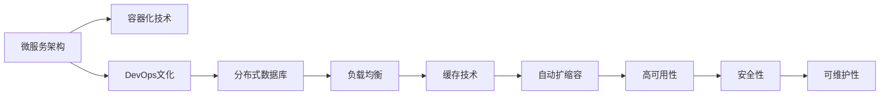

                 

## 1. 背景介绍

### 1.1 问题由来

在当今信息化时代，无论是企业级应用还是消费级应用，系统的扩展性都是其能否持续健康发展的重要保障。特别是在互联网和云服务行业，用户基数庞大，系统需要处理的数据量和请求量随着时间不断增长，如何设计高扩展性的系统架构成为了技术人员的共识和挑战。

随着互联网应用的不断发展，系统复杂度不断提升，系统的扩展性问题也愈发凸显。传统的单体应用已经难以适应现代业务的需求，分布式架构、微服务、DevOps、容器化等技术被广泛采用，以实现更灵活、更高效的扩展。然而，实践过程中，如何设计高扩展性的系统架构，仍然是一个复杂且具有挑战性的课题。

### 1.2 问题核心关键点

设计高扩展性的系统架构，关键在于构建一个能够灵活应对变化、高效处理请求、稳定保障服务的系统。具体来说，需要关注以下几个核心关键点：

- **系统模块化**：系统需要能够灵活地增加或减少模块，适应不同的业务需求。
- **弹性伸缩**：系统能够根据负载动态调整资源，确保系统的稳定性和性能。
- **分布式设计**：系统需要具备良好的分布式处理能力，避免单点故障和热点问题。
- **高可用性**：系统需要具备高可用性，减少停机时间，提高用户体验。
- **安全性**：系统需要具备足够的安全性，防止数据泄露和攻击。
- **可维护性**：系统需要易于维护，方便开发和运维人员对系统进行更新和修复。

本节将从上述关键点出发，系统地介绍高扩展性系统设计的最佳实践。

## 2. 核心概念与联系

### 2.1 核心概念概述

为更好地理解高扩展性系统设计，本节将介绍几个密切相关的核心概念：

- **微服务架构(Microservices Architecture)**：将系统拆分为多个独立的微服务模块，每个服务模块负责特定的功能。通过服务编排和接口调用，实现系统的灵活扩展和组合。
- **容器化技术(Containerization)**：将应用程序及其依赖打包在容器中，实现应用的快速部署、管理和运维。
- **DevOps文化(DevOps Culture)**：强调开发和运维团队的紧密合作，实现持续集成、持续交付、持续部署。
- **分布式数据库(Replicated and Partitioned Databases)**：将数据库设计为分布式，实现高可用性和高性能。
- **负载均衡(Load Balancing)**：通过负载均衡器将请求均匀分配到不同的服务器或实例上，避免单一节点的压力过大。
- **缓存技术(Caching)**：使用缓存技术，减少对数据库的直接访问，提高系统的响应速度。
- **自动扩缩容(Automatic Scaling)**：根据系统的负载情况，自动调整资源配置，实现弹性伸缩。

这些核心概念之间的逻辑关系可以通过以下Mermaid流程图来展示：



这个流程图展示了几大核心概念之间的关联：

1. **微服务架构**是系统的基础，通过服务拆分实现灵活的组合和扩展。
2. **容器化技术**提供了一种轻量级、可移植的应用部署方式，配合微服务架构，实现快速部署和运维。
3. **DevOps文化**强调开发和运维的协作，推动持续交付和交付。
4. **分布式数据库**和**负载均衡**提升系统的扩展性和可靠性，避免单点故障。
5. **缓存技术**和**自动扩缩容**则通过优化访问路径和资源配置，提高系统的性能和稳定性。

### 2.2 核心概念原理和架构的 Mermaid 流程图


这个流程图展示了高扩展性系统设计的核心概念及其相互关系。

## 3. 核心算法原理 & 具体操作步骤

### 3.1 算法原理概述

高扩展性系统设计的核心算法原理主要包括：

1. **服务拆分和编排**：通过微服务架构，将系统拆分为多个独立的模块，每个模块独立部署和扩展。
2. **容器化和持续交付**：将应用程序及其依赖打包在容器中，实现快速的部署和更新。
3. **自动扩缩容和负载均衡**：根据系统的负载情况，动态调整资源配置，实现弹性伸缩和负载均衡。
4. **分布式数据库和缓存技术**：将数据库设计为分布式，使用缓存技术减少对数据库的直接访问，提高系统性能。
5. **高可用性和安全性**：通过多副本和加密等手段，确保系统的稳定性和安全性。

### 3.2 算法步骤详解

高扩展性系统设计的一般步骤如下：

1. **需求分析**：明确业务需求和系统目标，确定系统的规模和复杂度。
2. **架构设计**：根据需求分析结果，设计系统的架构，确定服务拆分方式和模块划分。
3. **容器化和持续交付**：将应用程序及其依赖打包在容器中，实现持续集成和持续交付。
4. **数据库和缓存设计**：选择合适的数据库和缓存技术，设计分布式数据库和缓存系统。
5. **负载均衡和自动扩缩容**：配置负载均衡器，实现自动扩缩容和弹性伸缩。
6. **高可用性和安全性**：采用多副本和高可用性技术，确保系统的稳定性和安全性。
7. **监控和运维**：建立系统的监控和运维体系，实时监控系统性能，及时发现和解决问题。

### 3.3 算法优缺点

高扩展性系统设计的主要优点包括：

- **灵活性**：微服务架构和容器化技术使得系统能够快速适应业务变化和扩展需求。
- **可扩展性**：分布式数据库和缓存技术提高了系统的扩展性和性能。
- **可维护性**：模块化和容器化使得系统的维护更加简单和高效。
- **高可用性**：多副本和高可用性技术确保了系统的稳定性和可靠性。

同时，高扩展性系统设计也存在一些缺点：

- **复杂性**：系统架构的复杂性增加了设计和维护的难度。
- **通信开销**：微服务和容器化增加了系统内部的通信开销。
- **资源消耗**：分布式数据库和缓存技术的实现需要更多的硬件资源。

### 3.4 算法应用领域

高扩展性系统设计适用于各类互联网和云服务应用，包括但不限于以下领域：

- **电商系统**：电商系统的订单处理、库存管理、支付服务等模块可以通过微服务架构拆分，实现弹性伸缩和高可用性。
- **金融系统**：金融系统的交易处理、风险控制、用户管理等模块可以通过微服务架构拆分，确保系统的稳定性和安全性。
- **社交平台**：社交平台的用户管理、内容分发、社区治理等模块可以通过微服务架构拆分，实现高效的扩展和维护。
- **物联网系统**：物联网系统的设备管理、数据采集、应用服务等功能模块可以通过微服务架构拆分，实现灵活的组合和扩展。

## 4. 数学模型和公式 & 详细讲解 & 举例说明

### 4.1 数学模型构建

假设有一个电商平台，其订单处理模块有 $N$ 个实例，每个实例处理订单的速率固定为 $\mu$，处理一个订单的时间为 $T$。订单到达速率固定为 $\lambda$。系统采用负载均衡和自动扩缩容机制，根据负载情况动态调整实例数 $N$。

定义：
- $E$：订单平均等待时间
- $W$：订单等待时间的期望值
- $P$：订单处理的平均速率

### 4.2 公式推导过程

根据M/M/1队列模型，可以得到以下公式：

$$
E = \frac{T}{\mu}
$$

$$
W = E = \frac{T}{\mu}
$$

$$
P = \frac{1}{T}
$$

假设系统初始实例数为 $N_0$，系统负载为 $R$。根据Little's定律，可以得到以下关系：

$$
R = \lambda E = \frac{\lambda T}{\mu}
$$

假设系统采用固定实例数策略，即实例数始终为 $N_0$，则系统负载为：

$$
R = \frac{\lambda T}{\mu N_0}
$$

假设系统采用自动扩缩容策略，即实例数根据负载动态调整，则系统负载为：

$$
R = \lambda \cdot \frac{N}{N_0}
$$

其中 $N$ 为当前实例数，$N_0$ 为初始实例数。

### 4.3 案例分析与讲解

假设电商平台初始实例数为 10，每个实例处理订单的速率为 100 订单/秒，订单到达速率为 5000 订单/秒。则：

- 系统负载 $R = \frac{5000 \times T}{100 \times 10} = 50T$。
- 当系统负载 $R > 50T$ 时，系统采用自动扩缩容策略，实例数增加至 20。

假设系统负载为 60T，则实例数为 12，此时系统负载 $R = \frac{5000 \times T}{100 \times 12} = 50T$。

通过上述案例，我们可以看到，采用自动扩缩容策略，可以有效应对系统负载的变化，提高系统的稳定性和性能。

## 5. 项目实践：代码实例和详细解释说明

### 5.1 开发环境搭建

在进行系统实践前，我们需要准备好开发环境。以下是使用Docker和Kubernetes进行高扩展性系统开发的环境配置流程：

1. 安装Docker：从官网下载并安装Docker，用于创建和管理容器。
2. 安装Kubernetes：从官网下载并安装Kubernetes，用于容器编排和运维。
3. 配置Kubernetes集群：在多台服务器上安装Kubernetes集群，用于容器调度和管理。
4. 编写Dockerfile：定义应用程序及其依赖的容器镜像。
5. 创建Kubernetes Deployment和Service：定义容器实例和负载均衡规则。

完成上述步骤后，即可在Kubernetes集群上启动容器实例。

### 5.2 源代码详细实现

下面以电商系统的订单处理模块为例，给出使用Docker和Kubernetes进行高扩展性系统开发的代码实现。

1. 编写Dockerfile：
```Dockerfile
FROM python:3.8-slim

WORKDIR /app

COPY requirements.txt .
RUN pip install -r requirements.txt

COPY . .

CMD ["python", "app.py"]
```

2. 编写Kubernetes Deployment：
```yaml
apiVersion: apps/v1
kind: Deployment
metadata:
  name: order-service
spec:
  replicas: 3
  selector:
    matchLabels:
      app: order-service
  template:
    metadata:
      labels:
        app: order-service
    spec:
      containers:
      - name: order-service
        image: <docker-image>
        ports:
        - containerPort: 8080
```

3. 编写Kubernetes Service：
```yaml
apiVersion: v1
kind: Service
metadata:
  name: order-service
spec:
  selector:
    app: order-service
  ports:
  - port: 8080
    targetPort: 8080
  type: LoadBalancer
```

4. 在Kubernetes集群中创建Deployment和Service，启动容器实例。

### 5.3 代码解读与分析

让我们再详细解读一下关键代码的实现细节：

**Dockerfile**：
- 从Python 3.8镜像开始，创建应用目录。
- 安装应用程序依赖。
- 复制应用程序代码。
- 指定命令，启动应用程序。

**Kubernetes Deployment**：
- 定义Deployment的API版本、类型和元数据。
- 指定实例数量（replicas）。
- 定义选择器（selector），用于标记和选择容器实例。
- 定义模板（template），用于创建Pod。
- 定义容器（containers），指定容器镜像、端口和环境变量等。

**Kubernetes Service**：
- 定义Service的API版本、类型和元数据。
- 指定选择器（selector），用于选择容器实例。
- 定义端口（ports），指定Service的访问端口和容器实例的访问端口。
- 定义类型（type），指定Service的负载均衡方式。

通过上述代码，我们可以看到，使用Docker和Kubernetes进行高扩展性系统开发，能够方便地实现容器化、编排和运维，提升系统的灵活性和可扩展性。

### 5.4 运行结果展示

启动容器实例后，可以使用curl命令访问服务：

```
curl http://<load-balancer-ip>:8080
```

在多个实例之间进行负载均衡，确保系统的稳定性和性能。

## 6. 实际应用场景

### 6.1 电商系统

电商系统是典型的高扩展性系统，需要处理大量的订单、库存和支付等业务。采用微服务架构和容器化技术，可以将订单处理、库存管理、支付服务等功能模块拆分为独立的微服务，实现灵活的扩展和维护。

在订单处理模块中，可以采用自动扩缩容和负载均衡机制，根据订单到达速率动态调整容器实例数，确保系统的稳定性和性能。

### 6.2 金融系统

金融系统需要处理大量的交易、风险控制和用户管理等业务，系统需要具备高可用性和安全性。采用微服务架构和容器化技术，可以将交易处理、风险控制、用户管理等功能模块拆分为独立的微服务，实现灵活的扩展和维护。

在交易处理模块中，可以采用自动扩缩容和负载均衡机制，根据交易到达速率动态调整容器实例数，确保系统的稳定性和性能。同时，采用多副本和高可用性技术，确保系统的可靠性和安全性。

### 6.3 社交平台

社交平台需要处理大量的用户管理、内容分发和社区治理等业务，系统需要具备高扩展性和高可用性。采用微服务架构和容器化技术，可以将用户管理、内容分发、社区治理等功能模块拆分为独立的微服务，实现灵活的扩展和维护。

在用户管理模块中，可以采用自动扩缩容和负载均衡机制，根据用户登录和注册的到达速率动态调整容器实例数，确保系统的稳定性和性能。同时，采用多副本和高可用性技术，确保系统的可靠性和安全性。

### 6.4 物联网系统

物联网系统需要处理大量的设备管理、数据采集和应用服务等功能，系统需要具备灵活的组合和扩展能力。采用微服务架构和容器化技术，可以将设备管理、数据采集、应用服务等功能模块拆分为独立的微服务，实现灵活的组合和扩展。

在设备管理模块中，可以采用自动扩缩容和负载均衡机制，根据设备接入速率动态调整容器实例数，确保系统的稳定性和性能。同时，采用多副本和高可用性技术，确保系统的可靠性和安全性。

## 7. 工具和资源推荐

### 7.1 学习资源推荐

为了帮助开发者系统掌握高扩展性系统设计的理论基础和实践技巧，这里推荐一些优质的学习资源：

1. **《分布式系统原理与设计》**：深入讲解分布式系统的原理和设计方法，适合系统架构师阅读。
2. **《系统设计原理》**：讲解系统设计的通用原则和最佳实践，适合研发人员阅读。
3. **《微服务架构实战》**：通过实战案例，讲解微服务架构的实现方法，适合开发者阅读。
4. **《DevOps文化》**：讲解DevOps文化及其在持续交付和持续部署中的应用，适合运维和开发团队阅读。
5. **《Kubernetes权威指南》**：讲解Kubernetes的基础知识和最佳实践，适合Kubernetes用户阅读。

通过对这些资源的学习实践，相信你一定能够快速掌握高扩展性系统设计的精髓，并用于解决实际的系统问题。

### 7.2 开发工具推荐

高效的开发离不开优秀的工具支持。以下是几款用于高扩展性系统开发的常用工具：

1. **Docker**：容器化技术的核心工具，用于打包、部署和管理容器镜像。
2. **Kubernetes**：容器编排和运维的核心工具，用于调度和管理容器实例。
3. **Prometheus**：监控和告警系统，用于实时监控系统性能，设置异常告警。
4. **Grafana**：监控和告警系统的可视化工具，用于展示监控数据和告警信息。
5. **Jenkins**：持续集成和持续交付工具，用于自动化构建、测试和部署。

合理利用这些工具，可以显著提升高扩展性系统开发的效率，加快创新迭代的步伐。

### 7.3 相关论文推荐

高扩展性系统设计的研究源于学界的持续探索。以下是几篇奠基性的相关论文，推荐阅读：

1. **《分布式系统：概念与设计》**：讲解分布式系统的概念、设计方法和应用案例。
2. **《微服务架构模式》**：讲解微服务架构的多种模式和设计策略。
3. **《DevOps实践指南》**：讲解DevOps文化的实践方法，推动持续交付和持续部署。
4. **《高性能云计算系统设计》**：讲解云计算系统的高性能设计和优化方法。
5. **《Kubernetes：生产实践》**：讲解Kubernetes在生产环境中的使用和优化方法。

这些论文代表了大扩展性系统设计的发展脉络。通过学习这些前沿成果，可以帮助研究者把握学科前进方向，激发更多的创新灵感。

## 8. 总结：未来发展趋势与挑战

### 8.1 研究成果总结

本文对高扩展性系统设计的最佳实践进行了全面系统的介绍。首先阐述了系统扩展性的重要性和基本概念，明确了微服务架构、容器化、DevOps等技术对系统扩展性的提升作用。其次，从原理到实践，详细讲解了高扩展性系统设计的数学模型和操作步骤，给出了高扩展性系统开发的完整代码实例。同时，本文还广泛探讨了高扩展性系统在电商、金融、社交平台等实际应用场景中的应用前景，展示了高扩展性系统设计的巨大潜力。最后，本文精选了高扩展性系统设计的学习资源、开发工具和相关论文，力求为读者提供全方位的技术指引。

通过本文的系统梳理，我们可以看到，高扩展性系统设计已经成为系统架构的重要组成部分，通过灵活的微服务架构、高效的容器化技术、协作的DevOps文化，实现系统的灵活扩展、高效运维和持续交付。未来，随着云原生技术和大数据技术的不断发展，高扩展性系统设计也将迎来新的突破，为系统架构的创新迭代注入新的动力。

### 8.2 未来发展趋势

展望未来，高扩展性系统设计将呈现以下几个发展趋势：

1. **云原生技术的广泛应用**：云原生技术（如Kubernetes、Docker、微服务等）将进一步普及，成为高扩展性系统设计的主流技术。
2. **智能化运维的崛起**：结合人工智能和机器学习技术，实现自动化的运维监控和管理。
3. **微服务架构的深化**：微服务架构将更加精细化、模块化，实现更高效的组合和扩展。
4. **分布式数据库的演进**：分布式数据库将进一步优化，支持更大规模、更高效的数据处理。
5. **边缘计算的应用**：边缘计算技术将广泛应用于高扩展性系统设计中，实现更快速、更可靠的数据处理。
6. **自动化工具的提升**：持续集成、持续交付和持续部署工具将进一步优化，提升系统的开发效率和质量。

以上趋势凸显了高扩展性系统设计的广阔前景。这些方向的探索发展，必将进一步提升系统的灵活性、高效性和稳定性，推动系统架构的持续优化和创新。

### 8.3 面临的挑战

尽管高扩展性系统设计已经取得了瞩目成就，但在迈向更加智能化、普适化应用的过程中，它仍面临着诸多挑战：

1. **系统复杂性增加**：微服务架构和容器化技术增加了系统的复杂性，设计和维护的难度也随之增加。
2. **通信开销增加**：微服务和容器化增加了系统内部的通信开销，对网络带宽和处理能力提出了更高要求。
3. **资源消耗增加**：分布式数据库和缓存技术需要更多的硬件资源，成本较高。
4. **安全性问题突出**：微服务架构增加了系统攻击面，数据泄露和攻击的风险也随之增加。
5. **故障排查困难**：系统复杂度增加，故障排查和问题定位变得困难。
6. **性能瓶颈**：高扩展性系统设计需要在性能、稳定性和可扩展性之间找到平衡，避免性能瓶颈。

### 8.4 研究展望

面对高扩展性系统设计所面临的挑战，未来的研究需要在以下几个方面寻求新的突破：

1. **自动化运维工具的提升**：结合人工智能和机器学习技术，实现自动化的运维监控和管理，减少人工干预。
2. **微服务架构的优化**：采用更加精细化、模块化的微服务架构，实现更高效的组合和扩展。
3. **分布式数据库的优化**：优化分布式数据库的性能和可靠性，支持更大规模的数据处理。
4. **边缘计算的应用**：探索边缘计算技术在高扩展性系统设计中的应用，实现更快速、更可靠的数据处理。
5. **故障恢复机制的改进**：建立更完善的故障恢复机制，确保系统的可靠性和稳定性。
6. **安全性策略的加强**：加强系统的安全性策略，防止数据泄露和攻击。

这些研究方向的探索，必将引领高扩展性系统设计迈向更高的台阶，为系统的灵活性、高效性和稳定性带来新的突破。

## 9. 附录：常见问题与解答

**Q1：高扩展性系统设计的关键点有哪些？**

A: 高扩展性系统设计的关键点包括：
1. **微服务架构**：将系统拆分为多个独立的微服务模块，实现灵活的组合和扩展。
2. **容器化和持续交付**：将应用程序及其依赖打包在容器中，实现快速的部署和更新。
3. **分布式数据库和缓存技术**：提高系统的扩展性和性能，减少对数据库的直接访问。
4. **自动扩缩容和负载均衡**：根据系统的负载情况，动态调整资源配置，实现弹性伸缩和负载均衡。
5. **高可用性和安全性**：采用多副本和高可用性技术，确保系统的稳定性和安全性。

**Q2：如何选择适合的高扩展性系统设计方案？**

A: 选择适合的高扩展性系统设计方案需要考虑以下几个因素：
1. **业务需求**：根据业务需求和系统目标，确定系统的规模和复杂度。
2. **技术栈**：选择适合的技术栈和工具，如微服务架构、容器化、持续交付等。
3. **可扩展性**：选择具有良好可扩展性的方案，支持动态调整实例数和负载均衡。
4. **高可用性和安全性**：选择具有高可用性和安全性的方案，确保系统的稳定性和可靠性。
5. **可维护性**：选择易于维护和迭代的方案，方便开发和运维团队对系统进行更新和修复。

**Q3：如何设计高扩展性系统架构？**

A: 设计高扩展性系统架构需要考虑以下几个步骤：
1. **需求分析**：明确业务需求和系统目标，确定系统的规模和复杂度。
2. **架构设计**：根据需求分析结果，设计系统的架构，确定服务拆分方式和模块划分。
3. **容器化和持续交付**：将应用程序及其依赖打包在容器中，实现持续集成和持续交付。
4. **数据库和缓存设计**：选择合适的数据库和缓存技术，设计分布式数据库和缓存系统。
5. **负载均衡和自动扩缩容**：配置负载均衡器，实现自动扩缩容和弹性伸缩。
6. **高可用性和安全性**：采用多副本和高可用性技术，确保系统的稳定性和安全性。
7. **监控和运维**：建立系统的监控和运维体系，实时监控系统性能，及时发现和解决问题。

**Q4：高扩展性系统设计面临的挑战有哪些？**

A: 高扩展性系统设计面临的挑战包括：
1. **系统复杂性增加**：微服务架构和容器化技术增加了系统的复杂性，设计和维护的难度也随之增加。
2. **通信开销增加**：微服务和容器化增加了系统内部的通信开销，对网络带宽和处理能力提出了更高要求。
3. **资源消耗增加**：分布式数据库和缓存技术需要更多的硬件资源，成本较高。
4. **安全性问题突出**：微服务架构增加了系统攻击面，数据泄露和攻击的风险也随之增加。
5. **故障排查困难**：系统复杂度增加，故障排查和问题定位变得困难。
6. **性能瓶颈**：高扩展性系统设计需要在性能、稳定性和可扩展性之间找到平衡，避免性能瓶颈。

**Q5：如何提升高扩展性系统的性能？**

A: 提升高扩展性系统的性能需要考虑以下几个方面：
1. **负载均衡**：使用负载均衡器将请求均匀分配到不同的服务器或实例上，避免单一节点的压力过大。
2. **自动扩缩容**：根据系统的负载情况，动态调整资源配置，实现弹性伸缩。
3. **缓存技术**：使用缓存技术，减少对数据库的直接访问，提高系统的响应速度。
4. **数据库优化**：优化数据库的性能和可靠性，支持更大规模的数据处理。
5. **边缘计算**：探索边缘计算技术在高扩展性系统设计中的应用，实现更快速、更可靠的数据处理。
6. **持续优化**：结合监控和反馈机制，不断优化系统性能，提升用户体验。

通过上述方法，可以显著提升高扩展性系统的性能，满足业务需求和用户期待。

---

作者：禅与计算机程序设计艺术 / Zen and the Art of Computer Programming

