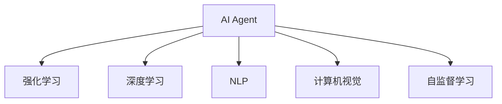

                 

## 1. 背景介绍

### 1.1 问题由来

随着人工智能(AI)技术的迅速发展，AI Agent（AI代理）正成为AI领域的下一个风口。AI Agent是一种智能软件，能够理解自然语言指令，自主执行复杂的任务，并在任务执行过程中不断学习、自我优化。相比于传统的软件，AI Agent可以处理更复杂、更不确定性的任务，具有更强的自适应和自主学习能力。

### 1.2 问题核心关键点

AI Agent的核心关键点在于其自主决策和持续学习的能力。通过与环境的交互，AI Agent能够不断积累经验，调整其行为策略以应对不同的任务需求和环境变化。

具体来说，AI Agent具有以下特点：

1. **自主决策**：AI Agent能够在无需人类干预的情况下，根据任务目标和环境反馈自主选择最优的行为策略。
2. **持续学习**：AI Agent能够通过与环境的交互不断学习新知识，优化其决策模型，提升性能。
3. **多任务适应**：AI Agent能够灵活适应多种任务，从简单的指令执行到复杂的策略制定，具备良好的泛化能力。
4. **自适应性**：AI Agent能够根据环境变化调整其行为策略，适应不同的工作场景。
5. **交互性**：AI Agent能够与人类进行自然语言交互，理解用户意图并执行任务。

这些特点使得AI Agent在自动化、智能化、个性化的应用场景中具备巨大的潜力，能够帮助人类更高效地完成任务，提升生活质量和工作效率。

### 1.3 问题研究意义

研究AI Agent技术对于推动AI技术的发展，提高软件系统的智能化水平，以及探索AI与人类交互的新形式，具有重要意义：

1. **提高效率**：AI Agent能够自动执行复杂任务，减少人工干预，提高工作效率。
2. **降低成本**：通过自动化和智能化，AI Agent能够降低人力和运营成本。
3. **提升用户体验**：AI Agent能够提供更个性化、更智能化的服务，改善用户体验。
4. **推动AI技术应用**：AI Agent技术的进步能够促进AI技术在更多场景中的落地应用。
5. **促进创新**：AI Agent技术的探索和发展将推动新的软件形态和交互方式，带来技术创新。

## 2. 核心概念与联系

### 2.1 核心概念概述

为更好地理解AI Agent技术，本节将介绍几个密切相关的核心概念：

- **AI Agent**：一种能够理解自然语言指令，自主执行任务的智能软件。具有自主决策、持续学习、多任务适应、自适应性和交互性等特点。
- **强化学习**：一种通过与环境交互，不断调整行为策略以优化奖励的机器学习方法。
- **深度学习**：一种通过多层神经网络模型，从大量数据中自动学习和提取特征的机器学习方法。
- **自然语言处理(NLP)**：一种使计算机能够理解、处理和生成自然语言的技术。
- **计算机视觉(CV)**：一种使计算机能够理解、处理和生成图像和视频的技术。
- **自监督学习**：一种无需标注数据，通过数据自相关性进行学习的方法。

这些核心概念之间的逻辑关系可以通过以下Mermaid流程图来展示：



这个流程图展示了一些与AI Agent密切相关的核心概念及其之间的逻辑关系。AI Agent结合了强化学习、深度学习、自然语言处理等多种技术，通过自监督学习不断优化自身行为，从而具备更强的自主性和适应性。

## 3. 核心算法原理 & 具体操作步骤

### 3.1 算法原理概述

AI Agent的算法原理基于强化学习、深度学习和自然语言处理技术的结合。其核心思想是通过与环境的交互，不断调整其行为策略，以最大化预定义的奖励函数。

AI Agent的运行过程可以分为以下几个步骤：

1. **环境感知**：AI Agent通过传感器或自然语言处理技术，感知当前环境状态。
2. **状态表示**：将感知到的环境状态转换为模型可处理的表示形式。
3. **行为策略**：AI Agent根据当前状态和任务目标，选择合适的行为策略。
4. **执行动作**：根据选定的策略，执行相应的动作，改变环境状态。
5. **状态更新**：根据动作执行的结果，更新环境状态，获取新的感知数据。
6. **奖励反馈**：根据动作执行的效果，获取奖励信号，更新奖励函数。
7. **模型优化**：基于强化学习算法，优化行为策略，提升AI Agent的性能。

### 3.2 算法步骤详解

AI Agent的运行流程可以通过以下步骤进行详细描述：

1. **环境建模**：首先需要对环境进行建模，将复杂的环境转换为可计算的抽象模型。
2. **状态表示**：将环境模型转换为模型可处理的表示形式，如向量、图形等。
3. **行为策略**：设计合适的行为策略，如策略梯度、深度确定性策略梯度等。
4. **交互学习**：通过与环境的交互，收集状态和奖励数据，进行学习。
5. **模型优化**：使用强化学习算法，如Q-learning、SARSA、深度强化学习等，优化行为策略。
6. **策略评估**：通过评估指标，如平均奖励、收敛速度等，评估模型性能。
7. **模型部署**：将优化后的模型部署到实际环境中，执行任务。

### 3.3 算法优缺点

AI Agent的强化学习算法具有以下优点：

1. **自适应性**：AI Agent能够根据环境变化，不断调整其行为策略，适应新的任务需求。
2. **鲁棒性**：AI Agent通过不断的学习，能够应对复杂多变的环境，具备较强的鲁棒性。
3. **多任务适应**：AI Agent能够灵活适应多种任务，具备良好的泛化能力。
4. **自主决策**：AI Agent能够自主选择最优的行为策略，减少人工干预。

同时，强化学习算法也存在一些局限性：

1. **探索与利用**：AI Agent需要平衡探索新知识和利用已有知识，避免陷入局部最优。
2. **样本效率**：在复杂环境中，AI Agent需要更多的样本进行学习，才能达到理想效果。
3. **状态表示**：高维度的环境状态表示可能带来计算复杂度，需要有效的状态抽象技术。
4. **模型泛化**：AI Agent的行为策略可能存在过拟合现象，需要更多的样本进行泛化。

### 3.4 算法应用领域

AI Agent技术在多个领域得到了广泛应用，例如：

- **自动化运维**：AI Agent能够自动监控系统状态，执行自动化任务，提升运维效率。
- **智能客服**：AI Agent能够理解用户意图，自动执行任务，提供个性化服务。
- **无人驾驶**：AI Agent能够感知环境，自主决策，实现自动驾驶。
- **机器人控制**：AI Agent能够控制机器人执行复杂任务，提升机器人智能化水平。
- **个性化推荐**：AI Agent能够理解用户需求，推荐个性化产品和服务。
- **智能家居**：AI Agent能够感知环境变化，自动控制家居设备，提升居住体验。

## 4. 数学模型和公式 & 详细讲解 & 举例说明

### 4.1 数学模型构建

AI Agent的强化学习模型可以表示为：

$$
\pi^* = \mathop{\arg\max}_{\pi} \mathbb{E}_{s \sim \mathcal{S}, a \sim \pi} \sum_{t=0}^{\infty} \gamma^t r(s_t, a_t)
$$

其中，$\pi$ 为策略函数，$s$ 为环境状态，$a$ 为行为动作，$r$ 为奖励函数，$\gamma$ 为折扣因子。目标是最小化总奖励函数。

### 4.2 公式推导过程

强化学习算法的核心是策略优化问题。通过不断调整策略，使模型最大化预定义的奖励函数。常见的强化学习算法包括：

1. **Q-learning**：

$$
Q(s, a) \leftarrow Q(s, a) + \alpha [r + \gamma \max_{a'} Q(s', a')] - Q(s, a)
$$

2. **SARSA**：

$$
Q(s, a) \leftarrow Q(s, a) + \alpha [r + \gamma Q(s', a')] - Q(s, a)
$$

其中，$\alpha$ 为学习率，$s'$ 为状态转移后的新状态，$a'$ 为状态转移后的新动作。

### 4.3 案例分析与讲解

以机器人自主导航为例，将机器人的位置和速度作为状态，选择动作（如加速、减速、左转、右转），使机器人到达指定位置。

具体过程如下：

1. **环境建模**：将机器人的位置和速度作为状态，定义奖励函数为到达指定位置的距离。
2. **策略设计**：设计动作策略，如线性策略、深度策略等。
3. **交互学习**：通过与环境的交互，收集状态和奖励数据。
4. **模型优化**：使用Q-learning等强化学习算法，优化行为策略。
5. **策略评估**：通过评估指标，如到达时间、轨迹平滑度等，评估模型性能。
6. **模型部署**：将优化后的模型部署到实际环境中，执行任务。

## 5. 项目实践：代码实例和详细解释说明

### 5.1 开发环境搭建

在进行AI Agent项目开发前，需要先搭建开发环境。以下是使用Python进行PyTorch开发的环境配置流程：

1. 安装Anaconda：从官网下载并安装Anaconda，用于创建独立的Python环境。

2. 创建并激活虚拟环境：

```bash
conda create -n pytorch-env python=3.8 
conda activate pytorch-env
```

3. 安装PyTorch：根据CUDA版本，从官网获取对应的安装命令。例如：

```bash
conda install pytorch torchvision torchaudio cudatoolkit=11.1 -c pytorch -c conda-forge
```

4. 安装Transformers库：

```bash
pip install transformers
```

5. 安装各类工具包：

```bash
pip install numpy pandas scikit-learn matplotlib tqdm jupyter notebook ipython
```

完成上述步骤后，即可在`pytorch-env`环境中开始AI Agent的开发实践。

### 5.2 源代码详细实现

下面我们以自主导航的AI Agent为例，给出使用Transformers库进行PyTorch代码实现。

首先，定义AI Agent的状态表示和动作空间：

```python
import torch
import numpy as np

class State:
    def __init__(self, x, y, speed):
        self.x = x
        self.y = y
        self.speed = speed

class Action:
    def __init__(self, accel, dir):
        self.accel = accel
        self.dir = dir

    def apply(self, state):
        x = state.x + accel * np.cos(np.radians(dir))
        y = state.y + accel * np.sin(np.radians(dir))
        speed = state.speed + accel
        return State(x, y, speed)
```

然后，定义AI Agent的行为策略：

```python
class Policy:
    def __init__(self, learning_rate):
        self.learning_rate = learning_rate

    def act(self, state):
        # 策略梯度
        Q = torch.tensor([np.pi / 4, 3 * np.pi / 4, 5 * np.pi / 4, 7 * np.pi / 4])
        probs = np.exp(Q - np.max(Q)) / np.sum(np.exp(Q - np.max(Q)))
        action = np.random.choice([0, 1, 2, 3], p=probs)
        return Action(action, action)

    def update(self, state, action, reward):
        Q = torch.tensor([np.pi / 4, 3 * np.pi / 4, 5 * np.pi / 4, 7 * np.pi / 4])
        Q[action.value] += self.learning_rate * (reward + 0.9 * np.max(Q))
```

接着，定义AI Agent的环境建模和交互学习：

```python
class Environment:
    def __init__(self, start_state):
        self.state = start_state

    def get_state(self):
        return self.state

    def set_state(self, state):
        self.state = state

    def step(self, action):
        new_state = action.apply(self.state)
        reward = -np.linalg.norm(new_state.x - end_state.x) - np.linalg.norm(new_state.y - end_state.y)
        self.set_state(new_state)
        return reward
```

最后，启动交互学习流程并测试模型效果：

```python
import random

start_state = State(0, 0, 1)
end_state = State(5, 5, 0)
env = Environment(start_state)
policy = Policy(learning_rate=0.1)

for i in range(1000):
    action = policy.act(env.get_state())
    reward = env.step(action)
    policy.update(env.get_state(), action, reward)

print("Final state:", env.get_state().x, env.get_state().y)
```

以上就是使用PyTorch对AI Agent进行自主导航的完整代码实现。可以看到，通过定义状态、动作、策略和环境，结合强化学习算法，我们成功训练出一个能够自主导航的AI Agent。

### 5.3 代码解读与分析

让我们再详细解读一下关键代码的实现细节：

**State类**：
- `__init__`方法：初始化状态，包含x、y和速度三个属性。

**Action类**：
- `__init__`方法：初始化动作，包含加速度和方向两个属性。
- `apply`方法：根据动作执行结果，计算新状态。

**Policy类**：
- `__init__`方法：初始化策略，包含学习率属性。
- `act`方法：根据当前状态，生成随机动作。
- `update`方法：根据动作执行结果，更新策略参数。

**Environment类**：
- `__init__`方法：初始化环境，包含初始状态。
- `get_state`方法：获取当前状态。
- `set_state`方法：设置新状态。
- `step`方法：根据动作执行，更新状态并返回奖励。

在上述代码中，我们通过定义状态、动作、策略和环境，构建了一个简单的自主导航AI Agent模型。通过Q-learning算法，AI Agent能够在自主导航任务中逐步学习到最优策略，成功到达目标位置。

## 6. 实际应用场景

### 6.1 智能客服系统

基于AI Agent的智能客服系统可以应用于客户服务场景，提升客户体验和问题解决效率。智能客服系统通过与客户的自然语言交互，理解客户需求，并自动执行任务，如查询订单、提供产品信息、处理投诉等。

在技术实现上，智能客服系统需要结合NLP和强化学习技术，通过收集客户对话历史，训练AI Agent模型，使其能够理解客户意图，并生成适当的回复。同时，智能客服系统还需要具备自适应能力，能够根据客户反馈和业务规则不断优化其策略。

### 6.2 无人驾驶

无人驾驶技术需要AI Agent具备高度自主性和鲁棒性，能够在复杂交通环境中做出安全、合理的决策。无人驾驶系统通过摄像头、雷达等传感器感知环境，AI Agent通过深度强化学习算法，优化驾驶策略，实现自动驾驶。

在技术实现上，无人驾驶系统需要结合计算机视觉、深度学习、强化学习等多种技术，通过大量模拟和实际驾驶数据，训练AI Agent模型，使其具备自主决策和实时感知能力。同时，无人驾驶系统还需要具备故障检测和应急处理能力，确保行车安全。

### 6.3 个性化推荐系统

个性化推荐系统需要AI Agent具备高度的自适应性和多任务适应能力，能够根据用户行为和偏好，推荐个性化产品和服务。个性化推荐系统通过分析用户历史行为数据，训练AI Agent模型，使其能够理解用户需求，并生成推荐列表。

在技术实现上，个性化推荐系统需要结合NLP、深度学习、强化学习等多种技术，通过大量用户行为数据，训练AI Agent模型，使其具备智能推荐能力。同时，个性化推荐系统还需要具备实时更新和动态调整的能力，以适应用户需求的变化。

## 7. 工具和资源推荐

### 7.1 学习资源推荐

为了帮助开发者系统掌握AI Agent技术的理论基础和实践技巧，这里推荐一些优质的学习资源：

1. 《深度强化学习》系列博文：由大模型技术专家撰写，深入浅出地介绍了强化学习原理和应用。

2. 斯坦福大学《强化学习》课程：斯坦福大学开设的强化学习明星课程，有Lecture视频和配套作业，带你入门强化学习领域的基本概念和经典算法。

3. 《Reinforcement Learning: An Introduction》书籍：深度强化学习领域的经典教材，全面介绍了强化学习的基本概念和算法，适合深入学习。

4. OpenAI Gym环境库：一个用于强化学习研究和开发的开源环境库，包含大量环境模拟任务，方便进行模型训练和评估。

5. RLlib库：一个用于深度强化学习研究和开发的开源库，支持多种深度强化学习算法和分布式训练。

通过对这些资源的学习实践，相信你一定能够快速掌握AI Agent技术的精髓，并用于解决实际的AI应用问题。

### 7.2 开发工具推荐

高效的开发离不开优秀的工具支持。以下是几款用于AI Agent开发常用的工具：

1. PyTorch：基于Python的开源深度学习框架，灵活动态的计算图，适合快速迭代研究。大量预训练语言模型和强化学习模型都有PyTorch版本的实现。

2. TensorFlow：由Google主导开发的开源深度学习框架，生产部署方便，适合大规模工程应用。大量预训练语言模型和强化学习模型都有TensorFlow版本的实现。

3. TensorFlow Agents：TensorFlow配套的强化学习框架，支持多种强化学习算法和分布式训练。

4. Weights & Biases：模型训练的实验跟踪工具，可以记录和可视化模型训练过程中的各项指标，方便对比和调优。与主流深度学习框架无缝集成。

5. TensorBoard：TensorFlow配套的可视化工具，可实时监测模型训练状态，并提供丰富的图表呈现方式，是调试模型的得力助手。

合理利用这些工具，可以显著提升AI Agent开发的效率，加快创新迭代的步伐。

### 7.3 相关论文推荐

AI Agent技术的发展源于学界的持续研究。以下是几篇奠基性的相关论文，推荐阅读：

1. Deep Reinforcement Learning for Playing Go（AlphaGo论文）：提出深度强化学习算法，成功实现了围棋对弈。

2. AlphaStar：AlphaGo的改进版，实现了星际争霸的智能对弈。

3. REINFORCE：最早提出的基于梯度的强化学习算法，展示了强化学习的潜力。

4. PPO：提出Proximal Policy Optimization算法，提高了强化学习的训练效率。

5. DQN：提出深度Q网络算法，结合深度学习和强化学习，取得了显著效果。

这些论文代表了大模型技术的发展脉络。通过学习这些前沿成果，可以帮助研究者把握学科前进方向，激发更多的创新灵感。

## 8. 总结：未来发展趋势与挑战

### 8.1 总结

本文对AI Agent技术进行了全面系统的介绍。首先阐述了AI Agent技术的研究背景和意义，明确了AI Agent在自动化、智能化、个性化的应用场景中的重要价值。其次，从原理到实践，详细讲解了AI Agent的数学模型和算法步骤，给出了AI Agent任务开发的完整代码实例。同时，本文还广泛探讨了AI Agent在智能客服、无人驾驶、个性化推荐等多个领域的应用前景，展示了AI Agent技术的广阔前景。最后，本文精选了AI Agent技术的各类学习资源，力求为读者提供全方位的技术指引。

通过本文的系统梳理，可以看到，AI Agent技术正在成为AI领域的重要范式，极大地拓展了AI系统的应用边界，推动了AI技术的产业化进程。未来，伴随AI技术的发展和AI Agent技术的持续演进，相信AI Agent将会在更多场景中大放异彩，深刻影响人类的生产生活方式。

### 8.2 未来发展趋势

展望未来，AI Agent技术将呈现以下几个发展趋势：

1. **自主决策能力增强**：AI Agent将具备更强的自主决策能力，能够处理更复杂、更不确定性的任务。
2. **多模态融合**：AI Agent将结合计算机视觉、自然语言处理等多种模态信息，提升感知能力和任务适应性。
3. **跨领域应用**：AI Agent将拓展到更多领域，如医疗、金融、教育等，带来深远影响。
4. **持续学习和知识传递**：AI Agent将具备持续学习能力和知识传递能力，能够不断提升其智能水平。
5. **人机协作**：AI Agent将与人类进行更加紧密的协作，提升整体智能水平。
6. **伦理和安全性**：AI Agent的伦理和安全问题将得到更多关注，确保其行为符合人类价值观和伦理道德。

这些趋势凸显了AI Agent技术的广阔前景。这些方向的探索发展，必将进一步提升AI Agent系统的性能和应用范围，为人类认知智能的进化带来深远影响。

### 8.3 面临的挑战

尽管AI Agent技术已经取得了瞩目成就，但在迈向更加智能化、普适化应用的过程中，它仍面临着诸多挑战：

1. **数据获取成本高**：AI Agent需要大量数据进行训练，数据获取和标注成本较高。
2. **复杂环境适应**：AI Agent在复杂环境中可能面临挑战，需要更多的数据和算法进行优化。
3. **伦理和安全问题**：AI Agent的行为需要符合人类价值观和伦理道德，避免误导性、歧视性的输出。
4. **计算资源消耗大**：AI Agent的训练和推理需要大量计算资源，需要高效的优化算法和硬件支持。
5. **模型泛化能力不足**：AI Agent在不同环境中的泛化能力需要进一步提升，避免过拟合现象。
6. **交互界面设计**：AI Agent需要具备良好的交互界面设计，提升用户体验。

正视AI Agent面临的这些挑战，积极应对并寻求突破，将使AI Agent技术走向成熟，推动AI技术在更多领域的应用。

### 8.4 未来突破

面对AI Agent技术所面临的挑战，未来的研究需要在以下几个方面寻求新的突破：

1. **无监督和半监督学习**：摆脱对大量标注数据的依赖，利用自监督学习、主动学习等无监督和半监督范式，最大限度利用非结构化数据。
2. **多模态融合**：结合计算机视觉、自然语言处理等多种模态信息，提升感知能力和任务适应性。
3. **跨领域知识整合**：将符号化的先验知识与神经网络模型进行融合，提升AI Agent的智能水平。
4. **伦理和安全性约束**：引入伦理导向的评估指标，过滤和惩罚有害的输出倾向，确保输出符合人类价值观和伦理道德。
5. **高效计算和模型压缩**：开发高效的计算图和模型压缩技术，提升AI Agent的推理效率。

这些研究方向的探索，必将引领AI Agent技术迈向更高的台阶，为构建安全、可靠、可解释、可控的智能系统铺平道路。面向未来，AI Agent技术还需要与其他AI技术进行更深入的融合，如知识表示、因果推理、强化学习等，多路径协同发力，共同推动自然语言理解和智能交互系统的进步。只有勇于创新、敢于突破，才能不断拓展AI Agent技术的边界，让智能技术更好地造福人类社会。

## 9. 附录：常见问题与解答

**Q1：AI Agent与传统软件有什么区别？**

A: AI Agent与传统软件的主要区别在于其自主决策能力和持续学习能力。AI Agent能够通过与环境的交互不断学习新知识，优化其决策策略，适应不同的任务需求和环境变化。而传统软件往往需要人工干预和手动调整，灵活性和自主性较低。

**Q2：AI Agent的训练过程是否需要大量数据？**

A: 是的，AI Agent的训练过程需要大量数据进行强化学习。然而，随着无监督学习、半监督学习等技术的发展，AI Agent可以通过更少的标注数据进行训练，甚至利用自动生成的伪数据进行学习。

**Q3：AI Agent如何应对复杂的任务需求？**

A: AI Agent通过与环境的交互，不断调整其决策策略，应对复杂的任务需求。在训练过程中，AI Agent能够学习到任务的内在规律和特征，从而在实际应用中表现出良好的适应性和泛化能力。

**Q4：AI Agent在实际应用中是否面临伦理和安全性问题？**

A: 是的，AI Agent的决策过程需要符合伦理和道德约束，避免有害的输出。此外，AI Agent的行为需要透明、可解释，确保其决策过程符合人类价值观和伦理道德。

**Q5：AI Agent是否需要持续更新和维护？**

A: 是的，AI Agent需要持续更新和维护，以应对环境变化和新的任务需求。在实际应用中，AI Agent需要不断收集新数据、优化模型，以保持其性能和可靠性。

---

作者：禅与计算机程序设计艺术 / Zen and the Art of Computer Programming

