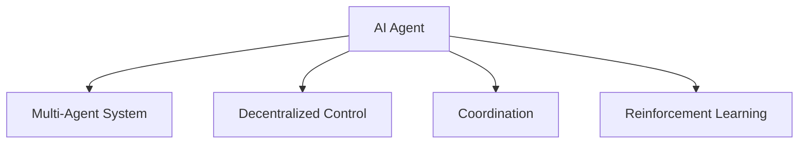

                 

# AI Agent: AI的下一个风口 从ChatGPT到智能体

> 关键词：AI Agent, AI, ChatGPT, 智能体, 强化学习, 多智能体系统, 知识图谱, 代理学习, 推荐系统

## 1. 背景介绍

### 1.1 问题由来

自2018年GPT-3发布以来，大语言模型在自然语言处理（NLP）领域取得了巨大成功，实现了从文本生成到推理问答的突破。然而，大模型在执行结构化任务、具有环境感知和交互能力的智能体方面仍存在巨大差距。近年来，多智能体系统（Multi-Agent System,MAS）的兴起为这一难题提供了新的解决方案。

多智能体系统是由多个智能体（Agent）组成的系统，每个智能体通过学习并交互来达成共同目标。与传统的单智能体AI相比，多智能体系统更能模拟现实世界中人类和社会的多样性和复杂性。从自动驾驶到智能电网，从协作机器人到社交网络，多智能体系统将在各个领域实现大放异彩。

### 1.2 问题核心关键点

多智能体系统在当前AI领域的地位和重要性主要体现在以下几个方面：

1. **多样性：** 真实世界的复杂性远超单个智能体所能处理的情况。多智能体系统通过分布式协作，可以更好地处理多变、复杂的任务环境。

2. **环境感知：** 每个智能体可以独立感知局部环境信息，相互协作则能获取全局信息，提高决策的准确性。

3. **动态交互：** 智能体之间的交互可以提高系统应对突发事件的能力，增强系统的灵活性和适应性。

4. **协同优化：** 多个智能体可以通过协调行动，提升整体系统的性能，例如在多机器协同生产、交通调度等领域。

5. **可扩展性：** 多智能体系统可以在任意规模下扩展，适应从简单到复杂的各种任务。

这些核心特性使得多智能体系统成为未来AI的重要发展方向，其前景不可限量。

### 1.3 问题研究意义

研究多智能体系统对于推动AI技术的发展具有重大意义：

1. **模拟复杂场景：** 多智能体系统为AI技术提供了模拟真实复杂场景的机会，促进了AI技术的全面发展。
2. **提升系统性能：** 多智能体系统可以通过协作增强系统的鲁棒性和应对能力，提升整体系统性能。
3. **加速落地应用：** 多智能体系统在多个领域的应用前景广阔，将加速AI技术的产业化进程。
4. **推动AI伦理：** 多智能体系统使得AI系统更加透明和可控，推动AI伦理和规范的发展。

## 2. 核心概念与联系

### 2.1 核心概念概述

为更好地理解多智能体系统的核心概念，本节将介绍几个密切相关的核心概念：

- **AI Agent（智能体）：** 多智能体系统中的单个实体，具有感知、学习、决策和行动的能力。
- **Multi-Agent System（多智能体系统）：** 由多个智能体组成的系统，通过协作完成任务或达成目标。
- **Decentralized Control（分布式控制）：** 多智能体系统中的智能体之间无中心协调，通过自主决策达成共识。
- **Coordination（协调）：** 多个智能体之间通过通信与信息交换，协同完成任务。
- **Reinforcement Learning（强化学习）：** 智能体通过与环境的交互学习最优策略，通过奖励和惩罚机制提升表现。

这些核心概念之间的逻辑关系可以通过以下Mermaid流程图来展示：



这个流程图展示多智能体系统的核心概念及其之间的关系：

1. **AI Agent（智能体）：** 多智能体系统的基本组成单元。
2. **Multi-Agent System（多智能体系统）：** 智能体通过协作组成的多智能体系统。
3. **Decentralized Control（分布式控制）：** 多个智能体之间无中心协调，自主决策。
4. **Coordination（协调）：** 智能体通过通信与信息交换，协同完成任务。
5. **Reinforcement Learning（强化学习）：** 智能体通过与环境的交互学习最优策略。

这些概念共同构成了多智能体系统的核心框架，为其提供了丰富的理论基础。

## 3. 核心算法原理 & 具体操作步骤
### 3.1 算法原理概述

多智能体系统的核心算法原理是强化学习（Reinforcement Learning, RL），其目的是使智能体学习出最优策略，以最大化期望的累积奖励。强化学习通常包含以下几个核心要素：

- **智能体（Agent）：** 智能体是系统的决策者，通过与环境交互，学习最优策略。
- **环境（Environment）：** 环境是智能体所处的外部世界，其状态和奖励信号对智能体决策产生影响。
- **状态（State）：** 环境当前的状态，智能体基于状态执行决策。
- **行动（Action）：** 智能体对环境执行的具体操作。
- **奖励（Reward）：** 环境对智能体行动的反馈，引导智能体学习最优策略。

强化学习的目标是通过不断迭代，使智能体学习出最大化累积奖励的策略。基于此，多智能体系统中的每个智能体也可以通过强化学习算法独立学习最优策略，并在协作中达成全局最优。

### 3.2 算法步骤详解

多智能体系统中的智能体通常通过以下步骤进行强化学习：

**Step 1: 定义智能体和环境**

- 定义智能体的行动空间和状态空间。例如，智能体在控制机器人时的行动空间可以是`{左转，右转，静止}`，状态空间可以是`{停止，行驶中，阻碍物}`。
- 定义环境的奖励函数。例如，智能体执行行动后，奖励函数会根据任务目标输出正或负的奖励值。

**Step 2: 选择强化学习算法**

- 选择合适的强化学习算法，如Q-learning、SARSA、策略梯度（Policy Gradient）等。不同的算法适用于不同的问题类型。
- 设置超参数，如学习率、折扣因子等，控制学习过程。

**Step 3: 迭代训练**

- 在每个时间步（Time Step），智能体观察环境状态，选择行动并执行。
- 根据行动和当前状态，智能体获取环境奖励，更新策略。
- 通过迭代训练，智能体不断优化其策略，逐步学习出最优行动方案。

**Step 4: 多智能体协作**

- 多个智能体通过通信机制，共享信息和策略，达成协同优化。
- 采用分布式控制方法，智能体之间无中心协调，自主决策。
- 采用集中式训练方法，智能体在集中式环境中学习，然后再部署到分布式环境中。

### 3.3 算法优缺点

多智能体系统的强化学习算法具有以下优点：

1. **处理复杂任务：** 多智能体系统能够处理更为复杂和多样化的任务，每个智能体专注于局部任务，整体系统则能够灵活应对复杂环境。
2. **增强鲁棒性：** 通过分布式协作，系统能够增强鲁棒性和抗干扰性，避免单点故障。
3. **提升效率：** 多智能体系统能够通过协作提升整体效率，避免重复劳动和资源浪费。

然而，这些算法也存在一些缺点：

1. **计算复杂：** 多智能体系统通常涉及大规模状态空间和复杂策略空间，计算复杂度较高。
2. **收敛难度大：** 多智能体系统的优化过程涉及多个智能体，协同优化的收敛难度较大。
3. **资源消耗高：** 多智能体系统的资源消耗较高，包括计算资源和通信资源。

尽管存在这些挑战，强化学习仍是多智能体系统中最主流的算法，未来研究将不断寻求克服这些难题的方法。

### 3.4 算法应用领域

多智能体系统的强化学习算法在多个领域中得到广泛应用，例如：

- **自动驾驶：** 多个智能体协同控制车辆，实现自动导航和避障。
- **智能电网：** 多个智能体协同管理电力供应和需求，提升系统稳定性。
- **协作机器人：** 多个机器人协同完成复杂任务，如自动装配和物流管理。
- **社交网络：** 多个智能体通过交互学习最优行为策略，优化社交网络关系。
- **推荐系统：** 多个智能体协同分析用户数据，生成个性化推荐结果。
- **医疗健康：** 多个智能体协同监控和诊断患者，提升医疗服务质量。

以上这些应用场景展示了多智能体系统的强大潜力，未来随着技术进步和应用探索，其应用领域将不断扩展。

## 4. 数学模型和公式 & 详细讲解 & 举例说明
### 4.1 数学模型构建

多智能体系统中的智能体通常通过强化学习算法进行训练，其数学模型可以表示为：

$$
\begin{aligned}
\max_{\pi} & \sum_{t=0}^{\infty} \gamma^t R(\pi,a_t,s_t) \\
\text{s.t. } & P(s_{t+1}|s_t,a_t) \\
\end{aligned}
$$

其中 $\pi$ 表示智能体的策略，$a_t$ 表示智能体在时间步 $t$ 的行动，$s_t$ 表示环境在时间步 $t$ 的状态，$R(\pi,a_t,s_t)$ 表示智能体在时间步 $t$ 的奖励，$\gamma$ 表示折扣因子。

智能体通过最大化期望的累积奖励，学习出最优策略 $\pi$。

### 4.2 公式推导过程

以Q-learning算法为例，其更新公式为：

$$
Q(s_t,a_t) \leftarrow Q(s_t,a_t) + \alpha \big[ R(s_t,a_t) + \gamma \max Q(s_{t+1},a_{t+1}) - Q(s_t,a_t) \big]
$$

其中 $\alpha$ 为学习率，$R(s_t,a_t)$ 为时间步 $t$ 的奖励，$Q(s_{t+1},a_{t+1})$ 为时间步 $t+1$ 的最优Q值。

该公式表示在时间步 $t$ 智能体选择行动 $a_t$，在时间步 $t+1$ 观察到状态 $s_{t+1}$，并获得奖励 $R(s_t,a_t)$。智能体更新其Q值，以优化行动策略。

### 4.3 案例分析与讲解

考虑一个无人仓库中的多智能体系统，其中每个智能体控制一个机器人负责搬运和堆放货物。

假设环境中有多个货物需要搬运，智能体的目标是在最小化搬运时间的同时，保证货物的完整性。每个智能体在每个时间步可以选择搬运一个货物或者等待，并根据其行动获得相应的奖励。

智能体通过Q-learning算法训练最优策略，在每个时间步选择最优的行动。通过不断迭代，智能体能够学习出如何合理分配搬运任务，提升整体系统的效率。

## 5. 项目实践：代码实例和详细解释说明
### 5.1 开发环境搭建

在进行多智能体系统开发前，我们需要准备好开发环境。以下是使用Python进行PyTorch开发的环境配置流程：

1. 安装Anaconda：从官网下载并安装Anaconda，用于创建独立的Python环境。

2. 创建并激活虚拟环境：
```bash
conda create -n ai-agent-env python=3.8 
conda activate ai-agent-env
```

3. 安装PyTorch：根据CUDA版本，从官网获取对应的安装命令。例如：
```bash
conda install pytorch torchvision torchaudio cudatoolkit=11.1 -c pytorch -c conda-forge
```

4. 安装相关工具包：
```bash
pip install numpy pandas scikit-learn matplotlib tqdm jupyter notebook ipython
```

完成上述步骤后，即可在`ai-agent-env`环境中开始多智能体系统的开发。

### 5.2 源代码详细实现

下面以无人仓库中的多智能体系统为例，给出使用PyTorch进行Q-learning算法的PyTorch代码实现。

首先，定义智能体的状态和行动：

```python
import torch
import torch.nn as nn
import torch.optim as optim
import torch.multiprocessing as mp

class Agent:
    def __init__(self, state_dim, action_dim, learning_rate=0.01, discount_factor=0.9):
        self.state_dim = state_dim
        self.action_dim = action_dim
        self.learning_rate = learning_rate
        self.discount_factor = discount_factor
        self.q_network = nn.Sequential(nn.Linear(state_dim, 32), nn.ReLU(), nn.Linear(32, action_dim))
        self.optimizer = optim.Adam(self.q_network.parameters(), lr=learning_rate)
    
    def act(self, state):
        with torch.no_grad():
            q_values = self.q_network(torch.tensor(state, dtype=torch.float32))
            action = torch.argmax(q_values).item()
        return action
    
    def update(self, state, action, reward, next_state, done):
        q_values = self.q_network(torch.tensor(state, dtype=torch.float32))
        next_q_values = self.q_network(torch.tensor(next_state, dtype=torch.float32))
        target = reward + self.discount_factor * torch.max(next_q_values).item() if not done else reward
        loss = nn.functional.mse_loss(q_values[action], torch.tensor(target, dtype=torch.float32))
        self.optimizer.zero_grad()
        loss.backward()
        self.optimizer.step()
```

然后，定义多智能体的环境和奖励函数：

```python
class Environment:
    def __init__(self, num_agents):
        self.state = 0
        self.agents = [Agent(5, 2) for _ in range(num_agents)]
    
    def step(self, actions):
        rewards = [self.reward_agent(a) for a in actions]
        next_state = self.state + sum(actions)
        done = next_state >= 5
        for i, a in enumerate(actions):
            self.agents[i].update(self.state, a, rewards[i], next_state, done)
        return rewards, next_state, done
    
    def reward_agent(self, action):
        if action == 0:
            reward = 1
        else:
            reward = -0.5
        self.state += 1
        return reward
```

最后，启动多智能体系统的训练流程：

```python
if __name__ == "__main__":
    num_agents = 4
    env = Environment(num_agents)
    
    # 启动多智能体系统的训练进程
    manager = mp.Manager()
    queue = manager.Queue()
    workers = []
    for i in range(num_agents):
        p = mp.Process(target=agent_train, args=(env, queue))
        workers.append(p)
        p.start()
    
    for _ in range(1000):
        actions = [queue.get() for _ in range(num_agents)]
        rewards, next_state, done = env.step(actions)
        queue.put((rewards, next_state, done))
    
    for w in workers:
        w.join()
```

以上就是使用PyTorch对无人仓库中的多智能体系统进行Q-learning算法的完整代码实现。可以看到，通过简单封装智能体和环境，并采用多进程的方式并行训练，可以实现多智能体的分布式学习。

### 5.3 代码解读与分析

让我们再详细解读一下关键代码的实现细节：

**Agent类**：
- `__init__`方法：初始化智能体的状态维度和行动维度，并定义Q网络、学习率和折扣因子。
- `act`方法：智能体选择行动，并返回Q网络输出的最大Q值。
- `update`方法：智能体根据当前状态和行动，更新Q值，并采用Q-learning算法更新策略。

**Environment类**：
- `__init__`方法：初始化环境，创建多个智能体。
- `step`方法：环境根据智能体的行动，计算奖励和下一个状态，并更新智能体的Q值。
- `reward_agent`方法：根据智能体的行动，计算奖励值。

**主进程**：
- 启动多智能体系统的训练进程，并使用多进程的方式并行训练。

可以看到，通过封装智能体和环境，并采用多进程的方式并行训练，可以实现多智能体的分布式学习。这种分布式训练方式可以显著提高训练效率，尤其是在处理大规模智能体系统时。

当然，工业级的系统实现还需考虑更多因素，如智能体之间的通信机制、分布式优化算法、系统稳定性和可扩展性等。但核心的多智能体学习范式基本与此类似。

## 6. 实际应用场景
### 6.1 智能电网

智能电网是一个典型的多智能体系统应用场景，涉及多个智能体协同管理电力供应和需求。

假设智能电网中的智能体包括调度中心、分布式能源、负荷预测中心等。调度中心根据分布式能源和负荷预测中心的反馈，优化电力分配策略，以最大化系统效率和稳定性。

通过强化学习算法，智能体能够学习出最优的调度策略，实现系统优化。例如，智能体可以通过学习如何合理分配电网资源，优化电力负荷，提升系统可靠性。

### 6.2 协作机器人

协作机器人是另一个多智能体系统应用的重要领域。多个协作机器人可以协同完成复杂任务，如自动装配和物流管理。

假设一个工厂中的多个协作机器人负责装配产品。每个机器人有自己的工作任务和目标，但整体系统需要协同完成装配任务。

通过强化学习算法，每个机器人能够学习出最优的装配策略，实现系统优化。例如，智能体可以通过学习如何合理分配工作任务，避免碰撞和资源浪费，提升生产效率。

### 6.3 社交网络

社交网络也是多智能体系统应用的典型场景。多个智能体（用户）通过交互学习最优行为策略，优化社交网络关系。

假设社交网络中的智能体包括多个用户，每个用户有不同兴趣爱好和社交行为。通过强化学习算法，用户能够学习出最优的社交行为策略，实现系统优化。

例如，智能体可以通过学习如何合理分享内容，建立良性互动，提升用户粘性和平台吸引力。

### 6.4 未来应用展望

随着多智能体系统技术的不断发展，未来将在更多领域得到应用，为AI技术带来新的突破。

1. **智慧医疗：** 多智能体系统可以在医疗领域中用于辅助医生诊断和治疗，协同决策和资源分配。
2. **自动驾驶：** 多智能体系统可以在自动驾驶中用于协同感知和决策，提升行车安全和效率。
3. **智慧城市：** 多智能体系统可以在智慧城市中用于协同交通管理、公共安全、环境监测等。
4. **金融市场：** 多智能体系统可以在金融市场用于协同交易、风险控制、市场分析等。
5. **工业制造：** 多智能体系统可以在工业制造中用于协同生产、质量控制、设备维护等。

这些应用场景展示了多智能体系统的强大潜力，未来随着技术进步和应用探索，其应用领域将不断扩展。

## 7. 工具和资源推荐
### 7.1 学习资源推荐

为了帮助开发者系统掌握多智能体系统的理论基础和实践技巧，这里推荐一些优质的学习资源：

1. **《Reinforcement Learning: An Introduction》：** 伯克利教授Sutton和Barto的经典著作，介绍了强化学习的基本概念和算法。
2. **DeepMind课程《Reinforcement Learning》：** 深度学习领域的顶级课程，由DeepMind首席科学家讲授，涵盖强化学习的各个方面。
3. **《Multi-Agent Systems》：** MIT教授Wolfgang Kellerer的教材，详细介绍了多智能体系统的理论基础和应用。
4. **OpenAI Gym：** 强化学习开源环境，提供了多种多智能体系统的仿真环境。
5. **SimPy：** 多智能体系统仿真工具，用于模拟和验证多智能体系统的行为。

通过对这些资源的学习实践，相信你一定能够快速掌握多智能体系统的精髓，并用于解决实际的NLP问题。

### 7.2 开发工具推荐

高效的开发离不开优秀的工具支持。以下是几款用于多智能体系统开发的常用工具：

1. **PyTorch：** 基于Python的开源深度学习框架，灵活动态的计算图，适合快速迭代研究。大部分多智能体系统的模型都有PyTorch版本的实现。
2. **TensorFlow：** 由Google主导开发的开源深度学习框架，生产部署方便，适合大规模工程应用。同样有丰富的多智能体系统资源。
3. **SimPy：** 多智能体系统仿真工具，用于模拟和验证多智能体系统的行为。
4. **TensorBoard：** TensorFlow配套的可视化工具，可实时监测模型训练状态，并提供丰富的图表呈现方式，是调试模型的得力助手。
5. **ModelScope：** 百度开源的模型库，提供了多种多智能体系统的预训练模型和代码。

合理利用这些工具，可以显著提升多智能体系统微调任务的开发效率，加快创新迭代的步伐。

### 7.3 相关论文推荐

多智能体系统的发展离不开学界的持续研究。以下是几篇奠基性的相关论文，推荐阅读：

1. **《An Introduction to Multi-Agent Systems》：** 由Sylvia Satyanarayana等人编写，全面介绍了多智能体系统的理论基础和应用。
2. **《Multi-Agent Systems: Architecture, Dynamics, and Rationality》：** 由J. Angelika Potochnik等人编写，详细介绍了多智能体系统的架构、动态和理性。
3. **《Decentralized and Distributed Multi-Agent Systems: From Game Theory to Computational Intelligence》：** 由S. K. Sarma等人编写，介绍了多智能体系统的分布式控制和决策理论。

这些论文代表了大智能体系统的发展脉络。通过学习这些前沿成果，可以帮助研究者把握学科前进方向，激发更多的创新灵感。

## 8. 总结：未来发展趋势与挑战

### 8.1 总结

本文对多智能体系统的核心算法原理和具体操作步骤进行了全面系统的介绍。首先阐述了多智能体系统在当前AI领域的地位和重要性，明确了多智能体系统的核心特性和应用场景。其次，从原理到实践，详细讲解了多智能体系统的数学模型和算法步骤，给出了多智能体系统开发的完整代码实例。同时，本文还广泛探讨了多智能体系统在多个行业领域的应用前景，展示了多智能体系统的广阔发展空间。

通过本文的系统梳理，可以看到，多智能体系统在现实世界中的应用前景广阔，未来将在智慧医疗、自动驾驶、智慧城市、金融市场等多个领域大放异彩。随着多智能体系统技术的不断发展，AI技术将更加智能化、普适化，为人类社会带来深远影响。

### 8.2 未来发展趋势

展望未来，多智能体系统的研究和应用将呈现以下几个发展趋势：

1. **规模化应用：** 多智能体系统将在更多领域实现规模化应用，例如智慧城市、智能交通、工业制造等。
2. **融合多模态信息：** 未来的多智能体系统将融合多种模态信息，如视觉、语音、文本等，实现更全面的智能决策。
3. **分布式协同优化：** 多智能体系统将通过分布式协同优化，实现更高效的任务完成。
4. **自适应学习能力：** 未来的多智能体系统将具备更强的自适应学习能力，能够实时学习新知识并动态优化策略。
5. **人机协作：** 多智能体系统将与人类实现更紧密的协作，提升系统灵活性和适应性。
6. **安全性和隐私保护：** 多智能体系统将更加注重安全性和隐私保护，避免模型被滥用。

这些趋势凸显了多智能体系统在AI技术发展中的重要作用。未来的多智能体系统将在智能、普适、安全等方面不断提升，为构建更加智能化的社会做出贡献。

### 8.3 面临的挑战

尽管多智能体系统在AI技术发展中展现出巨大潜力，但在实现广泛应用的过程中，仍面临诸多挑战：

1. **计算复杂性：** 多智能体系统的计算复杂性较高，需要高效的算法和模型优化。
2. **协同优化难度：** 多智能体系统中的协同优化难度较大，需要新的理论和方法进行指导。
3. **系统鲁棒性：** 多智能体系统在复杂环境中的鲁棒性需要进一步提升，避免系统崩溃。
4. **资源消耗：** 多智能体系统的资源消耗较高，需要高效的计算和通信资源。
5. **安全性：** 多智能体系统的安全性需要进一步提升，避免模型被滥用。
6. **知识整合：** 多智能体系统的知识整合能力需要提升，实现多领域知识的协同应用。

这些挑战需要学界和产业界的共同努力，寻求创新方法和技术突破。

### 8.4 研究展望

未来的研究需要在以下几个方面寻求新的突破：

1. **分布式优化算法：** 开发更高效的分布式优化算法，提高多智能体系统的训练和推理效率。
2. **多模态融合：** 探索多模态信息的融合方法，提升多智能体系统的智能决策能力。
3. **自适应学习：** 研究多智能体系统的自适应学习算法，提升系统的动态适应能力。
4. **知识图谱整合：** 探索多智能体系统与知识图谱的整合方法，提升系统的知识表示和推理能力。
5. **隐私和安全：** 研究多智能体系统的隐私保护和安全机制，提升系统的安全性。
6. **大规模应用：** 探索多智能体系统在大规模应用中的高效实现方法，提高系统的可扩展性。

这些研究方向将引领多智能体系统技术迈向更高的台阶，为构建更智能、更普适、更安全的AI系统铺平道路。面向未来，多智能体系统技术还需要与其他人工智能技术进行更深入的融合，如知识表示、因果推理、强化学习等，多路径协同发力，共同推动AI技术的发展。

## 9. 附录：常见问题与解答

**Q1：什么是多智能体系统？**

A: 多智能体系统是由多个智能体组成的系统，每个智能体通过学习并交互，协作完成任务或达成目标。智能体具有感知、学习、决策和行动的能力。

**Q2：多智能体系统有哪些核心特性？**

A: 多智能体系统的核心特性包括分布式控制、协调、集中式学习、自适应学习、鲁棒性、扩展性等。通过这些特性，多智能体系统能够更好地处理复杂任务和多样化场景。

**Q3：多智能体系统的强化学习算法有哪些？**

A: 多智能体系统的强化学习算法包括Q-learning、SARSA、策略梯度（Policy Gradient）、Actor-Critic等。这些算法能够使智能体学习出最优策略，提升系统的整体性能。

**Q4：多智能体系统有哪些典型应用场景？**

A: 多智能体系统的典型应用场景包括自动驾驶、智能电网、协作机器人、社交网络、推荐系统、智慧医疗等。

**Q5：多智能体系统的训练和推理需要哪些步骤？**

A: 多智能体系统的训练和推理需要以下几个步骤：定义智能体和环境、选择强化学习算法、迭代训练、多智能体协作。

这些关键问题的解答，帮助读者更好地理解多智能体系统的核心概念和应用场景。

---

作者：禅与计算机程序设计艺术 / Zen and the Art of Computer Programming

