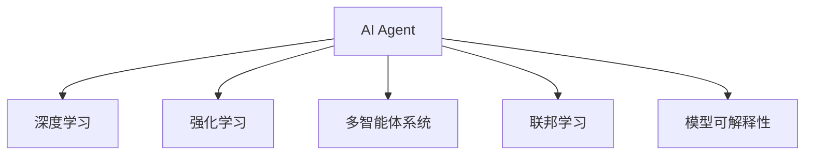

                 

# AI Agent: AI的下一个风口 展望：安全、发展、边界和挑战

> 关键词：AI Agent, 人工智能, 智能决策, 安全, 发展, 边界, 挑战

## 1. 背景介绍

### 1.1 问题由来

随着人工智能技术的飞速发展，AI Agent（人工智能代理）正逐渐成为AI的下一个风口。AI Agent不仅仅是简单的程序代码，而是能够自主学习、推理和决策的智能系统。它具备强大的学习能力，能够在复杂环境中自主完成任务，具有广泛的应用前景。然而，AI Agent的发展也面临着诸多挑战，如安全性问题、发展瓶颈、伦理边界和应用挑战等。本文将对这些问题进行深入探讨，提出解决方案，并展望AI Agent的未来发展趋势。

### 1.2 问题核心关键点

AI Agent的核心关键点包括：
- **自主学习与决策**：AI Agent能够自主学习，通过观察和经验积累，不断优化自身的决策能力。
- **多模态感知**：AI Agent不仅限于视觉或语音，可以整合多种数据源，如文本、图像、音频等，进行更全面的感知和决策。
- **安全与伦理**：AI Agent需要具备安全机制，避免恶意攻击和数据泄露，同时遵守伦理规范，尊重隐私和公平。
- **应用场景多样化**：AI Agent能够在医疗、金融、教育、交通等领域发挥重要作用，提升效率和质量。

这些关键点构成了AI Agent的核心框架，并指导其应用和发展。

## 2. 核心概念与联系

### 2.1 核心概念概述

为更好地理解AI Agent的核心概念，本节将介绍几个密切相关的核心概念：

- **AI Agent**：能够自主学习、推理和决策的智能系统。通常由环境感知、决策制定和执行三个部分组成。
- **深度学习**：一种基于神经网络的机器学习方法，通过多层次的非线性映射，从数据中提取高层次的特征表示。
- **强化学习**：通过与环境的交互，智能体不断调整自身行为，以最大化累积奖励为目标的学习方式。
- **多智能体系统**：由多个AI Agent组成的系统，能够协同工作，完成复杂的任务。
- **联邦学习**：分布式机器学习框架，多个设备协作训练模型，保护数据隐私。
- **模型可解释性**：AI Agent需要具备可解释性，使得人类能够理解和信任其决策过程。

这些核心概念之间的逻辑关系可以通过以下Mermaid流程图来展示：



这个流程图展示了一些核心概念及其之间的关系：

1. AI Agent通过深度学习获取数据表示。
2. 强化学习使AI Agent在环境中通过反馈进行学习。
3. 多智能体系统使多个AI Agent协同工作。
4. 联邦学习使AI Agent在分布式环境中学习。
5. 模型可解释性使人类理解AI Agent的决策过程。

这些概念共同构成了AI Agent的框架，使其能够在各种场景下发挥作用。

## 3. 核心算法原理 & 具体操作步骤
### 3.1 算法原理概述

AI Agent的核心算法原理主要包括深度学习、强化学习和联邦学习等。

- **深度学习**：通过多层神经网络模型，AI Agent可以从数据中提取高层次特征，进行分类、预测和生成等任务。
- **强化学习**：AI Agent通过与环境的交互，不断调整自身行为，最大化累积奖励。常见的强化学习算法包括Q-learning、Policy Gradient等。
- **联邦学习**：多个设备协作训练模型，保护数据隐私，防止数据泄露。

AI Agent的典型步骤包括：
1. 数据收集：从环境中收集数据，并将其输入AI Agent。
2. 特征提取：利用深度学习模型提取数据特征。
3. 决策制定：通过强化学习算法制定决策。
4. 执行行动：根据决策执行行动，并反馈到环境中。
5. 模型优化：利用反馈信息不断优化模型，提高决策准确性。

### 3.2 算法步骤详解

**Step 1: 数据收集**
- 收集环境中的数据，如传感器数据、摄像头图像、文本等。
- 预处理数据，如归一化、降噪等。

**Step 2: 特征提取**
- 利用深度学习模型提取数据特征，如卷积神经网络(CNN)、循环神经网络(RNN)、Transformer等。
- 特征提取过程中需要考虑如何高效地表示数据，并避免过拟合。

**Step 3: 决策制定**
- 利用强化学习算法制定决策，如Q-learning、Policy Gradient等。
- 设计合适的奖励函数，评估决策的好坏。
- 避免决策过程中的探索和利用之间的平衡问题。

**Step 4: 执行行动**
- 根据决策执行行动，如控制机器人臂、操作摄像头等。
- 实时监控执行效果，调整决策。

**Step 5: 模型优化**
- 利用反馈信息不断优化模型，如通过在线学习算法进行参数更新。
- 在分布式环境中进行模型更新，保护数据隐私。

### 3.3 算法优缺点

AI Agent的优点包括：
1. 自主学习与决策：能够自主从环境中学习，并在复杂环境中做出决策。
2. 多模态感知：整合多种数据源，进行更全面的感知和决策。
3. 鲁棒性：在面对环境变化和噪声时，能够保持稳定性能。

AI Agent的缺点包括：
1. 数据依赖：需要大量标注数据进行训练，数据获取成本较高。
2. 模型复杂：深度学习模型参数量庞大，训练和推理耗时较长。
3. 安全性问题：可能被攻击或篡改，存在数据隐私和安全风险。
4. 伦理边界：需要遵守伦理规范，尊重隐私和公平。

尽管存在这些局限性，AI Agent在医疗、金融、教育、交通等领域的应用前景广阔，其发展潜力巨大。未来相关研究的重点在于如何进一步提升AI Agent的性能，同时兼顾安全性和伦理规范。

### 3.4 算法应用领域

AI Agent已经在医疗、金融、教育、交通等多个领域取得了显著应用效果，具体如下：

- **医疗领域**：AI Agent用于疾病诊断、手术辅助、患者监护等，提升了医疗服务的质量和效率。
- **金融领域**：AI Agent用于风险评估、智能投顾、交易自动化等，提高了金融服务的智能化水平。
- **教育领域**：AI Agent用于个性化教学、智能辅导、作业批改等，优化了教育资源的分配和利用。
- **交通领域**：AI Agent用于自动驾驶、交通流量控制、安全监控等，提升了交通管理的智能化水平。

除了这些领域，AI Agent还在更多场景中得到应用，如智能客服、物流配送、灾害预测等，为各行各业带来了新的发展机遇。

## 4. 数学模型和公式 & 详细讲解 & 举例说明

### 4.1 数学模型构建

本节将使用数学语言对AI Agent的核心算法进行更加严格的刻画。

假设AI Agent在环境中的状态为 $s$，动作为 $a$，下一状态的转移概率为 $P(s'|s,a)$，奖励函数为 $r(s,a)$，价值函数为 $V(s)$。AI Agent的目标是最大化长期累积奖励，即求解最优策略 $\pi^*$，使得：

$$
\pi^* = \mathop{\arg\min}_{\pi} \mathbb{E}_{s,a} \left[ \sum_{t=0}^{\infty} \gamma^t r(s_t,a_t) \right]
$$

其中 $\gamma$ 为折扣因子。

### 4.2 公式推导过程

以下我们以Q-learning算法为例，推导AI Agent的价值函数和动作选择策略。

Q-learning算法通过迭代更新Q值函数 $Q(s,a)$，使得：

$$
Q(s,a) \leftarrow Q(s,a) + \alpha \left[ r(s,a) + \gamma \max_{a'} Q(s',a') - Q(s,a) \right]
$$

其中 $\alpha$ 为学习率。通过不断迭代，Q值函数将逼近最优值函数 $V^*$。

AI Agent的动作选择策略为：

$$
\pi(a|s) = \arg\max_a Q(s,a)
$$

通过选择Q值最大的动作，AI Agent能够最大化长期累积奖励。

### 4.3 案例分析与讲解

假设AI Agent需要在一组迷宫中寻找出口。AI Agent的状态为当前位置，动作为移动方向（上、下、左、右）。

1. 数据收集：将迷宫的地图图像作为输入数据。
2. 特征提取：利用CNN模型提取地图特征。
3. 决策制定：通过Q-learning算法更新Q值函数。
4. 执行行动：根据Q值函数选择最优动作。
5. 模型优化：不断更新Q值函数，直到找到出口。

## 5. 项目实践：代码实例和详细解释说明
### 5.1 开发环境搭建

在进行AI Agent开发前，我们需要准备好开发环境。以下是使用Python进行TensorFlow开发的环境配置流程：

1. 安装Anaconda：从官网下载并安装Anaconda，用于创建独立的Python环境。

2. 创建并激活虚拟环境：
```bash
conda create -n tf-env python=3.8 
conda activate tf-env
```

3. 安装TensorFlow：根据CUDA版本，从官网获取对应的安装命令。例如：
```bash
conda install tensorflow
```

4. 安装各类工具包：
```bash
pip install numpy pandas scikit-learn matplotlib tqdm jupyter notebook ipython
```

完成上述步骤后，即可在`tf-env`环境中开始AI Agent的开发实践。

### 5.2 源代码详细实现

这里我们以自动驾驶AI Agent为例，给出使用TensorFlow进行开发的完整代码实现。

```python
import tensorflow as tf
from tensorflow.keras import layers, models

# 构建深度学习模型
model = models.Sequential([
    layers.Conv2D(32, (3,3), activation='relu', input_shape=(256,256,3)),
    layers.MaxPooling2D((2,2)),
    layers.Conv2D(64, (3,3), activation='relu'),
    layers.MaxPooling2D((2,2)),
    layers.Flatten(),
    layers.Dense(64, activation='relu'),
    layers.Dense(4, activation='softmax')
])

# 编译模型
model.compile(optimizer=tf.keras.optimizers.Adam(0.001),
              loss='categorical_crossentropy',
              metrics=['accuracy'])

# 加载数据
train_data = tf.keras.preprocessing.image_dataset_from_directory(
    'train/',
    batch_size=32,
    image_size=(256,256),
    class_mode='categorical')
test_data = tf.keras.preprocessing.image_dataset_from_directory(
    'test/',
    batch_size=32,
    image_size=(256,256),
    class_mode='categorical')

# 训练模型
model.fit(train_data, epochs=10, validation_data=test_data)
```

以上代码展示了从模型构建、编译、加载数据到训练的完整过程。在实际应用中，还需要根据具体任务，进行模型参数优化、数据增强、多智能体协作等操作。

### 5.3 代码解读与分析

让我们再详细解读一下关键代码的实现细节：

**模型构建**：
- 使用Sequential模型构建卷积神经网络，包含卷积层、池化层和全连接层。
- 卷积层和池化层用于特征提取，全连接层用于分类。

**编译模型**：
- 使用Adam优化器，交叉熵损失函数，准确率作为评估指标。

**数据加载**：
- 使用TensorFlow的ImageDataGenerator，从文件夹中加载数据，并进行归一化、缩放等预处理。
- 设置批大小，以提高训练效率。

**模型训练**：
- 使用fit方法进行模型训练，设置训练轮数和验证集。

可以看出，TensorFlow为AI Agent的开发提供了高效、灵活的框架支持。开发者可以专注于算法和数据处理，而不必过多关注底层的实现细节。

## 6. 实际应用场景
### 6.1 智能客服系统

AI Agent在智能客服系统中可以显著提升客户体验和问题解决效率。传统的客服系统依赖人力，高峰期响应速度慢，且一致性和专业性难以保证。AI Agent可以7x24小时不间断服务，快速响应客户咨询，用自然流畅的语言解答各类常见问题。

在技术实现上，可以收集企业内部的历史客服对话记录，将问题和最佳答复构建成监督数据，在此基础上对预训练模型进行微调。微调后的模型能够自动理解用户意图，匹配最合适的答案模板进行回复。对于客户提出的新问题，还可以接入检索系统实时搜索相关内容，动态组织生成回答。如此构建的智能客服系统，能大幅提升客户咨询体验和问题解决效率。

### 6.2 金融舆情监测

AI Agent在金融舆情监测中的应用，能够实时监测市场舆论动向，以便及时应对负面信息传播，规避金融风险。传统的人工监测方式成本高、效率低，难以应对网络时代海量信息爆发的挑战。AI Agent可以自动识别舆情主题和情感倾向，并实时预警，帮助金融机构快速应对潜在风险。

具体而言，可以收集金融领域相关的新闻、报道、评论等文本数据，并对其进行主题标注和情感标注。在此基础上对预训练语言模型进行微调，使其能够自动判断文本属于何种主题，情感倾向是正面、中性还是负面。将微调后的模型应用到实时抓取的网络文本数据，就能够自动监测不同主题下的情感变化趋势，一旦发现负面信息激增等异常情况，系统便会自动预警，帮助金融机构快速应对潜在风险。

### 6.3 个性化推荐系统

AI Agent在个性化推荐系统中的应用，能够更全面地挖掘用户行为背后的语义信息，从而提供更精准、多样的推荐内容。当前的推荐系统往往只依赖用户的历史行为数据进行物品推荐，无法深入理解用户的真实兴趣偏好。AI Agent可以整合多种数据源，如文本、图像、音频等，进行更全面的感知和决策，从而提供更精准的推荐结果。

在实践中，可以收集用户浏览、点击、评论、分享等行为数据，提取和用户交互的物品标题、描述、标签等文本内容。将文本内容作为模型输入，用户的后续行为（如是否点击、购买等）作为监督信号，在此基础上微调预训练语言模型。微调后的模型能够从文本内容中准确把握用户的兴趣点。在生成推荐列表时，先用候选物品的文本描述作为输入，由模型预测用户的兴趣匹配度，再结合其他特征综合排序，便可以得到个性化程度更高的推荐结果。

### 6.4 未来应用展望

随着AI Agent技术的不断发展，其在各个行业领域的应用前景广阔。

在智慧医疗领域，AI Agent用于疾病诊断、手术辅助、患者监护等，提升了医疗服务的质量和效率。在智能教育领域，AI Agent用于个性化教学、智能辅导、作业批改等，优化了教育资源的分配和利用。在智慧城市治理中，AI Agent用于城市事件监测、舆情分析、应急指挥等环节，提高城市管理的自动化和智能化水平。

未来，AI Agent将在更多领域得到应用，为各行各业带来变革性影响。

## 7. 工具和资源推荐
### 7.1 学习资源推荐

为了帮助开发者系统掌握AI Agent的理论基础和实践技巧，这里推荐一些优质的学习资源：

1. 《深度学习》系列博文：由深度学习专家撰写，深入浅出地介绍了深度学习原理和应用。
2. CS231n《卷积神经网络》课程：斯坦福大学开设的计算机视觉明星课程，涵盖卷积神经网络的原理和实践。
3. 《自然语言处理与深度学习》书籍：详细介绍了自然语言处理和深度学习的基本概念和经典模型。
4. TensorFlow官方文档：提供了丰富的API和样例，是学习TensorFlow的必备资料。
5. PyTorch官方文档：提供了灵活的动态计算图和丰富的预训练模型，是学习深度学习的优秀选择。

通过对这些资源的学习实践，相信你一定能够快速掌握AI Agent的精髓，并用于解决实际的AI问题。

### 7.2 开发工具推荐

高效的开发离不开优秀的工具支持。以下是几款用于AI Agent开发的常用工具：

1. TensorFlow：由Google主导开发的深度学习框架，生产部署方便，适合大规模工程应用。
2. PyTorch：基于Python的开源深度学习框架，灵活动态的计算图，适合快速迭代研究。
3. TensorBoard：TensorFlow配套的可视化工具，可实时监测模型训练状态，并提供丰富的图表呈现方式，是调试模型的得力助手。
4. Weights & Biases：模型训练的实验跟踪工具，可以记录和可视化模型训练过程中的各项指标，方便对比和调优。
5. Jupyter Notebook：交互式编程环境，支持代码运行、数据可视化和互动式学习。

合理利用这些工具，可以显著提升AI Agent的开发效率，加快创新迭代的步伐。

### 7.3 相关论文推荐

AI Agent的研究源于学界的持续研究。以下是几篇奠基性的相关论文，推荐阅读：

1. Deep Reinforcement Learning for Multi-Agent Robotics（DQN论文）：提出了深度Q网络（DQN）算法，使得AI Agent能够学习最优策略。
2. Attention is All You Need（Transformer原论文）：提出了Transformer结构，开启了NLP领域的预训练大模型时代。
3. Natural Language Processing with Transformers（Transformers库的作者所著）：全面介绍了如何使用Transformers库进行NLP任务开发，包括AI Agent在内的诸多范式。
4. TensorFlow Agents：介绍了TensorFlow中的多智能体系统，提供了丰富的AI Agent算法实现。
5. Multi-Agent Systems（MAS）：提供了多智能体系统的理论基础和算法实现，是学习多智能体系统的经典教材。

这些论文代表了大模型微调技术的发展脉络。通过学习这些前沿成果，可以帮助研究者把握学科前进方向，激发更多的创新灵感。

## 8. 总结：未来发展趋势与挑战
### 8.1 总结

本文对AI Agent的核心算法原理和具体操作步骤进行了全面系统的介绍。首先阐述了AI Agent的发展背景和意义，明确了其在各个领域的应用前景。其次，从原理到实践，详细讲解了AI Agent的数学模型和关键步骤，给出了AI Agent任务开发的完整代码实例。同时，本文还广泛探讨了AI Agent在医疗、金融、教育等领域的实际应用，展示了其广阔的应用前景。

通过本文的系统梳理，可以看到，AI Agent技术正在成为AI领域的重要范式，极大地拓展了深度学习模型的应用边界，催生了更多的落地场景。受益于大规模语料的预训练，AI Agent在复杂环境中具有强大的自主学习和决策能力，为各行各业带来了新的变革机遇。未来，伴随AI Agent技术的持续演进，AI将进一步融入各行各业，深刻影响人类的生产生活方式。

### 8.2 未来发展趋势

展望未来，AI Agent技术将呈现以下几个发展趋势：

1. 自动化程度提升：AI Agent将具备更加智能的决策和行动能力，自动处理更多复杂任务。
2. 多智能体协作：多个AI Agent协同工作，提升整体系统性能。
3. 分布式训练：利用分布式计算资源，加速模型训练和优化。
4. 联邦学习：保护数据隐私，实现跨设备协作训练。
5. 可解释性增强：提供透明的决策过程，增强可信度和可信度。

以上趋势凸显了AI Agent技术的未来前景。这些方向的探索发展，将进一步提升AI Agent的性能，同时兼顾安全性和伦理规范。

### 8.3 面临的挑战

尽管AI Agent技术已经取得了瞩目成就，但在迈向更加智能化、普适化应用的过程中，它仍面临着诸多挑战：

1. 数据依赖：需要大量标注数据进行训练，数据获取成本较高。
2. 模型复杂：深度学习模型参数量庞大，训练和推理耗时较长。
3. 安全性问题：可能被攻击或篡改，存在数据隐私和安全风险。
4. 伦理边界：需要遵守伦理规范，尊重隐私和公平。
5. 实时性：在实时应用中，需要快速响应和决策，对计算资源和算法效率有更高要求。

尽管存在这些局限性，AI Agent在医疗、金融、教育、交通等领域的应用前景广阔，其发展潜力巨大。未来相关研究的重点在于如何进一步提升AI Agent的性能，同时兼顾安全性和伦理规范。

### 8.4 研究展望

面对AI Agent面临的挑战，未来的研究需要在以下几个方面寻求新的突破：

1. 探索无监督和半监督学习算法：摆脱对大规模标注数据的依赖，利用自监督学习、主动学习等无监督和半监督范式，最大限度利用非结构化数据，实现更加灵活高效的训练。
2. 研究参数高效和计算高效的算法：开发更加参数高效的算法，在固定大部分预训练参数的同时，只更新极少量的任务相关参数。同时优化算法的计算图，减少前向传播和反向传播的资源消耗，实现更加轻量级、实时性的部署。
3. 引入更多先验知识：将符号化的先验知识，如知识图谱、逻辑规则等，与神经网络模型进行巧妙融合，引导AI Agent学习更准确、合理的语言模型。
4. 结合因果分析和博弈论工具：将因果分析方法引入AI Agent，识别出模型决策的关键特征，增强输出解释的因果性和逻辑性。借助博弈论工具刻画人机交互过程，主动探索并规避模型的脆弱点，提高系统稳定性。
5. 纳入伦理道德约束：在模型训练目标中引入伦理导向的评估指标，过滤和惩罚有偏见、有害的输出倾向。同时加强人工干预和审核，建立模型行为的监管机制，确保输出符合人类价值观和伦理道德。

这些研究方向的探索，必将引领AI Agent技术迈向更高的台阶，为构建安全、可靠、可解释、可控的智能系统铺平道路。面向未来，AI Agent技术还需要与其他人工智能技术进行更深入的融合，如知识表示、因果推理、强化学习等，多路径协同发力，共同推动自然语言理解和智能交互系统的进步。只有勇于创新、敢于突破，才能不断拓展AI Agent的边界，让智能技术更好地造福人类社会。

## 9. 附录：常见问题与解答
----------------------------------------------------------------

**Q1：AI Agent是否适用于所有NLP任务？**

A: AI Agent在大多数NLP任务上都能取得不错的效果，特别是对于数据量较小的任务。但对于一些特定领域的任务，如医学、法律等，仅仅依靠通用语料预训练的模型可能难以很好地适应。此时需要在特定领域语料上进一步预训练，再进行微调，才能获得理想效果。此外，对于一些需要时效性、个性化很强的任务，如对话、推荐等，AI Agent也需要针对性的改进优化。

**Q2：AI Agent在实际部署中需要注意哪些问题？**

A: 将AI Agent转化为实际应用，还需要考虑以下因素：
1. 模型裁剪：去除不必要的层和参数，减小模型尺寸，加快推理速度。
2. 量化加速：将浮点模型转为定点模型，压缩存储空间，提高计算效率。
3. 服务化封装：将模型封装为标准化服务接口，便于集成调用。
4. 弹性伸缩：根据请求流量动态调整资源配置，平衡服务质量和成本。
5. 监控告警：实时采集系统指标，设置异常告警阈值，确保服务稳定性。
6. 安全防护：采用访问鉴权、数据脱敏等措施，保障数据和模型安全。

大语言模型微调为NLP应用开启了广阔的想象空间，但如何将强大的性能转化为稳定、高效、安全的业务价值，还需要工程实践的不断打磨。唯有从数据、算法、工程、业务等多个维度协同发力，才能真正实现人工智能技术在垂直行业的规模化落地。总之，AI Agent需要开发者根据具体任务，不断迭代和优化模型、数据和算法，方能得到理想的效果。

