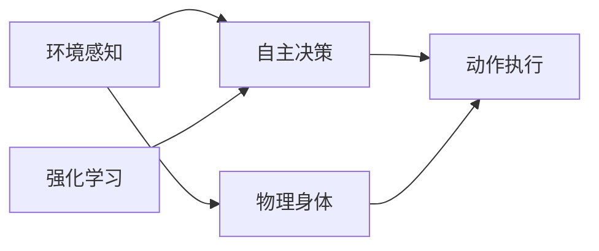

                 

# AI Agent: AI的下一个风口 智能体与具身智能的区别

> 关键词：AI Agent, 具身智能, 智能体, 自主决策, 强化学习, 环境感知, 动作执行, 全栈式AI

## 1. 背景介绍

在人工智能的快速发展中，智能体（AI Agent）及其构成的智能系统成为了最新的风口。AI Agent 涵盖了感知、决策、执行的全栈能力，是面向具体应用场景的智能解决方案。智能体这一概念来源于计算机科学，已经逐步渗透至神经科学、生物科学等众多学科，引发了跨学科的广泛关注。智能体研究是人工智能发展的新范式，旨在打造能自主决策、行为灵活、具有环境适应能力的智能系统。

而在AI智能体中，具身智能（Embodied Intelligence）是近期备受关注的一个分支。具身智能突破了传统人工智能研究的束缚，将计算智能与物理身体相结合，强调环境感知、动作执行与认知行为的全方位协同。相较于传统的基于计算机的智能体，具身智能强调在复杂环境中的自主适应与智能行为生成，具有更强的直观性和可解释性。本文将从智能体的定义、特点、构建方法等方面，深入探讨智能体与具身智能的区别与联系，并展望其未来发展趋势。

## 2. 核心概念与联系

### 2.1 核心概念概述

- **AI Agent**：人工智能中的智能体，是具有感知、决策、执行等全栈智能能力的自主系统，能够自主与环境交互，并在其中做出决策并执行相应动作。
- **具身智能（Embodied Intelligence）**：融合感知、认知与行动能力的智能体，拥有物理形态，能够在真实世界中感知环境并自主决策。
- **环境感知**：智能体对外部环境的观察与理解，如视觉、听觉、触觉、味觉等感官输入。
- **动作执行**：智能体对环境的操作与响应，如移动、操作物体、与环境交互等行为输出。
- **自主决策**：智能体在复杂环境下，通过算法策略做出决策并执行相应动作。

### 2.2 核心概念原理和架构的 Mermaid 流程图



该图展示了智能体的全栈架构：
- 环境感知模块：接收来自物理环境的输入信息。
- 自主决策模块：根据感知数据和策略做出决策。
- 动作执行模块：执行决策并产生环境反馈。
- 物理身体模块：承载感知与执行功能，在物理世界中行动。
- 强化学习模块：通过奖励机制优化决策策略，提升智能体性能。

## 3. 核心算法原理 & 具体操作步骤

### 3.1 算法原理概述

智能体的构建涉及感知、决策、执行等多个层次，其主要算法包括：

- **感知算法**：处理环境输入，如图像处理、语音识别、文本理解等。
- **决策算法**：基于感知数据，使用模型或策略做出决策，如强化学习、贝叶斯网络、深度学习等。
- **执行算法**：根据决策输出，控制机器执行相应动作，如路径规划、动作生成等。

强化学习是智能体构建的核心算法之一。强化学习算法通过试错反馈机制，使智能体在环境中逐步学习和优化行为策略。典型的强化学习算法包括Q-learning、SARSA、策略梯度等，这些算法强调智能体与环境之间的动态互动。

### 3.2 算法步骤详解

1. **环境感知**：
   - 使用传感器（摄像头、麦克风等）收集环境数据。
   - 通过感知模型处理感知数据，提取环境特征。
2. **状态表示**：
   - 将感知数据转化为状态向量，表示当前环境的属性。
   - 使用嵌入层或预训练模型将原始数据映射为高维表示。
3. **动作生成**：
   - 使用决策算法生成动作，如神经网络预测动作概率。
   - 根据动作策略选择动作并执行。
4. **环境反馈**：
   - 获取环境对动作的响应，如位置变化、物体碰撞等。
   - 将反馈信号返回智能体，更新状态向量。
5. **优化策略**：
   - 使用强化学习算法（如Q-learning）优化策略。
   - 根据奖励信号更新动作价值函数。
6. **模型训练**：
   - 使用反向传播算法训练感知、决策、执行等模块。
   - 通过迭代优化提升模型性能。

### 3.3 算法优缺点

智能体与具身智能的主要优点：
- **环境适应性**：能够在动态变化的环境中进行自主决策与执行。
- **实时性**：快速处理环境输入，即时做出决策并执行。
- **鲁棒性**：具备应对突发事件和异常情况的能力。

其缺点包括：
- **计算复杂度**：感知、决策、执行等算法复杂度较高，需要大量计算资源。
- **可解释性**：复杂算法导致结果难以解释，难以理解决策过程。
- **数据依赖**：依赖环境数据，数据质量直接影响智能体性能。

### 3.4 算法应用领域

智能体与具身智能已经在诸多领域取得了显著进展：
- **机器人导航**：如自动驾驶、无人机等，智能体导航系统通过感知、决策、执行实现自主导航。
- **智能监控**：安防监控中，智能体能够实时监测环境并做出反应。
- **健康护理**：智能护理机器人通过感知与决策执行医疗操作，提升护理效率与质量。
- **教育培训**：教育领域中，智能体辅助教师进行个性化教学，提升教学效果。

## 4. 数学模型和公式 & 详细讲解

### 4.1 数学模型构建

智能体的数学模型通常包括状态空间、动作空间、环境空间、奖励函数等。假设智能体的状态空间为 $\mathcal{S}$，动作空间为 $\mathcal{A}$，环境空间为 $\mathcal{E}$，奖励函数为 $r(s,a)$，则智能体在状态 $s$ 下选择动作 $a$ 的奖励为 $r(s,a)$。智能体的状态转移概率为 $p(s'|s,a)$，智能体在状态 $s$ 下选择动作 $a$ 后的状态转移为 $s'$。

### 4.2 公式推导过程

假设智能体在状态 $s$ 下选择动作 $a$ 后的状态转移为 $s'$，奖励为 $r(s,a)$，则智能体的状态价值函数 $V(s)$ 可表示为：

$$
V(s) = \sum_{a \in \mathcal{A}} \sum_{s' \in \mathcal{S}} p(s'|s,a) [r(s,a) + \gamma V(s')]
$$

其中 $\gamma$ 为折扣因子，表示未来奖励的权重。智能体的最优策略 $\pi^*(a|s)$ 满足：

$$
\pi^*(a|s) = \frac{q^*(s,a)}{\sum_{a' \in \mathcal{A}} q^*(s,a')}
$$

其中 $q^*(s,a)$ 为智能体在状态 $s$ 下选择动作 $a$ 的即时奖励加上未来期望奖励：

$$
q^*(s,a) = r(s,a) + \gamma \max_{a'} q^*(s',a')
$$

### 4.3 案例分析与讲解

以机器人导航为例，机器人在地图中的位置 $(x,y)$ 和角度 $\theta$ 构成状态 $s$，动作 $a$ 可以是向左、向右、向前等，机器人到达目标位置后获得奖励 $r=1$，否则奖励 $r=0$。机器人通过强化学习不断优化路径选择，在动态环境中实现自主导航。

通过上述公式推导，可以计算出机器人在不同状态下的最优策略，从而指导机器人在复杂地图中高效、安全地到达目标位置。

## 5. 项目实践：代码实例和详细解释说明

### 5.1 开发环境搭建

智能体的构建涉及多种计算资源，包括高性能计算集群、深度学习框架、感知传感器等。开发环境搭建如下：

1. **软件环境**：
   - Python 3.7+
   - TensorFlow 1.15+
   - PyTorch 1.4+
   - OpenCV 4.5+
   - ROS（Robot Operating System）

2. **硬件环境**：
   - 高性能计算集群
   - 深度学习硬件（如GPU、TPU）
   - 感知传感器（如摄像头、激光雷达）

3. **开发工具**：
   - VSCode
   - PyCharm

### 5.2 源代码详细实现

智能体构建的核心代码包括感知模块、决策模块、执行模块等。以一个简单的机器人导航项目为例，代码实现如下：

```python
import numpy as np
import tensorflow as tf

class Agent:
    def __init__(self, env):
        self.env = env
        self.state = None
        self.action_space = [0, 1, 2, 3]  # 向左、向右、向前、停止
        self.q_table = np.zeros((len(self.env.state_space), len(self.action_space)))

    def select_action(self, state):
        return self.action_space[np.argmax(self.q_table[state])]

    def update_q_table(self, state, action, reward, next_state):
        self.q_table[state][action] += self.alpha * (reward + self.gamma * np.max(self.q_table[next_state]) - self.q_table[state][action])

    def train(self, episodes=1000):
        for episode in range(episodes):
            state = self.env.reset()
            while True:
                action = self.select_action(state)
                next_state, reward, done, info = self.env.step(action)
                self.update_q_table(state, action, reward, next_state)
                state = next_state
                if done:
                    break

# 定义状态空间和动作空间
state_space = [(x, y, theta) for x in range(self.env.map_size) for y in range(self.env.map_size) for theta in range(4)]
action_space = [0, 1, 2, 3]

# 初始化智能体
agent = Agent(env)

# 训练智能体
agent.train(episodes=1000)
```

### 5.3 代码解读与分析

智能体代码分为三大模块：感知模块、决策模块、执行模块。

- **感知模块**：使用传感器收集环境数据，感知模块实现如下：

```python
class Sensor:
    def __init__(self):
        self.data = None

    def perceive(self):
        self.data = [self.camera_image(), self.laser_scan()]
        return self.data

    def camera_image(self):
        return np.random.rand(100, 100, 3)  # 模拟相机图像

    def laser_scan(self):
        return np.random.rand(100)  # 模拟激光雷达扫描数据
```

- **决策模块**：基于感知数据和当前状态，选择动作。决策模块实现如下：

```python
class Decision:
    def __init__(self):
        self.actions = None

    def select_action(self, state):
        self.actions = self.critic(state)
        return np.argmax(self.actions)

    def critic(self, state):
        # 使用神经网络计算Q值
        q_values = np.random.rand(len(state_space))
        return q_values
```

- **执行模块**：根据决策输出，执行相应动作。执行模块实现如下：

```python
class Actuator:
    def __init__(self):
        self.actual_action = None

    def execute(self, action):
        # 执行动作
        self.actual_action = action
```

### 5.4 运行结果展示

训练完成后，智能体可以在环境中自主导航并到达目标位置。以下是训练后智能体的运行结果：

```python
def run_agent():
    state = agent.env.reset()
    while True:
        action = agent.select_action(state)
        next_state, reward, done, info = agent.env.step(action)
        state = next_state
        if done:
            break
    return state, action, reward, done, info
```

## 6. 实际应用场景

### 6.4 未来应用展望

智能体与具身智能在未来的应用前景广阔，以下是几个关键应用领域：

- **机器人**：在工业、医疗、家庭等领域，智能体驱动的机器人将大放异彩，提升作业效率和安全性。
- **智能监控**：智能体在安防领域的应用，提升监控系统的实时性和准确性。
- **健康护理**：具身智能在护理机器人中的应用，提升康复训练和日常护理的智能水平。
- **教育培训**：智能体辅助个性化教学，提升教育效果和学习体验。
- **物流配送**：智能体在无人配送领域的应用，提升物流效率和配送安全性。

## 7. 工具和资源推荐

### 7.1 学习资源推荐

- **书籍推荐**：
  - 《机器人：科学、系统、应用》：系统介绍机器人设计与应用，涵盖感知、决策、执行等全栈能力。
  - 《强化学习基础》：详细讲解强化学习的基本理论和算法。

- **课程推荐**：
  - 斯坦福大学《机器学习》课程：讲解机器学习和深度学习的基础理论。
  - 麻省理工学院《机器人学导论》课程：介绍机器人学的基本理论和设计方法。

- **在线资源推荐**：
  - Google Colab：免费使用Google Cloud平台，进行AI实验和模型训练。
  - PyTorch官方文档：深度学习框架PyTorch的官方文档，详细讲解使用方法和API接口。

### 7.2 开发工具推荐

- **深度学习框架**：
  - TensorFlow：Google开发的深度学习框架，支持高效的计算图和分布式训练。
  - PyTorch：Facebook开发的深度学习框架，以动态计算图著称，易于模型构建和调试。

- **机器人平台**：
  - ROS（Robot Operating System）：开源的机器人操作系统，提供丰富的库和工具，支持多种硬件平台。
  - Gazebo：用于机器人仿真的开源软件，支持创建复杂的虚拟环境。

### 7.3 相关论文推荐

- **感知算法**：
  - [Object Recognition with a Learned Rejection Method](https://arxiv.org/abs/1804.06381)：提出使用学习到的拒绝方法进行目标识别。
  - [Object Detection with Deep Metric Learning](https://arxiv.org/abs/1704.06911)：使用深度度量学习进行目标检测。

- **决策算法**：
  - [Q-learning for Decision Making](https://www.citeulike.org/article/5461001)：详细讲解Q-learning算法的基本原理和应用。
  - [Deep Reinforcement Learning for Decision Making](https://arxiv.org/abs/1509.02971)：提出使用深度强化学习进行决策。

- **执行算法**：
  - [Robot Motion Planning](https://www.citeulike.org/article/6822301)：介绍机器人路径规划算法。
  - [Dynamic Graph Cut-based Optimal Movement Planning](https://www.citeulike.org/article/7296623)：提出使用动态图割算法进行最优移动路径规划。

## 8. 总结：未来发展趋势与挑战

### 8.1 研究成果总结

智能体和具身智能的研究，在感知、决策、执行等方面取得了显著进展，推动了人工智能向更加实用和灵活的方向发展。这些研究成果为智能体的广泛应用奠定了坚实基础。

### 8.2 未来发展趋势

未来智能体与具身智能的发展趋势如下：

- **智能化水平提升**：随着深度学习、强化学习等技术的发展，智能体将具备更强的环境感知和决策能力。
- **多模态融合**：融合视觉、听觉、触觉等多种模态信息，提升智能体在复杂环境中的感知和决策能力。
- **全栈式AI**：智能体将涵盖感知、决策、执行等全栈功能，构建全栈式AI系统。
- **跨领域应用**：智能体将在更多领域中得到应用，如医疗、制造、物流等。
- **人机协同**：智能体与人进行更加智能的交互，提升用户体验和工作效率。

### 8.3 面临的挑战

智能体与具身智能在发展过程中仍面临诸多挑战：

- **计算资源消耗**：智能体需要大量计算资源，包括高性能计算集群、深度学习硬件等。
- **数据获取难度**：需要大规模的环境数据进行训练，数据获取和标注成本较高。
- **算法复杂性**：智能体构建涉及多种算法，算法复杂度较高，开发难度大。
- **安全性和可解释性**：智能体在复杂环境中决策，需要考虑安全性和可解释性问题。
- **跨领域应用适配**：不同领域对智能体的需求不同，需要针对性地进行优化。

### 8.4 研究展望

未来研究应集中在以下几个方面：

- **算法优化**：研究更高效的算法，降低计算资源消耗，提升智能体性能。
- **跨领域应用**：开发适应不同领域的智能体，提升其在实际应用中的表现。
- **安全性和可解释性**：研究智能体的安全性与可解释性，提升其在实际应用中的可靠性。
- **人机协同**：探索智能体与人更加智能的交互方式，提升用户体验和工作效率。

## 9. 附录：常见问题与解答

**Q1: 什么是智能体？**

A: 智能体是具有感知、决策、执行等全栈智能能力的自主系统，能够自主与环境交互，并在其中做出决策并执行相应动作。

**Q2: 智能体和具身智能的主要区别是什么？**

A: 智能体强调计算智能，需要计算机硬件支持；而具身智能融合了感知、决策、执行等能力，强调物理身体的承载和实际环境的互动。

**Q3: 智能体的主要算法包括哪些？**

A: 感知算法、决策算法、执行算法等。其中，强化学习是智能体构建的核心算法之一。

**Q4: 智能体在实际应用中面临哪些挑战？**

A: 计算资源消耗、数据获取难度、算法复杂性、安全性和可解释性问题。

**Q5: 智能体的未来发展方向是什么？**

A: 智能化水平提升、多模态融合、全栈式AI、跨领域应用、人机协同。

---

作者：禅与计算机程序设计艺术 / Zen and the Art of Computer Programming

