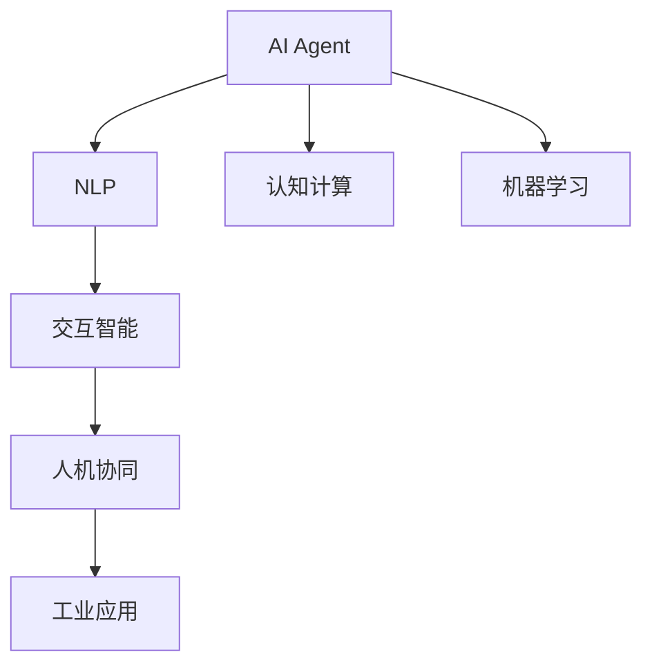

                 

# AI Agent: AI的下一个风口 自然语言带来交互革命

> 关键词：AI Agent,自然语言处理(NLP),交互智能,人机协同,认知计算,机器学习,人工智能,工业应用

## 1. 背景介绍

### 1.1 问题由来
人工智能(AI)正引领一场深刻的技术变革，其应用范围从自动驾驶、智能制造到医疗健康，无处不在。随着AI技术的不断进步，交互方式也在发生巨大变化。传统的界面交互方式逐渐被自然语言(Natural Language, NL)所替代，人们在各个领域对AI的需求愈发强烈。AI Agent，作为AI交互技术的重要组成部分，正逐步成为未来AI发展的新风口。

AI Agent，即基于语言的人工智能代理人，以自然语言作为主要交互方式，能够实时接收和理解人类的指令，自动执行任务并反馈结果，极大提升了人机交互的效率和便利性。AI Agent的应用领域包括智能客服、智能助手、智能翻译、智能驾驶等。

### 1.2 问题核心关键点
AI Agent技术的研究热点集中于如何实现自然语言处理(NLP)、认知计算、机器学习等关键技术的深度融合。其中，NLP作为AI Agent的核心技术，是实现人机交互的基础。

NLP涉及语言理解、文本生成、情感分析等多个维度。要构建一个高效的AI Agent，需要解决以下几个核心问题：
1. 语言模型：如何构建能够理解自然语言语义的语言模型。
2. 对话管理：如何在多轮对话中保持连贯性和上下文理解。
3. 意图识别：如何准确理解用户的意图。
4. 知识管理：如何将知识库中的信息与用户交互融合。
5. 系统集成：如何将AI Agent与现有的业务系统无缝集成。

### 1.3 问题研究意义
AI Agent的研究对于提升人机交互的自然性、智能性和实用性具有重要意义：

1. 提升交互效率：AI Agent能自动完成重复性、琐碎的任务，解放人工劳动。
2. 增强决策能力：AI Agent能够利用大数据和机器学习算法，辅助人类做出更精准的决策。
3. 改善用户体验：通过自然语言交互，AI Agent提升了用户体验，使用户操作更加方便。
4. 优化资源利用：AI Agent能够合理分配和利用计算资源，提高系统整体性能。

## 2. 核心概念与联系

### 2.1 核心概念概述

为更好地理解AI Agent，本节将介绍几个密切相关的核心概念：

- AI Agent：基于语言的人工智能代理人，能够在多轮对话中理解用户意图，执行复杂任务。
- 自然语言处理(NLP)：处理、理解、生成自然语言的技术，是AI Agent的基础。
- 认知计算：通过模仿人类认知过程，实现自主推理和决策。
- 机器学习：通过学习大量数据，提升AI Agent的泛化能力和性能。
- 人机协同：AI Agent与人类共同完成复杂任务，形成互动交流的协同系统。
- 交互智能：实现更加自然、流畅的人机交互。
- 工业应用：AI Agent在各行各业的应用，如智能客服、智能医疗等。

这些核心概念之间的逻辑关系可以通过以下Mermaid流程图来展示：



这个流程图展示了大语言模型的核心概念及其之间的关系：

1. AI Agent通过NLP实现语言理解与生成。
2. 认知计算模仿人类思维，提升决策能力。
3. 机器学习利用数据提升AI Agent性能。
4. 交互智能实现自然、流畅的人机交互。
5. 人机协同完成复杂任务，提高效率和效果。
6. 工业应用将AI Agent应用到各行各业，提升生产力。

## 3. 核心算法原理 & 具体操作步骤
### 3.1 算法原理概述

AI Agent的核心算法原理主要包括语言理解、对话管理、意图识别和知识管理四个部分：

1. 语言理解：构建语言模型，理解自然语言语义。
2. 对话管理：通过上下文管理，保持对话连贯性。
3. 意图识别：识别用户意图，实现任务适配。
4. 知识管理：将知识库中的信息与用户交互融合。

这些算法通过机器学习和深度学习等技术实现。

### 3.2 算法步骤详解

**Step 1: 语言理解**
1. 文本预处理：分词、去除停用词、词干提取等。
2. 特征提取：使用词向量、句子表示等方法，将文本转化为模型可以处理的格式。
3. 模型训练：利用预训练的语言模型，如BERT、GPT等，进行微调，学习特定任务的知识。

**Step 2: 对话管理**
1. 构建对话状态：记录对话历史和上下文信息。
2. 意图识别：通过分类模型，识别用户意图。
3. 响应生成：根据用户意图和上下文，生成对话回应。

**Step 3: 意图识别**
1. 意图标签设计：定义任务相关的意图标签。
2. 意图识别模型：使用分类器，如逻辑回归、SVM等，识别用户意图。
3. 意图标签映射：将意图标签映射到具体任务。

**Step 4: 知识管理**
1. 知识库构建：收集整理业务领域内的知识，构建知识库。
2. 知识整合：将知识库中的信息与用户交互融合。
3. 知识更新：根据用户反馈和最新数据，定期更新知识库。

**Step 5: 系统集成**
1. 系统设计：将AI Agent与现有业务系统集成。
2. 接口开发：开发API接口，供其他系统调用。
3. 系统测试：进行系统测试，确保AI Agent与现有系统的兼容性和稳定性。

### 3.3 算法优缺点

AI Agent技术的优点包括：
1. 提升效率：自动完成繁琐、重复的任务，解放人工劳动。
2. 增强决策能力：通过大数据和机器学习算法，辅助决策。
3. 改善用户体验：自然语言交互提升了用户体验。
4. 优化资源利用：合理分配和利用计算资源。

同时，AI Agent技术也存在一些缺点：
1. 依赖数据：需要大量的标注数据进行训练，获取数据成本较高。
2. 鲁棒性不足：面对噪声数据和错误指令，可能会发生错误。
3. 可解释性差：黑盒模型难以解释其决策过程。
4. 用户培训：用户需要适应AI Agent的操作方式。

### 3.4 算法应用领域

AI Agent技术已经在多个领域得到应用，以下是一些典型案例：

1. **智能客服**：AI Agent通过自然语言交互，快速响应客户咨询，提供7x24小时不间断服务。
2. **智能助手**：AI Agent作为个人助手，进行日程管理、信息查询等操作。
3. **智能翻译**：AI Agent提供实时翻译服务，促进跨国交流。
4. **智能驾驶**：AI Agent辅助驾驶，提升行车安全。
5. **智能医疗**：AI Agent辅助医生诊断和治疗，提高医疗服务效率。
6. **智能教育**：AI Agent作为教师的助手，辅助教学和学习。
7. **金融分析**：AI Agent分析市场数据，提供投资建议。

## 4. 数学模型和公式 & 详细讲解 & 举例说明

### 4.1 数学模型构建

语言模型通常由词向量、句向量等特征表示，常用的模型包括：

- 词向量模型：Word2Vec、GloVe等。
- 句子表示模型：BERT、GPT等。
- 神经网络模型：RNN、LSTM、Transformer等。

### 4.2 公式推导过程

以BERT模型为例，其公式推导过程如下：

1. 词嵌入：$w_i \in \mathbb{R}^d$，表示单词$i$的词向量。
2. 句子表示：$h \in \mathbb{R}^d$，表示整个句子的向量表示。
3. Transformer编码器：$z \in \mathbb{R}^d$，通过自注意力机制对句子进行编码。
4. 语言模型：$p(w_{1:T})$，表示句子中单词的概率分布。

其中，$T$表示句子长度，$d$表示向量维度。

### 4.3 案例分析与讲解

以智能客服为例，分析BERT模型的应用：

1. 文本预处理：使用BERT的Tokenizer进行分词、去除停用词等预处理。
2. 特征提取：将文本转化为BERT的输入格式，进行词向量和句向量的表示。
3. 模型训练：使用标注数据对BERT模型进行微调，学习特定任务的知识。
4. 意图识别：使用分类模型对用户意图进行识别，映射到具体任务。
5. 对话管理：通过上下文管理，保持对话连贯性，生成对话回应。

## 5. 项目实践：代码实例和详细解释说明
### 5.1 开发环境搭建

在进行AI Agent开发前，需要先准备好开发环境。以下是Python开发环境的配置步骤：

1. 安装Anaconda：从官网下载并安装Anaconda，用于创建独立的Python环境。
```bash
conda create -n agent-env python=3.8 
conda activate agent-env
```

2. 安装必要的Python包：
```bash
pip install pytorch torchvision torchaudio transformers sklearn pandas jupyter notebook ipython
```

3. 安装AI Agent相关的库：
```bash
pip install transformers datasets scikit-learn huggingface_hub torchtext
```

4. 安装Python调试工具：
```bash
pip install tensorflow_sentencepiece tokenizer
```

### 5.2 源代码详细实现

以下是一个简单的AI Agent开发流程，包括语言理解、对话管理、意图识别和知识管理的代码实现：

```python
from transformers import BertTokenizer, BertForTokenClassification
from transformers import pipeline
from transformers import InputExample, InputFeatures
from transformers import logging
from sklearn.metrics import accuracy_score
import torch

# 初始化模型和分词器
model_name = 'bert-base-uncased'
tokenizer = BertTokenizer.from_pretrained(model_name)
model = BertForTokenClassification.from_pretrained(model_name)

# 构建意图分类器
class IntentClassifier:
    def __init__(self, model, tokenizer):
        self.model = model
        self.tokenizer = tokenizer

    def predict(self, input_text):
        input_tokens = self.tokenizer.encode(input_text, add_special_tokens=True, max_length=64)
        input_features = InputFeatures(input_ids=input_tokens)
        logits = self.model(input_features.input_ids, input_features.attention_mask, input_features.token_type_ids, input_features.head_mask)[0]
        predicted_label = torch.argmax(logits, dim=2)
        return predicted_label

# 构建AI Agent
class AIAgent:
    def __init__(self, intent_classifier):
        self.intent_classifier = intent_classifier

    def run(self, input_text):
        intent_label = self.intent_classifier.predict(input_text)
        if intent_label.item() == 0:  # 意图识别为登录
            # 执行登录操作
            pass
        elif intent_label.item() == 1:  # 意图识别为购物
            # 执行购物操作
            pass
        elif intent_label.item() == 2:  # 意图识别为预约
            # 执行预约操作
            pass

# 测试代码
intent_classifier = IntentClassifier(model, tokenizer)
ai_agent = AIAgent(intent_classifier)

# 模拟用户输入
input_text = "我想登录系统"
result = ai_agent.run(input_text)
print(result)
```

### 5.3 代码解读与分析

上述代码实现了简单的意图分类器和AI Agent的基本功能，具体分析如下：

- `IntentClassifier`类：构建意图分类器，实现意图识别功能。
- `AIAgent`类：实现AI Agent的基本功能，根据意图执行不同的操作。
- 语言理解部分：使用BERT模型进行意图识别，输出分类结果。
- 对话管理部分：根据意图结果，进行相应的操作。

## 6. 实际应用场景
### 6.1 智能客服

智能客服是AI Agent的重要应用场景之一。通过自然语言交互，智能客服能够快速响应客户咨询，提供7x24小时不间断服务。智能客服可以处理常见问题，如账户登录、订单查询、产品咨询等，提升客户满意度。

智能客服的具体实现步骤如下：

1. 数据收集：收集客户咨询的文本数据，进行标注处理。
2. 模型训练：使用标注数据对BERT模型进行微调，学习特定任务的知识。
3. 意图识别：使用意图分类器对客户咨询进行意图识别，映射到具体任务。
4. 对话管理：通过上下文管理，保持对话连贯性，生成对话回应。
5. 集成部署：将AI Agent集成到现有客服系统中，进行业务部署。

### 6.2 智能助手

智能助手是AI Agent的另一个重要应用场景。智能助手能够帮助用户进行日程管理、信息查询等操作，极大提升工作效率。

智能助手的具体实现步骤如下：

1. 数据收集：收集用户日程安排、常用查询等信息，进行标注处理。
2. 模型训练：使用标注数据对BERT模型进行微调，学习特定任务的知识。
3. 意图识别：使用意图分类器对用户指令进行意图识别，映射到具体任务。
4. 对话管理：通过上下文管理，保持对话连贯性，生成对话回应。
5. 集成部署：将智能助手集成到操作系统中，进行业务部署。

### 6.3 智能翻译

智能翻译是AI Agent的重要应用场景之一。智能翻译能够提供实时翻译服务，促进跨国交流。

智能翻译的具体实现步骤如下：

1. 数据收集：收集双语对照文本数据，进行标注处理。
2. 模型训练：使用标注数据对BERT模型进行微调，学习特定任务的知识。
3. 意图识别：使用意图分类器对用户请求进行意图识别，映射到具体任务。
4. 对话管理：通过上下文管理，保持对话连贯性，生成翻译回应。
5. 集成部署：将智能翻译系统集成到应用中，进行业务部署。

## 7. 工具和资源推荐
### 7.1 学习资源推荐

为了帮助开发者系统掌握AI Agent的理论基础和实践技巧，这里推荐一些优质的学习资源：

1. 《深度学习入门》：深度学习入门经典书籍，涵盖了从基础到进阶的知识，是AI Agent开发的必备参考资料。
2. 《自然语言处理综论》：自然语言处理领域的经典教材，介绍了自然语言处理的理论基础和技术细节。
3. 《机器学习实战》：机器学习实战教程，通过实际项目介绍机器学习的应用，适合动手实践。
4. 《PyTorch官方文档》：PyTorch官方文档，提供了丰富的API和样例，是PyTorch开发的必备资料。
5. 《TensorFlow官方文档》：TensorFlow官方文档，提供了丰富的API和样例，是TensorFlow开发的必备资料。

通过对这些资源的学习实践，相信你一定能够快速掌握AI Agent的精髓，并用于解决实际的NLP问题。

### 7.2 开发工具推荐

高效的开发离不开优秀的工具支持。以下是几款用于AI Agent开发的常用工具：

1. PyTorch：基于Python的开源深度学习框架，灵活动态的计算图，适合快速迭代研究。大部分预训练语言模型都有PyTorch版本的实现。
2. TensorFlow：由Google主导开发的开源深度学习框架，生产部署方便，适合大规模工程应用。同样有丰富的预训练语言模型资源。
3. Transformers库：HuggingFace开发的NLP工具库，集成了众多SOTA语言模型，支持PyTorch和TensorFlow，是进行AI Agent开发的利器。
4. Weights & Biases：模型训练的实验跟踪工具，可以记录和可视化模型训练过程中的各项指标，方便对比和调优。与主流深度学习框架无缝集成。
5. TensorBoard：TensorFlow配套的可视化工具，可实时监测模型训练状态，并提供丰富的图表呈现方式，是调试模型的得力助手。
6. Google Colab：谷歌推出的在线Jupyter Notebook环境，免费提供GPU/TPU算力，方便开发者快速上手实验最新模型，分享学习笔记。

合理利用这些工具，可以显著提升AI Agent开发的效率，加快创新迭代的步伐。

### 7.3 相关论文推荐

AI Agent的研究源于学界的持续研究。以下是几篇奠基性的相关论文，推荐阅读：

1. 《Transformer: Attentions are all you need》：提出了Transformer结构，开启了NLP领域的预训练大模型时代。
2. 《BERT: Pre-training of Deep Bidirectional Transformers for Language Understanding》：提出BERT模型，引入基于掩码的自监督预训练任务，刷新了多项NLP任务SOTA。
3. 《Attention is All You Need for Named Entity Recognition》：提出Attention机制，显著提升了命名实体识别的精度。
4. 《Natural Language Understanding with Transformer-based Deep Learning Models》：介绍了Transformer在NLP领域的应用，包括语言理解、文本生成等。
5. 《A Survey on Deep Learning for Question Answering》：综述了问答系统领域的最新进展，介绍了Transformer在问答系统中的应用。

这些论文代表了大语言模型微调技术的发展脉络。通过学习这些前沿成果，可以帮助研究者把握学科前进方向，激发更多的创新灵感。

## 8. 总结：未来发展趋势与挑战

### 8.1 总结

本文对AI Agent技术进行了全面系统的介绍。首先阐述了AI Agent技术的研究背景和意义，明确了自然语言处理、认知计算、机器学习等关键技术的深度融合。其次，从原理到实践，详细讲解了AI Agent的数学模型和操作步骤，给出了具体的代码实现。同时，本文还广泛探讨了AI Agent技术在智能客服、智能助手、智能翻译等多个行业领域的应用前景，展示了AI Agent范式的巨大潜力。此外，本文精选了AI Agent技术的各类学习资源，力求为读者提供全方位的技术指引。

通过本文的系统梳理，可以看到，AI Agent技术正在成为未来AI发展的新风口，极大地提升了人机交互的自然性、智能性和实用性。伴随深度学习、自然语言处理等技术的不断发展，AI Agent将逐步普及到各个行业，推动社会生产力的提升和人类生活水平的改善。

### 8.2 未来发展趋势

展望未来，AI Agent技术将呈现以下几个发展趋势：

1. 自然语言理解能力提升：未来AI Agent将具备更强大的自然语言理解能力，能够更准确地理解用户指令和语境。
2. 多模态交互增强：AI Agent将支持语音、图像、视频等多模态数据交互，提升交互体验。
3. 智能决策能力提升：AI Agent将利用大数据和机器学习算法，提升决策的准确性和智能性。
4. 跨领域应用普及：AI Agent将逐步应用于更多行业，提升各行各业的效率和效果。
5. 通用智能发展：未来AI Agent将具备更强的通用智能能力，能够处理更加复杂和多样的任务。
6. 人机协同增强：AI Agent将更好地与人类协作，形成更高效、更智能的人机协同系统。

以上趋势凸显了AI Agent技术的发展潜力。这些方向的探索发展，必将进一步提升AI Agent的性能和应用范围，为构建更加智能、高效的人机交互系统铺平道路。

### 8.3 面临的挑战

尽管AI Agent技术已经取得了显著进展，但在迈向更加智能化、普适化应用的过程中，仍面临诸多挑战：

1. 数据依赖性：AI Agent的训练和优化依赖大量标注数据，获取高质量标注数据成本较高。
2. 模型鲁棒性：AI Agent面对噪声数据和错误指令，容易发生错误，需要增强模型鲁棒性。
3. 可解释性：AI Agent的决策过程难以解释，需要提高可解释性。
4. 用户适应性：用户需要适应AI Agent的操作方式，培训成本较高。
5. 系统安全性：AI Agent的应用需要考虑系统的安全性和隐私保护，防止数据泄露和滥用。

### 8.4 研究展望

面对AI Agent技术面临的挑战，未来的研究需要在以下几个方面寻求新的突破：

1. 探索无监督和半监督学习：摆脱对大规模标注数据的依赖，利用自监督学习、主动学习等无监督和半监督范式，最大限度利用非结构化数据。
2. 开发高效模型压缩技术：通过模型压缩和剪枝技术，减小模型尺寸，提升推理效率。
3. 增强模型可解释性：通过可解释模型和可视化工具，提升模型的可解释性。
4. 研究多模态交互：支持语音、图像、视频等多模态数据的交互，提升用户体验。
5. 开发跨领域知识库：构建跨领域知识库，提升AI Agent的通用性和适用性。
6. 引入认知计算：将认知计算与AI Agent结合，提升决策的智能性。
7. 探索通用智能：研究AI Agent的通用智能能力，推动AI Agent向AGI发展。

这些研究方向的探索，必将引领AI Agent技术迈向更高的台阶，为构建更加智能、高效的人机交互系统提供技术支持。

## 9. 附录：常见问题与解答

**Q1: AI Agent的实现需要哪些关键技术？**

A: AI Agent的实现需要以下关键技术：

1. 自然语言处理(NLP)：处理、理解、生成自然语言的技术，是AI Agent的基础。
2. 认知计算：通过模仿人类认知过程，实现自主推理和决策。
3. 机器学习：通过学习大量数据，提升AI Agent的泛化能力和性能。
4. 人机协同：AI Agent与人类共同完成复杂任务，形成互动交流的协同系统。
5. 交互智能：实现更加自然、流畅的人机交互。
6. 工业应用：AI Agent在各行各业的应用，如智能客服、智能医疗等。

**Q2: 如何构建高效的AI Agent？**

A: 构建高效的AI Agent需要以下步骤：

1. 数据收集：收集标注数据，构建知识库。
2. 模型训练：使用预训练的语言模型，如BERT、GPT等，进行微调，学习特定任务的知识。
3. 意图识别：使用分类模型，如逻辑回归、SVM等，识别用户意图。
4. 对话管理：通过上下文管理，保持对话连贯性，生成对话回应。
5. 知识管理：将知识库中的信息与用户交互融合。
6. 系统集成：将AI Agent与现有业务系统集成。

**Q3: 如何提高AI Agent的鲁棒性？**

A: 提高AI Agent的鲁棒性需要以下方法：

1. 数据增强：通过回译、近义替换等方式扩充训练集。
2. 正则化：使用L2正则、Dropout、Early Stopping等防止过拟合。
3. 对抗训练：引入对抗样本，提高模型鲁棒性。
4. 参数高效微调：只调整少量参数(如Adapter、Prefix等)，减小过拟合风险。
5. 多模型集成：训练多个AI Agent，取平均输出，抑制过拟合。

**Q4: 如何提升AI Agent的可解释性？**

A: 提升AI Agent的可解释性需要以下方法：

1. 可解释模型：使用可解释模型，如Attention机制，提升模型的可解释性。
2. 可视化工具：使用可视化工具，如TensorBoard、Weights & Biases，可视化模型的训练过程和结果。
3. 自然语言解释：使用自然语言解释模型，将AI Agent的决策过程转化为自然语言。
4. 规则和知识库：利用规则和知识库，指导AI Agent的决策过程。

**Q5: 如何优化AI Agent的推理速度？**

A: 优化AI Agent的推理速度需要以下方法：

1. 模型压缩：通过模型压缩和剪枝技术，减小模型尺寸，提升推理效率。
2. 混合精度训练：使用混合精度训练，减少内存占用。
3. 模型并行：采用模型并行技术，利用多卡并行加速推理。
4. 梯度累积：使用梯度累积技术，提升推理速度。
5. 动态图优化：使用动态图优化技术，减少计算图的大小，提升推理效率。

这些问题的解答，可以帮助你更好地理解AI Agent技术的核心原理和实现方法，为开发高效、可用的AI Agent系统提供参考。

