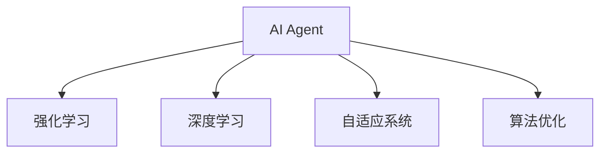
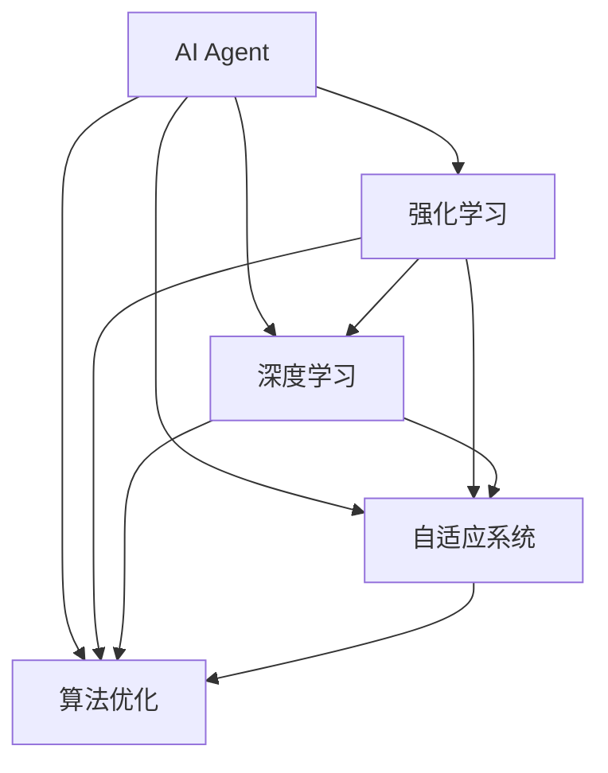

                 

# AI Agent技术发展的未来展望

> 关键词：AI Agent, 强化学习, 深度学习, 自适应系统, 智能代理, 机器学习, 算法优化

## 1. 背景介绍

### 1.1 问题由来
AI Agent技术在过去的几十年里，从简单的规则引擎到复杂的机器学习模型，经历了飞速的发展。然而，随着应用场景的日益复杂化和需求的多样化，现有的AI Agent技术面临诸多挑战，如性能瓶颈、可解释性不足、环境适应性差等。为了应对这些挑战，并推动AI Agent技术更广泛的应用，未来的研究方向应集中在强化学习、深度学习、自适应系统以及算法优化等方面。

### 1.2 问题核心关键点
AI Agent技术的核心在于让计算机系统具备自主决策、适应环境变化和解决问题的能力。为了实现这些功能，研究者们提出了不同的技术方案，包括强化学习、深度学习、自适应系统等。这些技术相互结合，不断推动物理智能、认知智能和社会智能的发展。

1. **强化学习(Reinforcement Learning, RL)**：通过奖励机制和环境反馈，AI Agent能够在不断试错中学习和优化策略，适用于复杂且动态的环境。
2. **深度学习(Deep Learning, DL)**：通过多层神经网络结构，AI Agent能够对大量数据进行高效特征提取和模式识别，提高决策准确性。
3. **自适应系统(Adaptive Systems, AS)**：通过自我监督和反馈调节，AI Agent能够自动调整内部参数和行为策略，适应环境变化。
4. **算法优化(Algorithm Optimization)**：通过优化算法和数据结构，提高AI Agent的运行效率和稳定性。

这些核心技术之间的逻辑关系可以通过以下Mermaid流程图来展示：



这个流程图展示出AI Agent的核心技术及其之间的关系：

1. AI Agent通过强化学习从环境中学习，通过深度学习进行决策，通过自适应系统调整策略，并通过算法优化提升性能。
2. 强化学习、深度学习、自适应系统和算法优化各自解决AI Agent的不同需求，共同构成AI Agent的核心技术栈。

## 2. 核心概念与联系

### 2.1 核心概念概述

为了更好地理解AI Agent技术发展的未来方向，本节将介绍几个密切相关的核心概念：

- **AI Agent**：指在特定环境中的自主决策系统，能够感知环境、规划决策并执行行动。AI Agent技术旨在让计算机系统具备与人类似的智能行为。
- **强化学习**：一种机器学习方法，通过与环境交互，使AI Agent在不断试错中学习和优化决策策略，目标是最大化累积奖励。
- **深度学习**：一种基于多层神经网络的学习方法，能够高效地处理大量数据，进行特征提取和模式识别，适用于复杂的多模态任务。
- **自适应系统**：一种能够根据环境反馈自动调整内部参数和行为策略的系统，能够提高系统的鲁棒性和适应性。
- **算法优化**：通过优化算法和数据结构，提高AI Agent的运行效率和稳定性，适用于高性能计算和实时系统。

这些核心概念之间的逻辑关系可以通过以下Mermaid流程图来展示：



这个流程图展示出AI Agent技术的核心概念及其之间的关系：

1. AI Agent通过强化学习、深度学习和自适应系统进行自主决策。
2. 算法优化技术应用于强化学习、深度学习和自适应系统的各个环节，提升AI Agent的整体性能。
3. 强化学习、深度学习和自适应系统在算法优化的辅助下，能够更高效地工作。

## 3. 核心算法原理 & 具体操作步骤
### 3.1 算法原理概述

AI Agent的核心算法原理可以概括为以下几个关键点：

1. **感知与理解**：AI Agent需要能够感知环境，并对输入信息进行理解和解释。感知通常通过传感器和传感器网络实现，理解则通过深度学习等技术进行。

2. **决策与规划**：在感知和理解的基础上，AI Agent需要做出决策并规划行动路径。决策通常基于强化学习的奖励机制和模型预测，规划则通过图搜索、动态规划等算法实现。

3. **执行与反馈**：根据决策和规划，AI Agent执行行动并接收环境反馈。执行通常通过机器人控制、网络通信等技术实现，反馈则用于调整感知、决策和规划。

4. **学习与优化**：AI Agent需要不断学习环境信息和决策效果，优化内部模型和策略。学习通常通过强化学习、深度学习等技术实现，优化则通过算法优化等技术进行。

5. **适应与演化**：AI Agent需要能够适应环境变化，并根据环境反馈进行自我进化。适应通常通过自适应系统和自我监督实现，演化则通过遗传算法等技术实现。

### 3.2 算法步骤详解

AI Agent技术的实现一般包括以下几个关键步骤：

**Step 1: 环境建模**
- 选择合适的环境模型，如离散状态空间、连续状态空间、部分可观察等，并定义状态和行动空间。
- 收集环境数据，建立环境模拟器，模拟环境动态变化。

**Step 2: 模型训练**
- 选择合适的模型架构，如神经网络、决策树等，并使用强化学习或深度学习方法进行训练。
- 设置训练超参数，包括学习率、批大小、迭代轮数等，并选择合适的损失函数和优化算法。
- 使用验证集对模型进行调参，选择性能最佳的模型。

**Step 3: 策略优化**
- 根据模型输出，设计策略评估函数，如Q值函数、策略梯度等。
- 使用强化学习算法优化策略，如Q-learning、SARSA、Deep Q-learning等。
- 通过策略评估和优化，使AI Agent能够最大化累积奖励。

**Step 4: 行为执行**
- 使用策略模型输出行动决策，通过执行器执行行动。
- 根据环境反馈，更新感知和决策模型。

**Step 5: 效果评估**
- 收集环境反馈和AI Agent的行动效果，计算累积奖励。
- 使用评估函数评估AI Agent性能，进行策略迭代优化。

### 3.3 算法优缺点

AI Agent技术的优点包括：

1. **自主决策**：AI Agent能够自主决策，不需要人类干预，适用于复杂的、动态的环境。
2. **适应性强**：AI Agent能够根据环境反馈进行自我调整和优化，适应性强。
3. **鲁棒性高**：AI Agent能够通过算法优化提高稳定性，减少环境变化带来的影响。
4. **可扩展性强**：AI Agent技术可以应用于各种领域，如机器人、自动驾驶、医疗诊断等。

同时，AI Agent技术也存在一些局限性：

1. **计算资源消耗大**：AI Agent技术需要大量的计算资源进行模型训练和优化。
2. **可解释性不足**：AI Agent的决策过程通常难以解释，难以理解和调试。
3. **环境适应性有限**：AI Agent对环境变化敏感，难以应对突发情况。
4. **数据依赖性强**：AI Agent依赖大量标注数据进行训练，获取高质量数据成本高。

### 3.4 算法应用领域

AI Agent技术在众多领域都有广泛的应用，以下是几个典型场景：

1. **机器人**：AI Agent可用于控制机器人进行自主导航、物体抓取和搬运等任务。
2. **自动驾驶**：AI Agent可用于控制自动驾驶汽车，实现自主驾驶和避障等功能。
3. **医疗诊断**：AI Agent可用于医学影像分析、疾病预测和诊断推荐等任务。
4. **金融分析**：AI Agent可用于股票预测、投资组合优化等任务。
5. **智能客服**：AI Agent可用于智能客服机器人，提供24小时不间断服务。
6. **智能推荐**：AI Agent可用于个性化推荐系统，推荐用户感兴趣的物品或内容。
7. **游戏AI**：AI Agent可用于游戏中的角色控制和策略优化。

## 4. 数学模型和公式 & 详细讲解  
### 4.1 数学模型构建

本节将使用数学语言对AI Agent技术的核心算法进行更加严格的刻画。

记AI Agent的环境为 $E$，状态空间为 $S$，行动空间为 $A$，决策策略为 $\pi$，奖励函数为 $r$。AI Agent通过策略 $\pi$ 在环境 $E$ 中进行决策，目标是在每一步选择最优行动 $a_t$ 以最大化累积奖励 $\sum_{t=0}^T r(a_t, s_t)$。

定义环境模拟器 $S^E$，通过状态转移函数 $P(s'|s, a)$ 和奖励函数 $r(s, a)$ 模拟环境动态变化和奖励。在实际应用中，环境模拟器通常基于随机性、动态规划或模拟仿真实现。

AI Agent的决策模型 $S^M$ 和策略模型 $Q^M$ 通过深度学习进行训练，策略模型 $Q^M$ 输出每个状态的Q值，表示在当前状态下采取每个行动的期望累积奖励。在强化学习中，决策模型和策略模型通过优化损失函数进行学习。

### 4.2 公式推导过程

以下我们以强化学习中的Q-learning算法为例，推导其核心公式。

假设AI Agent在环境 $E$ 中从状态 $s_t$ 出发，执行行动 $a_t$，得到状态 $s_{t+1}$ 和奖励 $r_{t+1}$。根据Q-learning算法，策略模型的更新公式为：

$$
Q(s_t, a_t) \leftarrow Q(s_t, a_t) + \eta [r_{t+1} + \gamma \max_{a} Q(s_{t+1}, a) - Q(s_t, a_t)]
$$

其中 $\eta$ 为学习率，$\gamma$ 为折扣因子。Q-learning通过每次迭代更新Q值，使策略模型能够逐步学习最优决策。

在实际应用中，Q-learning算法可以进一步扩展为Deep Q-learning，使用神经网络代替策略模型进行更新，提升模型的表达能力和泛化能力。

## 5. 项目实践：代码实例和详细解释说明
### 5.1 开发环境搭建

在进行AI Agent技术开发前，我们需要准备好开发环境。以下是使用Python进行PyTorch开发的环境配置流程：

1. 安装Anaconda：从官网下载并安装Anaconda，用于创建独立的Python环境。

2. 创建并激活虚拟环境：
```bash
conda create -n agent-env python=3.8 
conda activate agent-env
```

3. 安装PyTorch：根据CUDA版本，从官网获取对应的安装命令。例如：
```bash
conda install pytorch torchvision torchaudio cudatoolkit=11.1 -c pytorch -c conda-forge
```

4. 安装TensorFlow：
```bash
conda install tensorflow
```

5. 安装各类工具包：
```bash
pip install numpy pandas scikit-learn matplotlib tqdm jupyter notebook ipython
```

完成上述步骤后，即可在`agent-env`环境中开始AI Agent技术开发。

### 5.2 源代码详细实现

下面我们以机器人路径规划任务为例，给出使用PyTorch进行Q-learning算法的PyTorch代码实现。

首先，定义路径规划环境模拟器：

```python
import torch
import torch.nn as nn
import numpy as np
import gym

class Environment:
    def __init__(self, size):
        self.size = size
        self.grid = np.zeros((size, size))
        self.start = (0, 0)
        self.goal = (size-1, size-1)
        self.agent = None
    
    def reset(self):
        self.agent = np.random.randint(0, self.size, 2)
        return self.agent
    
    def step(self, action):
        x, y = self.agent
        if action == 0:  # move up
            y -= 1
        elif action == 1:  # move down
            y += 1
        elif action == 2:  # move left
            x -= 1
        elif action == 3:  # move right
            x += 1
        
        if x < 0 or x >= self.size or y < 0 or y >= self.size:
            reward = -1
            done = True
        else:
            reward = 0
            done = False
        
        self.agent = (x, y)
        return self.agent, reward, done
```

然后，定义神经网络模型：

```python
class QNetwork(nn.Module):
    def __init__(self, size, num_actions):
        super(QNetwork, self).__init__()
        self.fc1 = nn.Linear(size*size, 64)
        self.fc2 = nn.Linear(64, num_actions)
    
    def forward(self, x):
        x = torch.relu(self.fc1(x))
        x = self.fc2(x)
        return x
```

接着，定义训练和评估函数：

```python
def train(environment, model, num_episodes, batch_size=64, learning_rate=0.01, discount_factor=0.9):
    optimizer = torch.optim.Adam(model.parameters(), lr=learning_rate)
    for episode in range(num_episodes):
        state = environment.reset()
        done = False
        while not done:
            action_probs = model(state)
            action = np.random.choice(np.arange(len(action_probs)), p=action_probs.data.numpy()[0])
            next_state, reward, done = environment.step(action)
            td_error = reward + discount_factor * model(next_state).data.numpy()[0]
            target = torch.tensor([td_error], dtype=torch.float)
            optimizer.zero_grad()
            loss = (model(state) - target).mean()
            loss.backward()
            optimizer.step()
            state = next_state

def evaluate(environment, model, batch_size=64, discount_factor=0.9):
    total_reward = 0
    for _ in range(100):
        state = environment.reset()
        done = False
        while not done:
            action_probs = model(state)
            action = np.random.choice(np.arange(len(action_probs)), p=action_probs.data.numpy()[0])
            next_state, reward, done = environment.step(action)
            total_reward += reward
            state = next_state
    return total_reward / 100
```

最后，启动训练流程并在测试集上评估：

```python
size = 10
num_actions = 4
model = QNetwork(size, num_actions).to('cuda')
train(environment, model, num_episodes=1000, batch_size=64, learning_rate=0.01, discount_factor=0.9)
print(evaluate(environment, model))
```

以上就是使用PyTorch对机器人路径规划任务进行Q-learning算法的完整代码实现。可以看到，借助PyTorch的动态计算图和GPU加速，Q-learning算法的实现变得简洁高效。

### 5.3 代码解读与分析

让我们再详细解读一下关键代码的实现细节：

**Environment类**：
- `__init__`方法：初始化环境大小、起点、终点等关键信息。
- `reset`方法：每次迭代前重置AI Agent的起点。
- `step`方法：根据行动执行一步，返回新的状态、奖励和done标志。

**QNetwork类**：
- `__init__`方法：定义神经网络的结构。
- `forward`方法：前向传播计算Q值。

**train函数**：
- 定义了Q-learning算法的训练过程，使用Adam优化器更新模型参数。
- 每次迭代中，AI Agent在环境中执行行动，根据行动结果计算Q值，更新策略模型。

**evaluate函数**：
- 定义了Q-learning算法的评估过程，使用随机行动策略，计算AI Agent的平均累积奖励。

**训练流程**：
- 定义总的迭代次数，开始循环训练
- 在每次迭代中，重置AI Agent的起点，执行行动并更新模型参数
- 在测试集上评估AI Agent的平均累积奖励

可以看到，PyTorch配合动态计算图和GPU加速，使得AI Agent技术的实现变得简单高效。开发者可以将更多精力放在模型设计、参数调优等高层逻辑上，而不必过多关注底层的实现细节。

当然，工业级的系统实现还需考虑更多因素，如模型的保存和部署、超参数的自动搜索、更加灵活的任务适配层等。但核心的算法范式基本与此类似。

## 6. 实际应用场景
### 6.1 智能客服系统

基于AI Agent技术的智能客服系统，可以提供全天候、个性化、高效的服务。AI Agent能够理解用户的问题，通过深度学习模型进行意图识别和问题解答，提升客户满意度。

在技术实现上，可以通过自然语言处理技术，将用户输入的文本转换为结构化的语义表示，并使用意图识别模型判断用户意图。基于意图识别结果，调用对应的问答模型生成回答，或调用检索系统实时搜索相关内容，动态组织生成回答。

### 6.2 医疗诊断系统

AI Agent技术在医疗诊断中具有重要应用价值。AI Agent能够通过深度学习模型，对医学影像、病历数据等进行分析和推理，辅助医生进行诊断和治疗。

在技术实现上，可以通过深度学习模型，如卷积神经网络、循环神经网络等，对医学影像进行特征提取和分析，判断病灶类型和位置。同时，通过自然语言处理技术，对病历数据进行语义分析和抽取，提取关键信息。基于这些信息，调用对应的诊断模型进行推理，给出诊断结果和推荐方案。

### 6.3 自动驾驶系统

自动驾驶系统是AI Agent技术的典型应用场景。AI Agent能够在复杂的交通环境中，通过传感器获取环境信息，并使用深度学习模型进行感知、决策和规划，实现自主驾驶和避障等功能。

在技术实现上，可以使用深度学习模型对传感器数据进行特征提取和分析，判断交通环境中的车辆、行人、障碍物等。基于这些信息，调用决策模型进行路径规划和行动决策，使用执行器控制车辆行驶。同时，通过强化学习模型进行策略优化，提升自动驾驶的稳定性和安全性。

### 6.4 未来应用展望

随着AI Agent技术的不断发展，未来其在各个领域的应用将更加广泛，带来新的突破。

1. **智能城市治理**：AI Agent可用于智能交通管理、能源优化、垃圾分类等，提升城市治理水平和居民生活质量。
2. **智慧医疗**：AI Agent可用于疾病预测、手术辅助、智能诊断等，提升医疗服务质量和效率。
3. **智能制造**：AI Agent可用于生产调度、设备维护、质量控制等，提升制造业的自动化水平和生产效率。
4. **金融科技**：AI Agent可用于风险评估、投资组合优化、智能客服等，提升金融服务的智能化水平。
5. **教育科技**：AI Agent可用于个性化推荐、智能辅导、智能评估等，提升教育服务的智能化水平。
6. **环境监测**：AI Agent可用于污染监测、气象预测、灾害预警等，提升环境保护和灾害应对能力。

## 7. 工具和资源推荐
### 7.1 学习资源推荐

为了帮助开发者系统掌握AI Agent技术的发展脉络，这里推荐一些优质的学习资源：

1. **Deep Reinforcement Learning**：由Ian Goodfellow等撰写的经典教材，系统介绍了强化学习的基本概念和前沿技术，是深度学习领域的重要参考书。
2. **Algorithms for Reinforcement Learning**：由Richard Sutton和Andrew Barto撰写的教材，深入浅出地介绍了强化学习的基本算法和实现细节，是深度学习领域的重要参考书。
3. **Reinforcement Learning: An Introduction**：由Richard Sutton和Andrew Barto撰写的教材，介绍了强化学习的理论基础和实践应用，是深度学习领域的重要参考书。
4. **Deep Q-Networks and Beyond**：由Geoffrey Hinton等人撰写的论文，介绍了深度强化学习的理论和实践应用，是深度学习领域的重要论文。
5. **AlphaGo Zero**：谷歌DeepMind团队开发的AlphaGo Zero系统，通过深度强化学习实现了击败人类顶尖棋手的目标，展示了AI Agent技术的强大潜力。

通过对这些资源的学习实践，相信你一定能够快速掌握AI Agent技术的精髓，并用于解决实际的智能问题。

### 7.2 开发工具推荐

高效的开发离不开优秀的工具支持。以下是几款用于AI Agent技术开发的常用工具：

1. **PyTorch**：基于Python的开源深度学习框架，灵活动态的计算图，适合快速迭代研究。支持GPU加速，适合大模型训练和优化。
2. **TensorFlow**：由Google主导开发的开源深度学习框架，生产部署方便，适合大规模工程应用。支持GPU和TPU加速，适合高性能计算。
3. **OpenAI Gym**：用于测试和比较强化学习算法的Python环境，提供了大量的环境模拟器和评估工具。
4. **ROS**：Robot Operating System，用于机器人系统和模拟环境的开发和测试。支持多种传感器和执行器，适合机器人路径规划等任务。
5. **Reinforcement Learning Toolkit**：用于强化学习算法和模型的开发和测试，支持多种环境模拟器和评估工具。

合理利用这些工具，可以显著提升AI Agent技术的开发效率，加快创新迭代的步伐。

### 7.3 相关论文推荐

AI Agent技术的发展离不开学界的持续研究。以下是几篇奠基性的相关论文，推荐阅读：

1. **Playing Atari with Deep Reinforcement Learning**：由DeepMind团队发表的论文，展示了深度强化学习在Atari游戏上的应用，刷新了多个游戏最高分记录。
2. **AlphaGo Zero**：谷歌DeepMind团队发表的论文，展示了AlphaGo Zero在围棋游戏中的应用，实现了击败人类顶尖棋手的目标。
3. **Human-Level Control Through Deep Reinforcement Learning**：由DeepMind团队发表的论文，展示了深度强化学习在人类动作控制上的应用，实现了人类动作的高精度控制。
4. **Soft Actor-Critic**：由UC Berkeley团队发表的论文，提出了一种新的深度强化学习算法，解决了传统算法中的不稳定问题，提升了模型的稳定性和鲁棒性。
5. **Adversarial Deep Reinforcement Learning**：由UCLA团队发表的论文，提出了一种新的对抗性深度强化学习算法，提升了模型的鲁棒性和安全性。

这些论文代表了大语言模型微调技术的发展脉络。通过学习这些前沿成果，可以帮助研究者把握学科前进方向，激发更多的创新灵感。

## 8. 总结：未来发展趋势与挑战

### 8.1 总结

本文对AI Agent技术发展的未来方向进行了全面系统的介绍。首先阐述了AI Agent技术的核心概念和研究背景，明确了其在各个领域的应用价值和潜力。其次，从原理到实践，详细讲解了强化学习、深度学习、自适应系统以及算法优化等关键技术。最后，给出了AI Agent技术在实际应用中的成功案例和未来展望。

通过本文的系统梳理，可以看到，AI Agent技术在各个领域的应用前景广阔，技术手段也在不断进步和完善。AI Agent技术的未来，将不再局限于传统的智能系统，而是将与更多领域的技术深度融合，推动人工智能技术的跨越式发展。

### 8.2 未来发展趋势

展望未来，AI Agent技术将呈现以下几个发展趋势：

1. **多模态融合**：AI Agent技术将与其他领域的技术深度融合，如机器人学、物联网、人机交互等，推动跨领域智能系统的创新。
2. **自我学习与演化**：AI Agent技术将具有更强的自我学习和自我演化能力，能够在更复杂的、动态的环境中自主适应和优化。
3. **智能协同与协作**：AI Agent技术将通过智能协同与协作，提升系统的整体效率和效果，实现更广泛的应用场景。
4. **伦理与安全**：AI Agent技术将更加注重伦理和安全问题，确保系统的透明性、可解释性和安全性。
5. **人机融合**：AI Agent技术将与人类智能深度融合，形成人机协同的智能系统，提升人类决策和操作能力。

这些趋势凸显了AI Agent技术的发展方向，将在更多领域实现突破和创新。

### 8.3 面临的挑战

尽管AI Agent技术已经取得了瞩目成就，但在迈向更加智能化、普适化应用的过程中，它仍面临诸多挑战：

1. **计算资源消耗大**：AI Agent技术需要大量的计算资源进行模型训练和优化，对硬件设施提出了更高的要求。
2. **模型可解释性不足**：AI Agent的决策过程通常难以解释，难以理解和调试，增加了系统的复杂性。
3. **环境适应性有限**：AI Agent对环境变化敏感，难以应对突发情况，需要进一步提升其鲁棒性和适应性。
4. **数据依赖性强**：AI Agent依赖大量标注数据进行训练，获取高质量数据成本高，限制了技术的应用范围。

### 8.4 研究展望

面对AI Agent技术所面临的挑战，未来的研究需要在以下几个方面寻求新的突破：

1. **自适应与自我演化**：开发更加自适应和自我演化的AI Agent技术，提升其在复杂环境中的适应能力和鲁棒性。
2. **多模态融合与协同**：推动多模态数据融合和协同，提升AI Agent在多领域应用中的性能和效果。
3. **算法优化与优化器**：开发更加高效的优化算法和优化器，提升AI Agent模型的训练速度和精度。
4. **智能协同与协作**：探索人机协同与协作的机制，提升AI Agent在实际应用中的效果和用户体验。
5. **伦理与安全**：研究AI Agent技术的伦理和安全问题，确保系统的透明性、可解释性和安全性。

这些研究方向的探索，必将引领AI Agent技术迈向更高的台阶，为构建安全、可靠、可解释、可控的智能系统铺平道路。面向未来，AI Agent技术还需要与其他人工智能技术进行更深入的融合，如知识表示、因果推理、强化学习等，多路径协同发力，共同推动人工智能技术的进步。只有勇于创新、敢于突破，才能不断拓展AI Agent技术的边界，让智能技术更好地造福人类社会。

## 9. 附录：常见问题与解答

**Q1：AI Agent技术如何应用于智能推荐系统？**

A: AI Agent技术可以通过智能推荐系统实现个性化推荐。AI Agent通过深度学习模型学习用户行为数据，提取用户兴趣特征，并使用强化学习模型进行策略优化，推荐用户感兴趣的内容或物品。在实际应用中，可以通过多臂老虎机算法进行策略调整，提升推荐效果。

**Q2：AI Agent技术的计算资源消耗大，如何优化？**

A: 为了优化AI Agent技术的计算资源消耗，可以采用以下策略：
1. 使用GPU和TPU等高性能设备，加速模型训练和推理。
2. 采用分布式训练，将计算任务分配到多个节点上进行并行计算。
3. 采用模型压缩和稀疏化存储等技术，减少模型大小和计算量。
4. 使用混合精度训练和梯度积累等技术，提高计算效率和稳定性。

**Q3：AI Agent技术的可解释性不足，如何解决？**

A: 为了解决AI Agent技术的可解释性不足问题，可以采用以下策略：
1. 使用可解释的模型架构，如决策树、线性模型等，提升模型的可解释性。
2. 引入可解释的算法，如LIME、SHAP等，解释AI Agent的决策过程和结果。
3. 使用可视化工具，如TensorBoard、WEKA等，对AI Agent的内部参数和状态进行可视化，帮助理解和调试模型。

**Q4：AI Agent技术的伦理与安全问题如何保障？**

A: 为了保障AI Agent技术的伦理与安全问题，可以采用以下策略：
1. 引入伦理导向的评估指标，如公平性、透明性等，评估AI Agent的决策结果。
2. 使用安全机制，如访问鉴权、数据脱敏等，保障数据和模型的安全。
3. 引入监管机制，确保AI Agent的决策过程符合人类价值观和伦理道德。

这些策略可以帮助提升AI Agent技术的伦理与安全水平，确保其在实际应用中的安全性与可靠性。

---

作者：禅与计算机程序设计艺术 / Zen and the Art of Computer Programming

