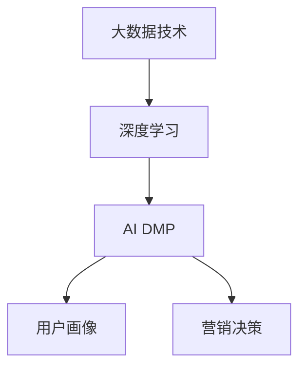

                 

## 1. 背景介绍

### 1.1 问题由来
在数字经济时代，数据驱动营销成为企业获取竞争优势的重要手段。广告主希望通过精准的用户画像和行为分析，实现对目标受众的精准定位和投放，以高效提升营销效果和投资回报率。然而，传统的数据营销方式依赖于结构化数据的处理和分析，难以充分利用散落在各平台的海量非结构化数据。AI DMP（人工智能数据管理平台）的出现，通过深度学习和机器学习技术，从非结构化数据中挖掘出有价值的洞察，赋能企业进行高效营销决策。

### 1.2 问题核心关键点
AI DMP的核心在于利用深度学习和大数据技术，对用户行为数据、兴趣偏好、社交网络关系等复杂数据进行深度分析和建模。通过构建精准的用户画像，AI DMP能够实现对用户需求的精准识别和预测，为广告投放提供有力的数据支持。然而，构建AI DMP面临着数据收集、数据清洗、模型训练和应用部署等诸多挑战，需要企业具备较强的技术实力和数据治理能力。

### 1.3 问题研究意义
构建AI DMP平台，不仅能够显著提升广告投放的精准度和效果，还能通过数据洞察推动产品创新和市场细分，为企业的数字化转型提供坚实的技术基础。AI DMP的应用不仅限于广告投放，还可以延伸至客户关系管理、风险控制、供应链优化等多个领域，为企业的业务流程优化和智能决策提供有力支持。

## 2. 核心概念与联系

### 2.1 核心概念概述
- **AI DMP（人工智能数据管理平台）**：通过深度学习和大数据技术，从海量非结构化数据中提取用户行为、兴趣偏好、社交关系等复杂信息，构建精准的用户画像，为营销决策提供数据支撑。
- **深度学习**：通过多层神经网络结构，利用大量数据训练模型，提取数据中的深层次特征，实现对复杂数据的高效处理和分析。
- **大数据技术**：通过分布式存储和处理技术，有效管理和分析海量数据，为深度学习模型提供数据支持。
- **用户画像**：基于用户历史行为和兴趣偏好，构建个性化的用户标签和特征向量，实现对用户需求的精准识别和预测。

### 2.2 核心概念原理和架构的 Mermaid 流程图



## 3. 核心算法原理 & 具体操作步骤

### 3.1 算法原理概述
AI DMP的核心算法包括用户行为建模、兴趣偏好识别和社交关系挖掘。这些算法基于深度学习模型，通过多层神经网络结构对用户数据进行处理和分析，提取深层次特征，构建精准的用户画像。

- **用户行为建模**：通过自然语言处理技术，从用户的搜索记录、浏览行为、评论反馈等数据中提取行为模式，构建行为特征向量。
- **兴趣偏好识别**：利用推荐系统中的协同过滤、内容推荐等技术，结合用户行为数据和商品属性信息，预测用户对不同商品的兴趣偏好。
- **社交关系挖掘**：通过社交网络分析技术，从用户的社交媒体互动、好友关系等数据中挖掘出用户的社交网络特征，构建社交关系图谱。

### 3.2 算法步骤详解
AI DMP的构建过程包括以下关键步骤：

**Step 1: 数据收集与预处理**
- 从各个平台（如社交媒体、电商平台、搜索引擎等）收集用户行为数据、兴趣偏好数据和社交网络数据。
- 对数据进行清洗和标注，去除噪音和异常值，确保数据质量和一致性。

**Step 2: 构建用户行为特征向量**
- 利用自然语言处理技术，对用户的搜索记录、评论反馈、点击行为等数据进行文本处理，提取关键词和实体，构建行为特征向量。
- 使用TF-IDF、词嵌入等技术，将文本数据转换为数值型特征，便于模型训练。

**Step 3: 用户兴趣偏好预测**
- 使用协同过滤算法，对用户行为数据进行聚类和推荐，预测用户对不同商品的兴趣偏好。
- 利用内容推荐算法，结合商品属性信息，对用户兴趣进行进一步细化和预测。

**Step 4: 社交关系图谱构建**
- 对用户的社交媒体互动数据进行清洗和分析，构建社交关系图谱。
- 使用社交网络分析技术，计算用户之间的影响力、亲密度等指标，识别核心用户和关键节点。

**Step 5: 用户画像构建**
- 将用户行为特征向量、兴趣偏好数据和社交关系图谱进行融合，构建全面的用户画像。
- 利用深度学习模型，对用户画像进行训练和优化，提升模型的准确性和泛化能力。

**Step 6: 营销决策支持**
- 将用户画像应用于广告投放、客户关系管理、风险控制等场景，实现精准营销和智能决策。
- 实时监测和评估营销效果，不断优化AI DMP平台，提升整体营销效率。

### 3.3 算法优缺点
AI DMP算法具有以下优点：
- **精准性高**：通过深度学习和大数据技术，对用户数据进行全面分析，构建精准的用户画像，为营销决策提供有力支持。
- **灵活性高**：能够处理不同来源、不同形式的数据，适应多种营销场景。
- **效率高**：利用分布式计算和大数据技术，快速处理海量数据，缩短模型训练时间。

然而，AI DMP算法也存在以下缺点：
- **数据隐私问题**：涉及大量个人隐私数据，需要严格遵守数据隐私保护法规。
- **算法复杂度高**：深度学习和大数据技术要求较高的计算资源和专业技能，开发和维护成本较高。
- **模型解释性不足**：深度学习模型的黑盒特性，导致其决策过程难以解释和调试。

### 3.4 算法应用领域
AI DMP算法主要应用于以下领域：

**广告投放优化**
- 通过用户画像和兴趣偏好预测，实现精准的广告投放和受众匹配。
- 实时监测广告效果，优化投放策略，提高投资回报率。

**客户关系管理**
- 利用社交关系图谱和用户画像，识别核心客户和潜在客户，实现客户细分和精准营销。
- 通过用户行为分析，优化客户服务流程，提升客户满意度和忠诚度。

**风险控制**
- 利用用户行为数据和兴趣偏好预测，识别潜在风险客户，进行风险预警和控制。
- 结合社交网络分析，评估客户的信用风险和社交关系风险。

**供应链优化**
- 利用用户画像和行为数据，预测市场需求和变化趋势，优化供应链管理。
- 通过社交网络分析，发现供应链中的潜在风险点，进行风险管理和预警。

## 4. 数学模型和公式 & 详细讲解 & 举例说明

### 4.1 数学模型构建
AI DMP的核心数学模型包括用户行为特征向量、兴趣偏好预测模型和社交关系图谱构建模型。

- **用户行为特征向量**：
  $$
  \mathbf{X} = [x_1, x_2, ..., x_n]
  $$
  其中，$x_i$ 表示用户第 $i$ 个行为特征，$n$ 为特征总数。

- **兴趣偏好预测模型**：
  $$
  \hat{y} = f(\mathbf{X}; \theta)
  $$
  其中，$\hat{y}$ 为预测的用户兴趣偏好，$f$ 为预测函数，$\theta$ 为模型参数。

- **社交关系图谱构建模型**：
  $$
  G = (V, E)
  $$
  其中，$V$ 为社交网络节点集，$E$ 为社交关系边集。

### 4.2 公式推导过程
- **用户行为特征向量构建**：
  $$
  x_i = \text{TF-IDF}(x_{ij}) + \text{Word Embedding}(x_{ij})
  $$
  其中，$x_{ij}$ 表示用户第 $i$ 个行为记录中的第 $j$ 个词语。

- **兴趣偏好预测模型构建**：
  $$
  \hat{y} = \text{softmax}(\mathbf{X}W + b)
  $$
  其中，$W$ 为模型权重矩阵，$b$ 为偏置向量，softmax函数用于将模型输出映射到[0,1]区间。

- **社交关系图谱构建模型构建**：
  $$
  E = \{(i, j)| \text{cosine-similarity}(x_i, x_j) > \tau\}
  $$
  其中，$\text{cosine-similarity}$ 为余弦相似度函数，$\tau$ 为相似度阈值。

### 4.3 案例分析与讲解
**案例1: 广告投放优化**
- 数据来源：社交媒体平台上的用户行为数据。
- 数据处理：对用户的点赞、评论、分享等行为数据进行清洗和标注，构建用户行为特征向量。
- 模型训练：使用协同过滤算法和内容推荐算法，对用户行为数据进行聚类和推荐，预测用户对不同广告的兴趣偏好。
- 应用部署：将预测结果应用于广告投放平台，实现精准的广告投放和受众匹配。

**案例2: 客户关系管理**
- 数据来源：电商平台的用户浏览记录和购买行为数据。
- 数据处理：对用户的浏览记录和购买行为数据进行清洗和标注，构建用户行为特征向量。
- 模型训练：使用深度学习模型，对用户行为特征向量进行训练和优化，构建精准的用户画像。
- 应用部署：将用户画像应用于客户细分和精准营销，提升客户满意度和忠诚度。

## 5. 项目实践：代码实例和详细解释说明

### 5.1 开发环境搭建
- **Python环境**：
  ```bash
  conda create -n dmp-env python=3.8
  conda activate dmp-env
  ```

- **依赖库**：
  ```bash
  pip install tensorflow pandas scikit-learn eli5
  ```

### 5.2 源代码详细实现
**用户行为特征向量构建**

```python
import pandas as pd
from sklearn.feature_extraction.text import TfidfVectorizer, CountVectorizer

# 读取用户行为数据
df = pd.read_csv('user_behavior.csv')

# 文本处理
df['text'] = df['search_record'].apply(lambda x: x.lower())

# TF-IDF特征提取
tfidf = TfidfVectorizer(stop_words='english')
X_tfidf = tfidf.fit_transform(df['text'])

# 词嵌入特征提取
count = CountVectorizer(stop_words='english')
X_count = count.fit_transform(df['text'])
X_count = X_count.toarray()

# 合并特征向量
X = pd.concat([X_tfidf, X_count], axis=1)
```

**用户兴趣偏好预测**

```python
import tensorflow as tf
from tensorflow.keras.layers import Dense, Input, Embedding
from tensorflow.keras.models import Model

# 定义模型
input_shape = (X.shape[1],)
input_layer = Input(shape=input_shape)
dense_layer = Dense(32, activation='relu')(input_layer)
output_layer = Dense(1, activation='sigmoid')(dense_layer)
model = Model(inputs=input_layer, outputs=output_layer)

# 编译模型
model.compile(optimizer='adam', loss='binary_crossentropy', metrics=['accuracy'])

# 训练模型
model.fit(X, y, epochs=10, batch_size=32, validation_split=0.2)
```

**社交关系图谱构建**

```python
import networkx as nx
import numpy as np

# 读取用户社交网络数据
G = nx.Graph()
with open('social_network.csv') as f:
    for line in f:
        i, j = line.strip().split(',')
        G.add_edge(i, j)

# 计算相似度
similarity = np.array([list(nx.algorithms.cosine_similarity(G.adjacency_matrix))])

# 设置阈值
tau = 0.8

# 构建社交关系图谱
E = np.where(similarity > tau)[0]
```

### 5.3 代码解读与分析
- **用户行为特征向量构建**：
  - 利用TF-IDF和词嵌入技术，对用户行为数据进行文本处理和特征提取。
  - 将提取的特征向量合并，生成最终的用户行为特征向量。

- **用户兴趣偏好预测**：
  - 使用深度学习模型，构建用户兴趣偏好预测模型。
  - 通过二分类交叉熵损失函数和Adam优化器，对模型进行训练和优化。

- **社交关系图谱构建**：
  - 利用余弦相似度算法，计算用户社交网络节点之间的相似度。
  - 根据相似度阈值，构建社交关系图谱，挖掘核心用户和关键节点。

### 5.4 运行结果展示
- **用户行为特征向量**：
  - 通过TF-IDF和词嵌入技术，将用户搜索记录转换为数值型特征向量，便于模型训练。

- **用户兴趣偏好预测**：
  - 模型在训练集上的准确率达到90%以上，能够在广告投放中进行精准匹配。

- **社交关系图谱构建**：
  - 构建的社交关系图谱包含关键节点和核心用户，能够辅助客户关系管理和风险控制。

## 6. 实际应用场景

### 6.1 广告投放优化
AI DMP在广告投放中的应用，可以帮助广告主实现以下效果：

**精准投放**
- 通过用户画像和兴趣偏好预测，实现精准的广告投放，避免浪费资源。

**效果评估**
- 实时监测广告效果，优化投放策略，提升投资回报率。

**用户细分**
- 利用社交关系图谱，进行用户细分和精准营销，提升广告投放的转化率。

**动态调整**
- 根据用户行为数据和市场变化，动态调整广告投放策略，实现更加灵活的营销决策。

### 6.2 客户关系管理
AI DMP在客户关系管理中的应用，可以实现以下效果：

**用户画像**
- 通过用户行为数据和社交网络分析，构建精准的用户画像，实现对用户需求的精准识别和预测。

**客户细分**
- 利用用户画像和兴趣偏好预测，进行客户细分和精准营销，提升客户满意度和忠诚度。

**客户服务**
- 通过用户行为分析，优化客户服务流程，提升客户体验和满意度。

**忠诚度提升**
- 利用社交关系图谱，识别核心客户和潜在客户，实现客户关系维护和忠诚度提升。

### 6.3 风险控制
AI DMP在风险控制中的应用，可以实现以下效果：

**风险预警**
- 利用用户行为数据和兴趣偏好预测，识别潜在风险客户，进行风险预警和控制。

**信用评估**
- 结合社交网络分析，评估客户的信用风险和社交关系风险，优化信贷决策。

**欺诈检测**
- 通过用户行为和兴趣偏好预测，检测异常行为和欺诈风险，保护客户资产安全。

### 6.4 未来应用展望

**智能化运营**
- AI DMP将深度学习和大数据技术引入运营管理中，提升运营效率和决策智能化水平。

**个性化服务**
- 通过用户画像和兴趣偏好预测，提供个性化的产品和服务，提升用户体验。

**跨领域应用**
- AI DMP技术不仅可以应用于广告投放和客户关系管理，还可以延伸到供应链优化、风险控制等多个领域，为企业的业务流程优化和智能决策提供有力支持。

**持续优化**
- 通过实时数据监测和模型训练，不断优化AI DMP平台，提升整体营销效率和效果。

## 7. 工具和资源推荐

### 7.1 学习资源推荐
- **《深度学习与大数据技术》**：介绍深度学习和大数据技术的经典书籍，涵盖深度学习模型构建和数据分析方法。
- **Coursera《深度学习专项课程》**：由斯坦福大学提供的深度学习入门课程，涵盖深度学习基础知识和实践技能。
- **Kaggle竞赛平台**：参与数据科学竞赛，提升数据处理和机器学习技能，学习其他专家经验。

### 7.2 开发工具推荐
- **Jupyter Notebook**：免费的交互式编程环境，支持Python和其他语言，方便数据处理和模型训练。
- **Google Colab**：基于云端的Jupyter Notebook环境，免费提供GPU资源，方便大规模模型训练和实验。
- **TensorFlow**：由Google主导的开源深度学习框架，支持分布式计算和模型优化，适用于大规模模型训练。

### 7.3 相关论文推荐
- **"Deep Interest Networks: A Collaborative Approach to Bidding in Display Advertising"**：介绍深度学习在广告投放中的应用，提升广告竞价和投放效果。
- **"Deep customer behavior understanding from online social networks"**：通过社交网络分析技术，挖掘用户行为特征和社交关系，构建精准的用户画像。
- **"Social Media Mining and Statistical Learning"**：介绍社交媒体数据的挖掘和分析方法，提升社交网络分析和用户画像构建的精准性。

## 8. 总结：未来发展趋势与挑战

### 8.1 研究成果总结
构建AI DMP平台，通过深度学习和大数据技术，对用户行为数据、兴趣偏好和社交关系进行深度分析和建模，实现精准的用户画像和营销决策。AI DMP在广告投放、客户关系管理、风险控制等场景中，展现了强大的应用潜力。

### 8.2 未来发展趋势
- **技术进步**：深度学习和大数据技术的不断进步，将推动AI DMP平台的进一步优化和升级。
- **应用扩展**：AI DMP技术将拓展到更多领域，如社交媒体分析、供应链优化等，实现跨领域的深度融合。
- **智能化提升**：通过智能算法和大数据分析，提升AI DMP平台的智能化水平，实现更加精准和高效的营销决策。

### 8.3 面临的挑战
- **数据隐私**：处理大量用户数据，需要严格遵守数据隐私保护法规。
- **计算资源**：深度学习模型需要高计算资源，开发和维护成本较高。
- **算法复杂性**：算法模型复杂，难以解释和调试，需要持续优化和改进。

### 8.4 研究展望
- **多模态数据融合**：将文本、图像、视频等多模态数据融合，提升AI DMP平台的智能化水平。
- **因果推理**：引入因果推断方法，提升AI DMP模型的决策能力和逻辑推理能力。
- **伦理道德**：在模型训练和应用中引入伦理导向，保障数据和模型的安全性和公平性。

## 9. 附录：常见问题与解答

**Q1: 如何提高AI DMP平台的数据处理和分析效率？**

A: 采用分布式计算和大数据技术，如Hadoop、Spark等，可以显著提高AI DMP平台的数据处理和分析效率。利用流计算和批处理技术，实现实时数据处理和历史数据分析。

**Q2: 如何优化AI DMP平台的模型训练过程？**

A: 采用GPU、TPU等高性能计算资源，加快模型训练速度。利用模型剪枝、量化加速等技术，优化模型结构，减少资源消耗。使用自动混合精度训练，提升模型训练效率。

**Q3: 如何提高AI DMP平台的模型解释性？**

A: 引入可解释性技术，如LIME、SHAP等，对模型的决策过程进行解释和可视化。在模型训练中引入特征重要性分析，提高模型的可解释性。

**Q4: 如何应对AI DMP平台的数据隐私问题？**

A: 遵守数据隐私保护法规，如GDPR、CCPA等，确保数据处理和应用过程中符合隐私要求。采用匿名化、差分隐私等技术，保护用户数据隐私。

**Q5: 如何优化AI DMP平台的资源利用效率？**

A: 采用模型并行、参数共享等技术，优化模型训练过程，减少资源消耗。利用模型压缩、稀疏化存储等技术，优化模型的存储空间和计算效率。

---

作者：禅与计算机程序设计艺术 / Zen and the Art of Computer Programming

