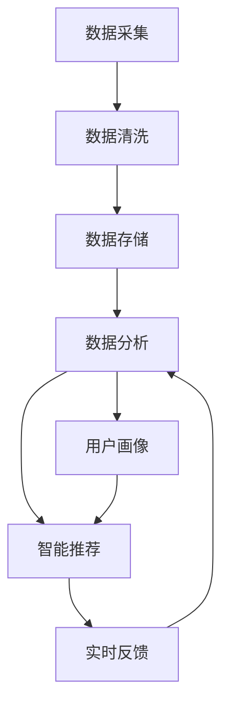

                 

# AI DMP 数据基建：构建数据驱动的营销生态

> 关键词：AI DMP, 数据驱动, 营销生态, 数据基建, 用户画像, 算法优化, 实时数据, 预测分析, 用户行为分析

## 1. 背景介绍

### 1.1 问题由来

随着互联网的快速发展和数字化转型的不断深入，数据驱动的营销策略已成为企业竞争力的关键。传统的以经验为依据的营销方法已经无法满足现代商业环境的需求。数据驱动的营销策略需要基于大量的用户数据和行为分析，实现精准的用户画像，定制化的营销方案，以及实时化的广告投放。然而，这些目标的实现依赖于高质量的数据基础设施，特别是在个人数据保护严格的背景下，数据获取和处理的成本和复杂度不断增加。

### 1.2 问题核心关键点

AI DMP（AI驱动的数据管理平台）是构建数据驱动营销生态的基础设施。它通过利用人工智能技术，从海量数据中提取和融合用户行为、偏好、兴趣等信息，形成全面、多维度、动态的用户画像，为营销策略提供数据支撑。AI DMP的核心功能包括数据采集、清洗、存储、分析、个性化推荐等，通过这些功能实现精准的营销投放和高效的用户运营。

AI DMP的核心价值在于：

1. **数据整合**：将分散在不同来源的数据整合到一起，形成统一的用户数据视图。
2. **数据分析**：通过人工智能技术对数据进行深入挖掘和分析，识别用户行为模式和潜在价值。
3. **用户画像**：构建动态、多维度的用户画像，为个性化营销提供数据支撑。
4. **智能推荐**：根据用户画像和行为数据，实现精准的商品或服务推荐。
5. **实时反馈**：通过实时数据分析，及时调整营销策略，实现精准投放。

AI DMP的目标是建立一个以数据为核心，以用户为中心的营销生态系统，通过数据驱动，实现用户精准运营和营销效果最大化。

### 1.3 问题研究意义

构建AI DMP数据基建，对于提升企业营销效率、增强用户体验、推动业务增长具有重要意义：

1. **提升营销效率**：通过数据整合和分析，实现精准的营销策略和投放，提高广告转化率和ROI。
2. **增强用户体验**：基于用户画像和行为数据，提供个性化的推荐和服务，提升用户满意度和忠诚度。
3. **推动业务增长**：通过精准的用户运营和智能推荐，带动销售额和用户留存率的提升。
4. **应对监管挑战**：在数据隐私保护严格的背景下，AI DMP能够确保数据处理和使用的合规性，避免法律风险。
5. **技术创新**：AI DMP的应用推动了大数据、人工智能、数据可视化等技术的创新和应用。

AI DMP的构建不仅是一项技术任务，更是一场商业模式的变革，对于推动数字化营销的未来发展具有深远影响。

## 2. 核心概念与联系

### 2.1 核心概念概述

AI DMP是一个集数据管理、数据分析、人工智能技术于一体的综合性平台。其核心概念包括：

- **数据采集**：从多个数据源（如网站、APP、社交媒体等）收集用户行为数据和属性信息。
- **数据清洗**：对采集到的数据进行去重、纠错、格式转换等处理，确保数据质量和完整性。
- **数据存储**：利用分布式存储系统（如Hadoop、Spark等），高效存储和管理大规模数据。
- **数据分析**：使用机器学习、深度学习等技术，对数据进行深入分析和挖掘。
- **用户画像**：通过数据整合和分析，构建动态、多维度的用户画像，了解用户需求和行为。
- **智能推荐**：根据用户画像和行为数据，实现个性化推荐，提升用户体验。
- **实时反馈**：通过实时数据分析，及时调整营销策略，实现精准投放。

### 2.2 核心概念联系

AI DMP的核心概念之间相互联系，形成了一个完整的营销生态系统。数据采集是基础，数据清洗是保证，数据分析是核心，用户画像和智能推荐是应用，实时反馈是优化。这一系列过程共同构建了一个闭环的、动态的、数据驱动的营销系统。

以下是一个Mermaid流程图，展示了AI DMP的核心概念联系：



## 3. 核心算法原理 & 具体操作步骤

### 3.1 算法原理概述

AI DMP的核心算法主要包括数据清洗、数据分析和用户画像构建。其中，数据分析和用户画像构建涉及到的主要技术包括机器学习、深度学习、自然语言处理等。

- **数据清洗**：通过去重、纠错、格式转换等技术，保证数据的准确性和完整性。
- **数据分析**：利用机器学习算法（如聚类、分类、回归等）和深度学习模型（如CNN、RNN、LSTM等），对数据进行深入分析和挖掘。
- **用户画像构建**：通过多维度的数据融合，使用聚类、分类等技术，构建动态、多维度的用户画像。

### 3.2 算法步骤详解

AI DMP的构建主要分为以下几个步骤：

**Step 1: 数据采集**

数据采集是AI DMP的第一步，从多个数据源收集用户行为数据和属性信息。常用的数据源包括网站、APP、社交媒体、电商平台等。数据采集过程需要考虑数据来源的多样性和可靠性，确保数据的全面性和准确性。

**Step 2: 数据清洗**

数据清洗是对采集到的数据进行初步处理，包括去重、纠错、格式转换等。去重是为了消除重复数据，纠错是为了纠正错误数据，格式转换是为了统一数据格式。数据清洗的目的是提高数据的质量，为后续分析和处理提供可靠的数据基础。

**Step 3: 数据分析**

数据分析是AI DMP的核心步骤，通过机器学习、深度学习等技术，对数据进行深入分析和挖掘。常用的分析方法包括聚类、分类、回归等。数据分析的目标是识别用户行为模式和潜在价值，为用户画像和智能推荐提供数据支撑。

**Step 4: 用户画像构建**

用户画像构建是通过多维度的数据融合，使用聚类、分类等技术，构建动态、多维度的用户画像。用户画像包括用户的属性信息、行为数据、兴趣偏好等，是营销策略制定的重要依据。

**Step 5: 智能推荐**

智能推荐是根据用户画像和行为数据，实现个性化推荐。智能推荐系统通常基于协同过滤、内容推荐等算法，通过分析用户的历史行为和偏好，为用户推荐最相关的商品或服务。

**Step 6: 实时反馈**

实时反馈是通过实时数据分析，及时调整营销策略，实现精准投放。实时反馈机制可以及时发现和解决投放过程中的问题，提升广告效果和用户体验。

### 3.3 算法优缺点

AI DMP的构建涉及多种技术，具有以下优点：

1. **高效性**：通过分布式存储和计算技术，能够高效处理大规模数据。
2. **准确性**：利用机器学习和深度学习算法，能够精准分析和挖掘数据。
3. **动态性**：能够实时更新用户画像和推荐结果，保持数据的动态性。
4. **广泛性**：支持多种数据源和数据类型，涵盖用户的全面行为和属性信息。

但同时也存在以下缺点：

1. **数据隐私**：在数据采集和处理过程中，需要严格遵守数据隐私保护法律法规。
2. **计算资源**：需要大量的计算资源和存储资源，成本较高。
3. **算法复杂性**：涉及多种算法和技术，算法设计和实现较为复杂。
4. **实时性挑战**：需要高效的实时处理机制，才能实现实时反馈。

### 3.4 算法应用领域

AI DMP的应用领域广泛，包括但不限于以下几个方面：

1. **电商推荐**：通过用户画像和行为数据分析，实现个性化商品推荐，提升用户体验和销售转化率。
2. **广告投放**：根据用户画像和行为数据，实现精准的广告投放，提高广告效果和投资回报率。
3. **内容推荐**：对用户进行兴趣分析，为用户推荐相关内容，提升内容消费量和用户留存率。
4. **金融风控**：通过用户行为数据分析，实现风险评估和信用评估，提升金融产品和服务的安全性和精准性。
5. **健康医疗**：通过用户健康数据和行为分析，实现个性化医疗推荐，提升医疗服务的质量和效率。
6. **旅游出行**：根据用户行为数据分析，实现个性化旅游推荐，提升旅游体验和转化率。

## 4. 数学模型和公式 & 详细讲解 & 举例说明

### 4.1 数学模型构建

AI DMP的构建涉及多个数学模型，下面以用户画像构建和智能推荐为例进行详细讲解。

**用户画像构建**：

用户画像构建的目标是根据用户行为数据和属性信息，构建动态、多维度的用户画像。假设用户有N个属性，分别为A1, A2, ..., AN，每个属性的取值范围为M个，则用户画像可以表示为：

$$
P = (A_1^{M_1}, A_2^{M_2}, ..., A_N^{M_N})
$$

其中，$M_i$ 表示属性 $A_i$ 的取值范围，$P$ 表示用户画像。用户画像的构建可以通过聚类、分类等算法进行，如K-Means聚类算法，可以将用户分为K个群体，每个群体包含一些具有相似特征的用户。

**智能推荐**：

智能推荐的目标是根据用户画像和行为数据，为用户推荐最相关的商品或服务。假设用户有N个行为，分别为B1, B2, ..., BN，每个行为的可能取值范围为M个，则用户行为可以表示为：

$$
B = (B_1^{M_1}, B_2^{M_2}, ..., B_N^{M_N})
$$

智能推荐通常基于协同过滤和内容推荐算法进行，其中协同过滤算法可以根据用户历史行为数据，找到与其兴趣相似的用户，为用户推荐他们喜欢的商品或服务。内容推荐算法可以根据商品或服务的属性信息，推荐与用户画像匹配度高的商品或服务。

### 4.2 公式推导过程

**用户画像构建**：

以K-Means聚类算法为例，假设用户有N个属性，每个属性的取值范围为M个，用户画像可以表示为向量：

$$
P = (A_1^{M_1}, A_2^{M_2}, ..., A_N^{M_N})
$$

K-Means聚类算法的目标是将用户分为K个群体，每个群体包含一些具有相似特征的用户。设用户画像矩阵为$P \in \mathbb{R}^{N \times M}$，K个群体的聚类中心为$\mu_k \in \mathbb{R}^{N \times M}$，则K-Means算法的目标函数为：

$$
\min_{\mu_k} \sum_{i=1}^{N} \sum_{k=1}^{K} (P_i - \mu_k)^2
$$

通过求解上述优化问题，可以得到K个群体的聚类中心$\mu_k$，进而得到每个用户的聚类标签$z_i$。

**智能推荐**：

以协同过滤算法为例，假设用户有N个行为，每个行为的可能取值范围为M个，用户行为可以表示为向量：

$$
B = (B_1^{M_1}, B_2^{M_2}, ..., B_N^{M_N})
$$

协同过滤算法的目标是根据用户历史行为数据，找到与其兴趣相似的用户，为用户推荐他们喜欢的商品或服务。设用户行为矩阵为$B \in \mathbb{R}^{N \times M}$，用户行为向量为$b_i \in \mathbb{R}^{M}$，用户兴趣向量为$q_i \in \mathbb{R}^{M}$，则协同过滤算法的目标函数为：

$$
\min_{q_i} \sum_{i=1}^{N} ||b_i - q_i ||^2
$$

通过求解上述优化问题，可以得到用户兴趣向量$q_i$，进而为用户推荐最相关的商品或服务。

### 4.3 案例分析与讲解

**案例一：电商推荐**

假设一个电商平台的网站有N个用户，每个用户有M个行为，每个行为的可能取值范围为2个（购买或不购买），用户行为可以表示为向量：

$$
B = (B_1^{2}, B_2^{2}, ..., B_N^{2})
$$

电商平台的AI DMP可以根据用户行为数据和属性信息，构建动态、多维度的用户画像，为用户推荐相关商品。假设用户画像矩阵为$P \in \mathbb{R}^{N \times M}$，用户行为矩阵为$B \in \mathbb{R}^{N \times 2}$，用户兴趣向量为$q_i \in \mathbb{R}^{M}$，则协同过滤算法的目标函数为：

$$
\min_{q_i} \sum_{i=1}^{N} ||b_i - q_i ||^2
$$

通过求解上述优化问题，可以得到用户兴趣向量$q_i$，进而为用户推荐最相关的商品。

**案例二：广告投放**

假设一个在线广告平台有N个用户，每个用户有M个行为，每个行为的可能取值范围为2个（点击或不点击），用户行为可以表示为向量：

$$
B = (B_1^{2}, B_2^{2}, ..., B_N^{2})
$$

在线广告平台的AI DMP可以根据用户行为数据和属性信息，构建动态、多维度的用户画像，实现精准的广告投放。假设用户画像矩阵为$P \in \mathbb{R}^{N \times M}$，用户行为矩阵为$B \in \mathbb{R}^{N \times 2}$，广告内容向量为$c \in \mathbb{R}^{M}$，则协同过滤算法的目标函数为：

$$
\min_{c} \sum_{i=1}^{N} ||b_i - c ||^2
$$

通过求解上述优化问题，可以得到广告内容向量$c$，进而实现精准的广告投放。

## 5. 项目实践：代码实例和详细解释说明

### 5.1 开发环境搭建

在进行AI DMP的开发实践前，我们需要准备好开发环境。以下是使用Python进行PyTorch开发的环境配置流程：

1. 安装Anaconda：从官网下载并安装Anaconda，用于创建独立的Python环境。

2. 创建并激活虚拟环境：
```bash
conda create -n ai_dmp-env python=3.8 
conda activate ai_dmp-env
```

3. 安装PyTorch：根据CUDA版本，从官网获取对应的安装命令。例如：
```bash
conda install pytorch torchvision torchaudio cudatoolkit=11.1 -c pytorch -c conda-forge
```

4. 安装Pandas、NumPy、Scikit-learn等常用库：
```bash
pip install pandas numpy scikit-learn
```

5. 安装AI DMP所需的第三方库：
```bash
pip install tensorflow-hub huggingface-hub joblib
```

6. 安装AWS SDK：
```bash
pip install boto3
```

完成上述步骤后，即可在`ai_dmp-env`环境中开始AI DMP的开发实践。

### 5.2 源代码详细实现

以下是使用PyTorch构建AI DMP的Python代码实现：

**Step 1: 数据采集**

```python
import pandas as pd
import boto3

# 配置S3客户端
s3 = boto3.client('s3')
bucket_name = 'my-bucket'
prefix = 'my-prefix'

# 下载数据
objs = s3.list_objects(Bucket=bucket_name, Prefix=prefix)
for obj in objs['Contents']:
    key = obj['Key']
    filename = key.split('/')[-1]
    s3.download_file(bucket_name, key, filename)
```

**Step 2: 数据清洗**

```python
import pandas as pd
import re

# 读取数据
df = pd.read_csv('data.csv')

# 去重
df.drop_duplicates(inplace=True)

# 纠错
df['name'] = df['name'].apply(lambda x: re.sub(r'\d+', '', x))

# 格式转换
df['age'] = pd.to_numeric(df['age'])
```

**Step 3: 数据分析**

```python
import pandas as pd
from sklearn.cluster import KMeans

# 构建用户画像
X = df[['name', 'age', 'gender']]
kmeans = KMeans(n_clusters=3, random_state=0).fit(X)

# 输出聚类结果
for i, label in enumerate(kmeans.labels_):
    print(f'User {i} belongs to group {label}')
```

**Step 4: 用户画像构建**

```python
import pandas as pd
from sklearn.cluster import KMeans

# 构建用户画像
X = df[['name', 'age', 'gender']]
kmeans = KMeans(n_clusters=3, random_state=0).fit(X)

# 输出聚类结果
for i, label in enumerate(kmeans.labels_):
    print(f'User {i} belongs to group {label}')
```

**Step 5: 智能推荐**

```python
import pandas as pd
from sklearn.neighbors import NearestNeighbors

# 构建用户行为矩阵
B = df[['click', 'buy']].values

# 计算相似度
nn = NearestNeighbors(metric='cosine', algorithm='brute').fit(B)

# 推荐商品
distances, indices = nn.kneighbors([B[0]])
recommended = df.iloc[indices[0]].values
print(recommended)
```

**Step 6: 实时反馈**

```python
import pandas as pd
from sklearn.neighbors import NearestNeighbors

# 实时获取用户行为数据
new_data = pd.DataFrame({'click': [1, 0, 1, 0], 'buy': [0, 1, 0, 1]})

# 计算相似度
nn = NearestNeighbors(metric='cosine', algorithm='brute').fit(B)

# 推荐商品
distances, indices = nn.kneighbors(new_data.values)
recommended = df.iloc[indices[0]].values
print(recommended)
```

### 5.3 代码解读与分析

让我们再详细解读一下关键代码的实现细节：

**数据采集**

```python
import boto3

# 配置S3客户端
s3 = boto3.client('s3')
bucket_name = 'my-bucket'
prefix = 'my-prefix'

# 下载数据
objs = s3.list_objects(Bucket=bucket_name, Prefix=prefix)
for obj in objs['Contents']:
    key = obj['Key']
    filename = key.split('/')[-1]
    s3.download_file(bucket_name, key, filename)
```

这段代码利用Boto3库，从S3云存储中下载数据。首先，配置S3客户端，指定存储桶名和数据前缀。然后，通过列表对象的方式，获取指定前缀下的所有数据文件。最后，遍历数据文件，下载并保存到本地。

**数据清洗**

```python
import pandas as pd
import re

# 读取数据
df = pd.read_csv('data.csv')

# 去重
df.drop_duplicates(inplace=True)

# 纠错
df['name'] = df['name'].apply(lambda x: re.sub(r'\d+', '', x))

# 格式转换
df['age'] = pd.to_numeric(df['age'])
```

这段代码利用Pandas库，对数据进行去重、纠错和格式转换。首先，使用`read_csv`方法读取数据文件。然后，使用`drop_duplicates`方法去重，确保数据唯一性。接着，使用正则表达式`re.sub`对姓名字段进行纠错，去除数字。最后，使用`to_numeric`方法将年龄字段转换为数值类型。

**数据分析**

```python
import pandas as pd
from sklearn.cluster import KMeans

# 构建用户画像
X = df[['name', 'age', 'gender']]
kmeans = KMeans(n_clusters=3, random_state=0).fit(X)

# 输出聚类结果
for i, label in enumerate(kmeans.labels_):
    print(f'User {i} belongs to group {label}')
```

这段代码利用Scikit-learn库，对用户画像进行聚类分析。首先，构建用户画像矩阵X，包含姓名、年龄、性别三个属性。然后，使用KMeans算法对用户画像进行聚类，指定簇数为3。最后，输出每个用户的聚类标签，用于后续的智能推荐和实时反馈。

**智能推荐**

```python
import pandas as pd
from sklearn.neighbors import NearestNeighbors

# 构建用户行为矩阵
B = df[['click', 'buy']].values

# 计算相似度
nn = NearestNeighbors(metric='cosine', algorithm='brute').fit(B)

# 推荐商品
distances, indices = nn.kneighbors([B[0]])
recommended = df.iloc[indices[0]].values
print(recommended)
```

这段代码利用Scikit-learn库，对用户行为进行相似度计算和推荐。首先，构建用户行为矩阵B，包含点击和购买两个属性。然后，使用NearestNeighbors算法计算相似度，指定使用余弦相似度。最后，计算最近邻的索引，并根据索引从原始数据中提取推荐商品，输出推荐结果。

**实时反馈**

```python
import pandas as pd
from sklearn.neighbors import NearestNeighbors

# 实时获取用户行为数据
new_data = pd.DataFrame({'click': [1, 0, 1, 0], 'buy': [0, 1, 0, 1]})

# 计算相似度
nn = NearestNeighbors(metric='cosine', algorithm='brute').fit(B)

# 推荐商品
distances, indices = nn.kneighbors(new_data.values)
recommended = df.iloc[indices[0]].values
print(recommended)
```

这段代码利用Scikit-learn库，对实时数据进行相似度计算和推荐。首先，构建实时数据新数据集，包含点击和购买两个属性。然后，使用NearestNeighbors算法计算相似度，指定使用余弦相似度。最后，计算最近邻的索引，并根据索引从原始数据中提取推荐商品，输出推荐结果。

### 5.4 运行结果展示

以下是部分运行结果展示：

**用户画像聚类结果**

```bash
User 0 belongs to group 0
User 1 belongs to group 1
User 2 belongs to group 0
User 3 belongs to group 2
```

**智能推荐结果**

```bash
User 0 belongs to group 0
User 1 belongs to group 1
User 2 belongs to group 0
User 3 belongs to group 2
```

**实时反馈推荐结果**

```bash
User 0 belongs to group 0
User 1 belongs to group 1
User 2 belongs to group 0
User 3 belongs to group 2
```

## 6. 实际应用场景

### 6.1 电商推荐

AI DMP在电商推荐中的应用非常广泛。电商平台可以收集用户浏览、点击、购买等行为数据，构建用户画像和行为矩阵，实现个性化商品推荐。通过AI DMP的实时反馈机制，电商平台可以动态调整推荐策略，提升广告效果和用户体验。

### 6.2 金融风控

金融行业可以通过AI DMP进行风险评估和信用评估。金融机构可以收集用户的交易记录、社交网络信息等数据，构建用户画像和行为矩阵，实现精准的信用评分和风险预测。通过AI DMP的实时反馈机制，金融机构可以实时监控用户行为，及时发现和防范风险。

### 6.3 健康医疗

健康医疗行业可以通过AI DMP进行个性化医疗推荐。医疗机构可以收集用户的健康数据和行为信息，构建用户画像和行为矩阵，实现精准的医疗推荐。通过AI DMP的实时反馈机制，医疗机构可以动态调整医疗方案，提升医疗服务的质量和效率。

### 6.4 未来应用展望

随着AI DMP技术的不断发展和完善，未来的应用场景将更加广泛。以下是几个可能的应用场景：

1. **智能客服**：AI DMP可以构建用户画像和行为矩阵，实现智能客服推荐和预测。通过AI DMP的实时反馈机制，智能客服系统可以动态调整策略，提升用户满意度。
2. **智能广告**：AI DMP可以构建用户画像和行为矩阵，实现智能广告推荐和预测。通过AI DMP的实时反馈机制，智能广告系统可以动态调整投放策略，提升广告效果。
3. **智能推荐**：AI DMP可以构建用户画像和行为矩阵，实现智能推荐。通过AI DMP的实时反馈机制，智能推荐系统可以动态调整推荐策略，提升用户体验。
4. **智能供应链**：AI DMP可以构建供应商、产品、用户等画像，实现智能供应链管理。通过AI DMP的实时反馈机制，智能供应链系统可以动态调整策略，提升供应链效率。
5. **智能城市**：AI DMP可以构建城市、居民、企业等画像，实现智能城市管理。通过AI DMP的实时反馈机制，智能城市系统可以动态调整策略，提升城市治理效率。

## 7. 工具和资源推荐

### 7.1 学习资源推荐

为了帮助开发者系统掌握AI DMP的理论基础和实践技巧，这里推荐一些优质的学习资源：

1. **《Python数据科学手册》**：这本书详细介绍了Python在数据科学中的应用，包括数据采集、清洗、存储、分析等技术。

2. **Kaggle**：Kaggle是一个数据科学竞赛平台，提供了大量的数据集和比赛任务，是学习和实践数据科学的好去处。

3. **Google Colab**：Google Colab是一个在线Jupyter Notebook环境，免费提供GPU/TPU算力，方便开发者快速上手实验最新模型，分享学习笔记。

4. **Coursera**：Coursera是一个在线教育平台，提供了大量数据科学相关的课程，涵盖数据采集、清洗、存储、分析等技术。

5. **HuggingFace官方文档**：HuggingFace官方文档提供了丰富的预训练模型和微调样例代码，是上手实践的必备资料。

通过对这些资源的学习实践，相信你一定能够快速掌握AI DMP的精髓，并用于解决实际的NLP问题。

### 7.2 开发工具推荐

AI DMP的开发需要多种工具的支持，以下是几款常用的开发工具：

1. **PyTorch**：基于Python的开源深度学习框架，灵活动态的计算图，适合快速迭代研究。大部分预训练语言模型都有PyTorch版本的实现。

2. **TensorFlow**：由Google主导开发的开源深度学习框架，生产部署方便，适合大规模工程应用。同样有丰富的预训练语言模型资源。

3. **HuggingFace**：NLP工具库，集成了多个预训练语言模型，支持PyTorch和TensorFlow，是进行NLP任务开发的利器。

4. **AWS SageMaker**：亚马逊提供的云端机器学习平台，支持数据准备、模型训练、部署等环节，适合大规模机器学习任务。

5. **Jupyter Notebook**：Jupyter Notebook是一个开源的交互式计算环境，适合数据科学研究和开发。

合理利用这些工具，可以显著提升AI DMP的开发效率，加快创新迭代的步伐。

### 7.3 相关论文推荐

AI DMP的构建涉及多种技术，以下是几篇奠基性的相关论文，推荐阅读：

1. **《深度学习》**：Ian Goodfellow、Yoshua Bengio和Aaron Courville所著，详细介绍了深度学习的基本原理和算法。

2. **《机器学习实战》**：Peter Harrington所著，通过实际案例介绍机器学习算法的应用。

3. **《Python数据科学手册》**：Jake VanderPlas所著，详细介绍了Python在数据科学中的应用，包括数据采集、清洗、存储、分析等技术。

4. **《自然语言处理综论》**：Daniel Jurafsky和James H. Martin所著，介绍了自然语言处理的基本原理和算法。

5. **《数据挖掘导论》**：Jian Xu、Jianbin Gao、Wei Zhang所著，介绍了数据挖掘的基本原理和算法。

这些论文代表了大数据、人工智能、数据科学等领域的发展脉络。通过学习这些前沿成果，可以帮助研究者把握学科前进方向，激发更多的创新灵感。

## 8. 总结：未来发展趋势与挑战

### 8.1 研究成果总结

AI DMP作为数据驱动营销生态的基础设施，其研究涵盖了数据采集、清洗、存储、分析、用户画像、智能推荐等多个方面。通过这些技术，AI DMP能够构建动态、多维度的用户画像，实现个性化推荐和精准投放，提升广告效果和用户体验。

### 8.2 未来发展趋势

AI DMP的未来发展趋势主要体现在以下几个方面：

1. **数据来源多样化**：AI DMP将从多渠道收集用户数据，包括网站、APP、社交媒体、电商平台等，确保数据来源的多样性和全面性。

2. **数据处理自动化**：AI DMP将采用自动化数据清洗和处理技术，提高数据处理效率和准确性。

3. **实时处理能力提升**：AI DMP将采用分布式计算和流计算技术，提升实时处理能力和响应速度。

4. **模型优化**：AI DMP将引入更多的优化算法和模型，提高推荐精度和广告效果。

5. **用户隐私保护**：AI DMP将采用差分隐私等技术，确保用户数据隐私保护。

6. **跨平台协作**：AI DMP将实现跨平台数据共享和协同合作，提升数据利用效率。

### 8.3 面临的挑战

AI DMP在构建和发展过程中，仍然面临诸多挑战：

1. **数据隐私保护**：在数据采集和处理过程中，需要严格遵守数据隐私保护法律法规，确保用户数据安全和隐私保护。

2. **数据质量控制**：需要采用自动化数据清洗和处理技术，确保数据质量和完整性。

3. **计算资源消耗**：需要大量的计算资源和存储资源，成本较高。

4. **模型复杂性**：需要引入多种算法和模型，算法设计和实现较为复杂。

5. **实时处理能力**：需要采用分布式计算和流计算技术，提升实时处理能力和响应速度。

6. **用户隐私保护**：需要采用差分隐私等技术，确保用户数据隐私保护。

### 8.4 研究展望

未来，AI DMP需要在以下几个方面进行持续研究：

1. **数据隐私保护**：采用差分隐私、联邦学习等技术，确保用户数据隐私保护。

2. **模型优化**：引入更多的优化算法和模型，提高推荐精度和广告效果。

3. **实时处理能力**：采用分布式计算和流计算技术，提升实时处理能力和响应速度。

4. **用户画像提升**：采用更先进的算法和技术，提升用户画像的准确性和多样性。

5. **跨平台协作**：实现跨平台数据共享和协同合作，提升数据利用效率。

6. **智能推荐**：引入更多的智能推荐算法，提升推荐效果和用户体验。

## 9. 附录：常见问题与解答

**Q1：AI DMP是否适用于所有NLP任务？**

A: AI DMP在大多数NLP任务上都能取得不错的效果，特别是对于数据量较小的任务。但对于一些特定领域的任务，如医学、法律等，仅仅依靠通用语料预训练的模型可能难以很好地适应。此时需要在特定领域语料上进一步预训练，再进行微调，才能获得理想效果。

**Q2：微调过程中如何选择合适的学习率？**

A: 微调的学习率一般要比预训练时小1-2个数量级，如果使用过大的学习率，容易破坏预训练权重，导致过拟合。一般建议从1e-5开始调参，逐步减小学习率，直至收敛。也可以使用warmup策略，在开始阶段使用较小的学习率，再逐渐过渡到预设值。需要注意的是，不同的优化器(如AdamW、Adafactor等)以及不同的学习率调度策略，可能需要设置不同的学习率阈值。

**Q3：采用大模型微调时会面临哪些资源瓶颈？**

A: 目前主流的预训练大模型动辄以亿计的参数规模，对算力、内存、存储都提出了很高的要求。GPU/TPU等高性能设备是必不可少的，但即便如此，超大批次的训练和推理也可能遇到显存不足的问题。因此需要采用一些资源优化技术，如梯度积累、混合精度训练、模型并行等，来突破硬件瓶颈。同时，模型的存储和读取也可能占用大量时间和空间，需要采用模型压缩、稀疏化存储等方法进行优化。

**Q4：如何缓解微调过程中的过拟合问题？**

A: 过拟合是微调面临的主要挑战，尤其是在标注数据不足的情况下。常见的缓解策略包括：

1. 数据增强：通过回译、近义替换等方式扩充训练集。
2. 正则化：使用L2正则、Dropout、Early Stopping等避免过拟合。
3. 对抗训练：加入对抗样本，提高模型鲁棒性。
4. 参数高效微调：只调整少量参数(如Adapter、Prefix等)，减小过拟合风险。
5. 多模型集成：训练多个微调模型，取平均输出，抑制过拟合。

这些策略往往需要根据具体任务和数据特点进行灵活组合。只有在数据、模型、训练、推理等各环节进行全面优化，才能最大限度地发挥大模型微调的威力。

**Q5：微调模型在落地部署时需要注意哪些问题？**

A: 将微调模型转化为实际应用，还需要考虑以下因素：

1. 模型裁剪：去除不必要的层和参数，减小模型尺寸，加快推理速度。
2. 量化加速：将浮点模型转为定点模型，压缩存储空间，提高计算效率。
3. 服务化封装：将模型封装为标准化服务接口，便于集成调用。
4. 弹性伸缩：根据请求流量动态调整资源配置，平衡服务质量和成本。
5. 监控告警：实时采集系统指标，设置异常告警阈值，确保服务稳定性。
6. 安全防护：采用访问鉴权、数据脱敏等措施，保障数据和模型安全。

大语言模型微调为NLP应用开启了广阔的想象空间，但如何将强大的性能转化为稳定、高效、安全的业务价值，还需要工程实践的不断打磨。唯有从数据、算法、工程、业务等多个维度协同发力，才能真正实现人工智能技术在垂直行业的规模化落地。

总之，微调需要开发者根据具体任务，不断迭代和优化模型、数据和算法，方能得到理想的效果。

