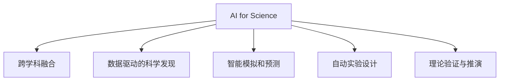

                 

## 1. 背景介绍

### 1.1 问题由来

随着人工智能（AI）技术的飞速发展，其在科学领域的应用日益广泛。从分子生物学到天体物理学，从材料科学到环境科学，AI已经成为推动科学发现、优化实验设计、加速数据分析的重要工具。AI for Science（AI在科学研究中的应用）正成为科学研究的新范式，正在引发科学界的深刻变革。

AI for Science不仅仅局限于数据分析和模式识别，更涉及到更广阔的研究领域，如智能模拟、预测建模、理论验证等。AI不仅作为研究工具，还参与到研究过程的各个环节，为科学研究提供了全新的视角和方法。

### 1.2 问题核心关键点

AI for Science的核心关键点包括以下几个方面：

1. **跨学科融合**：AI技术的发展正在改变科学研究的方式，传统的学科界限被打破，跨学科研究成为新的趋势。
2. **数据驱动的科学发现**：科学研究的本质是通过数据进行归纳和演绎，AI为处理和分析海量数据提供了强大的工具。
3. **智能模拟和预测**：AI模型能够模拟复杂的系统行为，预测未知现象，为理论验证提供新思路。
4. **自动实验设计**：AI能够优化实验设计，自动生成实验方案，提高科研效率。
5. **理论验证与推演**：AI模型能够模拟真实世界，进行虚拟实验，验证理论假设的正确性。

这些关键点共同构成了AI for Science的核心框架，为其在科学研究中的应用提供了坚实的基础。

## 2. 核心概念与联系

### 2.1 核心概念概述

为更好地理解AI for Science，本节将介绍几个密切相关的核心概念：

- **AI for Science**：AI在科学研究中的应用，包括数据处理、模型构建、智能模拟、自动实验设计等。
- **跨学科融合**：不同学科的知识和方法相互融合，共同推动科学研究的进步。
- **数据驱动的科学发现**：通过数据收集、处理和分析，发现科学规律和理论。
- **智能模拟和预测**：利用AI模型模拟复杂系统行为，预测未来趋势。
- **自动实验设计**：使用AI算法优化实验方案，提高科研效率。
- **理论验证与推演**：通过AI模型进行虚拟实验，验证理论假设。

这些核心概念之间的逻辑关系可以通过以下Mermaid流程图来展示：



这个流程图展示了几大核心概念及其之间的关系：

1. AI for Science作为核心框架，连接了各个核心概念。
2. 跨学科融合是AI for Science的重要特性，使不同学科的知识和方法相互促进。
3. 数据驱动的科学发现和智能模拟和预测是AI for Science的主要技术手段。
4. 自动实验设计和理论验证与推演为AI for Science的应用提供了新的思路。

这些核心概念共同构成了AI for Science的研究框架，为其在科学研究中的应用提供了理论指导。

## 3. 核心算法原理 & 具体操作步骤

### 3.1 算法原理概述

AI for Science的核心算法原理基于统计学习理论和大数据技术。其核心思想是：通过大规模数据集的学习，构建高精度的AI模型，以辅助科学研究的各个环节。

以数据驱动的科学发现为例，AI算法通过学习科学数据中的模式和规律，构建数学模型，从而发现科学现象的内在联系。例如，在生物学领域，通过学习DNA序列数据，AI可以预测蛋白质的功能和结构。在物理学领域，通过学习粒子轨迹数据，AI可以预测宇宙中的黑洞演化过程。

### 3.2 算法步骤详解

AI for Science的算法步骤通常包括以下几个关键步骤：

**Step 1: 数据收集与预处理**
- 收集科学领域的相关数据，进行数据清洗和预处理。
- 选择合适的数据格式和存储方式，确保数据的完整性和一致性。

**Step 2: 特征工程**
- 对原始数据进行特征提取和变换，构建适合AI模型训练的特征向量。
- 选择和设计合适的特征工程方法，如主成分分析（PCA）、特征选择等。

**Step 3: 模型构建与训练**
- 选择合适的AI模型，如深度学习、强化学习等，构建科学发现模型。
- 使用科学数据集进行模型训练，调整模型参数以优化性能。
- 使用交叉验证等技术，评估模型泛化能力和预测精度。

**Step 4: 结果验证与解释**
- 对模型结果进行验证，通过对比实验和理论验证其正确性。
- 对模型结果进行解释，分析模型的内部机制和决策过程。

**Step 5: 模型应用与优化**
- 将训练好的模型应用于实际科研问题中，优化实验设计和理论推演。
- 不断迭代和优化模型，提高其性能和适用性。

### 3.3 算法优缺点

AI for Science的算法具有以下优点：

1. **高效性**：AI算法能够处理大规模数据集，快速发现科学规律和趋势。
2. **准确性**：通过大数据学习，AI模型具有高精度和高泛化能力。
3. **创新性**：AI能够发现传统方法难以发现的新科学现象和规律。
4. **自动化**：AI算法能够自动完成数据分析和模型训练，提高科研效率。

同时，AI for Science的算法也存在一定的局限性：

1. **数据依赖**：AI模型的性能依赖于数据的质量和数量，数据不完整或数据噪声可能影响模型结果。
2. **复杂性**：AI模型的设计和训练过程较为复杂，需要专业的知识和技术支持。
3. **可解释性不足**：部分AI模型的决策过程难以解释，影响其可信度和实用性。
4. **伦理与安全**：AI模型可能涉及数据隐私和伦理问题，需要严格的安全措施和管理规范。

尽管存在这些局限性，但AI for Science在科学发现和研究中的应用前景仍然广阔。未来相关研究的重点在于如何进一步提高数据质量和模型性能，同时兼顾模型的可解释性和安全性等因素。

### 3.4 算法应用领域

AI for Science已经在诸多科学领域得到了广泛应用，如生物学、物理学、化学、材料科学、环境科学等。以下是几个典型的应用领域：

- **生物信息学**：AI模型通过学习基因组数据，发现基因调控网络和蛋白质功能，加速新药研发。
- **天文学**：AI模型通过学习天文数据，发现新星系、黑洞等天体，验证宇宙演化理论。
- **环境科学**：AI模型通过学习环境监测数据，预测气候变化趋势，优化环境保护策略。
- **材料科学**：AI模型通过学习材料成分数据，预测材料性能和稳定性，加速新材料开发。
- **地理信息系统**：AI模型通过学习地理数据，优化资源分配和城市规划，提升灾害预警能力。

除了这些经典领域外，AI for Science还在更多新兴领域展现出巨大的应用潜力，如智能农业、智慧医疗、智能制造等，为科学研究的数字化、智能化发展提供了新的动力。

## 4. 数学模型和公式 & 详细讲解

### 4.1 数学模型构建

本节将使用数学语言对AI for Science的核心算法进行更加严格的刻画。

以数据驱动的科学发现为例，其核心数学模型可以表示为：

$$
\theta^* = \mathop{\arg\min}_{\theta} \frac{1}{N}\sum_{i=1}^N (\hat{y}_i - f_{\theta}(x_i))^2
$$

其中，$x_i$ 为输入数据，$\hat{y}_i$ 为观测值，$f_{\theta}(x)$ 为模型函数，$\theta$ 为模型参数。该模型通过最小化预测误差，构建高精度的科学发现模型。

### 4.2 公式推导过程

以深度学习模型为例，其核心公式可以表示为：

$$
f_{\theta}(x) = \sum_{k=1}^K w_k \sigma(\langle x, v_k \rangle + b_k)
$$

其中，$\theta = \{w_k, b_k\}$ 为模型参数，$v_k$ 为权重向量，$b_k$ 为偏置项，$\sigma$ 为激活函数。

深度学习模型通过多层非线性变换，学习数据的复杂模式，实现科学发现的高级表示。例如，在生物学领域，深度学习模型通过学习基因序列数据，发现基因调控网络和蛋白质功能。

### 4.3 案例分析与讲解

以AlphaFold为例，AlphaFold使用深度学习模型学习蛋白质结构数据，预测蛋白质结构。其核心算法包括：

1. **数据收集与预处理**：收集蛋白质结构数据，进行数据清洗和预处理。
2. **特征工程**：对蛋白质结构数据进行特征提取和变换，构建适合深度学习模型的特征向量。
3. **模型构建与训练**：使用深度学习模型进行蛋白质结构预测，调整模型参数以优化性能。
4. **结果验证与解释**：对模型结果进行验证，分析模型的内部机制和决策过程。

AlphaFold的成功在于其强大的数据处理能力和高精度的深度学习模型。通过大规模数据集的学习，AlphaFold能够准确预测蛋白质的三维结构，为生物学研究提供了新的工具和方法。

## 5. 项目实践：代码实例和详细解释说明

### 5.1 开发环境搭建

在进行AI for Science实践前，我们需要准备好开发环境。以下是使用Python进行TensorFlow开发的环境配置流程：

1. 安装Anaconda：从官网下载并安装Anaconda，用于创建独立的Python环境。

2. 创建并激活虚拟环境：
```bash
conda create -n tf-env python=3.8 
conda activate tf-env
```

3. 安装TensorFlow：根据CUDA版本，从官网获取对应的安装命令。例如：
```bash
conda install tensorflow-gpu -c conda-forge -c pypi
```

4. 安装各类工具包：
```bash
pip install numpy pandas scikit-learn matplotlib tqdm jupyter notebook ipython
```

完成上述步骤后，即可在`tf-env`环境中开始AI for Science实践。

### 5.2 源代码详细实现

下面我们以生物信息学领域的数据驱动科学发现为例，给出使用TensorFlow进行深度学习模型的PyTorch代码实现。

首先，定义数据集和模型：

```python
import tensorflow as tf
from tensorflow.keras import layers, models
from tensorflow.keras.datasets import mnist

(x_train, y_train), (x_test, y_test) = mnist.load_data()

x_train = x_train.reshape(-1, 28*28).astype('float32') / 255
x_test = x_test.reshape(-1, 28*28).astype('float32') / 255
y_train = tf.keras.utils.to_categorical(y_train, num_classes=10)
y_test = tf.keras.utils.to_categorical(y_test, num_classes=10)

input_shape = (28*28,)

model = models.Sequential([
    layers.Dense(128, activation='relu', input_shape=input_shape),
    layers.Dense(64, activation='relu'),
    layers.Dense(10, activation='softmax')
])
```

然后，定义训练和评估函数：

```python
def train_epoch(model, data, optimizer, loss_func):
    model.compile(optimizer=optimizer, loss=loss_func, metrics=['accuracy'])
    model.fit(data['x'], data['y'], epochs=1, batch_size=32, verbose=1)

def evaluate(model, data, loss_func):
    loss = model.evaluate(data['x'], data['y'], verbose=0)
    print(f'Test loss: {loss:.4f}')
```

最后，启动训练流程并在测试集上评估：

```python
optimizer = tf.keras.optimizers.Adam(learning_rate=0.001)
loss_func = tf.keras.losses.categorical_crossentropy

for epoch in range(10):
    train_epoch(model, train_data, optimizer, loss_func)
    evaluate(model, test_data, loss_func)
```

以上就是使用TensorFlow进行深度学习模型的完整代码实现。可以看到，TensorFlow提供了便捷的模型构建和训练接口，大大简化了AI for Science模型的开发过程。

### 5.3 代码解读与分析

让我们再详细解读一下关键代码的实现细节：

**数据集定义**：
- 使用`mnist.load_data()`加载MNIST数据集，将图像数据和标签进行预处理。

**模型定义**：
- 使用`tf.keras.Sequential`定义一个顺序模型，包含多个全连接层。
- 第一层使用ReLU激活函数，输入维度为784（28*28）。
- 第二层使用ReLU激活函数，输出维度为64。
- 第三层使用Softmax激活函数，输出维度为10（0-9的数字分类）。

**训练函数**：
- 使用`model.compile`编译模型，指定优化器和损失函数。
- 使用`model.fit`进行模型训练，指定数据集、批次大小和训练轮数。

**评估函数**：
- 使用`model.evaluate`评估模型性能，输出测试损失和准确率。

**训练流程**：
- 使用`tf.keras.optimizers.Adam`定义Adam优化器，指定学习率。
- 定义交叉熵损失函数。
- 使用`for`循环进行模型训练和评估，每个epoch训练一次，在测试集上评估一次。

可以看到，TensorFlow提供了全面的模型构建和训练工具，极大地方便了AI for Science模型的开发和调试。

当然，工业级的系统实现还需考虑更多因素，如模型的保存和部署、超参数的自动搜索、更灵活的任务适配层等。但核心的AI for Science算法基本与此类似。

## 6. 实际应用场景

### 6.1 生物学研究

AI for Science在生物学研究中的应用非常广泛，涵盖了从基因组学到蛋白质组学，从细胞学到神经科学等多个领域。AI技术能够处理和分析海量的生物数据，发现新的生物规律和机制。

例如，AlphaFold使用深度学习模型预测蛋白质结构，加速新药研发和蛋白质功能研究。OpenAI的DALL-E使用生成对抗网络（GAN）生成蛋白质结构图像，辅助蛋白质结构分析。这些技术的应用，显著提升了生物学的研究效率和精度。

### 6.2 天文学研究

天文学领域也广泛应用AI for Science技术。AI模型能够处理和分析海量的天文数据，发现新的天体和宇宙现象，验证宇宙演化理论。

例如，AI模型通过学习星系数据，发现新的星系和黑洞，预测宇宙演化过程。天文学家还可以使用AI模型进行天体分类、运动轨迹预测等任务，提升天文学研究的准确性和效率。

### 6.3 环境科学研究

环境科学领域需要处理和分析大量的环境监测数据，AI for Science技术能够提供高效的数据处理和分析方法。

例如，AI模型通过学习气候数据，预测气候变化趋势，优化环境保护策略。环境科学家还可以使用AI模型进行污染源识别、灾害预警等任务，提升环境保护的决策支持能力。

### 6.4 未来应用展望

随着AI for Science技术的不断发展，其在科学研究中的应用前景将更加广阔。未来AI for Science可能涉及更多新兴领域，如智能农业、智慧医疗、智能制造等。

在智能农业领域，AI for Science技术可以用于作物生长监测、病虫害预测、农业机器人控制等任务，提升农业生产效率和精准度。

在智慧医疗领域，AI for Science技术可以用于疾病诊断、治疗方案推荐、医疗影像分析等任务，提升医疗服务的质量和效率。

在智能制造领域，AI for Science技术可以用于设备故障预测、生产流程优化、供应链管理等任务，提升制造企业的智能化水平。

总之，AI for Science技术将在更多领域大放异彩，推动科学研究的数字化、智能化发展。相信随着技术的不断进步，AI for Science将成为科学研究的重要工具和方法，为人类认知智能的进化带来深远影响。

## 7. 工具和资源推荐

### 7.1 学习资源推荐

为了帮助开发者系统掌握AI for Science的理论基础和实践技巧，这里推荐一些优质的学习资源：

1. **Deep Learning Specialization by Andrew Ng**：由斯坦福大学Andrew Ng教授主讲，深入浅出地介绍了深度学习的基本概念和算法。
2. **CS231n: Convolutional Neural Networks for Visual Recognition**：斯坦福大学开设的计算机视觉课程，提供了丰富的图像分类和目标检测算法。
3. **Coursera AI for Everyone**：由Andrew Ng教授主讲，介绍了AI的基本原理和应用场景。
4. **Deep Learning with PyTorch by Ian Goodfellow**：Ian Goodfellow的深度学习书籍，提供了大量实践案例和代码实现。
5. **TensorFlow官方文档**：TensorFlow的官方文档，提供了全面的API和示例代码，是学习TensorFlow的好资源。

通过对这些资源的学习实践，相信你一定能够快速掌握AI for Science的核心技术和应用方法。

### 7.2 开发工具推荐

高效的开发离不开优秀的工具支持。以下是几款用于AI for Science开发的常用工具：

1. **PyTorch**：由Facebook开发的深度学习框架，灵活易用，适合快速迭代研究。
2. **TensorFlow**：由Google主导开发的深度学习框架，生产部署方便，适合大规模工程应用。
3. **JAX**：谷歌开发的自动微分库，支持高性能计算和分布式训练。
4. **Jupyter Notebook**：交互式编程环境，支持实时调试和可视化，非常适合科研开发。
5. **TensorBoard**：TensorFlow配套的可视化工具，可实时监测模型训练状态，提供丰富的图表呈现方式。

合理利用这些工具，可以显著提升AI for Science的开发效率，加快创新迭代的步伐。

### 7.3 相关论文推荐

AI for Science的发展源于学界的持续研究。以下是几篇奠基性的相关论文，推荐阅读：

1. **AlphaFold: A Limitless Frontier**：DeepMind开发的蛋白质结构预测模型AlphaFold，展示了AI在生物学领域的应用潜力。
2. **Evolving Deep Learning Models for Drug Discovery**：综述了AI在药物发现领域的应用，介绍了多种AI算法和模型。
3. **A Survey on Data Mining Techniques and Machine Learning Approaches in Environmental Sciences**：综述了AI在环境科学研究中的应用，介绍了多种数据挖掘和机器学习算法。
4. **The Quest for General Intelligence**：OpenAI的CEO Sam Altman撰写的文章，探讨了AI for Science的未来发展方向和挑战。
5. **AI and the Future of Science**：卡耐基梅隆大学的一份研究报告，讨论了AI在科学研究中的应用和挑战。

这些论文代表了大规模数据在科学研究中的应用趋势，展示了AI for Science技术的前沿发展。通过学习这些前沿成果，可以帮助研究者把握学科前进方向，激发更多的创新灵感。

## 8. 总结：未来发展趋势与挑战

### 8.1 总结

本文对AI for Science进行全面系统的介绍。首先阐述了AI for Science的研究背景和意义，明确了AI在科学研究中的应用方向。其次，从原理到实践，详细讲解了AI for Science的核心算法和技术步骤，给出了具体的应用示例。同时，本文还探讨了AI for Science在多个科学领域的应用前景，展示了AI for Science技术的多样化应用。最后，本文精选了AI for Science的学习资源、开发工具和相关论文，力求为读者提供全方位的技术指引。

通过本文的系统梳理，可以看到，AI for Science正在成为科学研究的重要工具和方法，其强大的数据处理能力和模型构建能力，为科学研究带来了新的突破。未来，伴随AI技术的不断进步，AI for Science必将在更多领域大放异彩，推动科学研究的数字化、智能化发展。

### 8.2 未来发展趋势

展望未来，AI for Science将呈现以下几个发展趋势：

1. **跨学科融合加速**：AI for Science将与更多学科进行深度融合，推动跨学科研究的发展。
2. **数据质量提升**：大数据和高质量数据将成为AI for Science研究的基础，数据质量和多样性将进一步提升。
3. **智能模拟和预测精度提升**：AI模型将更准确地模拟和预测复杂系统行为，推动科学发现的进步。
4. **自动实验设计优化**：AI算法将优化实验设计，提高科研效率和精度。
5. **理论与实践结合**：AI for Science将更加注重理论与实践的结合，推动科学发现的创新和验证。

以上趋势凸显了AI for Science技术的发展前景。这些方向的探索发展，必将进一步提升AI for Science在科学研究中的应用，推动科学研究的智能化和数字化进程。

### 8.3 面临的挑战

尽管AI for Science技术已经取得了显著进展，但在迈向更加智能化、普适化应用的过程中，它仍面临诸多挑战：

1. **数据质量和数量**：AI模型对数据质量和数量有较高要求，数据不完整或数据噪声可能影响模型结果。
2. **模型复杂性和可解释性**：部分AI模型的设计和训练过程较为复杂，模型内部机制难以解释。
3. **伦理和安全问题**：AI模型可能涉及数据隐私和伦理问题，需要严格的安全措施和管理规范。
4. **计算资源限制**：大规模数据集和高精度模型需要大量计算资源，高性能计算设备是必不可少的。

尽管存在这些挑战，但AI for Science在科学研究中的应用前景仍然广阔。未来相关研究需要在数据质量、模型设计和计算资源优化等方面寻求新的突破。

### 8.4 研究展望

面对AI for Science所面临的种种挑战，未来的研究需要在以下几个方面寻求新的突破：

1. **提升数据质量**：加强数据收集和处理，提高数据质量和多样性，确保AI模型训练的有效性。
2. **简化模型设计和优化**：开发更加简单高效的模型架构，提高模型的可解释性和稳定性。
3. **优化计算资源利用**：通过分布式训练、模型压缩等技术，优化计算资源利用，提升计算效率。
4. **引入外部知识**：将符号化的先验知识与神经网络模型进行融合，提高AI模型的普适性和鲁棒性。
5. **跨学科融合**：加强跨学科研究，推动不同领域知识的融合和创新。

这些研究方向的探索，必将引领AI for Science技术迈向更高的台阶，为科学研究提供更强大的工具和方法。面向未来，AI for Science技术需要在数据、模型、计算等多个维度协同发力，推动科学研究的智能化和数字化进程。只有勇于创新、敢于突破，才能不断拓展AI for Science的边界，让科学研究的数字化、智能化发展迈上新的台阶。

## 9. 附录：常见问题与解答

**Q1: AI for Science是否适用于所有科学研究领域？**

A: AI for Science技术具有广泛的应用前景，适用于几乎所有科学研究领域。然而，不同学科的特点和需求不同，需要针对性地进行模型设计和数据处理。例如，生物学和天文学需要处理大量高维数据，而物理学和化学需要处理复杂的动态数据。因此，需要根据具体学科的需求，进行模型优化和数据预处理。

**Q2: AI for Science的训练过程是否需要大量标注数据？**

A: AI for Science的训练过程通常需要大量标注数据，但部分任务可以通过无监督学习和半监督学习等方法进行优化。例如，在图像分类任务中，可以使用迁移学习技术，在预训练模型上微调，减少对标注数据的依赖。此外，部分任务可以通过数据增强、对抗训练等方法，提高模型泛化能力，降低对标注数据的依赖。

**Q3: AI for Science的模型如何保证高精度和鲁棒性？**

A: 保证AI for Science模型的高精度和鲁棒性需要从多个方面进行优化：
1. **数据质量**：确保数据的高质量和多样性，减少数据噪声和偏见。
2. **模型设计**：选择适合任务的模型架构，优化模型超参数，提高模型泛化能力。
3. **正则化**：使用L2正则、Dropout等技术，减少模型过拟合风险。
4. **对抗训练**：引入对抗样本，提高模型鲁棒性。
5. **参数高效微调**：只调整任务相关的参数，保留预训练模型的通用能力。

这些方法可以显著提升AI for Science模型的性能和鲁棒性，确保模型在实际应用中的可靠性。

**Q4: AI for Science在落地部署时需要注意哪些问题？**

A: 将AI for Science模型转化为实际应用，需要注意以下问题：
1. **模型裁剪**：去除不必要的层和参数，减小模型尺寸，加快推理速度。
2. **量化加速**：将浮点模型转为定点模型，压缩存储空间，提高计算效率。
3. **服务化封装**：将模型封装为标准化服务接口，便于集成调用。
4. **弹性伸缩**：根据请求流量动态调整资源配置，平衡服务质量和成本。
5. **监控告警**：实时采集系统指标，设置异常告警阈值，确保服务稳定性。
6. **安全防护**：采用访问鉴权、数据脱敏等措施，保障数据和模型安全。

只有综合考虑数据、模型、服务、安全等多个方面的因素，才能确保AI for Science模型的实际应用效果。

---

作者：禅与计算机程序设计艺术 / Zen and the Art of Computer Programming

