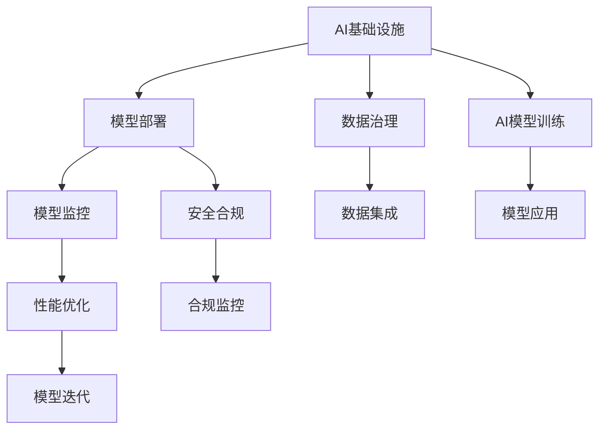

                 

## 1. 背景介绍

随着人工智能技术的不断发展，AI基础设施在各行业的应用正逐渐从理论走向实践。从金融、医疗、教育到制造业、农业、零售，AI正在逐步改变传统行业的运营模式，带来颠覆性的变革。然而，传统行业往往存在数字化转型缓慢、技术积累不足等问题，无法迅速适应AI时代的要求。如何利用AI基础设施，推动传统行业转型升级，成为当下亟需解决的重要课题。

### 1.1 传统行业转型面临的挑战

1. **数据孤岛**：许多传统行业尚未建立完善的数据管理体系，数据分散在不同部门和业务系统中，难以整合利用。
2. **技术鸿沟**：传统行业对AI技术的理解有限，缺乏相关技术人才和基础设施。
3. **成本压力**：传统行业企业资源有限，大规模投入AI基础设施和人才培训的成本较高。
4. **安全风险**：AI应用过程中数据隐私和安全问题不容忽视，传统行业企业在数据管理和网络安全方面经验不足。
5. **业务适配**：AI技术需要与传统业务流程无缝衔接，如何在保持业务稳定性的同时引入AI，是传统行业面临的难题。

### 1.2 传统行业对AI基础设施的需求

为了应对这些挑战，传统行业对AI基础设施提出了以下需求：

1. **数据集成**：提供一个统一的数据管理平台，支持数据采集、清洗、整合，为AI模型的训练和应用提供支持。
2. **技术栈整合**：集成和优化现有的IT基础设施，支持多种AI框架和技术栈的部署和运行。
3. **成本控制**：降低AI基础设施建设和使用成本，使中小型企业也能负担得起。
4. **安全保障**：提供强大的数据安全防护措施，确保数据隐私和安全。
5. **业务适配**：灵活适配不同的业务场景，提供可定制的AI应用解决方案。

## 2. 核心概念与联系

### 2.1 核心概念概述

为更好地理解AI基础设施在传统行业转型中的应用，本节将介绍几个关键概念及其相互联系：

- **AI基础设施**：指支持AI模型训练、推理、部署等各个环节所需的软件和硬件设施，包括云计算平台、大数据平台、AI框架、模型库等。
- **数据治理**：通过标准化、整合、清洗、保护等手段，提高数据质量和可用性，确保数据安全。
- **AI模型训练**：使用大规模数据和计算资源，训练出高性能、可解释的AI模型。
- **模型部署**：将训练好的模型封装成服务，部署到生产环境中，进行实时推理和应用。
- **模型监控**：通过监控模型性能和数据流，及时发现和解决问题，确保AI应用稳定运行。
- **安全合规**：遵循数据隐私和安全法规，保护用户隐私，确保AI应用合法合规。

这些核心概念通过以下Mermaid流程图展示了它们之间的联系：



这个流程图展示了AI基础设施的各个组件及其相互关系：

1. **数据治理**：确保数据的高质量和可用性，为模型训练和应用提供基础。
2. **AI模型训练**：通过训练生成高性能的AI模型，支持模型的推理和应用。
3. **模型部署**：将训练好的模型封装成服务，部署到生产环境中。
4. **模型监控**：实时监控模型性能和数据流，确保模型稳定运行。
5. **安全合规**：保护数据隐私和安全，确保模型合法合规。

## 3. 核心算法原理 & 具体操作步骤

### 3.1 算法原理概述

AI基础设施的核心原理在于通过数据治理、模型训练、模型部署等环节，构建起一个高效的AI应用生态。其核心目标是通过优化数据管理和AI模型训练、推理等环节，提升AI应用的效果和效率，赋能传统行业的数字化转型。

### 3.2 算法步骤详解

基于上述核心原理，AI基础设施的构建和应用主要包括以下几个关键步骤：

**Step 1: 数据治理**

- **数据收集**：从不同数据源采集数据，包括结构化数据和非结构化数据。
- **数据清洗**：清洗数据中的噪声和错误，提高数据质量。
- **数据整合**：将分散的数据整合到统一的平台，形成数据仓库。
- **数据标注**：为训练数据集进行标注，提供有监督学习信号。

**Step 2: 模型训练**

- **选择合适的框架和算法**：根据任务需求选择适合的AI框架和算法。
- **数据预处理**：对数据进行标准化、归一化等预处理。
- **模型训练**：使用大规模数据进行模型训练，优化模型参数。
- **模型评估**：使用测试集评估模型性能，选择最优模型。

**Step 3: 模型部署**

- **模型封装**：将训练好的模型封装成服务或API，提供接口。
- **服务部署**：将模型部署到云平台或本地服务器，进行实时推理。
- **性能优化**：优化模型的推理速度和资源占用，确保高效运行。

**Step 4: 模型监控**

- **实时监控**：实时监控模型的性能指标和数据流，及时发现问题。
- **异常检测**：设置异常检测机制，及时处理异常情况。
- **性能优化**：根据监控结果进行模型迭代优化。

**Step 5: 安全合规**

- **数据加密**：对敏感数据进行加密处理，确保数据安全。
- **访问控制**：设置严格的访问控制机制，防止未经授权的访问。
- **合规检查**：定期进行合规检查，确保应用合法合规。

### 3.3 算法优缺点

AI基础设施在赋能传统行业转型的过程中，具有以下优点：

1. **提高效率**：通过数据集成和模型训练，大幅提升数据处理和模型推理的效率。
2. **降低成本**：通过共享基础设施资源，降低企业AI应用的开发和运维成本。
3. **增强灵活性**：支持多种AI框架和技术栈，灵活应对不同的业务需求。
4. **提升安全性和合规性**：提供强大的安全防护和合规检查机制，确保数据和应用的安全性。

同时，AI基础设施也存在以下局限性：

1. **数据孤岛**：数据管理和集成难度较大，可能存在数据孤岛现象。
2. **技术复杂度**：AI基础设施的构建和维护需要较高的技术门槛，对企业技术团队要求较高。
3. **成本风险**：初期投资和维护成本较高，需要企业进行合理评估。
4. **安全风险**：数据隐私和安全问题复杂，需要企业具备强大的技术能力。
5. **业务适配**：AI模型需要与现有业务流程无缝衔接，适配难度较大。

### 3.4 算法应用领域

AI基础设施在多个领域的应用已经取得了显著成效，具体包括：

- **金融行业**：利用AI基础设施进行风险评估、欺诈检测、智能投顾等应用，提升金融服务效率和精准度。
- **医疗行业**：通过AI基础设施进行疾病诊断、药物研发、患者管理等，改善医疗服务质量。
- **零售行业**：利用AI基础设施进行商品推荐、库存管理、客户分析等，提升零售业务效率和客户满意度。
- **制造业**：通过AI基础设施进行设备维护、生产优化、质量检测等，提升制造业的智能化水平。
- **农业**：利用AI基础设施进行作物病虫害监测、土壤分析、精准农业管理等，提高农业生产效率。

## 4. 数学模型和公式 & 详细讲解 & 举例说明

### 4.1 数学模型构建

在AI基础设施中，数据治理、模型训练、模型部署等环节都涉及复杂的数学模型。以下将以数据治理为例，介绍其数学模型的构建。

假设有一批需要清洗和整合的数据集 $D=\{x_1, x_2, ..., x_n\}$，其中 $x_i$ 表示一条数据记录。数据清洗的数学模型可以表示为：

$$
\min_{\hat{x}_i} \sum_{i=1}^n \ell(\hat{x}_i, x_i)
$$

其中 $\ell$ 表示数据清洗的损失函数，$\hat{x}_i$ 表示清洗后的数据记录。

### 4.2 公式推导过程

在数据清洗中，常用的损失函数包括均方误差损失和交叉熵损失。以均方误差损失为例，其公式推导如下：

$$
\ell(\hat{x}_i, x_i) = \frac{1}{2}\sum_{j=1}^m (\hat{x}_{ij} - x_{ij})^2
$$

其中 $m$ 表示数据记录中的特征数量。

通过对数据清洗模型进行优化，可以得到最优的清洗策略，从而提高数据的质量。

### 4.3 案例分析与讲解

以金融风险评估为例，AI基础设施在数据治理、模型训练、模型部署等环节的具体应用如下：

**数据治理**

- **数据收集**：从银行系统、征信系统等渠道采集客户的财务、信用等信息。
- **数据清洗**：清洗数据中的噪声和错误，如异常值和缺失值。
- **数据整合**：将客户的财务、信用等信息整合到统一的数据仓库中，形成完整的客户画像。
- **数据标注**：对客户的信用评分进行标注，作为模型的监督信号。

**模型训练**

- **选择合适的框架和算法**：选择TensorFlow或PyTorch等AI框架，使用深度学习算法进行模型训练。
- **数据预处理**：对数据进行标准化、归一化等预处理，确保数据的一致性和可用性。
- **模型训练**：使用大规模数据进行模型训练，优化模型参数，构建信用评分模型。
- **模型评估**：使用测试集评估模型的性能，选择最优模型。

**模型部署**

- **模型封装**：将训练好的模型封装成API，提供实时风险评估服务。
- **服务部署**：将模型部署到云平台或本地服务器，进行实时风险评估。
- **性能优化**：优化模型的推理速度和资源占用，确保高效运行。

**模型监控**

- **实时监控**：实时监控模型的性能指标和数据流，及时发现问题。
- **异常检测**：设置异常检测机制，及时处理异常情况。
- **性能优化**：根据监控结果进行模型迭代优化。

**安全合规**

- **数据加密**：对客户敏感数据进行加密处理，确保数据安全。
- **访问控制**：设置严格的访问控制机制，防止未经授权的访问。
- **合规检查**：定期进行合规检查，确保应用合法合规。

通过以上步骤，金融机构能够利用AI基础设施进行高效的信用风险评估，提升风险管理能力。

## 5. 项目实践：代码实例和详细解释说明

### 5.1 开发环境搭建

在AI基础设施项目实践中，需要搭建一个完整的开发环境。以下是使用Python进行Kubeflow开发的环境配置流程：

1. 安装Anaconda：从官网下载并安装Anaconda，用于创建独立的Python环境。

2. 创建并激活虚拟环境：
```bash
conda create -n tf-env python=3.8 
conda activate tf-env
```

3. 安装TensorFlow：根据CUDA版本，从官网获取对应的安装命令。例如：
```bash
pip install tensorflow
```

4. 安装Kubeflow：通过Anaconda安装Kubeflow，可通过以下命令安装：
```bash
conda install kubeflow
```

5. 安装相关工具包：
```bash
pip install flask tensorflow-hub tqdm gunicorn kubeflow
```

完成上述步骤后，即可在`tf-env`环境中开始Kubeflow部署实践。

### 5.2 源代码详细实现

接下来，我们将以信用风险评估项目为例，给出使用Kubeflow部署TensorFlow模型的PyTorch代码实现。

首先，定义模型和训练函数：

```python
import tensorflow as tf
from tensorflow.keras import layers

model = tf.keras.Sequential([
    layers.Dense(64, activation='relu', input_shape=(8,)),
    layers.Dense(64, activation='relu'),
    layers.Dense(1, activation='sigmoid')
])

def train_model(model, train_data, train_labels, epochs=100, batch_size=32):
    model.compile(optimizer='adam', loss='binary_crossentropy', metrics=['accuracy'])
    model.fit(train_data, train_labels, epochs=epochs, batch_size=batch_size)
```

然后，定义数据处理和模型部署函数：

```python
def preprocess_data(data):
    return data / 255.0 - 0.5

def deploy_model(model, host, port):
    model.save_weights('model_weights.h5')

    def predict_fn(data):
        data = preprocess_data(data)
        result = model.predict(data)
        return result

    app = tf.keras.applications.Model(input_layer=model.input,
                                     output_layer=model.output,
                                     output_predictor=predict_fn)
    app.fit_hosted_model(model, host, port, verbose=False)
```

最后，启动模型训练和部署流程：

```python
train_data = ...
train_labels = ...

train_model(model, train_data, train_labels)

deploy_model(model, 'localhost', 8501)
```

以上就是使用Kubeflow对TensorFlow模型进行信用风险评估项目部署的完整代码实现。

### 5.3 代码解读与分析

让我们再详细解读一下关键代码的实现细节：

**Kubeflow部署**

- **环境配置**：安装Anaconda和TensorFlow，创建虚拟环境，安装Kubeflow和相关工具包。
- **模型训练**：定义模型结构，使用TensorFlow的Keras API进行模型训练，设置训练参数和损失函数。
- **数据预处理**：对输入数据进行归一化处理，确保数据的一致性和可用性。
- **模型部署**：定义模型预测函数，使用Kubeflow将模型部署到云平台或本地服务器，进行实时推理。
- **模型监控**：通过TensorFlow的Keras API进行模型监控，实时评估模型性能，优化模型参数。

**数据治理**

- **数据收集**：从银行系统、征信系统等渠道采集客户的财务、信用等信息。
- **数据清洗**：清洗数据中的噪声和错误，如异常值和缺失值。
- **数据整合**：将客户的财务、信用等信息整合到统一的数据仓库中，形成完整的客户画像。
- **数据标注**：对客户的信用评分进行标注，作为模型的监督信号。

通过以上步骤，金融机构能够利用AI基础设施进行高效的信用风险评估，提升风险管理能力。

## 6. 实际应用场景

### 6.1 金融行业

AI基础设施在金融行业的应用主要体现在以下几个方面：

- **风险评估**：利用AI基础设施进行风险评估，识别高风险客户，优化信贷决策。
- **欺诈检测**：通过AI基础设施进行欺诈检测，实时监控交易行为，识别异常交易。
- **智能投顾**：利用AI基础设施进行智能投顾，提供个性化投资建议，提升客户满意度。

### 6.2 医疗行业

AI基础设施在医疗行业的应用主要体现在以下几个方面：

- **疾病诊断**：利用AI基础设施进行疾病诊断，提高诊断的准确性和效率。
- **药物研发**：通过AI基础设施进行药物研发，加速新药的研发和临床试验。
- **患者管理**：利用AI基础设施进行患者管理，优化诊疗流程，提升患者体验。

### 6.3 零售行业

AI基础设施在零售行业的应用主要体现在以下几个方面：

- **商品推荐**：利用AI基础设施进行商品推荐，提升用户购物体验。
- **库存管理**：通过AI基础设施进行库存管理，优化库存策略，降低成本。
- **客户分析**：利用AI基础设施进行客户分析，提升客户满意度，增加客户粘性。

### 6.4 制造业

AI基础设施在制造业的应用主要体现在以下几个方面：

- **设备维护**：利用AI基础设施进行设备维护，预测设备故障，减少停机时间。
- **生产优化**：通过AI基础设施进行生产优化，提高生产效率和质量。
- **质量检测**：利用AI基础设施进行质量检测，提高产品质量和一致性。

### 6.5 农业

AI基础设施在农业的应用主要体现在以下几个方面：

- **作物病虫害监测**：利用AI基础设施进行作物病虫害监测，提前预警，减少损失。
- **土壤分析**：通过AI基础设施进行土壤分析，优化施肥方案，提高作物产量。
- **精准农业管理**：利用AI基础设施进行精准农业管理，优化种植方案，提高生产效率。

## 7. 工具和资源推荐

### 7.1 学习资源推荐

为了帮助开发者系统掌握AI基础设施的理论基础和实践技巧，这里推荐一些优质的学习资源：

1. **Kubeflow官方文档**：Kubeflow官方文档，提供了详细的部署和开发指南，适合新手入门。
2. **TensorFlow官方文档**：TensorFlow官方文档，提供了全面的API和示例代码，适合深入学习。
3. **TensorFlow Hub**：TensorFlow Hub是一个开放的模型库，提供了众多预训练模型和API，适合快速开发。
4. **Google Cloud AI Platform**：Google Cloud AI Platform是一个完整的AI基础设施平台，提供了模型训练、部署、监控等服务，适合企业应用。
5. **TensorFlow Extended (TFX)**：TensorFlow Extended是一个完整的端到端AI基础设施平台，提供了数据治理、模型训练、部署等完整流程，适合大中型企业应用。

通过对这些资源的学习实践，相信你一定能够快速掌握AI基础设施的理论基础和实践技巧，并用于解决实际的AI应用问题。

### 7.2 开发工具推荐

高效的开发离不开优秀的工具支持。以下是几款用于AI基础设施开发的常用工具：

1. **Anaconda**：用于创建独立的Python环境，方便管理和部署AI模型。
2. **TensorFlow**：用于深度学习和模型训练，提供了丰富的API和工具库。
3. **Kubeflow**：用于部署和管理AI模型，提供了易于使用的界面和工具。
4. **TensorFlow Hub**：用于模型共享和调用，提供了大量的预训练模型和API。
5. **Google Cloud AI Platform**：用于模型训练、部署和监控，提供了完整的AI基础设施服务。

合理利用这些工具，可以显著提升AI基础设施项目的开发效率，加快创新迭代的步伐。

### 7.3 相关论文推荐

AI基础设施的发展源于学界的持续研究。以下是几篇奠基性的相关论文，推荐阅读：

1. **TensorFlow: A System for Large-Scale Machine Learning**：提出TensorFlow系统，用于大规模机器学习任务。
2. **Kubeflow: A Framework for Comprehensive End-to-End AI Workflow Orchestration**：提出Kubeflow框架，用于AI工作的端到端管理。
3. **TensorFlow Extended: An End-to-End Deep Learning Platform for Production**：提出TensorFlow Extended平台，用于生产环境中的深度学习应用。
4. **AI Hub: A Large-Scale Distributed Deep Learning Model Repository**：提出TensorFlow Hub模型库，用于共享和调用预训练模型。
5. **Model-Based Exploration with Deep Reinforcement Learning**：提出基于模型的强化学习算法，用于复杂的AI任务优化。

这些论文代表了大规模AI基础设施的发展脉络。通过学习这些前沿成果，可以帮助研究者把握学科前进方向，激发更多的创新灵感。

## 8. 总结：未来发展趋势与挑战

### 8.1 总结

本文对AI基础设施在传统行业转型中的应用进行了全面系统的介绍。首先阐述了AI基础设施的核心概念和各个组件，明确了其在优化数据治理、模型训练、模型部署等环节的重要作用。其次，从原理到实践，详细讲解了AI基础设施的数学模型和具体实现步骤，给出了信用风险评估项目的完整代码实例。同时，本文还广泛探讨了AI基础设施在金融、医疗、零售、制造、农业等各个行业的应用场景，展示了其广泛的应用前景。最后，精选了AI基础设施的学习资源、开发工具和相关论文，力求为开发者提供全方位的技术指引。

通过本文的系统梳理，可以看到，AI基础设施正在成为推动传统行业转型的重要力量。其核心原理和应用实践的不断演进，将为各行业带来颠覆性的变革，提高生产效率，提升服务质量，带来深远的影响。

### 8.2 未来发展趋势

展望未来，AI基础设施的发展趋势将体现在以下几个方面：

1. **云计算普及**：随着云计算技术的不断发展，AI基础设施将更加易于部署和管理，企业可以快速构建高效的AI应用生态。
2. **边缘计算兴起**：边缘计算技术的兴起，将使得AI模型在本地设备和边缘计算节点上进行推理，提升实时性。
3. **多模态融合**：AI基础设施将支持多模态数据的融合，如文本、图像、语音等，提升AI应用的效果和覆盖范围。
4. **联邦学习发展**：联邦学习技术的推广，将使得AI模型在分布式环境中进行训练，保护数据隐私。
5. **自动优化机制**：AI基础设施将引入自动优化机制，如超参数优化、模型压缩等，提高模型性能和效率。
6. **标准化规范**：随着AI基础设施的普及，将逐步形成行业标准和规范，提升AI应用的通用性和可移植性。

以上趋势凸显了AI基础设施在传统行业转型的广阔前景。这些方向的探索发展，必将进一步提升AI应用的效果和效率，为传统行业带来更大的价值。

### 8.3 面临的挑战

尽管AI基础设施在推动传统行业转型的过程中取得了显著成效，但仍面临诸多挑战：

1. **数据治理复杂性**：数据收集、清洗、整合、标注等环节复杂，需要企业具备强大的技术能力。
2. **技术门槛高**：AI基础设施的构建和维护需要较高的技术门槛，对企业技术团队要求较高。
3. **成本压力大**：初期投资和维护成本较高，需要企业进行合理评估。
4. **数据安全风险**：数据隐私和安全问题复杂，需要企业具备强大的技术能力。
5. **业务适配难度大**：AI模型需要与现有业务流程无缝衔接，适配难度较大。

### 8.4 研究展望

面对AI基础设施面临的这些挑战，未来的研究需要在以下几个方面寻求新的突破：

1. **简化数据治理**：开发更高效的数据治理工具，降低企业数据管理的复杂性。
2. **降低技术门槛**：开发易于使用的AI基础设施工具和平台，降低企业技术门槛。
3. **降低成本**：开发更高效、更经济实惠的AI基础设施方案，降低企业投入成本。
4. **提升安全能力**：开发更强大的数据安全技术，保护数据隐私和安全。
5. **提升业务适配性**：开发更灵活的AI基础设施解决方案，提升模型与业务流程的适配性。

## 9. 附录：常见问题与解答

**Q1: AI基础设施是否适用于所有行业？**

A: AI基础设施在各行业的应用前景广阔，但其具体适用性需根据行业特点和业务需求进行评估。例如，对于数据量大、计算资源充足、技术团队强大的企业，AI基础设施的应用效果更为明显。

**Q2: AI基础设施的部署方式有哪些？**

A: AI基础设施的部署方式主要分为云计算部署、本地部署和边缘计算部署。对于大规模企业，可以选择云计算平台进行部署；对于中小型企业，可以选择本地部署；对于实时性要求高的场景，可以选择边缘计算进行部署。

**Q3: AI基础设施的维护成本如何？**

A: AI基础设施的维护成本包括模型训练、模型部署、模型监控等环节的费用。企业可以根据自身规模和技术团队实力，合理评估成本投入。

**Q4: AI基础设施的安全措施有哪些？**

A: AI基础设施的安全措施包括数据加密、访问控制、合规检查等。企业应根据自身业务需求和数据敏感性，制定相应的安全策略和措施。

**Q5: AI基础设施在实际应用中需要注意哪些问题？**

A: AI基础设施在实际应用中需要注意数据治理的复杂性、技术门槛高、成本压力大、数据安全风险、业务适配难度大等问题。企业应根据自身实际情况，制定相应的解决方案和技术策略。

总之，AI基础设施为传统行业的转型升级提供了强有力的技术支撑。通过合理规划和优化，企业可以充分利用AI基础设施，提升生产效率，优化业务流程，实现数字化转型的目标。未来，随着AI基础设施的不断演进，其应用前景将更加广阔，对各行各业的影响将更加深远。

