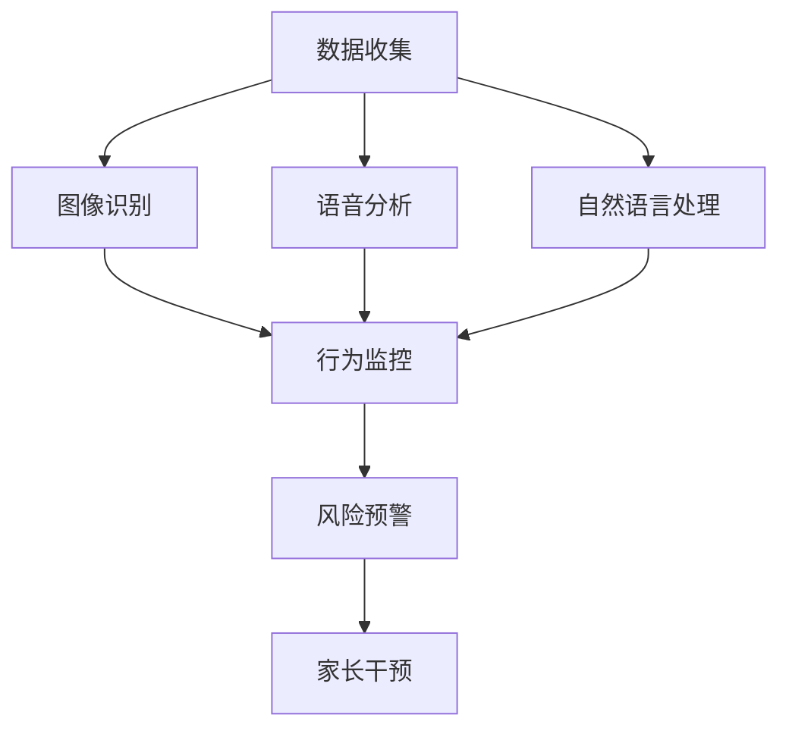

                 

# AI 基础设施的儿童保护：智能化儿童安全监护系统

> 关键词：
- AI
- 儿童安全
- 基础设施
- 安全监护系统
- 机器学习
- 图像识别
- 语音分析

## 1. 背景介绍

### 1.1 问题由来

随着互联网的普及和智能设备的广泛使用，越来越多的儿童暴露在虚拟世界的风险中。网络欺凌、网络成瘾、隐私泄露等事件频发，对儿童身心健康构成严重威胁。据统计，全球范围内每年有超过10万名儿童因为网络问题而遭受严重伤害。面对这一严峻形势，亟需一种有效且高效的技术手段来保护儿童的网络安全。

### 1.2 问题核心关键点

智能儿童安全监护系统旨在通过AI技术，对儿童的网络行为进行实时监控和分析，及时发现和干预潜在风险，保障儿童的网络安全。系统集成了图像识别、语音分析、自然语言处理等多种AI技术，实现对儿童上网行为的全面监控和预警。

本文将详细介绍智能化儿童安全监护系统的核心概念、算法原理、具体实现及应用案例，并展望其未来发展趋势和面临的挑战。

## 2. 核心概念与联系

### 2.1 核心概念概述

为更好地理解智能化儿童安全监护系统的构建，我们首先介绍几个关键概念：

- AI基础设施：指支持AI应用的底层硬件和软件设施，包括数据中心、云计算平台、AI算法库等。
- 图像识别：指利用深度学习算法对图像数据进行特征提取和分类识别。
- 语音分析：指利用语音识别和自然语言处理技术，对语音数据进行分析理解。
- 自然语言处理：指对人类语言进行计算分析，包括文本分类、情感分析、对话生成等任务。

这些技术相互协同，构成了智能化儿童安全监护系统的核心能力。通过智能分析，系统可以及时发现和干预儿童的网络风险，为其提供安全的上网环境。

### 2.2 核心概念原理和架构的 Mermaid 流程图



该图展示了智能化儿童安全监护系统的整体架构和关键流程。数据收集模块从各个设备和平台获取儿童的上网行为数据，包括图片、视频、语音和文本信息。这些数据通过图像识别、语音分析和自然语言处理模块进行处理，生成行为监控结果。系统根据监控结果，自动预警潜在风险，并通知家长进行干预。

## 3. 核心算法原理 & 具体操作步骤

### 3.1 算法原理概述

智能化儿童安全监护系统通过以下几个核心算法进行行为监控和风险预警：

- 图像识别算法：对儿童的上网行为图像数据进行特征提取和分类，识别出不适当的网络内容。
- 语音分析算法：通过语音识别和自然语言处理技术，分析儿童在网络中的对话内容，识别出潜在风险和问题。
- 自然语言处理算法：对儿童的网络聊天记录进行分析，提取情感倾向和语言风格特征，判断其情绪状态和心理健康状况。

系统将这些算法的结果综合分析，生成风险预警报告，供家长及时干预。

### 3.2 算法步骤详解

#### 3.2.1 图像识别算法步骤

1. **数据预处理**：收集儿童的网络行为图片数据，进行灰度化、归一化、裁剪等预处理。
2. **特征提取**：使用卷积神经网络(CNN)或ResNet等深度学习算法，提取图片中的特征向量。
3. **分类识别**：通过Softmax分类器，将特征向量映射为不同的网络内容类别，如色情、暴力、赌博等。
4. **风险预警**：根据分类结果，生成风险预警报告，并通知家长。

#### 3.2.2 语音分析算法步骤

1. **音频采集**：使用麦克风等设备采集儿童的语音数据。
2. **语音识别**：使用ASR(自动语音识别)技术将语音转换为文本。
3. **情感分析**：利用情感分析算法，识别语音中的情感倾向，如愤怒、焦虑、悲伤等。
4. **行为判断**：根据情感分析结果，判断儿童的上网行为是否存在风险。

#### 3.2.3 自然语言处理算法步骤

1. **文本采集**：收集儿童的网络聊天记录和留言等文本数据。
2. **文本预处理**：进行分词、去停用词、词干提取等文本预处理。
3. **情感分析**：使用LSTM或BERT等模型，进行文本的情感分类。
4. **行为分析**：通过情感分析结果，判断儿童的心理健康状况和行为模式。

### 3.3 算法优缺点

#### 3.3.1 图像识别算法优缺点

**优点**：
- 高精度：通过深度学习算法，可以对复杂的网络内容进行准确识别。
- 实时性：图像识别算法速度快，可以实时处理儿童的网络行为数据。

**缺点**：
- 数据依赖：需要大量的网络内容数据进行训练，获取高质量数据成本较高。
- 泛化能力有限：对不同风格的图像识别能力有限，可能存在误判。

#### 3.3.2 语音分析算法优缺点

**优点**：
- 自然语言理解：能够识别和理解儿童的语音对话内容，捕捉情感信息。
- 实时监控：语音分析算法对实时语音数据处理能力强，能够及时发现风险。

**缺点**：
- 环境噪音：环境噪音和口音等因素可能影响语音识别的准确性。
- 隐私问题：语音数据的采集和使用可能涉及隐私问题。

#### 3.3.3 自然语言处理算法优缺点

**优点**：
- 语义理解：能够深入理解儿童的对话内容和情感倾向。
- 多语种支持：可以处理多种语言的文本数据，拓展了系统的应用范围。

**缺点**：
- 数据量要求高：需要大量标注数据进行训练，获取高质量数据成本高。
- 处理复杂：对复杂的语言结构和情感分析较难，可能存在误判。

### 3.4 算法应用领域

智能化儿童安全监护系统已经在多个领域得到应用：

- 学校：通过安装在教室、宿舍的摄像头，实时监控学生的上网行为，预防校园欺凌和网络成瘾。
- 家庭：在家长模式下，监控儿童的上网行为，预防网络风险和不良信息。
- 医院：对儿童的心理健康进行监测，及时发现心理问题并提供帮助。

## 4. 数学模型和公式 & 详细讲解 & 举例说明

### 4.1 数学模型构建

假设系统收集到儿童上网行为图片数据 $D=\{(x_i,y_i)\}_{i=1}^N$，其中 $x_i$ 为图片数据，$y_i$ 为网络内容类别标签。

定义图像识别模型 $M_{\theta}$，其中 $\theta$ 为模型参数，包括卷积核、全连接层等。系统通过最小化交叉熵损失函数进行训练：

$$
\mathcal{L}(\theta) = -\frac{1}{N}\sum_{i=1}^N \log P(y_i|x_i)
$$

其中 $P(y_i|x_i)$ 为模型对图片 $x_i$ 属于类别 $y_i$ 的概率预测。

### 4.2 公式推导过程

以图像识别算法为例，使用softmax分类器进行特征向量的分类。设输入图片为 $x_i$，特征向量为 $h_i$，模型输出为 $s_i$，则分类概率 $P(y_i|x_i)$ 为：

$$
P(y_i|x_i) = \frac{\exp(s_i[y_i])}{\sum_j \exp(s_j[y_j])}
$$

其中 $s_i[y_i]$ 为模型对类别 $y_i$ 的预测得分。通过交叉熵损失函数：

$$
\mathcal{L}(\theta) = -\frac{1}{N}\sum_{i=1}^N y_i \log P(y_i|x_i)
$$

最小化该损失函数，即可训练出图像识别模型。

### 4.3 案例分析与讲解

以监控暴力内容的图像识别算法为例，假设系统在训练集上收集到1000张图片数据，其中500张为暴力内容，500张为正常内容。使用ResNet网络进行训练，损失函数设置为交叉熵损失。训练过程中，通过反向传播算法更新模型参数 $\theta$，直到损失函数最小化。

## 5. 项目实践：代码实例和详细解释说明

### 5.1 开发环境搭建

在进行系统开发前，需要搭建好开发环境。具体步骤如下：

1. **安装Python**：安装最新版本的Python，推荐使用Anaconda或Miniconda环境管理工具。
2. **安装深度学习框架**：安装TensorFlow或PyTorch等深度学习框架，通过pip或conda命令即可。
3. **安装图像处理库**：安装OpenCV、Pillow等图像处理库，用于数据预处理和特征提取。
4. **安装自然语言处理库**：安装NLTK、spaCy等自然语言处理库，用于文本分析和情感分类。
5. **安装语音处理库**：安装Librosa、pyAudioAnalysis等语音处理库，用于语音识别和情感分析。

### 5.2 源代码详细实现

下面给出一个基于TensorFlow的图像识别算法实现示例，演示如何构建和训练模型：

```python
import tensorflow as tf
from tensorflow.keras.layers import Conv2D, MaxPooling2D, Flatten, Dense, Dropout
from tensorflow.keras.models import Sequential

# 构建卷积神经网络模型
model = Sequential()
model.add(Conv2D(32, (3, 3), activation='relu', input_shape=(64, 64, 3)))
model.add(MaxPooling2D(pool_size=(2, 2)))
model.add(Conv2D(64, (3, 3), activation='relu'))
model.add(MaxPooling2D(pool_size=(2, 2)))
model.add(Flatten())
model.add(Dense(128, activation='relu'))
model.add(Dropout(0.5))
model.add(Dense(10, activation='softmax'))

# 编译模型
model.compile(optimizer='adam', loss='categorical_crossentropy', metrics=['accuracy'])

# 加载训练数据
train_data = tf.keras.preprocessing.image_dataset_from_directory(
    'train',
    image_size=(64, 64),
    batch_size=32,
    label_mode='categorical')

# 训练模型
model.fit(train_data, epochs=10, validation_data=val_data)
```

### 5.3 代码解读与分析

**代码解释**：
- **模型构建**：使用Sequential模型构建卷积神经网络，包括卷积层、池化层、全连接层等。
- **数据加载**：使用tf.keras.preprocessing.image_dataset_from_directory方法，从目录中加载图片数据，并进行标准化处理。
- **模型训练**：使用fit方法对模型进行训练，设置epochs和validation_data参数，用于监控训练过程中的损失和准确率。

**关键点分析**：
- **模型结构**：使用卷积层和全连接层，对图片数据进行特征提取和分类。
- **数据预处理**：使用ImageDataGenerator进行数据增强，增加模型鲁棒性。
- **损失函数**：使用交叉熵损失函数，最小化预测值和真实值之间的差异。
- **优化器**：使用Adam优化器，提高训练速度和收敛速度。

### 5.4 运行结果展示

训练完成后，使用test_data对模型进行测试，得到模型在测试集上的准确率和损失值。例如：

```python
test_loss, test_acc = model.evaluate(test_data)
print('Test accuracy:', test_acc)
```

## 6. 实际应用场景

### 6.1 学校应用场景

在学校环境中，智能化儿童安全监护系统可以安装在教室和宿舍中，实时监控学生的上网行为。系统根据监控结果，自动预警暴力、色情等内容，及时通知教师和家长，预防校园欺凌和网络成瘾。同时，系统可以记录学生的网络使用情况，帮助教师进行行为分析和管理。

### 6.2 家庭应用场景

在家庭模式下，家长可以开启系统对儿童的网络行为进行监控。系统自动检测潜在风险内容，并生成预警报告，及时通知家长进行干预。家长可以随时查看儿童的网络使用情况，了解儿童的上网习惯和心理健康状况。

### 6.3 医院应用场景

在医院环境中，智能化儿童安全监护系统可以用于心理健康监测。系统对儿童的网络聊天记录进行分析，识别出焦虑、抑郁等负面情绪，及时通知医生进行干预。医院还可以通过系统收集儿童的网络行为数据，用于心理学研究和临床治疗。

## 7. 工具和资源推荐

### 7.1 学习资源推荐

- 《深度学习基础》课程：由知名大学开设的深度学习入门课程，涵盖深度学习的基本概念和算法实现。
- 《TensorFlow实战》书籍：介绍TensorFlow的实际应用，包括图像识别、自然语言处理等任务。
- 《Python自然语言处理》书籍：详细讲解自然语言处理的常用技术和算法，适合初学者和进阶者。
- 《语音识别与处理》课程：介绍语音识别的基本原理和实现方法，适合对语音分析感兴趣的学习者。

### 7.2 开发工具推荐

- TensorFlow：功能强大的深度学习框架，适合构建图像识别、自然语言处理等模型。
- PyTorch：灵活高效的深度学习框架，支持动态图计算，适合快速迭代实验。
- NLTK和spaCy：常用自然语言处理库，提供丰富的文本分析功能。
- librosa和pyAudioAnalysis：常用语音处理库，提供语音识别和情感分析功能。

### 7.3 相关论文推荐

- "ImageNet Classification with Deep Convolutional Neural Networks"：介绍使用卷积神经网络进行图像分类的基本方法。
- "Attention is All You Need"：提出Transformer模型，应用于图像和自然语言处理任务。
- "Speech and Language Processing with Deep Recurrent Neural Networks"：介绍使用LSTM模型进行语音识别的基本方法。
- "Sentiment Analysis with Recurrent Neural Networks"：介绍使用RNN模型进行情感分析的基本方法。

## 8. 总结：未来发展趋势与挑战

### 8.1 研究成果总结

智能化儿童安全监护系统通过AI技术，对儿童上网行为进行实时监控和分析，及时预警潜在风险，保障儿童的网络安全。系统集成了图像识别、语音分析和自然语言处理等多种AI技术，实现了对儿童上网行为的全面监控和预警。

### 8.2 未来发展趋势

未来，智能化儿童安全监护系统将呈现以下几个发展趋势：

1. **多模态融合**：结合图像、语音、文本等多模态数据，提升系统的综合分析能力，提供更全面的风险预警。
2. **实时预警**：通过边缘计算技术，实现实时数据处理和预警，提高系统的响应速度和安全性。
3. **个性化推荐**：根据儿童的网络行为数据，推荐适合的学习资源和活动，促进儿童的健康成长。
4. **隐私保护**：引入隐私保护技术，如数据匿名化、差分隐私等，确保儿童的隐私安全。

### 8.3 面临的挑战

尽管智能化儿童安全监护系统在儿童网络安全保护中取得了显著效果，但仍面临以下挑战：

1. **数据获取难度**：高质量、多样化的数据是系统训练的基础，但获取这些数据需要大量的资源和时间。
2. **模型复杂度**：大模型需要较高的计算资源和存储空间，部署和维护成本较高。
3. **隐私保护**：儿童的网络行为数据涉及隐私问题，系统需要保证数据的安全和匿名化处理。
4. **伦理和法律问题**：系统如何合理使用儿童数据，并符合相关法律法规，需要进一步规范。

### 8.4 研究展望

未来的研究应在以下几个方面进行探索：

1. **模型压缩和优化**：优化模型结构和参数，提高系统性能和效率。
2. **隐私保护技术**：引入差分隐私等技术，保护儿童的隐私数据。
3. **伦理和法律研究**：研究如何合理使用儿童数据，并符合法律法规要求。
4. **跨模态融合技术**：研究多模态数据的深度融合方法，提升系统综合分析能力。

## 9. 附录：常见问题与解答

### 9.1 常见问题

**Q1：为什么需要多模态融合？**

A: 多模态融合可以结合图像、语音、文本等多种数据，提升系统的综合分析能力，提供更全面的风险预警。

**Q2：如何保护儿童的隐私？**

A: 可以采用数据匿名化、差分隐私等技术，确保儿童的隐私数据不被泄露。

**Q3：多模态融合的难点是什么？**

A: 多模态融合的难点在于如何高效地将不同类型的数据进行整合和分析，需要引入深度学习等先进技术。

**Q4：系统如何避免误判？**

A: 可以通过引入人工审核机制，结合多种检测方法，减少误判的可能性。

**Q5：系统的响应时间如何保证？**

A: 可以通过边缘计算技术，将数据处理任务下放到离儿童较近的设备上进行，减少延迟。

### 9.2 解答

本文全面系统地介绍了智能化儿童安全监护系统的核心概念、算法原理、具体实现及应用案例，并展望了其未来发展趋势和面临的挑战。通过AI技术的应用，系统能够及时预警儿童上网风险，保障其网络安全，具有良好的应用前景。

