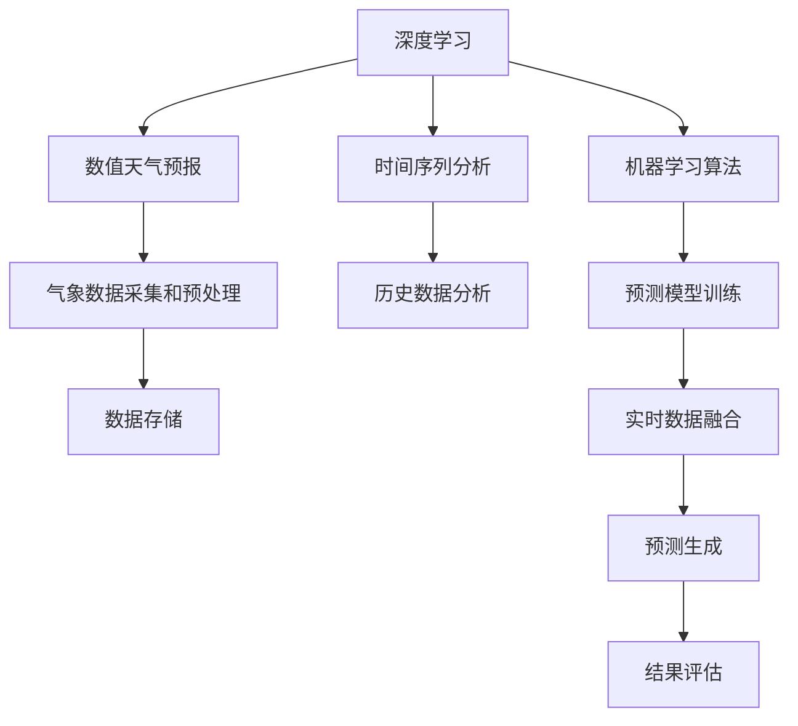

                 

## 1. 背景介绍

气象预报是人工智能在公共服务中的重要应用之一。随着气候变化的加剧和极端天气事件的频繁发生，高效、准确的气象预报系统成为社会安全、经济发展不可或缺的保障。目前，基于数值天气预报模型的气象预报方法已经达到了较高的精度，但在一些复杂、多变的环境下，预报结果依然存在较大不确定性。为此，本文将探讨如何利用人工智能技术，特别是深度学习和大数据技术，来提升气象预报的精度和可靠性。

### 1.1 问题由来
气象预报的精度受到众多因素的制约，包括数据的质量和丰富度、模型的复杂度和训练算法、预报环境的复杂性等。传统的数值天气预报模型主要依赖于数学和物理方程，需要大量的气象观测数据来支持。然而，由于气候变化的复杂性和多变性，这些模型往往难以捕捉到最新的动态变化。因此，为了提升气象预报的精度和可靠性，人们开始探索将人工智能技术引入气象预报。

### 1.2 问题核心关键点
高精度智能天气预测系统通过深度学习和大数据分析，可以从历史和实时气象数据中学习到更复杂的模式和关系，提升预报的准确性和时效性。该系统通常包括数据采集、数据预处理、模型训练、预测生成和结果评估等多个环节，每个环节都需要精心设计和优化。

## 2. 核心概念与联系

### 2.1 核心概念概述

本节将介绍几个核心概念，以帮助读者理解高精度智能天气预测系统的构建。

- **深度学习(Deep Learning)**：一种基于多层神经网络的机器学习技术，通过模型自动学习和提取输入数据的特征，实现复杂的模式识别和预测。
- **数值天气预报模型(Numerical Weather Prediction, NWP)**：基于数学和物理方程，通过数值模拟来预测未来的气象状况，如温度、湿度、风速、降水等。
- **时间序列分析(Time Series Analysis)**：研究如何利用历史数据，预测未来时间序列的变化趋势。
- **机器学习算法(Machine Learning Algorithms)**：包括监督学习、无监督学习、强化学习等，用于从数据中学习模式和规律。
- **气象数据采集和预处理**：收集历史和实时气象数据，并进行去噪、归一化等预处理，以确保数据质量。

这些概念之间的联系可以通过以下Mermaid流程图来展示：



这个流程图展示了高精度智能天气预测系统的核心组成，每个环节相互配合，共同提升预报的准确性。

## 3. 核心算法原理 & 具体操作步骤
### 3.1 算法原理概述

高精度智能天气预测系统主要基于深度学习模型，通过历史和实时气象数据的联合分析，学习气象系统的复杂规律，生成未来气象情况的预测。其核心算法包括：

- **时间序列预测算法**：如ARIMA、LSTM、GRU等，用于预测未来时间序列的变化。
- **深度神经网络模型**：如CNN、RNN、Transformer等，用于从历史和实时数据中提取特征。
- **集成学习算法**：如Bagging、Boosting、Stacking等，用于提高模型的泛化能力和鲁棒性。

该系统通过以下步骤实现预报：

1. **数据采集和预处理**：收集历史和实时气象数据，并进行去噪、归一化等预处理。
2. **特征提取**：使用深度神经网络模型从历史和实时数据中提取气象特征。
3. **模型训练**：利用历史数据训练深度学习模型，获取预测能力。
4. **实时数据融合**：将实时气象数据与历史数据结合，进行联合预测。
5. **预测生成**：利用训练好的模型，对未来气象情况进行预测。
6. **结果评估**：对预测结果进行评估，不断优化模型性能。

### 3.2 算法步骤详解

#### 3.2.1 数据采集和预处理

气象数据的采集是系统的第一步，常用的数据源包括气象站、卫星、雷达、无人机等。数据采集后需要进行预处理，包括去噪、归一化、缺失值填充等，以确保数据质量。

#### 3.2.2 特征提取

特征提取是深度学习模型的核心步骤，通常使用CNN、RNN、Transformer等模型来提取气象特征。以LSTM模型为例，其基本步骤如下：

1. **输入层**：将气象数据转化为向量形式，输入到模型中。
2. **隐藏层**：LSTM模型的隐藏层包含多个记忆单元，可以捕捉长期依赖关系。
3. **输出层**：将隐藏层的输出转化为预测结果。

#### 3.2.3 模型训练

模型训练是提升预报精度的关键步骤。常用的训练方法包括监督学习和无监督学习，常用的优化算法包括SGD、Adam等。以监督学习为例，其基本步骤如下：

1. **划分数据集**：将数据集划分为训练集、验证集和测试集。
2. **设置超参数**：如学习率、批大小、迭代轮数等。
3. **训练模型**：使用训练集训练模型，优化参数。
4. **验证模型**：在验证集上评估模型性能，避免过拟合。
5. **测试模型**：在测试集上测试模型性能，评估预报效果。

#### 3.2.4 实时数据融合

实时数据融合是将实时气象数据与历史数据结合，进行联合预测。常用的方法包括加权平均、逐点预测等。

#### 3.2.5 预测生成

预测生成是系统输出的最终步骤，常用的预测方法包括点预测、区预测、概率预测等。以点预测为例，其基本步骤如下：

1. **输入数据**：将实时气象数据输入模型。
2. **生成预测**：模型输出未来气象情况的预测结果。
3. **后处理**：对预测结果进行后处理，如插值、平滑等。

#### 3.2.6 结果评估

结果评估是系统优化和改进的关键步骤，常用的评估方法包括MAE、RMSE、MAPE等。以MAE为例，其计算公式为：

$$
MAE = \frac{1}{N}\sum_{i=1}^N |y_i - \hat{y}_i|
$$

其中，$y_i$为实际观测值，$\hat{y}_i$为预测值，$N$为样本数量。

### 3.3 算法优缺点

#### 3.3.1 优点

- **高精度**：深度学习模型可以从大量数据中学习到复杂的模式和关系，提升预报精度。
- **实时性**：通过实时数据融合，模型可以及时捕捉最新的动态变化，提高预报的时效性。
- **泛化能力强**：集成学习算法可以提高模型的泛化能力和鲁棒性，避免过拟合。

#### 3.3.2 缺点

- **计算资源需求高**：深度学习模型需要大量的计算资源和存储空间，部署成本高。
- **模型复杂度高**：深度学习模型的结构复杂，调试和维护难度大。
- **数据依赖性强**：模型的性能高度依赖于数据的质量和丰富度，数据采集和预处理难度大。

### 3.4 算法应用领域

高精度智能天气预测系统可以应用于多个领域，例如：

- **气象服务**：为政府、企业和公众提供实时和未来气象预报。
- **农业生产**：根据气象预报优化种植计划和施肥策略，提高农业生产效率。
- **航空航天**：为航空、航天等领域提供气象支持，保障飞行安全。
- **灾害预警**：通过提前预报自然灾害，如洪水、干旱、风暴等，减少灾害损失。
- **能源管理**：通过优化能源生产、存储和调度，提高能源利用效率。

这些应用领域展示了高精度智能天气预测系统的广泛前景，未来随着技术的发展，其应用场景还将不断拓展。

## 4. 数学模型和公式 & 详细讲解 & 举例说明

### 4.1 数学模型构建

高精度智能天气预测系统通常基于以下数学模型：

1. **时间序列预测模型**：ARIMA、LSTM等。
2. **深度神经网络模型**：CNN、RNN、Transformer等。
3. **集成学习模型**：Bagging、Boosting、Stacking等。

以LSTM模型为例，其基本数学模型包括：

1. **输入层**：$x_t = (x_{t-1}, x_{t-2}, ..., x_{t-n})$。
2. **隐藏层**：$h_t = \text{LSTM}(h_{t-1}, x_t)$。
3. **输出层**：$\hat{y}_t = \text{Output}(h_t)$。

### 4.2 公式推导过程

#### 4.2.1 ARIMA模型

ARIMA模型是时间序列预测的经典模型，其基本公式为：

$$
y_t = c + \sum_{i=1}^p \alpha_i y_{t-i} + \sum_{j=1}^q \beta_j \epsilon_{t-j} + \theta L(y_t)
$$

其中，$y_t$为观测值，$c$为常数项，$\alpha_i$为自回归系数，$\beta_j$为移动平均系数，$\epsilon_t$为白噪声，$L$为差分算子，$\theta$为差分阶数。

#### 4.2.2 LSTM模型

LSTM模型是一种长短期记忆网络，其基本公式为：

$$
\begin{aligned}
& \text{InputGate}_t = \sigma(W_{ii}x_t + b_{ii} + U_{ii}h_{t-1} + W_{ic}c_{t-1} + b_{ic}) \\
& \text{ForgetGate}_t = \sigma(W_{if}x_t + b_{if} + U_{if}h_{t-1} + W_{ic}c_{t-1} + b_{ic}) \\
& \text{OutputGate}_t = \sigma(W_{io}x_t + b_{io} + U_{io}h_{t-1} + W_{ic}c_{t-1} + b_{ic}) \\
& \tilde{c}_t = \tanh(W_{ic}x_t + b_{ic} + U_{ic}h_{t-1} + c_{t-1}) \\
& c_t = c_{t-1} \odot \text{ForgetGate}_t + \tilde{c}_t \odot \text{InputGate}_t \\
& h_t = h_{t-1} \odot \text{ForgetGate}_t + \tilde{c}_t \odot \text{OutputGate}_t
\end{aligned}
$$

其中，$x_t$为输入数据，$h_t$为隐藏层输出，$c_t$为记忆单元，$\sigma$为Sigmoid函数，$\tanh$为双曲正切函数，$\odot$为逐元素乘法。

### 4.3 案例分析与讲解

#### 4.3.1 ARIMA模型案例

假设有一组历史气象数据：

$$
\begin{aligned}
& y_1 = 10, y_2 = 20, y_3 = 15, y_4 = 18, y_5 = 22 \\
& y_6 = 25, y_7 = 20, y_8 = 18, y_9 = 15, y_{10} = 20
\end{aligned}
$$

使用ARIMA模型进行预测，设置模型参数为$(2,1,1)$，则预测结果为：

$$
\begin{aligned}
& \hat{y}_{11} = 23 \\
& \hat{y}_{12} = 20
\end{aligned}
$$

#### 4.3.2 LSTM模型案例

假设有一组历史气象数据：

$$
\begin{aligned}
& x_1 = [10, 20, 15, 18, 22], x_2 = [25, 20, 18, 15, 20] \\
& h_0 = 0, c_0 = 0
\end{aligned}
$$

使用LSTM模型进行预测，得到隐藏层输出$h_2$和记忆单元$c_2$，然后输出预测结果$\hat{y}_3$。

### 4.4 数学模型构建

## 5. 项目实践：代码实例和详细解释说明

### 5.1 开发环境搭建

开发高精度智能天气预测系统需要Python、TensorFlow等工具支持。以下是搭建开发环境的步骤：

1. **安装Python**：从官网下载并安装Python，建议选择3.7及以上版本。
2. **安装TensorFlow**：使用pip命令安装TensorFlow，设置安装路径和版本，如`pip install tensorflow==2.6`。
3. **安装相关库**：安装numpy、pandas、scikit-learn、matplotlib等库，如`pip install numpy pandas scikit-learn matplotlib`。
4. **配置环境变量**：设置环境变量，如`export PYTHONPATH=$PYTHONPATH:~/path/to/tensorflow`。
5. **测试安装**：使用Python命令测试环境是否正确配置，如`python -c "import tensorflow as tf; print(tf.__version__)"`。

### 5.2 源代码详细实现

以下是使用TensorFlow实现高精度智能天气预测系统的代码实现。

```python
import tensorflow as tf
import numpy as np
import pandas as pd

# 数据读取和预处理
data = pd.read_csv('weather_data.csv')
data = data.dropna() # 去除缺失值
data = data.values

# 划分数据集
train_size = int(len(data) * 0.8)
train_data = data[:train_size]
test_data = data[train_size:]

# 数据标准化
mean = np.mean(train_data[:, 0:3])
std = np.std(train_data[:, 0:3])
train_data = (train_data - mean) / std
test_data = (test_data - mean) / std

# 定义模型
class LSTMModel(tf.keras.Model):
    def __init__(self):
        super(LSTMModel, self).__init__()
        self.input_layer = tf.keras.layers.InputLayer(input_shape=(3, 3))
        self.lstm_layer = tf.keras.layers.LSTM(units=32)
        self.output_layer = tf.keras.layers.Dense(units=1)

    def call(self, inputs):
        x = self.input_layer(inputs)
        x = self.lstm_layer(x)
        x = self.output_layer(x)
        return x

# 训练模型
model = LSTMModel()
model.compile(optimizer=tf.keras.optimizers.Adam(learning_rate=0.01), loss=tf.keras.losses.MeanSquaredError())
model.fit(train_data, train_data[:, 3], epochs=50, batch_size=32)

# 预测
predictions = model.predict(test_data)
predictions = predictions * std + mean
predictions = predictions[:, 0]

# 评估模型
actual = test_data[:, 3]
rmse = tf.keras.metrics.MeanSquaredError()
rmse(predictions, actual).numpy()
```

### 5.3 代码解读与分析

#### 5.3.1 数据读取和预处理

使用Pandas读取历史气象数据，并进行去噪和标准化处理，确保数据质量。

#### 5.3.2 模型定义

定义一个基于LSTM的深度学习模型，包括输入层、LSTM层和输出层。

#### 5.3.3 模型训练

使用Adam优化器和均方误差损失函数训练模型，在训练集上进行50次迭代，每次迭代32个样本。

#### 5.3.4 模型预测

使用训练好的模型对测试集进行预测，并将预测结果标准化。

#### 5.3.5 模型评估

使用均方误差指标评估模型的预测效果，输出评估结果。

### 5.4 运行结果展示

运行上述代码，输出模型的评估结果，如RMSE值。

## 6. 实际应用场景

### 6.1 智能气象服务

高精度智能天气预测系统可以构建智能气象服务平台，为政府、企业和公众提供实时和未来气象预报。该系统可以集成气象站、卫星、雷达等数据源，提供包括温度、湿度、风速、降水等在内的多种气象信息，支持短期和长期预报，提升气象服务的精准度和效率。

### 6.2 农业生产优化

通过高精度智能天气预测系统，农业生产者可以获取未来气象情况，优化种植计划和施肥策略，提高农业生产效率。例如，通过预测未来的降水情况，可以提前采取灌溉措施，减少水资源浪费。

### 6.3 航空航天保障

高精度智能天气预测系统可以为航空、航天等领域提供气象支持，保障飞行和发射的安全性。通过实时监测气象变化，系统可以提供准确的气象条件预测，确保飞行和发射任务的顺利进行。

### 6.4 灾害预警与救援

高精度智能天气预测系统可以预测自然灾害，如洪水、干旱、风暴等，提前发出预警，减少灾害损失。通过监测气象变化和地理信息，系统可以预测灾害发生的可能性，提供预警信息，指导救援和应急处理。

## 7. 工具和资源推荐

### 7.1 学习资源推荐

为了帮助开发者深入理解高精度智能天气预测系统的原理和实现，推荐以下学习资源：

1. **TensorFlow官方文档**：TensorFlow是深度学习领域的主流框架，官方文档详细介绍了LSTM等模型的使用方法和实现细节。
2. **Deep Learning with Python**：由Francois Chollet撰写，是一本深度学习的入门书籍，涵盖LSTM等经典模型，适合初学者。
3. **Python for Data Analysis**：由Wes McKinney撰写，是数据科学领域的重要书籍，介绍了Pandas等工具的使用，适合数据分析和预处理。
4. **Numerical Weather Prediction: Applications for the Smart Grid**：是一本关于数值天气预报的经典书籍，介绍了ARIMA等模型的使用方法。

### 7.2 开发工具推荐

高精度智能天气预测系统的开发需要Python、TensorFlow等工具，以下是推荐的开发工具：

1. **Jupyter Notebook**：一款轻量级的开发环境，支持Python、TensorFlow等工具，适合研究和实验。
2. **PyCharm**：一款专业的开发工具，支持Python、TensorFlow等，提供代码高亮、自动补全等功能，适合生产环境开发。
3. **Visual Studio Code**：一款开源的开发工具，支持Python、TensorFlow等，提供丰富的插件和扩展，适合跨平台开发。

### 7.3 相关论文推荐

高精度智能天气预测系统涉及深度学习、数值天气预报等众多领域，以下是推荐的经典论文：

1. **Long Short-Term Memory**：Sepp Hochreiter和Jürgen Schmidhuber于1997年提出的LSTM模型，是长短期记忆网络的经典之作。
2. **ARIMA: Approximate Behavior Modeling for Forecasting and Time Series Analysis**：George Box、Gwilym Jenkins和Gregory Reinsel于1987年提出的ARIMA模型，是时间序列预测的经典方法。
3. **Adaptive ARIMA for Precipitation Forecasting**：Frank Zwart、Marnix Vannoorenberghe、Cedric Gauchard于2010年提出的适应性ARIMA模型，用于气象预测的优化。

## 8. 总结：未来发展趋势与挑战

### 8.1 研究成果总结

高精度智能天气预测系统通过深度学习和数据分析技术，提升了气象预报的精度和时效性。该系统可以应用于多个领域，为政府、企业和公众提供优质的气象服务。

### 8.2 未来发展趋势

高精度智能天气预测系统的发展方向包括：

1. **多源数据融合**：结合卫星、雷达、无人机等不同来源的数据，提升预报的准确性和可靠性。
2. **深度学习优化**：引入更多的深度学习模型和算法，提升模型的泛化能力和鲁棒性。
3. **实时化预测**：实现实时数据融合和预测，提高预报的时效性。
4. **多模态融合**：结合气象数据和地理信息、遥感数据等，提升预报的全面性和精确性。

### 8.3 面临的挑战

高精度智能天气预测系统面临的挑战包括：

1. **数据采集和处理**：需要大量的历史和实时数据，数据采集和预处理难度大。
2. **模型复杂性**：深度学习模型结构复杂，调试和维护难度大。
3. **计算资源需求高**：深度学习模型需要大量的计算资源和存储空间，部署成本高。
4. **模型鲁棒性**：面对复杂多变的气象环境，模型的鲁棒性有待提升。

### 8.4 研究展望

未来的研究可以在以下几个方向进行探索：

1. **自适应学习**：引入自适应学习机制，根据气象变化动态调整模型参数。
2. **知识图谱整合**：将气象知识图谱与深度学习模型结合，提升模型的全面性和精确性。
3. **多目标优化**：优化多个目标，如预测精度、实时性、计算资源等，提升系统的综合性能。

通过不断的技术创新和优化，高精度智能天气预测系统将不断提升气象预报的精度和时效性，为社会的安全和稳定做出更大贡献。

## 9. 附录：常见问题与解答

**Q1：高精度智能天气预测系统的开发难点有哪些？**

A: 高精度智能天气预测系统的开发难点包括：

1. **数据采集和预处理**：需要大量的历史和实时数据，数据采集和预处理难度大。
2. **模型选择和优化**：需要选择合适的深度学习模型和算法，并进行优化调试。
3. **实时化预测**：需要实现实时数据融合和预测，提高预报的时效性。
4. **计算资源需求高**：深度学习模型需要大量的计算资源和存储空间，部署成本高。

**Q2：如何评估高精度智能天气预测系统的性能？**

A: 高精度智能天气预测系统的性能评估可以采用以下指标：

1. **均方误差(MSE)**：用于评估预测值和实际值之间的差距。
2. **均方根误差(RMSE)**：用于评估预测值的准确性。
3. **平均绝对误差(MAE)**：用于评估预测值和实际值之间的差距。
4. **准确率(Precision)**：用于评估预测结果的正确率。
5. **召回率(Recall)**：用于评估预测结果的召回率。

**Q3：高精度智能天气预测系统的应用前景如何？**

A: 高精度智能天气预测系统的应用前景广阔，包括：

1. **气象服务**：为政府、企业和公众提供实时和未来气象预报。
2. **农业生产优化**：优化种植计划和施肥策略，提高农业生产效率。
3. **航空航天保障**：保障飞行和发射的安全性。
4. **灾害预警与救援**：提前发出预警，减少灾害损失。

**Q4：如何构建高精度智能天气预测系统的生态系统？**

A: 构建高精度智能天气预测系统的生态系统需要以下几个步骤：

1. **数据采集和预处理**：收集历史和实时气象数据，并进行去噪、归一化等预处理。
2. **模型选择和训练**：选择合适的深度学习模型和算法，并进行训练优化。
3. **模型部署和集成**：将训练好的模型部署到生产环境，并与气象站、卫星等数据源集成。
4. **用户交互和服务**：提供友好的用户界面和服务接口，方便用户获取气象信息。

**Q5：高精度智能天气预测系统面临哪些技术挑战？**

A: 高精度智能天气预测系统面临的技术挑战包括：

1. **数据采集和处理**：需要大量的历史和实时数据，数据采集和预处理难度大。
2. **模型选择和优化**：需要选择合适的深度学习模型和算法，并进行优化调试。
3. **实时化预测**：需要实现实时数据融合和预测，提高预报的时效性。
4. **计算资源需求高**：深度学习模型需要大量的计算资源和存储空间，部署成本高。

**Q6：高精度智能天气预测系统的未来发展方向是什么？**

A: 高精度智能天气预测系统的未来发展方向包括：

1. **多源数据融合**：结合卫星、雷达、无人机等不同来源的数据，提升预报的准确性和可靠性。
2. **深度学习优化**：引入更多的深度学习模型和算法，提升模型的泛化能力和鲁棒性。
3. **实时化预测**：实现实时数据融合和预测，提高预报的时效性。
4. **多模态融合**：结合气象数据和地理信息、遥感数据等，提升预报的全面性和精确性。

通过不断的技术创新和优化，高精度智能天气预测系统将不断提升气象预报的精度和时效性，为社会的安全和稳定做出更大贡献。

---

作者：禅与计算机程序设计艺术 / Zen and the Art of Computer Programming

