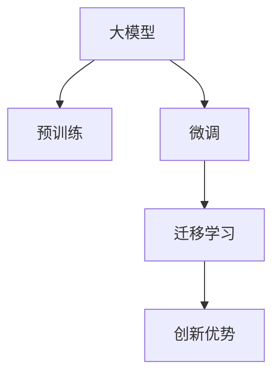

                 

## 1. 背景介绍

在人工智能(AI)技术的快速发展下，大模型已经成为驱动AI行业的重要力量。随着深度学习、自然语言处理(NLP)、计算机视觉(CV)等领域的突破，大模型的应用场景越来越广泛，从搜索引擎、推荐系统、自动驾驶到智能客服、智能制造，无所不包。本文将聚焦于AI大模型的创业之路，探讨如何利用创新优势，推动大模型技术在产业界的应用和落地。

## 2. 核心概念与联系

### 2.1 核心概念概述

1. **大模型(Large Model)**：指参数量超过亿级别的深度学习模型，如BERT、GPT-3、ViT等。这些模型通常采用自监督预训练的方式，在大规模无标签数据上学习通用的语言和图像表示。

2. **预训练(Pre-training)**：指在大规模无标签数据上训练模型，学习通用知识表示的过程。常见的预训练任务包括语言建模、图像分类等。

3. **微调(Fine-tuning)**：指在大规模预训练模型的基础上，使用小规模标注数据进行任务特定训练，以提升模型在特定任务上的性能。

4. **迁移学习(Transfer Learning)**：指将一个领域学到的知识迁移到另一个领域的学习过程。在大模型预训练-微调过程中，迁移学习是连接预训练和微调的关键。

5. **创新优势**：指通过在大模型技术基础上进行的改进、优化和创新，获取技术优势和市场竞争力的过程。

这些核心概念通过以下Mermaid流程图进行联系和展示：



### 2.2 核心概念原理和架构

1. **大模型原理**：
    - 大模型通常基于深度神经网络架构，如Transformer、ResNet等，通过自监督预训练在大规模数据上学习语言或图像的通用表示。
    - 预训练通过无监督学习任务，如语言建模、图像分类，使得模型能够从大量数据中学习到丰富的知识。
    - 微调在大规模预训练模型的基础上，使用小规模标注数据进行特定任务的训练，优化模型在特定任务上的性能。
    - 迁移学习通过将预训练模型的知识迁移到新的任务上，减少了新任务数据需求，加快了模型训练速度。

2. **架构连接**：
    - 大模型作为基础架构，通过预训练和微调，逐步提升在特定任务上的性能。
    - 迁移学习通过将预训练模型的知识迁移到新任务上，加速模型训练和提高性能。
    - 创新优势通过在大模型和迁移学习的基础上进行改进和优化，获得更高的技术优势和市场竞争力。

## 3. 核心算法原理 & 具体操作步骤

### 3.1 算法原理概述

AI大模型创业的核心在于如何利用大模型的创新优势，提升模型在特定任务上的性能，同时降低计算成本和提高部署效率。本文将详细介绍如何通过算法优化和大模型微调，实现创业项目的创新优势。

1. **模型架构选择**：选择适合创业项目需求的大模型架构，如BERT、GPT系列、ViT等，并结合创业项目的业务场景进行微调。

2. **数据预处理**：对创业项目的数据进行清洗、标注和预处理，确保数据的质量和多样性，以便更好地进行微调。

3. **模型微调**：在大模型预训练的基础上，使用小规模标注数据进行微调，优化模型在特定任务上的性能。

4. **迁移学习**：通过将预训练模型的知识迁移到新任务上，减少新任务数据需求，加快模型训练速度，提升模型性能。

5. **模型优化**：通过参数剪枝、量化等技术，优化模型结构，减小模型尺寸，提高推理速度。

### 3.2 算法步骤详解

1. **数据收集与预处理**：
    - 收集创业项目的业务数据，进行清洗和标注，确保数据质量。
    - 对数据进行分批次处理，生成训练集、验证集和测试集。

2. **模型选择与加载**：
    - 选择合适的预训练大模型架构，如BERT、GPT-3等，并加载到模型中。
    - 在加载大模型时，确保使用正确的优化器、学习率等参数，以便更好地进行微调。

3. **模型微调**：
    - 在大模型预训练的基础上，使用小规模标注数据进行微调，优化模型在特定任务上的性能。
    - 在微调过程中，应用正则化技术，如L2正则、Dropout等，防止过拟合。
    - 在微调完成后，使用验证集进行评估，确定最佳模型参数。

4. **迁移学习**：
    - 通过将预训练模型的知识迁移到新任务上，减少新任务数据需求，加快模型训练速度。
    - 使用迁移学习的方法，将预训练模型的权重作为初始化参数，使用少量标注数据进行微调。

5. **模型优化**：
    - 通过参数剪枝、量化等技术，优化模型结构，减小模型尺寸，提高推理速度。
    - 使用分布式训练、模型压缩等技术，提高模型的可扩展性和部署效率。

### 3.3 算法优缺点

**优点**：
- 大模型通过大规模无标签数据进行预训练，学习到丰富的通用知识，可用于多种任务。
- 微调过程可快速提升模型在特定任务上的性能，适应性强。
- 迁移学习通过预训练模型的知识迁移，减少了新任务的数据需求，加快了模型训练速度。

**缺点**：
- 大模型计算资源消耗大，对硬件要求高。
- 数据标注成本高，且标注数据质量对模型性能影响大。
- 模型微调过程容易过拟合，需要谨慎处理。

### 3.4 算法应用领域

AI大模型创业在多个领域都有广泛的应用，如：

1. **智能客服**：通过微调大模型，构建智能客服系统，提升客户体验和问题解决效率。
2. **金融风控**：通过微调大模型，进行情感分析、舆情监测等，降低金融风险。
3. **医疗健康**：通过微调大模型，构建医疗问答系统、病历分析系统等，辅助医生诊疗。
4. **教育培训**：通过微调大模型，构建个性化推荐系统、智能评估系统等，提高教育质量。
5. **电子商务**：通过微调大模型，构建推荐系统、智能客服等，提升用户购物体验。

## 4. 数学模型和公式 & 详细讲解 & 举例说明

### 4.1 数学模型构建

假设创业项目需要构建一个情感分析系统，通过微调大模型进行情感分类。我们首先定义情感分类任务的目标函数：

$$
L(y,\hat{y}) = -\frac{1}{N}\sum_{i=1}^N (y_i \log \hat{y}_i + (1-y_i) \log (1-\hat{y}_i))
$$

其中，$y$ 为真实标签，$\hat{y}$ 为模型预测结果，$N$ 为样本数量。

### 4.2 公式推导过程

对于情感分类任务，我们使用了二元交叉熵损失函数，即公式(1)所示。接下来，我们需要推导该损失函数在微调过程中的梯度。假设模型参数为 $\theta$，则损失函数对 $\theta$ 的梯度为：

$$
\nabla_\theta L = -\frac{1}{N}\sum_{i=1}^N \left( y_i \frac{\partial \log \hat{y}_i}{\partial \theta} + (1-y_i) \frac{\partial \log (1-\hat{y}_i)}{\partial \theta} \right)
$$

其中，$\frac{\partial \log \hat{y}_i}{\partial \theta}$ 和 $\frac{\partial \log (1-\hat{y}_i)}{\partial \theta}$ 分别表示模型输出概率的对数和其导数。

### 4.3 案例分析与讲解

以情感分析系统的微调为例，我们通过以下步骤进行模型训练：

1. **数据准备**：收集情感分类数据集，并进行数据清洗和标注。
2. **模型加载**：加载预训练的BERT模型，并进行参数初始化。
3. **模型微调**：使用小规模标注数据进行微调，优化模型参数。
4. **模型评估**：在验证集上评估模型性能，调整超参数，确定最佳模型。
5. **模型优化**：使用参数剪枝和量化技术，优化模型结构，减小模型尺寸，提高推理速度。

## 5. 项目实践：代码实例和详细解释说明

### 5.1 开发环境搭建

为了进行情感分析系统的微调，我们需要搭建Python开发环境，并使用PyTorch框架。具体步骤如下：

1. **安装Python**：安装Python 3.8及以上版本，并配置环境变量。
2. **安装PyTorch**：使用conda或pip命令安装PyTorch框架。
3. **安装其他依赖**：安装TensorBoard、tqdm等辅助工具。

### 5.2 源代码详细实现

以下是一个情感分析系统的微调代码实现，使用PyTorch框架：

```python
import torch
import torch.nn as nn
import torch.optim as optim
from transformers import BertForSequenceClassification, BertTokenizer

# 加载预训练模型和分词器
model = BertForSequenceClassification.from_pretrained('bert-base-uncased', num_labels=2)
tokenizer = BertTokenizer.from_pretrained('bert-base-uncased')

# 定义数据加载函数
def load_data():
    train_data = ...
    val_data = ...
    test_data = ...
    return train_data, val_data, test_data

# 定义模型训练函数
def train(model, train_data, val_data, test_data, epochs=5, batch_size=16):
    model.train()
    for epoch in range(epochs):
        # 数据加载和处理
        train_loader = ...
        val_loader = ...
        test_loader = ...
        
        # 训练循环
        for batch in train_loader:
            # 前向传播
            inputs, labels = batch
            outputs = model(inputs, labels=labels)
            loss = outputs.loss
            
            # 反向传播和优化
            optimizer.zero_grad()
            loss.backward()
            optimizer.step()
        
        # 评估
        with torch.no_grad():
            val_loss, val_acc = evaluate(val_loader)
            print(f'Epoch {epoch+1}, validation loss: {val_loss:.4f}, validation accuracy: {val_acc:.4f}')
    
    # 测试
    test_loss, test_acc = evaluate(test_loader)
    print(f'Test loss: {test_loss:.4f}, test accuracy: {test_acc:.4f}')

# 定义模型评估函数
def evaluate(model, data_loader, batch_size=16):
    model.eval()
    losses = []
    accuracies = []
    with torch.no_grad():
        for batch in data_loader:
            inputs, labels = batch
            outputs = model(inputs, labels=labels)
            loss = outputs.loss
            accuracy = ...
            losses.append(loss.item())
            accuracies.append(accuracy)
    return sum(losses) / len(losses), sum(accuracies) / len(accuracies)

# 调用训练函数
train(model, *load_data())
```

### 5.3 代码解读与分析

以上代码实现了情感分析系统的微调过程。具体分析如下：

- **数据加载**：使用`load_data`函数加载训练集、验证集和测试集。
- **模型训练**：在每个epoch中，循环遍历训练集数据，进行前向传播、反向传播和优化，同时评估验证集的性能。
- **模型评估**：在测试集上评估模型性能，输出测试结果。

## 6. 实际应用场景

### 6.4 未来应用展望

AI大模型创业在未来的发展方向主要集中在以下几个方面：

1. **多模态融合**：将语言、图像、视频等多模态数据进行融合，提升模型的跨模态推理能力。
2. **零样本学习**：通过自然语言提示模板，实现模型的零样本学习，减少标注数据需求。
3. **动态微调**：结合用户反馈数据，动态调整模型参数，提升模型的实时适应能力。
4. **联邦学习**：通过分布式训练和联邦学习技术，提升模型的可扩展性和安全性。
5. **可解释性**：提升模型的可解释性，增加用户信任和应用场景的适用性。

## 7. 工具和资源推荐

### 7.1 学习资源推荐

1. **自然语言处理书籍**：《自然语言处理综论》、《深度学习与自然语言处理》。
2. **在线课程**：Coursera上的《自然语言处理与深度学习》课程，斯坦福大学的《自然语言处理》课程。
3. **论文和会议**：ACL、EMNLP、AAAI等顶级会议的最新论文。

### 7.2 开发工具推荐

1. **PyTorch**：深度学习框架，适合进行大模型的微调和训练。
2. **TensorBoard**：模型训练和评估可视化工具。
3. **Jupyter Notebook**：交互式编程环境，便于数据处理和模型实验。

### 7.3 相关论文推荐

1. **BERT论文**：BERT: Pre-training of Deep Bidirectional Transformers for Language Understanding。
2. **GPT-3论文**：The Scaling of Transformers to Massive Corpus Linguistic Tasks。
3. **多模态学习论文**：Learning Multimodal Representations from Unsupervised Image-Text Pairs。

## 8. 总结：未来发展趋势与挑战

### 8.1 研究成果总结

AI大模型创业在近年来取得了显著的进展，主要得益于预训练技术和微调方法的突破。大模型通过大规模无标签数据进行预训练，学习到丰富的通用知识，可用于多种任务。通过微调，可以在特定任务上提升模型性能，同时减少标注数据需求。

### 8.2 未来发展趋势

1. **多模态融合**：将语言、图像、视频等多模态数据进行融合，提升模型的跨模态推理能力。
2. **零样本学习**：通过自然语言提示模板，实现模型的零样本学习，减少标注数据需求。
3. **动态微调**：结合用户反馈数据，动态调整模型参数，提升模型的实时适应能力。
4. **联邦学习**：通过分布式训练和联邦学习技术，提升模型的可扩展性和安全性。
5. **可解释性**：提升模型的可解释性，增加用户信任和应用场景的适用性。

### 8.3 面临的挑战

1. **计算资源消耗大**：大模型的训练和推理需要消耗大量的计算资源，对硬件要求高。
2. **数据标注成本高**：数据标注成本高，且标注数据质量对模型性能影响大。
3. **模型过拟合**：模型微调过程中容易过拟合，需要谨慎处理。

### 8.4 研究展望

未来AI大模型创业的研究方向主要集中在以下几个方面：

1. **参数高效微调**：开发更加参数高效的微调方法，在固定大部分预训练参数的情况下，只更新极少量的任务相关参数。
2. **多模态融合**：将语言、图像、视频等多模态数据进行融合，提升模型的跨模态推理能力。
3. **动态微调**：结合用户反馈数据，动态调整模型参数，提升模型的实时适应能力。
4. **联邦学习**：通过分布式训练和联邦学习技术，提升模型的可扩展性和安全性。
5. **可解释性**：提升模型的可解释性，增加用户信任和应用场景的适用性。

## 9. 附录：常见问题与解答

**Q1：什么是预训练和微调？**

A: 预训练指在大规模无标签数据上训练模型，学习通用知识表示。微调指在大规模预训练模型的基础上，使用小规模标注数据进行特定任务的训练，优化模型在特定任务上的性能。

**Q2：大模型和微调有什么优势？**

A: 大模型通过大规模无标签数据进行预训练，学习到丰富的通用知识，可用于多种任务。微调过程可快速提升模型在特定任务上的性能，适应性强。

**Q3：如何提高大模型的推理速度？**

A: 使用参数剪枝和量化技术，优化模型结构，减小模型尺寸，提高推理速度。使用分布式训练、模型压缩等技术，提高模型的可扩展性和部署效率。

**Q4：什么是多模态融合？**

A: 将语言、图像、视频等多模态数据进行融合，提升模型的跨模态推理能力。

**Q5：什么是联邦学习？**

A: 通过分布式训练和联邦学习技术，提升模型的可扩展性和安全性。

