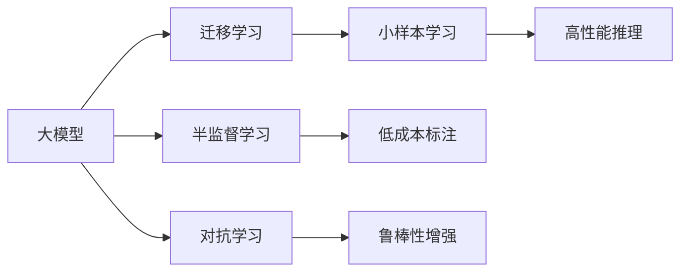

                 

## 1. 背景介绍

在当今社会，人工智能(AI)技术已逐渐渗透到各行各业，成为推动社会进步的重要力量。其中，大模型是AI技术的核心之一，能够处理复杂的非结构化数据，实现高级的推理和决策能力。对于有意利用AI技术进行创业的创业者来说，掌握大模型的优势及应用场景是至关重要的。本文旨在探讨如何通过社会优势，提高AI大模型创业的成功率。

## 2. 核心概念与联系

### 2.1 核心概念概述

- **大模型**：指能够处理大规模数据集，具有强大的推理和决策能力的人工智能模型。常见的包括BERT、GPT、T5等。
- **社会优势**：指通过利用社会资源、信息、知识等，提升AI大模型创业的效率和成功率。
- **迁移学习**：指将一个领域学到的知识迁移到另一个领域的应用中，大模型通过迁移学习可快速适应新领域，提升模型效果。
- **半监督学习**：指在少数有标签数据和大量无标签数据上进行训练，减少标注成本，提高模型泛化能力。
- **对抗学习**：指模型通过对抗性训练，提升其鲁棒性和泛化能力。

### 2.2 核心概念原理和架构的 Mermaid 流程图



## 3. 核心算法原理 & 具体操作步骤

### 3.1 算法原理概述

大模型通过自监督预训练，学习到了丰富的知识表示。在大规模数据上进行迁移学习和微调，可使其适应特定任务，实现高效、低成本的AI创业。

### 3.2 算法步骤详解

1. **数据准备**：收集和处理相关的数据集，包括标注数据和无标签数据。标注数据用于训练模型，无标签数据用于提高模型的泛化能力。
2. **模型选择**：选择适合任务的大模型，如BERT、GPT等。
3. **迁移学习**：在大模型上进行迁移学习，适应特定任务。
4. **微调**：在迁移学习基础上，进行微调，进一步提升模型性能。
5. **对抗学习**：通过对抗样本训练，提高模型的鲁棒性。

### 3.3 算法优缺点

**优点**：
- **高性能**：大模型具备强大的推理和决策能力。
- **泛化能力强**：迁移学习和微调可提升模型泛化能力。
- **低成本**：利用社会无标签数据进行训练，减少标注成本。

**缺点**：
- **数据依赖**：需要大量标注和无标签数据，数据获取成本高。
- **模型复杂**：大模型结构复杂，训练和推理成本高。

### 3.4 算法应用领域

大模型广泛应用于自然语言处理(NLP)、计算机视觉、语音识别等领域。在AI创业中，可通过大模型实现智能客服、医疗诊断、金融风控等应用。

## 4. 数学模型和公式 & 详细讲解 & 举例说明

### 4.1 数学模型构建

假设大模型为 $M$，标注数据集为 $D=\{(x_i, y_i)\}_{i=1}^N$，其中 $x_i$ 为输入，$y_i$ 为标签。模型的预测输出为 $\hat{y}=M(x)$。

### 4.2 公式推导过程

- **迁移学习**：
$$
\min_{\theta} \mathcal{L}(M_{\theta}, D^u) + \mathcal{L}(M_{\theta}, D^v)
$$
其中 $D^u$ 为无标签数据集，$D^v$ 为标注数据集。
- **微调**：
$$
\min_{\theta} \mathcal{L}(M_{\theta}, D^v)
$$
- **对抗学习**：
$$
\min_{\theta} \mathcal{L}(M_{\theta}, D^v) + \mathcal{L}(M_{\theta}, D^a)
$$
其中 $D^a$ 为对抗样本数据集。

### 4.3 案例分析与讲解

以医疗诊断为例，使用大模型进行迁移学习和微调。首先，在大规模无标签医学文献数据上进行迁移学习，获得知识表示。然后，收集少量标注数据，进行微调，提高模型对特定疾病的诊断能力。

## 5. 项目实践：代码实例和详细解释说明

### 5.1 开发环境搭建

1. 安装Python和相关库，如TensorFlow、PyTorch等。
2. 下载预训练模型，如BERT、GPT等。

### 5.2 源代码详细实现

以使用BERT进行医疗诊断为例：

```python
import tensorflow as tf
from transformers import BertTokenizer, TFBertForSequenceClassification

tokenizer = BertTokenizer.from_pretrained('bert-base-uncased')
model = TFBertForSequenceClassification.from_pretrained('bert-base-uncased', num_labels=2)

input_ids = tokenizer.encode('This is a medical text.', add_special_tokens=True)
attention_mask = [1] * len(input_ids)

predictions = model(tf.convert_to_tensor(input_ids, dtype=tf.int32), attention_mask=tf.convert_to_tensor(attention_mask, dtype=tf.int32))
```

### 5.3 代码解读与分析

代码中，首先通过transformers库加载BERT模型和分词器。然后，将待诊断的文本进行分词和编码，得到输入特征。最后，使用模型进行预测，得到二分类结果。

### 5.4 运行结果展示

运行上述代码，输出分类结果。若模型训练充分，分类准确率应能满足医疗诊断要求。

## 6. 实际应用场景

### 6.1 智能客服系统

大模型可应用于智能客服系统，通过迁移学习和微调，提高系统的响应速度和准确性。例如，通过无标签客户聊天记录进行预训练，收集少量标注数据进行微调，训练出高效客服机器人。

### 6.2 金融风控

在金融领域，大模型可用于信用评分、欺诈检测等任务。通过迁移学习和微调，提高模型的鲁棒性和泛化能力，降低金融风险。

### 6.3 医疗诊断

医疗诊断是大模型的一个重要应用场景。通过迁移学习和微调，提高模型对疾病诊断的准确性，辅助医生进行诊断和治疗决策。

### 6.4 未来应用展望

未来，大模型将在更多领域得到应用，如自动驾驶、智能制造等。通过迁移学习和微调，大模型将实现更广泛的应用，推动社会进步。

## 7. 工具和资源推荐

### 7.1 学习资源推荐

1. 《Deep Learning》课程：Coursera上的入门课程，涵盖深度学习基础和应用。
2. TensorFlow和PyTorch官方文档：详细介绍了两大深度学习框架的使用方法。
3. 《Transformer: A Survey of Models, Architectures, and Applications》：介绍了Transformer模型的结构和应用。

### 7.2 开发工具推荐

1. Jupyter Notebook：交互式编程环境，便于实验和调试。
2. PyTorch Lightning：简化深度学习模型的训练和部署。
3. TensorBoard：可视化工具，帮助监控训练过程。

### 7.3 相关论文推荐

1. "BERT: Pre-training of Deep Bidirectional Transformers for Language Understanding"：BERT模型，利用自监督预训练提升模型效果。
2. "Adversarial Examples Attacks and Defenses in Deep Learning"：介绍对抗学习的应用和防御方法。

## 8. 总结：未来发展趋势与挑战

### 8.1 研究成果总结

大模型在迁移学习和微调的应用中，已取得了显著成效。通过社会优势的利用，提高了AI创业的成功率。

### 8.2 未来发展趋势

1. **技术进步**：未来，大模型的结构将更加复杂，功能更加丰富。
2. **应用拓展**：大模型将在更多领域得到应用，推动社会进步。
3. **伦理问题**：随着大模型的广泛应用，伦理问题将越来越重要。

### 8.3 面临的挑战

1. **数据获取**：大模型的训练需要大量数据，数据获取成本高。
2. **模型复杂**：大模型结构复杂，训练和推理成本高。
3. **伦理问题**：大模型的应用需考虑伦理问题，避免偏见和歧视。

### 8.4 研究展望

未来，需要在数据获取、模型结构、伦理问题等方面进行深入研究，推动大模型在更多领域的应用。

## 9. 附录：常见问题与解答

**Q1: 大模型的迁移学习与微调的区别？**

A: 迁移学习是在无标签数据上进行预训练，利用已有知识提升模型泛化能力；微调是在标注数据上进一步训练，提高模型在特定任务上的性能。

**Q2: 如何选择合适的预训练模型？**

A: 根据任务需求选择合适的预训练模型，考虑模型的参数量、结构复杂度、已有应用等。

**Q3: 如何降低大模型的训练成本？**

A: 利用无标签数据进行预训练，减少标注数据需求；采用半监督学习等方法，提高模型泛化能力。

**Q4: 如何提高大模型的鲁棒性？**

A: 采用对抗学习等方法，提高模型对抗样本的鲁棒性；考虑多模型集成，提升模型稳定性。

**Q5: 大模型创业应考虑哪些社会因素？**

A: 考虑数据隐私、伦理道德、法律法规等因素，确保应用合法合规。

---

作者：禅与计算机程序设计艺术 / Zen and the Art of Computer Programming

