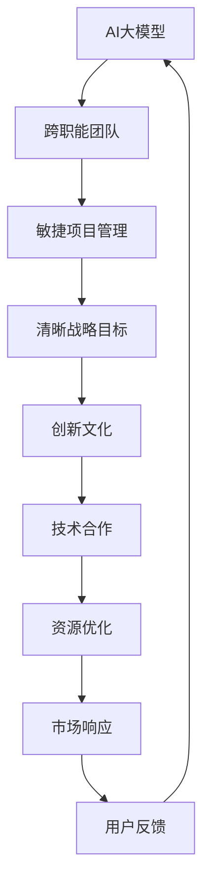

                 

# AI 大模型创业：如何利用管理优势？

在当今数字化转型的浪潮中，AI大模型的应用场景日益增多，涵盖了自然语言处理、计算机视觉、推荐系统等多个领域。创业公司如何利用管理优势，在AI大模型的开发和应用中脱颖而出，成为市场竞争中的关键。本文将从管理角度出发，探讨如何通过合理的团队构建、项目管理、市场策略、文化建设等手段，最大化地发挥AI大模型的潜力，推动企业可持续发展。

## 1. 背景介绍

### 1.1 市场环境
随着人工智能技术的快速发展，AI大模型在各行各业的应用场景不断扩大。企业通过引入AI大模型，可以提升业务效率、优化用户体验、开拓新市场，具有显著的竞争优势。然而，AI大模型的开发和应用需要高水平的团队和技术支持，因此，管理在创业公司的发展中起到了至关重要的作用。

### 1.2 管理挑战
尽管AI大模型技术在不断进步，但在创业公司的实际应用过程中，仍面临诸多管理挑战：

- **技术门槛高**：AI大模型的开发需要深厚的技术积累，团队成员必须具备跨学科的知识背景和创新能力。
- **资源配置难**：AI大模型的应用需要大量的数据、计算资源和资金投入，资源配置不当会影响项目进度和效果。
- **市场适应慢**：AI大模型的应用场景广泛，但市场适应能力较慢，需要快速响应市场变化。
- **团队协作难**：跨部门协作是AI大模型应用的常态，但不同部门间缺乏有效沟通和协作机制，可能导致项目延误。

## 2. 核心概念与联系

### 2.1 核心概念概述

在探讨如何利用管理优势时，需了解以下几个核心概念：

- **AI大模型**：指通过深度学习和神经网络技术，在大规模数据上预训练生成的、具有通用智能的模型，如BERT、GPT等。
- **创业公司管理**：涉及创业公司的组织结构、战略规划、团队建设、资源配置、市场推广等方面，确保企业高效运作。
- **项目管理**：指通过科学的管理方法，对AI大模型的开发、测试、上线等全流程进行管理，保证项目按时、按质、按量完成。
- **文化建设**：指在企业内部形成鼓励创新、协作、持续学习的文化氛围，促进员工成长和企业发展。

### 2.2 核心概念之间的关系

AI大模型的应用与创业公司的管理密切相关。合理的管理策略不仅能提升AI大模型的开发效率和应用效果，还能增强企业竞争力。通过构建跨职能团队、采用敏捷管理方法、制定清晰的战略目标、营造创新文化等手段，企业可以有效应对AI大模型应用的复杂性和挑战。

通过以下Mermaid流程图，展示AI大模型在创业公司管理中的应用逻辑：



## 3. 核心算法原理 & 具体操作步骤

### 3.1 算法原理概述

AI大模型的管理涉及到多个层面的策略和方法，包括团队构建、项目管理、市场策略和文化建设等。这些策略和方法需要综合考虑企业的实际情况和AI大模型的特性，制定科学合理的管理方案。

### 3.2 算法步骤详解

以下将详细介绍如何通过管理手段，实现AI大模型的有效开发和应用：

#### 3.2.1 团队构建
- **跨职能团队**：组建由数据科学家、算法工程师、产品经理、市场分析师等组成的跨职能团队，确保项目从需求分析、模型开发到上线应用的全流程协同工作。
- **人才选拔**：选拔具有跨学科背景、创新能力和团队协作精神的优秀人才，提升团队的整体能力。

#### 3.2.2 项目管理
- **敏捷管理**：采用敏捷开发方法，如Scrum、Kanban等，确保项目灵活适应市场需求和变化。
- **关键指标**：制定项目关键指标（KPI），如模型精度、部署速度、用户反馈等，实时监控项目进展。

#### 3.2.3 市场策略
- **市场定位**：根据企业实际情况和市场需求，明确AI大模型的应用场景和目标用户。
- **差异化策略**：通过差异化产品设计和服务模式，提升AI大模型的市场竞争力。

#### 3.2.4 文化建设
- **创新文化**：营造鼓励创新、包容失败的企业文化，激励员工不断探索AI大模型的应用潜力。
- **团队协作**：建立健全的沟通和协作机制，促进跨部门、跨团队的紧密合作。

### 3.3 算法优缺点

AI大模型的管理优势主要体现在以下几个方面：

- **提升效率**：通过合理的团队和项目管理，确保AI大模型的开发和应用高效运作，缩短项目周期。
- **增强竞争力**：利用差异化市场策略和创新文化，提升AI大模型在市场中的竞争力和用户接受度。
- **降低风险**：通过科学的资源配置和风险管理，降低项目风险，保障企业可持续发展。

同时，管理过程中也存在一些局限性：

- **成本高**：合理的管理手段需要较高的资源投入，对中小企业可能带来财务压力。
- **实施难度**：管理策略需要根据企业实际情况进行调整，实施过程中可能面临挑战。
- **市场变化快**：AI大模型应用场景变化快，管理策略需要灵活应对，避免策略滞后。

### 3.4 算法应用领域

AI大模型的管理方法广泛应用于以下几个领域：

- **金融科技**：在风险控制、信用评估、智能投顾等方面，利用AI大模型进行模型训练和应用。
- **医疗健康**：在疾病预测、医疗影像分析、个性化治疗等方面，利用AI大模型进行数据分析和决策支持。
- **零售电商**：在客户画像、推荐系统、智能客服等方面，利用AI大模型提升用户体验和运营效率。
- **智能制造**：在质量检测、设备维护、供应链管理等方面，利用AI大模型优化生产流程和资源配置。

## 4. 数学模型和公式 & 详细讲解 & 举例说明

### 4.1 数学模型构建

AI大模型的管理问题可以抽象为多目标优化问题。设企业目标函数为 $f(x)$，其中 $x$ 为管理策略向量，包括团队构建、项目管理、市场策略和文化建设等。目标函数需要考虑多方面因素，如项目进度、用户满意度、市场占有率等。

### 4.2 公式推导过程

设企业面临的管理问题为：

$$
\min_{x} f(x) = \alpha P + \beta C + \gamma U
$$

其中，$P$ 为项目进度，$C$ 为成本，$U$ 为用户满意度。

根据上述模型，可以通过优化策略向量 $x$ 来最小化目标函数 $f(x)$，确保项目顺利完成并提升用户满意度，同时控制成本。

### 4.3 案例分析与讲解

以一家创业公司为例，公司目标是利用AI大模型提升金融风险控制能力。通过合理的团队构建、项目管理、市场策略和文化建设，公司实现了以下目标：

- **团队构建**：组建包括数据科学家、算法工程师、市场分析师在内的跨职能团队，确保项目高效协同。
- **项目管理**：采用敏捷管理方法，设定KPI，实时监控项目进展，确保项目按时交付。
- **市场策略**：通过市场调研，明确目标用户和应用场景，制定差异化策略，提升产品竞争力。
- **文化建设**：营造创新文化，促进团队合作，提升员工创新能力。

通过以上管理手段，公司在短时间内成功上线AI大模型，并获得市场和用户的好评。

## 5. 项目实践：代码实例和详细解释说明

### 5.1 开发环境搭建

AI大模型的管理实践需要先进的开发环境。以下是搭建开发环境的详细步骤：

1. **选择平台**：选择支持AI大模型开发的云平台，如AWS、Google Cloud、阿里云等。
2. **配置环境**：安装必要的开发工具和库，如Python、TensorFlow、PyTorch等。
3. **数据准备**：准备用于模型训练和测试的数据集，确保数据质量和多样性。

### 5.2 源代码详细实现

以下是一个AI大模型管理实践的代码示例，通过Python实现：

```python
import tensorflow as tf
from tensorflow.keras import layers

# 构建AI大模型
model = tf.keras.Sequential()
model.add(layers.Dense(256, activation='relu'))
model.add(layers.Dense(128, activation='relu'))
model.add(layers.Dense(1, activation='sigmoid'))

# 训练模型
model.compile(optimizer='adam', loss='binary_crossentropy', metrics=['accuracy'])
model.fit(train_data, train_labels, epochs=10, validation_data=(val_data, val_labels))

# 部署模型
model.save('my_model.h5')
```

### 5.3 代码解读与分析

上述代码示例展示了AI大模型的基本构建和训练流程：

- **模型构建**：采用Sequential模型，定义了三层全连接神经网络结构。
- **模型训练**：使用adam优化器和binary_crossentropy损失函数，在训练数据集上进行训练。
- **模型部署**：保存模型文件，方便后续部署和应用。

此代码仅为示例，实际开发中需要根据具体需求进行调整和优化。

### 5.4 运行结果展示

训练过程中，可以实时监控模型的损失和准确率：

```python
history = model.fit(train_data, train_labels, epochs=10, validation_data=(val_data, val_labels))
plt.plot(history.history['loss'])
plt.plot(history.history['val_loss'])
plt.title('Model Loss')
plt.xlabel('Epochs')
plt.ylabel('Loss')
plt.legend(['Train', 'Validation'], loc='upper left')
plt.show()
```

通过上述管理实践和代码实现，可以看出AI大模型的应用和管理紧密相关，需要多方面的协同合作和科学决策。

## 6. 实际应用场景

### 6.1 金融科技

在金融科技领域，AI大模型可以用于信用评估、智能投顾、风险控制等方面。通过合理的管理手段，提升模型的预测准确率和应用效果：

- **团队构建**：组建跨职能团队，包括数据科学家、算法工程师、风险分析师等，确保项目高效协同。
- **项目管理**：采用敏捷管理方法，设定KPI，实时监控项目进展，确保模型按时上线。
- **市场策略**：通过市场调研，明确目标用户和应用场景，制定差异化策略，提升产品竞争力。
- **文化建设**：营造创新文化，促进团队合作，提升员工创新能力。

### 6.2 医疗健康

在医疗健康领域，AI大模型可以用于疾病预测、医疗影像分析、个性化治疗等方面。通过合理的管理手段，提升模型的诊断准确率和应用效果：

- **团队构建**：组建跨职能团队，包括数据科学家、算法工程师、医学专家等，确保项目高效协同。
- **项目管理**：采用敏捷管理方法，设定KPI，实时监控项目进展，确保模型按时上线。
- **市场策略**：通过市场调研，明确目标用户和应用场景，制定差异化策略，提升产品竞争力。
- **文化建设**：营造创新文化，促进团队合作，提升员工创新能力。

### 6.3 零售电商

在零售电商领域，AI大模型可以用于客户画像、推荐系统、智能客服等方面。通过合理的管理手段，提升用户满意度和服务效率：

- **团队构建**：组建跨职能团队，包括数据科学家、算法工程师、市场分析师等，确保项目高效协同。
- **项目管理**：采用敏捷管理方法，设定KPI，实时监控项目进展，确保模型按时上线。
- **市场策略**：通过市场调研，明确目标用户和应用场景，制定差异化策略，提升产品竞争力。
- **文化建设**：营造创新文化，促进团队合作，提升员工创新能力。

### 6.4 未来应用展望

未来，AI大模型的管理将继续发挥重要作用，推动企业向智能化、数字化方向发展。以下是几个未来展望：

- **多模态融合**：AI大模型将融合视觉、语音、文本等多种模态数据，提升综合应用能力。
- **边缘计算**：AI大模型将部署在边缘设备上，提升实时性和资源利用率。
- **个性化定制**：AI大模型将根据用户需求和行为进行个性化定制，提升用户体验。
- **联邦学习**：通过联邦学习等技术，保护用户隐私同时提升模型性能。

## 7. 工具和资源推荐

### 7.1 学习资源推荐

为了帮助AI大模型管理实践者掌握相关知识和技能，推荐以下学习资源：

- **《AI大模型开发与部署》**：介绍AI大模型的开发、训练、部署等全流程管理。
- **《Python深度学习》**：通过Python实现AI大模型的构建和训练。
- **《敏捷项目管理》**：介绍敏捷管理方法和工具，提升项目管理效率。
- **《创新文化建设》**：通过案例分析，探讨如何营造创新文化。

### 7.2 开发工具推荐

以下是一些用于AI大模型管理的常用工具：

- **JIRA**：项目管理工具，支持敏捷开发方法，方便跟踪任务进度。
- **Confluence**：协作工具，支持文档共享和知识管理。
- **Slack**：即时通讯工具，促进团队沟通和协作。
- **TensorFlow**：深度学习框架，支持AI大模型的训练和部署。
- **AWS**：云平台，提供丰富的AI大模型开发和部署资源。

### 7.3 相关论文推荐

以下是几篇有关AI大模型管理的经典论文，推荐阅读：

- **《AI大模型在金融科技中的应用》**：介绍AI大模型在金融风险控制、智能投顾等方面的应用和管理。
- **《医疗健康领域中的AI大模型管理》**：探讨AI大模型在疾病预测、医疗影像分析等方面的管理策略。
- **《零售电商领域的AI大模型管理》**：研究AI大模型在客户画像、推荐系统等方面的应用和管理。

## 8. 总结：未来发展趋势与挑战

### 8.1 总结

本文详细探讨了AI大模型在创业公司中的应用和管理。通过合理的团队构建、项目管理、市场策略和文化建设，可以实现AI大模型的有效开发和应用，推动企业可持续发展。

### 8.2 未来发展趋势

未来，AI大模型的管理将继续向智能化、自动化、协同化方向发展：

- **智能化**：通过AI技术优化管理手段，提升决策效率和效果。
- **自动化**：实现项目管理、任务分配等环节的自动化，提升企业运营效率。
- **协同化**：通过跨部门、跨团队的协同合作，提升企业创新能力和市场竞争力。

### 8.3 面临的挑战

尽管AI大模型管理存在诸多优势，但仍面临以下挑战：

- **技术复杂**：AI大模型管理需要跨学科的知识和技能，技术门槛较高。
- **资源分散**：AI大模型应用需要多个部门协同合作，资源分散可能导致管理难度增大。
- **市场变化快**：AI大模型应用场景变化快，管理策略需要灵活调整。

### 8.4 研究展望

未来，AI大模型的管理需要在技术、资源、市场等方面进行综合创新：

- **技术创新**：探索新的管理方法和工具，提升AI大模型应用的灵活性和效率。
- **资源整合**：加强跨部门、跨团队的协作，提升资源利用率和项目成功率。
- **市场适应**：根据市场需求和变化，灵活调整管理策略，提升企业竞争力。

## 9. 附录：常见问题与解答

**Q1：如何构建跨职能团队？**

A: 构建跨职能团队需要明确团队成员的角色和职责，确保各个职能部门协同工作。例如，在金融科技领域，可以组建由数据科学家、算法工程师、风险分析师等组成的多学科团队。

**Q2：如何进行敏捷项目管理？**

A: 采用敏捷管理方法，如Scrum、Kanban等，确保项目灵活适应市场需求和变化。通过设定KPI，实时监控项目进展，确保项目按时交付。

**Q3：如何营造创新文化？**

A: 营造创新文化需要提供良好的工作环境和激励机制，鼓励员工提出新想法和解决方案。可以通过定期的头脑风暴、创新大赛等方式，促进团队创新能力的提升。

**Q4：如何提高AI大模型的应用效果？**

A: 提高AI大模型的应用效果需要综合考虑数据质量、模型设计、算法优化等方面。通过科学的管理手段，确保AI大模型在各个环节高效运作，提升模型性能。

**Q5：如何提升AI大模型的部署效率？**

A: 提升AI大模型的部署效率需要优化模型结构和资源配置，采用高效的部署工具和技术。例如，可以采用模型压缩、混合精度训练等技术，减少计算资源消耗。

通过深入探索和应用AI大模型管理的各个方面，企业可以在激烈的市场竞争中脱颖而出，推动技术进步和业务发展。相信未来AI大模型管理将继续发挥重要作用，为企业的智能化转型提供强大支持。

