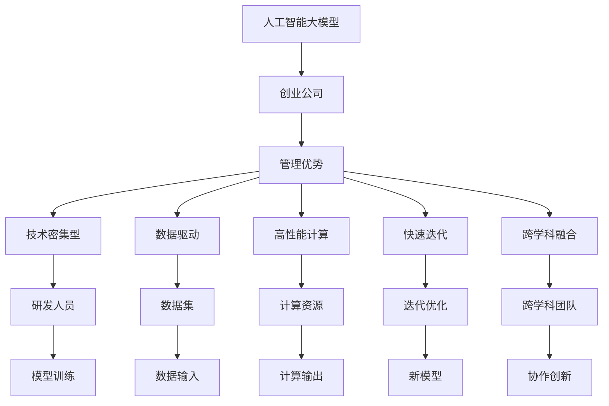

                 

# AI 大模型创业：如何利用管理优势？

在人工智能（AI）领域，大模型技术逐渐成为炙手可热的焦点，尤其是在深度学习、自然语言处理（NLP）、计算机视觉等领域。构建和部署大模型创业公司不仅需要强大的技术能力，还需要对管理策略有深入的理解。本文将从管理学的角度，探讨如何利用管理优势，推动大模型创业项目的成功。

## 1. 背景介绍

### 1.1 人工智能大模型现状
人工智能大模型是指使用大规模数据集进行训练，具备强大表现能力的模型，如BERT、GPT-3、XLNet等。这些模型在自然语言处理、图像识别、语音识别等领域取得了显著进展，展示了其强大的处理能力。

### 1.2 大模型创业公司特点
大模型创业公司通常具有以下几个特点：
1. **技术密集型**：需要大量研发人员进行模型的设计、训练和优化。
2. **数据驱动**：依赖于大量高质量的数据集进行模型训练和优化。
3. **高性能计算**：需要高性能计算资源，如GPU、TPU等。
4. **快速迭代**：需要持续进行模型迭代和优化，以适应新的应用场景和技术发展。
5. **跨学科融合**：涉及计算机科学、统计学、数据科学等多个学科。

## 2. 核心概念与联系

### 2.1 核心概念概述

- **人工智能大模型**：指使用大规模数据集进行训练，具备强大表现能力的模型，如BERT、GPT-3、XLNet等。
- **创业公司**：指以技术创新为核心，致力于解决实际问题的公司。
- **管理优势**：指创业公司在管理策略、人才结构、激励机制、文化氛围等方面的优势，以提升公司竞争力和创新能力。

这些概念之间的联系如下：

1. **人工智能大模型与创业公司**：大模型创业公司利用大模型的强大处理能力，解决实际问题，提供智能化解决方案。
2. **创业公司与管理优势**：创业公司需要通过有效的管理策略，培养和激励优秀人才，形成良好的企业文化，以实现技术创新和商业成功。
3. **大模型与跨学科融合**：大模型的构建和应用需要多个学科的交叉协作，管理者需要协调各方资源，推动跨学科的融合发展。

### 2.2 Mermaid 流程图（核心概念原理和架构）



通过以上流程图，可以看出大模型创业公司的核心要素及管理优势如何促进技术创新和商业成功。

## 3. 核心算法原理 & 具体操作步骤

### 3.1 算法原理概述

大模型创业公司需要依赖先进的大模型算法进行技术创新，以下是主要的算法原理：

- **深度学习模型**：包括卷积神经网络（CNN）、循环神经网络（RNN）、变换器（Transformer）等，用于构建大模型。
- **自监督学习**：使用无标签数据进行预训练，学习模型的通用表示，提高模型泛化能力。
- **迁移学习**：在大规模数据集上进行预训练，然后在特定任务上进行微调，以适应实际需求。
- **强化学习**：通过与环境的交互，优化模型参数，提高模型性能。

### 3.2 算法步骤详解

1. **数据获取与处理**：获取高质量的数据集，并进行数据清洗、预处理等操作。
2. **模型构建与训练**：选择合适的深度学习模型，并使用大规模数据集进行训练。
3. **模型微调与优化**：对模型进行微调，以适应特定任务的需求，并进行优化，提高模型性能。
4. **模型部署与维护**：将模型部署到实际应用中，并定期进行维护和更新。

### 3.3 算法优缺点

**优点**：
1. **泛化能力强**：大模型可以通过迁移学习快速适应新任务。
2. **表现优异**：在大规模数据集上进行预训练，能够学习到丰富的知识。
3. **跨领域应用**：可以应用于多个领域，如自然语言处理、计算机视觉等。

**缺点**：
1. **计算资源消耗大**：训练和优化大模型需要大量的计算资源。
2. **过拟合风险高**：大规模数据集可能存在偏差，导致模型过拟合。
3. **模型复杂度高**：大模型的复杂度高，难以进行解释。

### 3.4 算法应用领域

大模型创业公司可以应用于以下几个领域：

1. **自然语言处理**：如情感分析、文本分类、机器翻译等。
2. **计算机视觉**：如图像识别、目标检测、图像生成等。
3. **语音识别**：如语音合成、语音识别等。
4. **智能推荐系统**：如推荐商品、内容等。
5. **智能客服**：如自动问答、客户情感分析等。

## 4. 数学模型和公式 & 详细讲解 & 举例说明

### 4.1 数学模型构建

大模型的数学模型可以表示为：

$$
f(x) = \sum_{i=1}^{n} \theta_i x_i
$$

其中，$x$ 表示输入数据，$\theta$ 表示模型参数，$n$ 表示模型的复杂度。

### 4.2 公式推导过程

以自然语言处理中的情感分析为例，使用BERT模型进行情感分析的公式推导如下：

1. **输入预处理**：将文本输入BERT模型，得到文本嵌入向量。
2. **情感分类**：使用线性分类器进行情感分类，得到情感标签。
3. **损失函数**：定义交叉熵损失函数，用于衡量模型输出与真实标签之间的差异。

公式如下：

$$
L = -\frac{1}{N}\sum_{i=1}^{N} y_i \log P(y_i|x)
$$

其中，$y_i$ 表示真实标签，$P(y_i|x)$ 表示模型输出的概率分布。

### 4.3 案例分析与讲解

以BERT模型在情感分析中的应用为例，分析其数学模型构建和公式推导过程：

1. **输入预处理**：将文本输入BERT模型，得到文本嵌入向量。
2. **情感分类**：使用线性分类器进行情感分类，得到情感标签。
3. **损失函数**：定义交叉熵损失函数，用于衡量模型输出与真实标签之间的差异。

## 5. 项目实践：代码实例和详细解释说明

### 5.1 开发环境搭建

1. **选择编程语言**：Python是最常用的语言，因为其拥有丰富的科学计算和机器学习库。
2. **安装必要的库**：安装TensorFlow、PyTorch、Keras等深度学习库。
3. **配置计算资源**：使用GPU、TPU等高性能计算资源。
4. **搭建开发环境**：使用Docker、Jupyter Notebook等工具搭建开发环境。

### 5.2 源代码详细实现

以下是使用PyTorch实现BERT情感分析的代码：

```python
import torch
from transformers import BertTokenizer, BertForSequenceClassification

# 设置环境
device = torch.device("cuda" if torch.cuda.is_available() else "cpu")

# 加载模型和分词器
tokenizer = BertTokenizer.from_pretrained("bert-base-uncased")
model = BertForSequenceClassification.from_pretrained("bert-base-uncased", num_labels=2)

# 数据预处理
def preprocess(text):
    tokenized_text = tokenizer.tokenize(text)
    tokens = [tokenizer.vocab[token] for token in tokenized_text]
    tokens = [token for token in tokens if token != tokenizer.pad_token_id]
    input_ids = tokenizer.convert_tokens_to_ids(tokens)
    input_ids = input_ids.unsqueeze(0)
    attention_mask = torch.ones((1, len(input_ids)), device=device)

    return input_ids, attention_mask

# 训练模型
def train_model(model, optimizer, train_loader, epochs):
    model.train()
    for epoch in range(epochs):
        total_loss = 0
        for input_ids, attention_mask, labels in train_loader:
            input_ids = input_ids.to(device)
            attention_mask = attention_mask.to(device)
            labels = labels.to(device)
            optimizer.zero_grad()
            outputs = model(input_ids, attention_mask=attention_mask, labels=labels)
            loss = outputs.loss
            total_loss += loss.item()
            loss.backward()
            optimizer.step()

    return total_loss / len(train_loader)

# 测试模型
def evaluate_model(model, test_loader):
    model.eval()
    correct = 0
    total = 0
    for input_ids, attention_mask, labels in test_loader:
        input_ids = input_ids.to(device)
        attention_mask = attention_mask.to(device)
        with torch.no_grad():
            outputs = model(input_ids, attention_mask=attention_mask)
            logits = outputs.logits
            _, predicted = torch.max(logits, 1)
            total += labels.size(0)
            correct += (predicted == labels).sum().item()

    return correct / total
```

### 5.3 代码解读与分析

以上代码实现了BERT情感分析模型的训练和评估。以下是代码的详细解读和分析：

- **数据预处理**：将文本输入BERT模型，并进行预处理，得到模型的输入。
- **训练模型**：定义训练函数，使用PyTorch进行模型训练，并使用交叉熵损失函数进行优化。
- **评估模型**：定义评估函数，使用准确率指标评估模型性能。

## 6. 实际应用场景

### 6.1 自然语言处理
自然语言处理是大模型创业公司的核心应用场景之一，如情感分析、文本分类、机器翻译等。

### 6.2 计算机视觉
计算机视觉是大模型创业公司的另一个重要应用场景，如图像识别、目标检测、图像生成等。

### 6.3 语音识别
语音识别是自然语言处理的延伸，如语音合成、语音识别等。

### 6.4 智能推荐系统
智能推荐系统可以用于推荐商品、内容等，如电商推荐、新闻推荐等。

### 6.5 智能客服
智能客服可以用于自动问答、客户情感分析等，如自动回复、智能客服系统等。

## 7. 工具和资源推荐

### 7.1 学习资源推荐

1. **《深度学习》（Ian Goodfellow）**：深入浅出地介绍了深度学习的基本概念和算法。
2. **《Python深度学习》（Francois Chollet）**：讲解了使用Keras进行深度学习开发的技巧。
3. **《TensorFlow实战》（Manning Publications）**：介绍了TensorFlow的使用方法和最佳实践。
4. **《自然语言处理综论》（Daniel Jurafsky、James H. Martin）**：介绍了自然语言处理的理论基础和应用。
5. **《AI创业》（李开复）**：讲解了AI创业公司的成功经验和管理策略。

### 7.2 开发工具推荐

1. **PyTorch**：深度学习的主流框架，易于使用，拥有丰富的API。
2. **TensorFlow**：Google开发的深度学习框架，性能优越，适用于大规模应用。
3. **Keras**：基于Python的高层API，易于上手，适合初学者。
4. **Jupyter Notebook**：交互式开发环境，便于代码调试和演示。
5. **GitHub**：代码托管平台，便于团队协作和代码版本控制。

### 7.3 相关论文推荐

1. **《Attention is All You Need》**：Transformer的原始论文，介绍了自注意力机制。
2. **《BERT: Pre-training of Deep Bidirectional Transformers for Language Understanding》**：介绍BERT模型，说明了其在自然语言处理中的应用。
3. **《ImageNet Classification with Deep Convolutional Neural Networks》**：介绍卷积神经网络在图像识别中的应用。
4. **《Deep Reinforcement Learning for AI》**：介绍强化学习在AI中的应用。

## 8. 总结：未来发展趋势与挑战

### 8.1 研究成果总结

大模型创业公司通过先进的大模型算法，解决了许多实际问题，提升了各行业的智能化水平。通过有效的管理策略，公司能够更好地应对挑战，实现技术创新和商业成功。

### 8.2 未来发展趋势

1. **跨领域融合**：大模型将应用于更多领域，如医疗、教育、金融等。
2. **高效计算**：高性能计算技术将得到进一步发展，降低计算成本。
3. **自动化优化**：自动化优化技术将得到广泛应用，提高模型训练效率。
4. **大规模数据集**：更多高质量的数据集将被收集和应用，提升模型泛化能力。
5. **跨学科融合**：跨学科融合将成为主流趋势，推动更多创新。

### 8.3 面临的挑战

1. **计算资源**：高性能计算资源成本高昂，需要更多创新和优化。
2. **数据获取**：高质量数据集的获取难度大，需要更多投入。
3. **模型优化**：模型优化和训练过程复杂，需要更多创新和经验。
4. **跨学科协作**：跨学科协作难度大，需要更多沟通和协调。
5. **伦理和安全**：大模型的伦理和安全问题需要更多关注和解决。

### 8.4 研究展望

1. **自动化优化**：研究自动化优化技术，提高模型训练效率。
2. **跨学科融合**：推动跨学科融合，形成更多创新。
3. **数据获取**：研究高质量数据集的获取和应用。
4. **伦理和安全**：关注大模型的伦理和安全问题，推动规范发展。

## 9. 附录：常见问题与解答

### Q1: 大模型创业公司的管理优势有哪些？

**A1**: 大模型创业公司的管理优势包括：
1. **技术密集型**：需要大量研发人员进行模型的设计、训练和优化。
2. **数据驱动**：依赖于大量高质量的数据集进行模型训练和优化。
3. **高性能计算**：需要高性能计算资源，如GPU、TPU等。
4. **快速迭代**：需要持续进行模型迭代和优化，以适应新的应用场景和技术发展。
5. **跨学科融合**：涉及计算机科学、统计学、数据科学等多个学科。

### Q2: 大模型创业公司如何提升模型性能？

**A2**: 大模型创业公司可以通过以下方式提升模型性能：
1. **数据预处理**：对输入数据进行预处理，提升模型输入的质量。
2. **模型优化**：优化模型结构和算法，提升模型表现。
3. **迁移学习**：在大规模数据集上进行预训练，然后在特定任务上进行微调，以适应实际需求。
4. **对抗训练**：引入对抗样本，提高模型的鲁棒性和泛化能力。

### Q3: 大模型创业公司如何应对计算资源不足的问题？

**A3**: 大模型创业公司可以通过以下方式应对计算资源不足的问题：
1. **模型剪枝**：减少模型的参数量和计算量，提升推理效率。
2. **分布式计算**：利用分布式计算技术，提高计算效率。
3. **模型压缩**：采用模型压缩技术，降低计算资源的消耗。
4. **GPU资源共享**：共享GPU资源，提高计算效率。

### Q4: 大模型创业公司如何应对模型过拟合的问题？

**A4**: 大模型创业公司可以通过以下方式应对模型过拟合的问题：
1. **数据增强**：通过数据增强技术，提升模型泛化能力。
2. **正则化**：使用L2正则、Dropout等正则化技术，避免模型过拟合。
3. **早停法**：通过早停法，防止模型在验证集上过拟合。
4. **参数高效微调**：只更新少量参数，避免模型过拟合。

### Q5: 大模型创业公司如何应对模型复杂度高的问题？

**A5**: 大模型创业公司可以通过以下方式应对模型复杂度高的问题：
1. **简化模型结构**：通过模型简化，降低模型的复杂度。
2. **知识蒸馏**：通过知识蒸馏技术，将复杂模型的知识传递给简单模型。
3. **模型融合**：将多个模型进行融合，提高模型的鲁棒性和泛化能力。

---

作者：禅与计算机程序设计艺术 / Zen and the Art of Computer Programming

