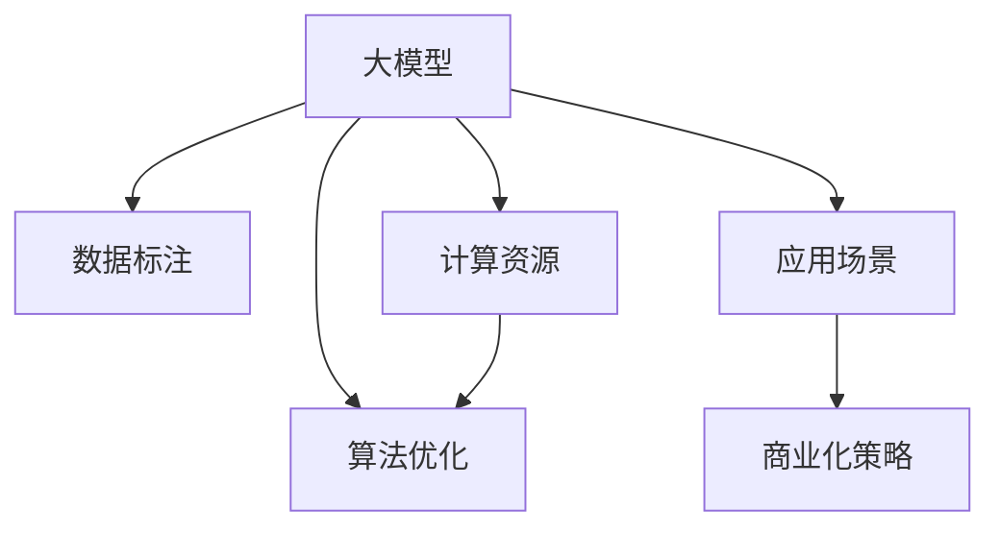

                 

# AI 大模型创业：如何利用资源优势？

## 1. 背景介绍

### 1.1 问题由来

当前，AI大模型正成为各大科技公司、创业公司争相布局的焦点。它们凭借强大的算法、庞大的数据、高效的计算资源，带来了显著的技术进步和商业价值。然而，对于资源有限的创业公司而言，如何在大模型领域取得突破，赢得竞争，成为一大难题。

一方面，大模型的训练需要海量的标注数据和巨大的计算资源，这对创业公司来说是个不小的门槛。另一方面，基于大模型的技术已经比较成熟，巨头公司积累了丰富的经验，创业公司难以通过自身的技术积累和数据资源赶超。

因此，本文旨在探讨创业公司在构建大模型创业项目时，如何利用有限的资源优势，实现技术突破和商业成功。

### 1.2 问题核心关键点

要回答如何利用资源优势的问题，首先必须了解大模型创业的几个核心关键点：

- **数据资源**：大模型训练需要大量标注数据，如何获取、清洗和处理这些数据，是大模型项目的重要挑战。
- **计算资源**：大模型的训练和推理计算量巨大，创业公司如何获取高效的计算资源，是决定项目成败的关键。
- **算法优势**：虽然算法本身不能直接带来优势，但算法的选择和创新是提升模型性能和效率的重要手段。
- **应用场景**：如何找到适合自身优势的大模型应用场景，是实现商业化落地和用户认可的关键。
- **商业化策略**：如何将大模型产品推向市场，吸引客户，实现商业变现，是创业公司需要考虑的重要问题。

本文将从数据、计算、算法、场景和商业化五个方面，详细探讨创业公司如何在大模型领域发挥自身资源优势。

## 2. 核心概念与联系

### 2.1 核心概念概述

为更好地理解如何利用资源优势，本节将介绍几个相关核心概念：

- **大模型(Large Model)**：指的是具有数亿甚至数十亿参数的深度学习模型，如BERT、GPT-3、T5等。它们通常用于文本生成、图像识别、语音识别等复杂任务。
- **数据标注(Data Annotation)**：大模型训练需要大量标注数据，标注过程包括数据收集、清洗、标注、审核等多个步骤。
- **计算资源(Computational Resource)**：训练和推理大模型需要强大的GPU/TPU等计算硬件，创业公司可通过云计算服务、硬件采购等方式获取资源。
- **算法优化(Algorithm Optimization)**：如何选择合适的算法，如自监督学习、迁移学习、强化学习等，是大模型优化性能的重要手段。
- **应用场景(Application Scenario)**：选择适合自己优势的应用场景，如医疗、金融、教育、智能客服等，有助于提升模型性能和商业价值。
- **商业化策略(Commercialization Strategy)**：如何定价、推广、服务支持等，是确保大模型成功落地和长期发展的重要考虑。

这些核心概念之间的逻辑关系可以通过以下Mermaid流程图来展示：



这个流程图展示了大模型项目的核心概念及其之间的关系：

1. 大模型通过数据标注和算法优化获得基础能力。
2. 计算资源支持模型的训练和推理。
3. 应用场景和大模型相结合，实现商业化落地。
4. 商业化策略保障大模型项目的长期可持续性。

## 3. 核心算法原理 & 具体操作步骤

### 3.1 算法原理概述

大模型创业的核心在于利用有限的资源优势，通过算法优化和场景选择，构建高效、高性能的大模型应用。

具体来说，创业公司可以在以下几方面进行优化：

- **数据增强**：通过数据增强技术，如回译、混搭、同义词替换等，在有限的标注数据上提升模型的泛化能力。
- **模型压缩**：利用模型压缩技术，如知识蒸馏、剪枝、量化等，减小模型规模，提升推理速度和效率。
- **小样本学习**：通过小样本学习技术，如Prompt Tuning、Few-Shot Learning等，在少量标注数据下进行模型微调，提升模型性能。
- **联邦学习**：通过联邦学习技术，在不泄露本地数据的前提下，进行分布式模型训练，共享模型参数提升性能。
- **迁移学习**：利用迁移学习技术，通过已有预训练模型的微调，快速适应新任务，提升模型效果。

这些技术手段能够在有限的资源条件下，最大化利用数据和计算资源，提升模型的性能和效率。

### 3.2 算法步骤详解

大模型创业的具体操作步骤如下：

**Step 1: 数据收集与预处理**

1. **数据收集**：根据应用场景，收集相关的标注数据。创业公司往往资金和人力有限，可以通过众包平台、公开数据集、合作机构等多种方式获取数据。
2. **数据清洗**：清洗数据中的噪声、错误、重复等，确保数据质量。这一步对模型性能至关重要。
3. **数据标注**：在数据上进行标注，如分类、匹配、生成等任务。标注过程可以外包给专业团队或众包平台，提高效率。

**Step 2: 模型选择与初始化**

1. **选择合适的模型**：根据应用场景选择合适的预训练模型，如BERT、GPT、RoBERTa等。
2. **模型初始化**：将预训练模型初始化到创业公司环境中，包括调整模型架构、修改参数设置等。

**Step 3: 模型微调**

1. **微调策略选择**：根据场景和资源选择微调策略，如小样本学习、联邦学习、迁移学习等。
2. **微调模型**：在少量标注数据上进行微调，调整模型参数以适应特定任务。
3. **模型评估**：在验证集上评估微调后的模型性能，确保模型泛化能力。

**Step 4: 部署与优化**

1. **模型部署**：将微调后的模型部署到实际应用环境中，如服务器、移动应用等。
2. **性能优化**：根据实际应用需求，进行模型压缩、推理加速等优化。
3. **迭代改进**：根据用户反馈，持续迭代改进模型，提升性能。

### 3.3 算法优缺点

大模型创业的算法具有以下优点：

- **泛化能力强**：大模型能够利用少量标注数据进行微调，提升模型泛化能力。
- **技术门槛低**：相比从头开发模型，大模型创业的技术门槛相对较低，更容易快速启动。
- **性能提升显著**：大模型微调能够显著提升模型在特定任务上的性能，实现技术突破。

同时，大模型创业也存在以下局限性：

- **资源依赖高**：大模型的训练和推理需要大量计算资源，创业公司需投入大量成本。
- **数据获取难**：高标注数据获取成本较高，创业公司往往难以获取高质量数据。
- **知识产权风险**：利用大模型进行创业，可能涉及版权和专利问题，需谨慎处理。

尽管存在这些局限，但通过合理选择算法和技术，创业公司仍可在大模型领域取得成功。

### 3.4 算法应用领域

大模型创业在多个领域都有广泛应用，例如：

- **自然语言处理(NLP)**：如问答系统、机器翻译、文本摘要、情感分析等任务。
- **计算机视觉(CV)**：如图像分类、目标检测、图像生成等任务。
- **语音识别(Speech Recognition)**：如语音转文本、语音合成、情感识别等任务。
- **推荐系统(Recommendation System)**：如商品推荐、音乐推荐、新闻推荐等任务。
- **医疗健康(Healthcare)**：如病历分析、医学图像分析、药物发现等任务。

此外，大模型创业还可应用于智能客服、金融风控、智能家居、智能城市等多个领域，带来巨大的商业价值。

## 4. 数学模型和公式 & 详细讲解 & 举例说明

### 4.1 数学模型构建

为了更好地理解大模型创业的数学原理，本节将介绍几个核心数学模型：

- **自监督学习(Self-Supervised Learning)**：利用模型自身的数据进行训练，如语言建模、掩码预测等任务。
- **迁移学习(Transfer Learning)**：利用预训练模型的知识进行微调，适应新任务。
- **小样本学习(Few-Shot Learning)**：在少量标注样本上进行微调，提升模型性能。
- **知识蒸馏(Knowledge Distillation)**：将大模型的知识迁移到小模型中，减小模型规模，提高推理速度。

这些数学模型在大模型创业过程中起着关键作用，能够有效提升模型的泛化能力和性能。

### 4.2 公式推导过程

以自监督学习的掩码预测任务为例，推导其数学模型和损失函数。

假设模型的输入为 $x$，输出为 $y$，表示 $x$ 的预测值。模型的参数为 $\theta$，表示模型的权重。

掩码预测任务的目标是让模型预测 $x$ 中的被掩码部分 $y$，其中被掩码部分为 $x$ 的一部分，用于训练模型。

掩码预测任务的损失函数为：

$$
\mathcal{L}(\theta) = -\frac{1}{n}\sum_{i=1}^{n} \sum_{j=1}^{m} \log \left( \frac{e^{\hat{y}_{ij}}}{\sum_{k=1}^{n} e^{\hat{y}_{ik}}} \right) 
$$

其中，$n$ 表示样本数量，$m$ 表示被掩码的文本部分长度。$\hat{y}_{ij}$ 表示模型对第 $i$ 个样本中第 $j$ 个掩码位置的预测值。

通过反向传播算法，可以求得模型参数 $\theta$ 的梯度，进而更新模型参数。

### 4.3 案例分析与讲解

以医疗领域的病历分析为例，说明大模型创业的数学模型和算法应用。

假设医疗数据集为 $\{x, y\}$，其中 $x$ 表示病历描述，$y$ 表示疾病标签。使用BERT模型进行微调，在医疗领域的应用步骤如下：

1. **数据收集**：从医院、研究机构等渠道收集病历数据，并进行预处理。
2. **模型选择**：选择预训练的BERT模型，并对其进行微调。
3. **微调策略**：使用自监督学习中的语言模型任务对BERT进行预训练，使用小样本学习技术进行微调。
4. **模型评估**：在验证集上评估微调后的模型性能，确保模型泛化能力。
5. **部署优化**：将微调后的模型部署到医院的信息系统中，进行实时推理和诊断。

通过上述步骤，大模型能够在医疗领域实现病历分析、疾病预测等任务，提升医生的诊疗效率和精度。

## 5. 项目实践：代码实例和详细解释说明

### 5.1 开发环境搭建

在进行大模型创业实践前，我们需要准备好开发环境。以下是使用Python进行PyTorch开发的环境配置流程：

1. 安装Anaconda：从官网下载并安装Anaconda，用于创建独立的Python环境。

2. 创建并激活虚拟环境：
```bash
conda create -n pytorch-env python=3.8 
conda activate pytorch-env
```

3. 安装PyTorch：根据CUDA版本，从官网获取对应的安装命令。例如：
```bash
conda install pytorch torchvision torchaudio cudatoolkit=11.1 -c pytorch -c conda-forge
```

4. 安装Transformers库：
```bash
pip install transformers
```

5. 安装各类工具包：
```bash
pip install numpy pandas scikit-learn matplotlib tqdm jupyter notebook ipython
```

完成上述步骤后，即可在`pytorch-env`环境中开始大模型创业实践。

### 5.2 源代码详细实现

下面我们以医疗领域的病历分析任务为例，给出使用Transformers库对BERT模型进行微调的PyTorch代码实现。

首先，定义病历数据处理函数：

```python
from transformers import BertTokenizer
from torch.utils.data import Dataset
import torch

class ElectronicHealthRecordDataset(Dataset):
    def __init__(self, texts, labels, tokenizer, max_len=128):
        self.texts = texts
        self.labels = labels
        self.tokenizer = tokenizer
        self.max_len = max_len
        
    def __len__(self):
        return len(self.texts)
    
    def __getitem__(self, item):
        text = self.texts[item]
        label = self.labels[item]
        
        encoding = self.tokenizer(text, return_tensors='pt', max_length=self.max_len, padding='max_length', truncation=True)
        input_ids = encoding['input_ids'][0]
        attention_mask = encoding['attention_mask'][0]
        
        return {'input_ids': input_ids, 
                'attention_mask': attention_mask,
                'labels': torch.tensor(label, dtype=torch.long)}
```

然后，定义模型和优化器：

```python
from transformers import BertForTokenClassification, AdamW

model = BertForTokenClassification.from_pretrained('bert-base-cased', num_labels=10)

optimizer = AdamW(model.parameters(), lr=2e-5)
```

接着，定义训练和评估函数：

```python
from torch.utils.data import DataLoader
from tqdm import tqdm
from sklearn.metrics import accuracy_score

device = torch.device('cuda') if torch.cuda.is_available() else torch.device('cpu')
model.to(device)

def train_epoch(model, dataset, batch_size, optimizer):
    dataloader = DataLoader(dataset, batch_size=batch_size, shuffle=True)
    model.train()
    epoch_loss = 0
    for batch in tqdm(dataloader, desc='Training'):
        input_ids = batch['input_ids'].to(device)
        attention_mask = batch['attention_mask'].to(device)
        labels = batch['labels'].to(device)
        model.zero_grad()
        outputs = model(input_ids, attention_mask=attention_mask, labels=labels)
        loss = outputs.loss
        epoch_loss += loss.item()
        loss.backward()
        optimizer.step()
    return epoch_loss / len(dataloader)

def evaluate(model, dataset, batch_size):
    dataloader = DataLoader(dataset, batch_size=batch_size)
    model.eval()
    preds, labels = [], []
    with torch.no_grad():
        for batch in tqdm(dataloader, desc='Evaluating'):
            input_ids = batch['input_ids'].to(device)
            attention_mask = batch['attention_mask'].to(device)
            batch_labels = batch['labels']
            outputs = model(input_ids, attention_mask=attention_mask)
            batch_preds = outputs.logits.argmax(dim=2).to('cpu').tolist()
            batch_labels = batch_labels.to('cpu').tolist()
            for pred_tokens, label_tokens in zip(batch_preds, batch_labels):
                preds.append(pred_tokens[:len(label_tokens)])
                labels.append(label_tokens)
                
    print(f"Accuracy: {accuracy_score(labels, preds)}")
```

最后，启动训练流程并在验证集上评估：

```python
epochs = 5
batch_size = 16

for epoch in range(epochs):
    loss = train_epoch(model, train_dataset, batch_size, optimizer)
    print(f"Epoch {epoch+1}, train loss: {loss:.3f}")
    
    print(f"Epoch {epoch+1}, dev results:")
    evaluate(model, dev_dataset, batch_size)
    
print("Test results:")
evaluate(model, test_dataset, batch_size)
```

以上就是使用PyTorch对BERT进行医疗领域病历分析任务微调的完整代码实现。可以看到，利用Transformers库和PyTorch，大模型创业的代码实现相对简洁高效。

### 5.3 代码解读与分析

让我们再详细解读一下关键代码的实现细节：

**ElectronicHealthRecordDataset类**：
- `__init__`方法：初始化病历数据、标签、分词器等组件。
- `__len__`方法：返回数据集的样本数量。
- `__getitem__`方法：对单个样本进行处理，将病历文本输入编码为token ids，将标签编码为数字，并对其进行定长padding，最终返回模型所需的输入。

**模型和优化器定义**：
- 选择BERT模型进行微调，并设置优化器为AdamW。

**训练和评估函数**：
- 使用PyTorch的DataLoader对数据集进行批次化加载，供模型训练和推理使用。
- 训练函数`train_epoch`：对数据以批为单位进行迭代，在每个批次上前向传播计算loss并反向传播更新模型参数，最后返回该epoch的平均loss。
- 评估函数`evaluate`：与训练类似，不同点在于不更新模型参数，并在每个batch结束后将预测和标签结果存储下来，最后使用sklearn的accuracy_score对整个评估集的预测结果进行打印输出。

**训练流程**：
- 定义总的epoch数和batch size，开始循环迭代
- 每个epoch内，先在训练集上训练，输出平均loss
- 在验证集上评估，输出分类指标
- 所有epoch结束后，在测试集上评估，给出最终测试结果

可以看到，PyTorch配合Transformers库使得BERT微调的代码实现变得简洁高效。开发者可以将更多精力放在数据处理、模型改进等高层逻辑上，而不必过多关注底层的实现细节。

当然，工业级的系统实现还需考虑更多因素，如模型的保存和部署、超参数的自动搜索、更灵活的任务适配层等。但核心的微调范式基本与此类似。

## 6. 实际应用场景

### 6.1 智能客服系统

基于大模型微调的对话技术，可以广泛应用于智能客服系统的构建。传统客服往往需要配备大量人力，高峰期响应缓慢，且一致性和专业性难以保证。而使用微调后的对话模型，可以7x24小时不间断服务，快速响应客户咨询，用自然流畅的语言解答各类常见问题。

在技术实现上，可以收集企业内部的历史客服对话记录，将问题和最佳答复构建成监督数据，在此基础上对预训练对话模型进行微调。微调后的对话模型能够自动理解用户意图，匹配最合适的答案模板进行回复。对于客户提出的新问题，还可以接入检索系统实时搜索相关内容，动态组织生成回答。如此构建的智能客服系统，能大幅提升客户咨询体验和问题解决效率。

### 6.2 金融舆情监测

金融机构需要实时监测市场舆论动向，以便及时应对负面信息传播，规避金融风险。传统的人工监测方式成本高、效率低，难以应对网络时代海量信息爆发的挑战。基于大语言模型微调的文本分类和情感分析技术，为金融舆情监测提供了新的解决方案。

具体而言，可以收集金融领域相关的新闻、报道、评论等文本数据，并对其进行主题标注和情感标注。在此基础上对预训练语言模型进行微调，使其能够自动判断文本属于何种主题，情感倾向是正面、中性还是负面。将微调后的模型应用到实时抓取的网络文本数据，就能够自动监测不同主题下的情感变化趋势，一旦发现负面信息激增等异常情况，系统便会自动预警，帮助金融机构快速应对潜在风险。

### 6.3 个性化推荐系统

当前的推荐系统往往只依赖用户的历史行为数据进行物品推荐，无法深入理解用户的真实兴趣偏好。基于大语言模型微调技术，个性化推荐系统可以更好地挖掘用户行为背后的语义信息，从而提供更精准、多样的推荐内容。

在实践中，可以收集用户浏览、点击、评论、分享等行为数据，提取和用户交互的物品标题、描述、标签等文本内容。将文本内容作为模型输入，用户的后续行为（如是否点击、购买等）作为监督信号，在此基础上微调预训练语言模型。微调后的模型能够从文本内容中准确把握用户的兴趣点。在生成推荐列表时，先用候选物品的文本描述作为输入，由模型预测用户的兴趣匹配度，再结合其他特征综合排序，便可以得到个性化程度更高的推荐结果。

### 6.4 未来应用展望

随着大语言模型微调技术的发展，未来将有更多的应用场景得以实现：

- **智慧医疗**：利用大模型进行病历分析、疾病预测、药物发现等任务，提升医疗服务的智能化水平。
- **智能教育**：使用大模型进行作业批改、学情分析、知识推荐等，因材施教，促进教育公平，提高教学质量。
- **智慧城市**：在城市事件监测、舆情分析、应急指挥等环节，提高城市管理的自动化和智能化水平，构建更安全、高效的未来城市。
- **金融科技**：通过大模型进行风险评估、欺诈检测、舆情分析等，提升金融服务的精准性和可靠性。

除了上述这些领域，大语言模型微调还将应用于更多场景中，为各行各业带来变革性影响。

## 7. 工具和资源推荐

### 7.1 学习资源推荐

为了帮助开发者系统掌握大语言模型微调的理论基础和实践技巧，这里推荐一些优质的学习资源：

1. 《Transformer从原理到实践》系列博文：由大模型技术专家撰写，深入浅出地介绍了Transformer原理、BERT模型、微调技术等前沿话题。

2. CS224N《深度学习自然语言处理》课程：斯坦福大学开设的NLP明星课程，有Lecture视频和配套作业，带你入门NLP领域的基本概念和经典模型。

3. 《Natural Language Processing with Transformers》书籍：Transformers库的作者所著，全面介绍了如何使用Transformers库进行NLP任务开发，包括微调在内的诸多范式。

4. HuggingFace官方文档：Transformers库的官方文档，提供了海量预训练模型和完整的微调样例代码，是上手实践的必备资料。

5. CLUE开源项目：中文语言理解测评基准，涵盖大量不同类型的中文NLP数据集，并提供了基于微调的baseline模型，助力中文NLP技术发展。

通过对这些资源的学习实践，相信你一定能够快速掌握大语言模型微调的精髓，并用于解决实际的NLP问题。

### 7.2 开发工具推荐

高效的开发离不开优秀的工具支持。以下是几款用于大语言模型微调开发的常用工具：

1. PyTorch：基于Python的开源深度学习框架，灵活动态的计算图，适合快速迭代研究。大部分预训练语言模型都有PyTorch版本的实现。

2. TensorFlow：由Google主导开发的开源深度学习框架，生产部署方便，适合大规模工程应用。同样有丰富的预训练语言模型资源。

3. Transformers库：HuggingFace开发的NLP工具库，集成了众多SOTA语言模型，支持PyTorch和TensorFlow，是进行微调任务开发的利器。

4. Weights & Biases：模型训练的实验跟踪工具，可以记录和可视化模型训练过程中的各项指标，方便对比和调优。与主流深度学习框架无缝集成。

5. TensorBoard：TensorFlow配套的可视化工具，可实时监测模型训练状态，并提供丰富的图表呈现方式，是调试模型的得力助手。

6. Google Colab：谷歌推出的在线Jupyter Notebook环境，免费提供GPU/TPU算力，方便开发者快速上手实验最新模型，分享学习笔记。

合理利用这些工具，可以显著提升大语言模型微调任务的开发效率，加快创新迭代的步伐。

### 7.3 相关论文推荐

大语言模型和微调技术的发展源于学界的持续研究。以下是几篇奠基性的相关论文，推荐阅读：

1. Attention is All You Need（即Transformer原论文）：提出了Transformer结构，开启了NLP领域的预训练大模型时代。

2. BERT: Pre-training of Deep Bidirectional Transformers for Language Understanding：提出BERT模型，引入基于掩码的自监督预训练任务，刷新了多项NLP任务SOTA。

3. Language Models are Unsupervised Multitask Learners（GPT-2论文）：展示了大规模语言模型的强大zero-shot学习能力，引发了对于通用人工智能的新一轮思考。

4. Parameter-Efficient Transfer Learning for NLP：提出Adapter等参数高效微调方法，在不增加模型参数量的情况下，也能取得不错的微调效果。

5. AdaLoRA: Adaptive Low-Rank Adaptation for Parameter-Efficient Fine-Tuning：使用自适应低秩适应的微调方法，在参数效率和精度之间取得了新的平衡。

这些论文代表了大语言模型微调技术的发展脉络。通过学习这些前沿成果，可以帮助研究者把握学科前进方向，激发更多的创新灵感。

## 8. 总结：未来发展趋势与挑战

### 8.1 总结

本文对大语言模型创业的资源优势进行了全面系统的探讨。首先，从数据资源、计算资源、算法优势、应用场景和商业化策略五个方面，详细介绍了大模型创业的核心要点。其次，通过理论推导和案例分析，揭示了大模型微调的数学模型和算法步骤。最后，通过代码实例和实际应用，展示了如何在有限资源条件下构建大模型创业项目。

通过本文的系统梳理，可以看到，大语言模型微调技术能够在有限的资源条件下，通过算法优化和场景选择，实现高效、高性能的模型应用。这为创业公司提供了新的切入点和发展方向，有望助力其在NLP领域取得突破。

### 8.2 未来发展趋势

展望未来，大语言模型微调技术将呈现以下几个发展趋势：

1. **数据资源丰富化**：随着数据标注技术的进步和公开数据集的增加，创业公司将更容易获取高质量标注数据。
2. **计算资源多样化**：除了传统的GPU/TPU，云计算、分布式计算等新兴计算资源也将成为创业公司的选择。
3. **算法技术创新**：小样本学习、自监督学习、联邦学习等算法将不断优化，提升微调模型的性能和效率。
4. **应用场景多元化**：大模型微调将深入各行各业，带来更广泛的应用场景和商业价值。
5. **商业化策略多样化**：从API服务、定制解决方案到订阅模式，多样化的商业化策略将助力大模型创业项目取得成功。

这些趋势表明，大语言模型微调技术正在快速发展和成熟，为创业公司提供了更多的机遇和挑战。

### 8.3 面临的挑战

尽管大语言模型微调技术已经取得了显著进展，但在迈向实际应用的过程中，仍面临诸多挑战：

1. **标注数据获取难**：高质量标注数据的获取成本较高，创业公司往往难以获取大规模标注数据。
2. **计算资源依赖高**：大模型的训练和推理需要高性能计算资源，创业公司需投入大量成本。
3. **算法效果不稳定**：微调算法的性能受数据质量、模型架构等因素影响，难以保证稳定性。
4. **模型可解释性不足**：大模型往往是"黑盒"系统，难以解释其内部工作机制和决策逻辑。
5. **知识产权风险**：利用大模型进行创业，可能涉及版权和专利问题，需谨慎处理。

尽管存在这些挑战，但通过合理选择算法和技术，创业公司仍可在大模型领域取得成功。

### 8.4 研究展望

面对大语言模型微调所面临的挑战，未来的研究需要在以下几个方面寻求新的突破：

1. **数据增强技术**：开发更高效的数据增强方法，利用已有数据提升模型泛化能力。
2. **计算资源优化**：探索分布式计算、混合精度训练等技术，降低计算资源成本。
3. **小样本学习算法**：研究更高效的小样本学习算法，减少对标注数据的依赖。
4. **模型压缩技术**：开发更高效的模型压缩技术，减小模型规模，提升推理速度。
5. **模型可解释性提升**：引入可解释性技术，提高大模型的可解释性和可理解性。

这些研究方向的探索，必将引领大语言模型微调技术迈向更高的台阶，为构建安全、可靠、可解释、可控的智能系统铺平道路。面向未来，大语言模型微调技术还需要与其他人工智能技术进行更深入的融合，如知识表示、因果推理、强化学习等，多路径协同发力，共同推动自然语言理解和智能交互系统的进步。只有勇于创新、敢于突破，才能不断拓展语言模型的边界，让智能技术更好地造福人类社会。

## 9. 附录：常见问题与解答

**Q1：大模型创业需要哪些资源？**

A: 大模型创业需要以下资源：

1. **数据资源**：包括标注数据、公开数据集、合作机构等。数据标注和清洗是创业初期的重要任务。
2. **计算资源**：高性能GPU/TPU等计算硬件，或云计算服务。
3. **算法资源**：可用的预训练模型和微调算法，如BERT、GPT、Transformer等。
4. **人才资源**：具有NLP领域背景的数据科学家、工程师等。

合理利用这些资源，可以显著提升大模型创业的成功率。

**Q2：如何降低大模型的计算成本？**

A: 降低大模型的计算成本，可以考虑以下方法：

1. **分布式计算**：利用集群、云计算等分布式计算资源，分担计算压力。
2. **模型压缩**：通过剪枝、量化、知识蒸馏等技术，减小模型规模，降低计算量。
3. **混合精度训练**：使用混合精度浮点数训练，提升计算效率。
4. **小样本学习**：利用小样本学习技术，减少对大规模数据和计算资源的依赖。
5. **硬件优化**：选择高效的硬件设备，如专用NPU、边缘计算设备等。

这些方法可以帮助创业公司在不显著增加成本的情况下，提升大模型的性能和效率。

**Q3：大模型创业的商业化策略有哪些？**

A: 大模型创业的商业化策略可以多样化，包括：

1. **API服务**：提供模型API接口，客户可以直接调用模型进行推理。
2. **定制解决方案**：根据客户需求定制解决方案，提供一站式服务。
3. **订阅模式**：客户按月或按年支付订阅费用，享受模型服务。
4. **合作开发**：与企业合作开发专属模型，深度整合业务需求。
5. **开源社区**：通过开源社区发布模型和算法，吸引开发者和用户，建立品牌影响力。

这些策略需要根据自身资源和市场情况选择，找到最适合的商业模式。

**Q4：如何处理大模型的过拟合问题？**

A: 处理大模型的过拟合问题，可以考虑以下方法：

1. **数据增强**：通过回译、混搭、同义词替换等技术，扩充训练数据。
2. **正则化**：使用L2正则、Dropout、Early Stopping等方法，防止过拟合。
3. **小样本学习**：利用小样本学习技术，在少量标注数据下进行微调。
4. **联邦学习**：通过分布式模型训练，减少本地数据泄露。
5. **模型压缩**：通过剪枝、量化等技术，减小模型规模，提升泛化能力。

这些方法可以帮助创业公司在有限的资源条件下，避免过拟合，提升模型性能。

**Q5：大模型创业的技术难点有哪些？**

A: 大模型创业的技术难点包括：

1. **数据标注**：标注数据获取和清洗成本高，且质量难以保证。
2. **计算资源**：高性能计算资源成本较高，创业公司往往难以承担。
3. **算法选择**：选择合适的算法和优化策略，提高模型性能。
4. **模型部署**：将模型部署到实际应用环境中，考虑模型压缩、推理加速等。
5. **可解释性**：大模型往往缺乏可解释性，难以解释其内部工作机制。

这些技术难点需要创业公司不断探索和优化，才能实现大模型创业的成功。

---

作者：禅与计算机程序设计艺术 / Zen and the Art of Computer Programming

