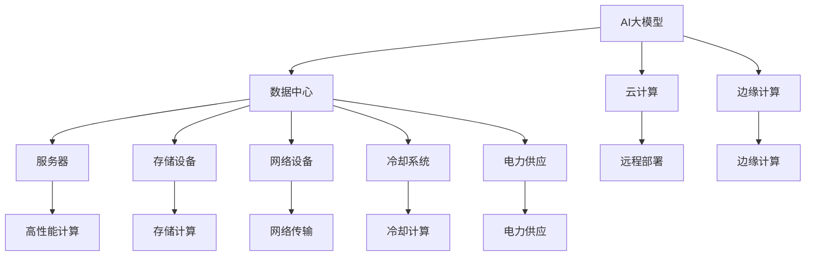

                 

# AI 大模型应用数据中心建设：数据中心投资与建设

> 关键词：数据中心投资，AI大模型，数据中心建设，基础设施，能源消耗，未来趋势

## 1. 背景介绍

### 1.1 问题由来

随着人工智能(AI)技术的迅速发展，AI大模型在自然语言处理(NLP)、计算机视觉(CV)、推荐系统、智能驾驶等诸多领域取得了显著进展，推动了AI技术的广泛应用。AI大模型的成功离不开大规模数据中心（Data Center）的支持，但与此同时，AI大模型的训练和部署对数据中心的基础设施建设、能源消耗和成本投入提出了更高的要求。

### 1.2 问题核心关键点

- AI大模型对数据中心的需求：大模型需要大量高性能计算资源和存储资源进行训练和推理，数据中心需要提供稳定可靠的网络和电力供应。
- 数据中心的能源消耗：AI大模型的训练和推理过程中会产生大量的计算和存储需求，导致数据中心能源消耗大幅增加。
- 数据中心的投资和建设：建设数据中心需要大量的资金投入，包括硬件设备、网络设备、冷却系统、电力供应等。
- 数据中心的发展趋势：云计算和边缘计算等技术的发展，使得数据中心的投资和建设需要考虑更多新的技术和场景。

### 1.3 问题研究意义

数据中心的建设对AI大模型的应用具有重要的支撑作用，但同时带来的高投资、高能耗等挑战也制约了AI大模型的广泛应用。因此，如何平衡AI大模型应用的广度和深度，合理投资和建设数据中心，是当前AI领域亟需解决的重要问题。本文将全面探讨AI大模型应用数据中心建设的投资与建设问题，从多个角度深入分析其关键技术、应用场景和未来发展趋势。

## 2. 核心概念与联系

### 2.1 核心概念概述

为更好地理解AI大模型应用数据中心建设的投资与建设问题，本节将介绍几个密切相关的核心概念：

- AI大模型：基于深度学习技术的模型，能够通过大规模数据训练学习复杂的特征表示，广泛应用于各类AI应用中。
- 数据中心：为计算机系统提供运算、存储、网络等服务的物理设施，包括服务器、存储设备、网络设备、冷却系统等。
- 云计算：通过互联网提供按需、可扩展、灵活的计算和存储服务，支持AI大模型的远程部署和应用。
- 边缘计算：在数据产生的地方进行数据处理和分析，减少数据传输的延迟和带宽消耗，支持AI大模型在移动设备等边缘设备上的应用。

这些核心概念之间的逻辑关系可以通过以下Mermaid流程图来展示：



这个流程图展示了AI大模型应用数据中心建设的各个环节及其相互关系：

1. AI大模型需要数据中心提供高性能计算资源和存储资源进行训练和推理。
2. 云计算和边缘计算为AI大模型的应用提供了灵活的部署方式。
3. 数据中心的基础设施包括服务器、存储设备、网络设备、冷却系统和电力供应等。

这些概念共同构成了AI大模型应用数据中心建设的完整框架，使得大模型能够高效、稳定地运行。

## 3. 核心算法原理 & 具体操作步骤

### 3.1 算法原理概述

AI大模型应用数据中心建设的投资与建设，本质上是一个优化问题。其核心思想是：在满足AI大模型应用需求的前提下，通过合理的规划和配置，最小化数据中心的投资成本和能源消耗。

形式化地，假设数据中心的总投资为 $C$，年运营成本为 $O$，能源消耗为 $E$，年计算需求为 $D$，存储需求为 $S$，网络带宽需求为 $B$。则优化目标为：

$$
\min_{C,O,E} C + \beta O + \gamma E \quad \text{subject to} \quad D \leq L(C,O,E) \quad S \leq H(C,O,E) \quad B \leq N(C,O,E)
$$

其中 $\beta$ 和 $\gamma$ 分别为运营成本和能源消耗的权重系数，$L$、$H$ 和 $N$ 分别表示计算能力、存储能力和网络带宽的函数。

通过梯度下降等优化算法，求解上述最优化问题，得到最优的数据中心投资和建设方案。

### 3.2 算法步骤详解

AI大模型应用数据中心建设的投资与建设一般包括以下几个关键步骤：

**Step 1: 需求评估**

- 根据AI大模型的应用场景，评估计算需求、存储需求和网络带宽需求。例如，NLP模型需要较大的计算和存储资源，CV模型需要高分辨率的图像存储和传输，推荐系统需要实时计算和存储更新数据等。
- 根据评估结果，确定数据中心的规模和配置需求，包括服务器、存储设备、网络设备等。

**Step 2: 设计方案**

- 设计数据中心的基础架构，包括服务器、存储设备、网络设备、冷却系统等。选择合适的硬件设备品牌和型号，并规划设备的布局和连接方式。
- 确定数据中心的能源供应和冷却系统，包括电力供应、冷却系统等，确保满足计算和存储设备的需求。
- 根据评估的需求和设计方案，计算数据中心的总投资和年运营成本，并预测能源消耗。

**Step 3: 预算与投资**

- 根据设计方案和预算，计算数据中心的总投资和年运营成本，包括硬件设备、网络设备、冷却系统、电力供应等。
- 选择最优的投资方案，平衡投资成本和运营成本，确保数据中心能够高效运行。

**Step 4: 建设与部署**

- 按照设计方案，建设数据中心的基础设施，包括服务器、存储设备、网络设备、冷却系统等。
- 进行设备的部署和配置，确保设备的正常运行和网络连接。
- 在数据中心部署AI大模型，进行训练和推理，并监测其性能和能耗。

**Step 5: 监控与优化**

- 对数据中心进行实时监控，监测设备的运行状态、能源消耗和计算性能等指标。
- 根据监控结果，对数据中心的配置进行优化，如调整服务器负载、增加冷却系统等，确保数据中心的稳定运行。
- 定期更新投资预算和运营成本，根据实际需求进行调整和优化。

### 3.3 算法优缺点

AI大模型应用数据中心建设的投资与建设方法具有以下优点：

- 能够满足AI大模型应用的高性能计算和存储需求，确保模型训练和推理的稳定性和准确性。
- 通过合理的规划和配置，最小化数据中心的投资成本和能源消耗，降低运营成本。

同时，该方法也存在以下局限性：

- 对AI大模型的应用场景和需求评估需要准确性和全面性，否则会导致配置不当和资源浪费。
- 投资和建设过程需要详细的规划和预算，涉及到硬件设备、网络设备、冷却系统、电力供应等环节，复杂度较高。
- 监控和优化过程需要持续的投入和维护，确保数据中心的稳定运行。

尽管存在这些局限性，但就目前而言，AI大模型应用数据中心建设的投资与建设方法仍是构建AI大模型应用基础设施的重要手段。未来相关研究的重点在于如何进一步降低能耗和运营成本，提高数据中心的灵活性和可扩展性，同时兼顾投资效益和环境友好性等因素。

### 3.4 算法应用领域

AI大模型应用数据中心建设的投资与建设方法在多个领域得到了广泛应用，例如：

- 数据科学和机器学习：AI大模型在金融风控、医疗诊断、智能推荐等领域应用广泛，需要高效可靠的数据中心基础设施支撑。
- 自然语言处理：NLP模型需要高性能计算和存储资源进行训练和推理，数据中心建设是重要保障。
- 计算机视觉：CV模型需要高分辨率图像存储和传输，数据中心建设需考虑高带宽需求。
- 智能驾驶：自动驾驶模型需要实时计算和数据存储，数据中心建设需考虑低延迟和高吞吐量。
- 推荐系统：推荐模型需要实时计算和数据更新，数据中心建设需考虑高并发和实时性。

除了上述这些经典领域外，AI大模型应用数据中心建设的方法也在不断扩展到更多新兴领域，如智能物联网、边缘计算等，为AI技术的持续创新和落地应用提供了坚实的基础设施保障。

## 4. 数学模型和公式 & 详细讲解 & 举例说明

### 4.1 数学模型构建

本节将使用数学语言对AI大模型应用数据中心建设的投资与建设过程进行更加严格的刻画。

假设数据中心的总投资为 $C$，年运营成本为 $O$，能源消耗为 $E$，年计算需求为 $D$，存储需求为 $S$，网络带宽需求为 $B$。令 $p$ 为硬件设备的单价，$w$ 为冷却系统的成本，$e$ 为每度电的成本，$u$ 为每小时计算能力的成本，$v$ 为每小时存储能力的成本，$t$ 为每小时网络带宽的成本。则数据中心的总投资和年运营成本的计算公式分别为：

$$
C = p \times (n + m + k) \quad \text{and} \quad O = w \times n + e \times E + t \times B
$$

其中 $n$、$m$ 和 $k$ 分别表示服务器的数量、存储设备的数量和冷却系统的数量。

### 4.2 公式推导过程

以下我们以一个典型的AI大模型应用为例，推导计算能力需求和存储需求对应的投资和成本公式。

假设AI大模型需要 $D$ 的计算能力和 $S$ 的存储能力，计算能力和存储能力的单位为小时。令 $l$ 为每小时计算能力的利用率，$h$ 为每小时存储能力的利用率。则计算能力和存储能力需求对应的投资和成本计算公式分别为：

$$
C_U = u \times D \times l \quad \text{and} \quad C_S = v \times S \times h
$$

数据中心的能源消耗 $E$ 可以通过计算能力和存储能力的需求来计算，计算公式为：

$$
E = D \times u \times l + S \times v \times h
$$

将上述公式代入总投资和年运营成本的计算公式，得到：

$$
C = C_U + C_S + w \times n + e \times E
$$

$$
O = w \times n + e \times E + t \times B
$$

通过上述公式，我们可以计算出满足AI大模型应用需求的数据中心的总投资和年运营成本。

### 4.3 案例分析与讲解

以一个典型的AI大模型应用为例，我们来分析计算能力需求和存储需求对应的投资和成本。

假设一个NLP模型需要 $D=1000$ 小时计算能力和 $S=2000$ GB存储能力。已知服务器的单价为 $p=500$ 元/台，存储设备的单价为 $q=1000$ 元/台，冷却系统的成本为 $w=20000$ 元，每度电的成本为 $e=0.5$ 元/度，每小时计算能力的成本为 $u=0.1$ 元/小时，每小时存储能力的成本为 $v=0.05$ 元/小时，每小时网络带宽的成本为 $t=0.2$ 元/小时。

根据上述公式，计算能力需求对应的投资为：

$$
C_U = u \times D \times l = 0.1 \times 1000 \times l
$$

存储能力需求对应的投资为：

$$
C_S = v \times S \times h = 0.05 \times 2000 \times h
$$

冷却系统成本为：

$$
w \times n = 20000 \times n
$$

能源消耗为：

$$
E = D \times u \times l + S \times v \times h = 1000 \times 0.1 \times l + 2000 \times 0.05 \times h
$$

总投资为：

$$
C = C_U + C_S + w \times n + e \times E = 0.1 \times 1000 \times l + 0.05 \times 2000 \times h + 20000 \times n + 0.5 \times (1000 \times 0.1 \times l + 2000 \times 0.05 \times h)
$$

年运营成本为：

$$
O = w \times n + e \times E + t \times B = 20000 \times n + 0.5 \times (1000 \times 0.1 \times l + 2000 \times 0.05 \times h) + 0.2 \times B
$$

通过上述公式，我们可以计算出满足AI大模型应用需求的数据中心的总投资和年运营成本，并进行投资与建设的优化。

## 5. 项目实践：代码实例和详细解释说明

### 5.1 开发环境搭建

在进行数据中心投资与建设的实践前，我们需要准备好开发环境。以下是使用Python进行数据分析和优化计算的环境配置流程：

1. 安装Anaconda：从官网下载并安装Anaconda，用于创建独立的Python环境。

2. 创建并激活虚拟环境：
```bash
conda create -n data_center_env python=3.8 
conda activate data_center_env
```

3. 安装必要的库：
```bash
pip install numpy pandas scipy matplotlib scikit-learn ipykernel jupyter notebook
```

完成上述步骤后，即可在`data_center_env`环境中开始数据中心投资与建设的优化计算。

### 5.2 源代码详细实现

下面我们以一个典型的AI大模型应用为例，给出使用Python进行数据中心投资与建设优化计算的代码实现。

首先，定义计算能力和存储能力的需求：

```python
import numpy as np

# 计算能力需求
D = 1000  # 小时
l = 0.8   # 计算能力利用率
U = D * l  # 计算能力需求

# 存储能力需求
S = 2000  # GB
h = 0.9   # 存储能力利用率
V = S * h  # 存储能力需求
```

然后，定义硬件设备、冷却系统、能源消耗等参数：

```python
# 硬件设备单价
p = 500  # 元/台

# 存储设备单价
q = 1000  # 元/台

# 冷却系统成本
w = 20000  # 元

# 每度电的成本
e = 0.5  # 元/度

# 每小时计算能力的成本
u = 0.1  # 元/小时

# 每小时存储能力的成本
v = 0.05  # 元/小时

# 每小时网络带宽的成本
t = 0.2  # 元/小时

# 计算能力需求对应的投资
C_U = U * u

# 存储能力需求对应的投资
C_S = V * v

# 冷却系统成本
w_n = w * n

# 能源消耗
E = U * u * l + V * v * h

# 总投资
C = C_U + C_S + w_n + e * E

# 年运营成本
O = w_n + e * E + t * B

# 年运营成本计算
B = 100  # 假设网络带宽需求为100MB/秒

O = w_n + e * E + t * B
```

最后，输出总投资和年运营成本，并计算总投资与年运营成本的比值：

```python
# 输出总投资和年运营成本
print("总投资：", C)
print("年运营成本：", O)

# 总投资与年运营成本的比值
ROI = C / O
print("总投资与年运营成本的比值：", ROI)
```

以上就是使用Python进行数据中心投资与建设优化计算的完整代码实现。可以看到，通过合理设置计算能力和存储能力需求，以及硬件设备、冷却系统、能源消耗等参数，我们可以计算出数据中心的总投资和年运营成本，并进行优化计算。

### 5.3 代码解读与分析

让我们再详细解读一下关键代码的实现细节：

**计算能力需求和存储能力需求**：
- 通过定义计算能力和存储能力的需求，以及利用率，计算出计算能力和存储能力需求对应的投资。

**硬件设备、冷却系统、能源消耗等参数**：
- 定义硬件设备单价、存储设备单价、冷却系统成本、每度电的成本、每小时计算能力的成本、每小时存储能力的成本等关键参数，用于计算总投资和年运营成本。

**总投资和年运营成本的计算**：
- 根据计算能力需求、存储能力需求、冷却系统成本、能源消耗等参数，计算出数据中心的总投资和年运营成本。

**总投资与年运营成本的比值**：
- 计算总投资与年运营成本的比值，即投资回报率(ROI)，用于评估数据中心建设的经济效益。

通过上述代码，我们可以清晰地看到数据中心投资与建设的优化计算过程，并据此制定合理的数据中心建设方案。

当然，在工业级的系统实现中，还需要考虑更多因素，如设备选型、冷却系统设计、网络带宽配置等，但核心的优化计算逻辑基本与此类似。

## 6. 实际应用场景

### 6.1 智能数据中心

智能数据中心是当前数据中心建设的重要趋势，旨在通过自动化、智能化的管理手段，提升数据中心的运营效率和安全性。AI大模型应用可以在智能数据中心中发挥重要作用：

- 实时监控：AI大模型可以实时监控数据中心的运行状态，预测设备故障，及时采取措施。
- 能耗优化：AI大模型可以分析数据中心的能源消耗，优化冷却系统、电力供应等，降低能源成本。
- 自动化部署：AI大模型可以自动化部署和调整计算资源，提高资源利用率。

### 6.2 分布式数据中心

分布式数据中心是云计算和边缘计算的重要组成部分，可以在不同地理位置部署AI大模型，提升数据处理的实时性和可靠性。AI大模型应用在分布式数据中心中具有以下优势：

- 低延迟：在离用户更近的本地数据中心部署AI大模型，可以降低数据传输的延迟，提升用户体验。
- 可扩展性：分布式数据中心可以根据需求动态扩展AI大模型的计算和存储资源，满足业务发展的需要。
- 数据安全：分布式数据中心可以将敏感数据存储在本地，减少数据传输的风险。

### 6.3 边缘计算

边缘计算是在数据产生的地方进行数据处理和分析，可以大大降低数据传输的延迟和带宽消耗。AI大模型应用在边缘计算中具有以下优势：

- 低延迟：在离数据源更近的设备上部署AI大模型，可以实时处理和分析数据，提升数据处理的效率。
- 能耗优化：边缘计算可以减少数据传输的带宽和延迟，降低能源消耗和网络成本。
- 设备智能化：AI大模型可以提升边缘设备（如智能手机、物联网设备等）的智能化水平，增强用户体验。

### 6.4 未来应用展望

随着AI大模型的不断发展，其在数据中心中的应用将更加广泛和深入，未来有望在以下几个方向取得突破：

1. 自动化运维：AI大模型可以自动化进行数据中心设备的运维和管理，减少人工干预，提升运营效率。
2. 动态资源调整：AI大模型可以实时分析数据中心负载，动态调整计算资源和存储资源，提高资源利用率。
3. 实时能耗优化：AI大模型可以实时监控数据中心的能源消耗，优化冷却系统和电力供应，降低能源成本。
4. 跨区域协同：AI大模型可以实现跨区域的数据中心协同，提升数据处理和存储的可靠性。
5. 分布式智能：AI大模型可以将智能能力分布到各个数据中心和边缘设备，形成协同智能系统。

## 7. 工具和资源推荐

### 7.1 学习资源推荐

为了帮助开发者系统掌握AI大模型应用数据中心建设的投资与建设理论基础和实践技巧，这里推荐一些优质的学习资源：

1. 《数据中心管理与优化》系列书籍：全面介绍了数据中心的基础设施和运维管理，适合入门学习和系统理解。
2. 《云计算基础》课程：讲解云计算的基本概念和应用场景，帮助理解数据中心在云计算中的作用。
3. 《边缘计算与物联网》课程：讲解边缘计算的技术和应用，帮助理解边缘计算对AI大模型的支持作用。
4. 《AI大模型应用》系列书籍：系统介绍了AI大模型的应用场景和优化方法，包括数据中心建设等方面。
5. 《数据中心节能与优化》课程：讲解数据中心的能源消耗和能耗优化方法，帮助理解AI大模型对能耗的影响。

通过对这些资源的学习实践，相信你一定能够快速掌握AI大模型应用数据中心建设的投资与建设精髓，并用于解决实际的数据中心投资与建设问题。

### 7.2 开发工具推荐

高效的开发离不开优秀的工具支持。以下是几款用于AI大模型应用数据中心建设优化计算的工具：

1. Python：基于Python的开源数据分析和计算语言，提供了丰富的数学库和科学计算工具，适合进行数据中心投资与建设的优化计算。
2. Jupyter Notebook：支持Python、R、Scala等多种编程语言，可以方便地进行数据可视化、代码测试和共享，适合用于数据中心投资与建设的优化计算和分析。
3. Google Colab：谷歌提供的免费在线Jupyter Notebook环境，支持GPU/TPU计算，适合进行大规模数据中心投资与建设的优化计算。
4. Visual Studio Code：微软开发的免费代码编辑器，支持Python、R、Scala等多种编程语言，适合进行数据中心投资与建设的优化计算和分析。
5. TensorBoard：TensorFlow配套的可视化工具，可以实时监测数据中心模型的训练状态和性能指标，适合进行数据中心投资与建设的优化计算和分析。

合理利用这些工具，可以显著提升AI大模型应用数据中心建设的优化计算和分析效率，加快创新迭代的步伐。

### 7.3 相关论文推荐

AI大模型应用数据中心建设的投资与建设方法不断发展，相关领域的论文也层出不穷。以下是几篇具有代表性的论文，推荐阅读：

1. 《数据中心资源优化模型与算法研究》：系统介绍了数据中心资源优化模型和算法，包括优化目标、约束条件和优化方法。
2. 《智能数据中心运维管理系统设计与实现》：讲解了智能数据中心运维管理系统的设计思路和实现方法，涉及AI大模型的实时监控和能耗优化。
3. 《边缘计算技术研究综述》：全面介绍了边缘计算的技术现状和未来发展方向，涉及AI大模型在边缘计算中的应用。
4. 《分布式数据中心资源优化研究》：系统介绍了分布式数据中心的资源优化方法，包括数据中心协同优化和分布式智能等方面。
5. 《数据中心能源优化与能效评估》：讲解了数据中心能源消耗的优化方法和能效评估指标，涉及AI大模型对能源消耗的影响。

这些论文代表了大模型应用数据中心建设的最新研究进展，通过学习这些前沿成果，可以帮助研究者把握学科前进方向，激发更多的创新灵感。

## 8. 总结：未来发展趋势与挑战

### 8.1 总结

本文对AI大模型应用数据中心建设的投资与建设问题进行了全面系统的介绍。首先阐述了AI大模型对数据中心的需求，数据中心的能源消耗和投资成本，以及数据中心建设的重要性和复杂性。其次，从原理到实践，详细讲解了数据中心投资与建设的数学模型和计算公式，提供了完整的数据中心投资与建设优化计算代码实现。同时，本文还广泛探讨了AI大模型应用数据中心建设的实际应用场景和未来发展趋势，为读者提供了全面的技术指引。

通过本文的系统梳理，可以看到，AI大模型应用数据中心建设的投资与建设问题是一个涉及多学科的复杂优化问题，需要平衡投资成本、能源消耗和计算性能等多重因素。未来，随着AI技术的进一步发展，数据中心的投资与建设也将变得更加智能化和自动化，为AI大模型的应用提供更坚实的保障。

### 8.2 未来发展趋势

展望未来，AI大模型应用数据中心建设的投资与建设将呈现以下几个发展趋势：

1. 智能化运维：通过AI技术进行数据中心自动化运维，减少人工干预，提升运维效率。
2. 分布式计算：利用云计算和边缘计算等技术，实现分布式计算和存储，提升数据处理效率。
3. 能耗优化：引入智能能耗管理系统，优化数据中心的能源消耗，降低能源成本。
4. 高可用性：通过冗余设计和备份机制，提升数据中心的可用性和可靠性。
5. 自动化部署：通过AI技术进行资源自动化部署和管理，提升资源利用率。
6. 安全防护：引入网络安全防护机制，保障数据中心的安全性和隐私性。

以上趋势凸显了AI大模型应用数据中心建设的智能化和自动化发展方向，这些技术的融合将使得数据中心建设更加高效、稳定和可靠。

### 8.3 面临的挑战

尽管AI大模型应用数据中心建设已经取得了显著进展，但在迈向更加智能化、普适化应用的过程中，它仍面临着诸多挑战：

1. 投资成本高昂：建设大型数据中心需要大量的资金投入，硬件设备、冷却系统、电力供应等环节复杂度高，投资风险大。
2. 能源消耗大：AI大模型的训练和推理过程中产生的大量计算需求和存储需求，导致数据中心的能源消耗大幅增加。
3. 数据安全风险：数据中心存储和处理大量的敏感数据，如何保障数据安全是一个重要问题。
4. 技术复杂度高：数据中心建设涉及多学科技术，如硬件设备、网络设备、冷却系统、电力供应等，技术难度大。
5. 持续优化难：数据中心建设完成后，需要持续监控和优化，以适应业务需求的动态变化。

这些挑战需要从技术、管理和政策等多个方面进行综合应对，以保障AI大模型应用数据中心建设的顺利进行。

### 8.4 研究展望

面对AI大模型应用数据中心建设所面临的挑战，未来的研究需要在以下几个方面寻求新的突破：

1. 降低投资成本：引入云计算和边缘计算技术，实现分布式计算和存储，降低数据中心建设和运营成本。
2. 降低能耗：引入智能能耗管理系统，优化数据中心的能源消耗，降低能源成本。
3. 提高数据安全性：引入数据加密和安全防护机制，保障数据中心的数据安全。
4. 提高自动化程度：引入AI技术进行自动化运维和管理，提升数据中心的管理效率。
5. 降低技术复杂度：引入模块化和标准化设计，降低数据中心建设和运营的技术难度。
6. 提高持续优化能力：引入智能优化系统，实时监控和调整数据中心的配置，适应业务需求的动态变化。

这些研究方向的探索，将引领AI大模型应用数据中心建设的智能化和自动化发展，为AI技术的广泛应用提供坚实的保障。

## 9. 附录：常见问题与解答

**Q1：数据中心投资与建设对AI大模型的影响是什么？**

A: 数据中心的投资与建设对AI大模型的应用具有重要的支撑作用，能够提供稳定可靠的网络和电力供应，满足计算和存储需求。但同时带来的高投资、高能耗等挑战也制约了AI大模型的广泛应用。

**Q2：数据中心投资与建设过程中需要注意哪些问题？**

A: 数据中心投资与建设过程中需要注意以下几个问题：

1. 需求评估：根据AI大模型的应用场景，评估计算需求、存储需求和网络带宽需求。
2. 设计方案：设计数据中心的基础架构，包括服务器、存储设备、网络设备、冷却系统等。
3. 预算与投资：根据设计方案和预算，计算数据中心的总投资和年运营成本。
4. 建设与部署：按照设计方案，建设数据中心的基础设施，并进行设备的部署和配置。
5. 监控与优化：对数据中心进行实时监控，监测设备的运行状态、能源消耗和计算性能等指标，并进行优化调整。

**Q3：如何优化数据中心的能耗？**

A: 数据中心的能耗优化可以通过以下几个措施实现：

1. 引入智能能耗管理系统，实时监控和优化数据中心的能源消耗。
2. 优化冷却系统设计，采用高效节能的冷却设备，如水冷系统、液冷系统等。
3. 优化电力供应，采用分布式供电和储能技术，提升能源利用率。
4. 引入节能技术，如服务器集群管理、电源管理等，减少能源浪费。
5. 引入绿色环保技术，如太阳能、风能等可再生能源，降低数据中心的碳排放。

通过上述措施，可以有效降低数据中心的能耗，提升其能源利用效率。

**Q4：数据中心投资与建设对环境的影响是什么？**

A: 数据中心的投资与建设对环境的影响主要体现在以下几个方面：

1. 能源消耗：数据中心的能源消耗较大，尤其是电力和冷却系统的能耗。
2. 碳排放：数据中心运行过程中会产生大量的碳排放，对环境造成一定的污染。
3. 资源消耗：数据中心的建设和维护需要大量的原材料和设备，对资源消耗也较大。

为应对这些环境影响，需要在数据中心建设过程中引入绿色环保技术，如太阳能、风能等可再生能源，优化能源使用效率，减少碳排放。同时，采用模块化和标准化设计，降低资源消耗，提升数据中心的环保水平。

**Q5：数据中心投资与建设对未来发展的影响是什么？**

A: 数据中心的投资与建设对未来发展的影响主要体现在以下几个方面：

1. 推动AI技术的普及应用：数据中心的建设和优化，为AI技术的广泛应用提供了坚实的保障，推动了AI技术的普及和应用。
2. 提升经济效率：数据中心的自动化运维和管理，提升了资源的利用效率，降低了运营成本。
3. 提高社会效益：数据中心的建设和优化，提升了数据处理和存储的效率，推动了社会的数字化转型。
4. 促进技术创新：数据中心的建设和优化，推动了AI技术的不断创新和进步，推动了技术的发展和应用。

综上所述，数据中心的投资与建设对未来发展具有重要影响，需要在技术、管理和政策等多个方面进行综合应对，以保障其顺利进行，推动AI技术的广泛应用。

---

作者：禅与计算机程序设计艺术 / Zen and the Art of Computer Programming

