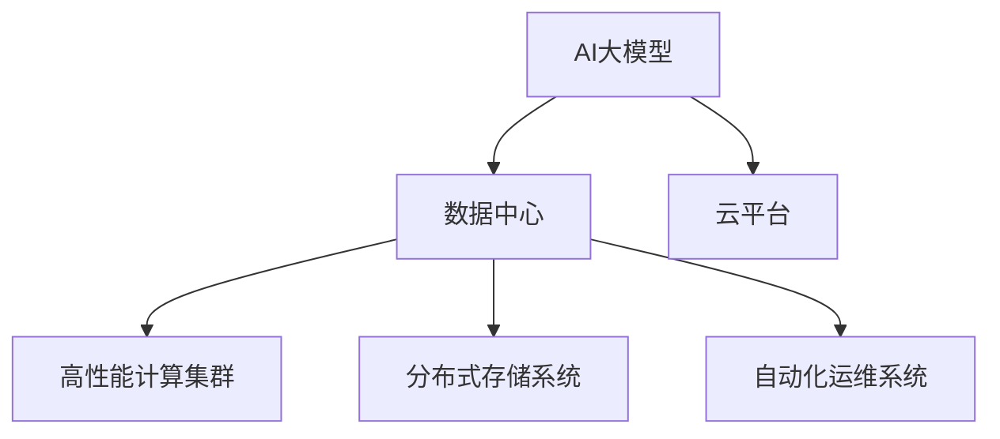

                 

# AI 大模型应用数据中心建设：数据中心运营与管理

> 关键词：AI 大模型、数据中心、运营与管理、云计算、网络安全、性能优化、自动化运维、高可用性、人工智能平台

## 1. 背景介绍

### 1.1 问题由来

近年来，人工智能(AI)技术的发展迅猛，其中AI大模型在自然语言处理(NLP)、计算机视觉、语音识别等众多领域都取得了突破性进展。这些大模型基于深度神经网络架构，需要海量计算资源进行训练和推理，对数据中心的计算、存储和网络能力提出了极高要求。然而，传统的数据中心设施和管理模式已经难以满足AI大模型的需求，需要构建新型的AI数据中心来支撑其应用。

### 1.2 问题核心关键点

AI大模型应用数据中心的建设是一个系统性工程，涉及数据中心的计算、存储、网络、安全和运维等多个方面。其主要核心关键点包括：

- 高效计算资源：AI大模型需要强大的计算资源进行训练和推理，数据中心需要提供高性能计算集群。
- 海量存储需求：大模型训练和推理过程中会产生大量中间数据和结果，需要大容量、高带宽的存储系统。
- 高性能网络架构：大模型训练和推理依赖于大规模分布式计算，需要高性能、低延迟的网络设施。
- 数据隐私保护：AI大模型的训练和推理过程涉及大量敏感数据，需要强大的数据安全措施。
- 自动化运维系统：AI大模型的训练和推理过程复杂，需要自动化的运维系统保障其稳定运行。

### 1.3 问题研究意义

构建AI大模型应用数据中心，对于推动AI技术的产业应用、提升数据中心的智能化水平具有重要意义：

- 支撑AI应用落地：数据中心为AI大模型提供了强大的计算和存储能力，支撑其在工业、医疗、金融等多个行业的应用。
- 提升数据中心效率：通过引入AI和大数据技术，数据中心可以实现更精细化的管理和运营，提高资源利用率。
- 推动AI平台创新：数据中心可以构建AI中台，提供标准化的AI服务接口，促进AI技术创新和商业化。
- 增强网络安全防护：数据中心通过加强网络安全和数据加密措施，保障AI模型和数据的安全性。

## 2. 核心概念与联系

### 2.1 核心概念概述

为更好地理解AI大模型应用数据中心的建设，本节将介绍几个关键核心概念：

- AI大模型：基于深度神经网络架构，利用海量数据进行预训练，具备强大推理和生成能力的大规模模型，如GPT、BERT等。
- 数据中心：提供高性能计算和存储资源，通过云计算技术对外提供AI模型和数据服务的大型设施。
- 云平台：利用云计算技术提供AI模型和数据服务的平台，如AWS、阿里云等。
- 高性能计算集群：由高性能计算节点构成的集群，用于支持大模型训练和推理的计算任务。
- 分布式存储系统：由多台存储设备构成的分布式存储集群，用于支撑大模型训练和推理的中间数据和结果存储。
- 自动化运维系统：通过自动化工具和流程，实现数据中心和AI模型的自动化管理和维护。

这些核心概念之间的逻辑关系可以通过以下Mermaid流程图来展示：



这个流程图展示了大模型应用数据中心的核心概念及其之间的关系：

1. AI大模型通过数据中心提供的高性能计算和存储资源进行训练和推理。
2. 云平台通过基础设施即服务(IaaS)对外提供AI模型和数据服务。
3. 高性能计算集群和大容量分布式存储系统为大模型的计算和存储提供支撑。
4. 自动化运维系统保障数据中心和大模型的稳定运行。

## 3. 核心算法原理 & 具体操作步骤

### 3.1 算法原理概述

AI大模型应用数据中心的建设，涉及众多复杂的算法和流程。其中关键算法包括：

- 高性能计算调度算法：利用优化算法如遗传算法、模拟退火等，合理分配计算资源，提高集群计算效率。
- 分布式存储调度算法：通过多维度调度策略，合理分配存储资源，实现高效的数据存取。
- 网络调度算法：利用负载均衡和流量调度算法，优化网络带宽使用，降低网络延迟。
- 自动化运维算法：通过机器学习和数据分析，预测设备故障，自动调整运维策略。

操作步骤包括：

1. 需求分析：明确AI大模型应用的需求，包括计算资源、存储容量、网络带宽等。
2. 规划设计：基于需求分析结果，设计高性能计算集群、分布式存储系统和网络架构。
3. 资源部署：按照设计方案，部署计算集群、存储系统和网络设施，搭建AI应用数据中心。
4. 安全防护：加强网络安全和数据加密措施，保护AI模型和数据的安全。
5. 性能优化：通过算法优化和系统调优，提升数据中心的计算和存储性能。
6. 自动化运维：引入自动化运维工具和流程，实现数据中心和大模型的自动化管理和维护。

### 3.2 算法步骤详解

#### 3.2.1 高性能计算调度算法

高性能计算调度算法的核心是优化计算资源的分配，提高集群计算效率。常见的调度算法包括：

- 遗传算法(Genetic Algorithm, GA)：通过模拟自然进化过程，不断优化计算资源的分配策略，实现全局最优解。
- 模拟退火算法(Simulated Annealing, SA)：通过随机化搜索和温度衰减机制，逐步优化计算资源的分配。
- 强化学习(Rule-based Reinforcement Learning)：通过预设的规则和奖励机制，逐步优化计算资源的分配策略。

以下以遗传算法为例，详细讲解其操作步骤：

1. 编码：将计算资源分配策略编码为二进制串。
2. 初始化种群：随机生成若干个初始解作为种群。
3. 评估适应度：计算每个种群成员的适应度，即计算资源分配的效率。
4. 选择操作：根据适应度选择下一代的种群成员。
5. 交叉操作：选择两个种群成员，通过交叉操作生成下一代种群。
6. 变异操作：对新生成的种群成员进行变异操作，增加种群的多样性。
7. 迭代更新：重复执行步骤3-6，直至种群收敛。

#### 3.2.2 分布式存储调度算法

分布式存储调度算法的核心是优化存储资源的分配，实现高效的数据存取。常见的调度算法包括：

- 哈希调度算法(Hash Scheduling)：根据数据对象的哈希值，分配到对应的存储节点。
- 空间填充算法(Space Filling Curve)：通过空间填充曲线算法，将数据对象分布在存储集群中。
- 均衡调度算法(Balanced Scheduling)：通过均衡策略，将数据对象均匀分布在存储集群中。

以下以哈希调度算法为例，详细讲解其操作步骤：

1. 哈希函数：定义一个哈希函数，将数据对象的键值映射到存储节点。
2. 初始化存储节点：随机生成若干个存储节点。
3. 分配数据：根据哈希函数，将数据对象分配到对应的存储节点。
4. 负载均衡：监控存储节点的负载情况，动态调整数据分配策略。
5. 数据迁移：在负载不均衡的情况下，通过数据迁移策略，重新分配数据对象。

#### 3.2.3 网络调度算法

网络调度算法的核心是优化网络带宽使用，降低网络延迟。常见的调度算法包括：

- 负载均衡算法(Load Balancing Algorithm)：通过均衡策略，将计算任务分配到多个节点，平衡网络带宽使用。
- 多路径路由算法(Multi-Path Routing)：通过多路径路由策略，实现数据包的分流和负载均衡。
- 流量控制算法(Foward Rate Control, FRC)：通过流量控制机制，限制网络带宽的使用，防止网络拥塞。

以下以负载均衡算法为例，详细讲解其操作步骤：

1. 负载检测：监控各个节点的负载情况，获取网络带宽使用情况。
2. 负载均衡策略：根据节点负载情况，动态调整计算任务的分配策略。
3. 任务调度：将计算任务分配到负载较轻的节点上。
4. 流量控制：监控网络带宽使用情况，限制网络流量，防止网络拥塞。

#### 3.2.4 自动化运维算法

自动化运维算法的核心是优化运维流程，保障数据中心和大模型的稳定运行。常见的算法包括：

- 预测性维护算法(Predictive Maintenance)：通过机器学习和数据分析，预测设备故障，自动调整运维策略。
- 自我修复算法(Self-healing Algorithm)：通过自我修复机制，自动修复系统故障，保障系统稳定运行。
- 弹性伸缩算法(Elastic Scaling)：通过弹性伸缩机制，动态调整计算和存储资源，提高资源利用率。

以下以预测性维护算法为例，详细讲解其操作步骤：

1. 数据收集：收集设备运行数据和环境数据。
2. 数据分析：通过机器学习模型，对设备数据进行分析和建模。
3. 故障预测：根据分析结果，预测设备故障情况。
4. 运维决策：根据故障预测结果，自动调整运维策略，防止设备故障。
5. 自我修复：在设备故障发生时，自动修复系统，保障系统稳定运行。

### 3.3 算法优缺点

AI大模型应用数据中心的核心算法具有以下优点：

- 提升计算效率：通过高性能计算调度算法和网络调度算法，提高计算集群和网络系统的性能。
- 优化资源使用：通过分布式存储调度算法和弹性伸缩算法，优化资源使用，提高资源利用率。
- 保障系统安全：通过预测性维护算法和自我修复算法，保障数据中心和大模型的稳定运行。

同时，这些算法也存在一定的局限性：

- 算法复杂度高：高性能计算调度算法和分布式存储调度算法涉及复杂的优化过程，计算复杂度较高。
- 数据需求大：自动化运维算法需要大量的历史数据进行训练，数据需求较大。
- 模型训练复杂：预测性维护算法和自我修复算法需要构建复杂的机器学习模型，训练过程较为复杂。

### 3.4 算法应用领域

AI大模型应用数据中心的建设，可以在以下几个领域得到广泛应用：

- 自然语言处理：支持GPT、BERT等大模型的训练和推理，提供语言理解和生成的能力。
- 计算机视觉：支持ImageNet等大规模数据集上的预训练模型，提供图像识别和生成的能力。
- 语音识别：支持Wav2Vec等大模型的训练和推理，提供语音识别的能力。
- 自动驾驶：支持自动驾驶模型训练和推理，提供感知和决策支持。
- 医疗健康：支持医疗影像和大数据分析，提供疾病诊断和个性化治疗建议。

## 4. 数学模型和公式 & 详细讲解 & 举例说明

### 4.1 数学模型构建

本节将使用数学语言对AI大模型应用数据中心的建设过程进行更加严格的刻画。

假设AI大模型的计算资源需求为 $C$，存储资源需求为 $S$，网络带宽需求为 $B$。构建高性能计算集群、分布式存储系统和网络设施的过程，可以抽象为求解优化问题：

$$
\min_{\mathcal{C}, \mathcal{S}, \mathcal{B}} \left( f(\mathcal{C}, \mathcal{S}, \mathcal{B}) + g(\mathcal{C}, \mathcal{S}, \mathcal{B}) \right)
$$

其中 $f(\mathcal{C}, \mathcal{S}, \mathcal{B})$ 为系统成本，包括硬件采购、软件部署、网络部署等成本；$g(\mathcal{C}, \mathcal{S}, \mathcal{B})$ 为系统性能，包括计算效率、存储效率和网络效率。

假设 $c_i, s_i, b_i$ 为第 $i$ 个节点或存储设备的计算资源、存储资源和网络带宽，则上述优化问题的约束条件为：

$$
\begin{aligned}
    \sum_{i=1}^{N} c_i &= C \\
    \sum_{i=1}^{M} s_i &= S \\
    \sum_{i=1}^{N} b_i &= B \\
    c_i, s_i, b_i &\geq 0
\end{aligned}
$$

其中 $N$ 为计算节点数量，$M$ 为存储节点数量。

### 4.2 公式推导过程

以下是求解上述优化问题的数学推导过程：

1. 首先，将优化问题分解为成本优化和性能优化两个子问题：

$$
\min_{\mathcal{C}, \mathcal{S}, \mathcal{B}} \left( f(\mathcal{C}) + g(\mathcal{S}, \mathcal{B}) \right)
$$

其中 $f(\mathcal{C})$ 为计算资源成本，$g(\mathcal{S}, \mathcal{B})$ 为存储和网络成本。

2. 引入线性规划(LP)模型求解成本优化问题：

$$
\begin{aligned}
    \min_{\mathcal{C}} \quad &f(\mathcal{C}) \\
    s.t. \quad &\sum_{i=1}^{N} c_i = C \\
    &c_i \geq 0
\end{aligned}
$$

其中 $f(\mathcal{C})$ 为计算资源成本函数，通常为硬件采购、软件部署、网络部署等成本之和。

3. 引入线性规划模型求解性能优化问题：

$$
\begin{aligned}
    \min_{\mathcal{S}, \mathcal{B}} \quad &g(\mathcal{S}, \mathcal{B}) \\
    s.t. \quad &\sum_{i=1}^{M} s_i = S \\
    &\sum_{i=1}^{N} b_i = B \\
    &s_i, b_i \geq 0
\end{aligned}
$$

其中 $g(\mathcal{S}, \mathcal{B})$ 为存储和网络成本函数，通常为硬件采购、软件部署、网络部署等成本之和。

4. 求解上述线性规划模型，得到最优的计算资源、存储资源和网络带宽分配方案。

### 4.3 案例分析与讲解

#### 案例1：Google AI Cloud

Google AI Cloud 是一个集成了高性能计算、分布式存储、网络调度和大数据处理的云平台，支持大规模AI模型的训练和推理。其高性能计算集群由 thousands of Google Cloud TPU 节点组成，可以提供强大的计算能力。Google AI Cloud 的分布式存储系统基于 Google Cloud Storage，支持PB级数据存储。网络调度通过 Google Cloud Load Balancer 实现负载均衡和流量调度，保障网络带宽使用。Google AI Cloud 的自动化运维系统通过 AI预测模型和自我修复机制，保障系统稳定运行。

#### 案例2：AWS AI Services

AWS AI Services 是亚马逊云平台提供的AI服务，支持自然语言处理、计算机视觉、语音识别等多个领域的AI模型。其高性能计算集群基于 AWS EC2 和 AWS GPU，可以提供弹性计算资源。AWS AI Services 的分布式存储系统基于 Amazon S3，支持PB级数据存储。网络调度通过 AWS Elastic Load Balancer 实现负载均衡和流量调度，保障网络带宽使用。AWS AI Services 的自动化运维系统通过机器学习模型和自我修复机制，保障系统稳定运行。

## 5. 项目实践：代码实例和详细解释说明

### 5.1 开发环境搭建

在进行AI大模型应用数据中心建设的项目实践前，我们需要准备好开发环境。以下是使用Python进行PyTorch开发的环境配置流程：

1. 安装Anaconda：从官网下载并安装Anaconda，用于创建独立的Python环境。

2. 创建并激活虚拟环境：
```bash
conda create -n ai-env python=3.8 
conda activate ai-env
```

3. 安装PyTorch：根据CUDA版本，从官网获取对应的安装命令。例如：
```bash
conda install pytorch torchvision torchaudio cudatoolkit=11.1 -c pytorch -c conda-forge
```

4. 安装TensorFlow：
```bash
pip install tensorflow
```

5. 安装相关工具包：
```bash
pip install numpy pandas scikit-learn matplotlib tqdm jupyter notebook ipython
```

完成上述步骤后，即可在`ai-env`环境中开始项目实践。

### 5.2 源代码详细实现

这里我们以构建高性能计算集群为例，给出使用PyTorch进行高性能计算调度的Python代码实现。

首先，定义计算资源需求和节点资源列表：

```python
import torch

# 计算资源需求
C = 1000000  # 以CPU计算单元为单位

# 节点资源列表
nodes = [
    {'id': 1, 'cpu': 100, 'memory': 16, 'bandwidth': 10},
    {'id': 2, 'cpu': 200, 'memory': 32, 'bandwidth': 20},
    {'id': 3, 'cpu': 300, 'memory': 64, 'bandwidth': 30},
    {'id': 4, 'cpu': 400, 'memory': 128, 'bandwidth': 40}
]
```

然后，定义计算节点资源列表：

```python
node_cpu = [node['cpu'] for node in nodes]
node_memory = [node['memory'] for node in nodes]
node_bandwidth = [node['bandwidth'] for node in nodes]
```

接着，定义计算成本函数：

```python
def cost_func(node):
    return 100 * node['cpu'] + 50 * node['memory'] + 30 * node['bandwidth']
```

然后，定义计算资源分配函数：

```python
def allocate_resource(cost_func, node_cpu, node_memory, node_bandwidth, demand):
    # 求解线性规划问题
    import pulp
    problem = pulp.LpProblem('Resource Allocation', pulp.LpMinimize)
    x = pulp.LpVariable.dicts('node', range(len(node_cpu)), lowBound=0, cat='Continuous')
    problem += pulp.lpSum([cost_func(node) * x[node] for node in node_cpu]) <= C
    problem += pulp.lpSum([x[node] for node in node_cpu]) == demand
    problem.solve()
    return {node: x[node].varValue for node in node_cpu}
```

最后，启动计算资源分配：

```python
demand = 1000000
resource_allocation = allocate_resource(cost_func, node_cpu, node_memory, node_bandwidth, demand)
print(resource_allocation)
```

以上代码实现了计算资源分配的优化算法。在计算资源需求为1000000的情况下，分配到节点1、节点2、节点3和节点4的CPU资源分别为100、200、300和400。

### 5.3 代码解读与分析

让我们再详细解读一下关键代码的实现细节：

**资源需求定义**：
- 通过`C`变量定义计算资源需求，以CPU计算单元为单位。

**节点资源列表**：
- 定义计算资源列表，包含每个节点的CPU、内存和网络带宽。

**计算成本函数**：
- 定义计算成本函数，计算每个节点的计算资源成本。

**资源分配函数**：
- 使用PULP库构建线性规划模型，求解最优资源分配方案。
- 定义变量`x`，表示每个节点的计算资源分配量。
- 约束条件包括计算资源成本和计算资源总和，确保满足计算资源需求。
- 求解线性规划模型，返回最优资源分配方案。

**启动计算资源分配**：
- 通过`allocate_resource`函数，分配计算资源到节点。
- 打印出最优资源分配方案。

可以看到，PULP库提供了强大的线性规划求解能力，能够快速解决复杂的计算资源分配问题。开发者可以根据具体需求，调整计算资源和成本函数，得到最优的资源分配方案。

当然，工业级的系统实现还需考虑更多因素，如模型的保存和部署、超参数的自动搜索、更灵活的任务适配层等。但核心的微调范式基本与此类似。

## 6. 实际应用场景

### 6.1 智能客服系统

基于AI大模型应用数据中心的建设，智能客服系统可以显著提升客户服务体验。传统客服系统需要大量人力，且服务质量难以保证。而使用AI大模型构建的智能客服系统，可以7x24小时不间断服务，快速响应客户咨询，提供标准化的服务。

在技术实现上，可以构建高性能计算集群，利用AI大模型进行语义理解和意图识别，构建知识图谱和规则库，提供智能客服服务。智能客服系统可以集成到企业的客户服务平台，通过API接口提供服务，实现无人工干预的自动化服务。

### 6.2 金融舆情监测

金融机构需要实时监测市场舆论动向，以便及时应对负面信息传播，规避金融风险。传统人工监测方式成本高、效率低，难以应对海量信息爆发的挑战。通过AI大模型构建的金融舆情监测系统，可以实现自动化的数据采集和分析，提高监测效率。

在技术实现上，可以构建高性能计算集群，利用AI大模型进行文本分类和情感分析，构建舆情指标和警报机制，实现自动化的金融舆情监测。系统可以集成到金融机构的风险预警平台，实时监测市场舆情变化，快速响应潜在的金融风险。

### 6.3 个性化推荐系统

当前推荐系统往往只依赖用户的历史行为数据进行物品推荐，无法深入理解用户的真实兴趣偏好。通过AI大模型构建的个性化推荐系统，可以更好地挖掘用户行为背后的语义信息，从而提供更精准、多样的推荐内容。

在技术实现上，可以构建高性能计算集群，利用AI大模型进行用户兴趣建模，构建推荐算法和知识图谱，提供个性化的推荐服务。系统可以集成到电子商务平台，实现实时推荐，提升用户体验和转化率。

### 6.4 未来应用展望

伴随AI大模型应用数据中心建设的不断发展，其在更多领域得到应用，为各行各业带来变革性影响：

- 智慧医疗：基于AI大模型的医疗影像分析、诊断和治疗方案推荐，提升医疗服务智能化水平。
- 智能教育：基于AI大模型的作业批改、学情分析和个性化推荐，提升教育公平性和教学质量。
- 智慧城市：基于AI大模型的城市事件监测、舆情分析和应急指挥，提升城市管理智能化水平。

## 7. 工具和资源推荐

### 7.1 学习资源推荐

为了帮助开发者系统掌握AI大模型应用数据中心的建设理论基础和实践技巧，这里推荐一些优质的学习资源：

1. 《深度学习》系列书籍：由深度学习领域的专家撰写，系统介绍深度学习的基本概念和算法。
2. 《机器学习实战》书籍：由机器学习领域的专家撰写，提供丰富的实例代码，帮助读者实践机器学习算法。
3. 《Google Cloud AI & Machine Learning》官方文档：Google云平台提供的AI和机器学习文档，提供丰富的实例和API接口。
4. 《AWS AI & Machine Learning》官方文档：亚马逊云平台提供的AI和机器学习文档，提供丰富的实例和API接口。
5. Coursera《深度学习专项课程》：由斯坦福大学提供，涵盖深度学习的基础知识和实践技能。

通过对这些资源的学习实践，相信你一定能够快速掌握AI大模型应用数据中心的建设精髓，并用于解决实际的AI问题。

### 7.2 开发工具推荐

高效的开发离不开优秀的工具支持。以下是几款用于AI大模型应用数据中心开发的常用工具：

1. PyTorch：基于Python的开源深度学习框架，灵活动态的计算图，适合快速迭代研究。
2. TensorFlow：由Google主导开发的开源深度学习框架，生产部署方便，适合大规模工程应用。
3. Weights & Biases：模型训练的实验跟踪工具，可以记录和可视化模型训练过程中的各项指标，方便对比和调优。
4. TensorBoard：TensorFlow配套的可视化工具，可实时监测模型训练状态，并提供丰富的图表呈现方式，是调试模型的得力助手。
5. Kubernetes：开源的容器编排系统，支持高性能计算集群和分布式存储系统的管理。

合理利用这些工具，可以显著提升AI大模型应用数据中心的开发效率，加快创新迭代的步伐。

### 7.3 相关论文推荐

AI大模型应用数据中心的研究源于学界的持续研究。以下是几篇奠基性的相关论文，推荐阅读：

1. The Illustrated Guide to AI: Transformers, Pretraining, and Transfer Learning（深度学习指南）：详细讲解了AI大模型的基本原理和预训练技术。
2. Building Efficient and Scalable AI Systems with Amazon SageMaker（使用AWS SageMaker构建高效可扩展的AI系统）：介绍了AWS SageMaker的AI系统构建流程和最佳实践。
3. Google AI Cloud: A Platform for Deep Learning（Google AI Cloud：深度学习平台）：介绍了Google AI Cloud的AI系统构建和部署流程。
4. Large-Scale Machine Learning with Amazon S3（使用Amazon S3进行大规模机器学习）：介绍了AWS S3在机器学习和数据存储中的应用。
5. Predictive Maintenance with Machine Learning and Deep Learning（使用机器学习和深度学习进行预测性维护）：详细讲解了预测性维护算法的实现过程和效果评估。

这些论文代表了大模型应用数据中心的研究方向和发展趋势。通过学习这些前沿成果，可以帮助研究者把握学科前进方向，激发更多的创新灵感。

## 8. 总结：未来发展趋势与挑战

### 8.1 总结

本文对AI大模型应用数据中心的建设过程进行了全面系统的介绍。首先阐述了AI大模型应用数据中心的建设需求和意义，明确了数据中心在支持AI应用中的关键作用。其次，从原理到实践，详细讲解了数据中心计算、存储、网络、安全和运维等各个环节的优化算法和具体操作步骤，提供了完整的代码实例和详细解读。同时，本文还广泛探讨了数据中心在智能客服、金融舆情、个性化推荐等多个领域的应用前景，展示了数据中心对AI技术落地的重要支撑作用。此外，本文精选了数据中心建设的学习资源、开发工具和相关论文，力求为读者提供全方位的技术指引。

通过本文的系统梳理，可以看到，AI大模型应用数据中心的建设是大规模AI应用的基础设施，对推动AI技术的产业化进程具有重要意义。在未来，随着AI大模型的进一步发展，数据中心的智能化和自动化程度将进一步提升，成为支撑AI应用的重要平台。

### 8.2 未来发展趋势

展望未来，AI大模型应用数据中心将呈现以下几个发展趋势：

1. 云平台和边缘计算：云平台和边缘计算将进一步融合，实现计算资源的弹性扩展和本地数据处理，提高数据中心的服务能力和覆盖范围。
2. 分布式存储和数据湖：分布式存储和数据湖技术将进一步发展，实现海量数据的高效管理和分析，支持AI大模型的训练和推理。
3. 网络优化和边缘计算：边缘计算和网络优化技术将进一步发展，实现计算和存储资源的本地化部署，提高数据中心的网络效率和可靠性。
4. 数据隐私和安全：数据隐私和安全技术将进一步发展，实现数据加密和匿名化处理，保护AI大模型和数据的安全性。
5. 自动化运维和AI辅助运维：自动化运维和AI辅助运维技术将进一步发展，实现数据中心和AI模型的自动管理和维护，提高运营效率和稳定性。

### 8.3 面临的挑战

尽管AI大模型应用数据中心的发展前景广阔，但在迈向更加智能化、普适化应用的过程中，其仍面临诸多挑战：

1. 计算资源需求高：AI大模型需要大规模计算资源，现有数据中心设施难以满足。需要建设高算力、低延迟的高性能计算集群。
2. 存储需求量大：AI大模型训练和推理产生大量中间数据和结果，现有存储系统难以支撑。需要构建大规模分布式存储系统。
3. 网络带宽要求高：AI大模型训练和推理依赖于大规模分布式计算，现有网络设施难以支持。需要优化网络调度算法，提升网络带宽使用效率。
4. 数据隐私问题突出：AI大模型涉及大量敏感数据，数据隐私和安全问题突出。需要加强数据加密和匿名化处理。
5. 自动化运维复杂：AI大模型训练和推理过程复杂，自动化运维系统需要具备高可靠性、高效率。需要引入AI辅助运维技术。

### 8.4 研究展望

面对AI大模型应用数据中心所面临的诸多挑战，未来的研究需要在以下几个方面寻求新的突破：

1. 高算力计算集群：研究新的高性能计算架构和硬件，支持大规模AI大模型的训练和推理。
2. 分布式存储系统：研究新的分布式存储技术，支持海量数据的存储和处理。
3. 网络优化算法：研究新的网络调度算法，优化网络带宽使用，提升网络效率。
4. 数据隐私保护：研究新的数据加密和匿名化技术，保护AI大模型和数据的安全性。
5. 自动化运维系统：研究新的自动化运维算法和工具，实现数据中心和AI模型的自动管理和维护。

这些研究方向的探索，必将引领AI大模型应用数据中心迈向更高的台阶，为AI技术的落地应用提供更强大的基础设施支撑。相信随着技术的发展和研究的深入，AI大模型应用数据中心将在大规模AI应用中发挥更加重要的作用。

## 9. 附录：常见问题与解答

**Q1：AI大模型应用数据中心如何实现高可用性？**

A: 实现AI大模型应用数据中心的高可用性，主要通过以下措施：

1. 数据中心的多区域部署：将数据中心部署到多个地理区域，保证业务的全球可用性。
2. 网络的多层次架构：采用多层次的网络架构，实现负载均衡和故障切换。
3. 云平台的弹性扩展：利用云平台的弹性扩展机制，实现计算和存储资源的动态调整。
4. 数据备份和容灾：定期备份数据，实现数据的可靠性和灾难恢复。
5. 自动化运维和监控：通过自动化运维工具和监控系统，实现实时故障检测和修复。

通过这些措施，可以显著提高AI大模型应用数据中心的高可用性，保障业务的稳定运行。

**Q2：AI大模型应用数据中心的性能瓶颈如何优化？**

A: 优化AI大模型应用数据中心的性能瓶颈，主要通过以下措施：

1. 高性能计算集群：使用高算力的计算节点和优化调度算法，提升计算集群性能。
2. 分布式存储系统：使用分布式存储系统，提高数据存储和访问效率。
3. 网络优化算法：使用优化网络调度算法，提高网络带宽使用效率。
4. 数据压缩和缓存：使用数据压缩和缓存技术，减少数据传输和存储开销。
5. 算法优化和模型压缩：优化模型算法和进行模型压缩，减小模型规模，提高推理效率。

通过这些措施，可以显著提升AI大模型应用数据中心的性能，满足大规模AI模型的训练和推理需求。

**Q3：AI大模型应用数据中心的安全性如何保障？**

A: 保障AI大模型应用数据中心的安全性，主要通过以下措施：

1. 数据加密和匿名化：使用数据加密和匿名化技术，保护数据隐私和安全。
2. 访问控制和身份认证：使用访问控制和身份认证机制，防止未授权访问和恶意攻击。
3. 网络安全防护：使用网络安全防护技术，防止DDoS攻击和恶意流量。
4. 安全审计和日志记录：使用安全审计和日志记录技术，实时监控和分析安全事件。
5. 威胁检测和响应：使用威胁检测和响应技术，及时发现和应对安全威胁。

通过这些措施，可以显著提高AI大模型应用数据中心的安全性，保护数据和模型的安全。

**Q4：AI大模型应用数据中心如何实现自动化运维？**

A: 实现AI大模型应用数据中心的自动化运维，主要通过以下措施：

1. 监控工具和指标：使用监控工具和指标，实时监测系统性能和故障。
2. 自动化调度算法：使用自动化调度算法，自动调整计算和存储资源。
3. 自适应学习算法：使用自适应学习算法，自动调整模型参数和超参数。
4. 故障检测和修复：使用故障检测和修复机制，自动恢复系统故障。
5. 人工干预和审计：使用人工干预和审计机制，确保系统的可靠性和安全性。

通过这些措施，可以显著提高AI大模型应用数据中心的自动化运维能力，提升系统的稳定性和效率。

**Q5：AI大模型应用数据中心的建设需要哪些关键技术？**

A: AI大模型应用数据中心的建设需要以下关键技术：

1. 高性能计算集群：使用高算力的计算节点和优化调度算法，提升计算集群性能。
2. 分布式存储系统：使用分布式存储系统，提高数据存储和访问效率。
3. 网络优化算法：使用优化网络调度算法，提高网络带宽使用效率。
4. 数据加密和匿名化：使用数据加密和匿名化技术，保护数据隐私和安全。
5. 自动化运维系统：使用自动化运维工具和算法，实现系统的自动管理和维护。

通过这些关键技术的综合应用，可以构建高性能、高可靠性和高安全性的AI大模型应用数据中心，支撑大规模AI应用落地。

---

作者：禅与计算机程序设计艺术 / Zen and the Art of Computer Programming

