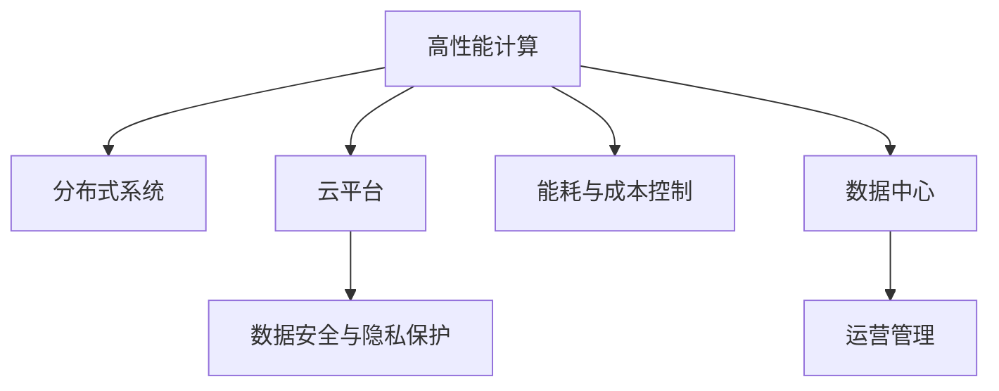

                 

# AI 大模型应用数据中心建设：数据中心运营与管理

> 关键词：AI大模型，数据中心，运营管理，高性能计算，分布式系统，云平台，数据安全

## 1. 背景介绍

### 1.1 问题由来

在人工智能（AI）领域，大模型（Large Models）的出现显著提升了AI模型的性能，但同时也对数据中心的计算能力和资源需求提出了更高的要求。为了支持大模型的高效训练和推理，数据中心必须进行重新设计和优化，以满足高性能计算（HPC）的需求。同时，数据中心的运营和管理也面临着新的挑战，如数据安全、能耗优化、成本控制等。因此，本文旨在探讨如何建设和管理一个高效、安全、经济的数据中心，以支撑大模型在实际应用中的运行。

### 1.2 问题核心关键点

大模型训练和推理对数据中心提出了高要求，数据中心的运营与管理也面临着新的挑战。本节将从以下几个关键点入手：

- **高性能计算需求**：大模型训练和推理需要巨大的计算能力，数据中心必须具备高性能计算集群。
- **分布式系统架构**：大模型训练和推理通常需要分布在多个节点上进行，数据中心需要设计合理的分布式系统架构。
- **云平台集成**：将大模型部署到云平台，可以大幅降低数据中心的运营成本，并提供更大的灵活性。
- **数据安全与隐私保护**：在数据中心处理和存储大模型时，必须考虑数据安全与隐私保护的问题。
- **能耗与成本控制**：高性能计算能耗巨大，数据中心必须采取有效措施控制能耗和成本。

## 2. 核心概念与联系

### 2.1 核心概念概述

为更好地理解数据中心在大模型应用中的角色和作用，本节将介绍几个密切相关的核心概念：

- **高性能计算（HPC）**：指在科学计算、工程计算等领域，需要高效利用计算资源进行大数据量和高精度计算的任务。
- **分布式系统**：指由多个计算节点组成的系统，各节点间通过网络通信实现协同工作，以提供更高的计算能力和处理能力。
- **云平台**：指通过互联网提供计算资源和服务的平台，用户按需使用，具有高度的灵活性和扩展性。
- **数据安全与隐私保护**：指在数据处理和存储过程中，保护数据的完整性、机密性和可用性，防止数据泄露和滥用。
- **能耗与成本控制**：指在数据中心运行中，采取有效措施降低能耗，并合理控制成本。

这些核心概念之间的逻辑关系可以通过以下Mermaid流程图来展示：



这个流程图展示了大模型应用中的核心概念及其之间的关系：

1. 高性能计算是基础，数据中心必须具备强大的计算能力。
2. 分布式系统架构支持大规模并行计算，优化资源利用率。
3. 云平台提供了按需计算服务，降低了数据中心运营成本。
4. 数据安全与隐私保护是数据中心运营管理的核心部分。
5. 能耗与成本控制是大模型应用中需要重点考虑的问题。

## 3. 核心算法原理 & 具体操作步骤

### 3.1 算法原理概述

大模型训练和推理的高性能需求推动了数据中心架构的演进。数据中心的运营与管理需要基于分布式系统和云平台的设计，同时确保数据安全与隐私保护，控制能耗和成本。

### 3.2 算法步骤详解

**Step 1: 设计高性能计算集群**

1. **硬件选择**：选择高性能的CPU/GPU、内存和存储设备，构建高性能计算集群。
2. **网络设计**：设计高速、低延迟、高可靠性的网络架构，支持大规模数据传输。
3. **集群管理**：采用分布式系统管理工具，如Kubernetes、Apache Mesos等，实现集群资源调度和任务调度。

**Step 2: 部署分布式系统**

1. **节点部署**：将计算节点分布在不同物理位置，建立多数据中心的分布式计算环境。
2. **负载均衡**：采用负载均衡技术，合理分配任务到各个节点，提高资源利用率。
3. **容错设计**：设计容错机制，如冗余存储、数据备份等，确保系统可靠性。

**Step 3: 集成云平台**

1. **云平台选择**：选择适合的云平台，如AWS、Google Cloud、阿里云等，提供弹性计算和存储资源。
2. **服务集成**：将数据中心计算资源集成到云平台，提供按需使用。
3. **API管理**：开发API接口，支持云平台与数据中心之间的数据交互和任务调度。

**Step 4: 数据安全与隐私保护**

1. **数据加密**：对数据进行加密存储和传输，防止数据泄露。
2. **访问控制**：采用基于角色的访问控制（RBAC）策略，限制数据访问权限。
3. **审计与监控**：使用日志记录和监控工具，实时监控数据访问行为，检测潜在安全威胁。

**Step 5: 能耗与成本控制**

1. **能效管理**：采用能效管理策略，如动态调频、智能散热等，提高系统能效。
2. **成本控制**：优化资源分配和调度，减少计算资源的浪费，降低运营成本。
3. **节能措施**：采用节能技术，如节能服务器、绿色数据中心设计等，降低能耗。

### 3.3 算法优缺点

大模型应用数据中心建设与管理具有以下优点：

1. **高性能支持**：高性能计算集群和分布式系统架构，提供了强大的计算能力，支持大模型的高效训练和推理。
2. **灵活性**：云平台的按需计算服务，降低了数据中心的运营成本，提供了更高的灵活性和扩展性。
3. **数据安全**：通过数据加密、访问控制、审计与监控等措施，保护数据的安全与隐私。
4. **能耗控制**：采用能效管理和节能技术，降低了数据中心的能耗和运营成本。

同时，这些方法也存在一些局限性：

1. **硬件成本高**：高性能计算集群和分布式系统需要高性能硬件设备，硬件成本较高。
2. **系统复杂性**：分布式系统和管理工具的复杂性，增加了系统的维护和管理难度。
3. **云平台依赖**：数据中心过度依赖云平台，可能会带来一些安全和服务中断的风险。
4. **能效管理挑战**：能效管理需要复杂的算法和控制策略，实施难度较大。

尽管存在这些局限性，但就目前而言，基于高性能计算、分布式系统、云平台的数据中心架构，仍然是支撑大模型应用的最主流方案。未来相关研究的重点在于如何进一步降低硬件成本、简化系统管理、提高能效管理效率等。

### 3.4 算法应用领域

大模型应用数据中心建设与管理在多个领域得到了广泛应用，例如：

- **科学研究**：在大数据科学、气象预测、药物研发等领域，大模型需要高效的计算资源进行训练和推理。
- **企业应用**：在金融、保险、零售等行业，大模型用于风险评估、客户分析、个性化推荐等。
- **医疗健康**：在大数据医疗、精准医疗等领域，大模型用于疾病诊断、基因分析、医疗影像分析等。
- **智能制造**：在大数据制造、智能控制等领域，大模型用于产品设计、质量控制、流程优化等。
- **公共安全**：在大数据分析、视频监控等领域，大模型用于犯罪预测、视频分析、交通管理等。

除了上述这些领域，大模型在智慧城市、智能交通、教育培训等多个领域都有广泛应用，为各行各业带来了新的发展机遇。

## 4. 数学模型和公式 & 详细讲解 & 举例说明

### 4.1 数学模型构建

本节将使用数学语言对高性能计算集群、分布式系统、数据安全和能耗管理等核心概念进行更加严格的刻画。

记大模型训练和推理任务为$T$，计算集群为$C$，数据集为$D$。定义任务$T$的损失函数为$\ell(T)$，表示模型训练过程中的误差。计算集群$C$的性能指标为$P(C)$，表示集群提供计算能力的大小。数据集$D$的安全度为$S(D)$，表示数据集的安全性和隐私性。能耗成本为$E(C)$，表示集群运行过程中消耗的能源成本。

定义数据中心$D$的总体性能指标$I(D)$，包含计算性能、数据安全、能耗控制等多个方面：

$$
I(D) = P(C) - \lambda \ell(T) - \gamma S(D) - \delta E(C)
$$

其中$\lambda$、$\gamma$、$\delta$为权重系数，分别表示计算性能、数据安全、能耗控制的优先级。

### 4.2 公式推导过程

以下我们以分布式系统为例，推导负载均衡算法的数学模型。

假设分布式系统中有$n$个计算节点，每个节点的计算能力为$P_i$，任务$T$需要计算资源$R_T$。定义节点$i$的负载$L_i$，表示节点$i$当前的计算负荷：

$$
L_i = \sum_{t \in T} R_t
$$

负载均衡的目标是最大化系统性能$P(C)$，同时最小化能耗$E(C)$。可以构建目标函数：

$$
\maximize P(C) - \lambda E(C)
$$

约束条件为每个节点的负载不超过其计算能力：

$$
L_i \leq P_i, \quad \forall i \in \{1,2,\dots,n\}
$$

将问题转化为最优化问题，求解最优的计算资源分配。可以引入拉格朗日乘子$\mu$，定义拉格朗日函数：

$$
\mathcal{L}(\mu) = P(C) - \lambda E(C) + \mu \left( \sum_{i=1}^n L_i - \sum_{i=1}^n P_i \right)
$$

对每个节点的负载进行优化，得到最优的计算资源分配方案。

### 4.3 案例分析与讲解

**案例1: 高性能计算集群设计**

某科技公司需要设计一个高性能计算集群，用于训练深度学习模型。根据需求，集群需要支持8个CPU和4个GPU，每个节点的内存为128GB，存储为2TB SSD。网络带宽为100Gbps，每个节点之间的网络延迟为1ms。

1. **硬件选择**：选择高性能的CPU/GPU、内存和存储设备，构建高性能计算集群。
2. **网络设计**：设计高速、低延迟、高可靠性的网络架构，支持大规模数据传输。
3. **集群管理**：采用分布式系统管理工具，如Kubernetes、Apache Mesos等，实现集群资源调度和任务调度。

**案例2: 数据安全与隐私保护**

某金融公司需要在大数据金融风控项目中使用深度学习模型。根据需求，数据中心必须采用严格的数据安全与隐私保护措施，确保数据的安全和隐私。

1. **数据加密**：对数据进行加密存储和传输，防止数据泄露。
2. **访问控制**：采用基于角色的访问控制（RBAC）策略，限制数据访问权限。
3. **审计与监控**：使用日志记录和监控工具，实时监控数据访问行为，检测潜在安全威胁。

## 5. 项目实践：代码实例和详细解释说明

### 5.1 开发环境搭建

在进行大模型应用数据中心建设实践前，我们需要准备好开发环境。以下是使用Python进行高性能计算集群构建的环境配置流程：

1. 安装Anaconda：从官网下载并安装Anaconda，用于创建独立的Python环境。

2. 创建并激活虚拟环境：
```bash
conda create -n hpc-env python=3.8 
conda activate hpc-env
```

3. 安装Python科学计算库：
```bash
conda install numpy scipy pandas scikit-learn
```

4. 安装分布式系统管理工具：
```bash
pip install kubernetes apache-mesos
```

5. 安装数据安全与隐私保护工具：
```bash
pip install pyaes cryptography
```

完成上述步骤后，即可在`hpc-env`环境中开始高性能计算集群构建实践。

### 5.2 源代码详细实现

下面我们以高性能计算集群构建为例，给出使用Kubernetes进行集群部署的PyTorch代码实现。

首先，定义集群节点配置：

```python
from kubernetes import client, config

# 设置集群配置
cluster_name = "my-cluster"
nodes = 8
cpu_per_node = 2
gpu_per_node = 1
mem_per_node = 128
storage_per_node = 2

# 创建集群
kube_config = config.load_kube_config()
kube_client = client.CoreV1Api(api_client=kube_config)
api_server = config.API_HOST

# 创建节点
for i in range(nodes):
    node_name = f"node-{i}"
    node_config = client.V1NodeSpec(
        affinity=client.V1Affinity(
            node_selector_terms=[client.V1NodeSelectorTerm(key="hello", operator="Equal", values=[node_name])]
        ),
        cpu_request=client.V1ResourceRequirements(cpu=str(cpu_per_node) + "/2"),
        cpu_limit=client.V1ResourceRequirements(cpu=str(cpu_per_node) + "/2"),
        memory_request=client.V1ResourceRequirements(memory=str(mem_per_node) + "/1G"),
        memory_limit=client.V1ResourceRequirements(memory=str(mem_per_node) + "/1G"),
        extra_devices=[
            client.V1Device(
                name=f"/gpu-{i}",
                device_kind="NVIDIA-GPU",
                device_path="/dev/nvidia-{i}",
            )
        ],
        node_selector=f"{api_server}/designed/{cluster_name}/{node_name}"
    )
    node = client.V1Node(
        metadata=client.V1ObjectMeta(
            name=node_name,
            labels={
                "hello": "world"
            },
            spec=node_config
        )
    )
    kube_client.create_node(body=node)
```

然后，定义任务调度：

```python
from kubernetes import client

# 定义任务
job_name = "my-job"
job_config = client.BatchV1Job(
    api_version="batch/v1",
    metadata=client.V1ObjectMeta(
        name=job_name,
        labels={
            "hello": "world"
        },
        spec=client.BatchV1JobSpec(
            completions=1,
            template=client.V1PodTemplateSpec(
                metadata=client.V1ObjectMeta(
                    labels={
                        "hello": "world"
                    },
                    spec=client.V1PodSpec(
                        containers=[
                            client.V1Container(
                                name="my-container",
                                image="my-image",
                                resources=client.V1ResourceRequirements(
                                    cpu="1.5",
                                    memory="4G",
                                    requests=client.V1ResourceRequirements(
                                        cpu="1",
                                        memory="2G"
                                    ),
                                    limits=client.V1ResourceRequirements(
                                        cpu="1.5",
                                        memory="4G"
                                    ),
                                    extra_devices=[
                                        client.V1Device(
                                            name="/gpu-0",
                                            device_kind="NVIDIA-GPU",
                                            device_path="/dev/nvidia-0"
                                        )
                                    ]
                                ),
                                args=[
                                    "python",
                                    "train.py",
                                    "--data_path=/path/to/data",
                                    "--model_path=/path/to/model"
                                ]
                            )
                        ],
                        node_selector=f"{api_server}/designed/{cluster_name}/node-0"
                    )
                ]
            )
        )
    )
)

# 创建任务
kube_client.create_job(body=job_config)
```

最后，启动任务调度：

```python
# 启动任务调度
job = kube_client.read_namespaced_job(job_name, "default")
while job.status.state == "Pending":
    job = kube_client.read_namespaced_job(job_name, "default")
    print("Job status:", job.status.state)
    time.sleep(5)
```

以上就是使用Kubernetes进行高性能计算集群构建的完整代码实现。可以看到，Kubernetes提供了强大的资源管理能力，可以方便地部署和管理计算集群。

### 5.3 代码解读与分析

让我们再详细解读一下关键代码的实现细节：

**cluster_name、nodes、cpu_per_node、gpu_per_node、mem_per_node、storage_per_node**：
- 定义集群名称、节点数、每个节点的CPU、GPU、内存和存储配置。

**kube_config、kube_client**：
- 加载Kubernetes配置文件，创建API客户端。

**node_config**：
- 定义节点配置，包括CPU、GPU、内存、存储、节点选择器等。

**node、job_config、job**：
- 定义节点和任务配置，包括容器配置、资源需求、节点选择器等。

**kube_client.create_node(body=node)**：
- 创建节点。

**job_config.create_job(body=job_config)**：
- 创建任务。

**job = kube_client.read_namespaced_job(job_name, "default")**：
- 读取任务状态。

**time.sleep(5)**：
- 等待任务调度完成。

Kubernetes通过API Server、Controller Manager、Scheduler等组件实现了强大的资源管理功能。开发者只需通过API客户端调用相关接口，即可完成节点的创建、任务的调度和管理。

## 6. 实际应用场景

### 6.1 智能制造

智能制造是大模型应用的一个重要领域。在智能制造中，大模型用于产品设计、质量控制、流程优化等。数据中心通过高性能计算集群和分布式系统，提供了强大的计算资源支持，使得大模型能够高效地进行训练和推理，提升制造效率和质量。

**案例：某智能制造企业**

某智能制造企业需要构建一个高效的数据中心，用于支持智能制造应用。根据需求，数据中心需要支持8个CPU、4个GPU、128GB内存和2TB SSD存储，网络带宽为100Gbps。

1. **硬件选择**：选择高性能的CPU/GPU、内存和存储设备，构建高性能计算集群。
2. **网络设计**：设计高速、低延迟、高可靠性的网络架构，支持大规模数据传输。
3. **集群管理**：采用Kubernetes等分布式系统管理工具，实现集群资源调度和任务调度。

### 6.2 医疗健康

医疗健康是大模型应用的另一个重要领域。在大数据医疗、精准医疗等领域，大模型用于疾病诊断、基因分析、医疗影像分析等。数据中心通过高性能计算集群和数据安全与隐私保护措施，保障了数据的安全和隐私。

**案例：某医疗健康公司**

某医疗健康公司需要构建一个高效的数据中心，用于支持大数据医疗应用。根据需求，数据中心需要支持8个CPU、4个GPU、128GB内存和2TB SSD存储，网络带宽为100Gbps。

1. **硬件选择**：选择高性能的CPU/GPU、内存和存储设备，构建高性能计算集群。
2. **数据安全**：采用数据加密、访问控制、审计与监控等措施，保障数据的安全和隐私。
3. **集群管理**：采用Kubernetes等分布式系统管理工具，实现集群资源调度和任务调度。

### 6.3 智能交通

智能交通是大模型应用的另一个重要领域。在大数据分析、交通管理等领域，大模型用于交通流量预测、智能调度、交通控制等。数据中心通过高性能计算集群和数据安全与隐私保护措施，保障了数据的安全和隐私。

**案例：某智能交通公司**

某智能交通公司需要构建一个高效的数据中心，用于支持智能交通应用。根据需求，数据中心需要支持8个CPU、4个GPU、128GB内存和2TB SSD存储，网络带宽为100Gbps。

1. **硬件选择**：选择高性能的CPU/GPU、内存和存储设备，构建高性能计算集群。
2. **数据安全**：采用数据加密、访问控制、审计与监控等措施，保障数据的安全和隐私。
3. **集群管理**：采用Kubernetes等分布式系统管理工具，实现集群资源调度和任务调度。

## 7. 工具和资源推荐

### 7.1 学习资源推荐

为了帮助开发者系统掌握大模型应用数据中心建设的理论基础和实践技巧，这里推荐一些优质的学习资源：

1. **Kubernetes官方文档**：Kubernetes官网提供详细的官方文档，包括安装、配置、使用等各个方面的内容。
2. **HPC原理与实践**：《高性能计算原理与实践》一书，详细介绍了高性能计算集群的设计与优化。
3. **数据安全与隐私保护**：《数据安全与隐私保护》一书，介绍了数据加密、访问控制、审计与监控等技术。
4. **云计算技术**：《云计算技术》一书，介绍了云平台的设计与优化。
5. **分布式系统设计**：《分布式系统设计》一书，介绍了分布式系统的设计原则和实践方法。

通过对这些资源的学习实践，相信你一定能够快速掌握大模型应用数据中心建设的技巧，并用于解决实际的NLP问题。

### 7.2 开发工具推荐

高效的开发离不开优秀的工具支持。以下是几款用于大模型应用数据中心建设开发的常用工具：

1. **Kubernetes**：谷歌开源的分布式系统管理工具，支持容器编排、任务调度、服务发现等功能。
2. **Apache Mesos**：Apache基金会开发的分布式系统管理工具，支持资源调度、任务管理等功能。
3. **AWS**：亚马逊云平台，提供了弹性计算和存储服务，支持大模型应用数据中心的构建和管理。
4. **Google Cloud**：谷歌云平台，提供了弹性计算和存储服务，支持大模型应用数据中心的构建和管理。
5. **阿里云**：阿里巴巴云平台，提供了弹性计算和存储服务，支持大模型应用数据中心的构建和管理。

合理利用这些工具，可以显著提升大模型应用数据中心建设的效率，加快创新迭代的步伐。

### 7.3 相关论文推荐

大模型应用数据中心建设的研究源于学界的持续研究。以下是几篇奠基性的相关论文，推荐阅读：

1. **《分布式系统设计原则》**：Andrew S. Tanenbaum等，介绍了分布式系统的设计原则和实践方法。
2. **《高性能计算集群设计》**：John H. Lian等，介绍了高性能计算集群的设计与优化方法。
3. **《数据加密与隐私保护》**：Bruce Schneier，介绍了数据加密和隐私保护的技术和方法。
4. **《云计算技术架构》**：Donnattempt Whisenant等，介绍了云计算技术的设计与优化方法。
5. **《大模型应用数据中心架构》**：Jianhui Cui等，介绍了大模型应用数据中心的架构设计。

这些论文代表了大模型应用数据中心建设的研究方向，通过学习这些前沿成果，可以帮助研究者把握学科前进方向，激发更多的创新灵感。

## 8. 总结：未来发展趋势与挑战

### 8.1 总结

本文对大模型应用数据中心建设与管理进行了全面系统的介绍。首先阐述了大模型训练和推理对数据中心的高性能需求，明确了数据中心必须具备分布式系统和云平台架构的核心要求。其次，从原理到实践，详细讲解了高性能计算集群、分布式系统、数据安全和能耗管理等核心概念，给出了具体的代码实现。同时，本文还探讨了高性能计算集群和数据中心在科学研究、企业应用、医疗健康、智能交通等领域的广泛应用。

通过本文的系统梳理，可以看到，高性能计算集群和分布式系统架构是支撑大模型应用的核心保障，云平台提供了弹性和灵活性，数据安全与隐私保护和能耗管理是大模型应用中必须重点考虑的问题。未来，随着大模型应用的不断深入，高性能计算集群和分布式系统架构将进一步优化，云平台和数据中心融合将更加紧密，数据安全与隐私保护和能耗管理技术也将不断创新，推动大模型应用在更多领域的应用和发展。

### 8.2 未来发展趋势

展望未来，大模型应用数据中心建设与管理将呈现以下几个发展趋势：

1. **硬件升级**：随着算力成本的下降和数据规模的扩张，高性能计算集群和分布式系统的硬件设施将不断升级，支持更多、更强的大模型应用。
2. **云平台集成**：云平台和大模型应用数据中心的融合将更加紧密，云平台提供的弹性和灵活性将进一步提升大模型应用的性能和可靠性。
3. **数据安全**：数据加密、访问控制、审计与监控等技术将进一步提升，保障数据的安全和隐私。
4. **能效管理**：能效管理策略和节能技术将不断创新，降低数据中心的能耗和运营成本。
5. **分布式系统优化**：分布式系统的设计和优化将更加深入，提高资源利用率和系统稳定性。

这些趋势凸显了大模型应用数据中心建设与管理的广阔前景。这些方向的探索发展，必将进一步提升大模型应用的效果和应用范围，为各行各业带来新的发展机遇。

### 8.3 面临的挑战

尽管大模型应用数据中心建设与管理技术已经取得了一定的进展，但在迈向更加智能化、普适化应用的过程中，仍面临一些挑战：

1. **硬件成本高**：高性能计算集群和分布式系统需要高性能硬件设备，硬件成本较高。
2. **系统复杂性**：分布式系统和管理工具的复杂性，增加了系统的维护和管理难度。
3. **云平台依赖**：数据中心过度依赖云平台，可能会带来一些安全和服务中断的风险。
4. **能效管理挑战**：能效管理需要复杂的算法和控制策略，实施难度较大。
5. **数据安全与隐私保护**：数据加密、访问控制等技术仍需不断创新，保障数据的安全和隐私。

尽管存在这些挑战，但就目前而言，基于高性能计算、分布式系统、云平台的数据中心架构，仍然是支撑大模型应用的最主流方案。未来相关研究的重点在于如何进一步降低硬件成本、简化系统管理、提高能效管理效率等。

### 8.4 研究展望

面对大模型应用数据中心建设与管理所面临的挑战，未来的研究需要在以下几个方面寻求新的突破：

1. **硬件设备优化**：开发更高效、更经济的高性能计算硬件设备，降低数据中心的硬件成本。
2. **分布式系统简化**：设计更简单、更易维护的分布式系统架构，降低系统复杂性。
3. **云平台优化**：优化云平台和大模型应用数据中心的集成方案，提高系统的弹性和灵活性。
4. **能效管理技术**：开发更高效的能效管理策略和算法，降低数据中心的能耗和运营成本。
5. **数据安全与隐私保护**：开发更先进的数据加密、访问控制等技术，保障数据的安全和隐私。

这些研究方向的探索，必将引领大模型应用数据中心建设与管理技术迈向更高的台阶，为构建安全、可靠、可解释、可控的智能系统铺平道路。面向未来，大模型应用数据中心建设与管理技术还需要与其他人工智能技术进行更深入的融合，如知识表示、因果推理、强化学习等，多路径协同发力，共同推动自然语言理解和智能交互系统的进步。只有勇于创新、敢于突破，才能不断拓展语言模型的边界，让智能技术更好地造福人类社会。

## 9. 附录：常见问题与解答

**Q1：高性能计算集群需要多少硬件资源？**

A: 高性能计算集群需要的硬件资源取决于具体的大模型应用需求。一般而言，每个节点需要至少8个CPU、4个GPU、128GB内存和2TB SSD存储。网络带宽也需要达到100Gbps以上。

**Q2：分布式系统如何设计？**

A: 分布式系统的设计需要考虑任务调度和资源管理。一般采用Kubernetes、Apache Mesos等分布式系统管理工具，实现任务调度和资源管理。

**Q3：数据安全与隐私保护有哪些措施？**

A: 数据安全与隐私保护需要综合采用数据加密、访问控制、审计与监控等措施。数据加密可以防止数据泄露，访问控制可以限制数据访问权限，审计与监控可以实时监控数据访问行为，检测潜在安全威胁。

**Q4：能效管理有哪些策略？**

A: 能效管理需要采用动态调频、智能散热等策略。同时，采用节能服务器、绿色数据中心设计等技术，降低能耗和运营成本。

**Q5：大模型应用数据中心如何部署？**

A: 大模型应用数据中心需要综合考虑硬件选择、网络设计、集群管理、任务调度、数据安全与隐私保护、能效管理等因素。可以利用Kubernetes等分布式系统管理工具，方便地部署和管理计算集群。

通过本文的系统梳理，可以看到，高性能计算集群和分布式系统架构是支撑大模型应用的核心保障，云平台提供了弹性和灵活性，数据安全与隐私保护和能效管理是大模型应用中必须重点考虑的问题。未来，随着大模型应用的不断深入，高性能计算集群和分布式系统架构将进一步优化，云平台和数据中心融合将更加紧密，数据安全与隐私保护和能效管理技术也将不断创新，推动大模型应用在更多领域的应用和发展。

---

作者：禅与计算机程序设计艺术 / Zen and the Art of Computer Programming

