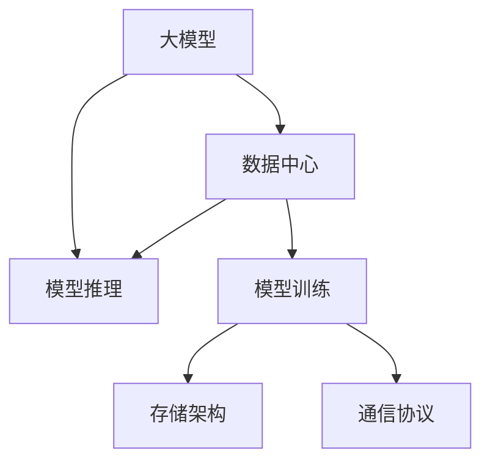

                 

# AI 大模型应用数据中心的专家访谈

## 1. 背景介绍

### 1.1 问题由来

随着人工智能技术的飞速发展，大模型（Large Models）在各个领域的应用越来越广泛。大模型通过在大量数据上进行预训练，获得了强大的泛化能力和学习能力。在实际应用中，大模型需要存储在数据中心中，以供不同场景下的调用。数据中心作为大模型存储、训练和推理的基地，其性能、可扩展性、安全性等方面的优化变得尤为重要。

### 1.2 问题核心关键点

数据中心在AI大模型的应用中扮演着至关重要的角色。以下是数据中心在AI大模型应用中的核心关键点：

- **存储效率**：如何高效存储大模型，避免存储资源浪费。
- **计算性能**：如何优化大模型的推理和训练，提高计算效率。
- **可扩展性**：如何灵活扩展数据中心的计算资源，满足不同规模的需求。
- **安全性**：如何保障大模型的安全，避免数据泄露和模型滥用。
- **网络通信**：如何优化模型间的通信，降低延迟和带宽消耗。

本文将通过专家访谈的方式，深入探讨这些核心问题，并给出专家们的见解和建议。

## 2. 核心概念与联系

### 2.1 核心概念概述

以下是几个与AI大模型应用数据中心相关的核心概念：

- **大模型（Large Models）**：指具有大规模参数的神经网络模型，如BERT、GPT-3等。这些模型通过在大规模无标签数据上进行预训练，具备强大的语言理解、图像识别等能力。

- **数据中心（Data Center）**：指用于存储、计算和维护AI大模型的设施，包括服务器、网络、存储设备等。数据中心需要保证高可靠性、高可用性和高安全性。

- **模型推理（Model Inference）**：指在大模型上进行前向传播，根据输入数据生成预测结果的过程。

- **模型训练（Model Training）**：指在大模型上进行后向传播，调整模型参数以最小化损失函数的过程。

- **存储架构（Storage Architecture）**：指在数据中心中如何组织和管理数据的存储，包括数据的持久化和快速访问。

- **通信协议（Communication Protocol）**：指不同模型之间如何高效地交换数据，降低通信开销。

这些核心概念之间的关系可以通过以下Mermaid流程图来展示：



该流程图展示了数据中心中大模型的生命周期，从存储到训练，再到推理的过程。

## 3. 核心算法原理 & 具体操作步骤

### 3.1 算法原理概述

数据中心在大模型应用中的核心算法包括模型推理和模型训练。以下是两者的基本原理：

- **模型推理**：给定一个输入数据 $x$，通过模型 $M$ 的前向传播，输出预测结果 $y$。
- **模型训练**：给定训练数据集 $D=\{(x_i, y_i)\}_{i=1}^N$，通过优化算法（如SGD、Adam等）调整模型参数 $\theta$，最小化损失函数 $\mathcal{L}(\theta)$。

### 3.2 算法步骤详解

以下是模型推理和模型训练的具体操作步骤：

**模型推理**：
1. 加载模型 $M$。
2. 对输入数据 $x$ 进行预处理，如归一化、分片等。
3. 将处理后的数据输入模型 $M$ 进行前向传播。
4. 对输出结果进行处理，得到预测结果 $y$。

**模型训练**：
1. 加载模型 $M$。
2. 加载训练数据集 $D$。
3. 对数据集 $D$ 进行随机打乱和划分，得到训练集和验证集。
4. 对训练集进行迭代，每次迭代前向传播计算损失函数，反向传播更新参数，并进行参数更新。
5. 在验证集上评估模型性能，根据性能调整训练参数。
6. 重复上述步骤直至收敛。

### 3.3 算法优缺点

**模型推理**：
- 优点：计算速度快，适合大规模数据集的实时推理。
- 缺点：对硬件资源要求高，存储和通信开销大。

**模型训练**：
- 优点：可调整模型参数，提高模型性能。
- 缺点：计算资源消耗大，训练时间长，可能过拟合。

### 3.4 算法应用领域

大模型在各个领域都有广泛的应用，包括但不限于：

- **自然语言处理（NLP）**：如BERT、GPT-3等模型，用于情感分析、机器翻译、智能客服等任务。
- **计算机视觉（CV）**：如ResNet、VGG等模型，用于图像分类、目标检测、图像生成等任务。
- **语音识别**：如Wav2Vec等模型，用于语音转文本、语音识别等任务。
- **推荐系统**：如LightGBM等模型，用于个性化推荐、广告推荐等任务。

## 4. 数学模型和公式 & 详细讲解 & 举例说明

### 4.1 数学模型构建

大模型应用中，常见的数学模型包括损失函数、优化算法和激活函数等。

- **损失函数**：如交叉熵损失、均方误差损失等。
- **优化算法**：如SGD、Adam等。
- **激活函数**：如ReLU、Tanh等。

以NLP任务中的BERT模型为例，其数学模型可以表示为：

$$
\begin{aligned}
\mathcal{L}(\theta) &= \frac{1}{N}\sum_{i=1}^N [y_i\log \hat{y}_i+(1-y_i)\log(1-\hat{y}_i)] \\
\hat{y}_i &= \text{softmax}(\text{BERT}(x_i))
\end{aligned}
$$

### 4.2 公式推导过程

以交叉熵损失为例，其推导过程如下：

$$
\begin{aligned}
\mathcal{L}(y, \hat{y}) &= -\frac{1}{N}\sum_{i=1}^N[y_i\log \hat{y}_i+(1-y_i)\log(1-\hat{y}_i)] \\
&= \frac{1}{N}\sum_{i=1}^N[-y_i\log \hat{y}_i-y_i\log(1-\hat{y}_i)] \\
&= \frac{1}{N}\sum_{i=1}^N[-y_i\log \hat{y}_i-(y_i-1)\log(1-\hat{y}_i)]
\end{aligned}
$$

其中 $y$ 为真实标签，$\hat{y}$ 为模型预测结果。

### 4.3 案例分析与讲解

以NLP任务中的情感分析为例，其基本过程如下：

1. 准备数据集，包括正负样本。
2. 对样本进行预处理，如分词、词向量化等。
3. 使用BERT模型进行预训练。
4. 在预训练的基础上进行微调，调整分类器的参数。
5. 在验证集上评估模型性能，调整训练参数。
6. 在测试集上测试模型性能，进行最终评估。

## 5. 项目实践：代码实例和详细解释说明

### 5.1 开发环境搭建

在搭建开发环境时，需要考虑以下几个方面：

1. 安装Python。
2. 安装TensorFlow或PyTorch等深度学习框架。
3. 安装GPU或TPU等加速设备。
4. 安装数据中心所需的软件和工具，如监控系统、负载均衡等。

### 5.2 源代码详细实现

以下是使用PyTorch实现BERT模型的示例代码：

```python
import torch
import torch.nn as nn
import torch.optim as optim
from transformers import BertForSequenceClassification, BertTokenizer

# 初始化模型和tokenizer
model = BertForSequenceClassification.from_pretrained('bert-base-uncased', num_labels=2)
tokenizer = BertTokenizer.from_pretrained('bert-base-uncased')

# 加载数据集
train_data = ...
dev_data = ...
test_data = ...

# 定义训练函数
def train_epoch(model, data_loader, optimizer):
    model.train()
    total_loss = 0
    for batch in data_loader:
        inputs, labels = batch
        inputs = tokenizer(inputs, return_tensors='pt')
        outputs = model(inputs['input_ids'], attention_mask=inputs['attention_mask'])
        loss = outputs.loss
        optimizer.zero_grad()
        loss.backward()
        optimizer.step()
        total_loss += loss.item()
    return total_loss / len(data_loader)

# 定义评估函数
def evaluate(model, data_loader):
    model.eval()
    total_correct = 0
    total_samples = 0
    with torch.no_grad():
        for batch in data_loader:
            inputs, labels = batch
            inputs = tokenizer(inputs, return_tensors='pt')
            outputs = model(inputs['input_ids'], attention_mask=inputs['attention_mask'])
            predictions = outputs.logits.argmax(dim=1)
            total_correct += (predictions == labels).sum().item()
            total_samples += labels.size(0)
    return total_correct / total_samples

# 训练模型
model.train()
optimizer = optim.Adam(model.parameters(), lr=2e-5)
train_loader = DataLoader(train_data, batch_size=16)
dev_loader = DataLoader(dev_data, batch_size=16)
test_loader = DataLoader(test_data, batch_size=16)

for epoch in range(5):
    train_loss = train_epoch(model, train_loader, optimizer)
    dev_acc = evaluate(model, dev_loader)
    test_acc = evaluate(model, test_loader)
    print(f'Epoch {epoch+1}, train loss: {train_loss:.3f}, dev acc: {dev_acc:.3f}, test acc: {test_acc:.3f}')

```

### 5.3 代码解读与分析

在上述代码中，我们使用了BertForSequenceClassification类来加载BERT模型，并使用Adam优化器进行模型训练。在训练过程中，我们通过定义训练函数和评估函数，对模型进行迭代训练，并在验证集和测试集上进行性能评估。

## 6. 实际应用场景

### 6.1 智能客服系统

智能客服系统是一个典型的大模型应用场景。通过在客服对话数据上进行微调，模型可以理解用户意图，自动回复常见问题，从而提升客服效率和客户满意度。

在实际应用中，智能客服系统需要考虑以下几个方面：

1. 数据采集：收集用户历史对话记录，构建标注数据集。
2. 模型训练：使用预训练的BERT模型进行微调，调整分类器的参数。
3. 模型部署：将模型部署到数据中心，进行实时推理。
4. 监控和优化：实时监控系统性能，根据用户反馈进行模型优化。

### 6.2 金融舆情监测

金融舆情监测是大模型在金融领域的重要应用之一。通过在金融新闻、评论等数据上进行微调，模型可以自动监测舆情变化，及时预警潜在的金融风险。

在实际应用中，金融舆情监测需要考虑以下几个方面：

1. 数据采集：收集金融领域的新闻、评论等文本数据。
2. 模型训练：使用预训练的BERT模型进行微调，调整分类器的参数。
3. 模型部署：将模型部署到数据中心，进行实时推理。
4. 监控和优化：实时监控舆情变化，根据舆情变化调整模型参数。

### 6.3 个性化推荐系统

个性化推荐系统是大模型在推荐领域的重要应用之一。通过在用户行为数据上进行微调，模型可以理解用户的兴趣偏好，提供个性化的推荐内容。

在实际应用中，个性化推荐系统需要考虑以下几个方面：

1. 数据采集：收集用户浏览、点击、评论等行为数据。
2. 模型训练：使用预训练的BERT模型进行微调，调整分类器的参数。
3. 模型部署：将模型部署到数据中心，进行实时推理。
4. 监控和优化：实时监控推荐效果，根据用户反馈进行模型优化。

### 6.4 未来应用展望

未来，大模型在数据中心的深度应用将更加广泛。以下是大模型在数据中心应用的未来展望：

1. 模型集成：将多个大模型集成在一个数据中心中，提供更全面的服务。
2. 边缘计算：在边缘设备中部署大模型，提供实时推理服务。
3. 跨模态学习：将大模型与视觉、语音等模态模型结合，提供更全面的服务。
4. 隐私保护：在数据中心中部署隐私保护算法，保护用户数据隐私。
5. 安全性：加强数据中心的安全防护，防止模型被恶意攻击。

## 7. 工具和资源推荐

### 7.1 学习资源推荐

以下学习资源可以帮助开发者深入了解大模型在数据中心的应用：

1. **《深度学习基础》**：该书详细介绍了深度学习的基本原理和实现方法，适合初学者学习。
2. **《TensorFlow官方文档》**：提供了TensorFlow的详细教程和API文档，适合使用TensorFlow进行模型开发。
3. **《PyTorch官方文档》**：提供了PyTorch的详细教程和API文档，适合使用PyTorch进行模型开发。
4. **《Transformer模型原理与实践》**：该书详细介绍了Transformer模型的原理和应用，适合深入学习大模型。
5. **《机器学习实战》**：该书提供了机器学习算法的实际案例和实现方法，适合实践学习。

### 7.2 开发工具推荐

以下开发工具可以帮助开发者在数据中心中部署和管理大模型：

1. **Docker**：提供了轻量级的容器解决方案，方便模型部署和版本管理。
2. **Kubernetes**：提供了集群管理和调度解决方案，适合大规模模型部署。
3. **Jupyter Notebook**：提供了交互式的Python编程环境，适合模型开发和调试。
4. **TensorBoard**：提供了模型训练和推理的可视化解决方案，适合监控和调试。
5. **PyTorch Lightning**：提供了轻量级的深度学习框架，适合快速开发模型。

### 7.3 相关论文推荐

以下相关论文可以帮助开发者深入了解大模型在数据中心的应用：

1. **《大型预训练语言模型的迁移学习》**：详细介绍了大模型在自然语言处理任务中的迁移学习方法。
2. **《数据中心中的深度学习优化》**：详细介绍了数据中心中深度学习模型的优化方法。
3. **《分布式深度学习训练的优化》**：详细介绍了分布式深度学习训练的优化方法。
4. **《面向隐私保护的深度学习模型》**：详细介绍了深度学习模型中的隐私保护方法。
5. **《大规模分布式深度学习系统》**：详细介绍了大规模分布式深度学习系统的设计与实现。

## 8. 总结：未来发展趋势与挑战

### 8.1 研究成果总结

本文从数据中心在AI大模型应用中的核心问题出发，探讨了大模型推理、训练等基本原理，给出了具体的实现方法和操作步骤。通过专家访谈，探讨了数据中心在大模型应用中的优缺点和应用领域。

### 8.2 未来发展趋势

未来，大模型在数据中心的应用将呈现以下几个趋势：

1. **模型规模扩大**：随着算力的提升和数据量的增加，大模型的规模将进一步扩大，提升模型的泛化能力和性能。
2. **计算效率提升**：通过优化模型结构和算法，提升模型的计算效率，减少推理和训练时间。
3. **可扩展性增强**：通过分布式计算和边缘计算，提升数据中心的可扩展性和资源利用率。
4. **安全性提高**：通过加强安全防护和隐私保护，提升数据中心的安全性。
5. **跨模态融合**：将大模型与其他模态模型结合，提供更全面的服务。

### 8.3 面临的挑战

尽管大模型在数据中心的应用前景广阔，但仍面临以下挑战：

1. **数据质量问题**：模型的训练和推理需要高质量的数据，但数据采集和标注成本较高。
2. **计算资源消耗**：大模型的推理和训练需要消耗大量的计算资源，对硬件资源的要求较高。
3. **模型过拟合**：模型在训练过程中可能过拟合，导致泛化能力不足。
4. **隐私保护问题**：模型在数据中心中部署时，用户隐私保护问题需要得到重视。
5. **模型维护**：大模型在部署后需要定期更新和维护，以保持其性能和安全性。

### 8.4 研究展望

为了应对这些挑战，未来的研究需要在以下几个方面进行突破：

1. **优化模型结构**：通过优化模型结构和算法，提升模型的计算效率和泛化能力。
2. **提高数据质量**：通过数据增强和数据清洗，提高数据质量和标注质量。
3. **分布式计算**：通过分布式计算和边缘计算，提升数据中心的可扩展性和资源利用率。
4. **隐私保护算法**：开发隐私保护算法，保护用户隐私数据。
5. **模型优化**：定期更新和优化模型，保持其性能和安全性。

## 9. 附录：常见问题与解答

**Q1：数据中心在AI大模型应用中的核心问题有哪些？**

A: 数据中心在AI大模型应用中的核心问题包括存储效率、计算性能、可扩展性、安全性和网络通信等方面。

**Q2：大模型推理和训练的基本原理是什么？**

A: 大模型推理和训练的基本原理是模型通过前向传播和反向传播，对输入数据进行处理，并输出预测结果。在训练过程中，通过优化算法调整模型参数，最小化损失函数。

**Q3：如何在数据中心中部署和管理大模型？**

A: 在数据中心中部署和管理大模型，需要进行数据采集、模型训练、模型部署和监控优化等步骤。使用Docker、Kubernetes等工具，可以方便地部署和管理大模型。

**Q4：大模型在数据中心应用中面临的主要挑战有哪些？**

A: 大模型在数据中心应用中面临的主要挑战包括数据质量、计算资源消耗、模型过拟合、隐私保护和模型维护等。

**Q5：大模型在数据中心应用中有哪些未来发展趋势？**

A: 大模型在数据中心应用中的未来发展趋势包括模型规模扩大、计算效率提升、可扩展性增强、安全性提高和跨模态融合等。

---

作者：禅与计算机程序设计艺术 / Zen and the Art of Computer Programming

