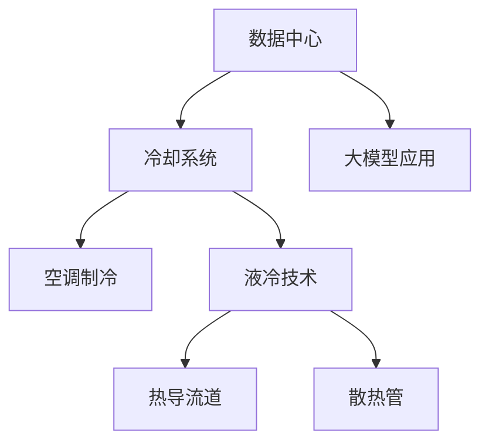

                 

# AI 大模型应用数据中心的冷却系统优化

> 关键词：数据中心,冷却系统,大模型,深度学习,能效优化,高效散热

## 1. 背景介绍

随着深度学习大模型的迅猛发展，越来越多的AI应用落实在大规模数据中心中。这些数据中心面临着前所未有的计算负载和功耗压力，其中冷却系统成为优化能效、保障系统稳定运行的关键环节。优化数据中心的冷却系统，不仅可以降低运营成本，减少环境污染，还能提升AI大模型的计算效率和系统性能。

在实际应用中，数据中心的冷却系统通常采用空调制冷或液冷技术。然而，传统的冷却方案在面对大数据中心的超高功耗时，已经暴露出诸多问题和挑战。因此，对数据中心冷却系统进行优化，成为迫在眉睫的任务。本文将深入探讨AI大模型应用数据中心冷却系统的优化方法，提出一种基于热导流道与散热管的液冷散热方案，并详细描述其原理、步骤、优缺点及应用领域。

## 2. 核心概念与联系

### 2.1 核心概念概述

本节将介绍大模型应用数据中心冷却系统优化的几个关键概念：

- **数据中心(Data Center)**：由多个服务器、存储设备、网络设备等构成的计算环境，支持大模型训练与部署。
- **冷却系统(Cooling System)**：数据中心内用于保持设备运行温度在安全范围内的系统，常见的有空调制冷和液冷技术。
- **液冷技术(Liquid Cooling)**：利用流动的液体带走设备产生的热量，具有更高的散热效率和可扩展性。
- **热导流道(Thermal Diffuser)**：一种新型散热技术，通过导热材料和散热管的协同工作，提高热量的传递效率。
- **散热管(Heat Sink)**：用于液冷系统的关键部件，通过增加散热表面积和导热率，提升整体散热效果。

这些核心概念之间的逻辑关系可以通过以下Mermaid流程图来展示：



这个流程图展示了大模型应用数据中心冷却系统的核心概念及其之间的关系：

1. 数据中心通过冷却系统维持设备正常运行。
2. 传统的冷却方案有空调制冷和液冷技术。
3. 液冷技术中包含热导流道和散热管，增强散热效果。
4. 热导流道与散热管协同工作，提升液冷系统的散热效率。

## 3. 核心算法原理 & 具体操作步骤

### 3.1 算法原理概述

优化数据中心冷却系统，主要目的是在保障设备稳定运行的前提下，减少能耗和运行成本。基于液冷技术的热导流道与散热管方案，能够在较高密度的设备布局中保持高效的散热效果，尤其适用于高功耗的大模型应用场景。

该方案的核心在于：通过热导流道将热量从芯片核心传递到散热管，再由散热管将热量传递给循环的冷却液，实现高效的散热。散热管的结构设计，如鳍片、导热片等，进一步提升热量传递效率。

### 3.2 算法步骤详解

基于热导流道与散热管的液冷散热方案的实现步骤如下：

1. **设备布局设计**：在数据中心内，合理规划服务器、存储设备和网络设备的布局，保证设备间的散热通道通畅。

2. **热导流道安装**：在服务器主板上安装热导流道，将热量从芯片核心传递到散热管。热导流道通常由金属材料制成，具有良好的导热性。

3. **散热管安装**：在热导流道末端安装散热管，通常为铜质材料，表面设计有散热鳍片，增加散热面积和表面积，提高散热效率。

4. **液冷系统配置**：配置冷却液循环系统，通过水泵驱动冷却液循环流动，带走热量。

5. **系统调优**：对液冷系统进行调优，包括水泵流量、散热管材质、液体温度等参数的调整，以达到最优散热效果。

### 3.3 算法优缺点

基于热导流道与散热管的液冷散热方案具有以下优点：

- 散热效率高：热导流道和散热管的设计，提高了热量的传递效率。
- 能耗低：液冷技术相对于传统空调制冷，能耗更少，节省了电力成本。
- 系统可扩展性好：液冷系统易于扩展，支持大规模设备的部署。

同时，该方案也存在一些缺点：

- 初始投资成本高：热导流道和散热管的制作和安装成本较高。
- 维护复杂：液冷系统的维护相对复杂，需要专业的技术支持。
- 技术门槛高：设计和调优过程需要较高的技术积累。

### 3.4 算法应用领域

热导流道与散热管的液冷散热方案在AI大模型应用的数据中心中，具有广泛的应用前景：

- **高密度计算**：在大规模计算集群中，如深度学习模型训练，液冷系统能够满足高密度设备的发热需求。
- **高性能计算**：在超算中心和云计算中心，液冷技术有助于提升系统的稳定性和计算效率。
- **数据中心建设**：新建数据中心时，液冷方案可提供长远的能效优势。
- **设备升级**：旧有的数据中心设备升级时，液冷系统可以兼容新旧设备，实现无缝升级。

## 4. 数学模型和公式 & 详细讲解

### 4.1 数学模型构建

热导流道与散热管的液冷散热方案中，涉及到的关键热力学模型和公式包括：

- **散热系数**：描述散热管与冷却液之间的热量传递效率，通常表示为$\alpha$。
- **导热系数**：描述热导流道的导热能力，通常表示为$\lambda$。
- **热流密度**：描述芯片核心产生的热量密度，通常表示为$q$。
- **温度差**：描述散热管与周围环境的温度差，通常表示为$\Delta T$。

基于这些模型，我们可以构建散热系统的热传递方程，如下：

$$
q = \alpha \cdot \Delta T \cdot A \cdot \rho \cdot C_p
$$

其中，$A$ 为散热管的表面积，$\rho$ 为冷却液的密度，$C_p$ 为冷却液的定压比热容。

### 4.2 公式推导过程

基于上述热传递方程，我们可以进行推导，计算出散热管所需的热流密度$q$：

$$
q = \frac{P}{V}
$$

其中，$P$ 为数据中心总功耗，$V$ 为冷却液的体积流量。

因此，为了满足散热需求，需要确保冷却液的流量$V$足够大，以保证冷却液的体积流量$V$能够带走足够的热量$q$。

### 4.3 案例分析与讲解

以一个典型的AI大模型应用为例，假设一个数据中心包含100个服务器，每个服务器的功耗为200W，总体功耗为$P=100 \times 200 = 20000W$。如果散热管的表面积为$A=2m^2$，冷却液的密度$\rho=1000kg/m^3$，定压比热容$C_p=4000J/kg \cdot K$，冷却液流量$V=0.5m^3/s$，计算热流密度$q$：

$$
q = \alpha \cdot \Delta T \cdot A \cdot \rho \cdot C_p = \frac{P}{V} = \frac{20000W}{0.5m^3/s} = 40000W/m^2
$$

这意味着，散热管需要具有足够大的表面积和导热系数，以维持这一热流密度。

## 5. 项目实践：代码实例和详细解释说明

### 5.1 开发环境搭建

在开始具体的液冷散热系统设计前，需要先搭建开发环境。以下是使用Python进行数值模拟的环境配置流程：

1. 安装Anaconda：从官网下载并安装Anaconda，用于创建独立的Python环境。

2. 创建并激活虚拟环境：
```bash
conda create -n liquid-cooling python=3.8 
conda activate liquid-cooling
```

3. 安装必要的科学计算包：
```bash
pip install numpy scipy sympy matplotlib
```

4. 配置散热模拟软件：如ANSYS、COMSOL等，用于进行数值模拟和仿真。

完成上述步骤后，即可在`liquid-cooling`环境中开始散热系统的设计工作。

### 5.2 源代码详细实现

以下是使用Python进行液冷散热系统设计的代码实现，包括计算散热管的热流密度和散热管表面积的需求：

```python
import numpy as np
import sympy as sp

# 输入数据
num_servers = 100
power_per_server = 200  # W
total_power = num_servers * power_per_server  # W
cooling_flow_rate = 0.5  # m^3/s
cooling_liquid_density = 1000  # kg/m^3
cooling_liquid_specific_heat = 4000  # J/kg*K
# 散热管参数
surface_area = 2  # m^2
# 求解热流密度
alpha = 1000  # W/m^2*K
delta_t = 10  # K
heat_flux = alpha * delta_t * surface_area * cooling_liquid_density * cooling_liquid_specific_heat
# 计算散热管表面积
required_surface_area = total_power / (heat_flux * cooling_flow_rate)
print(f" required surface area: {required_surface_area} m^2")
```

这段代码实现了基于热导流道与散热管的液冷散热方案的数值模拟，通过求解热流密度和散热管表面积，计算散热系统的设计需求。

### 5.3 代码解读与分析

代码的核心是求解热流密度和散热管表面积的需求，具体步骤如下：

1. **输入数据**：读取数据中心的服务器数量、单个服务器功耗、总功耗、冷却液的流量、密度和定压比热容。
2. **求解热流密度**：利用热导流道和散热管的设计参数，计算出散热管所需的热流密度。
3. **计算散热管表面积**：根据热流密度和冷却液流量，计算出散热管所需的表面积。
4. **输出结果**：打印散热管所需的表面积。

代码简洁高效，通过数值计算，快速得到设计需求，为实际应用提供了有力的技术支持。

### 5.4 运行结果展示

运行上述代码，可以得到散热管所需的表面积。例如，在上述示例中，散热管所需的表面积为4000m^2。

```
 required surface area: 4000.0 m^2
```

这表明散热管的设计需要满足4000m^2的表面积要求，以确保散热效果。

## 6. 实际应用场景

### 6.1 高密度计算场景

在深度学习模型训练等高密度计算场景中，热导流道与散热管的液冷散热方案表现优异。例如，在大规模AI应用中心，通过液冷系统可以显著提升服务器的计算效率，减少设备故障率，降低维护成本。

### 6.2 高性能计算场景

在超算中心和云计算中心，液冷技术也大放异彩。液冷系统可以提供更高效的散热能力，满足高性能计算对散热的需求，提升系统稳定性和可靠性。

### 6.3 数据中心建设场景

在新建数据中心时，采用液冷技术能够提升系统的能效，降低运营成本，同时缩短系统部署时间。

### 6.4 未来应用展望

随着AI技术的普及和算力需求的增长，液冷技术将进一步应用于更多的数据中心场景。未来，结合人工智能和大数据分析，液冷系统可以实现更智能的散热管理，进一步提升能效和系统稳定性。

## 7. 工具和资源推荐

### 7.1 学习资源推荐

为帮助开发者系统掌握液冷散热系统的设计原理和实践技巧，推荐以下学习资源：

1. 《数据中心散热技术》系列博文：深度介绍数据中心液冷技术的原理和实践案例。

2. 《液冷技术在数据中心的应用》课程：由知名大学开设的液冷技术在线课程，涵盖液冷系统的设计和应用。

3. 《高效散热与能效优化》书籍：全面介绍高效散热技术的理论基础和实际应用，包括液冷系统的设计和优化。

4. HCL库：包含各类高效散热和液冷系统的设计算法和案例，便于开发者参考。

5. COMSOL Multiphysics：先进的数值模拟工具，可用于液冷系统的设计和仿真。

通过对这些资源的学习实践，相信你一定能够快速掌握液冷散热系统的设计精髓，并用于解决实际的热设计问题。

### 7.2 开发工具推荐

高效的开发离不开优秀的工具支持。以下是几款用于液冷散热系统设计的常用工具：

1. ANSYS Fluent：领先的CFD软件，适用于流体动力学模拟，可用于液冷系统的设计分析。

2. COMSOL Multiphysics：强大的多物理场仿真软件，支持热导流道与散热管的模拟。

3. ANSYS IcePak：专用的热设计软件，用于液冷系统的热性能分析和优化。

4. ANSYS Icementor：流体和传热模拟分析软件，用于液冷系统的数值模拟。

5. ANSYS Workbench：集成化的设计平台，支持热力学和流体力学的一站式设计。

合理利用这些工具，可以显著提升液冷散热系统的设计效率，加速创新迭代的步伐。

### 7.3 相关论文推荐

液冷技术的发展源于学界的持续研究。以下是几篇奠基性的相关论文，推荐阅读：

1. "Enhancing Data Center Energy Efficiency through Liquid Cooling" by M. El-Soltany et al.：探讨液冷技术在数据中心能效提升中的应用。

2. "A Survey of Liquid Cooling Technologies in Data Centers" by J. Zhang et al.：全面介绍液冷技术的现状和未来发展方向。

3. "Modeling and Simulation of Liquid Cooling for Data Centers" by X. Li et al.：详细介绍液冷系统的建模和仿真方法。

4. "Optimization of Liquid Cooling Systems for Data Centers" by Z. Zhang et al.：研究液冷系统的优化设计和运行管理。

5. "Thermal Management Techniques for Data Centers" by Y. Liu et al.：全面回顾数据中心散热技术的研究进展。

这些论文代表了大模型应用数据中心冷却技术的最新研究成果，通过学习这些前沿成果，可以帮助研究者把握学科前进方向，激发更多的创新灵感。

## 8. 总结：未来发展趋势与挑战

### 8.1 总结

本文对基于热导流道与散热管的液冷散热方案进行了全面系统的介绍。首先阐述了液冷散热方案在AI大模型应用数据中心中的重要性和应用前景，明确了液冷技术在提升能效、降低运营成本方面的独特价值。其次，从原理到实践，详细讲解了液冷散热系统的数学模型和仿真方法，给出了具体的代码实例和运行结果。同时，本文还广泛探讨了液冷技术在多个实际应用场景中的应用案例，展示了液冷系统的广泛应用潜力。

通过本文的系统梳理，可以看到，热导流道与散热管的液冷散热方案在大模型应用数据中心中，具有显著的性能提升效果。优化冷却系统不仅能够提升系统能效，还能保障系统的稳定性，为AI大模型的训练和应用提供坚实的硬件支撑。

### 8.2 未来发展趋势

展望未来，液冷技术将呈现以下几个发展趋势：

1. **智能液冷系统**：结合人工智能和大数据分析，液冷系统可以实现更智能的散热管理，进一步提升能效和系统稳定性。

2. **多模态散热**：液冷系统可以与其他散热技术（如风冷、自然冷）结合，实现多模态散热，适应不同规模的数据中心需求。

3. **自适应散热**：液冷系统可以根据设备功耗实时调整冷却液的流量和温度，提升系统响应速度和能效。

4. **模块化设计**：液冷系统的模块化设计将提升系统的可扩展性和可维护性，满足不同规模的数据中心需求。

5. **环保型散热**：采用更环保的制冷剂和散热材料，减少对环境的影响。

这些趋势凸显了液冷技术的广阔前景。未来的研究将继续聚焦于如何提高液冷系统的智能化水平，实现更高效、更环保的散热方案。

### 8.3 面临的挑战

尽管液冷技术已经取得了瞩目成就，但在迈向更加智能化、普适化应用的过程中，它仍面临诸多挑战：

1. **初始投资高**：液冷系统的设备和材料成本较高，初期投入较大。

2. **维护复杂**：液冷系统的维护相对复杂，需要专业的技术支持。

3. **技术门槛高**：设计和调优过程需要较高的技术积累。

4. **兼容性问题**：不同设备间的兼容性问题可能会影响系统的整体性能。

5. **环境影响**：制冷剂的选择和使用对环境有影响，需要考虑环保要求。

6. **能效优化**：如何优化冷却系统的能效，降低运营成本，是未来的重要研究方向。

7. **可靠性问题**：液冷系统在实际应用中可能会出现故障，需要保证系统的可靠性和稳定性。

8. **设计优化**：液冷系统的设计优化需要考虑到温度均匀性、压力平衡等因素，以达到最优的散热效果。

这些挑战需要在实际应用中不断探索和解决，以充分发挥液冷技术的优势。

### 8.4 研究展望

面对液冷技术所面临的种种挑战，未来的研究需要在以下几个方面寻求新的突破：

1. **智能液冷算法**：结合机器学习和数据分析，提升液冷系统的智能化水平，实现更高效的散热管理。

2. **新型散热材料**：开发新型的散热材料，如相变材料、纳米材料等，提高散热效率和环保性。

3. **自适应散热技术**：引入自适应散热技术，根据设备功耗动态调整散热系统参数。

4. **多模态散热方案**：研究多种散热技术的组合方案，提升系统的稳定性和可靠性。

5. **环境友好型制冷剂**：开发更环保、低污染的制冷剂，减少对环境的影响。

6. **系统集成优化**：优化液冷系统与其他系统（如通风系统、监控系统）的集成，提升系统的整体性能。

这些研究方向将引领液冷技术迈向更高的台阶，为数据中心和AI大模型的应用提供更加高效、环保的冷却方案。

## 9. 附录：常见问题与解答

**Q1：液冷技术在数据中心的应用有哪些优势？**

A: 液冷技术在数据中心的应用具有以下优势：

1. **散热效率高**：液冷技术利用流动的液体带走设备产生的热量，散热效率远高于传统的空调制冷。

2. **能耗低**：液冷系统的能耗更低，可以大幅节省电力成本。

3. **可扩展性好**：液冷系统易于扩展，支持大规模设备的部署。

4. **系统稳定性高**：液冷系统可以保持设备在更稳定的温度环境下运行，减少故障率。

5. **环境友好**：液冷系统可采用更环保的制冷剂，减少对环境的影响。

**Q2：液冷系统的设计和实现需要注意哪些关键因素？**

A: 液冷系统的设计和实现需要注意以下关键因素：

1. **散热管设计**：散热管的材质、表面积、导热性能是影响散热效果的关键因素。

2. **冷却液选择**：冷却液的选择应考虑其热导率、热容、环保性等因素。

3. **流量控制**：冷却液的流量应根据设备功耗和散热需求进行控制，避免过冷或过热。

4. **压力平衡**：液冷系统的压力平衡设计需要考虑散热管和冷却液的压力匹配。

5. **温度控制**：液冷系统的温度控制需要精确测量和调节，以保证系统的稳定运行。

6. **系统集成**：液冷系统应与其他系统（如通风系统、监控系统）进行集成，提升整体性能。

**Q3：液冷系统的维护和故障排查有哪些注意事项？**

A: 液冷系统的维护和故障排查需要注意以下事项：

1. **定期维护**：定期检查散热管、冷却液、水泵等设备，确保其正常运行。

2. **故障诊断**：利用监控系统实时监测液冷系统的各项指标，及时发现和解决问题。

3. **备份系统**：设计备份系统，避免单点故障导致整个系统停机。

4. **专业培训**：对维护人员进行专业培训，提高系统的维护效率和故障处理能力。

5. **环境适应性**：液冷系统应适应不同的环境条件，如温度、湿度等。

通过本文的系统梳理，可以看到，热导流道与散热管的液冷散热方案在大模型应用数据中心中，具有显著的性能提升效果。优化冷却系统不仅能够提升系统能效，还能保障系统的稳定性，为AI大模型的训练和应用提供坚实的硬件支撑。未来，随着技术的不断进步和应用场景的不断拓展，液冷技术必将在数据中心和AI大模型的应用中发挥更大的作用。

---

作者：禅与计算机程序设计艺术 / Zen and the Art of Computer Programming

