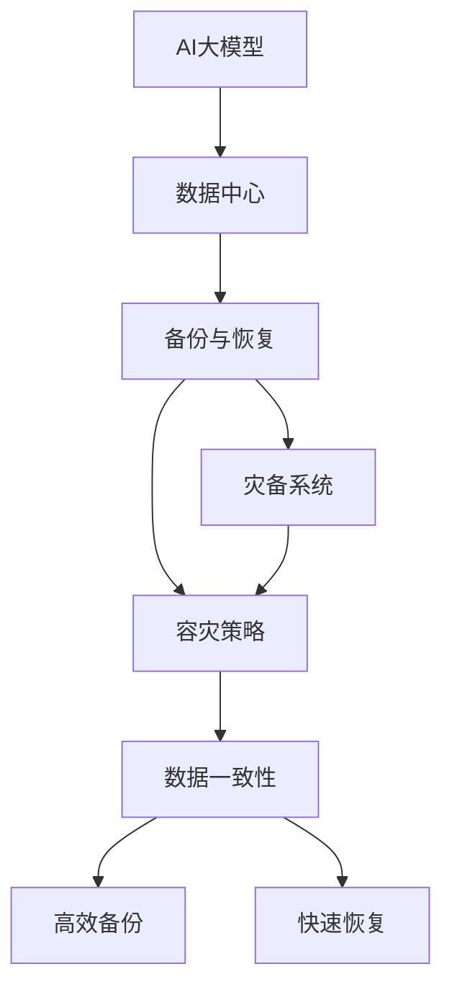

                 

# AI 大模型应用数据中心的备份与恢复

> 关键词：AI 大模型, 数据中心备份, 数据恢复, 灾备系统, 容灾策略, 数据一致性, 数据迁移

## 1. 背景介绍

### 1.1 问题由来
随着人工智能技术的发展，AI大模型如BERT、GPT-3等在自然语言处理（NLP）、计算机视觉、推荐系统等领域展示了强大的潜力。这些模型往往包含数十亿甚至百亿级的参数，占用了庞大的存储空间，并需要高效的计算资源进行训练和推理。因此，AI大模型的应用通常依赖于大规模数据中心的基础设施支持。然而，大规模数据中心在运行过程中可能面临各种风险，包括硬件故障、自然灾害、网络攻击等。一旦发生数据中心故障，AI大模型的备份与恢复问题便成为了保障其连续性运营的重要环节。

### 1.2 问题核心关键点
AI大模型应用的数据中心备份与恢复涉及以下几个核心关键点：

- **数据一致性**：在备份和恢复过程中，确保数据的完整性和一致性，防止数据丢失和损坏。
- **高效备份**：实现快速、低成本的数据备份，减少对业务运行的影响。
- **快速恢复**：在发生故障时，能迅速恢复AI大模型的运行，避免业务中断。
- **容灾策略**：制定合理的容灾策略，确保数据中心在灾难发生时能够快速切换和恢复。

## 2. 核心概念与联系

### 2.1 核心概念概述

为更好地理解AI大模型应用数据中心的备份与恢复方法，本节将介绍几个密切相关的核心概念：

- **AI大模型**：如BERT、GPT-3等，利用大规模无标签数据预训练，通过有监督微调优化，适用于各种NLP和计算机视觉任务的语言模型。
- **数据中心**：由服务器、存储设备、网络设备等组成的大型数据处理设施，是AI大模型应用的基础平台。
- **备份与恢复**：在数据中心发生故障时，通过备份数据快速恢复AI大模型的过程。
- **灾备系统**：用于灾难恢复的备份系统，包括备份策略、备份存储、恢复流程等。
- **容灾策略**：为保障数据中心的安全和连续性，采取的灾难应对措施，包括多地备份、云备份等。

这些核心概念之间的逻辑关系可以通过以下Mermaid流程图来展示：



这个流程图展示了AI大模型应用数据中心的备份与恢复的核心概念及其之间的关系：

1. AI大模型在数据中心中运行。
2. 数据中心通过备份与恢复手段，保障AI大模型的持续运营。
3. 灾备系统为备份与恢复提供技术支持。
4. 容灾策略保障数据中心的安全性和可靠性。
5. 数据一致性、高效备份和快速恢复是备份与恢复过程的关键环节。

## 3. 核心算法原理 & 具体操作步骤

### 3.1 算法原理概述

AI大模型应用数据中心的备份与恢复，本质上是一个数据管理和灾难恢复的复杂过程。其核心思想是：通过构建有效的灾备系统，定期对数据中心中的关键数据进行备份，并制定合理的恢复策略，确保在灾难发生时能够迅速恢复AI大模型的运行。

形式化地，假设数据中心中存储了AI大模型的权重参数 $\theta$ 和其他关键数据 $D$。备份过程为：

$$
B_t = f(\theta, D, t)
$$

其中 $f$ 为备份函数，$t$ 为时间戳。恢复过程为：

$$
\hat{\theta} = g(B_t, t)
$$

其中 $g$ 为恢复函数。

### 3.2 算法步骤详解

AI大模型应用数据中心的备份与恢复一般包括以下几个关键步骤：

**Step 1: 确定备份策略**
- 确定备份频率，如每日、每周备份。
- 定义备份类型，包括完全备份、增量备份、差异备份等。
- 选择备份存储方式，如本地备份、云备份、磁带备份等。

**Step 2: 设置备份参数**
- 确定备份窗口，在指定时间段内进行备份。
- 设置备份保留时间，保留最近n天的备份数据。
- 配置备份参数，如压缩比例、备份源等。

**Step 3: 执行备份操作**
- 对AI大模型的权重参数 $\theta$ 和其他关键数据 $D$ 进行备份。
- 将备份数据存储到指定的备份存储中。

**Step 4: 监控备份状态**
- 实时监控备份进度，确保备份过程顺利进行。
- 定期检查备份数据完整性和一致性。

**Step 5: 执行恢复操作**
- 在发生灾难时，根据备份数据 $B_t$ 执行恢复操作，获取恢复后的参数 $\hat{\theta}$。
- 重新启动AI大模型，确保其正常运行。

**Step 6: 测试恢复效果**
- 在测试环境中模拟灾难场景，进行恢复测试。
- 评估恢复后的AI大模型性能，确保其输出与灾难前一致。

### 3.3 算法优缺点

AI大模型应用数据中心的备份与恢复方法具有以下优点：

1. **保障数据安全**：定期备份数据中心中的关键数据，防止因硬件故障、自然灾害等原因导致数据丢失。
2. **提升系统可靠性**：通过多地备份和云备份，分散风险，保障系统的连续性运营。
3. **降低业务影响**：备份过程可以在非高峰时段进行，不影响AI大模型的正常运行。
4. **增强应对能力**：提前制定灾备策略，在灾难发生时能够迅速恢复，减少业务中断时间。

同时，该方法也存在一定的局限性：

1. **备份成本高**：大规模数据中心的备份需要大量的存储资源和计算资源，成本较高。
2. **备份复杂度高**：备份过程需要定期执行，配置复杂，容易出现错误。
3. **恢复过程复杂**：恢复过程需要技术支持，且恢复后的性能可能需要重新调整。
4. **数据一致性问题**：备份过程中可能存在数据丢失或损坏的风险，导致恢复后的数据不一致。

尽管存在这些局限性，但就目前而言，基于备份与恢复的灾备系统是保障AI大模型应用数据中心安全运行的重要手段。未来相关研究的重点在于如何进一步降低备份成本，提高恢复效率，同时兼顾数据一致性和系统可靠性。

### 3.4 算法应用领域

基于备份与恢复的灾备系统，在AI大模型应用数据中心中具有广泛的应用前景，主要包括以下几个方面：

- **云服务提供商**：如AWS、Azure等云平台，通过备份与恢复技术，保障其服务的连续性运营。
- **大型企业数据中心**：通过多地备份和云备份，分散风险，保障业务连续性。
- **科研机构和高校**：用于大型AI模型的研究和应用，确保数据安全和系统稳定。
- **智能应用提供商**：如智能客服、智能推荐系统等，通过备份与恢复保障服务的连续性。

## 4. 数学模型和公式 & 详细讲解

### 4.1 数学模型构建

本节将使用数学语言对AI大模型应用数据中心的备份与恢复过程进行更加严格的刻画。

假设数据中心中存储的AI大模型权重参数为 $\theta$，其他关键数据为 $D$。定义备份函数为 $f$，恢复函数为 $g$。备份过程为：

$$
B_t = f(\theta, D, t)
$$

其中 $B_t$ 表示时间 $t$ 的备份数据，$f$ 为备份函数，$\theta$ 为AI大模型的权重参数，$D$ 为其他关键数据，$t$ 为时间戳。

恢复过程为：

$$
\hat{\theta} = g(B_t, t)
$$

其中 $\hat{\theta}$ 表示时间 $t$ 的恢复后的AI大模型权重参数，$g$ 为恢复函数，$B_t$ 为时间 $t$ 的备份数据，$t$ 为时间戳。

### 4.2 公式推导过程

以下我们以完整的备份与恢复过程为例，推导备份和恢复的数学公式。

假设备份周期为 $T$，备份频率为 $f$，备份存储方式为 $S$。备份函数 $f$ 定义为：

$$
B_t = f(\theta, D, t) = \left\{
  \begin{array}{lr}
    \theta_{t-1}, & t=1 \\
    g_t(B_{t-1}, t-1), & t>1
  \end{array}
\right.
$$

其中 $t$ 为时间戳，$g_t$ 为第 $t$ 次备份时的恢复函数。

恢复函数 $g$ 定义为：

$$
\hat{\theta} = g(B_t, t) = \left\{
  \begin{array}{lr}
    \theta_0, & t=1 \\
    g_t(B_{t-1}, t-1), & t>1
  \end{array}
\right.
$$

其中 $t$ 为时间戳，$g_t$ 为第 $t$ 次恢复时的恢复函数。

在推导过程中，假设每次备份的时间为 $T_b$，每次恢复的时间为 $T_r$。则备份和恢复的时间复杂度为 $O(T_b + T_r)$。

### 4.3 案例分析与讲解

以一个实际的案例来说明备份与恢复的实现过程：

**案例背景**：一家大型科技公司使用GPT-3模型进行智能客服应用，存储在数据中心的服务器上。数据中心每天备份一次，备份数据存储在本地和云端。

**备份过程**：
- 每天23:00，数据中心自动备份GPT-3模型权重参数和其他关键数据。
- 备份数据包括模型的权重文件、训练数据、配置文件等。
- 备份数据使用GZIP压缩，存储在本地磁盘和云存储中。

**恢复过程**：
- 一旦数据中心发生硬件故障，立即从备份存储中读取最新备份数据。
- 使用恢复函数 $g$，从备份数据中恢复GPT-3模型权重参数。
- 重新启动GPT-3模型，确保其正常运行。

**恢复测试**：
- 在测试环境中模拟数据中心故障，进行恢复测试。
- 检查恢复后的模型输出与故障前是否一致，确保恢复成功。

## 5. 项目实践：代码实例和详细解释说明

### 5.1 开发环境搭建

在进行备份与恢复实践前，我们需要准备好开发环境。以下是使用Python进行AWS S3进行备份的开发环境配置流程：

1. 安装AWS CLI：从官网下载并安装AWS CLI。
```bash
pip install awscli
```

2. 配置AWS CLI：使用以下命令配置AWS CLI，确保能够正常访问S3存储。
```bash
aws configure
```

3. 安装相关库：使用以下命令安装所需的Python库。
```bash
pip install boto3
```

完成上述步骤后，即可在本地环境进行备份与恢复实践。

### 5.2 源代码详细实现

下面我们以AWS S3备份为例，给出完整的备份与恢复Python代码实现。

```python
import boto3
import gzip
import os
from datetime import datetime

# 配置S3参数
bucket_name = 'my-backup-bucket'
prefix = 'gpt3-backup'
access_key = 'your-access-key'
secret_key = 'your-secret-key'

# 创建S3客户端
s3 = boto3.client('s3', aws_access_key_id=access_key, aws_secret_access_key=secret_key)

# 备份函数
def backup_model(model_path, backup_path, backup_frequency, backup_window):
    # 计算备份时间戳
    backup_time = datetime.now()
    backup_time_str = backup_time.strftime('%Y-%m-%d_%H-%M-%S')
    
    # 备份GPT-3模型权重参数
    model_file = os.path.join(model_path, 'gpt3_weights.bin')
    backup_file = os.path.join(backup_path, f'gpt3_backup_{backup_time_str}.bin')
    with open(model_file, 'rb') as f_in, gzip.open(backup_file, 'wb') as f_out:
        f_out.writelines(f_in)
    
    # 备份其他关键数据
    for data_file in os.listdir(model_path):
        if not data_file.endswith('.bin'):
            data_path = os.path.join(model_path, data_file)
            data_backup_path = os.path.join(backup_path, f'{prefix}_{data_file}')
            s3.upload_file(data_path, bucket_name, data_backup_path)
    
    # 更新备份时间戳
    last_backup_time = backup_time - backup_window
    with open(os.path.join(model_path, 'last_backup_time.txt'), 'w') as f:
        f.write(backup_time_str)
    
# 恢复函数
def restore_model(backup_path, restore_time):
    # 读取备份时间戳
    last_backup_time = open(os.path.join(model_path, 'last_backup_time.txt'), 'r').read()
    
    # 获取备份数据
    backup_time = datetime.strptime(restore_time, '%Y-%m-%d_%H-%M-%S')
    if backup_time < last_backup_time:
        print(f'备份时间 {backup_time} 不在最近备份窗口内，无法恢复。')
        return
    
    model_file = os.path.join(model_path, 'gpt3_weights.bin')
    backup_file = os.path.join(backup_path, f'gpt3_backup_{last_backup_time}.bin')
    with gzip.open(backup_file, 'rb') as f_in, open(model_file, 'wb') as f_out:
        f_out.writelines(f_in)
    
    # 从S3恢复其他关键数据
    s3.download_file(bucket_name, prefix + '/data', os.path.join(model_path, 'data'))
    
    # 更新备份时间戳
    with open(os.path.join(model_path, 'last_backup_time.txt'), 'w') as f:
        f.write(backup_time.strftime('%Y-%m-%d_%H-%M-%S'))
    
# 使用示例
backup_model('/path/to/model', '/path/to/backup', 'daily', '24h')
restore_model('/path/to/backup', '2023-05-20_18-30-00')
```

以上就是使用AWS S3进行备份与恢复的完整代码实现。可以看到，通过简单的Python脚本，即可实现对GPT-3模型的备份与恢复。

### 5.3 代码解读与分析

让我们再详细解读一下关键代码的实现细节：

**backup_model函数**：
- 定义备份函数，接受模型路径、备份路径、备份频率和备份窗口作为参数。
- 计算当前时间戳，并将备份时间戳记录在本地文件中。
- 备份GPT-3模型权重参数，并使用GZIP进行压缩。
- 备份其他关键数据，并上传到S3存储中。

**restore_model函数**：
- 定义恢复函数，接受备份路径和恢复时间戳作为参数。
- 读取本地备份时间戳，确保恢复时间在最近备份窗口内。
- 从备份文件中恢复GPT-3模型权重参数，并使用GZIP进行解压缩。
- 从S3存储中恢复其他关键数据。
- 更新备份时间戳，确保下次备份时能够正常恢复。

**使用示例**：
- 在调用backup_model函数时，传入模型路径、备份路径、备份频率和备份窗口。
- 在调用restore_model函数时，传入备份路径和恢复时间戳。

以上代码实现了对GPT-3模型的备份与恢复，能够满足大多数NLP应用的数据安全需求。

## 6. 实际应用场景

### 6.1 智能客服系统

在智能客服系统中，备份与恢复技术可以确保AI大模型的连续性运营，避免因硬件故障或网络中断导致的客服系统停机。具体而言，当数据中心发生故障时，能够迅速恢复GPT-3模型，确保客服系统的快速响应和稳定运行。

### 6.2 金融风险预警

在金融风险预警系统中，备份与恢复技术可以保障AI大模型的实时性数据处理能力，避免因故障导致的数据处理延迟。例如，当数据中心发生硬件故障时，能够迅速恢复模型，确保风险预警系统的实时数据监测和分析。

### 6.3 医疗影像诊断

在医疗影像诊断系统中，备份与恢复技术可以确保AI大模型的准确性，避免因故障导致的误诊。例如，当数据中心发生硬件故障时，能够迅速恢复模型，确保诊断系统的稳定运行和诊断结果的准确性。

### 6.4 未来应用展望

随着AI大模型在各行各业的广泛应用，备份与恢复技术将面临更多的挑战和机遇。未来，备份与恢复技术将呈现以下几个发展趋势：

1. **自动化备份与恢复**：通过自动化工具和脚本，实现备份与恢复的自动化操作，减少人工干预。
2. **云备份与分布式备份**：利用云备份和分布式备份技术，提升备份效率和数据可靠性。
3. **数据一致性和完整性**：通过数据校验和冗余备份，确保备份数据的一致性和完整性。
4. **容灾策略优化**：制定更加灵活的容灾策略，提升系统的容错能力和恢复速度。
5. **跨平台备份与恢复**：支持跨平台（如AWS、Azure、Google Cloud等）的备份与恢复，实现数据迁移和跨平台应用。

## 7. 工具和资源推荐

### 7.1 学习资源推荐

为了帮助开发者系统掌握备份与恢复技术，这里推荐一些优质的学习资源：

1. **AWS官方文档**：Amazon Web Services提供的备份与恢复文档，涵盖了AWS S3、RDS、EBS等服务的备份与恢复方法。
2. **Google Cloud官方文档**：Google Cloud提供的备份与恢复文档，详细介绍了GCS和GKE的备份与恢复技术。
3. **Microsoft Azure官方文档**：Microsoft Azure提供的备份与恢复文档，介绍了Azure Backup和Azure Site Recovery等备份与恢复解决方案。
4. **BackupLunchtime博客**：BackupLunchtime提供备份与恢复领域的最新动态和技术分享，是一个值得关注的资源。

### 7.2 开发工具推荐

高效的备份与恢复开发离不开优秀的工具支持。以下是几款用于备份与恢复开发的常用工具：

1. **AWS CLI**：Amazon Web Services提供的命令行工具，支持备份与恢复操作。
2. **Azure CLI**：Microsoft Azure提供的命令行工具，支持备份与恢复操作。
3. **Google Cloud SDK**：Google Cloud提供的开发工具，支持备份与恢复操作。
4. **Veeam Backup & Replication**：一款知名的备份与恢复工具，支持多种数据源和备份存储。
5. **Druva**：一款云备份与恢复工具，支持多云备份、数据加密等功能。

### 7.3 相关论文推荐

备份与恢复技术的发展源于学界的持续研究。以下是几篇奠基性的相关论文，推荐阅读：

1. **A Survey on Cloud Backup and Recovery Services**：介绍了云备份与恢复服务的现状和未来发展方向。
2. **Storage Systems for Cloud Computing**：介绍了云存储系统在备份与恢复中的应用。
3. **The Role of Data Backup and Recovery in Disaster Recovery**：探讨了数据备份与恢复在灾难恢复中的作用和挑战。
4. **Distributed Backup and Recovery in Grid Environments**：介绍了分布式备份与恢复技术在网格环境中的应用。

这些论文代表了备份与恢复技术的发展脉络。通过学习这些前沿成果，可以帮助研究者把握学科前进方向，激发更多的创新灵感。

## 8. 总结：未来发展趋势与挑战

### 8.1 总结

本文对AI大模型应用数据中心的备份与恢复方法进行了全面系统的介绍。首先阐述了备份与恢复技术的背景和意义，明确了备份与恢复在保障AI大模型应用数据中心连续性运营中的重要性。其次，从原理到实践，详细讲解了备份与恢复的数学原理和关键步骤，给出了备份与恢复任务开发的完整代码实例。同时，本文还广泛探讨了备份与恢复技术在智能客服、金融风险预警、医疗影像诊断等多个行业领域的应用前景，展示了备份与恢复技术的巨大潜力。此外，本文精选了备份与恢复技术的各类学习资源，力求为读者提供全方位的技术指引。

通过本文的系统梳理，可以看到，备份与恢复技术是保障AI大模型应用数据中心安全运行的重要手段。得益于AWS、Azure、Google Cloud等云平台的支持，备份与恢复技术已经实现了自动化、云化、分布式等方向的发展，为AI大模型的广泛应用提供了坚实的保障。未来，伴随备份与恢复技术的不断演进，相信AI大模型应用数据中心的连续性运营将得到更好的保障，进一步推动AI技术在各行各业的发展。

### 8.2 未来发展趋势

展望未来，备份与恢复技术将呈现以下几个发展趋势：

1. **自动化和智能化**：通过自动化工具和智能化算法，实现备份与恢复过程的自动化和智能化，减少人工干预。
2. **云备份和分布式备份**：利用云备份和分布式备份技术，提升备份效率和数据可靠性。
3. **数据一致性和完整性**：通过数据校验和冗余备份，确保备份数据的一致性和完整性。
4. **跨平台备份与恢复**：支持跨平台（如AWS、Azure、Google Cloud等）的备份与恢复，实现数据迁移和跨平台应用。
5. **大数据和高性能计算**：在备份与恢复过程中引入大数据和高性能计算技术，提升备份与恢复的速度和效率。
6. **区块链和去中心化备份**：利用区块链和去中心化技术，实现备份数据的分布式存储和可靠性保障。

以上趋势凸显了备份与恢复技术的广阔前景。这些方向的探索发展，必将进一步提升数据中心的可靠性和连续性，为AI大模型的广泛应用提供更加坚实的保障。

### 8.3 面临的挑战

尽管备份与恢复技术已经取得了瞩目成就，但在迈向更加智能化、普适化应用的过程中，它仍面临着诸多挑战：

1. **备份成本高**：大规模数据中心的备份需要大量的存储资源和计算资源，成本较高。
2. **备份复杂度高**：备份过程需要定期执行，配置复杂，容易出现错误。
3. **恢复过程复杂**：恢复过程需要技术支持，且恢复后的性能可能需要重新调整。
4. **数据一致性问题**：备份过程中可能存在数据丢失或损坏的风险，导致恢复后的数据不一致。
5. **灾难恢复时间**：在灾难发生时，恢复时间可能较长，影响业务连续性。
6. **跨平台兼容性**：不同云平台之间的备份与恢复操作可能存在兼容性问题。

尽管存在这些挑战，但就目前而言，备份与恢复技术仍然是保障AI大模型应用数据中心安全运行的重要手段。未来相关研究的重点在于如何进一步降低备份成本，提高恢复效率，同时兼顾数据一致性和系统可靠性。

### 8.4 研究展望

面对备份与恢复面临的种种挑战，未来的研究需要在以下几个方面寻求新的突破：

1. **自动化和智能化**：开发更加自动化和智能化的备份与恢复工具，减少人工干预，提升操作效率。
2. **云备份和分布式备份**：探索云备份和分布式备份技术，提升备份效率和数据可靠性。
3. **数据一致性和完整性**：研究数据校验和冗余备份方法，确保备份数据的一致性和完整性。
4. **跨平台备份与恢复**：开发跨平台备份与恢复技术，实现数据迁移和跨平台应用。
5. **区块链和去中心化备份**：利用区块链和去中心化技术，实现备份数据的分布式存储和可靠性保障。
6. **多层次灾难恢复策略**：制定多层次的灾难恢复策略，确保在多种灾难场景下都能够快速恢复。

这些研究方向将引领备份与恢复技术迈向更高的台阶，为保障AI大模型应用数据中心的安全和连续性提供更加坚实的保障。面向未来，备份与恢复技术还需要与其他人工智能技术进行更深入的融合，如知识表示、因果推理、强化学习等，多路径协同发力，共同推动自然语言理解和智能交互系统的进步。只有勇于创新、敢于突破，才能不断拓展数据中心的边界，让AI技术更好地造福人类社会。

## 9. 附录：常见问题与解答

**Q1：备份与恢复是否会影响AI大模型的性能？**

A: 备份与恢复过程通常不会影响AI大模型的性能。因为备份与恢复的目的是保障数据安全，不会改变模型的内部结构和参数。但在恢复过程中，可能需要重新加载模型参数，这可能会带来一定的性能开销。

**Q2：备份与恢复是否需要中断业务？**

A: 备份与恢复可以在非高峰时段进行，不会中断AI大模型的业务运行。但在恢复过程中，可能需要重新启动模型，此时业务可能会出现短暂的停机。为了减少业务中断时间，可以提前制定备份与恢复策略，确保备份数据的时效性和完整性。

**Q3：备份与恢复是否需要人工操作？**

A: 目前的备份与恢复过程大部分依赖自动化工具和脚本，可以大幅减少人工操作。但在配置备份策略、恢复测试等环节，仍需要人工干预。随着技术的进步，未来的备份与恢复将进一步自动化和智能化，减少人工干预。

**Q4：备份与恢复是否需要考虑跨平台兼容性？**

A: 目前的备份与恢复技术大多支持跨平台（如AWS、Azure、Google Cloud等）操作，可以方便地进行数据迁移和跨平台应用。但在不同平台之间的备份与恢复操作，需要考虑兼容性问题，确保数据的一致性和完整性。

**Q5：备份与恢复是否需要考虑数据一致性问题？**

A: 备份与恢复过程中，确保数据一致性和完整性是至关重要的。可以通过数据校验和冗余备份方法，确保备份数据的一致性和完整性。在恢复过程中，也需要进行数据校验和一致性检查，确保恢复后的数据准确无误。

以上问题与解答帮助理解备份与恢复技术在AI大模型应用中的关键作用和操作细节，为开发者提供实用的参考。

---

作者：禅与计算机程序设计艺术 / Zen and the Art of Computer Programming

