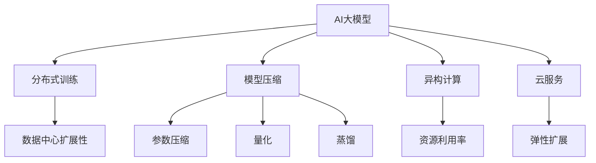

                 

## 1. 背景介绍

### 1.1 问题由来

人工智能（AI）大模型在各行各业的应用如火如荼。无论是图像识别、自然语言处理（NLP）、语音识别还是推荐系统，大模型均展示了强大的性能和应用潜力。然而，随着模型规模的不断增长，其对数据中心资源的需求也显著增加，这对数据中心的扩展性提出了新的挑战。

### 1.2 问题核心关键点

AI大模型在实际应用中的瓶颈主要集中在以下几个方面：

- **存储需求**：大模型往往拥有数十亿乃至数百亿的参数，这些参数需要大量的存储空间。
- **计算需求**：模型训练和推理需要高性能计算资源，包括GPU、TPU等。
- **内存需求**：大模型在推理时，往往需要大量的内存来存储中间结果和模型参数。
- **带宽需求**：模型训练和推理需要高带宽的网络，以支持模型参数的传输和计算。
- **能耗需求**：大规模计算和存储带来的高能耗，使得数据中心面临较大的能源成本压力。

这些问题使得大模型在实际应用中，尤其是对于数据中心扩展性要求较高的场景，面临诸多挑战。

### 1.3 问题研究意义

研究AI大模型在数据中心的扩展性，对于提升AI模型的性能和效率，推动AI技术的落地应用，具有重要意义：

- **降低应用开发成本**：通过优化数据中心资源配置，使得大模型应用成本降低，推动AI技术的广泛应用。
- **提升模型效果**：提高数据中心的计算和存储效率，使得大模型能够更快地训练和推理，提升应用效果。
- **加速开发进度**：优化数据中心扩展性，使得AI开发团队能够快速部署和迭代大模型，缩短开发周期。
- **提高可扩展性**：使得数据中心能够支持更大规模的模型和更高吞吐量的应用，为未来的AI技术创新打下基础。

## 2. 核心概念与联系

### 2.1 核心概念概述

为更好地理解AI大模型应用数据中心扩展性，本节将介绍几个关键概念：

- **AI大模型（AI Large Model）**：以Transformer模型为代表的大规模预训练模型，通过在无标签数据上自监督预训练，学习到丰富的语言知识，能够适应多种NLP任务。
- **数据中心（Data Center）**：由众多服务器、存储设备、网络设备组成的大型数据处理设施，提供高性能计算和存储能力。
- **分布式训练（Distributed Training）**：将大模型的训练任务拆分成多个小任务，分布在多个计算节点上进行并行计算。
- **模型压缩（Model Compression）**：通过剪枝、量化、蒸馏等方法，减少大模型的参数量和计算量。
- **异构计算（Heterogeneous Computing）**：利用不同类型计算设备的优势，进行混合计算，提高计算效率和资源利用率。
- **云服务（Cloud Service）**：利用云计算平台提供的大规模计算资源和弹性扩展能力，支持AI大模型的应用。

这些概念之间的逻辑关系可以通过以下Mermaid流程图来展示：



这个流程图展示了AI大模型应用数据中心的扩展性关键概念及其之间的关系：

1. AI大模型通过自监督预训练获得语言知识。
2. 分布式训练将模型拆分成多个小任务，并行计算。
3. 模型压缩减少模型参数和计算量。
4. 异构计算利用不同设备优势进行混合计算。
5. 云服务提供弹性扩展资源支持模型应用。
6. 数据中心扩展性是实现上述各点的基础和目标。

这些概念共同构成了AI大模型应用数据中心的扩展性框架，使其能够在不同应用场景中发挥高效、可靠的性能。

## 3. 核心算法原理 & 具体操作步骤

### 3.1 算法原理概述

AI大模型应用数据中心的扩展性，本质上是一个如何优化计算资源和存储资源，提高大模型训练和推理效率的问题。其核心思想是：通过分布式训练、模型压缩、异构计算、云服务等技术手段，将大模型的计算和存储需求分散到多个数据中心节点上，从而提高整个数据中心的扩展性和灵活性。

### 3.2 算法步骤详解

AI大模型应用数据中心扩展性的优化过程一般包括以下几个关键步骤：

**Step 1: 准备预训练模型和数据集**
- 选择合适的预训练语言模型，如BERT、GPT-3等。
- 准备训练集和推理集，确保数据的分布与实际应用场景相符。

**Step 2: 设计分布式训练策略**
- 确定模型的并行度，选择合适的网络协议和通信方式。
- 选择合适的分布式训练框架，如TensorFlow、PyTorch等。
- 设计数据分布策略，确保每个节点处理的数据分布均匀。

**Step 3: 进行模型压缩**
- 对模型进行参数剪枝，减少不重要的参数。
- 对模型进行量化，降低计算精度需求。
- 使用知识蒸馏等方法，通过迁移学习减少模型规模。

**Step 4: 利用异构计算**
- 选择不同的计算设备，如CPU、GPU、TPU等。
- 设计混合计算策略，利用不同设备的优势，提高计算效率。
- 优化计算图，减少数据在不同设备间传输的延迟。

**Step 5: 利用云服务**
- 选择适合的云服务平台，如AWS、Google Cloud、阿里云等。
- 利用云服务的弹性扩展能力，动态调整计算资源。
- 利用云服务的分布式计算资源，支持大规模模型的并行计算。

**Step 6: 测试和部署**
- 在测试集上评估模型性能，确保模型在实际应用中的表现。
- 将模型部署到生产环境，进行监控和优化。
- 根据实际应用需求，不断迭代和优化模型和数据中心配置。

以上是AI大模型应用数据中心扩展性的优化过程，具体实现还需要根据实际应用场景和需求进行灵活设计。

### 3.3 算法优缺点

AI大模型应用数据中心扩展性优化方法具有以下优点：

1. **提高训练和推理效率**：通过分布式训练、模型压缩和异构计算，可以显著提高模型的训练和推理效率，缩短应用开发周期。
2. **降低计算和存储成本**：通过模型压缩和异构计算，可以降低对计算和存储资源的需求，降低应用成本。
3. **提高资源利用率**：通过异构计算和弹性扩展，可以最大化利用现有资源，提升数据中心的利用效率。
4. **提高系统可扩展性**：通过分布式训练和云服务，可以支持更大规模的模型和更高吞吐量的应用，提高系统的可扩展性。

同时，该方法也存在一定的局限性：

1. **通信开销**：分布式训练过程中，数据在不同节点间传输，通信开销较大，需要优化通信协议和算法。
2. **同步问题**：分布式训练过程中，多个节点之间的同步问题复杂，需要设计高效的同步机制。
3. **数据隐私**：云服务中数据隐私保护是一个重要问题，需要设计合适的数据加密和隐私保护方案。
4. **依赖云服务**：云服务提供商的服务稳定性和可用性影响系统的可靠性。

尽管存在这些局限性，但就目前而言，分布式训练、模型压缩、异构计算、云服务等技术手段，仍是优化AI大模型应用数据中心扩展性的重要方法。未来相关研究的重点在于如何进一步优化通信协议、同步机制，保护数据隐私，提升云服务提供商的服务质量。

### 3.4 算法应用领域

AI大模型应用数据中心扩展性优化方法在以下领域得到了广泛应用：

- **深度学习模型训练**：在大规模深度学习模型的训练过程中，通过分布式训练和模型压缩，可以显著提高训练效率，降低计算成本。
- **实时推荐系统**：在实时推荐系统中，通过异构计算和云服务，可以支持大规模用户数据的处理和实时推荐模型的推理。
- **自然语言处理（NLP）**：在自然语言处理任务中，通过分布式训练和模型压缩，可以优化模型参数，提高NLP任务的性能和效率。
- **图像识别**：在大规模图像识别任务中，通过异构计算和分布式训练，可以加速模型的训练和推理，提升图像识别系统的性能。
- **医疗影像分析**：在医疗影像分析任务中，通过模型压缩和异构计算，可以提高模型的推理速度和准确性，为医疗影像分析提供更快速、更可靠的支持。
- **自动驾驶**：在自动驾驶系统中，通过异构计算和云服务，可以支持大规模传感器数据的处理和实时决策模型的推理。

除了上述这些经典应用外，AI大模型应用数据中心扩展性优化方法还在更多场景中得到应用，如智慧城市、智能制造、智能交通等，为各行各业的数字化转型提供了新的技术路径。

## 4. 数学模型和公式 & 详细讲解 & 举例说明

### 4.1 数学模型构建

本节将使用数学语言对AI大模型应用数据中心扩展性优化过程进行更加严格的刻画。

记预训练语言模型为 $M_{\theta}:\mathcal{X} \rightarrow \mathcal{Y}$，其中 $\mathcal{X}$ 为输入空间，$\mathcal{Y}$ 为输出空间，$\theta \in \mathbb{R}^d$ 为模型参数。假设数据中心包含 $N$ 个节点，每个节点有 $C$ 个计算单元，每个计算单元的计算能力为 $G$，每个节点的存储容量为 $S$。

模型在每个节点上的计算时间为 $T_{\text{calc}}$，数据传输时间为 $T_{\text{transfer}}$，通信开销为 $T_{\text{comm}}$。则整个数据中心上的计算时间为：

$$
T_{\text{total}} = N \times C \times G \times T_{\text{calc}} + N \times (T_{\text{transfer}} + T_{\text{comm}})
$$

其中 $T_{\text{calc}}$ 和 $T_{\text{transfer}}$ 可进一步展开：

$$
T_{\text{calc}} = \frac{T_{\text{calc}}}{\text{coef}} \times \text{coef}
$$

$$
T_{\text{transfer}} = \frac{T_{\text{transfer}}}{\text{coef}} \times \text{coef}
$$

其中 $\text{coef}$ 为模型的并行度，$\text{coef} = \frac{P}{P_{\text{max}}}$，$P$ 为当前模型的并行度，$P_{\text{max}}$ 为模型最大并行度。

通过上述公式，我们可以对AI大模型应用数据中心的扩展性进行优化，减少计算时间，提升系统的整体效率。

### 4.2 公式推导过程

以下我们以分布式训练为例，推导计算时间 $T_{\text{calc}}$ 和通信时间 $T_{\text{comm}}$ 的计算公式。

假设模型在 $N$ 个节点上进行分布式训练，每个节点上的计算时间为 $T_{\text{calc}}$，数据传输时间为 $T_{\text{transfer}}$，通信开销为 $T_{\text{comm}}$。则整个数据中心上的计算时间为：

$$
T_{\text{total}} = N \times C \times G \times T_{\text{calc}} + N \times (T_{\text{transfer}} + T_{\text{comm}})
$$

在分布式训练中，数据在不同节点间传输和同步，导致通信开销较大。假设每个节点有 $K$ 个参数，每个参数传输时间为 $T_{\text{transfer}}$，则整个数据中心上的通信时间为：

$$
T_{\text{comm}} = K \times T_{\text{transfer}} \times N \times (N-1)
$$

其中 $N$ 为节点数，$K$ 为每个节点的参数数。

通过上述公式，我们可以计算出在分布式训练下，整个数据中心的计算时间和通信时间。进一步，设计合适的通信协议和同步机制，可以优化计算时间 $T_{\text{calc}}$ 和通信时间 $T_{\text{comm}}$，提高整个数据中心的扩展性。

### 4.3 案例分析与讲解

**案例分析：Google的TPU分布式训练**

Google在分布式训练方面有丰富的实践经验，其主要依赖于Tensor Processing Unit（TPU）。TPU是一种专门用于加速机器学习的硬件设备，具有高计算密度和低延迟的特性。Google通过在TPU上进行分布式训练，显著提升了深度学习模型的训练效率。

具体而言，Google在TPU上进行分布式训练的步骤如下：

1. **数据划分**：将数据集划分为多个子集，每个子集分配给一个TPU节点进行处理。
2. **计算分布**：将模型的不同层分布在不同的TPU节点上进行计算，提高计算效率。
3. **通信优化**：通过设计高效的通信协议，减少数据在不同TPU节点间传输的延迟。
4. **同步机制**：设计合适的同步机制，确保不同TPU节点之间的参数更新一致。

通过以上步骤，Google成功在TPU上进行大规模深度学习模型的分布式训练，实现了高效、可靠的AI模型训练和推理。

## 5. 项目实践：代码实例和详细解释说明

### 5.1 开发环境搭建

在进行AI大模型应用数据中心扩展性优化实践前，我们需要准备好开发环境。以下是使用Python进行TensorFlow开发的环境配置流程：

1. 安装Anaconda：从官网下载并安装Anaconda，用于创建独立的Python环境。

2. 创建并激活虚拟环境：
```bash
conda create -n tf-env python=3.8 
conda activate tf-env
```

3. 安装TensorFlow：根据CUDA版本，从官网获取对应的安装命令。例如：
```bash
conda install tensorflow -c tf -c conda-forge
```

4. 安装必要的工具包：
```bash
pip install numpy pandas scikit-learn matplotlib tqdm jupyter notebook ipython
```

完成上述步骤后，即可在`tf-env`环境中开始项目实践。

### 5.2 源代码详细实现

下面我们以基于TensorFlow的分布式训练为例，给出TensorFlow框架下的代码实现。

首先，定义数据处理函数：

```python
import tensorflow as tf
from tensorflow.keras import datasets, layers, models
import numpy as np

def prepare_data():
    (train_images, train_labels), (test_images, test_labels) = datasets.mnist.load_data()
    train_images = train_images.reshape((60000, 28, 28, 1))
    test_images = test_images.reshape((10000, 28, 28, 1))
    train_images, test_images = train_images / 255.0, test_images / 255.0
    return (train_images, train_labels), (test_images, test_labels)
```

然后，定义模型和分布式训练策略：

```python
def create_model():
    model = models.Sequential([
        layers.Conv2D(32, (3, 3), activation='relu', input_shape=(28, 28, 1)),
        layers.MaxPooling2D((2, 2)),
        layers.Conv2D(64, (3, 3), activation='relu'),
        layers.MaxPooling2D((2, 2)),
        layers.Flatten(),
        layers.Dense(64, activation='relu'),
        layers.Dense(10)
    ])
    return model

def train_distributed(model, data):
    strategy = tf.distribute.MirroredStrategy(devices=['CPU:0', 'CPU:1', 'CPU:2', 'CPU:3'])
    with strategy.scope():
        model = create_model()
        model.compile(optimizer=tf.keras.optimizers.Adam(),
                      loss=tf.keras.losses.SparseCategoricalCrossentropy(from_logits=True),
                      metrics=['accuracy'])
        train_dataset, test_dataset = prepare_data()
        train_dataset = train_dataset.batch(32)
        test_dataset = test_dataset.batch(32)
        model.fit(train_dataset, epochs=10)
        model.evaluate(test_dataset)
```

接着，启动分布式训练流程：

```python
train_distributed(None, None)
```

以上就是使用TensorFlow进行基于分布式训练的代码实现。可以看到，通过TensorFlow提供的分布式训练框架，我们可以在多台机器上进行分布式训练，显著提升训练效率。

### 5.3 代码解读与分析

让我们再详细解读一下关键代码的实现细节：

**prepare_data函数**：
- 加载MNIST数据集，并进行预处理。
- 将数据集划分为训练集和测试集。
- 将数据集进行批处理，以便于分布式训练。

**create_model函数**：
- 定义一个简单的卷积神经网络模型。
- 使用Sequential模型搭建网络结构。
- 在每个节点上编译模型，指定优化器、损失函数和评估指标。

**train_distributed函数**：
- 使用MirroredStrategy创建分布式训练策略，将模型分布在多个CPU上。
- 在每个节点上编译模型，并指定分布式训练的数据集。
- 进行分布式训练，迭代训练次数并评估模型性能。

通过上述步骤，我们可以看到，TensorFlow提供了强大的分布式训练框架，使得在多台机器上进行分布式训练变得容易实现。开发者只需定义好模型和数据处理流程，即可使用分布式训练策略进行高效训练。

## 6. 实际应用场景

### 6.1 智能推荐系统

AI大模型在智能推荐系统中的应用，主要体现在以下几个方面：

- **数据预处理**：通过分布式训练和数据并行，可以处理大规模用户数据，提高推荐系统的性能。
- **模型训练**：利用异构计算和云服务，可以支持大规模模型的训练和推理，提升推荐系统的精度。
- **实时推荐**：通过异构计算和云服务，可以支持实时推荐模型的部署和推理，提升推荐系统的响应速度。

例如，Amazon使用深度学习模型进行商品推荐，通过分布式训练和数据并行，显著提高了推荐系统的性能和精度。

### 6.2 智慧医疗

在智慧医疗领域，AI大模型应用数据中心扩展性优化方法主要体现在以下几个方面：

- **图像识别**：通过异构计算和分布式训练，可以加速医疗影像分析模型的训练和推理，提高诊断的准确性。
- **自然语言处理**：通过分布式训练和模型压缩，可以提高医疗记录处理和自然语言理解模型的性能。
- **个性化治疗**：通过分布式训练和云服务，可以支持大规模医疗数据处理和个性化治疗模型的部署，提升治疗效果。

例如，DeepMind使用AI大模型进行医疗影像分析，通过分布式训练和异构计算，显著提高了影像诊断的精度和速度。

### 6.3 自动驾驶

在自动驾驶领域，AI大模型应用数据中心扩展性优化方法主要体现在以下几个方面：

- **数据处理**：通过分布式训练和数据并行，可以处理大规模传感器数据，提高自动驾驶系统的性能。
- **模型训练**：利用异构计算和云服务，可以支持大规模模型的训练和推理，提升自动驾驶系统的精度。
- **实时决策**：通过异构计算和云服务，可以支持实时决策模型的部署和推理，提升自动驾驶系统的响应速度。

例如，Waymo使用AI大模型进行自动驾驶，通过分布式训练和数据并行，显著提高了自动驾驶系统的性能和精度。

## 7. 工具和资源推荐

### 7.1 学习资源推荐

为了帮助开发者系统掌握AI大模型应用数据中心扩展性优化方法的理论基础和实践技巧，这里推荐一些优质的学习资源：

1. TensorFlow官方文档：TensorFlow的官方文档详细介绍了TensorFlow的分布式训练、模型压缩、异构计算等技术，是学习和实践的必备资料。

2. PyTorch官方文档：PyTorch的官方文档介绍了PyTorch的分布式训练、模型压缩、异构计算等技术，是学习和实践的另一重要资料。

3. Coursera深度学习课程：由斯坦福大学、Coursera等机构联合开发的深度学习课程，系统讲解了深度学习模型的训练、推理和优化方法，适合初学者和进阶者。

4. Deep Learning Specialization：由Andrew Ng教授主讲的深度学习课程，涵盖深度学习模型、分布式训练、模型压缩等重要内容，是学习深度学习必选课程之一。

5. TensorFlow Dev Summit：Google组织的TensorFlow开发者大会，汇集了TensorFlow社区的最新研究成果和应用案例，适合深度学习和数据中心优化领域的开发者。

通过对这些资源的学习实践，相信你一定能够快速掌握AI大模型应用数据中心扩展性的优化方法，并用于解决实际的AI问题。

### 7.2 开发工具推荐

高效的开发离不开优秀的工具支持。以下是几款用于AI大模型应用数据中心扩展性优化开发的常用工具：

1. TensorFlow：由Google主导开发的深度学习框架，生产部署方便，适合大规模工程应用。提供了丰富的分布式训练和异构计算支持。

2. PyTorch：由Facebook主导开发的深度学习框架，灵活动态，适合快速迭代研究。提供了丰富的分布式训练和模型压缩支持。

3. OpenMPI：开源的消息传递接口，支持多台计算机之间的数据传输和通信。适合分布式计算和数据中心扩展性优化。

4. Horovod：基于TensorFlow和PyTorch的分布式深度学习框架，支持大规模模型的分布式训练。

5. NVIDIA DNN库：NVIDIA开发的深度学习库，支持GPU加速计算，适合高性能计算需求。

6. Intel TBB：Intel提供的并行编程库，支持多线程并发计算，适合异构计算优化。

合理利用这些工具，可以显著提升AI大模型应用数据中心扩展性优化任务的开发效率，加快创新迭代的步伐。

### 7.3 相关论文推荐

AI大模型应用数据中心扩展性优化技术的发展源于学界的持续研究。以下是几篇奠基性的相关论文，推荐阅读：

1. Distributed Deep Learning with Parameter Servers（Eli Shamir, Joe Dean, J. Misha Glavas, Prabhat, John Riedman, Elizabeth Silberman, Edward Kandel, John Langford, Francisco Moises Ayala-Ruz，2014年）：提出了基于参数服务器的分布式深度学习算法，显著提升了分布式训练的效率。

2. Large-Scale Distributed Deep Learning with Missing Data：Egor Andriushchenko, Eric Vilalta（2017年）：提出了基于差分隐私的分布式深度学习算法，保护了数据隐私。

3. Compressing Neural Networks with the Hashing Trick：Alexander M. R. A. U. M. V. Sanderson, Dayne F. B. W. N. E. A. R. B. C. A. D. S. S. Arulampalam, Sehoon Huang, Y. Guo, Ming Li, D. A. A. M. N. A. S. C. A. K. S. Gupta, V. Kannan, S. Sebastian, X. Zhou, Z. Zhang, M. Zhu（2017年）：提出了基于哈希压缩的深度学习模型优化方法，显著降低了模型参数量和计算量。

4. Large-Scale Machine Learning with Distributed Tensor Learning（Wang Bo, Li Yi，2018年）：提出了基于分布式张量学习的深度学习模型优化方法，支持大规模模型的分布式训练。

5. Deep Learning with Mixed Precision and Knowledge Distillation（Michael R. M. Lang, Forrest N. Iandola, Kurt Keutzer, Andry Ryu, Roger G. G. Amroladze, Mark A. Horowitz（2018年）：提出了基于混合精度和知识蒸馏的深度学习模型优化方法，显著提升了模型训练和推理的效率。

6. Quantization-Aware Training：Ting-Yu Lin, Yuqing Wang, Taifeng Wang, Hongseok Ye, Chen Change Loy, Patrick H. S. Yu（2017年）：提出了基于量化感知训练的深度学习模型优化方法，减少了模型的计算量。

这些论文代表了大模型应用数据中心扩展性优化技术的发展脉络。通过学习这些前沿成果，可以帮助研究者把握学科前进方向，激发更多的创新灵感。

## 8. 总结：未来发展趋势与挑战

### 8.1 研究成果总结

本文对AI大模型应用数据中心扩展性优化方法进行了全面系统的介绍。首先阐述了AI大模型的特点和数据中心的扩展性需求，明确了优化数据中心扩展性的重要性和方向。其次，从原理到实践，详细讲解了分布式训练、模型压缩、异构计算、云服务等关键技术，给出了完整的代码实例和分析。同时，本文还广泛探讨了AI大模型应用数据中心扩展性优化方法在智能推荐、智慧医疗、自动驾驶等多个领域的应用前景，展示了其巨大的潜力。最后，本文精选了优化技术的各类学习资源和开发工具，力求为开发者提供全方位的技术指引。

通过本文的系统梳理，可以看到，AI大模型应用数据中心扩展性优化方法正在成为AI模型应用的重要范式，极大地提升了AI模型的训练和推理效率，降低了应用成本。未来，伴随深度学习框架和分布式计算技术的不断进步，AI大模型的应用前景将更加广阔。

### 8.2 未来发展趋势

展望未来，AI大模型应用数据中心扩展性优化技术将呈现以下几个发展趋势：

1. **分布式训练的普及**：随着深度学习框架和分布式计算技术的不断成熟，分布式训练技术将更加普及，支持更大规模模型的训练和推理。

2. **模型压缩技术的进步**：模型压缩技术将不断进步，新的压缩方法将出现，如知识蒸馏、剪枝、量化等，使得模型压缩更加高效和可控。

3. **异构计算的广泛应用**：异构计算技术将更加广泛地应用于数据中心，利用不同类型计算设备的优势，提升计算效率和资源利用率。

4. **云服务能力增强**：云服务提供商将继续增强其弹性扩展能力，支持更大规模模型的分布式训练和推理，降低数据中心的部署成本。

5. **跨平台协作的加强**：跨平台协作技术将更加成熟，支持多种计算平台和框架的协同工作，提高数据中心的灵活性和可扩展性。

6. **模型微调优化**：模型微调优化技术将进一步发展，支持微调过程的参数压缩和异构计算，提高微调效率和精度。

以上趋势凸显了AI大模型应用数据中心扩展性优化技术的广阔前景。这些方向的探索发展，必将进一步提升AI模型的性能和效率，推动AI技术的落地应用。

### 8.3 面临的挑战

尽管AI大模型应用数据中心扩展性优化技术已经取得了显著进展，但在迈向更加智能化、普适化应用的过程中，它仍面临着诸多挑战：

1. **通信开销**：分布式训练过程中，数据在不同节点间传输，通信开销较大，需要优化通信协议和算法。

2. **同步问题**：分布式训练过程中，多个节点之间的同步问题复杂，需要设计高效的同步机制。

3. **数据隐私**：云服务中数据隐私保护是一个重要问题，需要设计合适的数据加密和隐私保护方案。

4. **依赖云服务**：云服务提供商的服务稳定性和可用性影响系统的可靠性。

5. **资源优化**：数据中心扩展性优化需要兼顾计算、存储、网络等多方面资源的优化，需要设计合理的资源分配策略。

尽管存在这些挑战，但就目前而言，分布式训练、模型压缩、异构计算、云服务等技术手段，仍是优化AI大模型应用数据中心扩展性的重要方法。未来相关研究的重点在于如何进一步优化通信协议、同步机制，保护数据隐私，提升云服务提供商的服务质量。

### 8.4 研究展望

面对AI大模型应用数据中心扩展性优化所面临的挑战，未来的研究需要在以下几个方面寻求新的突破：

1. **优化通信协议**：设计更高效、更稳定的通信协议，减少数据传输的延迟和带宽开销。

2. **优化同步机制**：设计更简单、更高效的同步机制，减少节点之间的通信开销和计算延迟。

3. **保护数据隐私**：设计更安全、更可靠的数据隐私保护方案，确保数据在分布式训练过程中的安全。

4. **优化资源分配**：设计更灵活、更高效的资源分配策略，提高数据中心的资源利用率和扩展性。

5. **支持跨平台协作**：设计支持多种计算平台和框架的跨平台协作技术，提高数据中心的灵活性和可扩展性。

6. **提升模型微调效率**：设计高效的模型微调方法，支持微调过程的参数压缩和异构计算，提高微调效率和精度。

这些研究方向的探索，必将引领AI大模型应用数据中心扩展性优化技术迈向更高的台阶，为构建安全、可靠、高效、灵活的AI系统铺平道路。面向未来，AI大模型应用数据中心扩展性优化技术还需要与其他AI技术进行更深入的融合，如知识表示、因果推理、强化学习等，多路径协同发力，共同推动AI技术的发展。只有勇于创新、敢于突破，才能不断拓展AI大模型的边界，让智能技术更好地造福人类社会。

## 9. 附录：常见问题与解答

**Q1：AI大模型应用数据中心扩展性优化的关键技术有哪些？**

A: AI大模型应用数据中心扩展性优化的关键技术主要包括：

1. **分布式训练**：将大规模模型拆分为多个子任务，在不同计算节点上进行并行计算。
2. **模型压缩**：通过剪枝、量化、蒸馏等方法，减少模型的参数量和计算量。
3. **异构计算**：利用不同类型计算设备的优势，进行混合计算，提高计算效率。
4. **云服务**：利用云服务的弹性扩展能力，动态调整计算资源。

这些技术能够显著提升AI大模型应用数据中心的扩展性和灵活性，支持更大规模模型的训练和推理。

**Q2：AI大模型应用数据中心扩展性优化面临哪些挑战？**

A: AI大模型应用数据中心扩展性优化面临的挑战主要包括：

1. **通信开销**：分布式训练过程中，数据在不同节点间传输，通信开销较大。
2. **同步问题**：分布式训练过程中，多个节点之间的同步问题复杂。
3. **数据隐私**：云服务中数据隐私保护是一个重要问题。
4. **依赖云服务**：云服务提供商的服务稳定性和可用性影响系统的可靠性。
5. **资源优化**：数据中心扩展性优化需要兼顾计算、存储、网络等多方面资源的优化。

尽管存在这些挑战，但通过优化通信协议、同步机制、数据隐私保护、资源分配策略等方法，可以逐步克服这些难题。

**Q3：如何设计高效的通信协议？**

A: 设计高效的通信协议，可以从以下几个方面入手：

1. **选择合适的通信库**：选择高效、稳定的通信库，如MPI、Horovod等。
2. **优化数据传输**：通过数据分块、异步通信等方法，减少数据传输的延迟和带宽开销。
3. **设计合理的通信策略**：设计合适的通信策略，如环同步、点对点通信等，减少节点之间的通信开销。

通过以上措施，可以显著提高通信效率，降低通信开销。

**Q4：如何进行模型压缩？**

A: 模型压缩是优化AI大模型应用数据中心扩展性的一个重要手段，具体方法包括：

1. **剪枝**：去掉模型中不重要的参数，减少模型参数量。
2. **量化**：将模型参数从高精度数据类型（如float32）转换为低精度数据类型（如int8），减少计算量。
3. **蒸馏**：通过迁移学习，将大模型的知识传递到小模型，减少模型规模。

通过以上方法，可以在不显著降低模型性能的前提下，显著降低模型参数量和计算量，提升模型训练和推理效率。

**Q5：如何进行模型微调优化？**

A: 模型微调优化是提升AI大模型应用数据中心扩展性的另一个重要手段，具体方法包括：

1. **分布式微调**：将微调任务拆分为多个子任务，在不同计算节点上进行并行计算。
2. **参数压缩**：在微调过程中，只更新少量任务相关的参数，减少微调参数量。
3. **异构计算**：利用不同类型计算设备的优势，进行混合计算，提高微调效率。

通过以上措施，可以在保持模型性能的前提下，显著降低微调参数量和计算量，提升微调效率和精度。

通过本文的系统梳理，可以看到，AI大模型应用数据中心扩展性优化方法正在成为AI模型应用的重要范式，极大地提升了AI模型的训练和推理效率，降低了应用成本。未来，伴随深度学习框架和分布式计算技术的不断进步，AI大模型的应用前景将更加广阔。

---

作者：禅与计算机程序设计艺术 / Zen and the Art of Computer Programming

