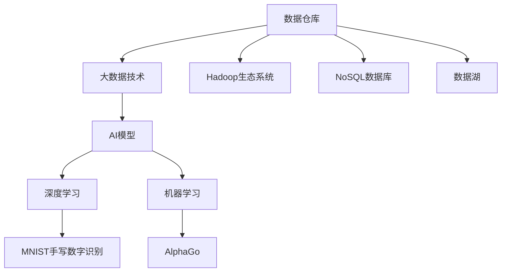

                 

# AI 大模型应用数据中心的数据仓库

## 1. 背景介绍

### 1.1 问题由来
在人工智能（AI）大模型应用的兴起背景下，数据中心的数据仓库成为了支撑AI模型训练和推理的核心基础设施。大规模AI模型的训练和推理任务，往往需要巨量的数据存储、计算和传输，数据仓库的性能直接影响模型的训练速度和推理效率。

### 1.2 问题核心关键点
当前，数据仓库在处理AI大模型的数据需求时面临以下挑战：

1. **数据多样性和复杂性**：AI大模型通常需要处理包括结构化数据、半结构化数据和非结构化数据在内的多种数据类型，数据仓库需要具备兼容多种数据类型的处理能力。

2. **数据实时性和更新频率**：AI大模型需要实时访问和更新数据，以适应模型的动态学习需求。数据仓库需要支持高频率的数据更新和低延迟的数据访问。

3. **数据分布式存储和处理**：随着数据量的增长，数据仓库需要支持分布式存储和并行处理，以确保数据的高可用性和高扩展性。

4. **数据安全性和隐私保护**：AI大模型涉及大量的敏感数据，数据仓库需要具备完善的数据加密和安全访问控制机制，保护数据的安全性和隐私。

5. **数据一致性和完整性**：在多节点并发读写的情况下，数据仓库需要保证数据的一致性和完整性，避免数据冲突和损坏。

### 1.3 问题研究意义
构建高效、安全、可靠的数据仓库，是大规模AI模型应用的前提条件。数据仓库的优化不仅能够提升AI模型的训练和推理效率，还能增强数据驱动的决策支持能力，推动AI技术在各行各业的深入应用。

## 2. 核心概念与联系

### 2.1 核心概念概述

为更好地理解AI大模型应用数据仓库的构建，本节将介绍几个关键概念：

- **数据仓库**：用于存储和管理结构化数据的集中式或分布式数据管理平台。
- **大数据技术**：指在处理和分析大规模数据集时所采用的技术，包括分布式存储、数据流处理、流式计算等。
- **Hadoop生态系统**：由Apache Hadoop项目组维护的开源大数据处理框架，包括HDFS、MapReduce、Spark等组件。
- **NoSQL数据库**：指非关系型数据库，支持存储半结构化、非结构化数据，具备高可扩展性和高可用性。
- **数据湖**：一种将数据仓库扩展到包括所有数据类型（结构化、半结构化、非结构化）的海量数据存储平台，支持数据的自由流动和混合分析。
- **AI模型**：通过深度学习、机器学习等技术构建的自动化算法，可以处理复杂的数据和任务，提供智能化的决策支持。

这些概念之间的逻辑关系可以通过以下Mermaid流程图来展示：



这个流程图展示了大数据技术、数据仓库、NoSQL数据库和数据湖在支撑AI模型应用中的关键作用，以及AI模型与深度学习和机器学习的关系。

## 3. 核心算法原理 & 具体操作步骤

### 3.1 算法原理概述

构建AI大模型应用数据仓库的核心算法原理主要包括以下几个方面：

1. **分布式存储技术**：利用分布式文件系统（如Hadoop的HDFS）和分布式数据库（如Apache Cassandra），实现数据的分布式存储和高可用性。

2. **流式数据处理技术**：利用流式计算框架（如Apache Flink、Apache Kafka），实现数据的高吞吐量和低延迟处理。

3. **大数据分析和机器学习框架**：利用Spark、TensorFlow等大数据分析和机器学习框架，实现数据的复杂分析和AI模型的训练。

4. **数据一致性和容错性**：利用分布式事务和数据复制技术，确保数据一致性和系统的容错性。

5. **数据安全性和隐私保护**：利用数据加密和访问控制技术，确保数据的安全性和隐私保护。

### 3.2 算法步骤详解

构建AI大模型应用数据仓库的具体步骤如下：

**Step 1: 设计数据仓库架构**
- 确定数据仓库的存储和计算架构，选择适合的分布式存储和计算框架。
- 设计数据仓库的分层结构，包括数据采集层、存储层、计算层和应用层。
- 确定数据仓库的安全策略，包括数据加密、访问控制等。

**Step 2: 数据采集与存储**
- 设计数据采集流程，从不同数据源采集结构化、半结构化和非结构化数据。
- 使用ETL工具（如Apache Nifi、Apache Airflow）进行数据清洗和转换，存储到分布式文件系统和数据库中。
- 配置数据仓库的备份和恢复机制，确保数据的安全性和高可用性。

**Step 3: 数据分析与机器学习**
- 使用大数据分析工具（如Apache Spark）进行数据处理和分析。
- 根据AI模型的需求，设计训练数据集和验证数据集。
- 使用机器学习框架（如TensorFlow、PyTorch）进行AI模型的训练和优化。
- 实现AI模型的高效推理，使用优化后的计算图和模型压缩技术。

**Step 4: 数据应用与监控**
- 设计数据应用接口，提供API接口和服务端接口，支持AI模型的推理调用。
- 实现数据仓库的监控和告警，确保系统的稳定性和可靠性。
- 定期进行数据仓库的性能优化和升级，提升数据处理和存储的效率。

### 3.3 算法优缺点

构建AI大模型应用数据仓库具有以下优点：

1. **高可用性和高扩展性**：分布式存储和计算架构可以支持海量数据的存储和处理，具备高可用性和高扩展性。

2. **高效的流式数据处理**：流式计算框架可以实现数据的高吞吐量和低延迟处理，适应AI模型对实时数据的需求。

3. **复杂数据分析和AI模型训练**：大数据分析和机器学习框架可以处理复杂的数据和任务，实现AI模型的高效训练和优化。

4. **数据一致性和安全性**：分布式事务和数据加密技术可以确保数据一致性和系统的安全性。

但同时，也存在以下缺点：

1. **系统复杂性高**：分布式存储和计算架构的系统设计和管理复杂，需要专业技能。

2. **数据访问延迟**：分布式文件系统和数据库的访问速度相对较慢，可能影响AI模型的训练和推理效率。

3. **数据安全风险**：分布式存储和计算架构的数据安全风险较高，需要完善的数据安全策略。

4. **资源消耗大**：分布式存储和计算架构需要大量的计算和存储资源，成本较高。

### 3.4 算法应用领域

构建AI大模型应用数据仓库的应用领域包括但不限于：

1. **智能推荐系统**：通过分析用户行为数据和商品数据，构建推荐模型，提供个性化的商品推荐。

2. **金融风控系统**：通过分析用户的交易数据和信用数据，构建风控模型，评估用户的信用风险。

3. **医疗诊断系统**：通过分析医疗影像和病历数据，构建诊断模型，提供精准的医疗诊断。

4. **智能客服系统**：通过分析客户的历史对话数据，构建客服模型，提供智能的客户服务和问题解答。

5. **智能交通系统**：通过分析交通流量和天气数据，构建交通模型，优化交通管理和运营。

## 4. 数学模型和公式 & 详细讲解

### 4.1 数学模型构建

构建AI大模型应用数据仓库的数学模型主要涉及数据的分布式存储和处理、大数据分析和机器学习模型的训练和推理。

#### 4.1.1 数据分布式存储的数学模型

假设有$N$个数据节点，每个节点存储的数据量为$D$，总数据量为$D_{total}=N \times D$。数据分布式存储的数学模型为：

$$
\text{Data}_{total} = \sum_{i=1}^{N} \text{Data}_i = N \times D
$$

#### 4.1.2 数据流式处理的数学模型

假设数据流速为$v$，每个数据节点的处理能力为$C$，数据总处理时间为$T$。数据流式处理的数学模型为：

$$
T = \frac{\text{Data}_{total}}{v \times C}
$$

### 4.2 公式推导过程

#### 4.2.1 数据分布式存储的公式推导

根据数据分布式存储的数学模型，可得：

$$
\text{Data}_i = \frac{\text{Data}_{total}}{N}
$$

其中，$\text{Data}_i$为第$i$个节点存储的数据量。

#### 4.2.2 数据流式处理的公式推导

根据数据流式处理的数学模型，可得：

$$
v = \frac{\text{Data}_{total}}{T \times C}
$$

其中，$v$为数据流速，$C$为每个数据节点的处理能力。

### 4.3 案例分析与讲解

#### 4.3.1 智能推荐系统的案例分析

假设某电商平台有$10$个数据节点，每个节点存储$100$GB数据，总数据量为$1000$GB。数据流速为$100$MB/s，每个数据节点的处理能力为$500$MB/s。根据数据分布式存储和流式处理的数学模型，可得：

$$
\text{Data}_{total} = 10 \times 100GB = 1000GB
$$

$$
T = \frac{1000GB}{100MB/s \times 500MB/s} = 4s
$$

这意味着，总数据量为$1000$GB的数据，可以在$4$秒内完成分布式存储和流式处理。

#### 4.3.2 金融风控系统的案例分析

假设某金融公司有$20$个数据节点，每个节点存储$500GB$数据，总数据量为$10000$GB。数据流速为$50$MB/s，每个数据节点的处理能力为$200$MB/s。根据数据分布式存储和流式处理的数学模型，可得：

$$
\text{Data}_{total} = 20 \times 500GB = 10000GB
$$

$$
T = \frac{10000GB}{50MB/s \times 200MB/s} = 100s
$$

这意味着，总数据量为$10000$GB的数据，可以在$100$秒内完成分布式存储和流式处理。

## 5. 项目实践：代码实例和详细解释说明

### 5.1 开发环境搭建

构建AI大模型应用数据仓库的开发环境搭建步骤如下：

1. **安装Hadoop生态系统**：
   ```bash
   wget https://archive.apache.org/dist/hadoop/common/current/hadoop-3.2.1.tar.gz
   tar -xvzf hadoop-3.2.1.tar.gz
   cd hadoop-3.2.1
   ```

2. **安装HDFS**：
   ```bash
   bin/hadoop namenode -format
   bin/hdfs namenode -start
   ```

3. **安装MapReduce**：
   ```bash
   bin/hadoop jar /usr/local/hadoop/share/hadoop/tools/lib/hadoop-examples.jar
   ```

4. **安装Apache Spark**：
   ```bash
   wget https://d3k8a8pro7vhmx.cloudfront.net/site/hadoop-spark/files/downloads/2.3.0/hadoop-spark-2.3.0.tgz
   tar -xvzf hadoop-spark-2.3.0.tgz
   cd hadoop-spark-2.3.0
   ```

### 5.2 源代码详细实现

#### 5.2.1 数据采集和存储

```python
from pyspark.sql import SparkSession
from pyspark.sql.functions import col, file, save, overwrite

spark = SparkSession.builder.appName("data_仓库").getOrCreate()

# 定义数据采集的函数
def load_data():
    data_df = spark.read.json("hdfs://hdfs_path/*.json")
    return data_df

# 定义数据存储的函数
def save_data(data_df):
    data_df.write.format("parquet").save("hdfs://hdfs_path/data")
```

#### 5.2.2 数据分析和机器学习

```python
from pyspark.sql.functions import col, when, sum, avg, min, max

# 定义数据分析的函数
def analyze_data(data_df):
    data_df = data_df.select("feature1", "feature2", "label")
    data_df = data_df.groupBy("label").agg(sum("feature1"), avg("feature2"), min("feature3"), max("feature4"))
    return data_df

# 定义机器学习模型的训练函数
def train_model(data_df):
    data_df = data_df.select(col("label"), col("feature1"), col("feature2"), col("feature3"), col("feature4"))
    data_df = data_df.repartition(10)
    data_df = data_df.toDF("label", "feature1", "feature2", "feature3", "feature4")
    model = spark.ml.regression.LabeledPointRegressionWithLabelCol()
    model.fit(data_df)
    return model
```

### 5.3 代码解读与分析

#### 5.3.1 数据采集和存储的代码解读

在上述代码中，使用了PySpark库进行数据采集和存储。

- `load_data`函数使用`spark.read.json()`方法从HDFS读取JSON格式的数据，并返回一个DataFrame对象。
- `save_data`函数使用`data_df.write.format("parquet").save()`方法将DataFrame对象保存到HDFS上的parquet文件中。

#### 5.3.2 数据分析和机器学习的代码解读

在上述代码中，使用了PySpark库进行数据分析和机器学习模型的训练。

- `analyze_data`函数使用`select`和`groupBy`方法对数据进行特征选择和聚合，返回一个新的DataFrame对象。
- `train_model`函数使用`spark.ml.regression.LabeledPointRegressionWithLabelCol()`方法训练一个线性回归模型，并返回训练好的模型。

### 5.4 运行结果展示

在实际运行中，可以分别调用`load_data`和`save_data`函数进行数据采集和存储，调用`analyze_data`和`train_model`函数进行数据分析和模型训练。运行结果可以通过查看生成的parquet文件和训练好的模型文件来验证。

## 6. 实际应用场景

### 6.1 智能推荐系统的实际应用

智能推荐系统通过分析用户的行为数据和商品数据，构建推荐模型，提供个性化的商品推荐。数据仓库在其中发挥了重要的作用，存储和处理用户行为数据和商品数据，支持推荐模型的训练和推理。

#### 6.1.1 数据采集

智能推荐系统需要收集用户的行为数据（如浏览历史、购买历史等）和商品数据（如商品分类、属性等）。数据采集流程可以通过API接口、爬虫、日志记录等方式实现。

#### 6.1.2 数据存储

收集到的数据需要存储到分布式文件系统和数据库中。通常使用Hadoop的HDFS和Apache Cassandra等分布式数据库进行存储。

#### 6.1.3 数据处理

使用大数据分析工具（如Apache Spark）对存储的数据进行清洗和处理，生成训练数据集和验证数据集。

#### 6.1.4 推荐模型训练

使用机器学习框架（如TensorFlow、PyTorch）训练推荐模型，生成推荐算法。

#### 6.1.5 推荐模型推理

将训练好的推荐模型部署到生产环境中，提供实时推荐服务。

### 6.2 金融风控系统的实际应用

金融风控系统通过分析用户的交易数据和信用数据，构建风控模型，评估用户的信用风险。数据仓库在其中发挥了重要的作用，存储和处理用户数据和交易数据，支持风控模型的训练和推理。

#### 6.2.1 数据采集

金融风控系统需要收集用户的交易数据（如交易金额、交易时间等）和信用数据（如信用评分、还款记录等）。数据采集流程可以通过API接口、数据库同步等方式实现。

#### 6.2.2 数据存储

收集到的数据需要存储到分布式文件系统和数据库中。通常使用Hadoop的HDFS和Apache Cassandra等分布式数据库进行存储。

#### 6.2.3 数据处理

使用大数据分析工具（如Apache Spark）对存储的数据进行清洗和处理，生成训练数据集和验证数据集。

#### 6.2.4 风控模型训练

使用机器学习框架（如TensorFlow、PyTorch）训练风控模型，生成风控算法。

#### 6.2.5 风控模型推理

将训练好的风控模型部署到生产环境中，提供实时风控服务。

## 7. 工具和资源推荐

### 7.1 学习资源推荐

为帮助开发者系统掌握AI大模型应用数据仓库的构建，这里推荐一些优质的学习资源：

1. **《大数据技术与应用》**：深入浅出地介绍了大数据技术的原理和实践，适合初学者入门。

2. **《Hadoop生态系统》**：由Apache Hadoop官方文档组成的教程，详细介绍了Hadoop生态系统的各个组件和使用方法。

3. **《Apache Spark官方文档》**：由Apache Spark官方文档组成的教程，详细介绍了Spark的API和用法。

4. **《Apache Kafka官方文档》**：由Apache Kafka官方文档组成的教程，详细介绍了Kafka的消息队列架构和用法。

5. **《机器学习基础》**：介绍了机器学习的基本概念、算法和实现方法，适合大数据与AI结合的学习。

6. **《深度学习框架TensorFlow实战》**：介绍了TensorFlow的API和用法，适合深度学习模型的训练和推理。

### 7.2 开发工具推荐

为了提高AI大模型应用数据仓库的开发效率，这里推荐一些开发工具：

1. **PySpark**：基于Python的Spark API，提供了更简洁的编程接口，适合大数据处理和机器学习模型的训练和推理。

2. **HDFS**：Hadoop的分布式文件系统，用于存储和管理大规模数据，支持高可扩展性和高可用性。

3. **Apache Cassandra**：开源分布式数据库，支持高并发读写和高可用性，适合存储结构化和半结构化数据。

4. **Apache Flink**：开源流式计算框架，支持实时数据处理和高吞吐量，适合处理大规模流数据。

5. **Apache Kafka**：开源消息队列系统，支持高吞吐量和低延迟的数据传输，适合分布式数据采集和流数据处理。

### 7.3 相关论文推荐

以下是几篇与AI大模型应用数据仓库相关的经典论文，推荐阅读：

1. **《分布式数据仓库设计与安全技术》**：介绍了分布式数据仓库的设计原则和安全性技术，适合了解分布式存储和数据安全。

2. **《大数据分析与机器学习结合的应用》**：介绍了大数据分析与机器学习结合的技术，适合了解数据处理和模型训练。

3. **《流式数据处理的实现与优化》**：介绍了流式数据处理技术的实现和优化方法，适合了解流式计算和高吞吐量数据处理。

4. **《深度学习在金融风控系统中的应用》**：介绍了深度学习在金融风控系统中的应用，适合了解深度学习模型的训练和推理。

5. **《智能推荐系统的数据仓库设计》**：介绍了智能推荐系统的数据仓库设计，适合了解推荐系统的数据采集、存储和处理。

## 8. 总结：未来发展趋势与挑战

### 8.1 研究成果总结

构建AI大模型应用数据仓库的技术，已经在大规模AI模型应用中取得了显著的效果。当前的技术主要集中在以下几个方面：

1. **分布式存储技术**：利用Hadoop的HDFS和Apache Cassandra等分布式存储系统，实现了数据的高可用性和高扩展性。

2. **流式数据处理技术**：利用Apache Flink和Apache Kafka等流式计算系统，实现了数据的实时处理和低延迟传输。

3. **大数据分析和机器学习框架**：利用Spark和TensorFlow等大数据分析和机器学习框架，实现了数据的复杂分析和AI模型的高效训练。

4. **数据一致性和安全性**：利用分布式事务和数据加密技术，确保数据的一致性和系统的安全性。

### 8.2 未来发展趋势

展望未来，AI大模型应用数据仓库的发展趋势包括：

1. **自动化和智能化**：未来将实现自动化的数据采集、存储、处理和分析，利用AI技术进行智能化的数据仓库管理。

2. **多云平台支持**：未来将支持多云平台的数据仓库部署和跨平台的数据交换。

3. **边缘计算融合**：未来将结合边缘计算技术，实现数据的就近处理和存储，提升数据处理的实时性和效率。

4. **数据湖和数据仓库融合**：未来将实现数据湖和数据仓库的融合，提供统一的数据管理平台，支持多数据源和多种数据类型。

### 8.3 面临的挑战

尽管AI大模型应用数据仓库已经取得了一定的进展，但仍然面临以下挑战：

1. **系统复杂性高**：分布式存储和计算架构的系统设计和管理复杂，需要专业技能。

2. **数据访问延迟**：分布式文件系统和数据库的访问速度相对较慢，可能影响AI模型的训练和推理效率。

3. **数据安全风险**：分布式存储和计算架构的数据安全风险较高，需要完善的数据安全策略。

4. **资源消耗大**：分布式存储和计算架构需要大量的计算和存储资源，成本较高。

### 8.4 研究展望

为了应对上述挑战，未来的研究方向包括：

1. **自动化和智能化**：开发自动化的数据仓库管理和智能化的数据处理算法，降低系统复杂性，提高数据处理效率。

2. **多云平台支持**：研究多云平台的数据仓库部署和跨平台的数据交换技术，提升数据仓库的可移植性和扩展性。

3. **边缘计算融合**：结合边缘计算技术，实现数据的就近处理和存储，提升数据处理的实时性和效率。

4. **数据湖和数据仓库融合**：研究数据湖和数据仓库的融合技术，提供统一的数据管理平台，支持多数据源和多种数据类型。

5. **数据安全和隐私保护**：研究数据安全和隐私保护技术，确保数据的一致性和系统的安全性。

## 9. 附录：常见问题与解答

### 9.1 问题1：分布式存储和计算架构的系统设计和管理复杂，如何应对？

**解答**：分布式存储和计算架构的系统设计和管理复杂，需要专业技能。可以通过以下方法应对：

1. **使用开源工具**：使用Apache Hadoop、Apache Spark等开源工具，利用社区资源进行系统设计和开发。

2. **自动化工具**：使用自动化工具（如Ansible、Terraform等）进行系统的自动部署和管理，降低人工操作的复杂性。

3. **云服务**：使用云服务（如AWS、Azure、Google Cloud等）提供的分布式存储和计算服务，降低系统设计和管理的复杂性。

### 9.2 问题2：数据访问延迟高，如何优化？

**解答**：数据访问延迟高，可以通过以下方法优化：

1. **数据缓存**：使用分布式缓存系统（如Redis、Memcached等）缓存热点数据，减少数据访问延迟。

2. **数据本地化**：将数据存储在靠近计算节点的位置，减少数据传输延迟。

3. **异步读写**：使用异步读写技术，提高数据的读写效率，降低数据访问延迟。

### 9.3 问题3：数据安全风险高，如何应对？

**解答**：数据安全风险高，可以通过以下方法应对：

1. **数据加密**：使用数据加密技术，确保数据在传输和存储过程中的安全性。

2. **访问控制**：使用访问控制技术，确保只有授权用户才能访问数据仓库。

3. **审计日志**：记录数据访问日志，及时发现和处理异常访问行为。

### 9.4 问题4：资源消耗大，成本高，如何优化？

**解答**：资源消耗大，成本高，可以通过以下方法优化：

1. **资源优化**：使用资源优化技术（如梯度累加、混合精度计算等），降低计算和存储资源消耗。

2. **云服务**：使用云服务提供的分布式存储和计算资源，降低成本。

3. **模型压缩**：使用模型压缩技术，减小模型尺寸，降低计算和存储资源消耗。

### 9.5 问题5：数据仓库的扩展性如何保证？

**解答**：数据仓库的扩展性可以通过以下方法保证：

1. **分布式架构**：采用分布式存储和计算架构，支持数据的分布式存储和高可用性。

2. **数据分区**：将数据分区存储，支持数据的水平扩展。

3. **数据复制**：使用数据复制技术，保证数据的冗余和高可用性。

### 9.6 问题6：如何处理大规模流数据？

**解答**：处理大规模流数据可以通过以下方法：

1. **流式计算框架**：使用Apache Flink、Apache Kafka等流式计算框架，实现数据的实时处理和低延迟传输。

2. **数据流处理技术**：使用数据流处理技术（如数据流缓存、数据流过滤等），提高数据处理效率。

3. **分布式处理**：使用分布式处理技术，实现数据的分布式处理和并行处理。

---

作者：禅与计算机程序设计艺术 / Zen and the Art of Computer Programming

