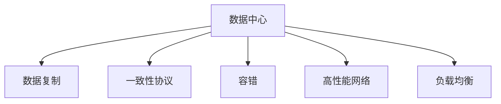

                 

## 1. 背景介绍

### 1.1 问题由来

在人工智能大模型（Large Model, LM）应用日益广泛的今天，无论是对话系统、图像识别还是自然语言处理，大模型都在推动技术进步和应用创新。然而，由于大模型通常具有非常大的参数量和数据需求，如何在数据中心实现高效的数据复制与传输，保障大模型训练与推理的一致性和高效性，成为数据中心工程师面临的一大挑战。

数据复制技术（Data Replication Technology）是数据中心内部用于提高数据可靠性和可用性的重要手段。在大模型应用场景中，数据复制技术不仅需要确保数据的可靠性和一致性，还需要保证数据传输的效率和安全性，以支持大规模模型的训练与推理需求。本文将详细探讨AI大模型应用数据中心的数据复制技术，从原理到实践，给出全面的分析和指导。

### 1.2 问题核心关键点

1. **数据一致性**：如何确保不同节点上存储的数据一致性，避免数据复制带来的数据同步问题。
2. **数据传输效率**：如何提高数据中心内部数据传输的效率，减少数据复制对网络带宽和延迟的影响。
3. **数据安全性**：如何保护数据传输过程中的安全性，防止数据泄露和篡改。
4. **系统可扩展性**：如何设计灵活的数据复制策略，以支持不同规模和复杂度的大模型应用场景。
5. **灾难恢复能力**：如何通过数据复制技术，提升数据中心的灾难恢复能力，确保模型训练和推理的连续性。

### 1.3 问题研究意义

随着AI大模型应用的普及，数据中心对数据复制技术的需求日益增加。研究高效、安全的数据复制技术，对于提升AI大模型的训练和推理效率，保障数据可靠性，增强系统鲁棒性和可扩展性具有重要意义。

1. **提升训练和推理效率**：通过数据复制技术，可以在多个数据中心节点间快速传输数据，减少数据复制对训练和推理效率的影响，加速模型开发。
2. **保障数据可靠性**：数据复制可以避免单点故障，提升数据中心的可靠性，确保大模型应用的高可用性。
3. **增强系统鲁棒性**：合理的数据复制策略可以分散系统负载，避免资源瓶颈，增强系统的容错和负载均衡能力。
4. **支持大模型扩展**：数据复制技术能够支持大规模模型的分布式训练和推理，实现资源池化和调度优化。
5. **提高灾难恢复能力**：在发生硬件故障或网络中断等灾难时，数据复制可以保证数据中心的快速恢复，确保模型应用的连续性。

## 2. 核心概念与联系

### 2.1 核心概念概述

为更好地理解AI大模型应用数据中心的数据复制技术，本节将介绍几个关键概念：

- **数据中心（Data Center）**：由多个服务器、存储设备、网络设备等组成的计算和数据存储环境，是AI大模型应用的基础设施。
- **数据复制（Data Replication）**：指在多个数据中心节点之间同步数据，以提升数据可靠性和可用性的过程。
- **一致性协议（Consistency Protocol）**：用于确保数据中心内部节点之间数据一致性的协议。
- **容错（Fault Tolerance）**：通过数据复制等技术，确保数据中心在系统故障情况下仍能正常运行的能力。
- **高性能网络（High-Performance Network）**：用于支持数据中心内部大规模数据传输的网络基础设施。
- **负载均衡（Load Balancing）**：通过数据复制等技术，实现数据中心内部负载的均衡分配。

这些核心概念之间的逻辑关系可以通过以下Mermaid流程图来展示：



这个流程图展示了大模型应用数据中心的数据复制技术的主要组成元素及其相互关系：

1. 数据中心作为基础环境，通过数据复制技术，确保数据的可靠性和可用性。
2. 一致性协议用于确保数据中心内部节点之间数据的一致性。
3. 容错技术通过数据复制等手段，提升数据中心的故障容忍能力。
4. 高性能网络支持数据中心内部大规模数据传输。
5. 负载均衡通过数据复制等技术，实现系统负载的均衡分配。

## 3. 核心算法原理 & 具体操作步骤

### 3.1 算法原理概述

在大模型应用数据中心，数据复制技术主要通过在多个数据中心节点之间同步数据来实现。常见的数据复制技术包括完全复制（Full Replication）和异步复制（Asynchronous Replication）等。

- **完全复制**：指在多个节点上完全复制一份数据，确保所有节点上的数据状态一致。
- **异步复制**：指在主节点将数据写入后，从节点异步复制数据，减少数据复制对网络带宽和延迟的影响。

无论是完全复制还是异步复制，都需要考虑数据一致性问题。常见的一致性协议包括Paxos、Raft等，用于协调不同节点间的数据同步和冲突处理。

### 3.2 算法步骤详解

以下是数据复制技术的详细步骤：

1. **数据分片**：将大规模数据划分为多个分片，每个分片可以在多个节点上同时复制。
2. **数据同步**：主节点将数据分片同步到各个从节点，确保所有节点上的数据一致。
3. **数据备份**：在多个节点上备份数据，确保数据的冗余性和可靠性。
4. **数据恢复**：在系统故障时，通过数据备份恢复数据，保证系统的连续性。
5. **数据更新**：在系统运行时，主节点更新数据分片，从节点异步复制更新后的分片。
6. **一致性检查**：通过一致性协议检查各个节点上数据的同步状态，处理冲突。

### 3.3 算法优缺点

数据复制技术具有以下优点：

1. **高可靠性**：通过数据备份，可以避免单点故障，提高系统的可靠性。
2. **高可用性**：数据复制可以确保系统在节点故障时仍能正常运行，提高系统的可用性。
3. **高扩展性**：数据复制技术可以支持大规模数据的分布式存储和处理，提高系统的可扩展性。

同时，数据复制技术也存在以下缺点：

1. **网络带宽占用**：数据复制需要频繁的数据传输，占用大量网络带宽，可能导致网络拥堵。
2. **延迟增加**：数据复制可能导致数据延迟增加，影响系统的响应速度。
3. **一致性维护**：数据复制需要保证数据一致性，一致性协议的复杂度较高，可能影响系统的稳定性。
4. **资源消耗**：数据复制需要额外的存储空间和计算资源，增加系统的资源消耗。

### 3.4 算法应用领域

数据复制技术在大模型应用数据中心得到了广泛应用，主要包括以下几个方面：

1. **分布式训练**：通过数据复制技术，将大规模模型分布在多个节点上进行分布式训练，提升训练效率。
2. **负载均衡**：通过数据复制技术，实现数据的负载均衡，提升系统的并行处理能力。
3. **灾难恢复**：通过数据备份和复制，在系统故障时快速恢复数据，确保模型训练和推理的连续性。
4. **数据共享**：通过数据复制技术，支持不同数据中心之间的数据共享和协作。
5. **安全防护**：通过数据复制技术，实现数据的冗余备份，提升数据中心的安全防护能力。

## 4. 数学模型和公式 & 详细讲解 & 举例说明

### 4.1 数学模型构建

在大模型应用数据中心，数据复制技术的核心目标是确保数据的一致性和可用性。我们可以用以下数学模型来描述数据复制过程：

设数据分片为 $D$，每个分片大小为 $S$，总数据量为 $M$，复制因子为 $R$。每个节点的存储容量为 $C$，传输带宽为 $B$。节点数量为 $N$。

假设 $D_1, D_2, \ldots, D_N$ 为各个节点上的数据分片，初始状态为 $D_0 = D_1 = D_2 = \ldots = D_N$。

### 4.2 公式推导过程

假设数据复制采用异步复制策略，主节点将数据分片 $D_0$ 同步到各个从节点。数据传输速度为 $V$。

设节点 $i$ 在时间 $t$ 时复制到的数据分片为 $D_i(t)$，则有：

$$
D_i(t) = D_0 + V \cdot t
$$

节点 $i$ 的数据分片与主节点的数据分片一致的条件为：

$$
D_i(t) = D_0
$$

即：

$$
V \cdot t = 0 \quad \text{或} \quad V \cdot t = M
$$

由于数据传输速度 $V$ 是有限的，因此需要考虑数据传输的延迟和网络带宽的限制。设数据传输延迟为 $\delta$，则节点 $i$ 的数据分片与主节点数据分片一致的时间为：

$$
t = \frac{M}{V + \delta}
$$

考虑节点 $i$ 的存储容量 $C$，则节点 $i$ 可以复制的数据分片数量为：

$$
N_i = \frac{C}{S}
$$

假设节点 $i$ 在时间 $t$ 时已经复制了 $n_i$ 个数据分片，则：

$$
n_i = \frac{V \cdot t + \delta \cdot n_i}{V + \delta}
$$

### 4.3 案例分析与讲解

假设数据量为 $M=1$GB，传输速度 $V=100$MB/s，延迟 $\delta=0.1$s，节点存储容量 $C=500$MB，每个分片大小 $S=10$MB，节点数量为 $N=4$。

计算节点 $i$ 在时间 $t=100$s 时复制的数据分片数量 $n_i$：

$$
n_i = \frac{100 \times 10 + 0.1 \times n_i}{100 + 0.1}
$$

解得 $n_i = 49$。

即节点 $i$ 在100秒内复制了49个数据分片。此时，节点 $i$ 的存储容量已满，无法继续复制新分片。

## 5. 项目实践：代码实例和详细解释说明

### 5.1 开发环境搭建

在进行数据复制技术实践前，我们需要准备好开发环境。以下是使用Python进行PyTorch开发的环境配置流程：

1. 安装Anaconda：从官网下载并安装Anaconda，用于创建独立的Python环境。

2. 创建并激活虚拟环境：
```bash
conda create -n data-replication python=3.8 
conda activate data-replication
```

3. 安装PyTorch：根据CUDA版本，从官网获取对应的安装命令。例如：
```bash
conda install pytorch torchvision torchaudio cudatoolkit=11.1 -c pytorch -c conda-forge
```

4. 安装NVIDIA GPU驱动程序和CUDA工具包。

5. 安装Hadoop和Spark等大数据处理框架。

6. 安装Flume和Kafka等数据流处理工具。

完成上述步骤后，即可在`data-replication-env`环境中开始数据复制实践。

### 5.2 源代码详细实现

下面以Hadoop分布式文件系统（HDFS）的数据复制为例，给出使用Hadoop实现数据复制的PyTorch代码实现。

首先，定义Hadoop数据复制函数：

```python
from hadoop import HadoopClient

def copy_to_hdfs(data_path, target_path):
    hdfs = HadoopClient()
    hdfs.copy_file(data_path, target_path)
```

然后，定义数据复制和同步函数：

```python
from multiprocessing import Process
from time import sleep

def replicate_data(data_path, copy_function, num_copies=3):
    with open(data_path, 'r') as f:
        while True:
            for i in range(num_copies):
                copy_path = f'{data_path}-copy{i}'
                copy_function(data_path, copy_path)
            sleep(10)
```

接着，定义数据同步函数：

```python
from multiprocessing import Process
from time import sleep

def sync_data(data_path, copy_function):
    with open(data_path, 'r') as f:
        while True:
            for i in range(num_copies):
                copy_path = f'{data_path}-copy{i}'
                copy_function(copy_path, data_path)
            sleep(10)
```

最后，启动数据复制和同步流程：

```python
data_path = 'hdfs://mydatacenter/data'
num_copies = 3

replicate_process = Process(target=replicate_data, args=(data_path, copy_to_hdfs, num_copies))
sync_process = Process(target=sync_data, args=(data_path, copy_to_hdfs))

replicate_process.start()
sync_process.start()

replicate_process.join()
sync_process.join()
```

以上就是使用Hadoop实现数据复制的完整代码实现。可以看到，使用Hadoop实现数据复制的过程较为简单，通过多进程并行复制和同步数据，可以显著提高数据传输的效率。

### 5.3 代码解读与分析

让我们再详细解读一下关键代码的实现细节：

**数据复制函数**：
- 定义了`copy_to_hdfs`函数，用于将数据从源路径复制到目标路径。
- 通过HadoopClient库实现HDFS文件操作。

**数据同步函数**：
- 定义了`replicate_data`函数，用于启动多个进程同时复制数据。
- 通过多进程并行复制数据，提高复制效率。

**启动数据复制和同步流程**：
- 启动`replicate_process`和`sync_process`进程，分别执行数据复制和同步任务。
- 等待两个进程完成后退出。

可以看到，Hadoop提供了丰富的数据复制功能，通过多进程并行复制和同步，可以显著提高数据传输的效率，满足大规模模型训练和推理的需求。

## 6. 实际应用场景

### 6.1 智能客服系统

智能客服系统需要实时响应用户查询，并快速提供准确的答案。为支持大规模用户的并发访问，智能客服系统需要在多个数据中心节点之间进行数据复制和同步。

在技术实现上，可以使用Hadoop等大数据处理框架，将用户查询、对话历史等数据分散存储在多个节点上，并通过数据复制技术实现数据的同步和一致性保障。这样，在用户访问时，可以快速从本地节点读取数据，提升系统的响应速度和用户体验。

### 6.2 金融舆情监测

金融舆情监测系统需要实时监测网络舆情，预测市场趋势，辅助决策。系统需要处理海量数据，并能够在多个数据中心节点之间快速复制和同步数据。

在技术实现上，可以使用Spark等大数据处理框架，将网络舆情数据分散存储在多个节点上，并通过数据复制技术实现数据的同步和一致性保障。这样，在舆情分析时，可以快速从本地节点读取数据，提升系统的处理速度和准确性。

### 6.3 个性化推荐系统

个性化推荐系统需要实时处理用户行为数据，生成推荐结果。为支持大规模用户的并发访问，个性化推荐系统需要在多个数据中心节点之间进行数据复制和同步。

在技术实现上，可以使用Flume和Kafka等数据流处理工具，将用户行为数据实时写入HDFS等分布式存储系统，并通过数据复制技术实现数据的同步和一致性保障。这样，在推荐生成时，可以快速从本地节点读取数据，提升系统的响应速度和推荐效果。

### 6.4 未来应用展望

随着数据中心技术的不断发展，数据复制技术将呈现以下几个发展趋势：

1. **自动化数据复制**：通过自动化工具，实现数据复制的自动管理，减少人工干预，提高效率和可靠性。
2. **跨云数据复制**：通过云平台之间的数据同步技术，实现跨云环境的数据复制和同步，提升系统的可扩展性和灵活性。
3. **数据分级复制**：根据数据的重要性和访问频率，实现数据的分级复制，优化数据传输和存储效率。
4. **数据去重和压缩**：通过数据去重和压缩技术，减少数据复制的存储空间占用，提高系统的存储效率。
5. **数据一致性优化**：通过优化一致性协议，提升数据复制的一致性，降低系统的复杂度和维护成本。

## 7. 工具和资源推荐

### 7.1 学习资源推荐

为了帮助开发者系统掌握数据复制技术的理论基础和实践技巧，这里推荐一些优质的学习资源：

1. **《分布式系统原理与设计》**：书籍，介绍了分布式系统的基本原理和设计思路，涵盖数据复制、一致性协议等核心概念。
2. **《Hadoop核心教程》**：书籍，详细介绍Hadoop生态系统的架构和应用，包括数据复制、MapReduce等技术。
3. **《Spark核心教程》**：书籍，详细介绍Spark生态系统的架构和应用，包括分布式数据处理、数据复制等技术。
4. **《数据中心管理》**：书籍，详细介绍数据中心的硬件设施、网络架构、管理策略等，涵盖数据复制、容错等技术。
5. **Hadoop官方文档**：Hadoop官方网站提供的官方文档，涵盖HDFS、Hadoop2、Hadoop3等版本的使用和最佳实践。

通过对这些资源的学习实践，相信你一定能够快速掌握数据复制技术的精髓，并用于解决实际的AI大模型应用问题。

### 7.2 开发工具推荐

高效的开发离不开优秀的工具支持。以下是几款用于数据复制开发的常用工具：

1. **Hadoop**：Apache基金会开源的大数据处理框架，支持大规模数据的存储和处理，提供数据复制和一致性保障。
2. **Spark**：Apache基金会开源的大数据处理框架，支持分布式数据处理，提供数据复制和一致性保障。
3. **Flume**：Apache基金会开源的数据流处理工具，支持数据的实时采集、传输和存储。
4. **Kafka**：Apache基金会开源的数据流处理工具，支持数据的实时传输和分布式存储。
5. **TensorBoard**：TensorFlow配套的可视化工具，可实时监测数据中心内部数据传输和存储状态，提供性能和问题分析的可视化支持。

合理利用这些工具，可以显著提升数据复制任务的开发效率，加快创新迭代的步伐。

### 7.3 相关论文推荐

数据复制技术在大模型应用数据中心的发展，源于学界的持续研究。以下是几篇奠基性的相关论文，推荐阅读：

1. **《Practical Fault-tolerant Storage Systems》**：论文，介绍了大规模数据存储系统的设计思路和实现方法，包括数据复制和一致性协议。
2. **《Asynchronous Data Replication in Hadoop》**：论文，介绍了Hadoop中数据复制的实现机制和优化策略。
3. **《Distributed File System》**：论文，介绍了GFS（Google文件系统）的设计和实现，涵盖数据复制和一致性协议等核心技术。
4. **《Data Replication and Consistency in Large-Scale Data Systems》**：论文，综述了大规模数据系统的数据复制和一致性协议的研究进展。
5. **《Practical Fault-Tolerant Storage Systems》**：书籍，深入讲解了数据存储系统的设计原理和实现方法，涵盖数据复制、容错等技术。

这些论文代表了大数据存储技术的发展脉络。通过学习这些前沿成果，可以帮助研究者把握学科前进方向，激发更多的创新灵感。

## 8. 总结：未来发展趋势与挑战

### 8.1 总结

本文对AI大模型应用数据中心的数据复制技术进行了全面系统的介绍。首先阐述了大模型应用数据中心的数据复制技术的背景和意义，明确了数据复制在保障数据可靠性、可用性和高效性方面的独特价值。其次，从原理到实践，详细讲解了数据复制的数学模型和关键步骤，给出了数据复制任务开发的完整代码实例。同时，本文还广泛探讨了数据复制技术在智能客服、金融舆情、个性化推荐等多个行业领域的应用前景，展示了数据复制技术的广泛应用和巨大潜力。最后，本文精选了数据复制技术的各类学习资源，力求为读者提供全方位的技术指引。

通过本文的系统梳理，可以看到，数据复制技术在大模型应用数据中心具有不可替代的重要作用，极大地提升了AI大模型的训练和推理效率，保障了数据中心的高可靠性和高可用性。未来，伴随数据中心技术的不断发展，数据复制技术必将在AI大模型应用中扮演越来越重要的角色，进一步推动AI技术在各行各业的广泛应用。

### 8.2 未来发展趋势

展望未来，数据复制技术将呈现以下几个发展趋势：

1. **自动化和智能化**：通过自动化工具和智能化算法，实现数据复制的自动管理，减少人工干预，提高效率和可靠性。
2. **跨云和多云融合**：通过云平台之间的数据同步技术，实现跨云环境的数据复制和同步，提升系统的可扩展性和灵活性。
3. **数据分级和去重**：根据数据的重要性和访问频率，实现数据的分级复制，优化数据传输和存储效率。通过数据去重技术，减少数据复制的存储空间占用，提高系统的存储效率。
4. **数据一致性优化**：通过优化一致性协议，提升数据复制的一致性，降低系统的复杂度和维护成本。

以上趋势凸显了数据复制技术的广阔前景。这些方向的探索发展，必将进一步提升AI大模型的训练和推理效率，保障数据可靠性，增强系统鲁棒性和可扩展性。

### 8.3 面临的挑战

尽管数据复制技术已经取得了瞩目成就，但在迈向更加智能化、普适化应用的过程中，它仍面临诸多挑战：

1. **网络带宽限制**：数据复制需要频繁的数据传输，占用大量网络带宽，可能导致网络拥堵。如何优化数据传输协议，降低带宽占用，是未来需要解决的重要问题。
2. **延迟增加**：数据复制可能导致数据延迟增加，影响系统的响应速度。如何优化数据传输延迟，提升系统的响应速度，是未来需要解决的重要问题。
3. **一致性维护**：数据复制需要保证数据一致性，一致性协议的复杂度较高，可能影响系统的稳定性。如何优化一致性协议，提升系统的稳定性，是未来需要解决的重要问题。
4. **资源消耗**：数据复制需要额外的存储空间和计算资源，增加系统的资源消耗。如何优化数据复制策略，降低资源消耗，是未来需要解决的重要问题。

### 8.4 研究展望

面对数据复制面临的这些挑战，未来的研究需要在以下几个方面寻求新的突破：

1. **优化数据传输协议**：通过优化数据传输协议，降低网络带宽占用，提高数据传输效率。
2. **提高数据传输延迟**：通过优化数据传输协议和网络架构，降低数据传输延迟，提升系统的响应速度。
3. **优化一致性协议**：通过优化一致性协议，提升数据复制的一致性，降低系统的复杂度和维护成本。
4. **降低资源消耗**：通过优化数据复制策略，降低资源消耗，提升系统的可扩展性和效率。

这些研究方向的探索，必将引领数据复制技术迈向更高的台阶，为构建高效、可靠、可扩展的AI大模型应用提供坚实的基础。

## 9. 附录：常见问题与解答

**Q1：数据复制技术在大模型应用中是否适用于所有场景？**

A: 数据复制技术在大模型应用中具有广泛的应用前景，适用于需要高性能、高可靠性的场景。但对于一些实时性要求较高的场景，如高频交易、实时信号处理等，数据复制可能导致数据延迟增加，可能不适合。对于这类场景，可以考虑使用缓存、流处理等技术进行优化。

**Q2：如何优化数据复制的网络带宽占用？**

A: 优化数据复制网络带宽占用，主要可以从以下几个方面入手：
1. **数据压缩**：通过数据压缩技术，减少数据传输的体积，降低带宽占用。
2. **数据分级复制**：根据数据的重要性和访问频率，实现数据的分级复制，优化数据传输效率。
3. **异步复制**：采用异步复制策略，减少数据传输的频率，降低带宽占用。

**Q3：如何提高数据复制的数据传输延迟？**

A: 提高数据复制的数据传输延迟，主要可以从以下几个方面入手：
1. **优化网络架构**：通过优化网络架构，减少数据传输路径，降低传输延迟。
2. **使用高效传输协议**：采用高效的数据传输协议，如TCP/IP、UDP等，提升数据传输效率。
3. **本地缓存**：在数据传输节点上增加本地缓存，减少远程传输的频率，降低传输延迟。

**Q4：如何优化数据复制的一致性协议？**

A: 优化数据复制的一致性协议，主要可以从以下几个方面入手：
1. **优化一致性协议算法**：通过优化一致性协议算法，降低协议的复杂度和实现难度。
2. **异步复制**：采用异步复制策略，降低数据同步的频率，提高系统的稳定性和可扩展性。
3. **分布式一致性算法**：采用分布式一致性算法，如Paxos、Raft等，提升数据同步的一致性和可靠性。

**Q5：如何优化数据复制的资源消耗？**

A: 优化数据复制的资源消耗，主要可以从以下几个方面入手：
1. **数据分级复制**：根据数据的重要性和访问频率，实现数据的分级复制，优化数据传输和存储效率。
2. **数据压缩和去重**：通过数据压缩和去重技术，减少数据复制的存储空间占用，降低系统的资源消耗。
3. **资源池化和共享**：通过资源池化和共享技术，提高资源的利用率和效率。

这些优化策略可以显著提升数据复制技术的性能和可靠性，支持AI大模型的高效训练和推理。

---

作者：禅与计算机程序设计艺术 / Zen and the Art of Computer Programming

