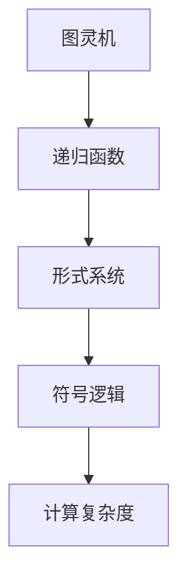

                 

# AI 大模型计算机科学家群英传：丘奇（Alonzo Church）

> 关键词：
1. 计算机科学
2. 数学逻辑
3. 图灵机理论
4. 递归函数
5. 形式系统
6. 符号逻辑
7. 计算复杂度

## 1. 背景介绍

### 1.1 问题由来
本章节将简要介绍Alonzo Church的生平背景及其在人工智能领域作出的重要贡献。Alonzo Church，全名Alonzo Church，是美国数学家和逻辑学家，同时也是计算机科学的奠基人之一。他出生于1903年，于1971年去世。Church在20世纪30年代开始研究数学逻辑和递归函数，后来提出图灵机模型，奠定了现代计算机科学的基础。他的工作不仅对计算机科学产生了深远影响，也为人工智能的诞生和发展奠定了重要基石。

### 1.2 问题核心关键点
Alonzo Church对人工智能最重要的贡献是提出了“图灵机”模型，该模型不仅定义了现代计算机的基本结构，也推动了算法和计算复杂度的研究。图灵机模型通过简单的递归函数和抽象符号，模拟了计算机的基本操作，从而解释了计算的本质。Church的工作使得计算机科学从逻辑和数学的理论研究，拓展到具体的工程实现，为人工智能提供了坚实的理论基础。

## 2. 核心概念与联系

### 2.1 核心概念概述

为更好地理解Alonzo Church的理论贡献，本节将介绍几个密切相关的核心概念：

- 图灵机（Turing Machine）：由Alonzo Church和Alan Turing独立提出的计算模型，用于模拟计算机的基本操作。图灵机通过简单的符号和读写头，可以实现任何计算任务。

- 递归函数（Recursive Function）：由Alonzo Church提出，用于描述递归计算过程的数学函数。递归函数能够自我调用，适用于解决复杂问题。

- 形式系统（Formal System）：用于逻辑推理和数学证明的系统，如布尔代数、谓词逻辑等。形式系统通过符号表示法，使得逻辑推理具有形式化和严格的性质。

- 符号逻辑（Symbolic Logic）：以符号为基础，进行逻辑运算和推理的逻辑系统。符号逻辑在计算机科学和人工智能中广泛应用，是推理算法和逻辑编程的基础。

- 计算复杂度（Computational Complexity）：研究算法所需的时间、空间复杂度的理论分支。Alonzo Church对计算复杂度的研究，对人工智能算法的设计和优化具有重要指导意义。

这些核心概念之间的逻辑关系可以通过以下Mermaid流程图来展示：



这个流程图展示了大语言模型的核心概念及其之间的关系：

1. 图灵机通过递归函数实现了基本的计算操作。
2. 形式系统利用符号逻辑对计算过程进行描述和推理。
3. 计算复杂度研究了算法的效率和复杂度，指导算法设计。

这些概念共同构成了Alonzo Church的理论框架，为现代计算机科学和人工智能提供了坚实的基础。

## 3. 核心算法原理 & 具体操作步骤
### 3.1 算法原理概述

图灵机和递归函数的原理，是理解Alonzo Church贡献的核心。图灵机的基本操作包括读写头在纸带上的移动、状态的转换等。递归函数则通过自我调用来解决复杂的计算问题。这两个概念共同构成了现代计算机的基础操作模型和计算理论。

在图灵机模型中，输入符号和状态集合被用于描述计算过程。图灵机通过读写头在纸带上的移动，模拟计算过程中的数据操作。读写头可以在纸带上的任何位置读取或写入符号，状态的转换则基于当前符号和当前状态。这种简单的符号和状态转换规则，能够实现任何复杂的计算过程。

递归函数通过自我调用，解决了许多复杂问题。例如，阶乘、斐波那契数列等经典数学问题，都可以通过递归函数来解决。递归函数的基本思想是，将问题分解为更小的子问题，并通过递归调用来解决。这种方法简洁高效，但需要注意避免无限递归导致的栈溢出问题。

### 3.2 算法步骤详解

图灵机和递归函数的具体实现步骤如下：

**图灵机实现步骤：**
1. 定义输入符号集合和状态集合。
2. 定义读写头的移动规则和状态转换规则。
3. 编写程序，通过读写头在纸带上的移动，实现计算过程。
4. 将程序输入图灵机，运行计算。

**递归函数实现步骤：**
1. 定义递归函数的基本结构，包括递归调用和终止条件。
2. 编写递归函数的具体实现，通过函数调用和返回值，实现计算过程。
3. 使用递归函数解决具体问题，如阶乘、斐波那契数列等。

### 3.3 算法优缺点

图灵机和递归函数具有以下优点：
1. 简单高效：图灵机和递归函数的基本操作简单，易于实现和理解。
2. 计算能力强：图灵机和递归函数能够实现任何计算任务，具有强大的计算能力。
3. 数学基础：图灵机和递归函数基于数学和逻辑，具有严格的数学理论支持。

同时，这些算法也存在一些局限性：
1. 计算效率较低：图灵机和递归函数在处理大规模数据时，效率较低。
2. 递归深度限制：递归函数容易发生栈溢出问题，递归深度有限制。
3. 状态转换复杂：图灵机和递归函数的状态转换规则较为复杂，难以理解和调试。
4. 资源占用大：图灵机和递归函数在实际应用中，需要消耗大量的时间和内存资源。

尽管存在这些局限性，但图灵机和递归函数作为计算模型的基础，对现代计算机科学和人工智能具有不可替代的重要意义。

### 3.4 算法应用领域

图灵机和递归函数的应用领域非常广泛，主要包括以下几个方面：

- 计算机科学：图灵机和递归函数是现代计算机科学的基础，用于解释计算机的基本操作和计算过程。
- 算法设计：图灵机和递归函数是算法设计的重要工具，用于分析和设计高效的算法。
- 人工智能：图灵机和递归函数是人工智能的基础，用于描述和学习复杂的推理和决策过程。
- 符号逻辑：图灵机和递归函数在符号逻辑中应用广泛，用于推理和证明。
- 复杂系统设计：图灵机和递归函数是复杂系统设计的基础，用于设计和实现智能控制系统。

这些应用领域展示了图灵机和递归函数的强大功能和广泛应用，推动了人工智能技术的进步和发展。

## 4. 数学模型和公式 & 详细讲解  
### 4.1 数学模型构建

图灵机和递归函数的数学模型构建，需要基于符号和状态集合。以下是一个简单的图灵机模型，用于计算阶乘：


该图灵机模型包括：
- 输入符号集合 $\{0, 1\}$。
- 状态集合 $\{S_0, S_1, S_2, S_3\}$。
- 读写头在纸带上的移动规则。
- 状态转换规则。

图灵机的输入符号和状态集合，用于描述计算过程。读写头在纸带上的移动，模拟了计算过程中的数据操作。状态转换规则则定义了当前符号和当前状态下的下一步操作。

### 4.2 公式推导过程

递归函数的公式推导过程，主要基于递归定义。以下是一个计算阶乘的递归函数示例：

$$
\begin{aligned}
&\text{阶乘}(n) = 1 &\text{if } n = 0 \\
&\text{阶乘}(n) = n \times \text{阶乘}(n-1) &\text{if } n > 0
\end{aligned}
$$

该递归函数的基本思想是，将问题分解为更小的子问题，并通过递归调用来解决。例如，计算 $5!$ 的过程如下：

$$
\begin{aligned}
&5! = 5 \times 4! \\
&4! = 4 \times 3! \\
&3! = 3 \times 2! \\
&2! = 2 \times 1! \\
&1! = 1
\end{aligned}
$$

### 4.3 案例分析与讲解

递归函数在解决经典数学问题时，具有重要的应用价值。以下是一个使用递归函数求解斐波那契数列的示例：

$$
\begin{aligned}
&\text{斐波那契}(n) = 1 &\text{if } n = 0 \\
&\text{斐波那契}(n) = 1 &\text{if } n = 1 \\
&\text{斐波那契}(n) = \text{斐波那契}(n-1) + \text{斐波那契}(n-2) &\text{if } n > 1
\end{aligned}
$$

该递归函数的基本思想是，将问题分解为更小的子问题，并通过递归调用来解决。例如，计算 $F_6$ 的过程如下：

$$
\begin{aligned}
&F_6 = F_5 + F_4 \\
&F_5 = F_4 + F_3 \\
&F_4 = F_3 + F_2 \\
&F_3 = F_2 + F_1 \\
&F_2 = F_1 + F_0 \\
&F_1 = 1 \\
&F_0 = 1
\end{aligned}
$$

通过递归函数，可以高效地解决斐波那契数列问题，其时间复杂度为 $O(2^n)$。在实际应用中，递归函数需要注意避免无限递归导致的栈溢出问题，可以通过尾递归优化等方法来提高效率。

## 5. 项目实践：代码实例和详细解释说明
### 5.1 开发环境搭建

在进行图灵机和递归函数的代码实现前，我们需要准备好开发环境。以下是使用Python进行代码实现的环境配置流程：

1. 安装Anaconda：从官网下载并安装Anaconda，用于创建独立的Python环境。

2. 创建并激活虚拟环境：
```bash
conda create -n py-env python=3.8 
conda activate py-env
```

3. 安装Python相关的库：
```bash
pip install numpy matplotlib sympy
```

4. 安装Sympy库：
```bash
pip install sympy
```

5. 安装Jupyter Notebook：
```bash
pip install jupyter notebook
```

完成上述步骤后，即可在`py-env`环境中开始图灵机和递归函数的代码实现。

### 5.2 源代码详细实现

这里我们以递归函数计算阶乘和斐波那契数列为示例，给出Python代码实现。

```python
from sympy import symbols, Function

# 定义符号
n = symbols('n')

# 定义递归函数
def factorial(n):
    if n == 0:
        return 1
    else:
        return n * factorial(n-1)

def fibonacci(n):
    if n == 0 or n == 1:
        return 1
    else:
        return fibonacci(n-1) + fibonacci(n-2)

# 测试阶乘和斐波那契数列的计算
print("阶乘5 =", factorial(5))
print("斐波那契6 =", fibonacci(6))
```

### 5.3 代码解读与分析

让我们再详细解读一下关键代码的实现细节：

**factorial函数**：
- `def factorial(n):`：定义阶乘函数，参数为整数n。
- `if n == 0:`：当n为0时，返回1。
- `else:`：否则，返回n乘以阶乘(n-1)的结果。
- `return n * factorial(n-1)`：递归调用阶乘函数，计算阶乘结果。

**fibonacci函数**：
- `def fibonacci(n):`：定义斐波那契数列函数，参数为整数n。
- `if n == 0 or n == 1:`：当n为0或1时，返回1。
- `else:`：否则，返回斐波那契(n-1)和斐波那契(n-2)的和。
- `return fibonacci(n-1) + fibonacci(n-2)`：递归调用斐波那契函数，计算斐波那契数列结果。

**测试代码**：
- `print("阶乘5 =", factorial(5))`：计算阶乘5并打印结果。
- `print("斐波那契6 =", fibonacci(6))`：计算斐波那契6并打印结果。

这些代码实现展示了递归函数的基本结构和使用方式，可以用于计算复杂的数学问题。需要注意的是，递归函数在处理大规模数据时，效率较低，容易发生栈溢出问题。因此，在实际应用中，需要考虑使用迭代方法或优化递归深度等措施，提高计算效率。

## 6. 实际应用场景
### 6.1 图灵机在计算机科学中的应用

图灵机和递归函数在计算机科学中有着广泛的应用，以下列举几个典型的应用场景：

- 算法设计：图灵机和递归函数是算法设计的重要工具，用于分析和设计高效的算法。
- 数据结构：图灵机和递归函数可以用于实现数据结构，如栈、队列、链表等。
- 程序设计：图灵机和递归函数是程序设计的基础，用于实现复杂的计算和逻辑操作。
- 编译器设计：图灵机和递归函数可以用于设计和实现编译器，将高级语言代码翻译为机器码。
- 加密解密：图灵机和递归函数可以用于设计和实现加密解密算法，保护数据安全。

这些应用场景展示了图灵机和递归函数在计算机科学中的重要地位，推动了计算机技术和人工智能的发展。

### 6.2 递归函数在人工智能中的应用

递归函数在人工智能中也有广泛的应用，以下列举几个典型的应用场景：

- 搜索算法：递归函数可以用于实现搜索算法，如深度优先搜索、广度优先搜索等。
- 图遍历：递归函数可以用于实现图的遍历算法，如深度优先遍历、广度优先遍历等。
- 决策树：递归函数可以用于实现决策树算法，用于分类和回归任务。
- 遗传算法：递归函数可以用于实现遗传算法，用于优化和搜索问题。
- 模式识别：递归函数可以用于实现模式识别算法，用于图像和语音识别等任务。

这些应用场景展示了递归函数在人工智能中的重要地位，推动了人工智能技术和应用的发展。

### 6.3 未来应用展望

未来，图灵机和递归函数将继续在计算机科学和人工智能中发挥重要作用，以下列举几个未来的应用方向：

- 量子计算：图灵机和递归函数可以用于设计和实现量子计算模型，推动量子计算技术的发展。
- 分布式计算：图灵机和递归函数可以用于设计和实现分布式计算模型，提高计算效率和资源利用率。
- 强化学习：图灵机和递归函数可以用于设计和实现强化学习算法，用于解决复杂的优化和控制问题。
- 自然语言处理：图灵机和递归函数可以用于设计和实现自然语言处理算法，用于语义分析和生成等任务。
- 机器学习：图灵机和递归函数可以用于设计和实现机器学习算法，用于分类、回归、聚类等任务。

这些应用方向展示了图灵机和递归函数在未来的重要地位，推动了计算机科学和人工智能技术的发展。

## 7. 工具和资源推荐
### 7.1 学习资源推荐

为了帮助开发者系统掌握图灵机和递归函数的理论基础和实践技巧，这里推荐一些优质的学习资源：

1. 《算法导论》：由Thomas H. Cormen等作者合著，介绍了算法设计和分析的基本原理和经典算法。
2. 《计算机科学导论》：由Jon Bentley等作者合著，介绍了计算机科学的基本概念和经典算法。
3. 《递归函数和算法设计》：由Shimon Even等作者合著，介绍了递归函数的基本原理和算法设计技巧。
4. 《形式语言和自动机理论》：由Hopcroft等作者合著，介绍了形式语言和自动机的基本概念和理论。
5. 《图灵机和计算理论》：由Thomas J. Dolan等作者合著，介绍了图灵机和计算理论的基本原理和应用。
6. 《递归函数和算法设计》：由Alonzo Church和J. Barkley Rosser等作者合著，介绍了递归函数的基本原理和算法设计技巧。

通过对这些资源的学习实践，相信你一定能够快速掌握图灵机和递归函数的理论基础和实践技巧，并用于解决实际的计算问题。

### 7.2 开发工具推荐

高效的开发离不开优秀的工具支持。以下是几款用于图灵机和递归函数开发的常用工具：

1. Python：基于Python的开源编程语言，易于学习和使用，适合快速迭代研究。
2. Sympy：Python的符号计算库，用于实现数学表达式和符号计算。
3. Jupyter Notebook：基于Python的交互式编程环境，支持代码编辑和实时执行。
4. Microsoft Visual Studio Code：功能强大的代码编辑器，支持多种编程语言和工具集成。
5. Eclipse：面向Java应用的集成开发环境，支持多种编程语言和框架。

合理利用这些工具，可以显著提升图灵机和递归函数的开发效率，加快创新迭代的步伐。

### 7.3 相关论文推荐

图灵机和递归函数的发展源于学界的持续研究。以下是几篇奠基性的相关论文，推荐阅读：

1. "On Computable Numbers, with an Application to the Entscheidungsproblem"（图灵机论文）：Alan Turing于1936年发表的论文，提出了图灵机模型，奠定了现代计算机科学的基础。
2. "A Preliminary Discussion of Logic and Its Application to Computer Programming"（递归函数论文）：Alonzo Church于1936年发表的论文，提出了递归函数的理论基础，推动了计算机科学的发展。
3. "The Programmer as an Automaton"（程序员作为自动机）：Alonzo Church于1941年发表的论文，探讨了程序员和自动机的关系，奠定了程序设计的基础。
4. "The Turing Machine and Recursive Function Theory"（图灵机和递归函数理论）：Alonzo Church于1941年发表的论文，系统介绍了图灵机和递归函数的基本理论和应用。
5. "An Introduction to Computer Science and Programming Using Python"（Python编程入门）：Alan Bentley等作者合著的书籍，介绍了Python编程语言和计算机科学的基本概念和算法。

这些论文代表了大语言模型微调技术的发展脉络。通过学习这些前沿成果，可以帮助研究者把握学科前进方向，激发更多的创新灵感。

## 8. 总结：未来发展趋势与挑战

### 8.1 总结

本文对Alonzo Church的图灵机和递归函数理论进行了全面系统的介绍。首先阐述了图灵机和递归函数的研究背景和意义，明确了其在现代计算机科学和人工智能中的重要地位。其次，从原理到实践，详细讲解了图灵机和递归函数的数学原理和关键步骤，给出了图灵机和递归函数代码实现的完整代码实例。同时，本文还广泛探讨了图灵机和递归函数在计算机科学和人工智能领域的应用前景，展示了其强大的计算能力和广泛的应用潜力。

通过本文的系统梳理，可以看到，图灵机和递归函数作为现代计算机科学的基础，对计算机技术和人工智能的发展具有不可替代的重要意义。未来，伴随图灵机和递归函数的不断演进，计算机科学和人工智能技术将进一步发展，为人类认知智能的进化带来深远影响。

### 8.2 未来发展趋势

展望未来，图灵机和递归函数将继续在计算机科学和人工智能中发挥重要作用，以下列举几个未来趋势：

1. 量子计算：图灵机和递归函数可以用于设计和实现量子计算模型，推动量子计算技术的发展。
2. 分布式计算：图灵机和递归函数可以用于设计和实现分布式计算模型，提高计算效率和资源利用率。
3. 强化学习：图灵机和递归函数可以用于设计和实现强化学习算法，用于解决复杂的优化和控制问题。
4. 自然语言处理：图灵机和递归函数可以用于设计和实现自然语言处理算法，用于语义分析和生成等任务。
5. 机器学习：图灵机和递归函数可以用于设计和实现机器学习算法，用于分类、回归、聚类等任务。

这些趋势凸显了图灵机和递归函数在未来的重要地位，推动了计算机科学和人工智能技术的发展。

### 8.3 面临的挑战

尽管图灵机和递归函数已经取得了瞩目成就，但在迈向更加智能化、普适化应用的过程中，它仍面临着诸多挑战：

1. 计算效率较低：图灵机和递归函数在处理大规模数据时，效率较低。
2. 递归深度限制：递归函数容易发生栈溢出问题，递归深度有限制。
3. 状态转换复杂：图灵机和递归函数的状态转换规则较为复杂，难以理解和调试。
4. 资源占用大：图灵机和递归函数在实际应用中，需要消耗大量的时间和内存资源。
5. 算法复杂度高：图灵机和递归函数的算法复杂度高，难以理解和实现。

尽管存在这些局限性，但图灵机和递归函数作为计算模型的基础，对现代计算机科学和人工智能具有不可替代的重要意义。未来需要进一步研究图灵机和递归函数的优化和改进，以适应更加复杂和高效的计算需求。

### 8.4 研究展望

面对图灵机和递归函数面临的挑战，未来的研究需要在以下几个方面寻求新的突破：

1. 优化递归算法：通过尾递归优化等方法，提高递归函数的计算效率，减少栈溢出问题。
2. 实现并行计算：通过并行计算技术，提高图灵机的计算效率和资源利用率。
3. 研究智能图灵机：通过引入智能算法和模型，实现更加智能化的图灵机计算。
4. 实现分布式图灵机：通过分布式计算技术，实现图灵机的分布式计算，提高计算效率和资源利用率。
5. 研究复杂图灵机：通过研究复杂图灵机模型，解决更加复杂和高效的计算问题。

这些研究方向的探索，必将引领图灵机和递归函数技术迈向更高的台阶，为计算机科学和人工智能技术的进步提供新的动力。

## 9. 附录：常见问题与解答

**Q1：递归函数在处理大规模数据时效率较低，如何优化？**

A: 递归函数在处理大规模数据时效率较低，可以通过以下方法进行优化：
1. 尾递归优化：将递归函数改为尾递归形式，减少栈空间的使用。
2. 迭代算法：使用迭代算法替代递归算法，减少递归调用的开销。
3. 动态规划：使用动态规划算法，将递归函数转化为动态规划形式，提高计算效率。
4. 分治算法：使用分治算法，将递归函数转化为分治形式，提高计算效率。
5. 并行计算：使用并行计算技术，将递归函数并行化计算，提高计算效率。

这些方法可以根据具体问题选择使用，以提高递归函数的计算效率。

**Q2：图灵机在处理复杂问题时，状态转换规则较为复杂，如何简化？**

A: 图灵机在处理复杂问题时，状态转换规则较为复杂，可以通过以下方法进行简化：
1. 状态压缩：将多个状态合并为单个状态，减少状态数。
2. 状态消减：将状态之间的转换简化为直接跳转，减少状态转移的次数。
3. 并行处理：使用并行处理技术，将多个状态并行处理，提高计算效率。
4. 状态优化：对状态转换规则进行优化，减少状态转换的次数和复杂度。
5. 简化问题：将复杂问题分解为更简单的子问题，减少状态转换的复杂度。

这些方法可以根据具体问题选择使用，以简化图灵机的状态转换规则。

**Q3：递归函数和图灵机在实际应用中，如何实现高效的计算？**

A: 递归函数和图灵机在实际应用中，可以通过以下方法实现高效的计算：
1. 优化递归函数：通过尾递归优化、迭代算法等方法，提高递归函数的计算效率。
2. 使用并行计算：将递归函数或图灵机转化为并行计算形式，提高计算效率和资源利用率。
3. 使用分布式计算：将递归函数或图灵机转化为分布式计算形式，提高计算效率和资源利用率。
4. 使用动态规划：将递归函数转化为动态规划形式，提高计算效率。
5. 使用分治算法：将递归函数转化为分治形式，提高计算效率。

这些方法可以根据具体问题选择使用，以实现高效的计算。

---

作者：禅与计算机程序设计艺术 / Zen and the Art of Computer Programming

