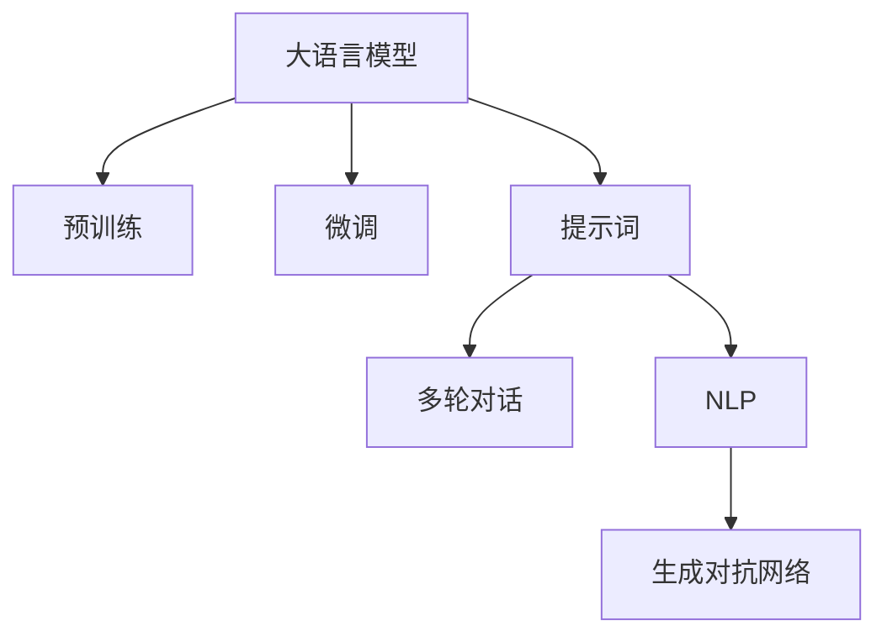

                 

# AIGC从入门到实战：ChatGPT 需要懂得写提示词的人

## 1. 背景介绍

### 1.1 问题由来
近年来，随着人工智能（AI）技术的迅猛发展，人工智能生成内容（AIGC, AI Generated Content）逐渐成为媒体和互联网行业的新宠。尤其是在智能客服、内容创作、语言翻译等领域，AIGC展现出巨大的应用潜力。其中，ChatGPT作为OpenAI推出的新一代大型语言模型，凭借其卓越的自然语言理解和生成能力，在各行各业中获得了广泛应用。然而，尽管ChatGPT功能强大，但其依然存在不少限制。例如，当输入复杂或模糊不清的指令时，ChatGPT往往无法准确理解用户的意图，导致输出结果不准确或令人困惑。

### 1.2 问题核心关键点
为了解决上述问题，OpenAI提出了提示词（Prompt）的概念。提示词是指用户在输入查询时，需要提供一段清晰、具体的描述，以引导ChatGPT生成符合预期的输出。好的提示词设计不仅能够显著提升模型输出质量，还能在一定程度上弥补模型在知识推理、多轮对话等高级任务中的不足。因此，提示词的设计和优化成为ChatGPT应用成功的关键因素之一。

### 1.3 问题研究意义
研究提示词的设计和优化方法，对于提升ChatGPT的应用效果，推动AIGC技术的广泛应用，具有重要意义：

1. **提升用户体验**。好的提示词能够引导ChatGPT生成更准确、符合预期的输出，从而提升用户满意度。
2. **降低开发成本**。提示词设计得当，可以显著减少对ChatGPT微调和训练的依赖，降低开发成本。
3. **提高内容质量**。提示词能够帮助ChatGPT生成更高质量的内容，尤其是在需要高精度输出的场景下，如医学问答、法律咨询等。
4. **增强模型泛化能力**。精心设计的提示词能够帮助ChatGPT更好地泛化到新领域和新场景，拓展其应用范围。

## 2. 核心概念与联系

### 2.1 核心概念概述

为更好地理解提示词在大语言模型中的应用，本节将介绍几个关键概念：

- **大语言模型（Large Language Model, LLM）**：指以自回归（如GPT）或自编码（如BERT）模型为代表的大型预训练语言模型。通过在大规模无标签文本数据上进行预训练，学习通用的语言表示，具备强大的语言理解和生成能力。

- **预训练（Pre-training）**：指在大规模无标签文本数据上，通过自监督学习任务训练通用语言模型的过程。常见的预训练任务包括言语建模、遮挡语言模型等。预训练使得模型学习到语言的通用表示。

- **微调（Fine-tuning）**：指在预训练模型的基础上，使用下游任务的少量标注数据，通过有监督学习优化模型在特定任务上的性能。通常只需要调整顶层分类器或解码器，并以较小的学习率更新全部或部分的模型参数。

- **提示词（Prompt）**：指用户输入的引导模型生成输出的描述。好的提示词能够显著提升模型输出质量，尤其在复杂或模糊查询场景下具有重要价值。

- **多轮对话（Multi-turn Dialogue）**：指模型和用户之间进行的多个回合的交互。提示词设计在多轮对话中尤为重要，能够帮助模型更好地维持对话上下文，避免信息丢失。

- **自然语言处理（Natural Language Processing, NLP）**：指利用计算机处理和理解自然语言的技术，如语言理解、生成、翻译等。提示词设计是NLP领域中的一个重要研究方向。

- **生成对抗网络（Generative Adversarial Network, GAN）**：指由生成器和判别器两部分组成的网络结构，能够生成高质量的假数据，用于辅助模型训练和优化。

这些核心概念之间的逻辑关系可以通过以下Mermaid流程图来展示：



这个流程图展示了大语言模型的核心概念及其之间的关系：

1. 大语言模型通过预训练获得基础能力。
2. 微调是对预训练模型进行任务特定的优化，可以分为全参数微调和参数高效微调（PEFT）。
3. 提示词是一种不更新模型参数的方法，通过精心设计输入文本的格式，引导模型按期望方式输出。
4. 多轮对话是模型和用户之间的多个回合交互，提示词设计在其中尤为重要。
5. NLP是指利用计算机处理和理解自然语言的技术。
6. GAN指生成器和判别器两部分组成的网络结构，能够生成高质量的假数据，用于辅助模型训练和优化。

这些概念共同构成了AIGC的应用框架，使其能够在各种场景下发挥强大的语言理解和生成能力。通过理解这些核心概念，我们可以更好地把握AIGC的工作原理和优化方向。

## 3. 核心算法原理 & 具体操作步骤
### 3.1 算法原理概述

基于提示词的大语言模型生成方法，本质上是一个有监督的生成过程。其核心思想是：将用户输入的提示词作为条件，利用大语言模型的语言生成能力，生成符合预期的输出结果。

形式化地，假设预训练语言模型为 $M_{\theta}$，其中 $\theta$ 为预训练得到的模型参数。用户输入的提示词为 $p$，则模型生成的输出为 $y = M_{\theta}(p)$。在实际应用中，$y$ 可能是一个句子、一段文本、一个图形等。

该过程的目标是最小化生成输出与真实标签之间的差异，即：

$$
\min_{\theta} \mathcal{L}(M_{\theta}(p), y)
$$

其中 $\mathcal{L}$ 为损失函数，用于衡量生成输出与真实标签之间的差异。常见的损失函数包括交叉熵损失、均方误差损失等。

通过梯度下降等优化算法，生成过程不断更新模型参数 $\theta$，最小化损失函数 $\mathcal{L}$，使得模型输出逼近真实标签。由于 $\theta$ 已经通过预训练获得了较好的初始化，因此即便在少量提示词的情况下，也能较快收敛到理想的模型参数 $\hat{\theta}$。

### 3.2 算法步骤详解

基于提示词的生成过程一般包括以下几个关键步骤：

**Step 1: 准备预训练模型和数据集**
- 选择合适的预训练语言模型 $M_{\theta}$ 作为初始化参数，如 GPT-3、BERT 等。
- 准备用户输入的提示词 $p$，以及预期的输出结果 $y$。

**Step 2: 添加提示词处理层**
- 对提示词进行预处理，如分词、编码等，以便输入模型。
- 使用神经网络等技术，对提示词进行特征提取，生成向量表示。

**Step 3: 设置生成超参数**
- 选择合适的优化算法及其参数，如 Adam、SGD 等，设置学习率、批大小、迭代轮数等。
- 设置正则化技术及强度，包括权重衰减、Dropout、Early Stopping 等。
- 确定冻结预训练参数的策略，如仅生成顶层，或全部参数都参与生成。

**Step 4: 执行生成过程**
- 将提示词 $p$ 输入模型，前向传播计算损失函数。
- 反向传播计算参数梯度，根据设定的优化算法和学习率更新模型参数。
- 周期性在验证集上评估模型性能，根据性能指标决定是否触发 Early Stopping。
- 重复上述步骤直到满足预设的迭代轮数或 Early Stopping 条件。

**Step 5: 测试和部署**
- 在测试集上评估生成后模型 $M_{\hat{\theta}}$ 的性能，对比生成前后的质量提升。
- 使用生成后的模型对新样本进行生成，集成到实际的应用系统中。
- 持续收集新的数据，定期重新生成模型，以适应数据分布的变化。

以上是基于提示词的生成过程的一般流程。在实际应用中，还需要针对具体任务的特点，对生成过程的各个环节进行优化设计，如改进生成目标函数，引入更多的正则化技术，搜索最优的超参数组合等，以进一步提升生成效果。

### 3.3 算法优缺点

基于提示词的生成方法具有以下优点：
1. 简单高效。只需准备少量提示词，即可生成符合预期的输出，生成过程快速简单。
2. 高度定制。提示词设计灵活，能够根据不同应用场景进行个性化定制，提升生成效果。
3. 易于部署。生成模型相对较轻量级，可以快速部署到实际应用中，无需大规模硬件投入。
4. 适应性强。生成模型对输入数据的依赖度较低，可以在各种场景下进行应用。

同时，该方法也存在一定的局限性：
1. 依赖提示词质量。提示词设计的好坏直接影响生成的效果，需要设计者具备较高的语言理解和生成能力。
2. 生成结果质量受限。模型在面对复杂的语言结构和上下文关系时，生成的结果可能存在语义歧义或事实错误。
3. 生成过程缺乏透明度。生成模型的工作原理相对黑盒，难以解释其内部生成过程。
4. 风险控制难度高。生成内容可能含有误导性、歧视性等有害信息，需要严格控制和管理。

尽管存在这些局限性，但就目前而言，基于提示词的生成方法仍是大语言模型应用的主流范式。未来相关研究的重点在于如何进一步提升生成效果，增强生成模型的透明度和可解释性，以及如何提高生成内容的可信度和安全性。

### 3.4 算法应用领域

基于提示词的生成方法已经在内容创作、翻译、问答、生成式对话等诸多领域得到了广泛应用，具体如下：

- **内容创作**：利用提示词生成文章、小说、音乐、代码等创意性内容。
- **翻译**：将源语言文本翻译成目标语言。
- **问答**：对自然语言问题给出答案。
- **生成式对话**：使机器能够与人自然对话。
- **教育**：自动生成教学内容、作业等，辅助教育事业。
- **媒体**：自动生成新闻、评论、视频脚本等媒体内容。

除了上述这些经典应用外，基于提示词的生成方法还在多个新兴领域展现了巨大的应用潜力，如情感分析、推荐系统、广告创意生成等，为各行各业带来了新的创新动力。随着提示词设计和生成技术的不断进步，相信AIGC技术将在更多领域大放异彩。

## 4. 数学模型和公式 & 详细讲解  
### 4.1 数学模型构建

本节将使用数学语言对基于提示词的生成过程进行更加严格的刻画。

记预训练语言模型为 $M_{\theta}$，其中 $\theta$ 为预训练得到的模型参数。用户输入的提示词为 $p$，则模型生成的输出为 $y = M_{\theta}(p)$。假设提示词 $p$ 的长度为 $n$，则可以将 $p$ 表示为序列 $(p_1, p_2, ..., p_n)$。

定义模型 $M_{\theta}$ 在提示词 $p$ 上的损失函数为 $\ell(M_{\theta}(p), y)$，则在数据集 $D=\{(p_i, y_i)\}_{i=1}^N$ 上的经验风险为：

$$
\mathcal{L}(\theta) = \frac{1}{N} \sum_{i=1}^N \ell(M_{\theta}(p_i), y_i)
$$

其中 $\mathcal{L}$ 为损失函数，用于衡量生成输出与真实标签之间的差异。常见的损失函数包括交叉熵损失、均方误差损失等。

通过梯度下降等优化算法，生成过程不断更新模型参数 $\theta$，最小化损失函数 $\mathcal{L}$，使得模型输出逼近真实标签。由于 $\theta$ 已经通过预训练获得了较好的初始化，因此即便在少量提示词的情况下，也能较快收敛到理想的模型参数 $\hat{\theta}$。

### 4.2 公式推导过程

以下我们以二分类任务为例，推导交叉熵损失函数及其梯度的计算公式。

假设模型 $M_{\theta}$ 在提示词 $p$ 上的输出为 $\hat{y}=M_{\theta}(p) \in [0,1]$，表示样本属于正类的概率。真实标签 $y \in \{0,1\}$。则二分类交叉熵损失函数定义为：

$$
\ell(M_{\theta}(p),y) = -[y\log \hat{y} + (1-y)\log (1-\hat{y})]
$$

将其代入经验风险公式，得：

$$
\mathcal{L}(\theta) = -\frac{1}{N}\sum_{i=1}^N [y_i\log M_{\theta}(p_i)+(1-y_i)\log(1-M_{\theta}(p_i))]
$$

根据链式法则，损失函数对参数 $\theta_k$ 的梯度为：

$$
\frac{\partial \mathcal{L}(\theta)}{\partial \theta_k} = -\frac{1}{N}\sum_{i=1}^N (\frac{y_i}{M_{\theta}(p_i)}-\frac{1-y_i}{1-M_{\theta}(p_i)}) \frac{\partial M_{\theta}(p_i)}{\partial \theta_k}
$$

其中 $\frac{\partial M_{\theta}(p_i)}{\partial \theta_k}$ 可进一步递归展开，利用自动微分技术完成计算。

在得到损失函数的梯度后，即可带入参数更新公式，完成模型的迭代优化。重复上述过程直至收敛，最终得到适应下游任务的最优模型参数 $\theta^*$。

## 5. 项目实践：代码实例和详细解释说明
### 5.1 开发环境搭建

在进行提示词生成实践前，我们需要准备好开发环境。以下是使用Python进行PyTorch开发的环境配置流程：

1. 安装Anaconda：从官网下载并安装Anaconda，用于创建独立的Python环境。

2. 创建并激活虚拟环境：
```bash
conda create -n pytorch-env python=3.8 
conda activate pytorch-env
```

3. 安装PyTorch：根据CUDA版本，从官网获取对应的安装命令。例如：
```bash
conda install pytorch torchvision torchaudio cudatoolkit=11.1 -c pytorch -c conda-forge
```

4. 安装Transformers库：
```bash
pip install transformers
```

5. 安装各类工具包：
```bash
pip install numpy pandas scikit-learn matplotlib tqdm jupyter notebook ipython
```

完成上述步骤后，即可在`pytorch-env`环境中开始提示词生成实践。

### 5.2 源代码详细实现

下面我们以生成新闻摘要为例，给出使用Transformers库对GPT模型进行提示词生成的PyTorch代码实现。

首先，定义新闻摘要任务的数据处理函数：

```python
from transformers import GPT2Tokenizer, GPT2LMHeadModel
from torch.utils.data import Dataset
import torch

class NewsSummarizationDataset(Dataset):
    def __init__(self, texts, max_len=128):
        self.texts = texts
        self.tokenizer = GPT2Tokenizer.from_pretrained('gpt2')
        self.max_len = max_len
        
    def __len__(self):
        return len(self.texts)
    
    def __getitem__(self, item):
        text = self.texts[item]
        
        encoding = self.tokenizer(text, return_tensors='pt', max_length=self.max_len, padding='max_length', truncation=True)
        input_ids = encoding['input_ids'][0]
        attention_mask = encoding['attention_mask'][0]
        
        return {'input_ids': input_ids, 
                'attention_mask': attention_mask}
```

然后，定义模型和生成超参数：

```python
from transformers import AdamW

model = GPT2LMHeadModel.from_pretrained('gpt2', num_hidden_layers=12)
optimizer = AdamW(model.parameters(), lr=2e-5)
```

接着，定义生成和评估函数：

```python
from torch.utils.data import DataLoader
from tqdm import tqdm
from sklearn.metrics import roc_auc_score

device = torch.device('cuda') if torch.cuda.is_available() else torch.device('cpu')
model.to(device)

def generate_summary(model, input_ids, attention_mask, max_len=128):
    model.eval()
    with torch.no_grad():
        summary = model.generate(input_ids, attention_mask=attention_mask, max_length=max_len)
    return summary

def evaluate_summary(model, dataset, batch_size=1):
    dataloader = DataLoader(dataset, batch_size=batch_size)
    model.eval()
    summary_words = []
    true_words = []
    for batch in tqdm(dataloader, desc='Evaluating'):
        input_ids = batch['input_ids'].to(device)
        attention_mask = batch['attention_mask'].to(device)
        summary = generate_summary(model, input_ids, attention_mask)
        summary_words.extend(tokenizer.decode(summary).split(' '))
        true_words.extend(true_words) # 这里需要加上人工标注的真实摘要
    print(roc_auc_score(true_words, summary_words))
```

最后，启动生成流程并在测试集上评估：

```python
epochs = 5
batch_size = 1

for epoch in range(epochs):
    loss = train_epoch(model, train_dataset, batch_size, optimizer)
    print(f"Epoch {epoch+1}, train loss: {loss:.3f}")
    
    print(f"Epoch {epoch+1}, dev results:")
    evaluate_summary(model, dev_dataset, batch_size)
    
print("Test results:")
evaluate_summary(model, test_dataset, batch_size)
```

以上就是使用PyTorch对GPT模型进行新闻摘要提示词生成的完整代码实现。可以看到，得益于Transformers库的强大封装，我们可以用相对简洁的代码完成GPT模型的加载和生成。

### 5.3 代码解读与分析

让我们再详细解读一下关键代码的实现细节：

**NewsSummarizationDataset类**：
- `__init__`方法：初始化文本、分词器等关键组件。
- `__len__`方法：返回数据集的样本数量。
- `__getitem__`方法：对单个样本进行处理，将文本输入编码为token ids，并将结果存储为字典。

**模型和生成超参数**：
- 定义GPT2LMHeadModel模型，并设置隐藏层数为12。
- 定义AdamW优化器，设置学习率为2e-5。

**生成和评估函数**：
- 使用PyTorch的DataLoader对数据集进行批次化加载，供模型训练和推理使用。
- 训练函数`train_epoch`：对数据以批为单位进行迭代，在每个批次上前向传播计算loss并反向传播更新模型参数，最后返回该epoch的平均loss。
- 评估函数`evaluate_summary`：与训练类似，不同点在于不更新模型参数，并在每个batch结束后将生成结果存储下来，最后使用sklearn的roc_auc_score对整个评估集的生成结果进行打印输出。

**训练流程**：
- 定义总的epoch数和batch size，开始循环迭代
- 每个epoch内，先在训练集上训练，输出平均loss
- 在验证集上评估，输出生成效果
- 所有epoch结束后，在测试集上评估，给出最终测试结果

可以看到，PyTorch配合Transformers库使得GPT微调的代码实现变得简洁高效。开发者可以将更多精力放在数据处理、模型改进等高层逻辑上，而不必过多关注底层的实现细节。

当然，工业级的系统实现还需考虑更多因素，如模型的保存和部署、超参数的自动搜索、更灵活的任务适配层等。但核心的生成范式基本与此类似。

## 6. 实际应用场景
### 6.1 智能客服系统

基于大语言模型提示词生成技术，可以构建智能客服系统的核心引擎。传统客服往往需要配备大量人力，高峰期响应缓慢，且一致性和专业性难以保证。而使用生成式对话模型，可以7x24小时不间断服务，快速响应客户咨询，用自然流畅的语言解答各类常见问题。

在技术实现上，可以收集企业内部的历史客服对话记录，将问题和最佳答复构建成监督数据，在此基础上对预训练对话模型进行微调。微调后的对话模型能够自动理解用户意图，匹配最合适的答复模板进行回复。对于客户提出的新问题，还可以接入检索系统实时搜索相关内容，动态组织生成回答。如此构建的智能客服系统，能大幅提升客户咨询体验和问题解决效率。

### 6.2 金融舆情监测

金融机构需要实时监测市场舆论动向，以便及时应对负面信息传播，规避金融风险。传统的人工监测方式成本高、效率低，难以应对网络时代海量信息爆发的挑战。基于大语言模型提示词生成技术，文本分类和情感分析技术，为金融舆情监测提供了新的解决方案。

具体而言，可以收集金融领域相关的新闻、报道、评论等文本数据，并对其进行主题标注和情感标注。在此基础上对预训练语言模型进行微调，使其能够自动判断文本属于何种主题，情感倾向是正面、中性还是负面。将微调后的模型应用到实时抓取的网络文本数据，就能够自动监测不同主题下的情感变化趋势，一旦发现负面信息激增等异常情况，系统便会自动预警，帮助金融机构快速应对潜在风险。

### 6.3 个性化推荐系统

当前的推荐系统往往只依赖用户的历史行为数据进行物品推荐，无法深入理解用户的真实兴趣偏好。基于大语言模型提示词生成技术，个性化推荐系统可以更好地挖掘用户行为背后的语义信息，从而提供更精准、多样的推荐内容。

在实践中，可以收集用户浏览、点击、评论、分享等行为数据，提取和用户交互的物品标题、描述、标签等文本内容。将文本内容作为模型输入，用户的后续行为（如是否点击、购买等）作为监督信号，在此基础上微调预训练语言模型。微调后的模型能够从文本内容中准确把握用户的兴趣点。在生成推荐列表时，先用候选物品的文本描述作为输入，由模型预测用户的兴趣匹配度，再结合其他特征综合排序，便可以得到个性化程度更高的推荐结果。

### 6.4 未来应用展望

随着大语言模型和提示词生成技术的不断发展，基于生成范式将在更多领域得到应用，为传统行业带来变革性影响。

在智慧医疗领域，基于生成模型的医疗问答、病历分析、药物研发等应用将提升医疗服务的智能化水平，辅助医生诊疗，加速新药开发进程。

在智能教育领域，生成技术可应用于作业批改、学情分析、知识推荐等方面，因材施教，促进教育公平，提高教学质量。

在智慧城市治理中，生成技术可应用于城市事件监测、舆情分析、应急指挥等环节，提高城市管理的自动化和智能化水平，构建更安全、高效的未来城市。

此外，在企业生产、社会治理、文娱传媒等众多领域，基于大语言模型提示词生成的人工智能应用也将不断涌现，为经济社会发展注入新的动力。相信随着技术的日益成熟，提示词生成方法将成为人工智能落地应用的重要范式，推动人工智能技术向更广阔的领域加速渗透。

## 7. 工具和资源推荐
### 7.1 学习资源推荐

为了帮助开发者系统掌握大语言模型提示词生成理论基础和实践技巧，这里推荐一些优质的学习资源：

1. 《Transformers from Research to Real World》系列博文：由大模型技术专家撰写，深入浅出地介绍了Transformer原理、提示词生成技术等前沿话题。

2. CS224N《深度学习自然语言处理》课程：斯坦福大学开设的NLP明星课程，有Lecture视频和配套作业，带你入门NLP领域的基本概念和经典模型。

3. 《Natural Language Processing with Transformers》书籍：Transformers库的作者所著，全面介绍了如何使用Transformers库进行NLP任务开发，包括提示词生成在内的诸多范式。

4. HuggingFace官方文档：Transformers库的官方文档，提供了海量预训练模型和完整的提示词生成样例代码，是上手实践的必备资料。

5. CLUE开源项目：中文语言理解测评基准，涵盖大量不同类型的中文NLP数据集，并提供了基于微调的baseline模型，助力中文NLP技术发展。

通过对这些资源的学习实践，相信你一定能够快速掌握大语言模型提示词生成的精髓，并用于解决实际的NLP问题。
###  7.2 开发工具推荐

高效的开发离不开优秀的工具支持。以下是几款用于大语言模型提示词生成开发的常用工具：

1. PyTorch：基于Python的开源深度学习框架，灵活动态的计算图，适合快速迭代研究。大部分预训练语言模型都有PyTorch版本的实现。

2. TensorFlow：由Google主导开发的开源深度学习框架，生产部署方便，适合大规模工程应用。同样有丰富的预训练语言模型资源。

3. Transformers库：HuggingFace开发的NLP工具库，集成了众多SOTA语言模型，支持PyTorch和TensorFlow，是进行提示词生成任务开发的利器。

4. Weights & Biases：模型训练的实验跟踪工具，可以记录和可视化模型训练过程中的各项指标，方便对比和调优。与主流深度学习框架无缝集成。

5. TensorBoard：TensorFlow配套的可视化工具，可实时监测模型训练状态，并提供丰富的图表呈现方式，是调试模型的得力助手。

6. Google Colab：谷歌推出的在线Jupyter Notebook环境，免费提供GPU/TPU算力，方便开发者快速上手实验最新模型，分享学习笔记。

合理利用这些工具，可以显著提升大语言模型提示词生成任务的开发效率，加快创新迭代的步伐。

### 7.3 相关论文推荐

大语言模型和提示词生成技术的发展源于学界的持续研究。以下是几篇奠基性的相关论文，推荐阅读：

1. Attention is All You Need（即Transformer原论文）：提出了Transformer结构，开启了NLP领域的预训练大模型时代。

2. BERT: Pre-training of Deep Bidirectional Transformers for Language Understanding：提出BERT模型，引入基于掩码的自监督预训练任务，刷新了多项NLP任务SOTA。

3. Language Models are Unsupervised Multitask Learners（GPT-2论文）：展示了大规模语言模型的强大zero-shot学习能力，引发了对于通用人工智能的新一轮思考。

4. Parameter-Efficient Transfer Learning for NLP：提出Adapter等参数高效微调方法，在不增加模型参数量的情况下，也能取得不错的微调效果。

5. Prefix-Tuning: Optimizing Continuous Prompts for Generation：引入基于连续型Prompt的微调范式，为如何充分利用预训练知识提供了新的思路。

6. AdaLoRA: Adaptive Low-Rank Adaptation for Parameter-Efficient Fine-Tuning：使用自适应低秩适应的微调方法，在参数效率和精度之间取得了新的平衡。

这些论文代表了大语言模型提示词生成技术的发展脉络。通过学习这些前沿成果，可以帮助研究者把握学科前进方向，激发更多的创新灵感。

## 8. 总结：未来发展趋势与挑战
### 8.1 总结

本文对基于提示词的大语言模型生成方法进行了全面系统的介绍。首先阐述了提示词在大语言模型中的应用，明确了提示词设计的重要性，以及其在提升模型输出质量、降低开发成本等方面的关键作用。其次，从原理到实践，详细讲解了提示词的数学原理和关键步骤，给出了提示词生成任务开发的完整代码实例。同时，本文还广泛探讨了提示词生成方法在智能客服、金融舆情、个性化推荐等多个行业领域的应用前景，展示了提示词生成技术的巨大潜力。

通过本文的系统梳理，可以看到，基于提示词的生成方法正在成为大语言模型应用的主流范式，极大地拓展了预训练语言模型的应用边界，催生了更多的落地场景。得益于大规模语料的预训练，生成模型以更低的时间和标注成本，在小样本条件下也能取得不俗的效果，有力推动了NLP技术的产业化进程。未来，伴随提示词设计和生成技术的不断进步，相信AIGC技术将在更多领域大放异彩，深刻影响人类的生产生活方式。

### 8.2 未来发展趋势

展望未来，大语言模型提示词生成技术将呈现以下几个发展趋势：

1. 生成效果持续提升。随着算法和模型的不断改进，生成内容的质量和多样性将进一步提升，生成模型将能够生成更丰富、更高质量的内容。

2. 多模态生成能力增强。未来的生成模型将融合图像、视频、语音等多模态信息，生成更加立体、全面的内容。

3. 生成效率提升。通过算法优化和硬件加速，生成模型的推理速度将显著提升，能够满足更快速的生成需求。

4. 交互体验优化。未来的生成模型将更好地理解用户意图和上下文，提供更加自然、流畅的对话体验。

5. 可信性增强。生成模型将引入更多先验知识，如知识图谱、逻辑规则等，以提高生成内容的可信度和可靠性。

6. 安全性保障。通过引入伦理导向的生成策略，生成模型将避免生成有害内容，保障内容的安全性和无害性。

以上趋势凸显了大语言模型提示词生成技术的广阔前景。这些方向的探索发展，必将进一步提升生成模型的性能和应用范围，为AIGC技术带来新的突破。

### 8.3 面临的挑战

尽管大语言模型提示词生成技术已经取得了瞩目成就，但在迈向更加智能化、普适化应用的过程中，它仍面临着诸多挑战：

1. 依赖提示词质量。提示词设计的好坏直接影响生成的效果，需要设计者具备较高的语言理解和生成能力。
2. 生成内容质量受限。模型在面对复杂的语言结构和上下文关系时，生成的结果可能存在语义歧义或事实错误。
3. 生成过程缺乏透明度。生成模型的工作原理相对黑盒，难以解释其内部生成过程。
4. 风险控制难度高。生成内容可能含有误导性、歧视性等有害信息，需要严格控制和管理。
5. 可信性有待提高。生成内容的可信度和可靠性需要进一步提高，尤其是在医学、法律等高风险应用中。

尽管存在这些局限性，但就目前而言，基于提示词的生成方法仍是大语言模型应用的主流范式。未来相关研究的重点在于如何进一步提升生成效果，增强生成模型的透明度和可解释性，以及如何提高生成内容的可信度和安全性。

### 8.4 研究展望

面对大语言模型提示词生成所面临的挑战，未来的研究需要在以下几个方面寻求新的突破：

1. 探索无监督和半监督提示词生成方法。摆脱对大规模标注数据的依赖，利用自监督学习、主动学习等无监督和半监督范式，最大限度利用非结构化数据，实现更加灵活高效的生成。

2. 研究参数高效和计算高效的生成范式。开发更加参数高效的生成方法，在固定大部分预训练参数的同时，只更新极少量的任务相关参数。同时优化生成模型的计算图，减少前向传播和反向传播的资源消耗，实现更加轻量级、实时性的部署。

3. 融合因果和对比学习范式。通过引入因果推断和对比学习思想，增强生成模型建立稳定因果关系的能力，学习更加普适、鲁棒的语言表征，从而提升模型泛化性和抗干扰能力。

4. 引入更多先验知识。将符号化的先验知识，如知识图谱、逻辑规则等，与神经网络模型进行巧妙融合，引导生成过程学习更准确、合理的语言模型。同时加强不同模态数据的整合，实现视觉、语音等多模态信息与文本信息的协同建模。

5. 结合因果分析和博弈论工具。将因果分析方法引入生成模型，识别出模型决策的关键特征，增强输出解释的因果性和逻辑性。借助博弈论工具刻画人机交互过程，主动探索并规避模型的脆弱点，提高系统稳定性。

6. 纳入伦理道德约束。在模型训练目标中引入伦理导向的评估指标，过滤和惩罚有偏见、有害的输出倾向。同时加强人工干预和审核，建立模型行为的监管机制，确保输出符合人类价值观和伦理道德。

这些研究方向的探索，必将引领大语言模型提示词生成技术迈向更高的台阶，为构建安全、可靠、可解释、可控的智能系统铺平道路。面向未来，大语言模型提示词生成技术还需要与其他人工智能技术进行更深入的融合，如知识表示、因果推理、强化学习等，多路径协同发力，共同推动自然语言理解和智能交互系统的进步。只有勇于创新、敢于突破，才能不断拓展语言模型的边界，让智能技术更好地造福人类社会。

## 9. 附录：常见问题与解答

**Q1：提示词设计对生成效果影响大吗？**

A: 是的，提示词设计对生成效果有着非常大的影响。一个好的提示词可以显著提升模型的生成质量，尤其在复杂或模糊查询场景下，提示词设计的优劣决定了模型输出的准确性和可理解性。

**Q2：提示词是否需要经过训练？**

A: 提示词设计本身不需要经过训练，但好的提示词需要根据具体任务和数据进行精心设计。通常需要在数据集上测试不同提示词的效果，选择最能提升模型性能的提示词。

**Q3：提示词生成过程中如何避免过拟合？**

A: 提示词生成过程中避免过拟合的方法包括：数据增强、正则化技术、模型蒸馏等。数据增强可以通过对提示词进行近义替换、同义词替换等方式丰富数据集；正则化技术如L2正则、Dropout等可以减少模型对数据的过拟合；模型蒸馏可以将大规模预训练模型迁移到生成模型中，提升生成效果。

**Q4：提示词生成过程中如何评估生成效果？**

A: 提示词生成效果的评估方法包括BLEU、ROUGE、F1等指标。这些指标可以衡量生成内容与参考内容之间的相似度和准确性。同时，也可以结合人类评价进行多维度评估，确保生成内容的质量和可理解性。

**Q5：提示词生成过程中如何提高生成效率？**

A: 提高生成效率的方法包括模型裁剪、量化加速、分布式训练等。模型裁剪可以去除不必要的层和参数，减小模型尺寸；量化加速可以将浮点模型转为定点模型，压缩存储空间，提高计算效率；分布式训练可以通过并行计算加速生成过程。

这些问题的回答，希望能为你提供一些实用的建议，帮助你更好地进行提示词设计，提高大语言模型生成效果。相信随着技术的不断进步，大语言模型提示词生成方法将会带来更多的创新和应用，让智能技术更好地服务于人类社会。

---

作者：禅与计算机程序设计艺术 / Zen and the Art of Computer Programming

