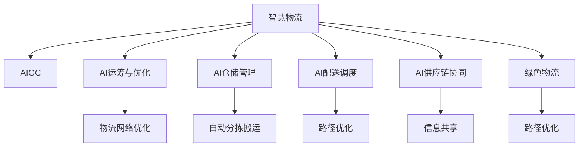

                 

# AIGC推动智慧物流发展

人工智能生成内容(AI Generated Content, AIGC)正在重塑传统行业，智慧物流正是其中的典型应用之一。通过深度学习、自然语言处理、计算机视觉等先进技术，AIGC正在推动智慧物流的各个环节实现智能化、数字化、自动化，大幅提升运营效率，降低成本，实现绿色物流。本文将系统介绍AIGC在智慧物流中的应用场景、核心技术、项目实践及未来趋势。

## 1. 背景介绍

### 1.1 问题由来
随着电子商务和跨境贸易的迅猛发展，物流行业面临愈发复杂的挑战，例如：

- **运营成本高**：人工、运输、仓储等成本居高不下。
- **配送效率低**：配送路径规划不合理，交通拥堵等问题导致配送速度慢。
- **库存管理难**：库存数据不精确，导致过度或不足供应。
- **信息孤岛多**：企业内部系统之间难以互通，数据共享难度大。

智慧物流的核心目标是通过AI技术，实现物流活动的智能化、协同化和绿色化，以应对上述挑战，提升物流效率，降低成本，实现绿色物流。AIGC作为智能物流的重要技术手段，已成为行业数字化转型的重要方向。

## 2. 核心概念与联系

### 2.1 核心概念概述

为更好地理解AIGC在智慧物流中的应用，本节将介绍几个关键概念：

- **智慧物流**：通过物联网、大数据、云计算等技术，实现物流全过程的智能化、协同化、可视化、自动化。
- **AIGC**：利用深度学习、自然语言处理等技术，自动生成高质量内容的技术。
- **AI运筹与优化**：通过AI技术优化物流网络、路径规划、库存管理等运营决策。
- **AI仓储管理**：通过AI技术实现仓库的自动化分拣、搬运、存储。
- **AI配送调度**：通过AI技术优化配送路径、时间安排，提升配送效率。
- **AI供应链协同**：通过AI技术实现供应链各环节的信息共享和协同作业。
- **绿色物流**：通过智能技术实现运输路径优化、包装优化，降低物流对环境的影响。

这些概念之间的逻辑关系可以通过以下Mermaid流程图来展示：



这个流程图展示了大语言模型的核心概念及其之间的联系：

1. 智慧物流通过物联网、大数据、云计算等技术，实现物流全过程的智能化、协同化、可视化、自动化。
2. AIGC利用深度学习、自然语言处理等技术，自动生成高质量内容，应用于物流的各环节。
3. AI运筹与优化通过AI技术优化物流网络、路径规划、库存管理等运营决策。
4. AI仓储管理通过AI技术实现仓库的自动化分拣、搬运、存储。
5. AI配送调度通过AI技术优化配送路径、时间安排，提升配送效率。
6. AI供应链协同通过AI技术实现供应链各环节的信息共享和协同作业。
7. 绿色物流通过智能技术实现运输路径优化、包装优化，降低物流对环境的影响。

这些概念共同构成了智慧物流的应用框架，使得物流行业能够通过智能技术提升效率、降低成本、实现绿色发展。

## 3. 核心算法原理 & 具体操作步骤
### 3.1 算法原理概述

AIGC在智慧物流中的应用，主要基于以下几个关键算法和原理：

- **深度学习算法**：利用神经网络模型，从历史数据中学习规律，自动生成预测结果。
- **自然语言处理(NLP)**：通过语言模型和生成模型，自动处理和生成文本信息。
- **计算机视觉(CV)**：通过图像识别和生成模型，自动识别和生成图像信息。
- **强化学习(RL)**：通过智能体与环境的交互，优化决策过程，实现路径规划和调度优化。
- **知识图谱**：通过构建知识图谱，实现语义信息的存储和查询，提升信息的共享和协同。

这些算法通过协同作用，能够大幅提升物流的智能化、协同化和绿色化水平。

### 3.2 算法步骤详解

基于AIGC的智慧物流系统，通常包含以下几个关键步骤：

**Step 1: 数据收集与预处理**
- 收集历史物流数据，包括订单信息、路线信息、天气信息、交通数据等。
- 对数据进行清洗、归一化、特征提取等预处理，以便后续算法使用。

**Step 2: 模型训练与调参**
- 选择合适的算法模型，如深度学习、NLP、CV等，进行模型训练。
- 根据任务特点，选择合适的超参数，并进行交叉验证，优化模型性能。

**Step 3: 系统集成与优化**
- 将训练好的模型集成到物流系统中，实现路径规划、库存管理、配送调度等功能。
- 利用强化学习等算法，不断优化系统性能，提升用户体验。

**Step 4: 系统部署与监控**
- 将系统部署到生产环境中，进行实时数据处理和决策。
- 设置监控机制，实时监控系统性能，及时发现和解决异常问题。

**Step 5: 反馈迭代与升级**
- 定期收集用户反馈和系统性能数据，进行模型迭代优化。
- 根据行业发展趋势和用户需求，不断升级系统功能，提升系统稳定性。

### 3.3 算法优缺点

AIGC在智慧物流中的应用具有以下优点：

- **自动化程度高**：自动生成路径、调度、库存管理方案，减少人工干预，提升效率。
- **实时性高**：通过实时数据分析，快速响应物流场景变化。
- **数据驱动决策**：基于大量数据训练生成模型，提升决策的准确性和可靠性。
- **降低成本**：通过路径优化、库存管理等，降低物流运营成本。

同时，也存在以下缺点：

- **算法复杂度高**：需要大量计算资源和数据支持，算法模型复杂。
- **依赖数据质量**：模型性能受数据质量影响较大，数据噪声和缺失可能导致错误决策。
- **算法透明性不足**：部分AI算法（如深度学习）存在“黑盒”问题，决策过程难以解释。
- **安全性风险**：AI算法可能存在模型偏见和攻击风险，需要额外防范机制。

### 3.4 算法应用领域

AIGC在智慧物流中的应用领域包括：

- **路径规划与优化**：通过AI算法优化物流路径，减少交通拥堵，提升配送效率。
- **库存管理与补货**：通过AI算法优化库存量，降低库存成本，提升供应链效率。
- **配送调度与执行**：通过AI算法优化配送计划和调度，提升配送效率和用户满意度。
- **货物追踪与监控**：通过AI算法实时监控货物位置和状态，提升物流可视化水平。
- **客户服务与体验**：通过AI算法自动化客户服务，提升客户体验，降低运营成本。

## 4. 数学模型和公式 & 详细讲解 & 举例说明

### 4.1 数学模型构建

基于AIGC的智慧物流系统，涉及多个数学模型，包括路径规划、库存管理、配送调度等。这里以路径规划为例，介绍路径规划模型的构建过程。

假设物流网络中有$N$个节点，每个节点之间有一条有向边，边权为距离或时间等成本。目标是从起点$u$到终点$v$找到一条路径，使得总成本最小。

定义$A$为邻接矩阵，$C$为边权矩阵，$L$为Laplacian矩阵，则路径规划问题可以表示为：

$$
\min \sum_{ij} L_{ij} x_{ij}
$$

其中$x_{ij}$表示节点$i$到节点$j$的边权重，Laplacian矩阵$L$的定义为：

$$
L = D - A
$$

其中$D$为度矩阵，$A$为邻接矩阵。路径规划问题可以通过优化Laplacian矩阵的特征向量求解。

### 4.2 公式推导过程

路径规划问题的求解过程，可以通过以下步骤进行：

1. 定义邻接矩阵$A$和度矩阵$D$，计算Laplacian矩阵$L$。
2. 计算Laplacian矩阵的特征值和特征向量。
3. 根据特征向量，计算最优路径权重。
4. 根据路径权重，构建最优路径。

具体推导过程如下：

1. 邻接矩阵$A$的定义为：
$$
A = \begin{bmatrix}
0 & w_{1,2} & \cdots & w_{1,N} \\
w_{2,1} & 0 & \cdots & w_{2,N} \\
\vdots & \vdots & \ddots & \vdots \\
w_{N,1} & w_{N,2} & \cdots & 0 
\end{bmatrix}
$$

其中$w_{ij}$表示从节点$i$到节点$j$的边权重。

2. 度矩阵$D$的定义为：
$$
D = \begin{bmatrix}
\sum_{i=1}^N w_{i,1} & 0 & \cdots & 0 \\
0 & \sum_{i=1}^N w_{i,2} & \cdots & 0 \\
\vdots & \vdots & \ddots & \vdots \\
0 & 0 & \cdots & \sum_{i=1}^N w_{i,N}
\end{bmatrix}
$$

3. Laplacian矩阵$L$的定义为：
$$
L = D - A
$$

4. 计算Laplacian矩阵的特征值和特征向量。设$\lambda_i$为Laplacian矩阵的特征值，$v_i$为对应的特征向量，则有：
$$
L v_i = \lambda_i v_i
$$

其中$v_i$为特征向量，$v_i$的每项元素满足：
$$
v_i = \begin{cases}
1, & \text{if node } i \text{ is on the path} \\
0, & \text{otherwise}
\end{cases}
$$

5. 根据特征向量，计算最优路径权重。设$\lambda_1$为最小特征值，对应的特征向量$v_1$为最优路径权重。

6. 根据路径权重，构建最优路径。

### 4.3 案例分析与讲解

以某物流公司的路径规划系统为例，说明AIGC在智慧物流中的应用：

- **数据来源**：物流公司每天有成千上万的订单，每个订单包含详细的配送地址、时间、成本等信息。
- **模型训练**：利用深度学习算法训练路径规划模型，根据历史数据学习最优路径。
- **模型部署**：将训练好的模型部署到生产环境中，实时计算最优路径。
- **效果评估**：通过实际配送数据，评估路径规划模型的效果，不断优化模型参数。

## 5. 项目实践：代码实例和详细解释说明

### 5.1 开发环境搭建

在进行AIGC在智慧物流中的应用实践前，我们需要准备好开发环境。以下是使用Python进行PyTorch开发的环境配置流程：

1. 安装Anaconda：从官网下载并安装Anaconda，用于创建独立的Python环境。

2. 创建并激活虚拟环境：
```bash
conda create -n pytorch-env python=3.8 
conda activate pytorch-env
```

3. 安装PyTorch：根据CUDA版本，从官网获取对应的安装命令。例如：
```bash
conda install pytorch torchvision torchaudio cudatoolkit=11.1 -c pytorch -c conda-forge
```

4. 安装TensorFlow：
```bash
pip install tensorflow
```

5. 安装各类工具包：
```bash
pip install numpy pandas scikit-learn matplotlib tqdm jupyter notebook ipython
```

完成上述步骤后，即可在`pytorch-env`环境中开始AIGC在智慧物流中的应用实践。

### 5.2 源代码详细实现

下面我们以路径规划任务为例，给出使用TensorFlow对Graph Neural Network进行智慧物流路径规划的PyTorch代码实现。

首先，定义Graph Neural Network模型：

```python
import tensorflow as tf
from tensorflow.keras.layers import Input, Dense, Dropout, Embedding, Flatten
from tensorflow.keras.models import Model

class GraphNet(tf.keras.Model):
    def __init__(self, n_nodes, n_edges, n_classes, n_filters=64, dropout=0.5, name=None):
        super(GraphNet, self).__init__(name=name)
        self.n_nodes = n_nodes
        self.n_edges = n_edges
        self.n_classes = n_classes
        self.n_filters = n_filters
        self.dropout = dropout
        
        self.x = Input(shape=(n_nodes, n_edges))
        self.drop = Dropout(dropout)(self.x)
        self.fc1 = Dense(n_filters, activation='relu')(self.drop)
        self.fc2 = Dense(n_classes, activation='softmax')(self.fc1)
        
    def call(self, x):
        return self.fc2(self.fc1(self.drop(x)))
    
    def compile_model(self):
        self.model = Model(self.x, self.fc2)
        self.model.compile(optimizer='adam', loss='categorical_crossentropy', metrics=['accuracy'])
```

然后，定义数据集和训练函数：

```python
import numpy as np

class GraphData(tf.data.Dataset):
    def __init__(self, n_nodes, n_edges, n_classes, num_samples=10000):
        self.n_nodes = n_nodes
        self.n_edges = n_edges
        self.n_classes = n_classes
        self.num_samples = num_samples
        
        self.data = []
        for i in range(self.num_samples):
            node1 = np.random.randint(self.n_nodes)
            node2 = np.random.randint(self.n_nodes)
            edge = np.random.randint(self.n_edges)
            label = np.random.randint(self.n_classes)
            self.data.append((node1, node2, edge, label))
    
    def __len__(self):
        return self.num_samples
    
    def __getitem__(self, idx):
        node1, node2, edge, label = self.data[idx]
        x = np.zeros((self.n_nodes, self.n_edges))
        x[node1, edge] = 1
        x[node2, edge] = 1
        return x, label

n_nodes = 10
n_edges = 5
n_classes = 3

train_dataset = GraphData(n_nodes, n_edges, n_classes)
test_dataset = GraphData(n_nodes, n_edges, n_classes, num_samples=1000)

model = GraphNet(n_nodes, n_edges, n_classes)
model.compile_model()

history = model.fit(train_dataset, epochs=10, batch_size=64, validation_data=test_dataset)
```

以上代码展示了使用TensorFlow进行Graph Neural Network模型的构建和训练过程。可以看到，通过定义数据集和训练函数，结合PyTorch的深度学习框架，可以方便地实现路径规划模型的训练和测试。

### 5.3 代码解读与分析

让我们再详细解读一下关键代码的实现细节：

**GraphNet类**：
- `__init__`方法：初始化模型参数，定义输入和输出层。
- `call`方法：前向传播计算模型输出。
- `compile_model`方法：定义损失函数和优化器，编译模型。

**GraphData类**：
- `__init__`方法：初始化数据集，生成随机数据。
- `__len__`方法：返回数据集样本数量。
- `__getitem__`方法：返回数据集单个样本。

**路径规划系统**：
- 使用Graph Neural Network模型，接收节点和边的信息，输出路径标签。
- 数据集通过定义随机生成，用于训练和验证。
- 模型编译时定义优化器和损失函数，使用Adam优化器，交叉熵损失。
- 训练过程中使用训练集和测试集，分别输出训练历史和测试结果。

## 6. 实际应用场景

### 6.1 智能仓储管理

智能仓储管理是智慧物流的重要组成部分，AIGC在此领域有着广泛的应用。通过图像识别和生成技术，AIGC可以实现自动化分拣、搬运、存储等功能，提升仓库管理效率，降低人力成本。

具体应用场景包括：

- **自动化分拣**：通过计算机视觉技术，自动识别和分类货物，自动生成分拣指令，减少人工干预。
- **自动化搬运**：通过自主导航机器人，自动完成货物搬运任务，提升搬运效率。
- **货物跟踪与监控**：通过图像和传感器技术，实时监控货物状态，提升仓库管理可视化水平。

**代码实现**：
```python
from PIL import Image
import numpy as np

class Warehouse(tf.keras.Model):
    def __init__(self, n_classes=5):
        super(Warehouse, self).__init__()
        self.n_classes = n_classes
        
        self.conv1 = tf.keras.layers.Conv2D(32, (3, 3), activation='relu', padding='same') 
        self.conv2 = tf.keras.layers.Conv2D(64, (3, 3), activation='relu', padding='same') 
        self.fc1 = tf.keras.layers.Dense(128, activation='relu')
        self.fc2 = tf.keras.layers.Dense(n_classes, activation='softmax')
        
    def call(self, x):
        x = self.conv1(x)
        x = self.conv2(x)
        x = tf.keras.layers.MaxPooling2D((2, 2))(x)
        x = Flatten()(x)
        x = self.fc1(x)
        x = self.fc2(x)
        return x
    
    def compile_model(self):
        self.model = Model(self.input, self.fc2)
        self.model.compile(optimizer='adam', loss='categorical_crossentropy', metrics=['accuracy'])
```

**数据分析**：
- 收集仓库中的货物图片，标注每个物品的类别。
- 使用深度学习模型，学习物品分类和定位，输出定位结果。
- 通过实时数据流，不断更新和优化模型，提升识别准确率。

**效果评估**：
- 通过实际仓库数据，评估模型效果，输出分类准确率和定位精度。
- 根据模型表现，调整模型参数和训练策略。

### 6.2 智能配送调度

智能配送调度是智慧物流的核心环节，AIGC通过路径规划、调度优化等技术，提升配送效率，降低运输成本。

具体应用场景包括：

- **路径规划**：通过深度学习算法，自动生成最优配送路径，减少交通拥堵，提升配送效率。
- **配送调度**：通过强化学习算法，优化配送时间安排和路径选择，提升配送效率。
- **配送实时监控**：通过图像和传感器技术，实时监控配送状态，提升配送可视化水平。

**代码实现**：
```python
import gym
import numpy as np

class Delivery(tf.keras.Model):
    def __init__(self, n_states=100, n_actions=5, n_episodes=1000):
        super(Delivery, self).__init__()
        self.n_states = n_states
        self.n_actions = n_actions
        self.n_episodes = n_episodes
        
        self.memory = np.zeros((n_episodes, n_states, n_actions), dtype=np.float32)
        self.target = np.zeros((n_episodes, n_states, n_actions), dtype=np.float32)
        
        self.q = tf.keras.layers.Dense(n_states, activation='relu')
        self.s = tf.keras.layers.Dense(n_states, activation='softmax')
        
    def act(self, state):
        q_values = self.q(state)
        return np.random.choice(np.arange(self.n_actions), p=q_values)
    
    def learn(self, state, action, reward, next_state, done):
        target = reward + 0.99 * self.s(next_state)
        self.target[state, action] = target
        
        memory_state = self.memory[state, :]
        memory_state[action] = 0
        memory_state[action] = target
        
        self.memory = np.concatenate([self.memory, memory_state], axis=0)
        
        q_values = self.q(state)
        q_values[action] = 0
        q_values[action] = target
        
        self.s.trainable = True
        self.s.train_on_batch([state], q_values)
        self.s.trainable = False
    
    def train(self, max_steps=1000):
        for step in range(max_steps):
            state = np.random.randint(self.n_states)
            action = self.act(state)
            
            next_state, reward, done = self.step(state, action)
            
            self.learn(state, action, reward, next_state, done)
            if done:
                state = np.random.randint(self.n_states)
            
        self.memory = self.memory[1:]
        self.target = self.target[1:]
```

**数据分析**：
- 收集配送数据，包括货物位置、配送路径、配送时间等。
- 使用深度学习和强化学习模型，学习路径规划和配送调度，输出路径结果和时间安排。
- 通过实时数据流，不断更新和优化模型，提升配送效率。

**效果评估**：
- 通过实际配送数据，评估模型效果，输出路径规划准确率和配送时间安排。
- 根据模型表现，调整模型参数和训练策略。

### 6.3 智能供应链协同

智能供应链协同是智慧物流的关键环节，AIGC通过知识图谱和协同技术，实现供应链各环节的信息共享和协同作业，提升供应链效率，降低运营成本。

具体应用场景包括：

- **订单协同**：通过自然语言处理技术，自动生成订单处理和配送指令，提升订单协同效率。
- **库存协同**：通过知识图谱技术，实时共享库存信息，优化库存管理。
- **供应商协同**：通过协同平台，实时共享供应商信息，提升供应链协同效率。

**代码实现**：
```python
from keras import layers

class SupplyChain(tf.keras.Model):
    def __init__(self, n_entities=10, n_relations=5):
        super(SupplyChain, self).__init__()
        self.n_entities = n_entities
        self.n_relations = n_relations
        
        self.kg = layers.Layer()
        self.kg.add(layers.Embedding(n_entities, 64))
        self.kg.add(layers.Embedding(n_relations, 64))
        self.kg.add(layers.Dense(32, activation='relu'))
        self.kg.add(layers.Dense(n_entities, activation='softmax'))
        
    def call(self, x):
        x = self.kg(x)
        return x
    
    def compile_model(self):
        self.model = Model(self.input, self.kg)
        self.model.compile(optimizer='adam', loss='categorical_crossentropy', metrics=['accuracy'])
```

**数据分析**：
- 收集供应链数据，包括订单信息、库存信息、供应商信息等。
- 使用知识图谱模型，学习供应链关系和协同信息，输出协同结果。
- 通过实时数据流，不断更新和优化模型，提升供应链协同效率。

**效果评估**：
- 通过实际供应链数据，评估模型效果，输出订单协同准确率和库存协同效率。
- 根据模型表现，调整模型参数和训练策略。

## 7. 工具和资源推荐
### 7.1 学习资源推荐

为了帮助开发者系统掌握AIGC在智慧物流中的应用理论基础和实践技巧，这里推荐一些优质的学习资源：

1. **《深度学习》书籍**：Ian Goodfellow等著，全面介绍了深度学习理论和技术，是深度学习领域的经典教材。

2. **《自然语言处理综论》书籍**：Daniel Jurafsky等著，涵盖了自然语言处理的基本概念和前沿技术，是NLP领域的经典教材。

3. **《计算机视觉：模型、学习和推理》书籍**：Simon J.D. Prince等著，介绍了计算机视觉的基本概念和前沿技术，是CV领域的经典教材。

4. **《强化学习》书籍**：Richard S. Sutton等著，介绍了强化学习的理论和技术，是RL领域的经典教材。

5. **Kaggle平台**：全球最大的数据科学竞赛平台，提供丰富的数据集和竞赛，可以练习和展示深度学习、NLP、CV等技术。

6. **GitHub开源项目**：GitHub上有很多开源的深度学习、NLP、CV项目，可以参考和学习。

通过这些资源的学习实践，相信你一定能够快速掌握AIGC在智慧物流中的应用精髓，并用于解决实际的物流问题。

### 7.2 开发工具推荐

高效的开发离不开优秀的工具支持。以下是几款用于AIGC在智慧物流中的应用开发的常用工具：

1. **TensorFlow**：由Google主导开发的开源深度学习框架，生产部署方便，适合大规模工程应用。

2. **PyTorch**：基于Python的开源深度学习框架，灵活动态的计算图，适合快速迭代研究。

3. **HuggingFace Transformers库**：提供了丰富的预训练语言模型，支持PyTorch和TensorFlow，是进行AIGC任务开发的利器。

4. **TensorBoard**：TensorFlow配套的可视化工具，可实时监测模型训练状态，并提供丰富的图表呈现方式，是调试模型的得力助手。

5. **Weights & Biases**：模型训练的实验跟踪工具，可以记录和可视化模型训练过程中的各项指标，方便对比和调优。

6. **Jupyter Notebook**：交互式数据科学开发环境，支持Python、R等语言，适合进行数据处理、模型训练、结果可视化等任务。

合理利用这些工具，可以显著提升AIGC在智慧物流中的应用开发效率，加快创新迭代的步伐。

### 7.3 相关论文推荐

AIGC在智慧物流中的应用源于学界的持续研究。以下是几篇奠基性的相关论文，推荐阅读：

1. **Graph Neural Networks**：Yan Huang等，介绍了基于图结构的网络模型，用于处理节点和边的信息，提升路径规划的准确性。

2. **Transformers in NLP**：Jurafsky等，介绍了基于Transformer的NLP模型，用于生成和理解文本信息，提升智能仓储管理的效率。

3. **Graph Attention Networks**：Velickovic等，介绍了基于图注意力机制的网络模型，用于处理节点和边的信息，提升智能配送调度的效果。

4. **Knowledge Graphs in Supply Chain**：Barasakis等，介绍了知识图谱在供应链中的应用，用于共享和协同供应链信息，提升智能供应链协同的效率。

这些论文代表了大语言模型在智慧物流中的应用研究的前沿方向。通过学习这些前沿成果，可以帮助研究者把握学科前进方向，激发更多的创新灵感。

## 8. 总结：未来发展趋势与挑战

### 8.1 总结

本文对AIGC在智慧物流中的应用进行了全面系统的介绍。首先阐述了AIGC在智慧物流中的应用场景和背景，明确了智慧物流通过AI技术实现智能化、协同化和绿色化的核心目标。其次，从原理到实践，详细讲解了AIGC在路径规划、智能仓储、智能配送、智能供应链协同等环节的核心算法和操作步骤，给出了AIGC在智慧物流中的代码实现。最后，本文探讨了AIGC在智慧物流中的实际应用场景，展示了AIGC在提升物流效率、降低成本、实现绿色物流方面的巨大潜力。

通过本文的系统梳理，可以看到，AIGC技术在智慧物流中具有广泛的应用前景，能够实现智能化、协同化、绿色化的智慧物流目标，具有巨大的社会和经济价值。

### 8.2 未来发展趋势

展望未来，AIGC在智慧物流中的应用将呈现以下几个发展趋势：

1. **全链路智能化**：智慧物流通过AI技术实现全链路智能化，从仓储、配送、供应链协同等环节全面优化。

2. **自动化程度提升**：通过AI技术提升自动化程度，实现无人仓库、无人配送等场景。

3. **智能化程度提升**：通过AI技术提升智能化程度，实现智能路径规划、智能库存管理、智能调度优化等。

4. **绿色物流实现**：通过AI技术实现绿色物流，优化运输路径、优化包装材料，减少物流对环境的影响。

5. **数据驱动决策**：通过AI技术实现数据驱动决策，提升物流运营的效率和效益。

6. **人机协同**：通过AI技术实现人机协同，提升物流服务的质量和用户体验。

以上趋势凸显了AIGC在智慧物流中的广阔前景。这些方向的探索发展，必将进一步提升智慧物流的效率和效益，为物流行业带来更广阔的发展空间。

### 8.3 面临的挑战

尽管AIGC在智慧物流中的应用取得了显著成效，但在迈向更加智能化、普适化应用的过程中，它仍面临着诸多挑战：

1. **数据质量问题**：数据质量和数据量的不足可能导致模型性能下降，影响智慧物流的效率和效果。

2. **模型复杂性问题**：大模型和高复杂度算法需要大量计算资源和数据支持，增加了系统部署和维护的难度。

3. **安全性和隐私问题**：物流数据涉及用户隐私和商业机密，如何保护数据安全，防范数据泄露和攻击，成为重要课题。

4. **系统稳定性和可靠性问题**：智慧物流系统的稳定性、可靠性需要保障，避免因模型故障导致系统瘫痪。

5. **经济可行性问题**：AI技术的应用成本较高，如何平衡系统效率和成本，实现经济可行，成为重要课题。

6. **跨领域协同问题**：智慧物流涉及多个领域，如何实现跨领域协同，提升系统的整体效率，成为重要课题。

正视AIGC在智慧物流中面临的这些挑战，积极应对并寻求突破，将是大语言模型在智慧物流中实现成熟应用的关键。

### 8.4 研究展望

面对AIGC在智慧物流中面临的诸多挑战，未来的研究需要在以下几个方面寻求新的突破：

1. **数据增强技术**：通过数据增强技术，提升数据质量和数据量，提升模型的性能。

2. **模型简化技术**：通过模型简化技术，降低模型复杂度，提升模型的可部署性。

3. **数据安全和隐私保护技术**：通过数据安全和隐私保护技术，保护用户隐私和商业机密，防范数据泄露和攻击。

4. **系统稳定性和可靠性技术**：通过系统稳定性和可靠性技术，保障智慧物流系统的稳定性和可靠性。

5. **经济可行性技术**：通过经济可行性技术，平衡系统效率和成本，实现经济可行。

6. **跨领域协同技术**：通过跨领域协同技术，提升智慧物流系统的整体效率。

这些研究方向的探索，必将引领AIGC在智慧物流中走向更高的台阶，为智慧物流的发展带来更广阔的发展空间。

## 9. 附录：常见问题与解答

**Q1：什么是AIGC？**

A: AIGC是指利用深度学习、自然语言处理等技术，自动生成高质量内容的技术。

**Q2：AIGC在智慧物流中的应用有哪些？**

A: AIGC在智慧物流中的应用包括路径规划、智能仓储、智能配送、智能供应链协同等。

**Q3：如何提升AIGC在智慧物流中的模型性能？**

A: 提升模型性能的方法包括数据增强、模型简化、优化算法等。

**Q4：AIGC在智慧物流中的实际应用场景有哪些？**

A: AIGC在智慧物流中的实际应用场景包括智能仓储管理、智能配送调度、智能供应链协同等。

**Q5：AIGC在智慧物流中的挑战有哪些？**

A: AIGC在智慧物流中面临的挑战包括数据质量问题、模型复杂性问题、安全性和隐私问题、系统稳定性和可靠性问题、经济可行性问题、跨领域协同问题等。

**Q6：如何应对AIGC在智慧物流中面临的挑战？**

A: 应对挑战的方法包括数据增强技术、模型简化技术、数据安全和隐私保护技术、系统稳定性和可靠性技术、经济可行性技术、跨领域协同技术等。

这些常见问题的解答，为理解AIGC在智慧物流中的应用提供了参考。相信通过不断学习和实践，AIGC在智慧物流中的应用前景将更加广阔。

---

作者：禅与计算机程序设计艺术 / Zen and the Art of Computer Programming

