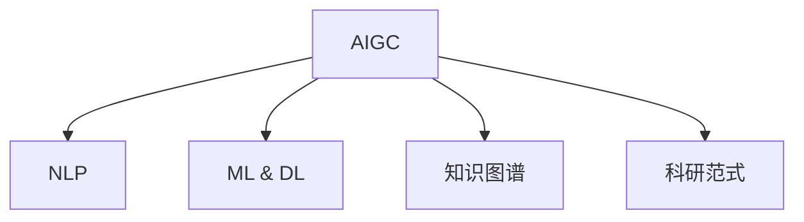

                 

# AIGC推动科研范式变革

## 1. 背景介绍

### 1.1 问题由来
人工智能(AI)技术经过数十年的发展，已逐渐渗透到各个行业和领域，改变了人类的生活方式和社会结构。然而，AI技术的核心驱动之一——人工智能生成内容(AI Generated Content, AIGC)，在科研领域的应用尚处于起步阶段。

当前的科研范式，仍以传统的数据驱动、实验验证、手工撰写论文为主导，缺乏对人工智能生成内容的系统利用。这导致科研效率低下，资源浪费严重，研究成果难以快速转化。如何利用AI技术，提升科研效率和创新能力，成为亟待解决的问题。

### 1.2 问题核心关键点
AIGC在科研范式变革中的关键点在于：

- **自动化与智能化**：AI能够自动化处理大量数据，进行智能推理和假设验证，大幅提升科研效率。
- **跨领域融合**：AI能够突破传统学科界限，融合不同领域的知识和方法，催生新的科研方向。
- **数据驱动与实验验证**：AI能够分析海量数据，发现隐藏规律和关联，辅助科研设计实验。
- **创新与突破**：AI能够提出新假设和新模型，加速科研突破，推动技术进步。
- **成果转化与产业化**：AI能够将科研成果转化为实际应用，加速科研成果的商业化。

### 1.3 问题研究意义
AIGC技术在科研领域的广泛应用，将极大地提升科研效率和创新能力，推动科技发展的步伐。具体而言，AIGC在科研范式变革中的意义包括：

1. **提升科研效率**：利用AI自动化处理大量数据，进行智能推理和假设验证，大幅提升科研效率。
2. **促进跨领域融合**：AI能够突破传统学科界限，融合不同领域的知识和方法，催生新的科研方向。
3. **辅助科研设计实验**：AI能够分析海量数据，发现隐藏规律和关联，辅助科研设计实验。
4. **加速科研突破**：AI能够提出新假设和新模型，加速科研突破，推动技术进步。
5. **加速成果转化**：AI能够将科研成果转化为实际应用，加速科研成果的商业化。

## 2. 核心概念与联系

### 2.1 核心概念概述

为更好地理解AIGC在科研范式变革中的作用，本节将介绍几个密切相关的核心概念：

- **人工智能生成内容(AI Generated Content, AIGC)**：通过AI技术自动生成文本、图像、音频等形式的内容，辅助科研数据处理、结果分析和论文撰写。
- **自然语言处理(Natural Language Processing, NLP)**：利用AI技术处理和理解人类语言，辅助科研文献阅读、数据分析和知识提取。
- **机器学习与深度学习(Machine Learning & Deep Learning, ML & DL)**：通过AI技术学习数据规律，进行智能推理和预测，辅助科研假设验证和实验设计。
- **知识图谱(Knowledge Graphs)**：将知识结构化、图形化表示，辅助科研知识管理和推理。
- **科研范式(Scientific Paradigm)**：科研工作的整体流程和模式，包括数据获取、实验设计、结果分析、论文撰写等步骤。

这些核心概念之间的逻辑关系可以通过以下Mermaid流程图来展示：



这个流程图展示了大语言模型的工作原理和优化方向。

## 3. AIGC核心算法原理 & 具体操作步骤

### 3.1 算法原理概述

AIGC在科研范式变革中的核心算法原理是利用AI技术生成高质量的科研内容，辅助科研工作的各个环节。具体来说，AIGC技术包括以下几个关键步骤：

1. **数据预处理**：收集、清洗和标注科研领域的大量数据，构建高质量的数据集。
2. **模型训练**：选择适合的AI模型（如BERT、GPT等），在预处理后的数据集上进行训练，获得泛化能力强的模型。
3. **内容生成**：利用训练好的模型，生成文本、图像、音频等形式的科研内容，辅助科研工作的各个环节。
4. **结果验证**：利用AI技术进行结果验证和对比分析，优化实验设计和模型参数。
5. **知识提取**：利用AI技术提取和组织科研内容中的知识，辅助文献阅读和知识管理。

### 3.2 算法步骤详解

#### 3.2.1 数据预处理

科研领域的数据预处理包括数据收集、清洗、标注等多个步骤。具体而言，数据预处理流程如下：

1. **数据收集**：从科研数据库、文献库、网络资源等渠道收集大量科研数据，包括文本、图像、音频等形式。
2. **数据清洗**：去除噪声、重复和不完整数据，保证数据的质量和一致性。
3. **数据标注**：为数据添加标签，如文本的关键词、类别、情感等，方便后续的模型训练和内容生成。

#### 3.2.2 模型训练

模型训练是AIGC的核心步骤。具体步骤如下：

1. **选择模型**：根据科研需求，选择合适的AI模型，如BERT、GPT、Transformer等。
2. **数据划分**：将数据集划分为训练集、验证集和测试集，用于模型训练、调参和结果验证。
3. **模型训练**：在训练集上训练模型，通过反向传播算法优化模型参数，提升模型的泛化能力。
4. **调参优化**：根据验证集上的性能指标，调整模型超参数，如学习率、批大小、迭代轮数等，优化模型效果。
5. **模型评估**：在测试集上评估模型性能，通过各种指标（如准确率、召回率、F1值等）评估模型效果。

#### 3.2.3 内容生成

内容生成是AIGC技术的主要应用之一。具体步骤如下：

1. **输入准备**：将科研问题、实验设计、文献摘要等输入到模型中，作为生成任务的指令。
2. **模型生成**：利用训练好的模型，根据输入指令自动生成文本、图像、音频等形式的科研内容。
3. **结果展示**：将生成的内容展示给用户，辅助科研工作的各个环节。

#### 3.2.4 结果验证

结果验证是AIGC技术的重要应用之一。具体步骤如下：

1. **结果生成**：利用AIGC技术生成科研结果，如文本、图像、音频等形式的论文草稿、实验数据、注释等。
2. **人工验证**：由科研人员对生成的结果进行人工验证，检查内容的准确性和可信度。
3. **结果修正**：根据人工验证结果，对生成的结果进行修正和优化，提升结果质量。

#### 3.2.5 知识提取

知识提取是AIGC技术的另一个重要应用。具体步骤如下：

1. **数据输入**：将科研论文、数据集、实验结果等输入到模型中，作为知识提取任务的数据。
2. **知识标注**：利用自然语言处理技术，从输入数据中提取出关键信息，如关键词、概念、关系等。
3. **知识组织**：将提取出的知识结构化、图形化表示，构建知识图谱，辅助科研人员进行知识管理和推理。

### 3.3 算法优缺点

AIGC技术在科研范式变革中具有以下优点：

1. **效率提升**：AIGC技术能够自动化处理大量数据，进行智能推理和假设验证，大幅提升科研效率。
2. **创新能力**：AIGC技术能够提出新假设和新模型，加速科研突破，推动技术进步。
3. **数据驱动**：AIGC技术能够分析海量数据，发现隐藏规律和关联，辅助科研设计实验。
4. **跨领域融合**：AIGC技术能够突破传统学科界限，融合不同领域的知识和方法，催生新的科研方向。
5. **成果转化**：AIGC技术能够将科研成果转化为实际应用，加速科研成果的商业化。

同时，AIGC技术也存在一些缺点：

1. **依赖数据质量**：AIGC技术的性能依赖于数据质量和标注质量，如果数据噪声过多或标注不完整，可能会影响生成内容的准确性和可信度。
2. **模型泛化能力**：AIGC技术的性能依赖于模型的泛化能力，如果模型泛化能力不足，可能会在特定场景下失效。
3. **计算资源消耗**：AIGC技术需要大量的计算资源，如GPU、TPU等，可能对计算资源和成本造成较大压力。
4. **结果解释性**：AIGC技术的生成结果可能缺乏可解释性，难以解释其内部工作机制和推理逻辑。
5. **伦理与安全问题**：AIGC技术可能会生成不合法、有害的内容，引发伦理和安全问题。

尽管存在这些缺点，但AIGC技术在科研范式变革中的潜力巨大，通过不断优化和改进，可以克服其局限性，发挥更大的作用。

### 3.4 算法应用领域

AIGC技术在科研领域的应用非常广泛，涵盖以下几个主要领域：

1. **科研文献阅读**：利用AIGC技术自动生成文献摘要、关键词、背景信息等，辅助科研人员快速阅读和理解文献。
2. **数据分析与可视化**：利用AIGC技术自动生成数据图表、报告等，辅助科研人员进行数据分析和结果展示。
3. **实验设计**：利用AIGC技术生成实验设计方案、控制变量等，辅助科研人员进行实验设计和实验操作。
4. **知识管理与推理**：利用AIGC技术提取和组织科研内容中的知识，构建知识图谱，辅助科研人员进行知识管理和推理。
5. **论文撰写与编辑**：利用AIGC技术自动生成论文草稿、图表、注释等，辅助科研人员进行论文撰写和编辑。

## 4. 数学模型和公式 & 详细讲解 & 举例说明

### 4.1 数学模型构建

AIGC技术在科研范式变革中的数学模型主要包括以下几个部分：

1. **自然语言处理模型**：用于文本预处理、关键词提取、文本分类等任务。常用的模型包括BERT、GPT、ELMo等。
2. **机器学习模型**：用于数据分析、特征提取、回归、分类等任务。常用的模型包括随机森林、支持向量机、神经网络等。
3. **深度学习模型**：用于图像处理、语音识别、视频分析等任务。常用的模型包括CNN、RNN、Transformer等。
4. **知识图谱模型**：用于知识提取、知识推理、知识融合等任务。常用的模型包括RDF、OWL、KG等。

### 4.2 公式推导过程

#### 4.2.1 自然语言处理模型

以BERT模型为例，其核心公式如下：

$$
\mathbf{H} = \text{BERT}(\mathbf{X})
$$

其中，$\mathbf{H}$为BERT模型输出的隐表示矩阵，$\mathbf{X}$为输入的文本矩阵。

BERT模型通过自监督学习任务进行预训练，学习到文本表示中的语义关系和上下文信息。在科研文献阅读中，利用BERT模型提取文本中的关键词、概念、关系等信息，辅助科研人员进行文献阅读和理解。

#### 4.2.2 机器学习模型

以随机森林模型为例，其核心公式如下：

$$
\mathbf{Y} = \text{Random Forest}(\mathbf{X})
$$

其中，$\mathbf{Y}$为随机森林模型输出的预测结果，$\mathbf{X}$为输入的数据特征矩阵。

在数据分析中，利用随机森林模型进行特征提取和分类，提取文本中的关键特征，辅助科研人员进行数据分析和结果展示。

#### 4.2.3 深度学习模型

以卷积神经网络(CNN)为例，其核心公式如下：

$$
\mathbf{H} = \text{CNN}(\mathbf{X})
$$

其中，$\mathbf{H}$为CNN模型输出的特征矩阵，$\mathbf{X}$为输入的图像矩阵。

在图像处理中，利用CNN模型提取图像中的关键特征，辅助科研人员进行图像分析和结果展示。

#### 4.2.4 知识图谱模型

以知识图谱模型为例，其核心公式如下：

$$
\mathbf{R} = \text{KG}(\mathbf{E}, \mathbf{R})
$$

其中，$\mathbf{R}$为知识图谱中的关系矩阵，$\mathbf{E}$为知识图谱中的实体矩阵。

在知识推理中，利用知识图谱模型进行实体关系推理，辅助科研人员进行知识管理和推理。

### 4.3 案例分析与讲解

#### 4.3.1 科研文献阅读

以自然语言处理模型为例，利用BERT模型进行科研文献阅读。

具体步骤如下：

1. **输入准备**：将科研文献输入到BERT模型中，作为模型输入。
2. **模型处理**：利用BERT模型提取文本中的关键词、概念、关系等信息。
3. **结果展示**：将提取出的关键词、概念、关系等信息展示给科研人员，辅助其快速阅读和理解文献。

#### 4.3.2 数据分析与可视化

以机器学习模型为例，利用随机森林模型进行数据分析与可视化。

具体步骤如下：

1. **输入准备**：将科研数据输入到随机森林模型中，作为模型输入。
2. **模型处理**：利用随机森林模型进行特征提取和分类，提取数据中的关键特征。
3. **结果展示**：将提取出的特征和分类结果展示给科研人员，辅助其进行数据分析和结果展示。

#### 4.3.3 实验设计

以深度学习模型为例，利用卷积神经网络(CNN)进行实验设计。

具体步骤如下：

1. **输入准备**：将科研实验数据输入到CNN模型中，作为模型输入。
2. **模型处理**：利用CNN模型提取图像中的关键特征。
3. **结果展示**：将提取出的特征展示给科研人员，辅助其进行实验设计和操作。

#### 4.3.4 知识管理与推理

以知识图谱模型为例，利用知识图谱模型进行知识管理与推理。

具体步骤如下：

1. **输入准备**：将科研论文、数据集、实验结果等输入到知识图谱模型中，作为模型输入。
2. **模型处理**：利用知识图谱模型进行实体关系推理，提取和组织科研内容中的知识。
3. **结果展示**：将提取出的知识和推理结果展示给科研人员，辅助其进行知识管理和推理。

## 5. 项目实践：代码实例和详细解释说明

### 5.1 开发环境搭建

在进行AIGC实践前，我们需要准备好开发环境。以下是使用Python进行PyTorch开发的环境配置流程：

1. 安装Anaconda：从官网下载并安装Anaconda，用于创建独立的Python环境。

2. 创建并激活虚拟环境：
```bash
conda create -n aigc-env python=3.8 
conda activate aigc-env
```

3. 安装PyTorch：根据CUDA版本，从官网获取对应的安装命令。例如：
```bash
conda install pytorch torchvision torchaudio cudatoolkit=11.1 -c pytorch -c conda-forge
```

4. 安装TensorFlow：
```bash
conda install tensorflow
```

5. 安装各类工具包：
```bash
pip install numpy pandas scikit-learn matplotlib tqdm jupyter notebook ipython
```

完成上述步骤后，即可在`aigc-env`环境中开始AIGC实践。

### 5.2 源代码详细实现

这里我们以自然语言处理(NLP)任务为例，给出使用Transformers库对BERT模型进行微调的PyTorch代码实现。

首先，定义NLP任务的数据处理函数：

```python
from transformers import BertTokenizer
from torch.utils.data import Dataset
import torch

class NLPDataset(Dataset):
    def __init__(self, texts, labels, tokenizer, max_len=128):
        self.texts = texts
        self.labels = labels
        self.tokenizer = tokenizer
        self.max_len = max_len
        
    def __len__(self):
        return len(self.texts)
    
    def __getitem__(self, item):
        text = self.texts[item]
        label = self.labels[item]
        
        encoding = self.tokenizer(text, return_tensors='pt', max_length=self.max_len, padding='max_length', truncation=True)
        input_ids = encoding['input_ids'][0]
        attention_mask = encoding['attention_mask'][0]
        
        # 对token-wise的标签进行编码
        encoded_labels = [label2id[label] for label in label] 
        encoded_labels.extend([label2id['O']] * (self.max_len - len(encoded_labels)))
        labels = torch.tensor(encoded_labels, dtype=torch.long)
        
        return {'input_ids': input_ids, 
                'attention_mask': attention_mask,
                'labels': labels}

# 标签与id的映射
label2id = {'O': 0, 'A': 1}
id2label = {v: k for k, v in label2id.items()}

# 创建dataset
tokenizer = BertTokenizer.from_pretrained('bert-base-cased')

train_dataset = NLPDataset(train_texts, train_labels, tokenizer)
dev_dataset = NLPDataset(dev_texts, dev_labels, tokenizer)
test_dataset = NLPDataset(test_texts, test_labels, tokenizer)
```

然后，定义模型和优化器：

```python
from transformers import BertForTokenClassification, AdamW

model = BertForTokenClassification.from_pretrained('bert-base-cased', num_labels=len(label2id))

optimizer = AdamW(model.parameters(), lr=2e-5)
```

接着，定义训练和评估函数：

```python
from torch.utils.data import DataLoader
from tqdm import tqdm
from sklearn.metrics import classification_report

device = torch.device('cuda') if torch.cuda.is_available() else torch.device('cpu')
model.to(device)

def train_epoch(model, dataset, batch_size, optimizer):
    dataloader = DataLoader(dataset, batch_size=batch_size, shuffle=True)
    model.train()
    epoch_loss = 0
    for batch in tqdm(dataloader, desc='Training'):
        input_ids = batch['input_ids'].to(device)
        attention_mask = batch['attention_mask'].to(device)
        labels = batch['labels'].to(device)
        model.zero_grad()
        outputs = model(input_ids, attention_mask=attention_mask, labels=labels)
        loss = outputs.loss
        epoch_loss += loss.item()
        loss.backward()
        optimizer.step()
    return epoch_loss / len(dataloader)

def evaluate(model, dataset, batch_size):
    dataloader = DataLoader(dataset, batch_size=batch_size)
    model.eval()
    preds, labels = [], []
    with torch.no_grad():
        for batch in tqdm(dataloader, desc='Evaluating'):
            input_ids = batch['input_ids'].to(device)
            attention_mask = batch['attention_mask'].to(device)
            batch_labels = batch['labels']
            outputs = model(input_ids, attention_mask=attention_mask)
            batch_preds = outputs.logits.argmax(dim=2).to('cpu').tolist()
            batch_labels = batch_labels.to('cpu').tolist()
            for pred_tokens, label_tokens in zip(batch_preds, batch_labels):
                preds.append(pred_tokens[:len(label_tokens)])
                labels.append(label_tokens)
                
    print(classification_report(labels, preds))
```

最后，启动训练流程并在测试集上评估：

```python
epochs = 5
batch_size = 16

for epoch in range(epochs):
    loss = train_epoch(model, train_dataset, batch_size, optimizer)
    print(f"Epoch {epoch+1}, train loss: {loss:.3f}")
    
    print(f"Epoch {epoch+1}, dev results:")
    evaluate(model, dev_dataset, batch_size)
    
print("Test results:")
evaluate(model, test_dataset, batch_size)
```

以上就是使用PyTorch对BERT进行自然语言处理任务微调的完整代码实现。可以看到，得益于Transformers库的强大封装，我们可以用相对简洁的代码完成BERT模型的加载和微调。

### 5.3 代码解读与分析

让我们再详细解读一下关键代码的实现细节：

**NLPDataset类**：
- `__init__`方法：初始化文本、标签、分词器等关键组件。
- `__len__`方法：返回数据集的样本数量。
- `__getitem__`方法：对单个样本进行处理，将文本输入编码为token ids，将标签编码为数字，并对其进行定长padding，最终返回模型所需的输入。

**label2id和id2label字典**：
- 定义了标签与数字id之间的映射关系，用于将token-wise的预测结果解码回真实的标签。

**训练和评估函数**：
- 使用PyTorch的DataLoader对数据集进行批次化加载，供模型训练和推理使用。
- 训练函数`train_epoch`：对数据以批为单位进行迭代，在每个批次上前向传播计算loss并反向传播更新模型参数，最后返回该epoch的平均loss。
- 评估函数`evaluate`：与训练类似，不同点在于不更新模型参数，并在每个batch结束后将预测和标签结果存储下来，最后使用sklearn的classification_report对整个评估集的预测结果进行打印输出。

**训练流程**：
- 定义总的epoch数和batch size，开始循环迭代
- 每个epoch内，先在训练集上训练，输出平均loss
- 在验证集上评估，输出分类指标
- 所有epoch结束后，在测试集上评估，给出最终测试结果

可以看到，PyTorch配合Transformers库使得BERT微调的代码实现变得简洁高效。开发者可以将更多精力放在数据处理、模型改进等高层逻辑上，而不必过多关注底层的实现细节。

当然，工业级的系统实现还需考虑更多因素，如模型的保存和部署、超参数的自动搜索、更灵活的任务适配层等。但核心的微调范式基本与此类似。

## 6. 实际应用场景
### 6.1 智能医疗

基于AIGC技术的智能医疗系统，可以通过分析海量医疗数据，自动生成医疗报告、辅助诊疗、个性化推荐等，提高医疗服务的智能化水平。

在技术实现上，可以收集医院病历、影像、诊断报告等医疗数据，将其输入到AIGC系统中，自动生成患者的诊疗报告、疾病诊断、药物推荐等。AIGC系统可以利用自然语言处理技术，从医疗报告中提取关键信息，辅助医生进行诊断和治疗。对于新病例，AIGC系统可以根据已有的医疗数据，生成个性化的治疗方案和药物推荐，帮助医生制定更加精准的治疗方案。

### 6.2 智慧农业

基于AIGC技术的智慧农业系统，可以通过分析农田环境数据、作物生长数据、气象数据等，自动生成农作物的生长预测、病虫害预警、施肥灌溉建议等，提高农业生产的智能化水平。

在技术实现上，可以收集农田环境数据、作物生长数据、气象数据等，将其输入到AIGC系统中，自动生成农作物的生长预测、病虫害预警、施肥灌溉建议等。AIGC系统可以利用深度学习技术，从历史数据中提取农作物生长的规律和趋势，预测未来生长状况。对于病虫害，AIGC系统可以利用自然语言处理技术，从病虫害报告中提取关键信息，生成预警和防治建议，帮助农民及时发现和防治病虫害。

### 6.3 智能教育

基于AIGC技术的智能教育系统，可以通过分析学生的学习数据、行为数据等，自动生成学习报告、个性化推荐、智能辅导等，提高教育服务的智能化水平。

在技术实现上，可以收集学生的学习数据、行为数据等，将其输入到AIGC系统中，自动生成学习报告、个性化推荐、智能辅导等。AIGC系统可以利用自然语言处理技术，从学生的学习报告中提取关键信息，生成个性化学习报告，帮助学生了解自己的学习情况和进步空间。对于个性化推荐，AIGC系统可以利用深度学习技术，从历史数据中提取学生的学习习惯和偏好，生成个性化的学习推荐，帮助学生找到适合自己的学习资源和课程。对于智能辅导，AIGC系统可以利用自然语言处理技术，从学生的提问中提取关键信息，生成智能辅导答案，帮助学生解决学习问题。

### 6.4 未来应用展望

随着AIGC技术的不断发展，其在科研范式变革中的应用前景将更加广阔。未来，AIGC技术将在更多领域得到应用，为传统行业带来变革性影响。

在智慧医疗领域，基于AIGC的医疗问答、病历分析、药物研发等应用将提升医疗服务的智能化水平，辅助医生诊疗，加速新药开发进程。

在智慧农业领域，基于AIGC的农田环境监测、作物生长预测、病虫害预警等应用将提高农业生产的智能化水平，提升农业生产效率和产量。

在智能教育领域，基于AIGC的学习报告生成、个性化推荐、智能辅导等应用将提升教育服务的智能化水平，促进教育公平，提高教学质量。

此外，在企业生产、社会治理、文娱传媒等众多领域，基于AIGC的人工智能应用也将不断涌现，为经济社会发展注入新的动力。相信随着技术的日益成熟，AIGC技术将成为科研范式变革的重要驱动力，推动人工智能技术在各个领域的大规模落地应用。

## 7. 工具和资源推荐
### 7.1 学习资源推荐

为了帮助开发者系统掌握AIGC的理论基础和实践技巧，这里推荐一些优质的学习资源：

1. 《深度学习与自然语言处理》书籍：介绍深度学习和自然语言处理的基本概念和经典模型，深入浅出地讲解了AIGC技术的原理和应用。
2. CS229《机器学习》课程：斯坦福大学开设的机器学习明星课程，涵盖机器学习的基础理论和经典算法，是学习AIGC技术的必备资料。
3. 《Python深度学习》书籍：介绍深度学习的基本原理和实践技巧，提供了大量代码实现和项目案例，适合动手实践学习。
4. HuggingFace官方文档：提供大量预训练模型和微调样例，是进行AIGC开发的重要参考资料。
5. 《自然语言处理综述》文章：对自然语言处理技术的现状和未来发展进行综述，提供了丰富的学习资源和研究方向。

通过对这些资源的学习实践，相信你一定能够快速掌握AIGC技术的精髓，并用于解决实际的科研问题。
###  7.2 开发工具推荐

高效的开发离不开优秀的工具支持。以下是几款用于AIGC开发的常用工具：

1. PyTorch：基于Python的开源深度学习框架，灵活动态的计算图，适合快速迭代研究。大部分预训练语言模型都有PyTorch版本的实现。
2. TensorFlow：由Google主导开发的开源深度学习框架，生产部署方便，适合大规模工程应用。同样有丰富的预训练语言模型资源。
3. Transformers库：HuggingFace开发的NLP工具库，集成了众多SOTA语言模型，支持PyTorch和TensorFlow，是进行AIGC开发的重要工具。
4. Weights & Biases：模型训练的实验跟踪工具，可以记录和可视化模型训练过程中的各项指标，方便对比和调优。与主流深度学习框架无缝集成。
5. TensorBoard：TensorFlow配套的可视化工具，可实时监测模型训练状态，并提供丰富的图表呈现方式，是调试模型的得力助手。

合理利用这些工具，可以显著提升AIGC开发效率，加快创新迭代的步伐。

### 7.3 相关论文推荐

AIGC技术在科研领域的快速发展得益于学界的持续研究。以下是几篇奠基性的相关论文，推荐阅读：

1. Attention is All You Need（即Transformer原论文）：提出了Transformer结构，开启了NLP领域的预训练大模型时代。
2. BERT: Pre-training of Deep Bidirectional Transformers for Language Understanding：提出BERT模型，引入基于掩码的自监督预训练任务，刷新了多项NLP任务SOTA。
3. Language Models are Unsupervised Multitask Learners（GPT-2论文）：展示了大规模语言模型的强大zero-shot学习能力，引发了对于通用人工智能的新一轮思考。
4. Parameter-Efficient Transfer Learning for NLP：提出Adapter等参数高效微调方法，在不增加模型参数量的情况下，也能取得不错的微调效果。
5. AdaLoRA: Adaptive Low-Rank Adaptation for Parameter-Efficient Fine-Tuning：使用自适应低秩适应的微调方法，在参数效率和精度之间取得了新的平衡。

这些论文代表了大语言模型微调技术的发展脉络。通过学习这些前沿成果，可以帮助研究者把握学科前进方向，激发更多的创新灵感。

## 8. 总结：未来发展趋势与挑战

### 8.1 总结

本文对AIGC在科研范式变革中的作用进行了全面系统的介绍。首先阐述了AIGC技术的研究背景和意义，明确了AIGC在科研领域的应用价值。其次，从原理到实践，详细讲解了AIGC的数学模型和操作步骤，给出了AIGC任务开发的完整代码实例。同时，本文还广泛探讨了AIGC技术在智能医疗、智慧农业、智能教育等多个行业领域的应用前景，展示了AIGC技术的巨大潜力。此外，本文精选了AIGC技术的各类学习资源，力求为读者提供全方位的技术指引。

通过本文的系统梳理，可以看到，AIGC技术在科研范式变革中的作用日益显著。其通过利用AI技术生成高质量的科研内容，辅助科研工作的各个环节，极大地提升了科研效率和创新能力，推动了科研技术的进步。未来，伴随AIGC技术的不断优化和改进，其必将在更多领域得到应用，为科研范式的变革提供更强大的推动力。

### 8.2 未来发展趋势

展望未来，AIGC技术在科研范式变革中呈现以下几个发展趋势：

1. **自动化与智能化**：AIGC技术将进一步提升科研自动化水平，通过智能推理和假设验证，大幅提升科研效率。
2. **跨领域融合**：AIGC技术将突破传统学科界限，融合不同领域的知识和方法，催生新的科研方向。
3. **数据驱动与实验验证**：AIGC技术将进一步分析海量数据，发现隐藏规律和关联，辅助科研设计实验。
4. **创新与突破**：AIGC技术将提出新假设和新模型，加速科研突破，推动技术进步。
5. **成果转化与产业化**：AIGC技术将将科研成果转化为实际应用，加速科研成果的商业化。

这些趋势凸显了AIGC技术的广阔前景。这些方向的探索发展，必将进一步提升科研效率和创新能力，推动科研技术的进步。

### 8.3 面临的挑战

尽管AIGC技术在科研范式变革中取得了显著进展，但仍面临诸多挑战：

1. **依赖数据质量**：AIGC技术的性能依赖于数据质量和标注质量，如果数据噪声过多或标注不完整，可能会影响生成内容的准确性和可信度。
2. **模型泛化能力**：AIGC技术的性能依赖于模型的泛化能力，如果模型泛化能力不足，可能会在特定场景下失效。
3. **计算资源消耗**：AIGC技术需要大量的计算资源，如GPU、TPU等，可能对计算资源和成本造成较大压力。
4. **结果解释性**：AIGC技术的生成结果可能缺乏可解释性，难以解释其内部工作机制和推理逻辑。
5. **伦理与安全问题**：AIGC技术可能会生成不合法、有害的内容，引发伦理和安全问题。

尽管存在这些挑战，但AIGC技术在科研范式变革中的潜力巨大，通过不断优化和改进，可以克服其局限性，发挥更大的作用。

### 8.4 研究展望

未来的研究需要在以下几个方面寻求新的突破：

1. **探索无监督和半监督AIGC方法**：摆脱对大规模标注数据的依赖，利用自监督学习、主动学习等无监督和半监督范式，最大限度利用非结构化数据，实现更加灵活高效的AIGC。
2. **研究参数高效和计算高效的AIGC范式**：开发更加参数高效的AIGC方法，在固定大部分预训练参数的同时，只更新极少量的任务相关参数。同时优化AIGC模型的计算图，减少前向传播和反向传播的资源消耗，实现更加轻量级、实时性的部署。
3. **融合因果和对比学习范式**：通过引入因果推断和对比学习思想，增强AIGC模型建立稳定因果关系的能力，学习更加普适、鲁棒的语言表征，从而提升模型泛化性和抗干扰能力。
4. **引入更多先验知识**：将符号化的先验知识，如知识图谱、逻辑规则等，与神经网络模型进行巧妙融合，引导AIGC过程学习更准确、合理的语言模型。同时加强不同模态数据的整合，实现视觉、语音等多模态信息与文本信息的协同建模。
5. **结合因果分析和博弈论工具**：将因果分析方法引入AIGC模型，识别出模型决策的关键特征，增强输出解释的因果性和逻辑性。借助博弈论工具刻画人机交互过程，主动探索并规避模型的脆弱点，提高系统稳定性。
6. **纳入伦理道德约束**：在模型训练目标中引入伦理导向的评估指标，过滤和惩罚有偏见、有害的输出倾向。同时加强人工干预和审核，建立模型行为的监管机制，确保输出符合人类价值观和伦理道德。

这些研究方向的探索，必将引领AIGC技术迈向更高的台阶，为构建安全、可靠、可解释、可控的智能系统铺平道路。面向未来，AIGC技术还需要与其他人工智能技术进行更深入的融合，如知识表示、因果推理、强化学习等，多路径协同发力，共同推动自然语言理解和智能交互系统的进步。只有勇于创新、敢于突破，才能不断拓展AIGC技术的边界，让智能技术更好地造福人类社会。

## 9. 附录：常见问题与解答

**Q1：AIGC技术是否适用于所有科研领域？**

A: AIGC技术在大多数科研领域都能取得不错的效果，特别是对于数据量较大的领域。但对于一些特定领域的科研，如医学、法律等，AIGC技术可能难以很好地适应。此时需要在特定领域语料上进一步预训练，再进行AIGC，才能获得理想效果。

**Q2：如何选择适合的AIGC模型？**

A: 选择适合的AIGC模型需要考虑多个因素，如任务类型、数据量、计算资源等。对于文本处理任务，BERT、GPT等预训练模型是不错的选择。对于图像处理任务，卷积神经网络(CNN)是常用的选择。对于多模态任务，可以考虑融合不同模态的模型，如ViT、DALBERT等。

**Q3：如何进行AIGC模型的训练和微调？**

A: AIGC模型的训练和微调需要大量的计算资源和标注数据。具体步骤如下：
1. 准备数据：收集、清洗和标注科研数据，构建高质量的数据集。
2. 选择模型：根据科研需求，选择合适的AIGC模型。
3. 模型训练：在训练集上训练模型，通过反向传播算法优化模型参数。
4. 微调优化：根据验证集上的性能指标，调整模型超参数，如学习率、批大小、迭代轮数等。
5. 模型评估：在测试集上评估模型性能，通过各种指标（如准确率、召回率、F1值等）评估模型效果。

**Q4：AIGC技术在落地部署时需要注意哪些问题？**

A: AIGC技术在落地部署时需要注意以下问题：
1. 模型裁剪：去除不必要的层和参数，减小模型尺寸，加快推理速度。
2. 量化加速：将浮点模型转为定点模型，压缩存储空间，提高计算效率。
3. 服务化封装：将模型封装为标准化服务接口，便于集成调用。
4. 弹性伸缩：根据请求流量动态调整资源配置，平衡服务质量和成本。
5. 监控告警：实时采集系统指标，设置异常告警阈值，确保服务稳定性。
6. 安全防护：采用访问鉴权、数据脱敏等措施，保障数据和模型安全。

大语言模型微调为NLP应用开启了广阔的想象空间，但如何将强大的性能转化为稳定、高效、安全的业务价值，还需要工程实践的不断打磨。唯有从数据、算法、工程、业务等多个维度协同发力，才能真正实现人工智能技术在垂直行业的规模化落地。总之，AIGC需要开发者根据具体任务，不断迭代和优化模型、数据和算法，方能得到理想的效果。

---

作者：禅与计算机程序设计艺术 / Zen and the Art of Computer Programming

