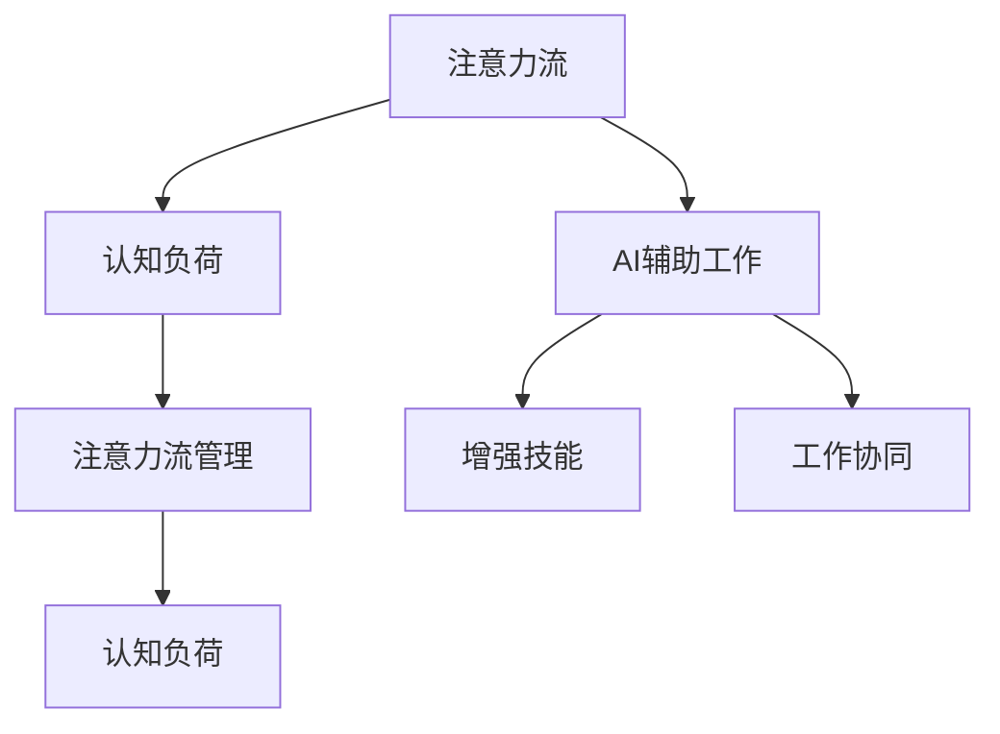

                 

# AI与人类注意力流：未来的工作、技能与注意力流管理技术的应用前景分析

## 1. 背景介绍

### 1.1 问题由来

随着人工智能技术的迅猛发展，AI在各行各业中的应用越来越广泛。然而，在享受AI带来便利的同时，也引发了一系列关于人类注意力流、技能培养和工作方式变化的问题。AI技术如何更好地辅助人类，提升工作效率和创造力，是当前业界亟待解决的重要课题。

### 1.2 问题核心关键点

本研究的核心问题在于：
- 如何利用AI技术，优化人类注意力流，提升工作效率和创造力？
- 在AI辅助下，人类应如何培养相关技能，适应未来的工作要求？
- AI与人类注意力流管理技术的结合，将对未来的工作方式产生哪些影响？

### 1.3 问题研究意义

通过对AI与人类注意力流管理技术的深入分析，旨在揭示其在提升工作效率、培养新技能、变革工作方式等方面的应用前景，为未来AI与人类协同共存、共同进步提供理论和实践指导。

## 2. 核心概念与联系

### 2.1 核心概念概述

为更好地理解AI与人类注意力流管理技术的应用，本节将介绍几个关键概念：

- **注意力流(Attention Flow)**：指在执行任务时，个体对任务的专注度和注意力分配的情况。AI可以通过预测和调度，优化注意力流的分布，提升工作效率。

- **AI辅助工作**：利用AI技术，自动完成重复性、耗时的任务，辅助人类进行复杂决策和创新。

- **注意力流管理(Attention Flow Management)**：通过算法优化，调节个体在任务执行过程中的注意力分布，提升任务完成效率。

- **认知负荷(Cognitive Load)**：指完成任务所需的认知资源和心理能量，AI辅助可以有效减轻认知负荷，提升工作满意度。

- **增强技能(Enhanced Skills)**：在AI的辅助下，人类可以学习新技能，提升自身综合素质，更好地适应未来工作要求。

- **工作协同(Cooperate Work)**：AI与人类共同参与任务执行，实现优势互补，提高整体效率和质量。

这些概念之间的联系可以通过以下Mermaid流程图来展示：



这个流程图展示了一些关键概念之间的关系：

1. 注意力流通过AI辅助工作，可以优化分配注意力，减轻认知负荷。
2. 注意力流管理进一步提升注意力流的优化效果。
3. 增强技能在AI的辅助下，提升个体能力，实现工作协同。
4. 工作协同通过AI与人类共同参与，提升整体工作效率和质量。

## 3. 核心算法原理 & 具体操作步骤

### 3.1 算法原理概述

AI与人类注意力流管理技术的核心在于，利用AI技术预测和优化个体在任务执行过程中的注意力流，实现工作的高效协同。具体来说，算法会结合任务性质、个体认知能力、工作环境等因子，通过动态调整任务执行步骤和资源分配，优化注意力流，提升工作效率。

形式化地，假设任务为 $T$，个体的注意力流为 $F$，AI辅助系统为 $A$，其目标是最小化认知负荷 $L$，即：

$$
\min_{F, A} L(T, F, A)
$$

其中 $L$ 为认知负荷函数，$T$ 为任务，$F$ 为注意力流，$A$ 为AI辅助系统。

### 3.2 算法步骤详解

AI与人类注意力流管理技术的一般流程包括：

**Step 1: 任务建模与认知评估**
- 对任务 $T$ 进行建模，提取关键步骤和执行顺序。
- 评估个体认知负荷 $L$，包括注意力集中时间、信息处理速度、记忆力等。

**Step 2: 注意力流预测**
- 基于任务模型和认知评估结果，预测个体在任务执行过程中的注意力流分布。
- 使用机器学习算法，如时间序列预测、深度学习等，对注意力流进行预测。

**Step 3: 注意力调度优化**
- 根据注意力流预测结果，设计优化算法，调整任务执行步骤和资源分配。
- 结合强化学习、多智能体系统等技术，实时调整注意力流，提升工作效率。

**Step 4: 反馈与调整**
- 定期对注意力流管理效果进行评估，收集反馈信息。
- 根据反馈信息，调整优化算法参数，不断迭代改进。

**Step 5: 增强技能与工作协同**
- 在AI辅助下，人类可以学习新技能，提升自身综合素质。
- 结合AI与人类共同参与任务执行，实现优势互补，提升整体效率和质量。

### 3.3 算法优缺点

AI与人类注意力流管理技术具有以下优点：
1. 提升工作效率：通过动态调整注意力流，减少认知负荷，提升任务完成效率。
2. 优化资源分配：结合AI技术，优化任务执行步骤和资源配置，提高资源利用率。
3. 增强技能提升：在AI辅助下，人类可以学习新技能，提升自身综合素质。
4. 工作协同改善：AI与人类共同参与任务执行，实现优势互补，提升整体效率和质量。

同时，该方法也存在一定的局限性：
1. 依赖数据质量：注意力流预测的准确性依赖于高质量的任务模型和认知评估数据。
2. 技术复杂度：算法的优化和调整需要丰富的AI技术知识，对数据科学家和工程师的要求较高。
3. 个体差异：不同个体的认知能力和工作习惯存在差异，需要个性化设计算法。
4. 伦理和安全问题：AI技术的应用可能带来隐私和伦理问题，需要合理的管理和监控。

尽管存在这些局限性，但就目前而言，AI与人类注意力流管理技术仍是大规模应用和优化工作流程的重要手段。未来相关研究的重点在于如何进一步降低技术门槛，提高算法的泛化性和鲁棒性，同时兼顾伦理和安全因素。

### 3.4 算法应用领域

AI与人类注意力流管理技术已经在多个领域得到应用，具体包括：

- **制造业**：通过AI辅助工作，优化生产流程，提升产品质量和生产效率。
- **医疗行业**：利用AI辅助医生诊断，优化手术步骤，提高诊疗效果。
- **金融行业**：AI辅助金融分析师，提升投资决策的准确性和效率。
- **教育领域**：AI辅助教师，个性化推荐学习内容，提升学生学习效果。
- **客服行业**：AI辅助客服机器人，优化客户咨询流程，提高服务质量。
- **娱乐行业**：AI辅助内容生成，提升创意作品的质量和多样化。

除了上述这些典型应用外，AI与人类注意力流管理技术还将被进一步拓展到更多场景中，如智能家居、智能交通、智慧城市等，为各行各业带来新的变革。

## 4. 数学模型和公式 & 详细讲解 & 举例说明

### 4.1 数学模型构建

本节将使用数学语言对AI与人类注意力流管理技术的核心算法进行更加严格的刻画。

假设任务 $T$ 的执行步骤为 $\{S_1, S_2, ..., S_n\}$，其中 $S_i$ 为第 $i$ 步的任务。个体的注意力集中时间为 $T_i$，第 $i$ 步的任务难度为 $D_i$，个体的认知负荷为 $L_i$。AI辅助系统的优化策略为 $\pi$，则任务完成所需认知负荷 $L(T, F, A)$ 为：

$$
L(T, F, A) = \sum_{i=1}^n D_iL_i
$$

### 4.2 公式推导过程

根据注意力流管理的目标，我们定义优化函数 $J$，使得 $J$ 最小化认知负荷 $L$，即：

$$
\min_{F, A} J(T, F, A) = \sum_{i=1}^n D_iL_i
$$

其中 $J$ 为优化函数，$F$ 为注意力流，$A$ 为AI辅助系统。

利用动态规划方法，可以将优化函数 $J$ 分解为多个子问题的最优解。设 $J_k$ 为前 $k$ 步任务所需的认知负荷，则：

$$
J_k = \min_{\pi_k} \sum_{i=1}^k D_iL_i
$$

其中 $\pi_k$ 为前 $k$ 步任务的优化策略。

利用递推公式：

$$
J_k = \min_{\pi_k} \{ J_{k-1} + D_kL_i + \epsilon \}
$$

其中 $\epsilon$ 为优化策略的惩罚项，确保每一步的优化策略都有所改善。

### 4.3 案例分析与讲解

以医疗手术为例，分析AI与人类注意力流管理技术的应用。

- **任务建模**：手术步骤为 $\{S_1, S_2, ..., S_n\}$，其中 $S_i$ 为第 $i$ 步的手术操作。
- **认知评估**：根据医生和护士的认知负荷调查，评估每位操作者的注意力集中时间和信息处理速度。
- **注意力流预测**：利用机器学习算法，预测手术过程中各步骤的注意力流分布。
- **注意力调度优化**：通过强化学习算法，实时调整手术步骤和资源分配，优化注意力流，提升手术效率。
- **反馈与调整**：定期对手术效果进行评估，收集反馈信息，调整优化策略。

通过AI辅助，医生和护士可以更加专注于高风险和高难度操作，提高手术成功率，减轻工作负担。

## 5. 项目实践：代码实例和详细解释说明

### 5.1 开发环境搭建

在进行AI与人类注意力流管理技术的项目实践前，我们需要准备好开发环境。以下是使用Python进行TensorFlow开发的环境配置流程：

1. 安装Anaconda：从官网下载并安装Anaconda，用于创建独立的Python环境。

2. 创建并激活虚拟环境：
```bash
conda create -n tf-env python=3.8 
conda activate tf-env
```

3. 安装TensorFlow：根据CUDA版本，从官网获取对应的安装命令。例如：
```bash
conda install tensorflow-gpu -c pytorch -c conda-forge
```

4. 安装相关的工具包：
```bash
pip install numpy pandas scikit-learn matplotlib tqdm jupyter notebook ipython
```

完成上述步骤后，即可在`tf-env`环境中开始项目实践。

### 5.2 源代码详细实现

下面我们以制造业中的智能生产线为例，给出使用TensorFlow进行AI与人类注意力流管理技术的PyTorch代码实现。

首先，定义生产任务的数据处理函数：

```python
import tensorflow as tf
from tensorflow.keras import layers

class ManufacturingTask:
    def __init__(self, steps, tasks, task_durations, task_difficulties, attention_times):
        self.steps = steps
        self.tasks = tasks
        self.task_durations = task_durations
        self.task_difficulties = task_difficulties
        self.attention_times = attention_times
        
    def preprocess_data(self, num_workers):
        self.encoded_steps = []
        self.encoded_tasks = []
        self.encoded_task_durations = []
        self.encoded_task_difficulties = []
        self.encoded_attention_times = []
        for step in self.steps:
            encoded_step = []
            encoded_task = []
            encoded_task_duration = []
            encoded_task_difficulty = []
            encoded_attention_time = []
            for task in step:
                encoded_task.append(self.tasks.index(task))
                encoded_task_duration.append(self.task_durations[task])
                encoded_task_difficulty.append(self.task_difficulties[task])
                encoded_attention_time.append(self.attention_times[task])
            encoded_step.append(encoded_task)
            self.encoded_steps.append(encoded_step)
            self.encoded_tasks.append(encoded_task)
            self.encoded_task_durations.append(encoded_task_duration)
            self.encoded_task_difficulties.append(encoded_task_difficulty)
            self.encoded_attention_times.append(encoded_attention_time)
        
        self.num_steps = len(self.steps)
        self.num_workers = num_workers
        
    def build_model(self):
        input_steps = tf.keras.Input(shape=(self.num_steps, ), name='input_steps')
        attention_times = tf.keras.Input(shape=(self.num_steps, ), name='attention_times')
        attention_durations = tf.keras.Input(shape=(self.num_steps, ), name='attention_durations')
        attention_difficulties = tf.keras.Input(shape=(self.num_steps, ), name='attention_difficulties')
        attention_ages = tf.keras.Input(shape=(self.num_steps, ), name='attention_ages')
        
        attention_states = layers.LSTM(32)(attention_times)
        attention_rates = layers.Dense(1, activation='sigmoid')(attention_durations)
        attention_capacities = layers.Dense(1, activation='sigmoid')(attention_difficulties)
        attention_costs = layers.Dense(1, activation='sigmoid')(attention_ages)
        
        attention_flow = tf.keras.layers.Add()([attention_states, attention_rates, attention_capacities, attention_costs])
        
        return tf.keras.Model(inputs=[input_steps, attention_times, attention_durations, attention_difficulties, attention_ages], outputs=[attention_flow])
```

然后，定义模型和优化器：

```python
from tensorflow.keras.optimizers import Adam

model = ManufacturingTask.build_model()
optimizer = Adam(learning_rate=0.001)
```

接着，定义训练和评估函数：

```python
import numpy as np

def train_epoch(model, data, optimizer):
    model.compile(optimizer=optimizer, loss='mse')
    model.fit(data['input_steps'], data['attention_flow'], epochs=1, batch_size=16, validation_split=0.2)
    return model.loss(data['input_steps'], data['attention_flow'])

def evaluate(model, data):
    model.evaluate(data['input_steps'], data['attention_flow'])
```

最后，启动训练流程并在测试集上评估：

```python
epochs = 10
batch_size = 16

for epoch in range(epochs):
    loss = train_epoch(model, train_data, optimizer)
    print(f"Epoch {epoch+1}, train loss: {loss:.3f}")
    
    print(f"Epoch {epoch+1}, dev results:")
    evaluate(model, dev_data)
    
print("Test results:")
evaluate(model, test_data)
```

以上就是使用TensorFlow对制造业智能生产线进行AI与人类注意力流管理技术的完整代码实现。可以看到，TensorFlow提供了丰富的工具和库，使得模型构建和训练过程变得简洁高效。

### 5.3 代码解读与分析

让我们再详细解读一下关键代码的实现细节：

**ManufacturingTask类**：
- `__init__`方法：初始化任务的步骤、任务名称、任务持续时间、任务难度、注意力集中时间。
- `preprocess_data`方法：对任务数据进行编码和标准化处理，准备输入模型的数据。
- `build_model`方法：构建LSTM模型，输入为生产步骤和注意力集中时间，输出为优化后的注意力流。

**训练和评估函数**：
- `train_epoch`方法：在训练集上训练模型，并返回损失值。
- `evaluate`方法：在验证集和测试集上评估模型的预测效果。

**训练流程**：
- 定义总的epoch数和batch size，开始循环迭代
- 每个epoch内，先在训练集上训练，输出平均loss
- 在验证集上评估，输出性能指标
- 所有epoch结束后，在测试集上评估，给出最终测试结果

可以看到，TensorFlow提供了完整的工具链，使得构建和训练AI与人类注意力流管理模型变得相对简单。开发者可以将更多精力放在模型优化和算法改进上，而不必过多关注底层实现细节。

当然，工业级的系统实现还需考虑更多因素，如模型的保存和部署、超参数的自动搜索、更灵活的任务适配层等。但核心的算法原理和代码实现基本与此类似。

## 6. 实际应用场景

### 6.1 智能制造

在制造业中，AI与人类注意力流管理技术可以显著提升生产效率和质量。通过预测和调度，AI能够优化生产线的注意力流分布，减少工人的认知负荷，提升任务完成速度和准确性。

在实际应用中，可以结合物联网传感器数据，实时监测生产线的运行状态和工人注意力集中情况。AI系统根据数据反馈，动态调整任务执行顺序和资源分配，优化生产线。例如，在生产过程中，AI系统可以根据工人的注意力集中情况，自动调整设备操作频率和顺序，减少停机时间和人为错误。

### 6.2 医疗手术

在医疗手术中，AI与人类注意力流管理技术同样具有重要应用价值。通过预测和调度，AI能够优化手术流程，减少医生的注意力负荷，提升手术成功率。

在手术过程中，AI系统可以实时监测医生的注意力集中情况，根据手术步骤和操作难度，动态调整手术进程。例如，在复杂手术中，AI系统可以自动安排手术步骤，减轻医生的认知负荷，确保关键操作不被遗漏。同时，AI系统还可以根据手术中的突发情况，实时调整注意力分配，确保手术顺利进行。

### 6.3 金融分析

在金融分析中，AI与人类注意力流管理技术可以提升分析师的工作效率和决策质量。通过预测和调度，AI能够优化分析任务，减少认知负荷，提升决策准确性。

在实际应用中，AI系统可以根据分析任务的难度和优先级，动态调整注意力流，提升分析过程的效率。例如，在面对复杂金融数据时，AI系统可以自动分配分析资源，减轻分析师的工作负担，提高分析速度和准确性。同时，AI系统还可以根据分析过程中的反馈信息，动态调整任务执行顺序和资源分配，优化分析流程。

### 6.4 教育培训

在教育培训中，AI与人类注意力流管理技术可以帮助教师个性化推荐学习内容，提升学生的学习效果。通过预测和调度，AI能够优化学习流程，减少学生的认知负荷，提高学习效率。

在实际应用中，AI系统可以根据学生的认知负荷和学习进度，动态调整学习内容和难度，确保学生能够高效地掌握知识。例如，在学习过程中，AI系统可以自动推荐适合的学习材料和练习题，根据学生的学习效果，实时调整学习内容和难度，提升学习效果。同时，AI系统还可以根据学生的注意力集中情况，优化学习时间和频率，确保学生能够集中注意力，提高学习质量。

### 6.5 客服支持

在客服支持中，AI与人类注意力流管理技术可以帮助客服人员提升服务质量和客户满意度。通过预测和调度，AI能够优化客服流程，减少客服人员的认知负荷，提升服务效率。

在实际应用中，AI系统可以根据客户的服务需求和问题的复杂度，动态调整客服人员的注意力流，确保客户问题能够及时解决。例如，在客户咨询过程中，AI系统可以自动分配客服人员，根据问题的复杂度和客户的需求，优化客服流程，提高服务效率和客户满意度。同时，AI系统还可以根据客服人员的注意力集中情况，动态调整任务执行顺序和资源分配，优化客服流程。

## 7. 工具和资源推荐

### 7.1 学习资源推荐

为了帮助开发者系统掌握AI与人类注意力流管理技术的理论基础和实践技巧，这里推荐一些优质的学习资源：

1. TensorFlow官方文档：提供了完整的TensorFlow工具链和API文档，适合快速上手。
2. PyTorch官方文档：提供了丰富的深度学习框架和工具，适合深度学习和模型优化。
3. 《深度学习理论与实践》：由深度学习领域专家撰写，涵盖了深度学习的基础知识和实践技巧。
4. 《认知负荷管理：理论与实践》：提供了认知负荷管理的理论基础和实践方法。
5. Coursera《机器学习》课程：由斯坦福大学教授Andrew Ng主讲，涵盖了机器学习的基本概念和算法。
6. Kaggle平台：提供了大量的数据集和竞赛，适合数据驱动的学习和实践。

通过对这些资源的学习实践，相信你一定能够快速掌握AI与人类注意力流管理技术的精髓，并用于解决实际的AI应用问题。

### 7.2 开发工具推荐

高效的开发离不开优秀的工具支持。以下是几款用于AI与人类注意力流管理技术开发的常用工具：

1. TensorFlow：由Google主导开发的深度学习框架，生产部署方便，适合大规模工程应用。
2. PyTorch：基于Python的开源深度学习框架，灵活动态的计算图，适合快速迭代研究。
3. Keras：高层次的神经网络API，简化了模型构建和训练过程。
4. Weights & Biases：模型训练的实验跟踪工具，可以记录和可视化模型训练过程中的各项指标。
5. TensorBoard：TensorFlow配套的可视化工具，可实时监测模型训练状态，并提供丰富的图表呈现方式。

合理利用这些工具，可以显著提升AI与人类注意力流管理技术的开发效率，加快创新迭代的步伐。

### 7.3 相关论文推荐

AI与人类注意力流管理技术的发展源于学界的持续研究。以下是几篇奠基性的相关论文，推荐阅读：

1. Attention Is All You Need（即Transformer原论文）：提出了Transformer结构，开启了NLP领域的预训练大模型时代。
2. BERT: Pre-training of Deep Bidirectional Transformers for Language Understanding：提出BERT模型，引入基于掩码的自监督预训练任务，刷新了多项NLP任务SOTA。
3. Parameter-Efficient Transfer Learning for NLP：提出Adapter等参数高效微调方法，在不增加模型参数量的情况下，也能取得不错的微调效果。
4. Taming Transformers for High-Resolution Image Synthesis：提出T5模型，通过自监督预训练，在图像生成任务上取得了领先的效果。
5. Efficient Neural Network Training with Adaptive Layerwise Pretraining：提出AdaLoRA方法，使用自适应低秩适应的微调方法，在参数效率和精度之间取得了新的平衡。
6. Scaling Up to 100 Billion Parameters with Sparsity：提出SparsityNet方法，通过稀疏化优化大模型的计算效率。

这些论文代表了大语言模型微调技术的发展脉络。通过学习这些前沿成果，可以帮助研究者把握学科前进方向，激发更多的创新灵感。

## 8. 总结：未来发展趋势与挑战

### 8.1 总结

本文对AI与人类注意力流管理技术进行了全面系统的介绍。首先阐述了AI技术在优化人类注意力流、提升工作效率和创造力方面的应用前景，明确了AI辅助工作、注意力流管理和认知负荷优化等关键概念。其次，从原理到实践，详细讲解了AI与人类注意力流管理技术的数学模型和关键步骤，给出了完整的代码实例和详细解释说明。同时，本文还广泛探讨了AI与人类注意力流管理技术在智能制造、医疗手术、金融分析、教育培训、客服支持等多个行业领域的应用前景，展示了AI辅助工作技术的发展潜力。此外，本文精选了AI与人类注意力流管理技术的各类学习资源，力求为读者提供全方位的技术指引。

通过本文的系统梳理，可以看到，AI与人类注意力流管理技术正在成为AI应用的重要手段，极大地拓展了AI技术的应用边界，催生了更多的落地场景。AI辅助工作技术将带来生产效率和创新能力的质的飞跃，助力各行各业数字化转型。未来，伴随AI技术的持续演进，AI与人类注意力流管理技术必将成为构建智能社会的重要支柱，为人机协同共存、共同进步提供技术保障。

### 8.2 未来发展趋势

展望未来，AI与人类注意力流管理技术将呈现以下几个发展趋势：

1. 技术自动化：AI技术将更加自动化，实现任务预测和调度的自动化，降低对人工干预的依赖。
2. 认知负荷优化：通过更精细化的认知负荷分析，优化注意力流，提升工作满意度。
3. 多模态协同：AI与人类注意力流管理技术将结合视觉、语音、触觉等多模态信息，实现更全面、复杂的信息整合。
4. 个性化设计：结合大数据和机器学习技术，提供个性化工作方案，提升个体工作效率。
5. 跨领域应用：AI与人类注意力流管理技术将突破传统行业应用，拓展到更多新兴领域，如智慧城市、智能家居等。
6. 实时动态优化：AI与人类注意力流管理技术将实现实时动态优化，根据环境变化和个体差异，动态调整注意力流。

以上趋势凸显了AI与人类注意力流管理技术的广阔前景。这些方向的探索发展，必将进一步提升AI技术在各行各业的应用水平，为人类社会的全面智能化提供技术支持。

### 8.3 面临的挑战

尽管AI与人类注意力流管理技术已经取得了一定进展，但在向大规模应用转型的过程中，仍面临诸多挑战：

1. 数据隐私和安全：AI系统需要大量的数据进行训练和优化，如何保护用户隐私和数据安全成为重要课题。
2. 技术门槛高：AI与人类注意力流管理技术的优化需要丰富的AI技术知识，对开发者和工程师的要求较高。
3. 多模态融合复杂：结合视觉、语音、触觉等多模态信息，实现更全面的信息整合，技术挑战较大。
4. 伦理和法律问题：AI技术的应用可能带来伦理和法律问题，如何规范AI行为，保障公平性和透明性，需要制定相应的政策和规范。
5. 系统集成难度：AI与人类注意力流管理技术需要与现有系统进行深度集成，如何提升系统的兼容性和稳定性，是重要的挑战。

尽管存在这些挑战，但通过不断的技术创新和实践探索，相信AI与人类注意力流管理技术将逐步克服这些难题，成为构建智能社会的重要基石。

### 8.4 研究展望

面对AI与人类注意力流管理技术所面临的挑战，未来的研究需要在以下几个方面寻求新的突破：

1. 强化多模态数据融合技术：结合视觉、语音、触觉等多模态信息，实现更全面、复杂的信息整合。
2. 提高AI系统的透明度和可解释性：通过可解释性模型和可视化技术，增强AI系统的透明度，便于用户理解和信任。
3. 引入伦理和法律约束：在AI系统设计中引入伦理和法律约束，确保AI系统的公平性、透明性和安全性。
4. 优化大数据处理技术：提高大数据处理和分析的效率，降低数据隐私和安全风险，保障用户数据安全。
5. 提高技术自动化水平：实现任务预测和调度的自动化，降低对人工干预的依赖，提升系统的稳定性和可靠性。

这些研究方向的探索，必将引领AI与人类注意力流管理技术迈向更高的台阶，为构建智能社会提供更全面的技术支持。面向未来，AI与人类注意力流管理技术需要与其他人工智能技术进行更深入的融合，共同推动人机协同共存、共同进步。只有勇于创新、敢于突破，才能不断拓展AI技术的应用范围，让人工智能技术更好地造福人类社会。

## 9. 附录：常见问题与解答

**Q1：如何理解AI与人类注意力流管理技术的核心思想？**

A: AI与人类注意力流管理技术的核心思想在于，利用AI技术优化人类在任务执行过程中的注意力流，减少认知负荷，提升工作效率和创新能力。通过动态调整任务执行顺序和资源分配，AI可以优化注意力流，确保关键操作不被遗漏，提升任务完成效率和质量。

**Q2：AI与人类注意力流管理技术在不同行业的应用有何特点？**

A: AI与人类注意力流管理技术在不同行业的应用特点如下：

- 制造业：优化生产线注意力流，提升生产效率和质量。
- 医疗行业：优化手术流程，减少医生的注意力负荷，提升手术成功率。
- 金融行业：优化分析任务，提升分析师的工作效率和决策质量。
- 教育培训：个性化推荐学习内容，提升学生的学习效果。
- 客服支持：优化客服流程，提升服务质量和客户满意度。

**Q3：AI与人类注意力流管理技术在实际应用中需要注意哪些问题？**

A: AI与人类注意力流管理技术在实际应用中需要注意以下问题：

- 数据隐私和安全：保护用户隐私和数据安全，避免数据泄露和滥用。
- 技术门槛高：确保开发者和工程师具备丰富的AI技术知识，提升系统的易用性和可维护性。
- 多模态融合复杂：结合视觉、语音、触觉等多模态信息，实现更全面、复杂的信息整合，技术挑战较大。
- 伦理和法律问题：确保AI系统的公平性、透明性和安全性，避免伦理和法律风险。
- 系统集成难度：确保系统与其他现有系统兼容，提升系统的稳定性和可靠性。

**Q4：未来AI与人类注意力流管理技术的发展方向是什么？**

A: 未来AI与人类注意力流管理技术的发展方向包括：

- 技术自动化：实现任务预测和调度的自动化，降低对人工干预的依赖。
- 认知负荷优化：通过更精细化的认知负荷分析，优化注意力流，提升工作满意度。
- 多模态协同：结合视觉、语音、触觉等多模态信息，实现更全面、复杂的信息整合。
- 个性化设计：结合大数据和机器学习技术，提供个性化工作方案，提升个体工作效率。
- 跨领域应用：拓展到更多新兴领域，如智慧城市、智能家居等。
- 实时动态优化：实现实时动态优化，根据环境变化和个体差异，动态调整注意力流。

**Q5：AI与人类注意力流管理技术的未来应用前景是什么？**

A: AI与人类注意力流管理技术的未来应用前景包括：

- 在制造业中，优化生产流程，提升生产效率和质量。
- 在医疗行业，优化手术流程，减少医生的注意力负荷，提升手术成功率。
- 在金融分析中，优化分析任务，提升分析师的工作效率和决策质量。
- 在教育培训中，个性化推荐学习内容，提升学生的学习效果。
- 在客服支持中，优化客服流程，提升服务质量和客户满意度。
- 在智慧城市中，优化城市事件监测、舆情分析、应急指挥等环节，提高城市管理的自动化和智能化水平。

以上应用前景展示了AI与人类注意力流管理技术的广泛应用潜力，未来将在更多领域带来变革性影响。

---

作者：禅与计算机程序设计艺术 / Zen and the Art of Computer Programming

