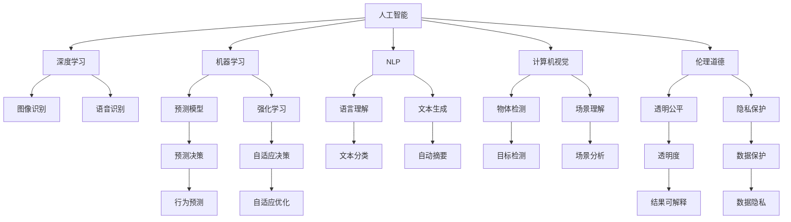

                 

## 1. 背景介绍

在21世纪的技术洪流中，人工智能（AI）已经成为一个不可忽视的趋势，深刻影响了人类社会的方方面面。从智能助理到自动驾驶，从医疗诊断到金融分析，AI的应用正在重塑我们的生活方式。本文旨在探讨AI与人类社会未来发展的关系，分析AI带来的机遇与挑战，并展望AI未来可能的发展路径。

### 1.1 问题由来

AI的发展历史可以追溯到20世纪50年代，但真正引起广泛关注的是2010年代以来，深度学习和神经网络技术的兴起。这一时期，AI在图像识别、自然语言处理、语音识别等领域取得了突破性进展，推动了诸多应用领域的创新。然而，随着AI技术的普及，其对人类社会的影响也引起了广泛的讨论和反思。

### 1.2 问题核心关键点

AI与人类社会的未来发展涉及的核心问题包括：
- **技术进步**：AI技术的快速发展是否会对人类就业、隐私、伦理等方面产生重大影响？
- **社会适应**：社会如何应对AI带来的变革，保证技术进步与人类福祉的平衡？
- **伦理道德**：AI系统的决策是否透明、可解释，是否符合伦理道德标准？
- **安全性**：AI系统是否能够抵御攻击，保护数据和用户隐私？
- **公平性**：AI系统是否存在偏见，如何保证其公平性？

## 2. 核心概念与联系

### 2.1 核心概念概述

为更好地理解AI与人类社会的未来发展，本节将介绍几个密切相关的核心概念：

- **人工智能（Artificial Intelligence, AI）**：使用计算机程序模拟人类智能的领域，包括但不限于机器学习、自然语言处理、计算机视觉等。
- **深度学习（Deep Learning）**：一种特殊的机器学习方法，通过多层次的神经网络结构，从大量数据中学习复杂模式，广泛应用于图像识别、语音识别等领域。
- **机器学习（Machine Learning）**：通过算法使计算机能够从数据中学习，进行预测或决策，是AI的核心技术之一。
- **自然语言处理（Natural Language Processing, NLP）**：使计算机能够理解、解释和生成人类语言的技术。
- **计算机视觉（Computer Vision）**：使计算机能够“看”和“理解”图像和视频的技术。
- **伦理道德（Ethics & Morality）**：AI系统设计和使用的道德准则，包括透明度、隐私保护、公平性等方面。

这些核心概念之间的逻辑关系可以通过以下Mermaid流程图来展示：



这个流程图展示了你人工智能领域的核心概念及其之间的关系：

1. AI通过多个子领域如深度学习、机器学习等技术提供能力。
2. 深度学习在图像、语音等领域的应用，机器学习在预测、强化学习等方面的应用。
3. NLP和计算机视觉提供理解和生成人类语言和视觉信息的能力。
4. 伦理道德关注AI系统的设计和使用是否符合道德标准。

这些概念共同构成了AI的生态系统，相互关联，共同推动AI的发展。

## 3. 核心算法原理 & 具体操作步骤

### 3.1 算法原理概述

AI与人类社会的未来发展，在技术层面涉及多个核心算法原理：

- **监督学习（Supervised Learning）**：使用标注数据训练模型，使其能够对新数据进行预测。
- **无监督学习（Unsupervised Learning）**：使用未标注数据训练模型，发现数据的内在结构。
- **强化学习（Reinforcement Learning）**：通过与环境的交互，学习最优决策策略。
- **迁移学习（Transfer Learning）**：将在一个任务上学到的知识迁移到另一个相关任务上。
- **预训练与微调（Pre-training & Fine-tuning）**：先在大规模数据上预训练模型，再在小规模数据上进行微调，提升模型性能。

### 3.2 算法步骤详解

AI与人类社会的未来发展，在操作层面涉及多个关键步骤：

**Step 1: 收集和准备数据**
- 收集与目标任务相关的数据，并进行预处理、清洗和标注。

**Step 2: 选择和训练模型**
- 根据任务需求，选择合适的模型架构和优化算法。
- 使用大规模数据集对模型进行训练，学习最优参数。

**Step 3: 模型评估和部署**
- 使用测试集对训练好的模型进行评估，判断其性能。
- 将模型部署到实际应用场景中，进行实时推理。

**Step 4: 持续学习和优化**
- 收集新数据，对模型进行重新训练和优化。
- 根据用户反馈和新需求，调整模型策略。

### 3.3 算法优缺点

AI与人类社会的未来发展，在技术层面存在以下优缺点：

#### 优点：
- **效率提升**：AI技术可以自动化处理大量数据，提高工作效率。
- **决策优化**：AI系统能够基于数据和算法做出更准确的决策。
- **创新驱动**：AI技术推动了新的应用和商业模式的出现。

#### 缺点：
- **失业风险**：自动化可能导致部分低技能工作岗位的消失。
- **隐私问题**：数据收集和使用可能侵犯个人隐私。
- **伦理挑战**：AI系统的决策是否透明、公正。

### 3.4 算法应用领域

AI与人类社会的未来发展，在应用层面涉及多个领域：

- **医疗健康**：AI辅助诊断、个性化治疗、药物研发等。
- **金融服务**：风险管理、投资分析、客户服务等。
- **教育培训**：智能辅导、学习分析、内容生成等。
- **智能家居**：语音助手、设备控制、环境监测等。
- **交通运输**：自动驾驶、路径规划、交通管理等。
- **媒体娱乐**：内容推荐、智能编辑、虚拟现实等。

这些应用领域展示了AI技术的广泛应用前景，预示着AI将深刻影响人类社会的各个方面。

## 4. 数学模型和公式 & 详细讲解 & 举例说明

### 4.1 数学模型构建

本节将使用数学语言对AI与人类社会的未来发展进行更加严格的刻画。

记目标任务为 $T$，训练数据集为 $D$，模型为 $M$，目标函数为 $L$。

目标函数 $L$ 用于衡量模型 $M$ 在数据集 $D$ 上的性能，通常包括准确率、精确度、召回率等指标。训练过程可以表示为：

$$
\min_{M} L(M,D)
$$

目标函数的构建需要结合具体任务的特点，选择合适的评估指标。例如，对于分类任务，可以使用交叉熵损失：

$$
L = -\frac{1}{N}\sum_{i=1}^N \sum_{j=1}^C y_{ij}\log M_{ij}
$$

其中 $y_{ij}$ 为第 $i$ 个样本第 $j$ 个类别的真实标签，$M_{ij}$ 为模型对第 $i$ 个样本第 $j$ 个类别的预测概率。

### 4.2 公式推导过程

以下是分类任务中常用的交叉熵损失函数的推导过程：

假设模型 $M$ 在输入 $x$ 上的输出为 $\hat{y}=M(x) \in [0,1]$，表示样本属于正类的概率。真实标签 $y \in \{0,1\}$。则二分类交叉熵损失函数定义为：

$$
L(M(x),y) = -[y\log \hat{y} + (1-y)\log (1-\hat{y})]
$$

将其代入目标函数，得：

$$
L(M,D) = -\frac{1}{N}\sum_{i=1}^N \sum_{j=1}^C y_{ij}\log M_{ij}
$$

### 4.3 案例分析与讲解

以下是一个简单的AI模型训练案例，使用PyTorch框架，训练一个简单的线性分类器：

```python
import torch
import torch.nn as nn
import torch.optim as optim

# 定义模型
class LinearClassifier(nn.Module):
    def __init__(self, input_size, output_size):
        super(LinearClassifier, self).__init__()
        self.linear = nn.Linear(input_size, output_size)

    def forward(self, x):
        return self.linear(x)

# 准备数据
train_data = torch.randn(1000, 10)
train_labels = torch.randint(0, 2, (1000,))

# 定义模型和优化器
model = LinearClassifier(10, 2)
optimizer = optim.SGD(model.parameters(), lr=0.01)

# 训练模型
for epoch in range(10):
    for i in range(10):
        optimizer.zero_grad()
        loss = model(train_data[i]) - train_labels[i]
        loss.backward()
        optimizer.step()

    print(f"Epoch {epoch+1}, loss: {loss:.3f}")
```

这个例子展示了如何使用PyTorch框架训练一个简单的线性分类器。通过定义模型、准备数据、选择优化器等步骤，可以在几行代码内实现基本的模型训练。

## 5. 项目实践：代码实例和详细解释说明

### 5.1 开发环境搭建

在进行AI项目实践前，我们需要准备好开发环境。以下是使用Python进行PyTorch开发的环境配置流程：

1. 安装Anaconda：从官网下载并安装Anaconda，用于创建独立的Python环境。

2. 创建并激活虚拟环境：
```bash
conda create -n pytorch-env python=3.8 
conda activate pytorch-env
```

3. 安装PyTorch：根据CUDA版本，从官网获取对应的安装命令。例如：
```bash
conda install pytorch torchvision torchaudio cudatoolkit=11.1 -c pytorch -c conda-forge
```

4. 安装TensorFlow：由Google主导开发的开源深度学习框架，生产部署方便，适合大规模工程应用。同样有丰富的预训练语言模型资源。

5. 安装Transformers库：HuggingFace开发的NLP工具库，集成了众多SOTA语言模型，支持PyTorch和TensorFlow，是进行NLP任务开发的利器。

6. 安装各类工具包：
```bash
pip install numpy pandas scikit-learn matplotlib tqdm jupyter notebook ipython
```

完成上述步骤后，即可在`pytorch-env`环境中开始AI项目实践。

### 5.2 源代码详细实现

这里我们以一个简单的图像分类任务为例，使用TensorFlow框架和Keras API进行AI项目开发。

首先，准备数据集：

```python
from tensorflow.keras.datasets import mnist
from tensorflow.keras.utils import to_categorical

# 加载MNIST数据集
(train_images, train_labels), (test_images, test_labels) = mnist.load_data()

# 数据预处理
train_images = train_images.reshape((60000, 28*28)) / 255.0
test_images = test_images.reshape((10000, 28*28)) / 255.0
train_labels = to_categorical(train_labels, 10)
test_labels = to_categorical(test_labels, 10)
```

然后，定义模型：

```python
from tensorflow.keras import layers, models

# 定义卷积神经网络模型
model = models.Sequential()
model.add(layers.Conv2D(32, (3,3), activation='relu', input_shape=(28,28,1)))
model.add(layers.MaxPooling2D((2,2)))
model.add(layers.Conv2D(64, (3,3), activation='relu'))
model.add(layers.MaxPooling2D((2,2)))
model.add(layers.Conv2D(64, (3,3), activation='relu'))
model.add(layers.Flatten())
model.add(layers.Dense(64, activation='relu'))
model.add(layers.Dense(10, activation='softmax'))
```

接着，定义训练和评估函数：

```python
from tensorflow.keras.optimizers import Adam

# 定义优化器和损失函数
optimizer = Adam(learning_rate=0.001)
loss_fn = 'categorical_crossentropy'

# 定义训练函数
def train_model(model, train_images, train_labels, epochs, batch_size):
    model.compile(optimizer=optimizer, loss=loss_fn, metrics=['accuracy'])
    model.fit(train_images, train_labels, epochs=epochs, batch_size=batch_size, validation_split=0.2)

# 定义评估函数
def evaluate_model(model, test_images, test_labels):
    loss, accuracy = model.evaluate(test_images, test_labels)
    print(f"Test loss: {loss:.3f}")
    print(f"Test accuracy: {accuracy:.3f}")
```

最后，启动训练流程并在测试集上评估：

```python
epochs = 10
batch_size = 64

# 训练模型
train_model(model, train_images, train_labels, epochs, batch_size)

# 评估模型
evaluate_model(model, test_images, test_labels)
```

以上就是使用TensorFlow框架和Keras API进行图像分类任务的完整代码实现。可以看到，得益于Keras API的强大封装，我们可以用相对简洁的代码完成模型定义、训练和评估。

### 5.3 代码解读与分析

让我们再详细解读一下关键代码的实现细节：

**数据集准备**：
- 使用Keras API加载MNIST数据集，并进行数据预处理，包括将图像数据展平、归一化、标签数据编码。

**模型定义**：
- 使用Keras API定义卷积神经网络模型，包括卷积层、池化层、全连接层等。

**训练函数**：
- 使用Keras API定义训练函数，包括编译模型、设置优化器和损失函数、定义训练步骤。

**评估函数**：
- 使用Keras API定义评估函数，包括在测试集上评估模型性能。

**训练流程**：
- 在定义的模型上进行训练，设定迭代轮数和批大小，并在训练过程中进行验证。

**评估流程**：
- 在测试集上评估模型性能，输出损失和准确率。

可以看出，Keras API使得模型的定义、训练和评估变得十分简单，极大降低了开发者入门的门槛。

当然，工业级的系统实现还需考虑更多因素，如模型的保存和部署、超参数的自动搜索、更灵活的任务适配层等。但核心的模型训练和评估流程基本与此类似。

## 6. 实际应用场景

### 6.1 医疗健康

AI在医疗健康领域的应用正在逐渐普及。通过分析医疗影像、病历记录等数据，AI可以辅助医生进行疾病诊断、治疗方案制定等。例如，谷歌的DeepMind开发的AlphaGo，已经在围棋等复杂游戏中展现出了强大的实力。未来的AI有望在更复杂的医疗健康场景中发挥更大的作用。

### 6.2 金融服务

AI在金融服务领域的应用也非常广泛。通过分析市场数据、客户行为等，AI可以预测股市走势、进行风险管理、自动化客户服务等。例如，亚马逊的Alexa可以回答用户关于金融产品的咨询，银行业的智能客服可以提供自动化的金融咨询。

### 6.3 教育培训

AI在教育培训领域的应用也在不断扩展。通过分析学生的学习数据、评估学习效果等，AI可以提供个性化的学习建议、智能辅导等。例如，Coursera的智能推荐系统可以根据用户的学习历史，推荐适合的课程。

### 6.4 智能家居

AI在智能家居领域的应用也在逐渐普及。通过分析用户的家庭数据、行为数据等，AI可以提供智能化的家居控制、节能方案等。例如，Google Home可以控制家中的智能设备，Amazon Echo可以回答用户的家庭问题。

### 6.5 交通运输

AI在交通运输领域的应用也在不断扩展。通过分析交通数据、路况信息等，AI可以进行路径规划、自动驾驶等。例如，特斯拉的自动驾驶系统可以辅助驾驶员进行驾驶，Uber的智能调度系统可以提高运输效率。

### 6.6 媒体娱乐

AI在媒体娱乐领域的应用也在不断扩展。通过分析用户的观看历史、评价反馈等，AI可以提供个性化的内容推荐、智能编辑等。例如，Netflix的智能推荐系统可以根据用户的观看历史，推荐适合的电影。

## 7. 工具和资源推荐

### 7.1 学习资源推荐

为了帮助开发者系统掌握AI的理论与实践，这里推荐一些优质的学习资源：

1. 《深度学习》系列书籍：由多位深度学习专家合著，全面介绍了深度学习的原理、算法和应用。
2. 《Python机器学习》书籍：介绍了Python语言在机器学习中的应用，适合入门学习。
3. 《TensorFlow官方文档》：TensorFlow的官方文档，提供了详尽的API和使用指南。
4. 《Keras官方文档》：Keras的官方文档，提供了简单易用的API和示例。
5. 《机器学习实战》书籍：介绍了多种机器学习算法的实现和应用，适合实践学习。
6. Coursera和edX等在线学习平台：提供了丰富的AI课程和实战项目，适合系统学习。

通过对这些资源的学习实践，相信你一定能够快速掌握AI的精髓，并用于解决实际的AI问题。

### 7.2 开发工具推荐

高效的开发离不开优秀的工具支持。以下是几款用于AI开发常用的工具：

1. Jupyter Notebook：免费的Jupyter Notebook环境，支持多种编程语言，适合快速迭代和共享代码。
2. Visual Studio Code：流行的开源IDE，支持代码编辑、调试、版本控制等功能，适合多种编程语言。
3. PyTorch：基于Python的开源深度学习框架，灵活动态的计算图，适合快速迭代研究。
4. TensorFlow：由Google主导开发的开源深度学习框架，生产部署方便，适合大规模工程应用。
5. Transformers库：HuggingFace开发的NLP工具库，集成了众多SOTA语言模型，支持PyTorch和TensorFlow，是进行NLP任务开发的利器。
6. Weights & Biases：模型训练的实验跟踪工具，可以记录和可视化模型训练过程中的各项指标，方便对比和调优。
7. Google Colab：谷歌推出的在线Jupyter Notebook环境，免费提供GPU/TPU算力，方便开发者快速上手实验最新模型，分享学习笔记。

合理利用这些工具，可以显著提升AI项目的开发效率，加快创新迭代的步伐。

### 7.3 相关论文推荐

AI与人类社会的未来发展，涉及众多前沿研究领域。以下是几篇奠基性的相关论文，推荐阅读：

1. AlphaGo论文：DeepMind开发的AlphaGo系统在围棋中的胜利，标志着AI在复杂决策中的突破。
2. ImageNet论文：AlexNet在ImageNet数据集上的胜利，标志着深度学习在图像识别领域的崛起。
3. AlphaStar论文：OpenAI开发的AlphaStar系统在星际争霸II中的胜利，标志着AI在多玩家游戏中的突破。
4. GPT系列论文：OpenAI开发的GPT系列模型，展示了语言模型的强大能力。
5. AlphaFold论文：DeepMind开发的AlphaFold系统在蛋白质折叠预测中的胜利，标志着AI在生物信息学领域的突破。

这些论文代表了大规模AI技术的发展脉络。通过学习这些前沿成果，可以帮助研究者把握学科前进方向，激发更多的创新灵感。

## 8. 总结：未来发展趋势与挑战

### 8.1 研究成果总结

本文对AI与人类社会的未来发展进行了全面系统的介绍。首先阐述了AI技术的快速发展及其对人类社会的影响，明确了AI带来的机遇与挑战。其次，从原理到实践，详细讲解了AI的核心算法原理和操作步骤，给出了AI项目开发的完整代码实例。同时，本文还广泛探讨了AI在医疗健康、金融服务、教育培训、智能家居、交通运输、媒体娱乐等多个行业领域的应用前景，展示了AI技术的广泛应用前景。最后，本文精选了AI技术的各类学习资源，力求为读者提供全方位的技术指引。

通过本文的系统梳理，可以看到，AI技术正在深刻影响人类社会的各个方面，预示着未来社会的重大变革。未来，伴随AI技术的持续演进，人类社会将迎来更加智能化、自动化的未来。

### 8.2 未来发展趋势

展望未来，AI与人类社会的未来发展将呈现以下几个趋势：

1. **技术进步**：AI技术将进一步普及，深度学习、自然语言处理、计算机视觉等领域将取得更多突破。
2. **社会适应**：社会对AI技术的接受度将逐渐提高，AI将成为各行各业的重要工具。
3. **伦理道德**：AI系统的设计和使用将更加注重伦理道德，确保其透明性和公平性。
4. **安全性**：AI系统将更加注重安全性，防止恶意攻击和数据泄露。
5. **可解释性**：AI系统的决策过程将更加透明和可解释，便于用户理解和信任。
6. **跨领域融合**：AI技术将与其他技术进行更深入的融合，推动跨学科创新。

这些趋势凸显了AI技术的前景和潜力，预示着未来社会的巨大变革。

### 8.3 面临的挑战

尽管AI技术取得了瞩目成就，但在迈向更加智能化、普适化应用的过程中，它仍面临着诸多挑战：

1. **技术瓶颈**：AI技术在复杂任务中的应用仍存在局限，需要进一步提升。
2. **数据隐私**：数据收集和使用可能侵犯个人隐私，需要加强数据保护。
3. **伦理问题**：AI系统的决策是否透明、公正，是否符合人类价值观，需要深入研究。
4. **安全风险**：AI系统可能受到攻击，数据和模型安全需要保障。
5. **公平性问题**：AI系统可能存在偏见，需要消除偏见，确保公平性。

正视AI面临的这些挑战，积极应对并寻求突破，将是大规模AI技术迈向成熟的必由之路。

### 8.4 研究展望

面对AI面临的挑战，未来的研究需要在以下几个方面寻求新的突破：

1. **多模态学习**：将视觉、语音、文本等多种模态的信息进行融合，提升AI系统的理解和决策能力。
2. **因果推理**：引入因果推断思想，增强AI系统的因果关系和可解释性。
3. **迁移学习**：通过迁移学习，将一个领域学到的知识迁移到另一个领域，提升AI系统的泛化能力。
4. **多任务学习**：通过多任务学习，在多个相关任务上进行联合训练，提升AI系统的性能。
5. **自适应学习**：使AI系统能够根据环境变化进行自适应学习，提升系统的鲁棒性和适应性。
6. **伦理设计**：在设计AI系统时，考虑伦理道德因素，确保系统的透明性和公平性。

这些研究方向的探索，必将引领AI技术的持续演进，为人类社会带来更加智能化、安全的未来。

## 9. 附录：常见问题与解答

**Q1：AI技术是否会导致失业？**

A: AI技术的发展确实会对部分低技能工作岗位产生影响，但同时也会创造新的就业机会，如AI系统维护、数据分析等。AI技术带来的就业结构变化需要社会各界共同应对。

**Q2：AI技术是否会侵犯隐私？**

A: AI技术在数据收集和使用过程中，需要严格遵守隐私保护法规，如GDPR等。数据匿名化、差分隐私等技术可以帮助保护用户隐私。

**Q3：AI技术的决策是否透明？**

A: 当前AI技术的决策过程还存在黑盒问题，透明度不够。未来需要通过模型解释性技术，提升AI系统的可解释性。

**Q4：AI技术的公平性如何保障？**

A: AI技术的公平性需要通过数据预处理、算法设计等方面进行保障。引入多样性数据、消除算法偏见等方法，可以有效提升AI系统的公平性。

**Q5：AI技术的伦理道德标准如何设定？**

A: 设定AI技术的伦理道德标准需要多方参与，包括技术专家、伦理学家、政策制定者等。建立透明、公平、安全的AI系统，是未来发展的方向。

通过本文的系统梳理，可以看到，AI技术正在深刻影响人类社会的各个方面，预示着未来社会的重大变革。未来，伴随AI技术的持续演进，人类社会将迎来更加智能化、自动化的未来。但同时，也需要社会各界共同应对AI技术带来的挑战，确保其安全、透明和公平。

