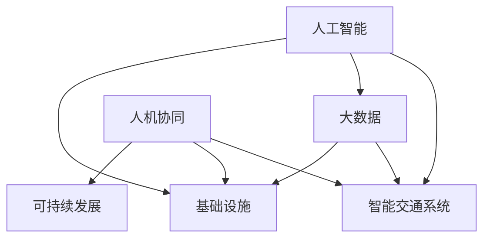

                 

# AI与人类计算：打造可持续发展的城市交通与基础设施规划与管理

## 1. 背景介绍

### 1.1 问题由来

当前，全球城市交通与基础设施规划管理面临着诸多挑战，诸如交通拥堵、能源消耗高、环境污染等问题日益凸显。如何通过智能化手段优化城市交通和基础设施建设，提升运行效率，保障可持续发展，成为了迫在眉睫的课题。人工智能技术的迅猛发展，为解决这些问题提供了新的思路和工具。

### 1.2 问题核心关键点

本文将探讨通过人工智能与人类计算相结合，推动城市交通与基础设施规划管理数字化、智能化转型，提升系统效率，降低环境影响，实现城市的高质量、可持续发展。重点关注以下核心关键点：

- **AI与大数据融合**：整合海量城市数据，提升决策的科学性和预见性。
- **智能交通系统**：基于AI的实时数据处理与分析，优化交通流量管理。
- **基础设施自动化**：使用机器学习与物联网技术，实现设施状态的实时监控与预测。
- **人机协同治理**：将人工智能与人类专家的经验结合，形成人机协同的智能治理体系。
- **持续学习能力**：通过AI模型自我学习和优化，保持系统运行的动态适应性。
- **模型与数据合规性**：确保AI模型的透明性、可解释性和伦理合规。

## 2. 核心概念与联系

### 2.1 核心概念概述

为更好地理解本文内容，本节将介绍几个关键概念：

- **人工智能（AI）**：通过机器学习、深度学习等技术，使机器能够模仿人类智能行为。
- **大数据（Big Data）**：指规模巨大、种类繁多、速度快、价值密度低的数据集，需要通过AI技术进行分析和利用。
- **智能交通系统（ITS）**：利用信息与通信技术，优化交通流量和交通系统效率。
- **基础设施（Infrastructure）**：包括交通网络、能源系统、市政设施等，其智能化和自动化对城市运营至关重要。
- **人机协同（Human-Machine Collaboration）**：将人工智能与人类专家的知识、经验和判断相结合，形成优势互补。
- **可持续发展（Sustainable Development）**：在满足当前社会发展需求的同时，不损害后代满足其需求的能力。

这些概念之间的逻辑关系可以通过以下Mermaid流程图来展示：



这个流程图展示了AI与城市交通、基础设施规划管理相关的几个关键领域及其关联性。AI通过大数据分析、智能交通系统与基础设施的自动化，提升了系统的智能化水平。同时，人机协同和可持续发展目标的实现，进一步推动了AI技术在这些领域的应用。

## 3. 核心算法原理 & 具体操作步骤
### 3.1 算法原理概述

城市交通与基础设施规划管理的AI与人类计算结合，主要通过以下步骤实现：

1. **数据收集与预处理**：收集城市交通、能源、环境等多维度的数据，并进行清洗、标注和标准化。
2. **模型训练与优化**：利用AI模型对数据进行训练和优化，提升模型的预测和决策能力。
3. **实时数据处理与分析**：通过传感器、监控设备等实时收集交通与基础设施状态数据，使用AI模型进行实时分析和预测。
4. **智能决策与控制**：结合AI模型分析结果和人类专家的经验，制定智能决策策略，并控制交通与基础设施运行。
5. **人机协同治理**：将AI模型的预测结果和建议反馈给人类专家，辅助决策和治理。

### 3.2 算法步骤详解

**步骤1: 数据收集与预处理**

城市数据源多样，包括交通流量、车辆位置、天气状况、能源消耗、环境指标等。数据收集通常涉及以下步骤：

- 确定关键数据指标：例如交通流量、车辆速度、事故发生率、空气质量、能耗等。
- 部署数据采集设备：包括传感器、监控摄像头、GPS追踪器等。
- 数据清洗与标注：去除噪声数据、处理缺失值、标注分类标签等。

**步骤2: 模型训练与优化**

利用收集到的数据，构建AI模型。常用的模型包括决策树、随机森林、深度神经网络等。模型训练与优化过程包括：

- 选择模型架构：根据任务特点选择合适的模型。
- 数据划分与交叉验证：将数据划分为训练集、验证集和测试集，进行交叉验证。
- 超参数调优：通过网格搜索、随机搜索等方法优化模型参数。
- 模型评估：使用评估指标如准确率、召回率、F1分数等，评估模型性能。

**步骤3: 实时数据处理与分析**

实时数据处理与分析是城市交通与基础设施管理的关键环节。具体步骤包括：

- 数据流接入与清洗：实时数据通过传感器、监控设备接入系统，进行数据清洗和预处理。
- 数据融合与存储：将来自不同设备的数据进行融合，存储在数据库中。
- 模型预测与推理：使用训练好的AI模型进行实时预测和推理，如交通流量预测、故障预测等。

**步骤4: 智能决策与控制**

结合AI模型的预测结果和人类专家的经验，制定智能决策策略。具体步骤包括：

- 决策策略生成：根据预测结果和专家经验生成决策策略。
- 实时控制调整：根据决策策略调整交通信号灯、车辆调度等。
- 动态优化调整：实时监测运行状态，动态调整决策策略。

**步骤5: 人机协同治理**

人机协同治理是确保AI系统高效、透明运行的重要环节。具体步骤包括：

- 数据反馈与交互：将AI模型的预测结果反馈给人类专家，辅助决策。
- 专家反馈与融合：专家对AI模型的预测结果进行审核和修正，并反馈给AI系统进行改进。
- 协同决策与执行：结合专家和AI的决策，协同执行优化措施。

### 3.3 算法优缺点

AI与人类计算相结合的城市交通与基础设施规划管理，具有以下优点：

1. **决策科学化与高效化**：利用AI模型的预测与优化能力，提升决策的科学性和效率。
2. **运营精细化与智能化**：实时数据处理与分析，实现交通与基础设施的精细化管理和智能化控制。
3. **环境友好与节能减排**：通过优化流量和资源配置，减少能源消耗和环境污染。
4. **资源共享与协同治理**：人机协同治理模式，充分利用人类专家的经验和AI模型的优势，实现资源共享和协同治理。

同时，该方法也存在以下局限性：

1. **数据质量依赖高**：AI模型的性能高度依赖数据质量，数据缺失、噪声和偏差会影响模型预测结果。
2. **模型复杂度大**：构建和优化复杂的AI模型，需要大量数据和计算资源。
3. **透明性与可解释性不足**：AI模型的决策过程复杂，难以解释，需要进一步提升模型的透明性和可解释性。
4. **伦理与安全问题**：AI系统可能存在偏见和误判，需关注伦理与安全问题，确保系统公正与透明。

## 4. 数学模型和公式 & 详细讲解 & 举例说明
### 4.1 数学模型构建

城市交通与基础设施规划管理的数学模型，通常涉及以下方面：

- **交通流模型**：描述交通流在道路网络中的运动规律。
- **能耗与排放模型**：预测能源消耗和环境污染的趋势。
- **需求预测模型**：基于历史数据预测未来的交通需求。

这里，我们以交通流模型为例，展示其数学构建过程。

假设道路网络由 $N$ 个节点和 $E$ 条边组成，交通流为 $f_{ij}$ 表示从节点 $i$ 到节点 $j$ 的流量。设节点 $i$ 的供需量分别为 $S_i$ 和 $D_i$。根据Karush-Kuhn-Tucker条件，可以得到交通流优化模型：

$$
\min_{f_{ij}} \sum_{i \in N} \sum_{j \in N} c_{ij} f_{ij}
$$

约束条件为：

$$
\begin{cases}
S_i = \sum_{j \in N} f_{ij} & \forall i \in N \\
D_i = \sum_{j \in N} f_{ij} & \forall i \in N \\
f_{ij} \geq 0 & \forall (i,j) \in E
\end{cases}
$$

其中 $c_{ij}$ 为边 $(i,j)$ 的通行费用或时间成本。

### 4.2 公式推导过程

上述模型的推导过程较为复杂，主要基于交通流的物理规律和数学建模。以下是简化的推导过程：

1. **基本方程**：设 $x_{ij}(t)$ 表示节点 $i$ 到节点 $j$ 的交通量。交通流的连续性方程为：
   $$
   \frac{\partial x_{ij}(t)}{\partial t} + \sum_{k=1}^{N} \frac{\partial x_{ik}(t)}{\partial x_{kj}(t)} = S_i(t) - D_j(t)
   $$

2. **节点平衡条件**：在节点 $i$ 处，流入量和流出量必须相等，即：
   $$
   \sum_{j \in N} x_{ij}(t) = S_i(t)
   $$

3. **交通流优化模型**：在考虑通行费用或时间成本的情况下，交通流优化目标为：
   $$
   \min_{x_{ij}(t)} \sum_{i \in N} \sum_{j \in N} c_{ij} x_{ij}(t)
   $$

通过求解上述模型，可以得到最优的交通流分布，从而实现交通流量的有效控制。

### 4.3 案例分析与讲解

以某城市中心区交通流量预测为例，展示AI模型在该场景中的应用。

**数据集与特征工程**：
- 数据集包含历史交通流量、车辆速度、天气状况、节假日等特征。
- 特征工程包括时间序列分解、归一化处理、特征选择等。

**模型构建与训练**：
- 选择LSTM模型进行时间序列预测。
- 数据集划分与交叉验证，超参数调优，使用MSE作为损失函数。
- 模型训练与优化，采用Adam优化器，学习率为0.001。

**模型评估与验证**：
- 在验证集上进行模型评估，使用MAE作为评估指标。
- 根据评估结果，调整模型参数，进一步提升预测精度。

通过上述步骤，AI模型可以在实时数据接入后，预测未来30分钟的交通流量，帮助城市管理部门进行交通调度和资源优化。

## 5. 项目实践：代码实例和详细解释说明
### 5.1 开发环境搭建

在进行项目实践前，需要准备开发环境。以下是使用Python进行TensorFlow开发的环境配置流程：

1. 安装Anaconda：从官网下载并安装Anaconda，用于创建独立的Python环境。

2. 创建并激活虚拟环境：
```bash
conda create -n tensorflow-env python=3.8 
conda activate tensorflow-env
```

3. 安装TensorFlow：根据CUDA版本，从官网获取对应的安装命令。例如：
```bash
conda install tensorflow -c tensorflow -c conda-forge
```

4. 安装其他相关库：
```bash
pip install numpy pandas sklearn matplotlib seaborn
```

完成上述步骤后，即可在`tensorflow-env`环境中开始项目实践。

### 5.2 源代码详细实现

下面我们以交通流量预测项目为例，给出使用TensorFlow进行预测的Python代码实现。

首先，定义数据处理函数：

```python
import pandas as pd
import numpy as np
from sklearn.preprocessing import MinMaxScaler
from tensorflow.keras.models import Sequential
from tensorflow.keras.layers import LSTM, Dense, Dropout

def load_data(file_path, sequence_length=30):
    data = pd.read_csv(file_path, header=None, parse_dates=[0], index_col=0, squeeze=True)
    data.columns = ['traffic', 'speed', 'weather', 'holiday']
    data = data.reindex(columns=['traffic', 'speed', 'weather', 'holiday'])
    data = data.dropna().reset_index(drop=True)
    data = pd.get_dummies(data, columns=['weather', 'holiday'], drop_first=True)
    features = data.iloc[:, :-1]
    labels = data.iloc[:, -1]
    features = np.array(features)
    labels = np.array(labels)
    features = MinMaxScaler().fit_transform(features)
    return features, labels

def create_sequences(features, labels, sequence_length=30):
    X = []
    y = []
    for i in range(len(features)-sequence_length):
        X.append(features[i:i+sequence_length])
        y.append(labels[i+sequence_length])
    return np.array(X), np.array(y)
```

然后，定义模型：

```python
def build_lstm_model(input_shape, output_shape):
    model = Sequential()
    model.add(LSTM(64, input_shape=input_shape, return_sequences=True))
    model.add(Dropout(0.2))
    model.add(LSTM(64))
    model.add(Dropout(0.2))
    model.add(Dense(output_shape, activation='sigmoid'))
    model.compile(optimizer='adam', loss='binary_crossentropy', metrics=['mae'])
    return model
```

接着，训练模型并进行预测：

```python
features, labels = load_data('traffic_data.csv', sequence_length=30)
X_train, y_train = create_sequences(features, labels)
X_test, y_test = create_sequences(features, labels, test_size=0.2)

model = build_lstm_model(X_train.shape[1:], 1)
model.fit(X_train, y_train, epochs=100, batch_size=32, validation_data=(X_test, y_test))

# 实时数据预测
new_data = load_data('traffic_realtime.csv', sequence_length=30)
X_realtime, y_realtime = create_sequences(new_data, new_data.iloc[:, -1], test_size=0.2)
y_pred = model.predict(X_realtime)
print(y_pred)
```

以上就是使用TensorFlow进行交通流量预测的完整代码实现。可以看到，通过定义数据处理函数和模型函数，可以灵活实现不同场景下的预测需求。

### 5.3 代码解读与分析

让我们再详细解读一下关键代码的实现细节：

**load_data函数**：
- 从CSV文件中读取数据，并进行特征工程处理。
- 使用Pandas进行时间序列处理，转换为易于处理的数据格式。
- 使用MinMaxScaler对数据进行归一化处理。

**create_sequences函数**：
- 将时间序列数据划分为固定长度的子序列，每个子序列包含30分钟的数据。
- 将子序列作为模型的输入，其下一时刻的交通流量作为模型的输出。

**build_lstm_model函数**：
- 构建LSTM模型，使用两个LSTM层和一个全连接层。
- 加入Dropout层防止过拟合。
- 使用Adam优化器，并设置二元交叉熵损失函数。

**训练模型并进行预测**：
- 使用训练集数据进行模型训练。
- 在测试集数据上进行模型评估，根据MAE指标调整模型参数。
- 对实时数据进行预测，输出未来30分钟交通流量预测值。

通过以上步骤，TensorFlow实现了基于AI的交通流量预测系统，在实际应用中可以大幅提升交通流量预测的准确性和实时性。

## 6. 实际应用场景
### 6.1 智能交通系统

智能交通系统（ITS）通过AI技术优化交通流量和控制。具体应用场景包括：

- **交通流量监控**：利用摄像头和传感器实时监测交通状况，AI模型分析并预测流量变化，辅助交通控制。
- **事故预警与应急响应**：AI模型监测交通事故，预测潜在风险，提前进行预警和应急响应。
- **路径规划与导航**：AI模型分析实时路况，提供最优路径规划和导航建议。
- **车辆自动调度**：AI模型优化车辆调度策略，提高运输效率和运行安全性。

### 6.2 基础设施自动化

基础设施自动化通过AI技术实现状态监控和预测，提升运行效率和安全性。具体应用场景包括：

- **能源系统优化**：AI模型监测电力、燃气等能源消耗，预测需求变化，优化供需平衡。
- **环境监测与污染控制**：AI模型分析环境数据，预测污染趋势，优化环保措施。
- **设施状态预测**：AI模型监测基础设施状态，预测维护需求，提前进行检修和维护。

### 6.3 人机协同治理

人机协同治理通过AI模型与人类专家的结合，形成优势互补，提升治理效果。具体应用场景包括：

- **决策支持系统**：AI模型提供数据分析和预测结果，辅助人类专家进行决策。
- **实时反馈与调整**：AI模型实时反馈预测结果，专家根据反馈进行调整和优化。
- **知识图谱与规则库**：AI模型整合专家知识和规则，提升治理的全面性和准确性。

## 7. 工具和资源推荐
### 7.1 学习资源推荐

为了帮助开发者系统掌握AI与城市交通与基础设施规划管理的理论基础和实践技巧，这里推荐一些优质的学习资源：

1. **TensorFlow官方文档**：提供完整的TensorFlow教程和API文档，是深入学习TensorFlow的最佳资源。

2. **深度学习与智能交通系统课程**：斯坦福大学开设的深度学习与智能交通系统课程，涵盖智能交通系统的基本概念和技术。

3. **城市数据科学与基础设施管理书籍**：深入介绍城市数据科学和基础设施管理的基本概念和案例分析，适合全面学习城市数据科学与基础设施管理。

4. **论文与研究报告**：阅读最新的AI与智能交通和基础设施管理的学术论文和研究报告，了解最新进展和应用案例。

5. **在线课程与讲座**：参加在线课程和讲座，如Coursera、edX等平台提供的AI与智能交通系统课程，获取理论与实践相结合的知识。

通过对这些资源的学习实践，相信你一定能够快速掌握AI与城市交通与基础设施规划管理的精髓，并用于解决实际的业务问题。

### 7.2 开发工具推荐

高效的开发离不开优秀的工具支持。以下是几款用于AI与城市交通与基础设施规划管理开发的常用工具：

1. **TensorFlow**：基于Python的开源深度学习框架，支持分布式计算和自动微分，适合大规模模型训练和部署。

2. **PyTorch**：灵活高效的深度学习框架，适合研究模型和快速迭代实验。

3. **Keras**：用户友好的深度学习框架，提供高层API简化模型构建过程。

4. **Scikit-learn**：机器学习库，提供多种经典算法和数据处理工具。

5. **Jupyter Notebook**：交互式编程环境，支持Python、R等语言，适合快速原型开发和数据可视化。

6. **Hadoop与Spark**：大数据处理框架，支持海量数据的存储、处理和分析。

7. **AWS与Google Cloud**：云平台服务，提供数据存储、计算和AI模型部署等基础设施支持。

合理利用这些工具，可以显著提升AI与城市交通与基础设施规划管理开发的效率，加速创新迭代的步伐。

### 7.3 相关论文推荐

AI与智能交通和基础设施管理的快速发展，得益于学术界的持续研究。以下是几篇奠基性的相关论文，推荐阅读：

1. **城市交通流量预测与优化**：介绍基于深度学习的交通流量预测模型，并提供实际案例分析。

2. **智能电网与能源系统优化**：探讨基于AI的智能电网优化方法，提升能源系统的运行效率。

3. **环境监测与污染控制**：研究基于AI的环境监测和污染预测模型，提出解决方案。

4. **基础设施状态预测与维护**：提出基于AI的设施状态预测和维护方法，提升设施运行可靠性。

5. **人机协同治理模型**：构建AI与人机协同的治理模型，提升决策的科学性和透明度。

这些论文代表了大数据与AI技术在城市交通与基础设施管理中的应用方向，为实际应用提供了理论基础和案例参考。

## 8. 总结：未来发展趋势与挑战
### 8.1 总结

本文对AI与城市交通与基础设施规划管理的原理与实践进行了全面系统的介绍。首先阐述了AI技术在城市交通与基础设施管理中的重要作用，明确了AI技术在提升交通效率、优化资源配置和提升管理科学性等方面的独特价值。其次，从原理到实践，详细讲解了AI技术在交通流量预测、基础设施自动化和人机协同治理等方面的应用方法，给出了具体的项目实现代码实例。同时，本文还广泛探讨了AI技术在实际应用场景中的未来发展趋势，展示了AI技术在城市交通与基础设施管理领域的广阔前景。

通过本文的系统梳理，可以看到，AI与城市交通与基础设施规划管理的结合，正在成为提升城市管理水平的重要手段，助力城市向智能化、可持续发展的方向迈进。

### 8.2 未来发展趋势

展望未来，AI与城市交通与基础设施规划管理的结合将呈现以下几个发展趋势：

1. **数据驱动与智能决策**：利用大数据和AI技术，实现城市交通与基础设施的智能决策，提升决策的科学性和透明度。
2. **人机协同治理体系**：构建AI与人机协同的治理模式，充分利用AI模型的预测与人类专家的经验，形成优势互补。
3. **跨领域融合与创新**：AI技术与其他领域的深度融合，如智慧医疗、智慧教育、智慧农业等，形成跨领域的创新应用。
4. **可持续性与环境友好**：通过AI技术优化资源配置和节能减排，推动城市向可持续发展方向发展。
5. **模型与数据透明性**：提升AI模型的透明性和可解释性，确保模型决策的公正性与可靠性。
6. **模型与算法的合规性**：确保AI模型与数据的伦理合规，避免偏见与歧视，保障公共利益。

以上趋势凸显了AI技术在城市交通与基础设施管理领域的广阔前景，预示着AI技术将在城市管理中发挥越来越重要的作用。

### 8.3 面临的挑战

尽管AI与城市交通与基础设施规划管理技术已经取得了瞩目成就，但在迈向更加智能化、普适化应用的过程中，它仍面临诸多挑战：

1. **数据隐私与安全**：大量城市数据的收集和存储可能涉及隐私问题，需要严格的隐私保护措施。
2. **模型复杂性与可解释性**：AI模型的复杂性可能导致其难以解释，需要进一步提升模型的透明性和可解释性。
3. **伦理与法律问题**：AI技术可能存在偏见和误判，需关注伦理与法律问题，确保系统公正与透明。
4. **技术集成与互操作性**：不同系统间的技术集成与数据互操作性，需要统一标准与规范。
5. **资源优化与成本控制**：大规模AI模型的训练与部署需要大量的计算资源，需优化资源使用，降低成本。

### 8.4 研究展望

面对AI与城市交通与基础设施规划管理面临的挑战，未来的研究需要在以下几个方面寻求新的突破：

1. **数据隐私保护**：研究数据加密、匿名化等隐私保护技术，确保数据安全和隐私。
2. **模型透明性与可解释性**：开发可解释AI模型，提升模型的透明性和可解释性。
3. **伦理与法律框架**：构建AI技术的伦理与法律框架，确保系统的公正性与透明性。
4. **跨领域技术融合**：推动AI技术与其他领域的深度融合，形成跨领域的创新应用。
5. **资源优化与成本控制**：优化AI模型的资源使用，降低部署和维护成本。

这些研究方向的探索，将推动AI与城市交通与基础设施规划管理技术迈向更高的台阶，为构建智能、可持续发展的城市奠定基础。面向未来，AI技术需要在技术、伦理、社会等多方面协同发力，共同推动城市管理向智能化、可持续发展的方向迈进。

## 9. 附录：常见问题与解答

**Q1：AI与城市交通与基础设施规划管理的主要应用场景是什么？**

A: AI与城市交通与基础设施规划管理的主要应用场景包括智能交通系统、基础设施自动化、人机协同治理等。智能交通系统通过AI技术优化交通流量和控制，提升交通效率和安全性。基础设施自动化通过AI技术实现状态监控和预测，提升运行效率和安全性。人机协同治理通过AI模型与人类专家的结合，提升治理效果和决策科学性。

**Q2：AI在城市交通与基础设施管理中如何实现数据驱动与智能决策？**

A: AI在城市交通与基础设施管理中实现数据驱动与智能决策，主要通过以下步骤：
1. 数据收集与预处理：收集城市交通、能源、环境等多维度的数据，并进行清洗、标注和标准化。
2. 模型训练与优化：利用AI模型对数据进行训练和优化，提升模型的预测和决策能力。
3. 实时数据处理与分析：通过传感器、监控设备等实时收集交通与基础设施状态数据，使用AI模型进行实时分析和预测。
4. 智能决策与控制：结合AI模型的预测结果和人类专家的经验，制定智能决策策略，并控制交通与基础设施运行。
5. 动态优化调整：实时监测运行状态，动态调整决策策略。

**Q3：AI在城市交通与基础设施管理中面临哪些挑战？**

A: AI在城市交通与基础设施管理中面临以下挑战：
1. 数据隐私与安全：大量城市数据的收集和存储可能涉及隐私问题，需要严格的隐私保护措施。
2. 模型复杂性与可解释性：AI模型的复杂性可能导致其难以解释，需要进一步提升模型的透明性和可解释性。
3. 伦理与法律问题：AI技术可能存在偏见和误判，需关注伦理与法律问题，确保系统公正与透明。
4. 技术集成与互操作性：不同系统间的技术集成与数据互操作性，需要统一标准与规范。
5. 资源优化与成本控制：大规模AI模型的训练与部署需要大量的计算资源，需优化资源使用，降低成本。

**Q4：AI与城市交通与基础设施规划管理的主要优势有哪些？**

A: AI与城市交通与基础设施规划管理的主要优势包括：
1. 提升决策的科学性与高效性：利用AI模型的预测与优化能力，提升决策的科学性和效率。
2. 运营精细化与智能化：实时数据处理与分析，实现交通与基础设施的精细化管理和智能化控制。
3. 环境友好与节能减排：通过优化流量和资源配置，减少能源消耗和环境污染。
4. 人机协同治理：将AI模型的预测结果和人类专家的经验结合，形成优势互补。

**Q5：如何构建AI与人机协同的治理模式？**

A: 构建AI与人机协同的治理模式，主要通过以下步骤：
1. 数据反馈与交互：将AI模型的预测结果反馈给人类专家，辅助决策。
2. 专家反馈与融合：专家对AI模型的预测结果进行审核和修正，并反馈给AI系统进行改进。
3. 协同决策与执行：结合专家和AI的决策，协同执行优化措施。

通过以上步骤，AI与人类专家的优势互补，形成人机协同的智能治理体系，提升城市管理的智能化水平。

---

作者：禅与计算机程序设计艺术 / Zen and the Art of Computer Programming

