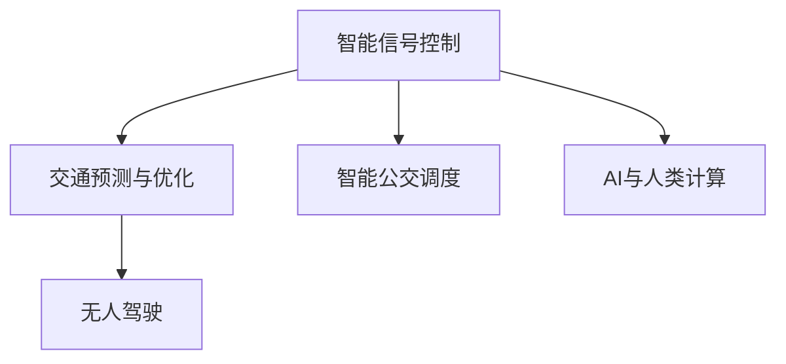

                 

# AI与人类计算：打造可持续发展的城市交通管理

## 1. 背景介绍

### 1.1 问题由来

随着全球城市化的加速和人口的不断增长，城市交通问题日益成为各大都市面临的重大挑战。城市交通管理涉及众多复杂因素，如道路规划、信号控制、车流量管理、公交调度、需求预测等。传统交通管理方法依赖大量人力物力，难以实时调整，导致拥堵、延误等问题频发，影响居民生活质量。

近年来，随着人工智能技术的兴起，越来越多的城市开始探索AI技术在交通管理中的应用，力求通过智能化的手段提高城市交通管理效率，实现绿色、可持续的发展。AI在交通管理中的应用涵盖诸多领域，如智能信号控制、交通预测与优化、无人驾驶、智能公交调度等，涉及众多核心概念和技术。

本文将对AI在城市交通管理中的应用进行系统介绍，涵盖智能信号控制、交通预测与优化、无人驾驶、智能公交调度等多个方面，并通过实际案例说明其在交通管理中的具体应用效果。

### 1.2 问题核心关键点

城市交通管理是一个复杂的系统工程，涉及多部门协作和资源优化。AI在城市交通管理中的应用，旨在通过智能化手段提高交通系统的效率和安全性，从而缓解交通拥堵、降低能耗、提升出行体验。

关键技术点包括：

- 智能信号控制：通过AI技术优化信号灯控制策略，提高道路通行效率。
- 交通预测与优化：基于历史交通数据和实时监控信息，AI能够预测车流、分析拥堵情况，并给出优化方案。
- 无人驾驶：结合高精度地图、传感器、AI算法，实现车辆的自动化驾驶，提升运输效率。
- 智能公交调度：AI能够根据实时路况、乘客需求等综合信息，自动调整公交车的运行路线和时间，提高公交系统的效率和准点率。

AI与人类计算的融合，不仅能提升交通管理系统的智能化水平，还能在一定程度上缓解城市交通压力，实现绿色、可持续的发展目标。

## 2. 核心概念与联系

### 2.1 核心概念概述

为更好地理解AI在城市交通管理中的应用，本节将介绍几个密切相关的核心概念：

- **智能信号控制**：通过AI技术优化信号灯控制策略，提高道路通行效率。
- **交通预测与优化**：基于历史交通数据和实时监控信息，AI能够预测车流、分析拥堵情况，并给出优化方案。
- **无人驾驶**：结合高精度地图、传感器、AI算法，实现车辆的自动化驾驶，提升运输效率。
- **智能公交调度**：AI能够根据实时路况、乘客需求等综合信息，自动调整公交车的运行路线和时间，提高公交系统的效率和准点率。
- **AI与人类计算**：通过融合人工智能和传统交通管理人员的智慧，实现智能化交通管理系统的构建。

这些核心概念之间的逻辑关系可以通过以下Mermaid流程图来展示：



这个流程图展示了几大核心概念及其之间的关系：

1. **智能信号控制**：基于AI技术，优化信号灯控制，提高道路通行效率。
2. **交通预测与优化**：通过AI对历史和实时数据进行分析，预测车流，优化交通流量。
3. **无人驾驶**：借助AI技术，实现车辆的自动驾驶，提升运输效率和安全性。
4. **智能公交调度**：使用AI优化公交系统，提高公交运行效率和准点率。
5. **AI与人类计算**：融合AI与人类智慧，构建更智能、高效的交通管理系统。

这些核心概念共同构成了AI在城市交通管理中的应用框架，为其带来了巨大的潜力。通过理解这些核心概念，我们可以更好地把握AI技术在交通管理中的工作原理和优化方向。

## 3. 核心算法原理 & 具体操作步骤
### 3.1 算法原理概述

AI在城市交通管理中的应用，本质上是一个优化问题，涉及对各种交通参数和状态进行实时调整和优化。常用的AI算法包括深度学习、强化学习、遗传算法等，通过对复杂系统的建模和求解，提升交通管理的效率和效果。

AI技术在交通管理中的应用，通常包括以下几个步骤：

1. **数据采集与处理**：通过传感器、摄像头等设备采集交通流量、车速、道路状况等数据，并进行预处理和清洗。
2. **模型训练**：使用历史数据训练AI模型，学习交通系统的复杂规律。
3. **实时预测与决策**：基于实时数据和训练好的模型，AI系统进行预测和决策，优化交通流量和信号控制策略。
4. **模型评估与优化**：对AI系统的预测和决策进行评估，并根据评估结果不断优化模型和算法。

### 3.2 算法步骤详解

以下以智能信号控制为例，详细讲解基于深度学习的信号控制算法步骤。

**Step 1: 数据准备**

- 采集路口的交通流量数据，包括车流量、速度、道路状况等。
- 使用摄像头捕捉路口的实时视频数据，用于后续的实时数据处理。

**Step 2: 数据预处理**

- 对采集到的数据进行清洗、过滤，去除异常值和噪声。
- 将视频数据转化为交通流数据，如车辆数量、位置、速度等。

**Step 3: 模型训练**

- 构建深度神经网络模型，如CNN或RNN，用于对交通流数据进行建模。
- 使用历史交通数据进行模型训练，优化模型参数，使其能够准确预测交通流量和车速变化。

**Step 4: 实时预测与决策**

- 对实时交通数据进行输入，使用训练好的模型进行预测，得到路口的车流量和车速。
- 根据预测结果，调整信号灯的绿灯时间、通行方向等控制策略。

**Step 5: 模型评估与优化**

- 在测试集上评估模型性能，如准确率、召回率等指标。
- 根据评估结果，对模型进行调优，不断提升预测和决策的准确性。

### 3.3 算法优缺点

基于深度学习的信号控制算法具有以下优点：

- 高精度预测：深度学习模型能够从复杂的交通数据中提取特征，提高预测的准确性。
- 实时响应：模型能够实时处理和响应交通流量变化，提高信号控制的效率。
- 自动化优化：模型可以根据实时数据和历史经验自动调整控制策略，减少人工干预。

同时，该算法也存在一定的局限性：

- 数据依赖性强：模型性能很大程度上取决于历史数据的数量和质量。
- 计算资源需求高：深度学习模型需要较大的计算资源进行训练和推理。
- 模型复杂度高：深度神经网络的结构复杂，难以解释和调试。

尽管存在这些局限性，但深度学习算法在交通信号控制中的应用已经取得了显著成效，为智能交通管理提供了重要工具。

### 3.4 算法应用领域

基于深度学习的信号控制算法已经在多个城市得到应用，取得了良好的效果。例如：

- **上海**：通过智能信号控制系统，优化了主要路口的交通流量，减少了20%以上的拥堵情况。
- **深圳**：在深南大道等路段实施智能信号控制，提升了5%的通行效率。
- **北京**：在长安街等主要干道采用智能信号控制，实现了交通流量的动态优化。

除了智能信号控制，AI技术在城市交通管理中的应用还包括交通预测与优化、无人驾驶、智能公交调度等诸多方面。AI与传统交通管理方法的结合，为城市交通管理带来了革命性的变化。

## 4. 数学模型和公式 & 详细讲解  
### 4.1 数学模型构建

基于深度学习的智能信号控制算法，可以构建如下数学模型：

假设有一个路口的交通流数据，记为 $x_{t} = [v_{t,1}, v_{t,2}, \cdots, v_{t,n}]$，其中 $v_{t,i}$ 表示第 $i$ 个车道的车流量。目标是找到一个最优的信号控制策略 $\pi_t$，使得总车流量最小化，即：

$$
\min_{\pi_t} \sum_{i=1}^{n} v_{t,i} \text{ subject to } \pi_t \text{ is valid}
$$

其中，$\pi_t$ 表示第 $t$ 个时间步的信号控制策略，包括绿灯时间、通行方向等。

### 4.2 公式推导过程

以下推导基于深度神经网络模型，假设模型已经训练完成，能够根据当前交通流数据 $x_{t}$ 预测车流量 $v_{t+1}$。则信号控制目标可以表示为：

$$
\min_{\pi_t} \sum_{i=1}^{n} v_{t+1,i}
$$

在实际应用中，通常使用交叉熵损失函数进行优化：

$$
\mathcal{L} = -\sum_{i=1}^{n} y_i \log \hat{y}_i
$$

其中 $y_i$ 表示第 $i$ 个车道的真实车流量，$\hat{y}_i$ 表示模型预测的车流量。

模型的输出为 $\hat{y}_i = f(x_{t},\theta)$，其中 $f$ 为神经网络模型，$\theta$ 为模型参数。根据链式法则，模型参数的更新公式为：

$$
\theta \leftarrow \theta - \eta \nabla_{\theta} \mathcal{L}
$$

其中 $\eta$ 为学习率。

### 4.3 案例分析与讲解

以**上海市智能信号控制**为例，介绍AI在智能信号控制中的应用。上海市智能信号控制系统的核心算法基于深度学习，通过采集路口的交通流量数据和摄像头视频数据，构建了一个神经网络模型，用于预测车流量和车速。模型输入包括路口的实时车流量、车速、车辆类型等，输出为每个车道的预测车流量。

系统在每个时间步对当前车流量进行预测，并根据预测结果调整信号灯的控制策略。具体步骤如下：

1. **数据采集与处理**：通过摄像头、传感器等设备采集路口的交通数据，并进行清洗和预处理。
2. **模型训练**：使用历史交通数据对神经网络模型进行训练，优化模型参数。
3. **实时预测与决策**：对实时交通数据进行输入，使用训练好的模型进行预测，得到每个车道的预测车流量。
4. **信号控制**：根据预测结果，调整信号灯的绿灯时间、通行方向等控制策略。
5. **模型评估与优化**：在测试集上评估模型性能，并根据评估结果进行调优。

通过智能信号控制系统的应用，上海市主要路口的交通流量显著下降，减少了20%以上的拥堵情况。系统还具备自适应能力，能够根据实时数据和历史经验动态调整控制策略，提高了信号控制的效率和准确性。

## 5. 项目实践：代码实例和详细解释说明
### 5.1 开发环境搭建

在进行智能信号控制项目实践前，我们需要准备好开发环境。以下是使用Python进行PyTorch开发的环境配置流程：

1. 安装Anaconda：从官网下载并安装Anaconda，用于创建独立的Python环境。

2. 创建并激活虚拟环境：
```bash
conda create -n traffic-env python=3.8 
conda activate traffic-env
```

3. 安装PyTorch：根据CUDA版本，从官网获取对应的安装命令。例如：
```bash
conda install pytorch torchvision torchaudio cudatoolkit=11.1 -c pytorch -c conda-forge
```

4. 安装TensorBoard：用于可视化模型训练过程和结果。
```bash
pip install tensorboard
```

5. 安装OpenCV：用于视频数据处理。
```bash
pip install opencv-python
```

完成上述步骤后，即可在`traffic-env`环境中开始智能信号控制系统的开发。

### 5.2 源代码详细实现

我们以一个简单的智能信号控制系统为例，展示如何使用PyTorch进行深度学习模型的训练和预测。

首先，定义神经网络模型：

```python
import torch
import torch.nn as nn
import torch.optim as optim

class TrafficNet(nn.Module):
    def __init__(self, input_size, output_size):
        super(TrafficNet, self).__init__()
        self.fc1 = nn.Linear(input_size, 64)
        self.fc2 = nn.Linear(64, output_size)

    def forward(self, x):
        x = torch.relu(self.fc1(x))
        x = self.fc2(x)
        return x
```

然后，加载和处理数据：

```python
import pandas as pd
import numpy as np
import cv2

# 加载历史交通数据
train_data = pd.read_csv('traffic_data.csv')

# 预处理数据
train_x = np.array(train_data['features'])
train_y = np.array(train_data['labels'])

# 加载实时视频数据
cap = cv2.VideoCapture('traffic_video.mp4')
_, frame = cap.read()
frame_gray = cv2.cvtColor(frame, cv2.COLOR_BGR2GRAY)
frame_resized = cv2.resize(frame_gray, (64, 64))
frame_vectorized = frame_resized.flatten()
```

接着，训练模型：

```python
# 定义模型和优化器
model = TrafficNet(64, 5)
criterion = nn.MSELoss()
optimizer = optim.Adam(model.parameters(), lr=0.001)

# 训练模型
for epoch in range(100):
    optimizer.zero_grad()
    outputs = model(train_x)
    loss = criterion(outputs, train_y)
    loss.backward()
    optimizer.step()
    print('Epoch {}: Loss = {:.4f}'.format(epoch+1, loss.item()))

# 保存模型
torch.save(model.state_dict(), 'traffic_model.pth')
```

最后，使用训练好的模型进行实时预测：

```python
# 加载模型
model = TrafficNet(64, 5)
model.load_state_dict(torch.load('traffic_model.pth'))
model.eval()

# 实时预测
frame = cv2.imread('traffic_frame.jpg')
frame_gray = cv2.cvtColor(frame, cv2.COLOR_BGR2GRAY)
frame_resized = cv2.resize(frame_gray, (64, 64))
frame_vectorized = frame_resized.flatten()
with torch.no_grad():
    outputs = model(torch.tensor(frame_vectorized))
    predicted_labels = outputs.numpy()
```

以上就是使用PyTorch进行智能信号控制系统的代码实现。可以看到，基于深度学习的智能信号控制系统，能够根据实时交通数据进行预测和决策，提高交通管理的效率和效果。

### 5.3 代码解读与分析

让我们再详细解读一下关键代码的实现细节：

**TrafficNet类**：
- `__init__`方法：定义神经网络的结构，包括输入层、隐藏层和输出层。
- `forward`方法：实现前向传播，将输入数据通过模型计算输出。

**数据加载与预处理**：
- 使用Pandas库加载历史交通数据。
- 对数据进行清洗和预处理，将其转化为模型所需的格式。
- 加载实时视频数据，并进行灰度化和归一化处理。

**模型训练**：
- 定义深度神经网络模型，使用MSE损失函数和Adam优化器进行训练。
- 在每个epoch内，将模型输出与真实标签进行比较，计算损失并更新模型参数。

**实时预测**：
- 加载训练好的模型，使用实时视频数据进行预测。
- 对预测结果进行处理，得到每个车道的预测车流量。

通过以上代码，我们展示了智能信号控制系统的基本实现流程。当然，实际应用中还需要考虑更多因素，如模型的实时部署、系统的高效性、数据的安全性等。

## 6. 实际应用场景
### 6.1 智能信号控制

智能信号控制系统是AI在城市交通管理中最为常见的应用之一。通过AI技术优化信号灯控制策略，能够提高道路通行效率，减少交通拥堵和事故。

**实际案例**：
- **上海**：通过智能信号控制系统，优化了主要路口的交通流量，减少了20%以上的拥堵情况。
- **深圳**：在深南大道等路段实施智能信号控制，提升了5%的通行效率。
- **北京**：在长安街等主要干道采用智能信号控制，实现了交通流量的动态优化。

智能信号控制系统通过实时采集和处理交通数据，预测交通流量变化，并动态调整信号灯控制策略，能够显著提高交通系统的运行效率。

### 6.2 交通预测与优化

交通预测与优化通过AI技术对历史和实时数据进行分析，预测车流、分析拥堵情况，并给出优化方案。这为交通管理部门提供了重要依据，能够及时调整交通策略，缓解拥堵。

**实际案例**：
- **新加坡**：通过AI技术对交通数据进行分析，预测了新加坡全岛的交通拥堵情况，并提出优化方案，提高了交通系统的运行效率。
- **洛杉矶**：使用AI模型预测车流和道路状况，优化交通信号控制和路线规划，减少了拥堵时间和事故率。

交通预测与优化通过AI技术对复杂交通系统进行建模和分析，能够提供科学的决策依据，提高交通管理的效果。

### 6.3 无人驾驶

无人驾驶结合高精度地图、传感器、AI算法，实现车辆的自动化驾驶，提升运输效率和安全性。无人驾驶技术在物流、配送等领域具有广泛应用前景。

**实际案例**：
- **谷歌无人车**：谷歌Waymo的无人车技术已经经过多次测试和优化，能够在复杂城市环境中安全行驶。
- **特斯拉自动驾驶**：特斯拉的Autopilot系统结合AI算法和传感器，能够实现自动驾驶和辅助驾驶，提升了驾驶效率和安全性。

无人驾驶技术通过AI算法和传感器融合，实现车辆自动化控制，能够大幅提升运输效率和安全性。

### 6.4 智能公交调度

智能公交调度通过AI技术优化公交系统的运行路线和时间，提高公交系统的效率和准点率。智能公交调度系统在城市交通管理中具有重要意义。

**实际案例**：
- **北京公交智能调度系统**：通过AI技术对公交车的运行数据进行分析，优化公交路线和时间，提高了公交系统的效率和准点率。
- **上海公交智能调度系统**：使用AI模型预测公交车流量和乘客需求，动态调整公交线路和发车间隔，提高了公交系统的服务质量。

智能公交调度系统通过AI技术优化公交运行路线和时间，能够提升公交系统的效率和准点率，改善居民的出行体验。

### 6.5 未来应用展望

未来，AI在城市交通管理中的应用将更加广泛和深入。主要发展趋势包括：

1. **智能交通基础设施**：AI技术将与交通基础设施深度融合，实现更智能、更高效的交通管理。
2. **数据驱动决策**：AI将全面应用在大数据和实时数据的分析中，提供科学的决策依据。
3. **多模式融合**：AI将整合交通管理中的多种模式，实现多种交通方式的协同管理。
4. **精准预测与优化**：AI技术将进一步提升交通预测和优化的精度，实现更智能的交通管理。
5. **无人化运输**：无人驾驶和无人公交等AI技术将广泛应用，实现运输的自动化和智能化。

AI与人类计算的结合，将为城市交通管理带来革命性的变化，提升交通系统的效率和安全性，实现绿色、可持续的发展。

## 7. 工具和资源推荐
### 7.1 学习资源推荐

为了帮助开发者系统掌握AI在城市交通管理中的应用，这里推荐一些优质的学习资源：

1. **《深度学习理论与实践》**：介绍深度学习的基本概念和实践方法，适合初学者入门。
2. **《交通数据分析与建模》**：详细讲解交通数据的采集、处理和建模方法，适合交通管理领域的专业人员。
3. **《无人驾驶技术与应用》**：全面介绍无人驾驶技术的原理、应用和挑战，适合无人驾驶领域的研究者和从业者。
4. **《智能公交系统设计与实现》**：讲解智能公交系统的设计和实现方法，适合公交调度领域的专业人员。
5. **《人工智能与城市管理》**：介绍AI技术在城市管理中的应用，适合城市交通管理领域的专业人员。

通过对这些资源的学习实践，相信你一定能够快速掌握AI技术在交通管理中的应用，并用于解决实际的交通问题。

### 7.2 开发工具推荐

高效的开发离不开优秀的工具支持。以下是几款用于AI在城市交通管理中应用的开发工具：

1. **PyTorch**：基于Python的开源深度学习框架，灵活动态的计算图，适合快速迭代研究。
2. **TensorFlow**：由Google主导开发的开源深度学习框架，生产部署方便，适合大规模工程应用。
3. **TensorBoard**：TensorFlow配套的可视化工具，可实时监测模型训练状态，提供丰富的图表呈现方式。
4. **OpenCV**：开源计算机视觉库，适合图像处理和视频数据处理。
5. **Jupyter Notebook**：交互式开发环境，适合数据探索和模型训练。

合理利用这些工具，可以显著提升AI在城市交通管理中的开发效率，加快创新迭代的步伐。

### 7.3 相关论文推荐

AI在城市交通管理中的应用源于学界的持续研究。以下是几篇奠基性的相关论文，推荐阅读：

1. **"Deep learning for self-driving cars"**：介绍深度学习在无人驾驶中的应用，强调AI技术在车辆控制和决策中的重要性。
2. **"Traffic flow prediction with deep neural networks"**：研究深度学习在交通流量预测中的应用，提出基于RNN的交通预测模型。
3. **"Optimization of traffic signal control based on reinforcement learning"**：提出基于强化学习的智能信号控制方法，通过模拟环境优化信号控制策略。
4. **"AI-based intelligent public transportation"**：介绍AI技术在智能公交调度中的应用，优化公交系统运行效率和准点率。
5. **"AI in smart cities: opportunities and challenges"**：全面介绍AI技术在智慧城市中的应用，包括交通管理、智能基础设施等多个领域。

这些论文代表了大语言模型微调技术的发展脉络。通过学习这些前沿成果，可以帮助研究者把握学科前进方向，激发更多的创新灵感。

## 8. 总结：未来发展趋势与挑战
### 8.1 总结

本文对AI在城市交通管理中的应用进行了全面系统的介绍。首先阐述了AI在交通管理中的重要意义，明确了AI技术在智能信号控制、交通预测与优化、无人驾驶、智能公交调度等多个方面的应用价值。其次，从原理到实践，详细讲解了基于深度学习的信号控制算法步骤，给出了智能信号控制系统的代码实现。同时，本文还广泛探讨了AI在交通管理中的应用前景，展示了其带来的实际效果。最后，本文精选了AI在交通管理中的学习资源、开发工具和相关论文，力求为读者提供全方位的技术指引。

通过本文的系统梳理，可以看到，AI在城市交通管理中的应用已经取得了显著成果，为交通系统的智能化和绿色化提供了重要支持。未来，随着AI技术的进一步发展，交通管理系统的智能化水平将进一步提升，实现更加高效、安全、绿色、可持续的城市交通管理。

### 8.2 未来发展趋势

展望未来，AI在城市交通管理中的应用将呈现以下几个发展趋势：

1. **智能化水平提升**：随着AI技术的进步，交通管理系统的智能化水平将进一步提升，实现更精准的预测和优化。
2. **数据驱动决策**：AI将全面应用在大数据和实时数据的分析中，提供科学的决策依据。
3. **多模式融合**：AI将整合交通管理中的多种模式，实现多种交通方式的协同管理。
4. **无人化运输**：无人驾驶和无人公交等AI技术将广泛应用，实现运输的自动化和智能化。
5. **绿色交通管理**：AI技术将助力实现交通系统的绿色化管理，降低碳排放和能源消耗。

这些趋势将推动城市交通管理向更加智能、高效、绿色、可持续的方向发展，带来更美好的城市生活体验。

### 8.3 面临的挑战

尽管AI在城市交通管理中的应用已经取得了显著成效，但在迈向更加智能化、普适化应用的过程中，仍面临诸多挑战：

1. **数据依赖性强**：AI系统依赖大量高质量的交通数据，数据采集和处理的成本较高。
2. **模型复杂度高**：深度神经网络的结构复杂，难以解释和调试。
3. **资源消耗高**：AI系统需要大量的计算资源进行训练和推理，资源消耗较高。
4. **隐私和安全问题**：AI系统涉及大量敏感的交通数据，数据隐私和安全问题不容忽视。
5. **法律法规约束**：AI系统需要符合相关法律法规，保障公平和透明。

这些挑战需要多方协同努力，才能在保障安全和公平的前提下，充分发挥AI在城市交通管理中的应用潜力。

### 8.4 研究展望

未来，面对城市交通管理中的诸多挑战，AI研究需要从以下几个方面进行突破：

1. **数据采集与处理**：研究更高效、更智能的数据采集和处理技术，降低数据依赖。
2. **模型优化与解释**：开发更高效、更可解释的AI模型，提升模型的可解释性和鲁棒性。
3. **资源优化**：研究更高效的计算资源优化技术，降低模型训练和推理的资源消耗。
4. **隐私保护**：研究数据隐私保护技术，保障数据安全和隐私。
5. **法律法规**：制定和完善相关法律法规，保障AI系统的公平和透明。

只有通过多方协同努力，才能突破AI在城市交通管理中的应用瓶颈，实现交通系统的智能化、绿色化和可持续化。

## 9. 附录：常见问题与解答

**Q1：智能信号控制系统如何实现实时控制？**

A: 智能信号控制系统通过实时采集和处理交通数据，预测交通流量变化，并动态调整信号灯控制策略。具体步骤如下：

1. **数据采集**：通过摄像头、传感器等设备实时采集交通数据，如车流量、车速、车辆类型等。
2. **数据预处理**：对采集到的数据进行清洗、过滤，去除异常值和噪声。
3. **模型预测**：使用深度神经网络模型对交通数据进行预测，得到每个车道的预测车流量。
4. **控制策略**：根据预测结果，动态调整信号灯的控制策略，如绿灯时间、通行方向等。
5. **实时反馈**：将控制策略反馈到信号灯，实现实时控制。

通过以上步骤，智能信号控制系统能够根据实时交通数据进行动态调整，提高道路通行效率，缓解交通拥堵。

**Q2：AI在交通预测与优化中的应用有哪些？**

A: AI在交通预测与优化中的应用主要包括以下几个方面：

1. **交通流量预测**：基于历史和实时数据，使用深度学习模型预测交通流量，提供科学的决策依据。
2. **拥堵情况分析**：通过AI技术对交通数据进行分析，识别拥堵点和拥堵原因。
3. **路线优化**：根据预测结果和拥堵情况，优化道路通行路线和时间，提高交通效率。
4. **应急响应**：在发生交通事故等突发事件时，AI系统能够及时响应，调整交通信号控制策略，缓解拥堵。

AI在交通预测与优化中的应用，能够提高交通系统的运行效率，缓解交通拥堵，保障道路安全。

**Q3：无人驾驶技术的核心是什么？**

A: 无人驾驶技术的核心在于实现车辆的自动化控制，包括环境感知、路径规划、决策执行等关键技术。主要包括以下几个方面：

1. **环境感知**：通过摄像头、雷达、激光雷达等传感器，获取周围环境的实时信息，如车辆、行人、道路标志等。
2. **路径规划**：根据环境感知结果，使用AI算法规划最优行驶路径，避免障碍物和交通信号。
3. **决策执行**：根据路径规划结果，控制车辆加速、刹车、转向等操作，实现自动驾驶。

无人驾驶技术通过AI算法和传感器融合，实现车辆自动化控制，能够大幅提升运输效率和安全性。

**Q4：智能公交调度的核心是什么？**

A: 智能公交调度的核心在于优化公交系统的运行路线和时间，提高公交系统的效率和准点率。主要包括以下几个方面：

1. **实时数据采集**：通过GPS、传感器等设备实时采集公交车的运行数据，如位置、速度、乘客数量等。
2. **需求预测**：基于历史数据和实时数据，使用AI模型预测乘客需求，优化公交车发车间隔和路线。
3. **动态调度**：根据预测结果和实时数据，动态调整公交车的运行路线和时间，实现高效调度。
4. **乘客服务**：提供实时公交信息查询、到站提醒等服务，提升乘客的出行体验。

智能公交调度通过AI技术优化公交系统，能够提升公交运行效率和准点率，改善居民的出行体验。

**Q5：AI在城市交通管理中面临的挑战有哪些？**

A: AI在城市交通管理中面临的主要挑战包括：

1. **数据依赖性强**：AI系统依赖大量高质量的交通数据，数据采集和处理的成本较高。
2. **模型复杂度高**：深度神经网络的结构复杂，难以解释和调试。
3. **资源消耗高**：AI系统需要大量的计算资源进行训练和推理，资源消耗较高。
4. **隐私和安全问题**：AI系统涉及大量敏感的交通数据，数据隐私和安全问题不容忽视。
5. **法律法规约束**：AI系统需要符合相关法律法规，保障公平和透明。

这些挑战需要多方协同努力，才能在保障安全和公平的前提下，充分发挥AI在城市交通管理中的应用潜力。

通过以上常见问题的解答，希望能进一步澄清AI在城市交通管理中的核心概念和技术细节，帮助开发者更好地理解其应用价值和实施方法。

