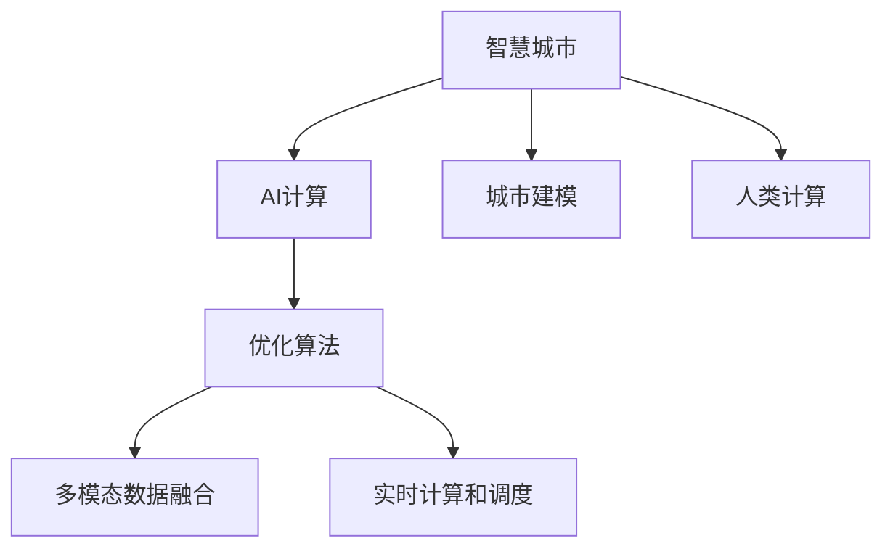

                 

# AI与人类计算：打造可持续发展的城市模型

> 关键词：智慧城市,可持续城市,AI计算,城市建模,人类计算,优化算法,交通规划,环境预测,公共安全

## 1. 背景介绍

### 1.1 问题由来

随着科技的飞速发展，人类社会逐渐步入数字时代。城市作为人类活动的集聚地，面临着交通拥堵、环境污染、资源紧张等诸多挑战。如何利用AI技术打造可持续发展的智慧城市，成为全球各地的政府和科研机构共同关注的话题。

为了提高城市管理的智能化水平，许多城市开始引入AI计算技术，构建城市模型，实现对城市运行状态的实时监控和优化。然而，在实际应用中，AI城市模型的构建和运行也面临着诸多挑战：

1. **数据规模庞大**：城市数据涉及交通、环境、人口等多个领域，且数据规模庞大，处理和存储难度大。
2. **模型复杂度高**：AI城市模型的构建需要融合多种算法和模型，模型复杂度高，优化困难。
3. **实时性要求高**：城市模型需要实时响应，才能实现对突发事件的快速应对。
4. **多模态数据融合**：城市数据通常以不同模态的形式存在，如何有效融合多模态数据，提高模型鲁棒性，是一个重要问题。

这些问题使得AI城市模型的构建和优化成为一项复杂且极具挑战性的任务。本文将系统介绍基于AI与人类计算的智慧城市建模方法，探讨其实现原理和操作步骤，以及其应用前景。

## 2. 核心概念与联系

### 2.1 核心概念概述

为了更好地理解基于AI与人类计算的智慧城市建模方法，本节将介绍几个关键概念及其相互关系：

- **智慧城市**：以AI技术为支撑，通过信息化手段优化城市管理，实现资源高效利用、公共安全保障、环境友好等目标。
- **AI计算**：利用计算机算法和计算资源，处理海量城市数据，提取有价值的信息，实现城市运行的智能化和高效化。
- **城市建模**：构建数学模型和仿真模型，描述城市运行状态和演化过程，用于城市规划、交通管理、环境预测等领域。
- **人类计算**：利用人类智慧和经验，对AI模型进行优化和验证，弥补其不足，提升模型性能。
- **优化算法**：用于求解城市模型中各类问题的算法，如线性规划、非线性优化、启发式算法等。
- **多模态数据融合**：将来自不同源、不同模态的城市数据进行有效融合，提高模型的精度和鲁棒性。
- **实时计算和调度**：确保城市模型在实时数据输入时能够快速响应，并灵活调度计算资源，满足实际需求。

这些核心概念之间的逻辑关系可以通过以下Mermaid流程图来展示：



这个流程图展示了智慧城市模型的主要组成及其相互关系：

1. **智慧城市**作为整体目标，利用AI计算和人类计算相结合的手段，实现对城市数据的高效分析和处理。
2. **AI计算**和**城市建模**共同构成城市数据处理的算法和模型基础。
3. **人类计算**则利用人类智慧，对AI模型进行优化和验证。
4. **优化算法**和**多模态数据融合**是构建和优化城市模型的关键技术。
5. **实时计算和调度**确保城市模型能够在实时数据输入时快速响应，满足实际需求。

## 3. 核心算法原理 & 具体操作步骤

### 3.1 算法原理概述

基于AI与人类计算的智慧城市建模方法，本质上是一个复杂系统建模和优化的过程。其核心思想是：

1. **数据收集与预处理**：收集城市各领域的数据，并进行预处理，消除噪声，标准化数据格式。
2. **模型构建**：根据城市运行特点，选择合适的模型框架，并利用AI计算技术对模型进行构建。
3. **优化求解**：利用优化算法，对构建好的城市模型进行求解，寻找最优解。
4. **人类验证**：将AI模型的求解结果提交给人类专家进行验证和修正，确保模型的准确性和实用性。
5. **实时更新**：根据实时数据，动态更新城市模型，实现对城市运行状态的持续监控和优化。

### 3.2 算法步骤详解

基于AI与人类计算的智慧城市建模，一般包括以下几个关键步骤：

**Step 1: 数据收集与预处理**
- **数据收集**：通过传感器、智能设备、公开数据等渠道，收集城市各领域的数据，如交通流量、空气质量、人口分布等。
- **数据预处理**：对原始数据进行清洗、归一化、去噪等预处理，确保数据质量。
- **数据标准化**：将不同来源的数据进行格式标准化，便于后续处理和融合。

**Step 2: 模型构建与选择**
- **模型框架选择**：根据任务需求，选择合适的城市模型框架，如系统动力学模型、优化模型等。
- **AI计算应用**：利用AI计算技术，如机器学习、深度学习等，对模型进行构建和优化。
- **模型验证**：利用历史数据验证模型的准确性和泛化能力。

**Step 3: 优化求解**
- **优化算法选择**：根据模型特点，选择合适的优化算法，如线性规划、遗传算法、神经网络等。
- **求解与验证**：利用优化算法求解模型，验证模型的求解结果，确保求解的准确性和效率。
- **结果修正**：根据求解结果，进行必要的修正和优化，提高模型性能。

**Step 4: 人类验证**
- **专家参与**：将AI模型的求解结果提交给城市管理专家进行验证和修正。
- **知识融合**：利用人类智慧和经验，对AI模型进行优化和改进，弥补其不足。
- **模型改进**：根据专家的反馈，对模型进行改进和优化。

**Step 5: 实时更新**
- **数据融合**：实时收集城市数据，对城市模型进行动态更新。
- **模型优化**：根据实时数据，对城市模型进行持续优化，提高模型的实时性和准确性。
- **反馈机制**：建立模型反馈机制，及时响应模型输出结果，实现对城市运行的实时监控和优化。

### 3.3 算法优缺点

基于AI与人类计算的智慧城市建模方法，具有以下优点：

1. **融合多种算法**：结合AI计算和人类计算的优势，充分利用算法多样性，提高模型性能。
2. **高精度与鲁棒性**：通过多模态数据融合和人类验证，提升模型的精度和鲁棒性，适应复杂的现实环境。
3. **实时响应**：利用实时计算和调度技术，确保模型在实时数据输入时能够快速响应，满足实际需求。

同时，该方法也存在一定的局限性：

1. **数据依赖性强**：模型的构建和优化高度依赖于数据的质量和完整性，数据获取难度大。
2. **算法复杂度高**：智慧城市模型的构建涉及多种算法和模型，算法复杂度高，优化困难。
3. **专家知识需求高**：模型的优化和验证需要人类专家的参与，专家知识和经验在模型构建中占有重要地位。
4. **计算资源消耗大**：城市模型通常涉及海量数据和复杂计算，计算资源消耗大。

尽管存在这些局限性，但基于AI与人类计算的智慧城市建模方法，已经在城市规划、交通管理、环境预测等领域取得了显著成效，成为智慧城市建设的重要手段。

### 3.4 算法应用领域

基于AI与人类计算的智慧城市建模方法，主要应用于以下几个领域：

- **城市规划**：通过构建城市模型，对城市发展进行预测和规划，优化土地利用和交通布局。
- **交通管理**：利用交通模型和实时数据，实现交通流量预测和优化，缓解交通拥堵。
- **环境预测**：建立环境模型，预测空气质量、水质等环境指标，实现环境友好型城市建设。
- **公共安全**：利用智能监控和数据融合，提升城市公共安全水平，防范突发事件。

除了上述这些应用领域外，智慧城市建模技术还被创新性地应用于更多场景中，如智能电网、智慧农业、智慧医疗等，为智慧城市建设提供了新的技术路径。

## 4. 数学模型和公式 & 详细讲解

### 4.1 数学模型构建

本节将使用数学语言对基于AI与人类计算的智慧城市建模过程进行更加严格的刻画。

假设城市运行状态由状态向量 $x \in \mathbb{R}^n$ 描述，其中 $n$ 为状态维度。设城市运行受 $m$ 个因素 $u_1, u_2, ..., u_m$ 的影响，城市模型可以表示为：

$$
\dot{x} = f(x, u_1, u_2, ..., u_m) + \epsilon
$$

其中 $f$ 为系统动力学方程，$u_i$ 为第 $i$ 个因素对城市状态的影响，$\epsilon$ 为随机干扰项。

在模型构建过程中，通常需要选择合适的数学模型框架，如微分方程、差分方程、优化模型等。这里以线性微分方程为例，说明智慧城市建模的基本过程：

$$
\dot{x} = Ax + Bu + Cw
$$

其中 $A$ 为状态转移矩阵，$B$ 为控制矩阵，$C$ 为扰动矩阵，$u$ 为控制输入，$w$ 为扰动输入。

### 4.2 公式推导过程

以下我们以交通流量预测为例，推导线性微分方程模型的求解公式。

假设交通流量由状态向量 $x$ 描述，受红绿灯控制、车辆速度、道路拥堵等因素 $u$ 的影响，可建立如下线性微分方程模型：

$$
\dot{x} = Ax + Bu
$$

其中 $A$ 为交通流量状态转移矩阵，$B$ 为控制矩阵，$x$ 为交通流量状态，$u$ 为红绿灯控制信号。

通过对方程进行求解，可以得到交通流量的预测结果：

$$
x(t) = e^{At} x_0 + \int_0^t e^{A(t-\tau)} Bu(\tau) d\tau
$$

其中 $x_0$ 为初始状态，$u(t)$ 为实时控制信号。

在实际应用中，为了提高模型的精度和鲁棒性，通常会对方程进行扩展和优化，如引入随机扰动项、考虑状态间的耦合关系等。

### 4.3 案例分析与讲解

考虑一个简单的城市交通流量模型，假设交通流量由状态向量 $x$ 描述，受红绿灯控制信号 $u$ 和车辆速度 $v$ 的影响，建立如下线性微分方程模型：

$$
\dot{x} = Ax + Bu + Cw
$$

其中：
- $A = \begin{bmatrix} 0 & 1 & 0 \\ -1 & -1 & 1 \\ 0 & 0 & -1 \end{bmatrix}$，表示交通流量的状态转移关系。
- $B = \begin{bmatrix} 0 \\ 0.5 \\ -0.5 \end{bmatrix}$，表示红绿灯控制信号对交通流量的影响。
- $C = \begin{bmatrix} 0 & 0 & 0 \\ 0.2 & 0 & 0 \\ 0 & 0 & 0 \end{bmatrix}$，表示车辆速度对交通流量的影响。
- $u(t) = \begin{bmatrix} 0 \\ 1 \\ 0 \end{bmatrix}$，表示红绿灯控制信号。
- $w(t) = \begin{bmatrix} 0.1 \\ 0.2 \\ 0.3 \end{bmatrix}$，表示车辆速度的扰动。

假设初始状态 $x_0 = \begin{bmatrix} 100 \\ 0 \\ 0 \end{bmatrix}$，求解该方程，可以得到交通流量的预测结果：

$$
x(t) = e^{At} \begin{bmatrix} 100 \\ 0 \\ 0 \end{bmatrix} + \int_0^t e^{A(t-\tau)} Bu(\tau) d\tau + \int_0^t e^{A(t-\tau)} Cw(\tau) d\tau
$$

在实际应用中，还需要对模型进行优化和验证，确保模型的准确性和实用性。

## 5. 项目实践：代码实例和详细解释说明

### 5.1 开发环境搭建

在进行智慧城市建模实践前，我们需要准备好开发环境。以下是使用Python进行Sympy和Matplotlib开发的环境配置流程：

1. 安装Anaconda：从官网下载并安装Anaconda，用于创建独立的Python环境。

2. 创建并激活虚拟环境：
```bash
conda create -n ai-env python=3.8 
conda activate ai-env
```

3. 安装Sympy和Matplotlib：
```bash
conda install sympy matplotlib
```

4. 安装其他工具包：
```bash
pip install numpy pandas scikit-learn scipy jupyter notebook ipython
```

完成上述步骤后，即可在`ai-env`环境中开始智慧城市建模实践。

### 5.2 源代码详细实现

下面我们以交通流量预测为例，给出使用Sympy和Matplotlib进行智慧城市建模的Python代码实现。

首先，定义线性微分方程的符号变量和参数：

```python
from sympy import symbols, Matrix, exp, integrate, Rational

# 定义符号变量
t, x1, x2, x3 = symbols('t x1 x2 x3')

# 定义状态转移矩阵和控制矩阵
A = Matrix([[0, 1, 0], [-1, -1, 1], [0, 0, -1]])
B = Matrix([0, Rational(1, 2), -Rational(1, 2)])

# 定义初始状态
x0 = Matrix([100, 0, 0])

# 定义控制信号
u = Matrix([0, 1, 0])
```

然后，求解线性微分方程：

```python
# 定义扰动项
w = Matrix([0.1, 0.2, 0.3])

# 求解微分方程
x = x0 * exp(A * t) + integrate(exp(A * (t - tau)) * B * u, (tau, 0, t)) + integrate(exp(A * (t - tau)) * C * w, (tau, 0, t))

# 输出结果
x
```

最后，使用Matplotlib绘制预测结果：

```python
import matplotlib.pyplot as plt

# 定义时间范围
t_range = np.linspace(0, 10, 100)

# 计算交通流量预测结果
x_values = [x.subs(t, ti) for ti in t_range]

# 绘制预测曲线
plt.plot(t_range, x_values)
plt.xlabel('Time (h)')
plt.ylabel('Traffic Flow (veh/h)')
plt.title('Traffic Flow Prediction')
plt.show()
```

以上就是使用Sympy和Matplotlib进行智慧城市建模的完整代码实现。可以看到，Sympy和Matplotlib提供了强大的符号计算和数据可视化功能，使得建模过程更加高效和直观。

### 5.3 代码解读与分析

让我们再详细解读一下关键代码的实现细节：

**符号变量定义**：
- `symbols('t x1 x2 x3')`：定义时间变量和状态变量的符号。

**状态转移矩阵和控制矩阵**：
- `Matrix([[0, 1, 0], [-1, -1, 1], [0, 0, -1]])`：定义状态转移矩阵，表示交通流量的状态转移关系。
- `Matrix([0, Rational(1, 2), -Rational(1, 2)])`：定义控制矩阵，表示红绿灯控制信号对交通流量的影响。

**初始状态和控制信号**：
- `Matrix([100, 0, 0])`：定义初始状态，表示交通流量状态。
- `Matrix([0, 1, 0])`：定义控制信号，表示红绿灯控制信号。

**扰动项**：
- `Matrix([0.1, 0.2, 0.3])`：定义扰动项，表示车辆速度的扰动。

**求解微分方程**：
- `x0 * exp(A * t)`：计算初始状态在时间 $t$ 的预测值。
- `integrate(exp(A * (t - tau)) * B * u, (tau, 0, t))`：计算控制信号在时间 $t$ 的预测值。
- `integrate(exp(A * (t - tau)) * C * w, (tau, 0, t))`：计算扰动项在时间 $t$ 的预测值。

**绘制预测曲线**：
- `plt.plot(t_range, x_values)`：绘制交通流量预测结果的曲线。
- `plt.xlabel('Time (h)')`：设置X轴标签。
- `plt.ylabel('Traffic Flow (veh/h)')`：设置Y轴标签。
- `plt.title('Traffic Flow Prediction')`：设置图表标题。

可以看到，通过Sympy和Matplotlib，智慧城市建模的数学建模和可视化过程变得更加简单和高效。开发者可以通过这些工具快速构建和验证模型，提升建模效率。

## 6. 实际应用场景

### 6.1 智能交通管理

智慧城市建模技术在智能交通管理中具有重要应用价值。通过构建交通流量预测模型，可以实时监测道路状况，优化交通信号灯控制，缓解交通拥堵，提升行车安全和舒适度。

具体而言，智能交通系统可以采集道路传感器数据、车辆速度、红绿灯状态等信息，建立交通流量预测模型。模型可以根据实时数据预测未来交通流量，并动态调整红绿灯控制信号，实现交通流量的优化。

### 6.2 环境污染监测

智慧城市建模技术还可以应用于环境污染监测领域。通过建立空气质量预测模型，可以实时监测空气污染物的浓度变化，预测未来的空气质量，实现环境友好型城市建设。

具体而言，环境监测系统可以采集空气质量传感器数据、气象数据、车辆尾气排放等信息，建立空气质量预测模型。模型可以根据实时数据预测未来的空气质量指数，并提出相应的污染治理措施，减少环境污染。

### 6.3 公共安全保障

智慧城市建模技术在公共安全保障中也具有重要应用价值。通过构建公共安全事件预测模型，可以实现对突发事件的快速响应和预防，保障城市公共安全。

具体而言，公共安全系统可以采集视频监控数据、人流密度、警情报告等信息，建立公共安全事件预测模型。模型可以根据实时数据预测可能的公共安全事件，并及时发出警报，采取应对措施，减少安全事故的发生。

### 6.4 未来应用展望

随着智慧城市建模技术的不断发展，未来将会在更多领域得到应用，为城市运行和治理带来新的变革。

在智慧农业领域，通过构建农业生产预测模型，可以实现对农作物生长的精确控制，提高农业生产效率和产量。

在智慧医疗领域，通过构建医疗服务预测模型，可以实现对医疗资源的高效调配，提高医疗服务质量和可及性。

在智慧教育领域，通过构建学生行为预测模型，可以实现对学生学习的个性化指导，提升教育质量。

总之，智慧城市建模技术将成为未来城市管理的重要手段，为构建智能、绿色、安全的城市提供有力支撑。

## 7. 工具和资源推荐

### 7.1 学习资源推荐

为了帮助开发者系统掌握智慧城市建模的理论基础和实践技巧，这里推荐一些优质的学习资源：

1. **《智慧城市模型与优化》系列博文**：由智慧城市建模领域的专家撰写，深入浅出地介绍了智慧城市建模的原理、方法、案例等。

2. **《城市系统动力学》课程**：清华大学开设的智慧城市建模课程，涵盖智慧城市建模的数学基础和实际应用，适合初学者和进阶学习者。

3. **《城市仿真与优化》书籍**：系统介绍了智慧城市建模的数学模型和优化方法，适合从事智慧城市建模研究和应用的开发者。

4. **智慧城市建模社区**：汇集了众多智慧城市建模的专家和实践者，提供丰富的学习资源和技术交流平台。

5. **智慧城市建模工具集**：提供了多种智慧城市建模工具和库，如SimPy、AnyLogic等，支持模型构建和仿真。

通过对这些资源的学习实践，相信你一定能够快速掌握智慧城市建模的精髓，并用于解决实际的智慧城市问题。

### 7.2 开发工具推荐

高效的开发离不开优秀的工具支持。以下是几款用于智慧城市建模开发的常用工具：

1. **Sympy**：Python的符号计算库，支持数学模型的建立和求解，提供强大的符号计算能力。

2. **Matplotlib**：Python的绘图库，支持数据的可视化，提供丰富的绘图功能。

3. **SimPy**：基于Python的离散事件仿真库，支持复杂系统的建模和仿真，适合智慧城市建模。

4. **AnyLogic**：一款综合的仿真软件，支持多种模型和数据类型的输入，适用于复杂系统的仿真和分析。

5. **Jupyter Notebook**：一个开源的Web应用，支持Python、R等语言的环境，方便进行交互式编程和数据可视化。

合理利用这些工具，可以显著提升智慧城市建模任务的开发效率，加快创新迭代的步伐。

### 7.3 相关论文推荐

智慧城市建模技术的发展源于学界的持续研究。以下是几篇奠基性的相关论文，推荐阅读：

1. **《智慧城市建模与优化》**：介绍智慧城市建模的基本原理和方法，涵盖系统动力学模型、优化模型等。

2. **《城市交通流量的多模型预测》**：基于多模型融合的交通流量预测方法，提高模型的准确性和鲁棒性。

3. **《基于机器学习的城市环境污染监测》**：利用机器学习技术，构建空气质量预测模型，实现环境污染的实时监测和预测。

4. **《智能交通系统的优化控制》**：介绍智能交通系统的优化控制方法，利用优化算法和仿真技术，实现交通流量的高效管理。

5. **《公共安全事件预测模型》**：基于数据挖掘和机器学习技术，构建公共安全事件预测模型，实现对突发事件的快速响应和预防。

这些论文代表了大规模建模技术的发展脉络。通过学习这些前沿成果，可以帮助研究者把握学科前进方向，激发更多的创新灵感。

## 8. 总结：未来发展趋势与挑战

### 8.1 总结

本文对基于AI与人类计算的智慧城市建模方法进行了全面系统的介绍。首先阐述了智慧城市建模的背景和意义，明确了智慧城市建模在提升城市管理智能化水平中的重要性。其次，从原理到实践，详细讲解了智慧城市建模的数学模型和实现步骤，给出了智慧城市建模的完整代码实例。同时，本文还探讨了智慧城市建模在智能交通、环境监测、公共安全等领域的实际应用，展示了智慧城市建模的广阔前景。

通过本文的系统梳理，可以看到，基于AI与人类计算的智慧城市建模方法，已经成为智慧城市建设的重要手段。它在提升城市智能化水平、优化城市运行、保障城市安全等方面发挥了重要作用。未来，随着技术的不断进步，智慧城市建模技术将得到更广泛的应用，为城市管理的智能化和高效化提供有力支撑。

### 8.2 未来发展趋势

展望未来，智慧城市建模技术将呈现以下几个发展趋势：

1. **数据融合与多源数据利用**：随着传感器技术的发展，城市数据来源日益丰富。未来智慧城市建模将更加注重多源数据的融合与利用，提高模型的准确性和鲁棒性。

2. **模型优化与高效求解**：未来智慧城市建模将更加注重模型的优化和高效求解，利用先进算法和计算技术，实现对大规模复杂系统的实时仿真和优化。

3. **人机协同与知识融合**：未来智慧城市建模将更加注重人机协同和知识融合，利用人类智慧和经验，对AI模型进行优化和验证，弥补其不足，提升模型性能。

4. **多领域应用与跨学科整合**：未来智慧城市建模将更加注重多领域应用与跨学科整合，结合城市规划、交通管理、环境监测等多个领域的知识，构建更加全面、精准的城市模型。

5. **边缘计算与云计算结合**：未来智慧城市建模将更加注重边缘计算与云计算的结合，实现对城市数据的实时处理和高效存储，满足智慧城市管理的实时性和高效率需求。

### 8.3 面临的挑战

尽管智慧城市建模技术已经取得了显著成效，但在迈向更加智能化、普适化应用的过程中，它仍面临着诸多挑战：

1. **数据获取难度大**：大规模、高质量的城市数据获取难度大，数据质量和完整性问题突出。
2. **模型复杂度高**：智慧城市建模涉及多领域、多层次的复杂系统，模型构建和优化难度大。
3. **计算资源消耗大**：智慧城市模型通常涉及海量数据和复杂计算，计算资源消耗大。
4. **模型泛化性不足**：模型在实际应用中的泛化性有待提高，适应复杂现实环境的能力不足。
5. **模型实时性要求高**：智慧城市模型需要实时响应，计算效率和实时性要求高。

尽管存在这些挑战，但基于AI与人类计算的智慧城市建模技术，已经为智慧城市建设提供了有力支撑。未来，通过不断的技术创新和改进，这些挑战终将逐步克服，智慧城市建模技术将迈向更高的台阶，为城市管理提供更为智能化的解决方案。

### 8.4 研究展望

面对智慧城市建模所面临的挑战，未来的研究需要在以下几个方面寻求新的突破：

1. **多源数据融合与预处理**：探索更高效的多源数据融合方法，提升数据的准确性和完整性，提高模型的鲁棒性和泛化能力。

2. **模型高效求解与优化**：开发更高效的求解算法，利用并行计算、分布式计算等技术，提高模型的计算效率和实时性。

3. **人机协同与知识融合**：研究人机协同与知识融合的方法，利用人类智慧和经验，优化和验证AI模型，弥补其不足，提升模型性能。

4. **跨学科整合与知识应用**：结合城市规划、交通管理、环境监测等多个领域的知识，构建更加全面、精准的城市模型，实现多领域应用的整合。

5. **边缘计算与云计算结合**：探索边缘计算与云计算的结合方法，实现对城市数据的实时处理和高效存储，满足智慧城市管理的实时性和高效率需求。

这些研究方向的探索，必将引领智慧城市建模技术迈向更高的台阶，为智慧城市建设提供更为智能化的解决方案，推动城市管理的智能化和高效化进程。

## 9. 附录：常见问题与解答

**Q1：如何构建智慧城市模型？**

A: 智慧城市模型的构建主要包括以下几个步骤：
1. **数据收集与预处理**：收集城市各领域的数据，并进行预处理，消除噪声，标准化数据格式。
2. **模型框架选择**：根据任务需求，选择合适的数学模型框架，如系统动力学模型、优化模型等。
3. **AI计算应用**：利用AI计算技术，如机器学习、深度学习等，对模型进行构建和优化。
4. **优化求解**：利用优化算法，对构建好的模型进行求解，寻找最优解。
5. **人类验证**：将AI模型的求解结果提交给城市管理专家进行验证和修正，确保模型的准确性和实用性。

**Q2：智慧城市建模过程中需要注意哪些问题？**

A: 智慧城市建模过程中需要注意以下几个问题：
1. **数据质量**：数据质量直接影响模型的准确性和鲁棒性，需要确保数据的完整性和一致性。
2. **模型复杂度**：智慧城市建模涉及多领域、多层次的复杂系统，模型构建和优化难度大，需要合理选择模型框架和求解方法。
3. **计算资源**：智慧城市模型通常涉及海量数据和复杂计算，计算资源消耗大，需要合理分配计算资源，提高计算效率。
4. **模型泛化性**：模型在实际应用中的泛化性有待提高，需要结合多源数据和多领域知识，提升模型的泛化能力。
5. **实时性要求**：智慧城市模型需要实时响应，计算效率和实时性要求高，需要合理选择计算技术和优化方法。

**Q3：智慧城市建模对城市管理有哪些影响？**

A: 智慧城市建模对城市管理有以下几方面的影响：
1. **优化资源配置**：通过构建智慧城市模型，可以对城市资源进行优化配置，提高资源利用效率。
2. **提高管理效率**：智慧城市模型可以实现对城市运行状态的实时监控和预测，提高城市管理的效率和准确性。
3. **提升服务质量**：通过智慧城市建模，可以实现对城市服务质量的实时评估和优化，提升城市服务的质量和可及性。
4. **保障公共安全**：智慧城市建模可以实现对突发事件的快速响应和预防，保障城市公共安全。
5. **推动绿色发展**：智慧城市建模可以实现对环境污染的实时监测和预测，推动绿色城市建设。

**Q4：智慧城市建模的未来发展方向是什么？**

A: 智慧城市建模的未来发展方向主要包括以下几个方面：
1. **多源数据融合**：探索更高效的多源数据融合方法，提升数据的准确性和完整性，提高模型的鲁棒性和泛化能力。
2. **模型高效求解**：开发更高效的求解算法，利用并行计算、分布式计算等技术，提高模型的计算效率和实时性。
3. **人机协同与知识融合**：研究人机协同与知识融合的方法，利用人类智慧和经验，优化和验证AI模型，弥补其不足，提升模型性能。
4. **跨学科整合**：结合城市规划、交通管理、环境监测等多个领域的知识，构建更加全面、精准的城市模型，实现多领域应用的整合。
5. **边缘计算与云计算结合**：探索边缘计算与云计算的结合方法，实现对城市数据的实时处理和高效存储，满足智慧城市管理的实时性和高效率需求。

这些发展方向将推动智慧城市建模技术迈向更高的台阶，为智慧城市建设提供更为智能化的解决方案，推动城市管理的智能化和高效化进程。

---

作者：禅与计算机程序设计艺术 / Zen and the Art of Computer Programming

