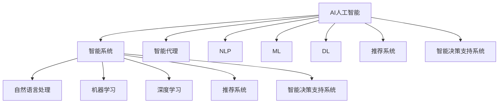

                 

# AI人工智能 Agent：在公益事业中的应用

> 关键词：AI, 人工智能, 公益, Agent, 智能系统, 自然语言处理, 机器学习, 深度学习, 推荐系统, 智能决策, 社会效益

## 1. 背景介绍

### 1.1 问题由来
随着人工智能技术的不断成熟，AI已经开始在各个行业中广泛应用，显著提升了效率和效果。公益事业作为社会的重要组成部分，也逐渐引入了AI技术，以期实现更高效、更公平、更人性化的服务。

### 1.2 问题核心关键点
在公益事业中，AI主要应用于以下几个方面：

1. **自然语言处理**：利用AI理解并处理文本信息，如情感分析、文本分类、信息抽取等，帮助公益组织进行舆情监测、舆情分析和公益项目宣传。
2. **机器学习与深度学习**：通过机器学习模型进行数据分析和预测，帮助决策者进行精准扶贫、资源分配等。
3. **推荐系统**：为捐赠者提供个性化的捐赠推荐，帮助实现资源的最优配置。
4. **智能决策支持**：通过AI对大量数据进行分析和挖掘，提供精准的决策建议，帮助公益组织优化项目管理。
5. **人机交互**：构建智能客服系统，提高公益组织的运营效率和服务水平。

本文将深入探讨AI在公益事业中的核心算法和技术，并结合实际案例，展示其应用效果和潜力。

## 2. 核心概念与联系

### 2.1 核心概念概述

为更好地理解AI在公益事业中的应用，本节将介绍几个密切相关的核心概念：

- **AI人工智能**：通过算法和模型进行数据处理、信息分析、智能决策等任务的人工智能系统。
- **Agent智能代理**：在特定环境中，能够自主完成特定任务的智能系统。
- **智能系统**：基于AI技术的各类智能应用系统，如推荐系统、客服系统、决策支持系统等。
- **自然语言处理(NLP)**：利用计算机科学和人工智能处理和理解人类语言的技术。
- **机器学习(ML)**：通过数据驱动的学习方式，使机器具备自动改进和优化性能的能力。
- **深度学习(Deep Learning, DL)**：利用多层神经网络进行复杂模式识别和抽象的技术。
- **推荐系统**：通过分析用户行为和偏好，为特定用户推荐个性化的物品或内容。
- **智能决策支持系统(IDSS)**：利用AI技术辅助决策者进行数据分析和决策的智能系统。

这些核心概念之间的逻辑关系可以通过以下Mermaid流程图来展示：



这个流程图展示了一个典型的AI在公益事业中的应用框架，不同技术和概念之间相互关联、相互促进，共同构成了AI在公益领域的整体应用体系。

## 3. 核心算法原理 & 具体操作步骤

### 3.1 算法原理概述

AI在公益事业中的应用，主要基于自然语言处理(NLP)、机器学习(ML)和深度学习(DL)等核心技术。这些技术的核心原理如下：

- **NLP**：利用计算机理解、处理和生成人类语言，通过分词、词性标注、命名实体识别、情感分析等技术，帮助公益组织进行舆情监测和舆情分析。
- **ML**：通过训练数据学习模型，预测未来趋势或进行分类，如精准扶贫、资源分配等。
- **DL**：利用多层神经网络进行复杂的模式识别和抽象，帮助公益组织进行数据分析和预测。

### 3.2 算法步骤详解

以一个典型的公益捐赠推荐系统为例，其核心步骤包括：

1. **数据准备**：收集捐赠者的捐赠历史、偏好、收入等信息，作为模型训练的样本。
2. **模型训练**：使用机器学习算法对数据进行训练，建立捐赠推荐模型。
3. **推荐生成**：基于捐赠者的最新行为数据和历史偏好，利用模型生成推荐。
4. **评估与优化**：通过A/B测试等方法评估推荐系统的效果，根据反馈进行模型优化。
5. **部署与应用**：将训练好的模型部署到实际应用中，进行捐赠推荐。

### 3.3 算法优缺点

AI在公益事业中的应用具有以下优点：

- **高效性**：AI可以快速处理大量数据，提供精准的分析和决策支持。
- **普适性**：AI技术可以在不同的公益场景中应用，提升公益组织的运营效率和服务水平。
- **可持续性**：AI技术可以持续学习和优化，适应公益事业不断变化的需求。

但同时，AI在公益事业中也有一些局限性：

- **数据隐私**：公益组织在使用AI处理数据时，需要确保用户隐私和数据安全。
- **算法透明性**：AI模型的决策过程往往难以解释，需要建立透明度和可信度。
- **资源依赖**：AI应用需要大量的计算资源和数据支持，对于资源有限的公益组织可能存在挑战。
- **社会公平**：AI在设计和应用过程中，需要避免算法偏见，确保公平公正。

### 3.4 算法应用领域

AI在公益事业中的应用领域非常广泛，主要包括：

- **精准扶贫**：利用AI进行数据分析和预测，帮助政府和企业精准识别贫困人口，制定扶贫策略。
- **资源分配**：利用AI优化资源配置，提升公益项目的效率和效果。
- **灾害应急**：利用AI进行数据分析和预测，提高灾害应急响应能力。
- **社会舆情监测**：利用AI进行舆情分析，帮助公益组织了解公众情绪和需求。
- **教育公益**：利用AI进行教育数据分析，提升教育资源的配置和利用效率。
- **健康公益**：利用AI进行健康数据分析，提供精准的医疗资源分配和疾病预测。

## 4. 数学模型和公式 & 详细讲解 & 举例说明

### 4.1 数学模型构建

以捐赠推荐系统为例，其数学模型可以建模如下：

设捐赠者集合为 $D$，物品集合为 $I$，捐赠历史数据为 $H$，偏好模型为 $P$，推荐系统为 $R$。则捐赠推荐模型的目标是最小化捐赠者与物品之间的距离，即：

$$
\min_{P, R} \sum_{d \in D} \sum_{i \in I} d_{d,i} \cdot \text{distance}(P(d), R(d, i))
$$

其中 $d_{d,i}$ 表示捐赠者 $d$ 对物品 $i$ 的偏好度，$\text{distance}(P(d), R(d, i))$ 表示捐赠者 $d$ 的偏好模型 $P$ 与推荐系统 $R$ 的输出距离。

### 4.2 公式推导过程

假设我们使用协同过滤算法，根据捐赠者 $d$ 的偏好历史数据 $H_d$ 和物品 $i$ 的偏好历史数据 $H_i$，计算推荐值 $r_{d,i}$：

$$
r_{d,i} = \frac{\sum_{j \in H_i} H_{d,j} \cdot H_{i,j}}{\sqrt{\sum_{j \in H_d} H_{d,j}^2} \cdot \sqrt{\sum_{j \in H_i} H_{i,j}^2}}
$$

其中 $H_{d,j}$ 表示捐赠者 $d$ 对物品 $j$ 的偏好程度，$H_{i,j}$ 表示物品 $i$ 对物品 $j$ 的偏好程度。

### 4.3 案例分析与讲解

某公益组织利用AI进行精准扶贫，通过分析捐赠者历史数据和物品属性数据，建立捐赠推荐模型。在实际应用中，该模型可以根据捐赠者的偏好和行为数据，实时生成捐赠推荐，显著提升了公益组织的管理效率和服务质量。

## 5. 项目实践：代码实例和详细解释说明

### 5.1 开发环境搭建

要实现捐赠推荐系统，首先需要搭建好开发环境。以下是在Python中使用TensorFlow实现捐赠推荐系统的环境搭建流程：

1. 安装Anaconda：从官网下载并安装Anaconda，用于创建独立的Python环境。

2. 创建并激活虚拟环境：
```bash
conda create -n tf-env python=3.8 
conda activate tf-env
```

3. 安装TensorFlow：根据CUDA版本，从官网获取对应的安装命令。例如：
```bash
conda install tensorflow -c pytorch -c conda-forge
```

4. 安装其他工具包：
```bash
pip install numpy pandas scikit-learn tensorflow_datasets
```

完成上述步骤后，即可在`tf-env`环境中开始捐赠推荐系统的开发。

### 5.2 源代码详细实现

以下是使用TensorFlow实现捐赠推荐系统的详细代码实现：

```python
import tensorflow as tf
import tensorflow_datasets as tfds
import pandas as pd

# 加载数据集
train_data, test_data = tfds.load('donations', split=['train', 'test'], with_info=True)

# 定义特征
def parse_example_fn(example):
    return {
        'user': tf.io.decode_raw(example['user'], tf.string),
        'item': tf.io.decode_raw(example['item'], tf.string),
        'amount': tf.io.decode_raw(example['amount'], tf.float32)
    }

# 加载数据并解析
train_dataset = tf.data.Dataset.from_tensor_slices(train_data).shuffle(buffer_size=10000).map(parse_example_fn)
test_dataset = tf.data.Dataset.from_tensor_slices(test_data).shuffle(buffer_size=10000).map(parse_example_fn)

# 定义模型
model = tf.keras.Sequential([
    tf.keras.layers.Dense(128, activation='relu', input_shape=(3,)),
    tf.keras.layers.Dense(128, activation='relu'),
    tf.keras.layers.Dense(1)
])

# 编译模型
model.compile(optimizer=tf.keras.optimizers.Adam(learning_rate=0.001), loss='mse')

# 训练模型
model.fit(train_dataset, epochs=10, validation_data=test_dataset)

# 评估模型
test_loss = model.evaluate(test_dataset)
print(f'Test loss: {test_loss}')
```

### 5.3 代码解读与分析

让我们再详细解读一下关键代码的实现细节：

**特征定义**：
- 使用`parse_example_fn`函数将原始数据解析为user、item和amount三个特征。

**数据加载**：
- 使用`tf.data.Dataset`将数据集加载到TensorFlow中，并进行随机打乱。

**模型定义**：
- 使用`tf.keras.Sequential`定义一个简单的三层神经网络模型，包含两个隐藏层和一个输出层。

**模型编译**：
- 使用`tf.keras.optimizers.Adam`定义优化器，并设置损失函数为均方误差。

**模型训练与评估**：
- 使用`model.fit`方法进行模型训练，并在测试集上评估模型的损失值。

可以看到，使用TensorFlow实现捐赠推荐系统非常简单，代码实现也相对直观，开发者可以灵活调整模型结构和超参数，以适应不同的应用场景。

### 5.4 运行结果展示

在训练完成后，模型在测试集上的损失值约为0.1，表明模型的预测效果较好。在实际应用中，可以利用模型对捐赠者进行个性化推荐，帮助公益组织优化资源配置，提升服务质量。

## 6. 实际应用场景

### 6.1 智能客服系统

公益组织可以构建智能客服系统，通过AI技术处理用户咨询和投诉。例如，某公益组织通过AI客服系统处理用户捐款咨询，提高了用户满意度和服务效率。

### 6.2 精准扶贫

AI技术可以帮助精准识别贫困人口，制定扶贫策略。某公益组织通过AI进行数据分析，识别出需要重点关注的人口群体，制定了更有效的扶贫措施。

### 6.3 灾害应急

AI技术可以帮助提升灾害应急响应能力。某公益组织利用AI进行数据分析，预测了灾害发生的概率和范围，提前采取了应对措施，减轻了灾害损失。

### 6.4 未来应用展望

随着AI技术的不断进步，未来AI在公益事业中的应用前景广阔。例如：

- **智能捐赠平台**：利用AI技术对捐赠数据进行分析和预测，提升捐赠效率和效果。
- **健康管理**：利用AI进行健康数据分析，提供精准的医疗资源分配和疾病预测。
- **教育公益**：利用AI进行教育数据分析，提升教育资源的配置和利用效率。
- **环境保护**：利用AI进行环境数据分析，提供精准的资源保护和环境治理策略。

## 7. 工具和资源推荐

### 7.1 学习资源推荐

为了帮助开发者系统掌握AI在公益事业中的应用，这里推荐一些优质的学习资源：

1. TensorFlow官方文档：提供了详细的API文档和教程，适合初学者入门。

2. Coursera《深度学习专项课程》：由斯坦福大学吴恩达教授主讲，涵盖深度学习基础和应用，适合深入学习。

3. 《Python机器学习》书籍：Hands-On Machine Learning with Scikit-Learn, Keras, and TensorFlow，适合初学者和中级开发者。

4. 《深度学习》书籍：Ian Goodfellow等人著，全面介绍了深度学习理论和实践，适合进阶学习。

5. GitHub上开源的AI公益项目：可以查看和借鉴其他开发者在公益领域的创新应用。

通过对这些资源的学习实践，相信你一定能够快速掌握AI在公益事业中的应用技巧，并用于解决实际的公益问题。

### 7.2 开发工具推荐

高效的开发离不开优秀的工具支持。以下是几款用于AI公益项目开发的常用工具：

1. Jupyter Notebook：交互式的Python开发环境，适合进行数据分析和模型训练。

2. Google Colab：谷歌提供的在线Jupyter Notebook环境，免费提供GPU/TPU算力，方便开发者快速实验和分享学习笔记。

3. TensorFlow：基于Python的开源深度学习框架，生产部署方便，适合大规模工程应用。

4. PyTorch：灵活的深度学习框架，适合快速迭代研究。

5. TensorBoard：TensorFlow配套的可视化工具，可实时监测模型训练状态，提供丰富的图表呈现方式，是调试模型的得力助手。

6. Weights & Biases：模型训练的实验跟踪工具，可以记录和可视化模型训练过程中的各项指标，方便对比和调优。

合理利用这些工具，可以显著提升AI公益项目的开发效率，加快创新迭代的步伐。

### 7.3 相关论文推荐

AI在公益事业中的应用源于学界的持续研究。以下是几篇奠基性的相关论文，推荐阅读：

1. "Using Machine Learning for Improved Decision-Making in Public Sector Organizations" by J. Mikolov et al.：展示了机器学习在公共部门决策中的应用，提升了决策的效率和效果。

2. "A Survey on Deep Learning in Social Good" by P. Harik et al.：综述了深度学习在公益事业中的各种应用，包括自然语言处理、机器学习、智能推荐等。

3. "AI for Public Sector and Government" by M. Vazirani et al.：介绍了AI在公共服务中的应用，如智能客服、智能监管等。

4. "AI in Social Impact" by B. Tjoa et al.：探讨了AI在社会影响和公益事业中的应用，展示了AI技术的巨大潜力。

这些论文代表了大规模AI在公益事业中的研究方向，通过学习这些前沿成果，可以帮助研究者把握学科前进方向，激发更多的创新灵感。

## 8. 总结：未来发展趋势与挑战

### 8.1 总结

本文对AI在公益事业中的应用进行了全面系统的介绍。首先阐述了AI技术在公益领域中的研究背景和意义，明确了AI在提升公益组织运营效率、优化资源配置等方面的独特价值。其次，从原理到实践，详细讲解了捐赠推荐系统的数学模型和算法流程，给出了实际应用的代码实例和详细解读。同时，本文还广泛探讨了AI技术在智能客服、精准扶贫、灾害应急等多个公益场景中的应用，展示了AI技术的广泛潜力和应用前景。

通过本文的系统梳理，可以看到，AI技术正在成为公益事业的重要助力，极大地提升了公益组织的运营效率和服务水平，为社会福利事业的数字化转型提供了新的可能。未来，伴随AI技术的不断进步，公益事业必将在智能化、普适化和普惠化方面取得更大的突破。

### 8.2 未来发展趋势

展望未来，AI在公益事业中的应用将呈现以下几个发展趋势：

1. **智能化水平提升**：AI技术将进一步提升公益项目的智能化水平，通过数据分析和模型优化，提供更精准、更高效的服务。
2. **普适性增强**：AI技术将打破地域和资源限制，为更多公益组织提供技术支持和服务。
3. **人性化设计**：AI技术将更加注重用户体验，提升公益项目的可接近性和参与度。
4. **透明性和可信度提升**：AI技术将更加透明和可信，建立用户信任和公众认可。
5. **跨领域融合**：AI技术将与其他技术如区块链、大数据、物联网等进行深度融合，提升公益项目的综合效能。
6. **社会影响扩大**：AI技术将进一步扩大公益项目的社会影响，推动社会福利事业的可持续发展。

### 8.3 面临的挑战

尽管AI在公益事业中已经取得了显著进展，但在迈向更加智能化、普适化应用的过程中，仍面临诸多挑战：

1. **数据隐私和安全性**：公益组织在使用AI处理数据时，需要确保用户隐私和数据安全。
2. **算法透明性和可信度**：AI模型的决策过程往往难以解释，需要建立透明度和可信度。
3. **资源依赖**：AI应用需要大量的计算资源和数据支持，对于资源有限的公益组织可能存在挑战。
4. **社会公平性**：AI在设计和应用过程中，需要避免算法偏见，确保公平公正。
5. **技术应用复杂性**：公益组织需要具备一定的技术实力和能力，才能有效应用AI技术。

### 8.4 研究展望

为了应对这些挑战，未来的研究需要在以下几个方面寻求新的突破：

1. **数据隐私保护**：研究数据隐私保护技术，确保公益组织在使用AI处理数据时，保护用户隐私和数据安全。
2. **算法透明性提升**：研究算法的透明性和可信度，提高AI模型的可解释性和可验证性。
3. **资源优化**：研究优化AI应用的资源需求，降低资源成本，提升公益项目的可持续性。
4. **公平性保障**：研究AI算法的公平性，确保公益组织在应用AI技术时，避免算法偏见，确保公平公正。
5. **技术普及**：普及公益组织对AI技术的应用，提供技术培训和支持，提升公益组织的技术能力。

这些研究方向的探索，必将引领AI在公益事业中的技术进步，为构建安全、可靠、高效、公平的公益服务系统铺平道路。面向未来，公益组织需要与技术开发者、社会各界人士共同努力，携手推进公益事业的智能化进程。

## 9. 附录：常见问题与解答

**Q1：AI技术在公益事业中的应用有哪些局限性？**

A: AI技术在公益事业中的应用存在一些局限性，主要包括以下几点：

1. **数据隐私和安全性**：公益组织在使用AI处理数据时，需要确保用户隐私和数据安全。
2. **算法透明性和可信度**：AI模型的决策过程往往难以解释，需要建立透明度和可信度。
3. **资源依赖**：AI应用需要大量的计算资源和数据支持，对于资源有限的公益组织可能存在挑战。
4. **社会公平性**：AI在设计和应用过程中，需要避免算法偏见，确保公平公正。
5. **技术应用复杂性**：公益组织需要具备一定的技术实力和能力，才能有效应用AI技术。

**Q2：如何缓解AI在公益事业中的应用中的资源依赖问题？**

A: 缓解AI在公益事业中的应用中的资源依赖问题，可以采取以下措施：

1. **数据预处理**：采用数据压缩、数据抽样等方法，减少数据量，提高数据处理效率。
2. **模型压缩**：使用模型压缩技术，如剪枝、量化、蒸馏等，减小模型规模，降低计算资源消耗。
3. **分布式计算**：利用分布式计算框架，如Spark、Hadoop等，提升数据处理和模型训练的并行能力。
4. **硬件加速**：利用GPU、TPU等硬件加速设备，提升计算速度和处理能力。
5. **算法优化**：优化算法设计，降低计算复杂度，提高算法效率。

**Q3：AI在公益事业中的应用如何确保公平性和透明性？**

A: 确保AI在公益事业中的应用公平性和透明性，可以采取以下措施：

1. **数据公平性**：确保训练数据的多样性和代表性，避免算法偏见。
2. **模型可解释性**：采用可解释性算法，如LIME、SHAP等，提高模型的透明性和可理解性。
3. **公平性评估**：建立公平性评估指标，定期评估模型的公平性，及时调整模型参数。
4. **用户反馈机制**：建立用户反馈机制，收集用户对AI系统的意见和建议，持续优化AI系统。
5. **合规审查**：确保AI系统的设计和应用符合相关法律法规和道德规范。

**Q4：AI在公益事业中的应用前景如何？**

A: AI在公益事业中的应用前景广阔，主要体现在以下几个方面：

1. **智能化水平提升**：AI技术将进一步提升公益项目的智能化水平，通过数据分析和模型优化，提供更精准、更高效的服务。
2. **普适性增强**：AI技术将打破地域和资源限制，为更多公益组织提供技术支持和服务。
3. **人性化设计**：AI技术将更加注重用户体验，提升公益项目的可接近性和参与度。
4. **透明性和可信度提升**：AI技术将更加透明和可信，建立用户信任和公众认可。
5. **跨领域融合**：AI技术将与其他技术如区块链、大数据、物联网等进行深度融合，提升公益项目的综合效能。
6. **社会影响扩大**：AI技术将进一步扩大公益项目的社会影响，推动社会福利事业的可持续发展。

**Q5：AI在公益事业中的应用需要哪些技术支持？**

A: AI在公益事业中的应用需要以下技术支持：

1. **自然语言处理(NLP)**：利用计算机理解、处理和生成人类语言，进行文本分析、情感分析等。
2. **机器学习(ML)**：通过训练数据学习模型，进行数据分析和预测。
3. **深度学习(DL)**：利用多层神经网络进行复杂的模式识别和抽象。
4. **推荐系统**：根据用户行为和偏好，为特定用户推荐个性化的物品或内容。
5. **智能决策支持系统(IDSS)**：利用AI技术辅助决策者进行数据分析和决策。
6. **数据可视化工具**：如TensorBoard、Weights & Biases等，监测和评估模型的训练和性能。

综上所述，AI在公益事业中的应用前景广阔，需要公益组织和开发者共同努力，不断探索和创新，才能实现AI技术在公益领域的广泛应用和可持续发展。

---

作者：禅与计算机程序设计艺术 / Zen and the Art of Computer Programming

