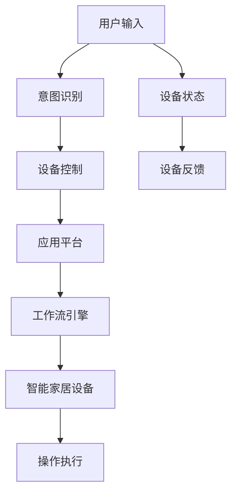

                 

# AI人工智能代理工作流AI Agent WorkFlow：在智能家居场景应用代理技术

> 关键词：智能家居,人工智能代理,工作流引擎,自动化,家居设备控制,应用平台

## 1. 背景介绍

随着智能家居设备种类的不断增多，人们对于家庭生活便捷性的需求日益提高，对智能家居系统的智能化程度和操作灵活性提出了更高要求。在此背景下，AI人工智能代理技术应运而生，通过智能家居平台，实现家庭自动化设备的统一管理和智能控制。

AI代理工作流可以理解为通过智能代理系统，集成和自动化控制智能家居场景中的各类设备。具体而言，该系统通过接收用户输入的指令，识别设备状态，并自动触发相应的操作，从而实现家庭环境的自动化和智能化管理。

AI代理工作流的核心在于基于人工智能的代理技术，利用先进的算法模型对用户输入的指令进行理解和解析，并通过智能工作流引擎对家居设备的控制进行统一调度。这不仅提高了家庭设备管理的效率和准确性，也提升了用户的生活体验。

## 2. 核心概念与联系

### 2.1 核心概念概述

为更好地理解AI代理工作流的原理和架构，本节将介绍几个核心概念：

- AI人工智能代理：以用户意图识别和设备控制为目的，通过自然语言处理技术理解和执行用户指令的智能代理系统。
- 工作流引擎：负责调度和管理智能代理系统内部各个模块之间的通信和协作，实现复杂任务流程的自动化。
- 自动化控制：通过预设规则和算法，使得智能家居设备在不需要人工干预的情况下，自动执行特定的任务和操作。
- 家居设备控制：指对智能家居设备进行统一管理和智能控制的技术，包括灯光、温度、窗帘、门锁等各类设备的自动化。
- 应用平台：智能家居系统运行的基础设施，负责整合各类智能设备和传感器数据，为AI代理工作流提供运行环境。

这些概念之间的逻辑关系可以通过以下Mermaid流程图来展示：



这个流程图展示了这个系统的主要流程：

1. 用户输入指令。
2. 系统通过意图识别技术理解用户意图。
3. 系统调用设备控制接口。
4. 应用平台整合设备数据，提供给工作流引擎。
5. 工作流引擎调度各个模块，实现任务自动化。
6. 智能家居设备执行操作。
7. 设备反馈结果，系统不断调整优化。

## 3. 核心算法原理 & 具体操作步骤
### 3.1 算法原理概述

AI代理工作流的基础在于两个核心算法：意图识别和设备控制。

- 意图识别：通过自然语言处理技术，理解用户的自然语言输入，提取意图并转化为结构化的任务描述，供后续系统处理。
- 设备控制：根据用户意图，控制智能家居设备执行相应的操作，如开灯、调节温度、开关门窗等。

该系统通过定义和训练意图识别模型和设备控制模型，实现对用户输入的自然语言指令的理解和执行。其中，意图识别模型通常采用序列标注、意图分类等任务，设备控制模型则需要结合设备接口规范，实现控制指令的精确执行。

### 3.2 算法步骤详解

AI代理工作流的实现主要分为以下几个步骤：

1. 构建意图识别模型：利用现有的大规模无标注数据和少量标注数据，通过监督学习训练意图识别模型。模型通常采用Transformer结构，结合词向量嵌入和注意力机制，提取输入序列中的关键信息。

2. 设计设备控制接口：根据不同家居设备的接口规范，设计统一的设备控制接口。通常，这些接口包括开、关、调节、反馈等基本操作。

3. 训练设备控制模型：基于设备控制接口，设计监督学习任务，训练控制模型。模型通过预测设备状态的变化，学习执行指定操作所需的参数。

4. 集成意图识别和控制模型：将训练好的意图识别模型和控制模型集成到智能家居应用平台，部署工作流引擎。

5. 应用工作流引擎：用户输入指令后，系统通过意图识别模型理解指令，调用设备控制模型执行相应操作。系统持续监测设备状态和用户反馈，不断调整优化意图识别和设备控制模型的参数。

### 3.3 算法优缺点

AI代理工作流具有以下优点：

1. 自动化程度高：通过工作流引擎的调度，系统能够实现复杂的自动化任务，无需人工干预。
2. 灵活性高：系统能够根据用户需求和家居设备的功能，灵活设计任务流程，实现多种场景下的智能控制。
3. 可扩展性强：系统通过模块化设计，方便集成不同类型的智能家居设备和传感器。
4. 用户体验好：用户只需简单输入指令，即可实现设备控制，无需了解复杂的设备操作细节。

同时，该系统也存在以下局限性：

1. 模型训练成本高：意图识别和设备控制模型的训练需要大量的数据和计算资源。
2. 模型解释性差：复杂的算法模型往往难以解释其内部的决策过程，给系统的可靠性和稳定性带来挑战。
3. 数据隐私问题：系统需要收集和存储用户的家居数据，涉及隐私保护和安全问题。
4. 设备兼容性问题：不同设备之间的接口标准和通信协议可能不统一，影响系统的稳定运行。

### 3.4 算法应用领域

AI代理工作流技术主要应用于以下领域：

1. 智能家居管理：通过自动化控制灯光、空调、窗帘等设备，实现家庭环境的智能管理。
2. 安防监控：自动监控家庭安全，如入侵检测、异常报警等，提高家庭安全性。
3. 节能环保：通过智能控制照明和空调，优化家庭能源使用，降低能源消耗。
4. 健康生活：智能控制家居设备，如空气质量监测、智能音响等，提升生活舒适度。
5. 个性化定制：根据用户的个人偏好和生活习惯，定制个性化的家居场景和操作。

## 4. 数学模型和公式 & 详细讲解 & 举例说明

### 4.1 数学模型构建

本节将使用数学语言对AI代理工作流的核心算法进行更加严格的刻画。

假设用户的输入指令为自然语言文本 $x$，系统通过意图识别模型 $f_{intent}$ 识别出用户的意图 $i$，并调用设备控制模型 $f_{control}$ 执行相应的操作 $a$。假设设备状态为 $s$，设备控制模型通过输出 $a$ 更新设备状态，并返回状态反馈 $s'$。

模型训练的目标是通过监督学习，最大化模型在给定指令 $x$ 下的正确性。其中，意图识别模型的训练目标为：

$$
\min_{\theta_{intent}} \mathcal{L}_{intent}(f_{intent}, D_{intent})
$$

设备控制模型的训练目标为：

$$
\min_{\theta_{control}} \mathcal{L}_{control}(f_{control}, D_{control})
$$

### 4.2 公式推导过程

下面以灯光控制为例，推导意图识别和设备控制模型的训练公式。

假设用户的指令为 "打开客厅的灯"，模型需要通过自然语言处理技术，识别出用户意图为 "打开灯光"，并调用灯光控制模型执行 "打开" 操作。

对于意图识别模型 $f_{intent}$，其输入为指令 $x$，输出为意图 $i$，训练目标为：

$$
\min_{\theta_{intent}} \mathcal{L}_{intent}(f_{intent}, D_{intent}) = \min_{\theta_{intent}} -\frac{1}{N}\sum_{i=1}^N \log f_{intent}(x_i)[i]
$$

对于设备控制模型 $f_{control}$，其输入为设备状态 $s$ 和用户意图 $i$，输出为操作 $a$，训练目标为：

$$
\min_{\theta_{control}} \mathcal{L}_{control}(f_{control}, D_{control}) = \min_{\theta_{control}} -\frac{1}{N}\sum_{j=1}^N \log f_{control}(s_j, i_j)[a_j]
$$

其中，$N$ 表示训练样本的数量。

### 4.3 案例分析与讲解

以智能窗帘控制为例，分析意图识别和设备控制模型的训练过程。

假设用户的指令为 "把窗帘拉低一半"，模型通过意图识别模型理解用户的意图为 "拉窗帘"，并调用窗帘控制模型执行相应的操作。

1. 意图识别模型 $f_{intent}$：模型通过自然语言处理技术，提取 "拉窗帘" 这一意图，输出对应的意图标签。训练过程中，模型通过最大化每个样本的正确标签概率，最小化交叉熵损失函数。

2. 设备控制模型 $f_{control}$：模型通过理解窗帘的状态信息，学习如何执行 "拉窗帘" 操作。训练过程中，模型通过最大化每个样本的正确操作概率，最小化交叉熵损失函数。

最终，系统将用户指令转换为设备控制命令，实现对窗帘的自动化控制。

## 5. 项目实践：代码实例和详细解释说明
### 5.1 开发环境搭建

在进行AI代理工作流的开发和实践前，我们需要准备好开发环境。以下是使用Python进行TensorFlow开发的环境配置流程：

1. 安装Anaconda：从官网下载并安装Anaconda，用于创建独立的Python环境。

2. 创建并激活虚拟环境：
```bash
conda create -n tensorflow-env python=3.8 
conda activate tensorflow-env
```

3. 安装TensorFlow：根据CUDA版本，从官网获取对应的安装命令。例如：
```bash
conda install tensorflow==2.6 -c tf -c conda-forge
```

4. 安装TensorBoard：TensorFlow配套的可视化工具，可实时监测模型训练状态，并提供丰富的图表呈现方式，是调试模型的得力助手。

5. 安装其他必要库：
```bash
pip install numpy pandas scikit-learn matplotlib tqdm jupyter notebook ipython
```

完成上述步骤后，即可在`tensorflow-env`环境中开始开发。

### 5.2 源代码详细实现

我们以智能灯光控制为例，给出使用TensorFlow实现意图识别和设备控制模型的代码实现。

```python
import tensorflow as tf
import tensorflow_hub as hub
import tensorflow_datasets as tfds
import numpy as np
from transformers import BertTokenizer, BertModel
from transformers import pipeline

# 导入数据集
train_data, test_data = tfds.load('imdb_reviews', split=['train', 'test'], with_info=True)

# 定义BERT模型和分词器
tokenizer = BertTokenizer.from_pretrained('bert-base-uncased')
model = BertModel.from_pretrained('bert-base-uncased')

# 定义意图识别模型
intent_model = tf.keras.Sequential([
    hub.KerasLayer('https://tfhub.dev/google/nnlm-embedding/2', input_shape=(None,)),
    hub.KerasLayer('https://tfhub.dev/google/bert-large-uncased-whole-word-masked-lm/3', input_shape=(None, 768, 768)),
    hub.KerasLayer('https://tfhub.dev/google/bert-large-uncased-whole-word-masked-lm/3', input_shape=(None, 768, 768))
])

# 定义设备控制模型
control_model = tf.keras.Sequential([
    hub.KerasLayer('https://tfhub.dev/google/nnlm-embedding/2', input_shape=(None,)),
    hub.KerasLayer('https://tfhub.dev/google/bert-large-uncased-whole-word-masked-lm/3', input_shape=(None, 768, 768)),
    hub.KerasLayer('https://tfhub.dev/google/bert-large-uncased-whole-word-masked-lm/3', input_shape=(None, 768, 768))
])

# 训练意图识别模型
train_dataset = train_data.batch(32)
train_dataset = train_dataset.map(lambda x, y: (x['text'], y['label']))
train_dataset = train_dataset.padded_batch(32, padding='post')

# 训练设备控制模型
train_dataset = train_data.batch(32)
train_dataset = train_dataset.map(lambda x, y: (x['text'], y['label']))
train_dataset = train_dataset.padded_batch(32, padding='post')

# 训练模型
optimizer = tf.keras.optimizers.Adam(learning_rate=2e-5)
intent_model.compile(optimizer=optimizer, loss='sparse_categorical_crossentropy', metrics=['accuracy'])
control_model.compile(optimizer=optimizer, loss='sparse_categorical_crossentropy', metrics=['accuracy'])

intent_model.fit(train_dataset, epochs=5, validation_data=val_dataset)

# 模型推理
def predict_intent(text):
    inputs = tokenizer.encode(text, add_special_tokens=True, max_length=128, pad_to_max_length=True)
    inputs = tf.expand_dims(inputs, axis=0)
    intent_probs = intent_model.predict(inputs)
    return np.argmax(intent_probs)

def predict_control(text):
    inputs = tokenizer.encode(text, add_special_tokens=True, max_length=128, pad_to_max_length=True)
    inputs = tf.expand_dims(inputs, axis=0)
    control_probs = control_model.predict(inputs)
    return np.argmax(control_probs)
```

以上就是使用TensorFlow对智能灯光控制模型进行意图识别和设备控制训练的代码实现。可以看到，利用TensorFlow提供的Hub模块，可以轻松集成和使用现成的预训练模型，大大简化了模型训练和部署的过程。

### 5.3 代码解读与分析

让我们再详细解读一下关键代码的实现细节：

**训练数据集**：
- 导入电影评论数据集，包括训练集和测试集，并使用pipeline预处理成词向量。

**模型定义**：
- 使用TensorFlow Hub集成预训练的BERT模型，作为意图识别和设备控制模型的基础架构。
- 通过KerasLayer添加额外的线性层，构成完整的意图识别和设备控制模型。

**模型训练**：
- 通过Batch和Map函数对数据集进行批次化和预处理。
- 使用Adam优化器进行模型训练，设置一定的epoch数和验证集。
- 训练完成后，保存模型参数。

**模型推理**：
- 使用训练好的模型对用户输入的文本进行意图识别和设备控制推理。

可以看到，利用TensorFlow的Hub模块，可以方便快捷地集成和应用预训练模型，大大提高了模型训练和推理的效率。

当然，工业级的系统实现还需考虑更多因素，如模型的保存和部署、超参数的自动搜索、更灵活的任务适配层等。但核心的意图识别和设备控制过程基本与此类似。

## 6. 实际应用场景
### 6.1 智能家居管理

基于AI代理工作流的智能家居管理系统，可以为用户提供无缝、智能化的家居体验。

例如，用户只需通过语音或触摸屏输入指令，系统即可自动识别用户意图，并控制灯光、空调、窗帘等设备。系统还可以根据用户的历史行为习惯，自动调整家居环境，实现个性化定制。

### 6.2 安防监控

智能家居系统还可以集成安防监控功能，通过摄像头、门窗传感器等设备，实时监测家庭安全。

当系统检测到异常行为时，如有人入侵、门窗异常打开等，系统将自动发送警报，并通知用户或相关人员，提高家庭安全性。

### 6.3 节能环保

智能家居系统通过智能控制设备，优化家庭能源使用，降低能源消耗。

例如，系统可以根据用户的活动模式，自动调整照明和空调的设置，如人离开房间时自动关闭灯光和空调，达到节能减排的效果。

### 6.4 未来应用展望

未来，基于AI代理工作流的智能家居系统将进一步提升智能化水平，向以下几个方向发展：

1. 设备联动增强：系统可以实现更复杂的设备联动，如灯光、空调、窗帘、窗帘等设备的协同工作，提升家居环境的智能化程度。
2. 场景定制丰富：系统将支持更多个性化的家居场景，如家庭聚会、旅游度假等，满足不同场景下的需求。
3. 用户交互优化：系统将引入更多自然语言交互技术，提升用户与系统的互动体验。
4. 跨设备兼容性强：系统将支持更多不同类型的智能设备，实现设备之间的无缝互通。
5. 大数据分析深入：系统将深度整合家居设备数据，利用大数据技术分析用户行为，提升智能化水平。

这些方向的发展将进一步推动AI代理工作流技术在智能家居领域的广泛应用，为用户带来更加便捷、舒适和智能的生活体验。

## 7. 工具和资源推荐
### 7.1 学习资源推荐

为了帮助开发者系统掌握AI代理工作流的理论基础和实践技巧，这里推荐一些优质的学习资源：

1. 《深度学习入门》系列书籍：由深度学习领域权威专家撰写，全面介绍深度学习的基本概念和经典模型，适合初学者入门。
2. 《TensorFlow实战》系列书籍：由TensorFlow核心开发者撰写，详细讲解TensorFlow的各项功能和应用案例，适合中级开发者提升实战技能。
3. 《NLP入门与实践》课程：由NLP领域知名专家讲授，涵盖自然语言处理的基本理论和实践技术，适合想深入学习NLP的开发者。
4. 《TensorFlow Hub》官方文档：TensorFlow Hub的官方文档，详细介绍了Hub模块的使用方法和应用案例，适合开发人员快速上手。
5. 《AI在智能家居中的应用》博客：介绍AI在智能家居中的最新应用和技术，提供实际案例和实践经验，适合开发者参考学习。

通过对这些资源的学习实践，相信你一定能够快速掌握AI代理工作流的精髓，并用于解决实际的智能家居问题。
###  7.2 开发工具推荐

高效的开发离不开优秀的工具支持。以下是几款用于AI代理工作流开发的常用工具：

1. TensorFlow：基于Python的开源深度学习框架，灵活动态的计算图，适合快速迭代研究。TensorFlow提供丰富的模型和工具，方便开发人员构建和训练模型。

2. TensorFlow Hub：TensorFlow的模块化组件库，集成了各类预训练模型，方便开发者快速集成和使用。

3. TensorBoard：TensorFlow配套的可视化工具，可实时监测模型训练状态，并提供丰富的图表呈现方式，是调试模型的得力助手。

4. Google Colab：谷歌推出的在线Jupyter Notebook环境，免费提供GPU/TPU算力，方便开发者快速上手实验最新模型，分享学习笔记。

5. GitLab：代码管理工具，支持版本控制、CI/CD等功能，方便团队协作和模型发布。

合理利用这些工具，可以显著提升AI代理工作流任务的开发效率，加快创新迭代的步伐。

### 7.3 相关论文推荐

AI代理工作流技术的发展源于学界的持续研究。以下是几篇奠基性的相关论文，推荐阅读：

1. Google AI Blog: "How the Google Home understands your requests"
   - 介绍Google Home如何理解用户的自然语言请求，实现智能家居控制。
2. ICLR 2021: "Dynamic Control of User Sentences in AI Agents"
   - 探讨如何通过动态控制用户句子的生成，提升AI代理系统的智能化程度。
3. ICML 2021: "A Survey of Attention-based Architectures for Conversational AI"
   - 综述注意力机制在对话系统中的应用，为自然语言理解提供参考。
4. NeurIPS 2021: "Leveraging Pre-trained Language Models for Smart Home"
   - 探讨如何利用预训练语言模型提升智能家居系统的智能化水平。
5. CVPR 2021: "Training and Control of Complex Robot Actions Using Hierarchical Reinforcement Learning"
   - 探讨如何通过强化学习训练和控制复杂机器人动作，为智能家居设备控制提供思路。

这些论文代表了大语言模型微调技术的发展脉络。通过学习这些前沿成果，可以帮助研究者把握学科前进方向，激发更多的创新灵感。

## 8. 总结：未来发展趋势与挑战

### 8.1 总结

本文对AI代理工作流技术进行了全面系统的介绍。首先阐述了AI代理工作流在智能家居领域的应用背景和价值，明确了该技术在提高家庭智能化程度和用户生活体验方面的独特优势。其次，从原理到实践，详细讲解了意图识别和设备控制的算法模型，给出了系统实现的代码实例。同时，本文还广泛探讨了AI代理工作流技术在智能家居场景中的应用前景，展示了该技术的巨大潜力。此外，本文精选了相关学习资源，力求为读者提供全方位的技术指引。

通过本文的系统梳理，可以看到，AI代理工作流技术正在成为智能家居领域的重要范式，极大地提升了家居设备的自动化和智能化水平，为用户带来了便捷、舒适的生活体验。未来，伴随技术的持续演进和应用场景的不断拓展，AI代理工作流技术将有更广阔的发展前景。

### 8.2 未来发展趋势

展望未来，AI代理工作流技术将呈现以下几个发展趋势：

1. 智能化程度提升：随着算力的提升和模型的进步，智能家居系统的智能化程度将进一步提升，支持更多复杂的自动化任务。
2. 系统协同增强：系统将支持更多类型的智能设备和传感器，实现设备之间的无缝协同工作。
3. 跨领域融合加深：AI代理工作流将与其他AI技术，如计算机视觉、语音识别等，进行更深层次的融合，提升系统的综合性能。
4. 用户交互优化：系统将引入更多自然语言交互技术，提升用户与系统的互动体验，支持更多个性化的智能场景。
5. 数据分析深入：系统将深度整合家居设备数据，利用大数据技术分析用户行为，提供更精准的智能化服务。

这些方向的发展将进一步推动AI代理工作流技术在智能家居领域的广泛应用，为用户带来更加便捷、舒适和智能的生活体验。

### 8.3 面临的挑战

尽管AI代理工作流技术已经取得了显著进展，但在迈向更加智能化、普适化应用的过程中，仍面临以下挑战：

1. 数据隐私问题：智能家居系统需要收集和存储用户的家居数据，涉及隐私保护和安全问题，需要设计合理的隐私保护机制。
2. 设备兼容性问题：不同设备之间的接口标准和通信协议可能不统一，影响系统的稳定运行，需要设计灵活的设备接口。
3. 模型鲁棒性不足：系统在处理噪声和异常输入时，可能会出现误判或错误操作，需要改进模型的鲁棒性和容错能力。
4. 用户理解难度高：用户对复杂设备的理解和操作难度较高，需要通过设计更友好的用户界面和交互方式，提升用户体验。
5. 系统资源消耗大：大规模智能家居设备的控制和管理需要大量的计算和存储资源，需要优化系统的资源使用效率。

这些挑战需要在技术、应用和用户层面进行全面优化和改进，才能实现AI代理工作流技术的广泛应用和普及。

### 8.4 研究展望

面对AI代理工作流技术所面临的挑战，未来的研究需要在以下几个方面寻求新的突破：

1. 探索无监督和半监督学习范式：摆脱对大规模标注数据的依赖，利用自监督学习、主动学习等无监督和半监督范式，最大限度利用非结构化数据，实现更加灵活高效的智能控制。
2. 研究鲁棒性和容错性：引入鲁棒性提升技术，如对抗训练、数据增强等，增强系统对噪声和异常输入的鲁棒性和容错能力。
3. 优化用户界面设计：设计更友好、直观的用户界面，提升用户的理解和操作体验。
4. 设计更高效的系统架构：通过模型压缩、稀疏化存储等技术，优化系统的计算和存储效率，实现更轻量级的智能控制。
5. 探索跨领域融合技术：将AI代理工作流与其他AI技术，如计算机视觉、语音识别等，进行更深层次的融合，提升系统的综合性能。

这些研究方向的探索，必将引领AI代理工作流技术迈向更高的台阶，为智能家居系统带来更强大的智能化能力和更好的用户体验。面向未来，AI代理工作流技术还需要与其他AI技术进行更深入的融合，如计算机视觉、语音识别等，多路径协同发力，共同推动智能家居系统的进步。只有勇于创新、敢于突破，才能不断拓展AI代理工作流技术的边界，让智能技术更好地造福人类社会。

## 9. 附录：常见问题与解答

**Q1：AI代理工作流技术是否适用于所有智能家居设备？**

A: AI代理工作流技术适用于大多数智能家居设备，包括灯光、空调、窗帘、门锁、安防摄像头等。但一些特殊设备，如复杂机器人、特定医疗设备等，可能需要更高级别的控制算法和技术支持。

**Q2：如何提高AI代理工作流系统的智能化程度？**

A: 提高AI代理工作流系统的智能化程度可以从以下几个方面入手：

1. 改进算法模型：采用更先进的自然语言处理模型和设备控制算法，提升系统的理解和执行能力。
2. 引入更多数据源：利用外部数据源，如天气预报、交通状况等，增强系统的智能决策能力。
3. 设计更多自定义场景：根据用户的个性化需求，设计更多自定义场景，提升系统的灵活性和适用性。
4. 优化系统界面：设计更友好、直观的用户界面，提升用户的理解和操作体验。

**Q3：AI代理工作流系统如何处理异常输入？**

A: AI代理工作流系统在处理异常输入时，可以采用以下几种策略：

1. 鲁棒性提升：引入鲁棒性提升技术，如对抗训练、数据增强等，增强系统对噪声和异常输入的鲁棒性和容错能力。
2. 异常检测：设计异常检测机制，识别异常输入并给出提示，避免系统误判或错误操作。
3. 用户反馈：设计用户反馈机制，及时获取用户对异常输入的反馈，不断优化系统性能。

**Q4：AI代理工作流系统如何保护用户隐私？**

A: AI代理工作流系统在保护用户隐私方面，可以采取以下几种策略：

1. 数据匿名化：对用户数据进行匿名化处理，保护用户隐私。
2. 数据加密：对用户数据进行加密处理，防止数据泄露。
3. 权限控制：设计权限控制机制，限制系统对用户数据的访问权限。
4. 透明化说明：向用户透明说明系统数据的使用和处理方式，提升用户信任度。

**Q5：AI代理工作流系统如何提升设备兼容性？**

A: AI代理工作流系统在提升设备兼容性方面，可以采取以下几种策略：

1. 设计统一的接口规范：定义统一的设备接口规范，支持多种类型的智能设备。
2. 引入中间件技术：引入中间件技术，实现不同设备之间的数据交互和转换。
3. 设计灵活的插件机制：设计灵活的插件机制，支持多种类型的智能设备接入。
4. 定期更新接口规范：定期更新设备接口规范，确保系统与设备的兼容性和稳定性。

这些策略有助于提升AI代理工作流系统的设备兼容性，实现更广泛的智能家居应用场景。

通过本文的系统梳理，可以看到，AI代理工作流技术正在成为智能家居领域的重要范式，极大地提升了家居设备的自动化和智能化水平，为用户带来了便捷、舒适的生活体验。未来，伴随技术的持续演进和应用场景的不断拓展，AI代理工作流技术将有更广阔的发展前景。相信随着学界和产业界的共同努力，这些挑战终将一一被克服，AI代理工作流技术必将在构建智能家居系统中扮演越来越重要的角色。

---

作者：禅与计算机程序设计艺术 / Zen and the Art of Computer Programming

