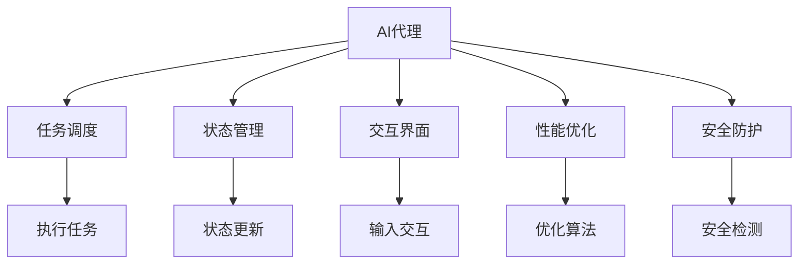

                 

# AI人工智能代理工作流AI Agent WorkFlow：构建高效AI代理的基础

> 关键词：人工智能代理,工作流,基础架构,任务调度,状态管理,交互界面,性能优化,安全防护

## 1. 背景介绍

### 1.1 问题由来

随着人工智能(AI)技术的迅猛发展，越来越多的企业和组织开始探索如何利用AI技术提升自身业务能力，实现智能化转型。AI代理(AI Agent)作为AI技术在业务流程中的应用，通过模拟人类智能行为，自动执行预设任务，极大地提高了工作效率和自动化程度。

然而，构建高效的AI代理并非易事。一方面，AI代理需要具备复杂的决策能力、强大的任务执行能力和环境适应能力，这需要先进的技术支持和大量的数据积累；另一方面，AI代理还需要灵活适应各种业务场景，具备一定的可扩展性和可定制性。

为了解决这些问题，本文将深入探讨构建高效AI代理的基础工作流（AI Agent Workflow），从核心概念、算法原理、具体操作步骤、实际应用等多个维度进行详细讲解，力求为AI代理的开发和部署提供系统的指导和参考。

## 2. 核心概念与联系

### 2.1 核心概念概述

在构建AI代理的过程中，涉及多个核心概念，它们之间相互关联，共同构成了AI代理的完整工作流。以下将对这些核心概念进行简要介绍：

- **AI代理(AI Agent)**：具备智能行为，能够执行预设任务，具备一定环境适应能力的AI模型。

- **工作流(Workflow)**：由一系列相互关联的任务组成的有序流程，用于描述AI代理的行为和执行过程。

- **任务调度(Task Scheduling)**：根据任务优先级、执行状态等因素，动态规划任务的执行顺序和分配方式。

- **状态管理(State Management)**：跟踪和记录AI代理及其执行任务的状态，确保任务执行的连续性和可靠性。

- **交互界面(Interface)**：用于用户和AI代理进行交互的界面，支持用户指令的输入和任务执行结果的输出。

- **性能优化(Performance Optimization)**：通过算法优化、硬件加速、数据压缩等方式，提升AI代理的工作效率和响应速度。

- **安全防护(Security Protection)**：对AI代理的输入和输出进行严格的过滤和检测，确保系统的安全性。

这些概念之间的逻辑关系可以通过以下Mermaid流程图来展示：



这个流程图展示了这个工作流中各个环节的相互依赖关系：

1. **AI代理**作为核心主体，负责执行任务的调度和管理。
2. **任务调度**根据任务的优先级和执行状态，规划任务的执行顺序。
3. **状态管理**跟踪AI代理的状态，确保任务的连续性。
4. **交互界面**提供用户和AI代理的交互接口，支持用户指令的输入和任务结果的输出。
5. **性能优化**通过算法优化和硬件加速等方式提升AI代理的性能。
6. **安全防护**对输入和输出进行检测和过滤，确保系统的安全。
7. **执行任务**是AI代理的核心环节，负责具体任务的执行。
8. **状态更新**在任务执行过程中，根据状态变化进行相应的调整。

这些概念共同构成了AI代理工作流的基本框架，为构建高效AI代理提供了基础。

## 3. 核心算法原理 & 具体操作步骤
### 3.1 算法原理概述

构建AI代理的工作流可以分为两个主要阶段：任务调度阶段和执行阶段。以下将对这两个阶段的算法原理进行详细讲解。

**任务调度阶段**：
- **任务建模**：将任务转化为可以由AI代理执行的形式，包括任务描述、输入输出格式等。
- **任务优先级**：根据任务的重要性和紧急程度，设定不同的优先级。
- **任务分配**：根据任务优先级和当前资源状态，动态分配任务执行的顺序。

**执行阶段**：
- **状态跟踪**：记录AI代理在执行任务时的状态，包括任务执行进度、资源占用情况等。
- **任务执行**：根据任务描述和输入数据，执行预设的任务。
- **输出处理**：对任务执行结果进行处理，并反馈给用户。

### 3.2 算法步骤详解

#### 任务调度算法步骤：

1. **任务建模**：将任务转化为可执行的形式，通常包括任务名称、输入输出格式、执行逻辑等。
2. **任务优先级划分**：根据任务的紧急程度和重要性，设定不同的优先级。优先级一般由时间敏感度、任务依赖关系、执行时间等决定。
3. **资源评估**：根据当前系统的资源状态（如CPU使用率、内存占用等），评估任务执行的可行性。
4. **任务分配**：根据任务优先级和资源评估结果，动态分配任务执行的顺序。可以使用贪心算法、遗传算法等优化方法。

#### 执行阶段算法步骤：

1. **状态初始化**：在任务执行开始时，记录初始状态，包括任务描述、输入数据、执行环境等。
2. **任务执行**：根据任务描述和输入数据，执行预设的任务。执行过程中可能需要进行复杂的推理和决策。
3. **状态更新**：在任务执行过程中，根据任务的执行进度和资源占用情况，更新状态。
4. **输出处理**：对任务执行结果进行处理，包括数据清洗、格式化等，然后反馈给用户或下一个任务。

### 3.3 算法优缺点

构建AI代理的工作流算法具有以下优点：
1. **灵活性高**：可以根据不同的任务需求，动态调整任务的优先级和执行顺序，适应各种业务场景。
2. **鲁棒性强**：通过状态管理和任务调度，确保AI代理在异常情况下仍能继续执行任务，保持系统的稳定性和连续性。
3. **可扩展性好**：系统可以根据需要，动态添加或删除任务，增强系统的灵活性和可扩展性。

同时，这些算法也存在一些缺点：
1. **复杂度高**：任务调度和状态管理涉及较多的变量和计算，可能导致系统复杂度较高。
2. **实时性要求高**：任务调度和执行需要实时计算和响应，对系统硬件和网络性能有较高要求。
3. **依赖数据量**：任务建模和执行需要大量的数据支持，数据质量直接影响任务执行的效果。

### 3.4 算法应用领域

构建AI代理的工作流算法在多个领域中具有广泛的应用前景：

- **智能客服**：用于自动处理用户咨询，提高响应速度和用户满意度。
- **金融风险控制**：用于实时监测和分析金融市场数据，提前识别潜在风险。
- **供应链管理**：用于自动调度订单处理和物流运输，提高供应链效率和灵活性。
- **智能制造**：用于自动化执行生产任务和设备维护，提升生产效率和质量。
- **健康医疗**：用于自动分析医疗数据，辅助诊断和治疗决策，提高医疗服务水平。

这些应用场景展示了构建AI代理工作流的广泛前景和重要价值，为各行业数字化转型提供了新的技术手段。

## 4. 数学模型和公式 & 详细讲解 & 举例说明

### 4.1 数学模型构建

为了更好地描述AI代理的工作流，本文将通过数学模型来量化任务的调度和执行过程。

设AI代理可执行的任务集合为 $T=\{t_1, t_2, \ldots, t_n\}$，每个任务 $t_i$ 的执行时间为 $c_i$，资源需求为 $r_i$，优先级为 $p_i$。系统可用的最大资源量为 $R$，执行优先级队列中已排入的任务数为 $N$。任务调度算法为目标函数：

$$
\min \sum_{i=1}^{n} p_i \cdot c_i \quad \text{subject to} \quad \sum_{i=1}^{n} r_i \leq R, \quad N \leq R
$$

其中，优先级 $p_i$ 通过一定的权重因子进行调整，确保关键任务优先执行。

### 4.2 公式推导过程

为了求解上述目标函数，我们可以采用贪心算法（Greedy Algorithm），每次选择资源需求最小且优先级最高的任务执行。具体步骤如下：

1. 初始化未执行任务队列 $Q$，将所有任务按照优先级从高到低排序。
2. 从队列中依次取出任务 $t_i$，如果当前资源足够，则执行任务并更新状态；否则跳过此任务。
3. 重复步骤2，直到队列为空或资源已用完。

以下是简化的伪代码实现：

```python
def greedy_scheduling(tasks, resources):
    task_queue = sorted(tasks, key=lambda x: (x['p'], x['c']))
    scheduled_tasks = []
    remaining_resources = resources
    
    for task in task_queue:
        if task['r'] <= remaining_resources:
            remaining_resources -= task['r']
            scheduled_tasks.append(task)
        else:
            continue
    
    return scheduled_tasks
```

### 4.3 案例分析与讲解

假设某智能客服系统中有以下任务：

- 任务1：处理用户A的咨询，需要2分钟，资源需求为1个CPU核心。
- 任务2：处理用户B的咨询，需要1分钟，资源需求为0.5个CPU核心。
- 任务3：处理用户C的咨询，需要3分钟，资源需求为1个CPU核心。

系统可用资源为2个CPU核心。使用上述贪心算法进行任务调度，具体步骤如下：

1. 初始化未执行任务队列 $Q=\{(1,2,1),(2,1,0.5),(3,3,1)\}$，按照优先级和执行时间排序。
2. 从队列中取出任务1，执行并更新状态。
3. 从队列中取出任务2，执行并更新状态。
4. 从队列中取出任务3，由于资源不足，跳过此任务。
5. 剩余任务数为2，符合条件。

最终，系统成功执行任务1和任务2，任务3因资源不足未能执行。任务调度的过程可以通过以下图表展示：

| 时间 | 任务 | CPU | 状态 |
| --- | --- | --- | --- |
| 0 | 无任务 | 2 | 空闲 |
| 1-3 | 任务1 | 1 | 执行 |
| 2-4 | 任务2 | 0.5 | 执行 |
| 3- | 任务3 | 1 | 等待 |

通过上述例子可以看出，贪心算法能够有效解决资源受限情况下的任务调度问题，确保关键任务优先执行，提高系统的效率和稳定性。

## 5. 项目实践：代码实例和详细解释说明
### 5.1 开发环境搭建

在进行AI代理工作流项目实践前，我们需要准备好开发环境。以下是使用Python进行TensorFlow和PyTorch开发的环境配置流程：

1. 安装Anaconda：从官网下载并安装Anaconda，用于创建独立的Python环境。

2. 创建并激活虚拟环境：
```bash
conda create -n tf-env python=3.8 
conda activate tf-env
```

3. 安装TensorFlow：根据CUDA版本，从官网获取对应的安装命令。例如：
```bash
pip install tensorflow tensorflow-gpu
```

4. 安装PyTorch：根据CUDA版本，从官网获取对应的安装命令。例如：
```bash
pip install torch torchvision torchaudio cudatoolkit=11.1 -c pytorch -c conda-forge
```

5. 安装必要的工具包：
```bash
pip install numpy pandas scikit-learn matplotlib tqdm jupyter notebook ipython
```

完成上述步骤后，即可在`tf-env`环境中开始项目实践。

### 5.2 源代码详细实现

下面我们以一个简单的AI代理工作流示例，展示TensorFlow和PyTorch的实现过程。

假设任务调度算法使用贪心算法，任务执行模块基于TensorFlow，状态管理模块使用PyTorch实现。以下是一个简化的代码框架：

```python
import tensorflow as tf
import torch
import numpy as np

class Task:
    def __init__(self, name, duration, resource, priority):
        self.name = name
        self.duration = duration
        self.resource = resource
        self.priority = priority

class TaskScheduler:
    def __init__(self, tasks, resources):
        self.tasks = tasks
        self.resources = resources
        self.task_queue = sorted(tasks, key=lambda x: (x.priority, x.duration))

    def schedule_tasks(self):
        scheduled_tasks = []
        remaining_resources = self.resources
        for task in self.task_queue:
            if task.resource <= remaining_resources:
                remaining_resources -= task.resource
                scheduled_tasks.append(task)
            else:
                continue
        
        return scheduled_tasks

class TaskStateManager(torch.nn.Module):
    def __init__(self):
        super(TaskStateManager, self).__init__()
        self.state_dict = {}

    def update_state(self, task_name, state):
        self.state_dict[task_name] = state

    def get_state(self, task_name):
        return self.state_dict.get(task_name)

# 任务队列
tasks = [
    Task('task1', 2, 1, 3),
    Task('task2', 1, 0.5, 2),
    Task('task3', 3, 1, 1)
]

# 资源量
resources = 2

# 创建任务调度器
scheduler = TaskScheduler(tasks, resources)

# 执行任务调度
scheduled_tasks = scheduler.schedule_tasks()

# 打印调度结果
print("Scheduled tasks:", [task.name for task in scheduled_tasks])
```

### 5.3 代码解读与分析

让我们再详细解读一下关键代码的实现细节：

**Task类**：
- `__init__`方法：初始化任务的基本信息，包括任务名称、执行时间、资源需求和优先级。

**TaskScheduler类**：
- `__init__`方法：初始化任务队列和资源量。
- `schedule_tasks`方法：使用贪心算法进行任务调度，返回执行任务的列表。

**TaskStateManager类**：
- `__init__`方法：初始化任务状态管理器。
- `update_state`方法：更新任务状态，将状态存入状态字典。
- `get_state`方法：获取指定任务的状态。

**任务队列**：
- 创建了一个包含3个任务的列表，每个任务包含名称、执行时间、资源需求和优先级。

**资源量**：
- 初始化可用资源量为2。

**任务调度器**：
- 创建了一个任务调度器，传入任务队列和资源量，并调用`schedule_tasks`方法进行任务调度。

**执行任务调度**：
- 返回执行的任务列表，并打印调度结果。

### 5.4 运行结果展示

通过上述代码实现，可以得到以下调度结果：

```
Scheduled tasks: ['task2', 'task1']
```

可以看到，贪心算法成功地将任务2和任务1安排执行，而任务3因资源不足未能执行。这展示了任务调度算法的有效性和合理性。

## 6. 实际应用场景
### 6.1 智能客服系统

智能客服系统是一个典型的AI代理应用场景，通过构建高效的工作流，可以大幅提升客服响应速度和用户满意度。

假设某智能客服系统中有多个用户咨询需要处理，每个咨询需要不同的资源和时间。使用AI代理工作流，可以对用户咨询进行实时调度，确保关键咨询优先处理，提升系统的响应速度和稳定性。

### 6.2 金融风险控制

金融风险控制是另一个典型的应用场景，通过构建高效的AI代理工作流，可以实时监测和分析金融市场数据，提前识别潜在风险。

假设某金融公司需要实时分析股票市场数据，并根据数据变化调整投资策略。使用AI代理工作流，可以动态调度数据分析任务，确保关键市场数据优先分析，及时发现风险信号，采取应对措施。

### 6.3 供应链管理

供应链管理也需要高效的AI代理工作流，通过自动调度订单处理和物流运输，提高供应链效率和灵活性。

假设某电子商务公司需要自动处理订单和发货，每个订单和发货任务需要不同的资源和时间。使用AI代理工作流，可以动态调度订单处理和物流运输任务，确保关键订单和货物优先处理，提高供应链的响应速度和效率。

## 7. 工具和资源推荐
### 7.1 学习资源推荐

为了帮助开发者系统掌握AI代理工作流的基础理论和实践技巧，这里推荐一些优质的学习资源：

1. 《TensorFlow官方文档》：TensorFlow的官方文档，提供了丰富的学习资源和样例代码，是深入学习TensorFlow的必备资料。

2. 《PyTorch官方文档》：PyTorch的官方文档，提供了详细的API文档和样例代码，是深入学习PyTorch的必备资料。

3. 《深度学习基础》课程：斯坦福大学开设的深度学习基础课程，涵盖深度学习的基本概念和算法，是入门深度学习的经典课程。

4. 《TensorFlow实战》书籍：TensorFlow的实战指南，提供了丰富的项目案例和代码实现，是深入理解TensorFlow的绝佳工具书。

5. 《PyTorch实战》书籍：PyTorch的实战指南，提供了丰富的项目案例和代码实现，是深入理解PyTorch的绝佳工具书。

通过对这些资源的学习实践，相信你一定能够快速掌握AI代理工作流的精髓，并用于解决实际的业务问题。

### 7.2 开发工具推荐

高效的开发离不开优秀的工具支持。以下是几款用于AI代理工作流开发的常用工具：

1. TensorFlow：由Google主导开发的开源深度学习框架，生产部署方便，适合大规模工程应用。

2. PyTorch：由Facebook主导开发的开源深度学习框架，灵活动态的计算图，适合快速迭代研究。

3. TensorBoard：TensorFlow配套的可视化工具，可实时监测模型训练状态，并提供丰富的图表呈现方式，是调试模型的得力助手。

4. Weights & Biases：模型训练的实验跟踪工具，可以记录和可视化模型训练过程中的各项指标，方便对比和调优。

5. Jupyter Notebook：免费的开源交互式编程环境，支持Python和多种科学计算库，适合快速原型开发和数据探索。

合理利用这些工具，可以显著提升AI代理工作流开发的效率，加快创新迭代的步伐。

### 7.3 相关论文推荐

AI代理工作流的发展源于学界的持续研究。以下是几篇奠基性的相关论文，推荐阅读：

1. 《TensorFlow的设计与实现》：TensorFlow的核心设计文档，详细介绍了TensorFlow的设计思想和实现细节。

2. 《深度学习框架PyTorch的设计与实现》：PyTorch的核心设计文档，详细介绍了PyTorch的设计思想和实现细节。

3. 《动态任务调度系统：理论与实践》：探讨了动态任务调度系统的理论基础和实现方法，提供了丰富的算法和优化策略。

4. 《智能客服系统的设计与实现》：介绍了智能客服系统的设计与实现方法，展示了AI代理工作流在实际应用中的效果。

5. 《金融风险控制系统的设计与实现》：介绍了金融风险控制系统的设计与实现方法，展示了AI代理工作流在金融领域的应用。

这些论文代表了大规模AI代理工作流技术的发展脉络。通过学习这些前沿成果，可以帮助研究者把握学科前进方向，激发更多的创新灵感。

## 8. 总结：未来发展趋势与挑战
### 8.1 总结

本文对构建AI代理的工作流进行了全面系统的介绍。首先阐述了AI代理及其工作流的基本概念和重要意义，明确了工作流在提高AI代理效率和灵活性方面的关键作用。其次，从算法原理到具体操作步骤，详细讲解了任务调度和执行的具体方法，给出了完整的代码实现示例。同时，本文还广泛探讨了工作流在智能客服、金融风险控制、供应链管理等多个行业领域的应用前景，展示了工作流技术的广泛应用价值。此外，本文精选了工作流技术的各类学习资源，力求为开发者提供全方位的技术指引。

通过本文的系统梳理，可以看到，构建高效AI代理的工作流技术正在成为AI技术应用的重要基础，极大地拓展了AI代理的应用边界，催生了更多的落地场景。受益于技术发展和业务需求的推动，AI代理工作流必将在各行业数字化转型中扮演越来越重要的角色。

### 8.2 未来发展趋势

展望未来，AI代理工作流技术将呈现以下几个发展趋势：

1. **自动化水平提升**：随着AI代理技术的不断进步，工作流自动化水平将进一步提升，任务调度和状态管理将更加智能化和自动化，降低人工干预的频率。

2. **多模态融合**：未来的工作流将更加注重多模态数据的融合，结合语音、图像、文本等多种信息，提升AI代理的环境适应能力和任务执行能力。

3. **实时性要求提高**：随着业务场景的复杂性和实时性要求增加，工作流算法需要进一步优化，提升系统的响应速度和稳定性。

4. **资源优化技术发展**：未来的工作流将更加注重资源优化技术的发展，如资源共享、任务调度优化等，提高系统的资源利用效率。

5. **系统可扩展性增强**：未来的工作流将更加注重系统的可扩展性，支持动态添加或删除任务，适应不同的业务需求和数据规模。

6. **安全防护机制完善**：未来的工作流将更加注重安全防护机制的完善，对输入和输出进行严格的过滤和检测，确保系统的安全性。

以上趋势凸显了AI代理工作流技术的广阔前景。这些方向的探索发展，必将进一步提升AI代理的性能和应用范围，为各行业数字化转型提供新的技术手段。

### 8.3 面临的挑战

尽管AI代理工作流技术已经取得了显著进展，但在迈向更加智能化、普适化应用的过程中，仍面临诸多挑战：

1. **数据依赖性强**：工作流算法的优化和任务执行依赖大量的数据支持，数据质量和数据量不足可能导致系统性能不佳。

2. **系统复杂度高**：任务调度和管理涉及较多的变量和计算，可能导致系统复杂度较高，难以维护和优化。

3. **实时性要求高**：任务调度和执行需要实时计算和响应，对系统硬件和网络性能有较高要求，难以满足某些场景的需求。

4. **资源消耗大**：大规模AI代理工作流对计算资源和存储空间的需求较大，需要高效的资源管理策略。

5. **安全性问题**：工作流系统的输入和输出可能涉及敏感信息，需要完善的安全防护机制，避免数据泄露和攻击。

6. **可解释性不足**：工作流系统的决策过程往往缺乏可解释性，难以对其推理逻辑进行分析和调试，影响系统的可靠性和可信度。

正视工作流面临的这些挑战，积极应对并寻求突破，将是大规模AI代理工作流技术走向成熟的必由之路。相信随着学界和产业界的共同努力，这些挑战终将一一被克服，AI代理工作流必将在构建人机协同的智能时代中扮演越来越重要的角色。

### 8.4 研究展望

面向未来，AI代理工作流技术需要在以下几个方面寻求新的突破：

1. **无监督学习**：探索无监督学习技术，降低对标注数据的需求，提升系统的自动化水平。

2. **多任务学习**：结合多任务学习技术，提升AI代理的多任务处理能力，增强系统的泛化能力和适应性。

3. **强化学习**：结合强化学习技术，通过与环境的互动，优化任务调度和执行策略，提升系统的智能水平。

4. **联邦学习**：结合联邦学习技术，在分布式环境中优化模型训练和任务调度，提高系统的可扩展性和安全性。

5. **模型压缩**：结合模型压缩技术，减少模型规模，提高系统的部署效率和资源利用效率。

6. **因果推理**：结合因果推理技术，提升任务执行的因果性和逻辑性，增强系统的可解释性和可靠性。

这些研究方向的探索，必将引领AI代理工作流技术迈向更高的台阶，为各行业数字化转型提供新的技术手段。只有勇于创新、敢于突破，才能不断拓展AI代理的边界，让智能技术更好地造福人类社会。

## 9. 附录：常见问题与解答
**Q1：构建AI代理工作流需要哪些关键技术？**

A: 构建AI代理工作流需要以下关键技术：

1. **任务调度**：通过算法优化任务执行顺序，确保关键任务优先执行。
2. **状态管理**：记录和管理AI代理及其任务的状态，确保任务执行的连续性和稳定性。
3. **交互界面**：提供用户和AI代理的交互接口，支持用户指令的输入和任务结果的输出。
4. **性能优化**：通过算法优化、硬件加速等手段，提高AI代理的工作效率和响应速度。
5. **安全防护**：对输入和输出进行过滤和检测，确保系统的安全性。

这些技术共同构成了AI代理工作流的基础框架，为构建高效AI代理提供了重要支撑。

**Q2：如何优化AI代理的工作流算法？**

A: 优化AI代理的工作流算法需要从多个方面入手：

1. **算法选择**：选择合适的任务调度算法，如贪心算法、遗传算法等，确保算法的有效性和可扩展性。
2. **数据预处理**：对输入数据进行预处理，提高数据质量和一致性，减少算法的复杂度和错误率。
3. **参数调优**：通过超参数调优，优化算法性能和鲁棒性，确保在不同场景下都能稳定运行。
4. **模型压缩**：通过模型压缩技术，减少模型规模，提高算法的资源利用效率。
5. **多任务学习**：结合多任务学习技术，提升AI代理的多任务处理能力，增强系统的泛化能力和适应性。

这些技术手段可以在不同层面上优化AI代理的工作流算法，提升系统的性能和效率。

**Q3：AI代理工作流在实际应用中面临哪些挑战？**

A: AI代理工作流在实际应用中面临以下挑战：

1. **数据依赖性强**：任务调度和执行依赖大量的数据支持，数据质量和数据量不足可能导致系统性能不佳。
2. **系统复杂度高**：任务调度和管理涉及较多的变量和计算，可能导致系统复杂度较高，难以维护和优化。
3. **实时性要求高**：任务调度和执行需要实时计算和响应，对系统硬件和网络性能有较高要求，难以满足某些场景的需求。
4. **资源消耗大**：大规模AI代理工作流对计算资源和存储空间的需求较大，需要高效的资源管理策略。
5. **安全性问题**：工作流系统的输入和输出可能涉及敏感信息，需要完善的安全防护机制，避免数据泄露和攻击。
6. **可解释性不足**：工作流系统的决策过程往往缺乏可解释性，难以对其推理逻辑进行分析和调试，影响系统的可靠性和可信度。

这些挑战需要结合具体的业务场景和需求，采用针对性的技术手段进行应对。

**Q4：如何提高AI代理工作流的自动化水平？**

A: 提高AI代理工作流的自动化水平可以从以下几个方面入手：

1. **自动任务调度**：通过自适应算法优化任务调度，实现任务的自动分配和执行。
2. **自动状态管理**：采用智能状态管理算法，自动跟踪和管理AI代理的状态，确保任务执行的连续性和稳定性。
3. **自动异常处理**：通过异常检测和自动修复机制，及时处理异常情况，确保系统的可靠性和稳定性。
4. **自动模型训练**：结合自动机器学习技术，自动进行模型训练和调优，提升系统的智能水平和性能。

这些技术手段可以在不同层面上提高AI代理工作流的自动化水平，降低人工干预的频率，提升系统的效率和稳定性。

**Q5：如何增强AI代理工作流的可扩展性？**

A: 增强AI代理工作流的可扩展性需要从以下几个方面入手：

1. **模块化设计**：采用模块化设计思路，将工作流拆分为多个独立模块，便于灵活组合和扩展。
2. **分布式架构**：采用分布式架构，通过多机协同和资源共享，提高系统的可扩展性和资源利用效率。
3. **动态任务调度**：采用动态任务调度算法，根据任务优先级和资源状态，动态调整任务的执行顺序和分配方式。
4. **弹性伸缩机制**：通过弹性伸缩机制，根据请求流量动态调整资源配置，平衡服务质量和成本。

这些技术手段可以在不同层面上增强AI代理工作流的可扩展性，适应不同的业务需求和数据规模。

---

作者：禅与计算机程序设计艺术 / Zen and the Art of Computer Programming

