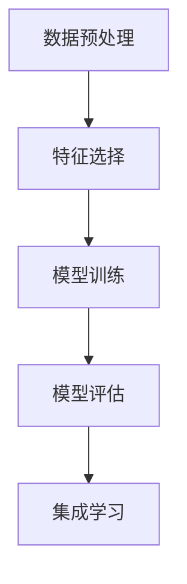

                 

# AI人工智能核心算法原理与代码实例讲解：数据挖掘

> 关键词：数据挖掘,算法原理,代码实例,深度学习,机器学习,数据预处理,特征选择,模型训练,评估指标

## 1. 背景介绍

### 1.1 问题由来

数据挖掘（Data Mining）是人工智能与大数据领域中一个重要的研究方向，旨在从大规模数据中提取有价值的信息和知识。随着互联网技术的发展和数据量的爆炸式增长，数据挖掘在商业决策、金融分析、医疗诊断等领域得到了广泛的应用。数据挖掘技术不仅可以用于发现数据中潜在的模式和规律，还可以用于预测未来趋势，帮助企业决策，优化业务流程，提升客户体验。

然而，数据挖掘不仅仅是简单的数据分析，它需要借助一系列算法和工具来进行有效的数据处理和分析。本文将深入探讨数据挖掘的核心算法原理与代码实现，帮助读者掌握数据挖掘的基本方法和技术。

### 1.2 问题核心关键点

数据挖掘的核心在于如何从大量数据中提取有用的信息。常见的问题包括：

- 数据预处理：包括数据清洗、数据转换、数据归一化等，以减少噪音，提高数据质量。
- 特征选择：选择和提取对模型预测有帮助的特征，以提升模型性能。
- 模型训练：选择合适的算法和模型，对数据进行训练和优化。
- 模型评估：使用合适的评估指标，对模型性能进行评估。

## 2. 核心概念与联系

### 2.1 核心概念概述

为了更好地理解数据挖掘的核心算法原理，本节将介绍几个关键概念及其相互联系：

- 数据预处理（Data Preprocessing）：对原始数据进行清洗、转换和归一化等操作，以减少噪音，提高数据质量。
- 特征选择（Feature Selection）：从原始数据中选择和提取最相关的特征，以提升模型性能。
- 模型训练（Model Training）：使用机器学习或深度学习算法对数据进行训练，生成模型。
- 模型评估（Model Evaluation）：使用合适的评估指标对模型性能进行评估，确保模型的准确性和鲁棒性。
- 集成学习（Ensemble Learning）：通过组合多个模型，提升整体的预测性能。

这些概念之间的逻辑关系可以通过以下Mermaid流程图来展示：



这个流程图展示数据挖掘的核心概念及其之间的关系：

1. 原始数据经过数据预处理后，特征选择可以进一步提升数据质量。
2. 使用模型训练算法，生成模型。
3. 模型评估用于评估模型的性能，确保模型具有较高的准确性和鲁棒性。
4. 集成学习通过组合多个模型，提升整体的预测性能。

## 3. 核心算法原理 & 具体操作步骤

### 3.1 算法原理概述

数据挖掘的核心算法包括：

- 分类（Classification）：将数据划分为不同的类别。
- 回归（Regression）：预测数值型变量的取值。
- 聚类（Clustering）：将数据分为若干个聚类。
- 关联规则学习（Association Rule Learning）：发现数据集中的关联规则。

这些算法通常基于机器学习和深度学习技术，如决策树、随机森林、支持向量机、神经网络等。

### 3.2 算法步骤详解

下面以分类算法为例，详细介绍数据挖掘的核心步骤：

1. 数据预处理：包括数据清洗、数据转换、数据归一化等，以减少噪音，提高数据质量。
2. 特征选择：从原始数据中选择和提取最相关的特征，以提升模型性能。
3. 模型训练：使用机器学习或深度学习算法对数据进行训练，生成模型。
4. 模型评估：使用合适的评估指标对模型性能进行评估，确保模型的准确性和鲁棒性。
5. 模型调优：根据评估结果，调整模型参数，以提升模型性能。
6. 模型应用：将模型应用于实际问题中，进行预测和分析。

### 3.3 算法优缺点

数据挖掘算法的优点包括：

- 能够发现数据中潜在的模式和规律，提升决策水平。
- 适用于大规模数据处理，能够处理海量的数据。
- 可以发现数据中的异常值和噪声，提高数据质量。

其缺点包括：

- 数据挖掘算法通常需要大量计算资源和时间。
- 需要较强的专业知识，对数据质量要求较高。
- 模型的泛化能力可能受到数据集的影响。

### 3.4 算法应用领域

数据挖掘技术在许多领域得到了广泛应用，例如：

- 市场营销：通过分析消费者的购买行为和偏好，进行市场细分和精准营销。
- 金融分析：通过分析金融数据，进行风险评估和投资决策。
- 医疗诊断：通过分析医疗数据，进行疾病诊断和预测。
- 网络安全：通过分析网络数据，进行入侵检测和威胁分析。

## 4. 数学模型和公式 & 详细讲解 & 举例说明

### 4.1 数学模型构建

数据挖掘算法通常基于以下数学模型：

- 线性回归模型：$y = \theta_0 + \theta_1x_1 + \theta_2x_2 + \cdots + \theta_nx_n + \epsilon$，其中$y$为预测值，$x_1, x_2, \cdots, x_n$为特征，$\theta_0, \theta_1, \cdots, \theta_n$为模型参数，$\epsilon$为误差项。
- 逻辑回归模型：$P(y=1|x) = \frac{1}{1 + e^{-\theta_0 - \theta_1x_1 - \theta_2x_2 - \cdots - \theta_nx_n}}$，其中$P(y=1|x)$表示在$x$条件下$y=1$的概率。
- 决策树模型：根据特征值的不同，将数据分为不同的类别，形成树形结构。
- K近邻算法：基于样本之间的距离，找到最近的$k$个邻居，进行分类或回归预测。

### 4.2 公式推导过程

以线性回归模型为例，推导最小二乘法的公式：

设样本集为$D = \{(x_i, y_i)\}_{i=1}^N$，其中$x_i = (x_{i1}, x_{i2}, \cdots, x_{in})$，$y_i$为真实值，$\theta = (\theta_0, \theta_1, \cdots, \theta_n)^T$为模型参数。

最小二乘法的目标是最小化预测值与真实值之间的平方误差：

$$
\sum_{i=1}^N (y_i - \theta_0 - \theta_1x_{i1} - \theta_2x_{i2} - \cdots - \theta_nx_{in})^2
$$

对上述目标函数求导，得到：

$$
\frac{\partial}{\partial \theta} \sum_{i=1}^N (y_i - \theta_0 - \theta_1x_{i1} - \theta_2x_{i2} - \cdots - \theta_nx_{in})^2 = 0
$$

整理得到：

$$
\theta = (X^TX)^{-1}X^Ty
$$

其中$X = [x_{11} x_{12} \cdots x_{1n}]^T, [x_{21} x_{22} \cdots x_{2n}]^T, \cdots, [x_{N1} x_{N2} \cdots x_{Nn}]^T$为样本的特征矩阵。

### 4.3 案例分析与讲解

以K近邻算法为例，说明其原理和应用：

K近邻算法是一种基于样本距离的分类和回归算法。其基本思想是：对于一个新的样本$x$，找到其最近的$k$个邻居，根据邻居的标签或值，对$x$进行分类或回归预测。

假设样本集$D = \{(x_i, y_i)\}_{i=1}^N$，其中$x_i$为特征向量，$y_i$为标签，$k$为邻居数。

对于一个新的样本$x'$，计算其与每个样本$x_i$的距离$d(x', x_i)$，并选择距离$x'$最近的$k$个样本。

假设距离$x'$最近的$k$个样本的标签分别为$y_{i_1}, y_{i_2}, \cdots, y_{i_k}$，则$x'$的预测标签为：

$$
y' = \arg\min_{y \in \{0, 1\}} \sum_{i=1}^k I(y_i = y)
$$

其中$I$为示性函数，当$y_i = y$时，$I = 1$，否则$I = 0$。

K近邻算法的优点包括：

- 算法简单，易于实现。
- 适用于高维数据。

其缺点包括：

- 计算复杂度较高，时间复杂度为$O(kn)$。
- 需要手动设置邻居数$k$，对数据集的分布敏感。

## 5. 项目实践：代码实例和详细解释说明

### 5.1 开发环境搭建

在进行数据挖掘项目实践前，我们需要准备好开发环境。以下是使用Python进行Scikit-Learn开发的环境配置流程：

1. 安装Anaconda：从官网下载并安装Anaconda，用于创建独立的Python环境。

2. 创建并激活虚拟环境：
```bash
conda create -n sklearn-env python=3.8 
conda activate sklearn-env
```

3. 安装Scikit-Learn：
```bash
conda install scikit-learn
```

4. 安装其他相关库：
```bash
pip install pandas numpy matplotlib seaborn jupyter notebook ipython
```

完成上述步骤后，即可在`sklearn-env`环境中开始数据挖掘实践。

### 5.2 源代码详细实现

以下是一个使用Scikit-Learn进行线性回归预测的完整代码实现：

```python
import numpy as np
from sklearn.linear_model import LinearRegression

# 构建样本数据
x = np.array([[1], [2], [3], [4], [5]])
y = np.array([2, 4, 6, 8, 10])

# 创建线性回归模型
model = LinearRegression()

# 训练模型
model.fit(x, y)

# 预测新样本
x_new = np.array([[6]])
y_pred = model.predict(x_new)

print("预测值：", y_pred)
```

这段代码实现了线性回归模型的训练和预测，具体步骤如下：

1. 构建样本数据。
2. 创建线性回归模型。
3. 训练模型。
4. 预测新样本。

### 5.3 代码解读与分析

让我们再详细解读一下关键代码的实现细节：

**线性回归模型训练**：
```python
# 创建线性回归模型
model = LinearRegression()

# 训练模型
model.fit(x, y)
```

**线性回归模型预测**：
```python
# 预测新样本
x_new = np.array([[6]])
y_pred = model.predict(x_new)

print("预测值：", y_pred)
```

可以看到，Scikit-Learn提供了方便的API，使得线性回归模型的实现和训练变得非常简洁。

## 6. 实际应用场景

### 6.1 市场营销

数据挖掘技术可以应用于市场营销的各个环节，例如：

- 客户细分：通过分析客户的购买行为、消费习惯等数据，进行客户分群和画像构建。
- 产品推荐：通过分析用户的历史行为数据，进行个性化推荐，提升用户满意度。
- 市场分析：通过分析市场数据，进行市场细分和预测，优化营销策略。

### 6.2 金融分析

金融领域的数据挖掘应用包括：

- 信用评估：通过分析客户的信用记录和行为数据，进行信用评估和风险控制。
- 股票预测：通过分析股票市场数据，进行股票价格预测和交易策略优化。
- 欺诈检测：通过分析交易数据，进行异常行为检测和欺诈预警。

### 6.3 医疗诊断

医疗数据挖掘的应用包括：

- 疾病诊断：通过分析患者的临床数据，进行疾病诊断和预测。
- 治疗方案优化：通过分析患者的历史治疗数据，进行治疗方案优化和效果评估。
- 药物研发：通过分析药物数据，进行药物筛选和效果评估。

### 6.4 未来应用展望

随着数据挖掘技术的不断发展，其在各行业中的应用前景将更加广阔。未来，数据挖掘技术将在以下几个方面得到进一步应用：

- 智能城市：通过分析城市数据，进行智能交通、环保等领域的优化和预测。
- 农业生产：通过分析农业数据，进行精准农业和农作物病虫害预测。
- 工业制造：通过分析生产数据，进行生产优化和质量控制。

## 7. 工具和资源推荐

### 7.1 学习资源推荐

为了帮助开发者系统掌握数据挖掘的理论基础和实践技巧，这里推荐一些优质的学习资源：

1. 《机器学习》课程：斯坦福大学开设的机器学习课程，涵盖机器学习的基本概念和经典算法，适合初学者。
2. 《Python数据科学手册》书籍：涵盖数据预处理、特征工程、模型训练等数据挖掘的各个环节，适合Python开发者。
3. Kaggle竞赛：Kaggle是一个数据科学竞赛平台，提供了大量的数据集和竞赛题目，可以练习和展示数据挖掘技能。
4. Scikit-Learn官方文档：Scikit-Learn提供了丰富的算法和工具，是数据挖掘实践的必备资料。

通过这些资源的学习实践，相信你一定能够快速掌握数据挖掘的基本方法和技术。

### 7.2 开发工具推荐

高效的开发离不开优秀的工具支持。以下是几款用于数据挖掘开发的常用工具：

1. Jupyter Notebook：用于编写、运行和分享数据挖掘脚本的交互式环境。
2. Python IDEs：如PyCharm、Spyder等，提供了丰富的代码编辑、调试和运行功能。
3. Scikit-Learn：提供了丰富的机器学习算法和工具，是数据挖掘实践的必备库。
4. TensorFlow和PyTorch：提供了强大的深度学习工具和框架，支持大规模数据处理和模型训练。
5. Apache Spark：提供了分布式计算框架，支持大规模数据处理和机器学习算法。

合理利用这些工具，可以显著提升数据挖掘项目的开发效率，加快创新迭代的步伐。

### 7.3 相关论文推荐

数据挖掘技术的发展离不开学界的持续研究。以下是几篇奠基性的相关论文，推荐阅读：

1. "Introduction to Statistical Learning"（《统计学习方法》）：李航著，详细介绍了统计学习的基本理论和算法，是数据挖掘领域的经典教材。
2. "Pattern Recognition and Machine Learning"（《模式识别与机器学习》）：Christopher M. Bishop著，涵盖了机器学习的各个方面，包括数据挖掘、分类、聚类等。
3. "Data Mining: Concepts and Techniques"（《数据挖掘：概念与技术》）：Jianmo Ji和Robert T. Ng著，介绍了数据挖掘的基本概念、算法和技术。
4. "The Elements of Statistical Learning"（《统计学习要素》）：Tibshirani和Friedman著，详细介绍了统计学习的基本理论和算法。

这些论文代表了数据挖掘技术的最新进展，通过学习这些前沿成果，可以帮助研究者把握学科前进方向，激发更多的创新灵感。

## 8. 总结：未来发展趋势与挑战

### 8.1 总结

本文对数据挖掘的核心算法原理与代码实现进行了全面系统的介绍。首先阐述了数据挖掘的研究背景和应用场景，明确了数据挖掘在市场营销、金融分析、医疗诊断等领域的重要作用。其次，从原理到实践，详细讲解了数据挖掘的基本步骤和算法实现，给出了数据挖掘任务的完整代码实例。同时，本文还探讨了数据挖掘算法在各个行业领域的应用前景，展示了数据挖掘技术的广阔应用场景。最后，本文精选了数据挖掘技术的各类学习资源，力求为读者提供全方位的技术指引。

通过本文的系统梳理，可以看到，数据挖掘技术在商业决策、金融分析、医疗诊断等领域具有重要的应用价值，能够提升数据的质量和价值，优化决策过程。未来，随着数据挖掘技术的不断发展，其在更多领域的应用将得到推广和应用，推动经济社会的数字化转型。

### 8.2 未来发展趋势

展望未来，数据挖掘技术将呈现以下几个发展趋势：

1. 数据量将继续增加。随着互联网技术的发展和物联网的普及，数据量将持续增加，数据挖掘技术将面临更多的挑战和机遇。
2. 算法复杂度将进一步提升。随着深度学习和大规模分布式计算的发展，数据挖掘算法将更加复杂，能够处理更加复杂的数据和问题。
3. 数据处理能力将大幅提升。随着硬件计算能力的提升，数据挖掘算法将能够处理更加复杂和庞大的数据集，提升数据挖掘的效果和精度。
4. 自动化程度将提高。随着机器学习自动化工具的发展，数据挖掘将变得更加自动化和智能化，减少人工干预的环节。
5. 跨领域融合将更加深入。数据挖掘技术将与其他领域的技术进行更深入的融合，如自然语言处理、计算机视觉等，提升整体数据挖掘的效果和应用范围。

以上趋势凸显了数据挖掘技术的广阔前景。这些方向的探索发展，必将进一步提升数据挖掘系统的性能和应用范围，为各个行业带来更多的创新和价值。

### 8.3 面临的挑战

尽管数据挖掘技术已经取得了显著的进展，但在迈向更加智能化、普适化应用的过程中，仍面临诸多挑战：

1. 数据质量问题。数据挖掘的效果依赖于数据的质量，存在噪音和缺失值等问题。如何提高数据质量，提升数据的可用性，是数据挖掘面临的重要挑战。
2. 算法复杂度问题。随着数据量和复杂度的增加，数据挖掘算法变得更加复杂，难以进行高效的训练和推理。如何简化算法，提高计算效率，是数据挖掘技术需要解决的问题。
3. 自动化程度问题。数据挖掘技术需要更多的自动化工具和算法，以减少人工干预和错误。如何提升自动化程度，降低人工成本，是数据挖掘技术需要关注的方向。
4. 数据隐私问题。数据挖掘需要大量的数据，如何保护数据隐私，防止数据泄露，是数据挖掘技术需要解决的问题。

这些挑战需要研究者不断探索和解决，才能实现数据挖掘技术的持续进步和发展。

### 8.4 研究展望

面对数据挖掘技术面临的诸多挑战，未来的研究需要在以下几个方面寻求新的突破：

1. 数据预处理和清洗技术。提高数据预处理和清洗的自动化程度，减少人工干预，提升数据质量。
2. 高效的数据挖掘算法。开发更加高效的数据挖掘算法，减少计算时间和资源消耗。
3. 跨领域融合技术。与其他领域的技术进行更深入的融合，提升数据挖掘的效果和应用范围。
4. 自动化工具和平台。开发更多的自动化工具和平台，提升数据挖掘的效率和精度。
5. 数据隐私保护技术。开发更多的数据隐私保护技术，确保数据的安全和隐私。

这些研究方向需要研究者的不断探索和实践，才能实现数据挖掘技术的持续进步和发展。相信随着数据挖掘技术的不断发展，其应用范围和效果将得到更大的提升和扩展。

## 9. 附录：常见问题与解答

**Q1：数据挖掘与机器学习有何区别？**

A: 数据挖掘是机器学习的一个子领域，旨在从大规模数据中发现模式和规律。与传统的统计方法相比，数据挖掘更加注重数据的探索性和可解释性，而机器学习更加注重模型的训练和预测。数据挖掘通常需要更加复杂和多样化的算法，而机器学习则更注重模型的精度和泛化能力。

**Q2：如何选择合适的特征进行特征选择？**

A: 特征选择是数据挖掘中非常重要的一步，可以通过以下方法选择合适的特征：

1. 相关系数法：计算特征与目标变量之间的相关系数，选择相关系数较高的特征。
2. 方差分析法：对特征进行方差分析，选择方差较大的特征。
3. 特征重要性法：通过模型训练，计算特征的重要性，选择重要性较高的特征。
4. 遗传算法：利用遗传算法优化特征选择，选择最优的特征组合。

**Q3：数据预处理包括哪些步骤？**

A: 数据预处理是数据挖掘中非常重要的一步，通常包括以下步骤：

1. 数据清洗：删除缺失值、异常值和噪音数据。
2. 数据转换：进行数据转换，如离散化、归一化和标准化等。
3. 数据归一化：将数据进行归一化处理，使其符合模型训练的要求。
4. 数据降维：通过特征选择和降维技术，减少数据维度，提高模型的训练效率。

**Q4：数据挖掘中常用的算法有哪些？**

A: 数据挖掘中常用的算法包括：

1. 分类算法：如决策树、随机森林、支持向量机等。
2. 回归算法：如线性回归、逻辑回归、岭回归等。
3. 聚类算法：如K-means、层次聚类等。
4. 关联规则学习算法：如Apriori、FP-growth等。

**Q5：数据挖掘的常用评估指标有哪些？**

A: 数据挖掘的常用评估指标包括：

1. 准确率（Accuracy）：正确预测的样本数与总样本数之比。
2. 精确率（Precision）：预测为正类的样本中，真实为正类的样本数与预测为正类的样本数之比。
3. 召回率（Recall）：真实为正类的样本中，预测为正类的样本数与真实为正类的样本数之比。
4. F1分数（F1 Score）：精确率和召回率的调和平均数。
5. AUC（Area Under Curve）：ROC曲线下的面积，用于评估分类模型的性能。

这些指标可以用于评估数据挖掘模型的预测效果，帮助研究者选择最优的模型和算法。

---

作者：禅与计算机程序设计艺术 / Zen and the Art of Computer Programming

