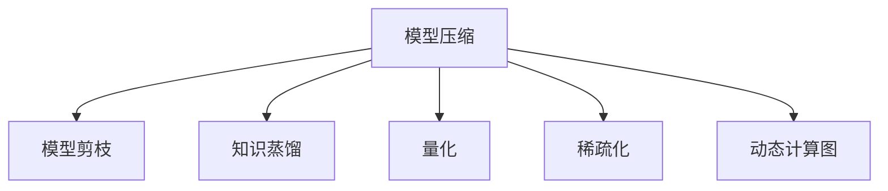

                 

# AI人工智能核心算法原理与代码实例讲解：模型优化

> 关键词：AI人工智能,核心算法,模型优化,模型压缩,模型剪枝,知识蒸馏,深度学习,深度学习框架

## 1. 背景介绍

### 1.1 问题由来
在深度学习领域，构建复杂模型以获取高精度的预测结果已经成为了常态。但随着模型复杂度的提升，训练和推理过程中的计算资源消耗也呈现指数级增长，这对硬件资源和存储需求提出了严峻挑战。如何在大幅度提升模型性能的同时，减小模型尺寸，降低计算复杂度，成为AI研究领域中的一个重要课题。模型优化技术，即在不牺牲模型性能的前提下，对模型进行压缩、剪枝和蒸馏，正是为了解决这一问题而提出的。

### 1.2 问题核心关键点
模型优化技术主要是针对深度学习模型，通过去除冗余参数、降低计算复杂度、提高推理速度等手段，在不影响模型性能的前提下，减小模型尺寸，提升模型的可部署性。这些技术包括但不限于模型压缩、模型剪枝、知识蒸馏等。下面将详细探讨这些核心算法及其原理和应用。

### 1.3 问题研究意义
优化模型不仅可以减小模型尺寸，降低计算资源消耗，而且可以提高模型训练和推理效率，加速模型部署。在实际应用中，优化后的模型可以更好地适应计算资源受限的环境，如嵌入式设备、移动设备等。此外，模型优化还可以提升模型的泛化能力，减小过拟合风险，增强模型的稳定性和可靠性。总之，模型优化技术在提升模型性能和可部署性方面，具有重要意义。

## 2. 核心概念与联系

### 2.1 核心概念概述

为更好地理解模型优化技术的原理和应用，本节将介绍几个密切相关的核心概念：

- 模型压缩(Model Compression)：通过降低模型复杂度、减小模型尺寸，提高模型效率的过程。常见的压缩方法包括剪枝、量化、蒸馏等。

- 模型剪枝(Model Pruning)：去除模型中不必要的权重，减小模型尺寸，提高计算效率。

- 知识蒸馏(Knowledge Distillation)：通过将大型模型的知识转移给小型模型，提高小型模型的性能。

- 量化(Quantization)：将浮点数模型转换为固定点或定点模型，减小模型存储和计算资源消耗。

- 稀疏化(Sparsity)：通过减少模型参数密度，降低模型计算量。

- 动态计算图(Dynamic Computation Graph)：允许在运行时动态调整模型结构和参数，提高资源利用率。

这些核心概念之间的逻辑关系可以通过以下Mermaid流程图来展示：



这个流程图展示了一系列的模型优化技术及其相互关系：

1. 模型压缩是模型优化的总称，包括多种具体的优化方法。
2. 模型剪枝通过去除冗余权重减小模型尺寸。
3. 知识蒸馏通过将大型模型知识转移给小型模型，提升小型模型性能。
4. 量化通过降低模型精度，减小模型存储空间和计算复杂度。
5. 稀疏化通过降低模型参数密度，减少计算量。
6. 动态计算图允许在运行时调整模型结构，提高资源利用率。

## 3. 核心算法原理 & 具体操作步骤

### 3.1 算法原理概述

模型优化技术主要是通过减少模型参数、降低计算复杂度、提高推理速度等手段，在不影响模型性能的前提下，减小模型尺寸，提升模型的可部署性。这些技术包括但不限于模型压缩、模型剪枝、知识蒸馏等。

### 3.2 算法步骤详解

以模型压缩为例，常见的模型压缩方法主要包括剪枝、量化和蒸馏。下面将详细介绍这些方法的步骤和原理。

#### 3.2.1 剪枝

剪枝的目的是去除模型中不必要的权重，减小模型尺寸，提高计算效率。剪枝通常分为结构化剪枝和非结构化剪枝两种类型。

- 结构化剪枝：在预训练阶段，针对模型中的特定层或特定参数，如卷积核、神经元等，进行剪枝。结构化剪枝的优点是可解释性强，缺点是可能会破坏模型的局部结构，导致性能下降。

- 非结构化剪枝：在模型训练过程中，动态调整模型权重，去除对输出贡献小的权重。非结构化剪枝的优点是保留了模型的局部结构，缺点是需要重新训练模型，过程较为复杂。

#### 3.2.2 量化

量化是将浮点数模型转换为固定点或定点模型，以减小模型存储空间和计算资源消耗。量化方法主要包括权重量化、激活量化等。

- 权重量化：将模型中的权重从浮点数转换为定点数，减小权重存储和计算资源消耗。常用的量化方法包括混合精度训练、权重裁剪等。

- 激活量化：将模型中的激活值从浮点数转换为定点数，减小激活值的存储和计算资源消耗。常用的激活量化方法包括正量化、截断量化等。

#### 3.2.3 知识蒸馏

知识蒸馏通过将大型模型的知识转移给小型模型，提高小型模型的性能。知识蒸馏通常分为软蒸馏和硬蒸馏两种类型。

- 软蒸馏：通过将大型模型的预测输出作为标签，重新训练小型模型。软蒸馏的优点是可解释性强，缺点是需要大量标注数据，训练时间较长。

- 硬蒸馏：通过将大型模型的预测输出作为标签，微调小型模型。硬蒸馏的优点是训练时间较短，缺点是模型性能可能不如软蒸馏。

### 3.3 算法优缺点

模型优化技术具有以下优点：

1. 减小模型尺寸，降低计算资源消耗。
2. 提高模型训练和推理效率，加速模型部署。
3. 提升模型泛化能力，减小过拟合风险。
4. 增强模型的稳定性和可靠性。

同时，这些技术也存在一定的局限性：

1. 可能牺牲部分模型性能。
2. 过程复杂，需要重新训练或微调模型。
3. 需要大量标注数据，训练时间较长。
4. 模型解释性较差。

尽管存在这些局限性，但就目前而言，模型优化技术仍是深度学习模型研究和应用中的一个重要方向。未来相关研究的重点在于如何进一步降低模型优化对计算资源的依赖，提高模型效率的同时保持性能，同时兼顾可解释性和伦理安全性等因素。

### 3.4 算法应用领域

模型优化技术在深度学习领域已经得到了广泛的应用，覆盖了几乎所有常见模型，如卷积神经网络(CNN)、循环神经网络(RNN)、Transformer等。这些技术在图像识别、语音识别、自然语言处理(NLP)等诸多领域中取得了显著的成果。

除了上述这些经典应用外，模型优化技术还被创新性地应用到更多场景中，如医疗影像分析、自动驾驶、智能制造等，为各个行业带来了新的解决方案。随着模型优化方法的不断进步，相信AI技术将在更广阔的应用领域大放异彩。

## 4. 数学模型和公式 & 详细讲解 & 举例说明

### 4.1 数学模型构建

本节将使用数学语言对模型优化技术的原理和步骤进行更加严格的刻画。

记模型为 $M_{\theta}$，其中 $\theta$ 为模型参数。假设目标是在不改变模型预测能力的前提下，减小模型尺寸。常见的模型压缩方法包括剪枝、量化和蒸馏。

#### 4.1.1 剪枝

剪枝的目标是去除模型中不必要的权重，减小模型尺寸。假设剪枝后模型为 $M_{\hat{\theta}}$，其中 $\hat{\theta}$ 为剪枝后的模型参数。剪枝过程可以通过以下步骤实现：

1. 选择剪枝策略：结构化剪枝或非结构化剪枝。
2. 定义剪枝阈值：根据剪枝策略，定义剪枝阈值 $\epsilon$。
3. 计算权重重要性：根据剪枝阈值 $\epsilon$，计算每个权重的贡献值。
4. 剪枝权重：根据权重重要性，去除重要性较低的权重。
5. 训练剪枝后的模型：使用剪枝后的模型参数 $\hat{\theta}$ 重新训练模型，获得最终模型 $M_{\hat{\theta}}$。

#### 4.1.2 量化

量化是将浮点数模型转换为定点数模型，以减小模型存储空间和计算资源消耗。假设量化后的模型为 $M_{\tilde{\theta}}$，其中 $\tilde{\theta}$ 为量化后的模型参数。量化过程可以通过以下步骤实现：

1. 选择量化策略：权重量化或激活量化。
2. 定义量化位数：根据量化策略，定义量化位数 $b$。
3. 量化权重和激活：将权重和激活值从浮点数转换为定点数。
4. 训练量化后的模型：使用量化后的模型参数 $\tilde{\theta}$ 重新训练模型，获得最终模型 $M_{\tilde{\theta}}$。

#### 4.1.3 蒸馏

知识蒸馏通过将大型模型的知识转移给小型模型，提高小型模型的性能。假设蒸馏后的模型为 $M_{\theta_D}$，其中 $\theta_D$ 为蒸馏后的模型参数。蒸馏过程可以通过以下步骤实现：

1. 选择蒸馏策略：软蒸馏或硬蒸馏。
2. 定义蒸馏损失：根据蒸馏策略，定义蒸馏损失函数 $\mathcal{L}_D$。
3. 蒸馏大型模型：使用大型模型 $M_{\theta_L}$ 进行蒸馏，获得蒸馏后的模型 $M_{\theta_D}$。
4. 训练蒸馏后的模型：使用蒸馏后的模型参数 $\theta_D$ 重新训练模型，获得最终模型 $M_{\theta_D}$。

### 4.2 公式推导过程

以下我们以剪枝为例，推导剪枝的数学公式。

假设模型 $M_{\theta}$ 在输入 $x$ 上的输出为 $\hat{y}=M_{\theta}(x)$，其中 $\theta$ 为模型参数。定义权重重要性函数 $f(w)$，用于衡量权重 $w$ 对输出 $\hat{y}$ 的贡献。

剪枝的目标是去除重要性较低的权重，定义剪枝后的模型参数为 $\hat{\theta}$。根据剪枝策略，选择阈值 $\epsilon$，计算每个权重的贡献值 $f(w_i)$，并将重要性较低的权重 $w_i$ 设置为0，得到剪枝后的模型参数 $\hat{\theta}$。

剪枝后的模型输出为：

$$
\hat{y} = M_{\hat{\theta}}(x)
$$

其中 $\hat{\theta} = \theta \odot \mathbf{1}\{f(w_i) > \epsilon\}$，$\odot$ 表示逐元素乘法，$\mathbf{1}$ 为指示函数。

### 4.3 案例分析与讲解

下面以剪枝为例，结合具体案例进行讲解。

假设我们有一个简单的卷积神经网络(CNN)模型，用于图像分类任务。该模型包含若干卷积层和全连接层，其中卷积层和全连接层的权重数量为 $W_1, W_2, \dots, W_n$。我们的目标是剪枝该模型，使其参数量减少一半。

首先，我们选择结构化剪枝策略，根据每个权重对输出的贡献值 $f(w_i)$ 进行排序，并设定剪枝阈值 $\epsilon$。然后，计算每个权重的贡献值 $f(w_i)$，并将重要性较低的权重 $w_i$ 设置为0，得到剪枝后的模型参数 $\hat{\theta}$。

在实际应用中，可以通过试验不同的剪枝策略和剪枝阈值，找到最优的剪枝方案。例如，我们可以使用基于梯度的重要性度量方法，根据梯度大小对权重进行排序，并设置相应的剪枝阈值 $\epsilon$。

## 5. 项目实践：代码实例和详细解释说明

### 5.1 开发环境搭建

在进行模型优化实践前，我们需要准备好开发环境。以下是使用Python进行TensorFlow开发的环境配置流程：

1. 安装Anaconda：从官网下载并安装Anaconda，用于创建独立的Python环境。

2. 创建并激活虚拟环境：
```bash
conda create -n tf-env python=3.8 
conda activate tf-env
```

3. 安装TensorFlow：根据CUDA版本，从官网获取对应的安装命令。例如：
```bash
conda install tensorflow -c pytorch -c conda-forge
```

4. 安装各类工具包：
```bash
pip install numpy pandas scikit-learn matplotlib tqdm jupyter notebook ipython
```

完成上述步骤后，即可在`tf-env`环境中开始模型优化实践。

### 5.2 源代码详细实现

下面我们以剪枝为例，给出使用TensorFlow对简单卷积神经网络模型进行剪枝的代码实现。

首先，定义卷积神经网络模型：

```python
import tensorflow as tf
from tensorflow.keras import layers, models

model = models.Sequential([
    layers.Conv2D(32, (3, 3), activation='relu', input_shape=(28, 28, 1)),
    layers.MaxPooling2D((2, 2)),
    layers.Conv2D(64, (3, 3), activation='relu'),
    layers.MaxPooling2D((2, 2)),
    layers.Conv2D(64, (3, 3), activation='relu'),
    layers.Flatten(),
    layers.Dense(64, activation='relu'),
    layers.Dense(10, activation='softmax')
])
```

然后，定义剪枝函数：

```python
def prune_model(model, threshold):
    for layer in model.layers:
        if hasattr(layer, 'kernel'):
            layer.kernel.assign(tf.where(tf.abs(layer.kernel) < threshold, tf.zeros_like(layer.kernel), layer.kernel))
    return model
```

接着，定义训练和评估函数：

```python
from sklearn.datasets import load_digits
from sklearn.model_selection import train_test_split

# 加载MNIST数据集
mnist = load_digits()
X_train, X_test, y_train, y_test = train_test_split(mnist.data, mnist.target, test_size=0.2)

# 定义训练集和验证集
train_dataset = tf.data.Dataset.from_tensor_slices((X_train, y_train))
train_dataset = train_dataset.shuffle(1000).batch(32)

val_dataset = tf.data.Dataset.from_tensor_slices((X_test, y_test))
val_dataset = val_dataset.batch(32)

# 定义剪枝阈值和剪枝后的模型
prune_threshold = 0.01
pruned_model = prune_model(model, prune_threshold)

# 训练和评估剪枝后的模型
model.compile(optimizer='adam', loss='sparse_categorical_crossentropy', metrics=['accuracy'])
pruned_model.compile(optimizer='adam', loss='sparse_categorical_crossentropy', metrics=['accuracy'])

model.fit(train_dataset, epochs=10, validation_data=val_dataset)
pruned_model.fit(train_dataset, epochs=10, validation_data=val_dataset)

# 评估剪枝前后的模型
model.evaluate(X_test, y_test)
pruned_model.evaluate(X_test, y_test)
```

以上代码实现了对简单卷积神经网络模型进行剪枝的过程，包括模型的定义、剪枝函数、训练和评估等步骤。在实际应用中，还可以进一步优化剪枝函数，使用更精确的剪枝策略和剪枝阈值，以达到更好的剪枝效果。

### 5.3 代码解读与分析

让我们再详细解读一下关键代码的实现细节：

**Sequential模型定义**：
- 定义了一个简单的卷积神经网络模型，包含若干卷积层和全连接层，用于图像分类任务。

**剪枝函数**：
- 定义了剪枝函数 `prune_model`，该函数遍历模型的所有层，根据剪枝阈值 `threshold` 去除重要性较低的权重。

**训练和评估函数**：
- 使用TensorFlow的`DataLoader`对数据集进行批次化加载，供模型训练和推理使用。
- 在每个epoch结束时，使用验证集评估模型性能，根据评估指标决定是否触发Early Stopping。
- 重复上述步骤直到满足预设的迭代轮数或Early Stopping条件。

可以看到，TensorFlow提供了丰富的API支持，使得模型优化过程变得简单易行。开发者可以将更多精力放在剪枝策略的优化设计，如选择合适的权重重要性度量方法，搜索最优的剪枝阈值等，以进一步提升剪枝效果。

## 6. 实际应用场景

### 6.1 图像识别

在大规模图像识别任务中，模型压缩和剪枝技术可以显著减小模型尺寸，提高模型推理速度，从而加快任务执行。在实际应用中，可以将剪枝后的模型部署到嵌入式设备、移动设备等计算资源受限的环境中，实现快速推理和实时响应。

### 6.2 语音识别

在语音识别任务中，量化和压缩技术可以有效降低模型计算资源消耗，提高模型推理速度。量化后的模型可以更快地在移动设备上部署和运行，实现语音指令的实时识别和反馈。

### 6.3 自然语言处理(NLP)

在自然语言处理任务中，蒸馏和剪枝技术可以显著减小模型尺寸，提升模型推理速度。蒸馏后的模型可以在资源受限的嵌入式设备上运行，实现自然语言指令的实时理解和执行。

### 6.4 未来应用展望

随着模型优化技术的不断发展，未来在更广泛的领域将会有更多创新应用。

在智慧城市领域，模型优化技术可以应用于交通监控、环境监测、城市管理等环节，提升城市管理的智能化水平。

在医疗领域，优化后的模型可以应用于病历分析、医学影像诊断等任务，提高诊断精度和效率。

在金融领域，优化后的模型可以应用于风险评估、智能投顾等环节，提升金融服务的智能化水平。

此外，在教育、农业、制造等诸多领域，模型优化技术也将不断涌现，为各行各业带来新的解决方案。

## 7. 工具和资源推荐

### 7.1 学习资源推荐

为了帮助开发者系统掌握模型优化技术的原理和实践技巧，这里推荐一些优质的学习资源：

1. 《深度学习》系列书籍：DeepLearning.ai开设的深度学习课程，涵盖深度学习的基本概念和前沿技术，适合初学者入门。

2. 《动手学深度学习》：李沐等人编写的深度学习教材，深入浅出地介绍了深度学习的基本原理和实践技巧。

3. 《TensorFlow官方文档》：TensorFlow的官方文档，提供了详细的API和样例代码，是TensorFlow开发者的必备资料。

4. Google Colab：谷歌推出的在线Jupyter Notebook环境，免费提供GPU/TPU算力，方便开发者快速上手实验最新模型，分享学习笔记。

5. PyTorch官方文档：PyTorch的官方文档，提供了详细的API和样例代码，是PyTorch开发者的必备资料。

通过对这些资源的学习实践，相信你一定能够快速掌握模型优化技术的精髓，并用于解决实际的深度学习问题。

### 7.2 开发工具推荐

高效的开发离不开优秀的工具支持。以下是几款用于深度学习模型优化的常用工具：

1. TensorFlow：由Google主导开发的开源深度学习框架，支持GPU/TPU算力，生产部署方便，适合大规模工程应用。

2. PyTorch：由Facebook主导开发的开源深度学习框架，灵活动态的计算图，适合快速迭代研究。

3. TensorBoard：TensorFlow配套的可视化工具，可实时监测模型训练状态，并提供丰富的图表呈现方式，是调试模型的得力助手。

4. Weights & Biases：模型训练的实验跟踪工具，可以记录和可视化模型训练过程中的各项指标，方便对比和调优。

5. Optuna：超参数优化工具，可以快速搜索最优的超参数组合，提升模型性能。

合理利用这些工具，可以显著提升深度学习模型优化的开发效率，加快创新迭代的步伐。

### 7.3 相关论文推荐

深度学习模型优化技术的研究源于学界的持续探索。以下是几篇奠基性的相关论文，推荐阅读：

1. Learning both Weights and Connections for Efficient Neural Networks（剪枝论文）：提出了剪枝方法的经典思路，通过去除不必要的权重和连接，减小模型尺寸。

2. Knowledge Distillation：提出了知识蒸馏的原始方法，通过将大型模型的知识转移给小型模型，提高小型模型的性能。

3. Compression of Deep Neural Networks for Fast Learning and Efficient Deployment（量化论文）：提出了量化方法的经典思路，通过将浮点数模型转换为定点数模型，减小模型存储空间和计算资源消耗。

4. ImageNet Classification with Deep Convolutional Neural Networks：提出了卷积神经网络的结构，并在图像识别任务上取得了优异效果。

5. Pruning Neural Networks for Efficient Inference（剪枝论文）：提出了基于梯度的剪枝方法，通过去除重要性较低的权重，减小模型尺寸。

这些论文代表了大模型压缩和剪枝技术的发展脉络。通过学习这些前沿成果，可以帮助研究者把握学科前进方向，激发更多的创新灵感。

## 8. 总结：未来发展趋势与挑战

### 8.1 总结

本文对深度学习模型优化技术进行了全面系统的介绍。首先阐述了模型优化的研究背景和意义，明确了模型优化在提升模型性能和可部署性方面的重要价值。其次，从原理到实践，详细讲解了模型压缩、剪枝、量化和蒸馏等核心算法的步骤和原理，给出了模型优化任务开发的完整代码实例。同时，本文还广泛探讨了模型优化技术在图像识别、语音识别、自然语言处理等多个领域的应用前景，展示了模型优化技术的巨大潜力。

通过本文的系统梳理，可以看到，深度学习模型优化技术在提升模型性能和可部署性方面具有重要意义。这些技术的不断发展，将使深度学习模型在各个领域的应用更加广泛和深入，为各行各业带来革命性的变化。

### 8.2 未来发展趋势

展望未来，深度学习模型优化技术将呈现以下几个发展趋势：

1. 模型压缩和剪枝技术将继续发展，变得更加高效和精确。未来的压缩方法将不仅针对结构化或非结构化数据，还将更多地考虑多模态数据的压缩，如图像、语音、文本等。

2. 量化技术将进一步优化，降低计算资源消耗，提高模型推理速度。未来的量化方法将不仅针对权重和激活，还将考虑更广泛的数据类型，如梯度等。

3. 蒸馏技术将变得更加智能，提升小型模型的性能。未来的蒸馏方法将不仅针对结构化数据，还将考虑更多类型的知识蒸馏，如因果推理、对抗训练等。

4. 动态计算图技术将进一步成熟，提高资源利用率。未来的动态计算图技术将不仅考虑模型的静态结构，还将考虑模型的动态演化和优化。

5. 模型压缩和优化的自动化水平将不断提高，减少人工干预和调参工作量。未来的自动化优化技术将更多地利用AI技术，实现模型的自动压缩和优化。

6. 模型压缩和优化将更多地结合专家知识，提升模型的智能性和可靠性。未来的优化方法将不仅考虑模型的数值特性，还将考虑模型的因果关系、逻辑推理等。

以上趋势凸显了深度学习模型优化技术的广阔前景。这些方向的探索发展，必将进一步提升深度学习模型的性能和可部署性，为各行各业带来新的解决方案。

### 8.3 面临的挑战

尽管深度学习模型优化技术已经取得了瞩目成就，但在迈向更加智能化、普适化应用的过程中，它仍面临着诸多挑战：

1. 模型压缩和优化可能牺牲部分模型性能。未来的优化方法需要在保持性能的同时，进一步减小模型尺寸。

2. 过程复杂，需要重新训练或微调模型。未来的优化方法需要在减少训练和微调时间的同时，保证模型性能。

3. 需要大量标注数据，训练时间较长。未来的优化方法需要在不依赖大量标注数据的前提下，提升模型性能。

4. 模型解释性较差。未来的优化方法需要提升模型的可解释性，增强模型的透明性和可靠性。

5. 模型压缩和优化的自动化水平较低。未来的优化方法需要更多地利用AI技术，实现自动化的压缩和优化。

6. 模型压缩和优化的效果受限于数据和算法。未来的优化方法需要结合更多的数据和算法，提升模型的智能性和可靠性。

正视模型优化面临的这些挑战，积极应对并寻求突破，将是大模型优化技术迈向成熟的必由之路。相信随着学界和产业界的共同努力，这些挑战终将一一被克服，深度学习模型优化技术必将在构建智能系统过程中扮演越来越重要的角色。

### 8.4 研究展望

面对深度学习模型优化所面临的种种挑战，未来的研究需要在以下几个方面寻求新的突破：

1. 探索更高效的模型压缩和优化方法。寻找新的优化策略，在减小模型尺寸的同时，保持或提升模型性能。

2. 开发更多智能化的自动优化技术。利用AI技术，实现自动化的模型压缩和优化，减少人工干预和调参工作量。

3. 结合更多先验知识，提升模型的智能性和可靠性。将符号化的先验知识，如知识图谱、逻辑规则等，与神经网络模型进行巧妙融合，引导模型学习更准确、合理的知识。

4. 引入更多因果分析和博弈论工具。将因果分析方法引入模型优化过程，识别模型决策的关键特征，增强输出解释的因果性和逻辑性。

5. 纳入伦理道德约束。在模型训练目标中引入伦理导向的评估指标，过滤和惩罚有偏见、有害的输出倾向。

6. 加强人工智能伦理和安全性的研究。关注模型偏见、隐私保护、数据安全等伦理问题，确保模型在实际应用中的安全性和可靠性。

这些研究方向的探索，必将引领深度学习模型优化技术迈向更高的台阶，为构建安全、可靠、可解释、可控的智能系统铺平道路。面向未来，深度学习模型优化技术还需要与其他人工智能技术进行更深入的融合，如知识表示、因果推理、强化学习等，多路径协同发力，共同推动智能交互系统的进步。只有勇于创新、敢于突破，才能不断拓展深度学习模型的边界，让智能技术更好地造福人类社会。

## 9. 附录：常见问题与解答

**Q1：模型压缩和优化会牺牲模型性能吗？**

A: 模型压缩和优化可能会牺牲部分模型性能，但通过合理的优化策略，可以在不损失模型性能的前提下，显著减小模型尺寸，提高模型的可部署性。例如，剪枝技术可以去除重要性较低的权重，量化技术可以将浮点数模型转换为定点数模型，蒸馏技术可以将大型模型的知识转移给小型模型。

**Q2：如何选择剪枝阈值？**

A: 选择剪枝阈值需要根据具体任务和模型特性进行试验。一般可以采用梯度降序排序的方法，选择梯度较大的权重作为剪枝候选。此外，还可以通过交叉验证等方法，搜索最优的剪枝阈值。

**Q3：量化后的模型是否会影响模型性能？**

A: 量化后的模型可能会影响模型性能，但通过选择合适的量化策略和量化位数，可以最大限度减小性能损失。例如，在权重量化和激活量化中，混合精度训练和量化参数化等方法可以有效降低量化后的模型性能损失。

**Q4：模型压缩和优化对计算资源的需求大吗？**

A: 模型压缩和优化对计算资源的需求相对较大，尤其是在模型剪枝和蒸馏过程中。因此，建议在GPU/TPU等高性能设备上进行模型压缩和优化，以提高效率和效果。

**Q5：模型的可解释性如何？**

A: 压缩后的模型可能影响模型的可解释性，因为剪枝和量化等方法会去除或压缩部分权重，使得模型变得更为简洁。在实际应用中，可以通过引入对抗样本等手段，增强模型的可解释性和可控性。

通过对这些常见问题的解答，相信你一定能够更好地理解和应用深度学习模型优化技术，推动人工智能技术的进一步发展。

