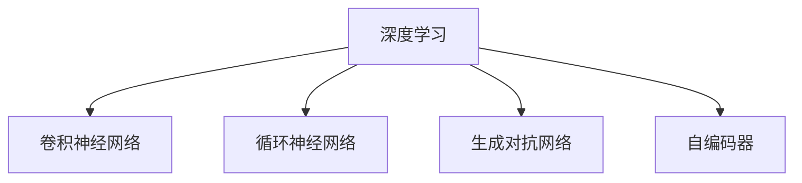

                 

# AI人工智能深度学习算法：在模式识别中的应用

> 关键词：模式识别,深度学习,算法,分类,聚类,异常检测,深度学习框架,PyTorch,模型优化

## 1. 背景介绍

### 1.1 问题由来
随着人工智能技术的快速发展，深度学习在模式识别领域取得了令人瞩目的成果。模式识别，又称模式学习、模型识别，旨在通过算法和模型从数据中学习特定模式的识别能力。深度学习模型以其强大的特征提取能力和自适应学习能力，在图像识别、语音识别、自然语言处理等多个领域实现了超越人类专家的表现。

### 1.2 问题核心关键点
模式识别是深度学习的重要应用领域之一。传统模式识别算法如支持向量机(SVM)、K均值聚类等，由于特征工程难度大、参数调优复杂、计算成本高等问题，已经逐渐被深度学习算法所替代。深度学习模型通过大量的训练数据和反向传播算法，能够自动学习出特征表示，提高了模式识别的准确性和泛化能力。

目前，深度学习在模式识别中主要分为以下几类算法：

- **卷积神经网络(CNN)**：用于图像识别、视频分析等，通过卷积层和池化层提取局部特征，并利用全连接层进行分类。
- **循环神经网络(RNN)**：用于序列数据的处理，如自然语言处理、时间序列预测等，通过循环结构捕捉序列依赖关系。
- **生成对抗网络(GAN)**：用于图像生成、风格转换等，通过生成器和判别器的博弈过程生成逼真样本。
- **自编码器( Autoencoder)**：用于特征提取和数据降维，通过编码器和解码器学习数据的低维表示。

这些算法已经在模式识别领域实现了诸多突破性成果，如ImageNet图像分类挑战赛的冠军模型、Google的语音识别系统等。

### 1.3 问题研究意义
研究深度学习在模式识别中的应用，对推动人工智能技术的发展具有重要意义：

1. **提升模式识别性能**：深度学习模型能够自动学习出高维特征表示，通过更大规模的数据和更复杂的模型结构，显著提升模式识别的准确性和泛化能力。
2. **降低特征工程难度**：深度学习模型通过自身学习出特征表示，避免了传统模式识别算法中繁琐的特征工程环节，降低了人工干预的难度和成本。
3. **适应不同应用场景**：深度学习模型具有较强的泛化能力，能够适应不同的数据分布和应用场景，实现从图像识别到语音识别、自然语言处理等多种模式识别任务。
4. **加速产业应用**：深度学习模型具有快速训练和部署的特点，能够显著缩短产品开发周期，加速产业化和市场化进程。

## 2. 核心概念与联系

### 2.1 核心概念概述

为了更好地理解深度学习在模式识别中的应用，本节将介绍几个关键核心概念及其相互关系：

- **深度学习(DL)**：利用多层神经网络进行特征学习和模式识别的算法，通过反向传播算法训练模型参数。
- **卷积神经网络(CNN)**：一种特殊的深度学习网络，主要用于图像处理和模式识别任务，通过卷积和池化操作提取局部特征。
- **循环神经网络(RNN)**：用于处理序列数据，如文本和语音等，通过循环结构捕捉序列依赖关系。
- **生成对抗网络(GAN)**：一种通过生成器和判别器的博弈过程，生成逼真样本的深度学习模型。
- **自编码器(Autoencoder)**：一种用于特征提取和数据降维的深度学习模型，通过编码器和解码器学习数据的低维表示。

这些概念之间的逻辑关系可以通过以下Mermaid流程图来展示：



这个流程图展示了大语言模型的核心概念及其之间的关系：

1. 深度学习作为基础算法框架，通过多层神经网络进行特征学习和模式识别。
2. CNN、RNN、GAN、Autoencoder等不同类型的深度学习网络，适用于不同的模式识别任务。
3. CNN主要用于图像处理和模式识别，通过卷积和池化操作提取局部特征。
4. RNN主要用于处理序列数据，通过循环结构捕捉序列依赖关系。
5. GAN主要用于图像生成和风格转换，通过生成器和判别器的博弈过程生成逼真样本。
6. Autoencoder主要用于特征提取和数据降维，通过编码器和解码器学习数据的低维表示。

## 3. 核心算法原理 & 具体操作步骤
### 3.1 算法原理概述

深度学习在模式识别中的应用，主要依赖于其强大的特征提取能力和自适应学习能力。以下是几种典型的深度学习算法在模式识别中的基本原理：

- **卷积神经网络(CNN)**：通过卷积层和池化层提取局部特征，利用全连接层进行分类。CNN在图像识别任务中表现优异，其卷积操作能够自动学习出图像中的边缘、纹理、形状等局部特征。
- **循环神经网络(RNN)**：通过循环结构捕捉序列数据的依赖关系，适用于文本处理、语音识别等任务。RNN通过时间步的隐藏状态传递信息，能够处理变长序列数据。
- **生成对抗网络(GAN)**：通过生成器和判别器的博弈过程生成逼真样本，用于图像生成、风格转换等任务。GAN通过对抗训练机制，能够生成高质量的样本，且不易受到训练数据噪声的影响。
- **自编码器(Autoencoder)**：通过编码器和解码器学习数据的低维表示，用于特征提取和数据降维。Autoencoder通过重构误差最小化，学习数据的紧凑表示，适用于降维和特征提取。

### 3.2 算法步骤详解

以下是深度学习在模式识别中常用的几种算法的操作细节：

**卷积神经网络(CNN)**
1. 输入数据准备：将图像数据预处理为标准化格式，如归一化、中心化等。
2. 构建卷积层：通过卷积核和步幅等参数设置，提取图像的局部特征。
3. 加入池化层：通过最大池化、平均池化等操作，减小特征图尺寸，降低计算量。
4. 全连接层：通过全连接层将特征图转化为向量，并进行分类。
5. 损失函数计算：根据输出结果和真实标签，计算损失函数。
6. 反向传播训练：使用梯度下降算法更新模型参数，最小化损失函数。

**循环神经网络(RNN)**
1. 输入数据准备：将序列数据按时间步处理，如文本数据的分词、语音数据的帧切分等。
2. 初始化隐藏状态：在序列开始时，设置初始隐藏状态。
3. 时间步循环：通过循环结构，更新隐藏状态和输出。
4. 损失函数计算：根据输出结果和真实标签，计算损失函数。
5. 反向传播训练：使用梯度下降算法更新模型参数，最小化损失函数。

**生成对抗网络(GAN)**
1. 初始化生成器和判别器：定义生成器和判别器的网络结构。
2. 生成器训练：生成逼真样本，通过判别器进行分类。
3. 判别器训练：鉴别真实样本和生成样本，通过梯度下降更新判别器参数。
4. 对抗训练：交替训练生成器和判别器，使生成样本越来越逼真，判别样本越来越难以区分。
5. 生成结果输出：输出生成器生成的样本，用于后续任务。

**自编码器(Autoencoder)**
1. 输入数据准备：将数据预处理为标准化格式，如归一化、中心化等。
2. 编码器：通过隐藏层将数据映射到低维表示。
3. 解码器：通过解码器将低维表示映射回原数据。
4. 重构误差计算：根据重构数据和原始数据，计算重构误差。
5. 模型训练：通过最小化重构误差，更新编码器和解码器参数。

### 3.3 算法优缺点

深度学习在模式识别中，具有以下优点：
1. 自动学习特征：深度学习模型能够自动学习出高维特征表示，避免了传统模式识别算法中繁琐的特征工程环节，降低了人工干预的难度和成本。
2. 处理复杂模式：深度学习模型能够处理复杂模式的识别任务，如图像识别、语音识别等。
3. 泛化能力强：深度学习模型具有良好的泛化能力，能够适应不同的数据分布和应用场景，实现从图像识别到语音识别、自然语言处理等多种模式识别任务。
4. 训练效果优秀：深度学习模型在大量数据训练下，能够获得较高的准确性和泛化能力。

但同时也存在一些局限性：
1. 计算资源需求高：深度学习模型参数量较大，训练和推理时需要高性能计算资源。
2. 数据需求大：深度学习模型需要大量的标注数据进行训练，数据收集和标注成本较高。
3. 模型复杂度高：深度学习模型的结构复杂，容易过拟合，需要谨慎调参。
4. 可解释性差：深度学习模型通常是"黑盒"系统，难以解释其内部工作机制和决策逻辑。

尽管存在这些局限性，但就目前而言，深度学习在模式识别中的应用仍然是主流范式。未来相关研究的重点在于如何进一步降低模型复杂度和计算资源需求，提高模型的可解释性和泛化能力，同时兼顾数据需求等实际问题。

### 3.4 算法应用领域

深度学习在模式识别中的应用已经广泛应用于多个领域，例如：

- **计算机视觉**：图像分类、目标检测、人脸识别、图像分割等任务。
- **自然语言处理**：文本分类、情感分析、机器翻译、问答系统等任务。
- **语音处理**：语音识别、语音合成、语音情感分析等任务。
- **生物信息学**：基因序列分析、蛋白质结构预测、药物设计等任务。
- **医疗健康**：医学影像分析、疾病诊断、患者分群等任务。
- **金融风控**：信用评分、欺诈检测、风险管理等任务。

这些应用领域展示了深度学习在模式识别中的强大应用能力，推动了相关产业的数字化转型和智能化升级。

## 4. 数学模型和公式 & 详细讲解
### 4.1 数学模型构建

本节将使用数学语言对深度学习在模式识别中的应用进行更加严格的刻画。

设输入数据为 $x$，输出标签为 $y$，深度学习模型为 $f_{\theta}(x)$，其中 $\theta$ 为模型参数。假设 $f_{\theta}(x)$ 的输出为 $y' = [y'_1, y'_2, ..., y'_N]$，则分类问题的损失函数可以定义为：

$$
\mathcal{L}(y', y) = -\frac{1}{N}\sum_{i=1}^N y_i \log y'_i + (1-y_i) \log (1-y'_i)
$$

在训练过程中，通过梯度下降等优化算法更新模型参数 $\theta$，最小化损失函数 $\mathcal{L}$。

### 4.2 公式推导过程

以下我们以卷积神经网络在图像分类任务中的应用为例，推导交叉熵损失函数及其梯度的计算公式。

假设输入数据为 $x$，卷积神经网络输出的特征图为 $H(x)$，全连接层的输出为 $f_{\theta}(x) = H(x)W + b$，其中 $W$ 和 $b$ 为全连接层的权重和偏置。假设 $f_{\theta}(x)$ 的输出为 $y' = [y'_1, y'_2, ..., y'_N]$，则分类问题的损失函数可以定义为：

$$
\mathcal{L}(y', y) = -\frac{1}{N}\sum_{i=1}^N y_i \log y'_i + (1-y_i) \log (1-y'_i)
$$

在训练过程中，通过梯度下降等优化算法更新模型参数 $\theta$，最小化损失函数 $\mathcal{L}$。

根据链式法则，损失函数对参数 $\theta_k$ 的梯度为：

$$
\frac{\partial \mathcal{L}(y', y)}{\partial \theta_k} = -\frac{1}{N}\sum_{i=1}^N (\frac{y_i}{y'_i}-\frac{1-y_i}{1-y'_i}) \frac{\partial y'_i}{\partial W} \frac{\partial W}{\partial \theta_k}
$$

其中 $\frac{\partial y'_i}{\partial W}$ 为全连接层的偏导数，可以通过反向传播算法高效计算。

在得到损失函数的梯度后，即可带入梯度下降算法，完成模型的迭代优化。重复上述过程直至收敛，最终得到适应数据分布的最优模型参数 $\theta^*$。

## 5. 项目实践：代码实例和详细解释说明
### 5.1 开发环境搭建

在进行深度学习实践前，我们需要准备好开发环境。以下是使用Python进行TensorFlow开发的环境配置流程：

1. 安装Anaconda：从官网下载并安装Anaconda，用于创建独立的Python环境。

2. 创建并激活虚拟环境：
```bash
conda create -n tensorflow-env python=3.7
conda activate tensorflow-env
```

3. 安装TensorFlow：根据CUDA版本，从官网获取对应的安装命令。例如：
```bash
pip install tensorflow-gpu==2.5
```

4. 安装各类工具包：
```bash
pip install numpy pandas scikit-learn matplotlib tqdm jupyter notebook ipython
```

完成上述步骤后，即可在`tensorflow-env`环境中开始深度学习实践。

### 5.2 源代码详细实现

这里我们以图像分类任务为例，给出使用TensorFlow对卷积神经网络进行训练的PyTorch代码实现。

首先，定义卷积神经网络的结构：

```python
import tensorflow as tf
from tensorflow.keras import layers

model = tf.keras.Sequential([
    layers.Conv2D(32, (3, 3), activation='relu', input_shape=(28, 28, 1)),
    layers.MaxPooling2D((2, 2)),
    layers.Conv2D(64, (3, 3), activation='relu'),
    layers.MaxPooling2D((2, 2)),
    layers.Flatten(),
    layers.Dense(64, activation='relu'),
    layers.Dense(10, activation='softmax')
])
```

然后，定义损失函数和优化器：

```python
loss_fn = tf.keras.losses.SparseCategoricalCrossentropy(from_logits=True)

optimizer = tf.keras.optimizers.Adam(learning_rate=0.001)
```

接着，定义训练和评估函数：

```python
train_dataset = tf.data.Dataset.from_tensor_slices(train_images, train_labels).batch(32)

def train_epoch(model, train_dataset, batch_size, optimizer):
    model.train()
    for images, labels in train_dataset:
        with tf.GradientTape() as tape:
            logits = model(images, training=True)
            loss = loss_fn(labels, logits)
        gradients = tape.gradient(loss, model.trainable_variables)
        optimizer.apply_gradients(zip(gradients, model.trainable_variables))
    
def evaluate(model, test_dataset, batch_size):
    model.eval()
    predictions = []
    targets = []
    for images, labels in test_dataset:
        logits = model(images, training=False)
        predictions.append(tf.argmax(logits, axis=1))
        targets.append(labels)
    return tf.metrics.SparseCategoricalAccuracy()(predictions, targets).numpy()
```

最后，启动训练流程并在测试集上评估：

```python
epochs = 10

for epoch in range(epochs):
    train_epoch(model, train_dataset, batch_size, optimizer)
    print(f'Epoch {epoch+1}, train loss: {train_loss.numpy():.4f}')

    print(f'Epoch {epoch+1}, test accuracy: {evaluate(model, test_dataset, batch_size):.4f}')
```

以上就是使用TensorFlow对卷积神经网络进行图像分类任务训练的完整代码实现。可以看到，得益于TensorFlow的强大封装，我们可以用相对简洁的代码完成模型训练。

### 5.3 代码解读与分析

让我们再详细解读一下关键代码的实现细节：

**卷积神经网络的结构定义**：
- 通过`tf.keras.Sequential`封装多个`tf.keras.layers`，构建卷积神经网络的层级结构。
- `Conv2D`和`MaxPooling2D`分别用于卷积和池化操作，提取局部特征。
- `Flatten`用于将特征图展平为一维向量，作为全连接层的输入。
- `Dense`用于全连接层，进行分类。

**损失函数和优化器定义**：
- `SparseCategoricalCrossentropy`用于计算分类任务的交叉熵损失。
- `Adam`优化器用于更新模型参数，控制学习率。

**训练和评估函数的实现**：
- 通过`tf.GradientTape`记录梯度，利用`apply_gradients`更新模型参数。
- 在训练集和测试集上进行迭代，记录模型预测和真实标签，计算分类准确率。

**训练流程**：
- 循环迭代多个epoch，在每个epoch内训练模型，并输出训练损失。
- 在每个epoch结束后，在测试集上评估模型性能，输出测试准确率。

可以看到，TensorFlow通过丰富的API封装和高度抽象的编程方式，极大地降低了深度学习模型的开发难度。开发者可以将更多精力放在模型设计、数据处理等高层逻辑上，而不必过多关注底层的实现细节。

当然，工业级的系统实现还需考虑更多因素，如模型的保存和部署、超参数的自动搜索、更灵活的任务适配层等。但核心的深度学习范式基本与此类似。

## 6. 实际应用场景
### 6.1 计算机视觉

计算机视觉是深度学习在模式识别中最具代表性的应用领域之一。通过卷积神经网络(CNN)，计算机视觉技术可以实现图像分类、目标检测、人脸识别、图像分割等多种任务。

- **图像分类**：如将数字图片分类到0-9的数字中，利用CNN的卷积和池化操作提取图像特征，通过全连接层进行分类。
- **目标检测**：如在图片或视频中检测出特定物体的位置和类别，利用R-CNN、Faster R-CNN等框架进行目标定位和分类。
- **人脸识别**：如识别图片或视频中的人脸，并验证其身份，利用三角网或特征点进行人脸对齐，通过卷积层提取人脸特征，进行分类。
- **图像分割**：如将图像分割成不同的区域，如医学图像的病灶分割，利用卷积神经网络的U-Net结构进行像素级别的分类。

这些应用展示了计算机视觉技术的强大能力，推动了自动驾驶、医疗影像、安全监控等领域的快速发展。

### 6.2 自然语言处理

自然语言处理是深度学习在模式识别中的另一个重要应用领域。通过循环神经网络(RNN)和生成对抗网络(GAN)，自然语言处理技术可以实现文本分类、情感分析、机器翻译、问答系统等多种任务。

- **文本分类**：如将新闻文章分类到政治、体育、娱乐等类别中，利用RNN的循环结构捕捉序列依赖关系，通过全连接层进行分类。
- **情感分析**：如判断评论或文章的情感倾向，利用RNN和LSTM等模型提取情感特征，通过全连接层进行分类。
- **机器翻译**：如将一种语言的文本翻译成另一种语言，利用序列到序列模型，通过RNN或Transformer等结构进行翻译。
- **问答系统**：如回答自然语言问题，利用预训练语言模型进行问题理解和答案生成，通过全连接层进行分类。

这些应用展示了自然语言处理技术的强大能力，推动了智能客服、智能翻译、智能问答等领域的智能化升级。

### 6.3 语音处理

语音处理是深度学习在模式识别中的另一个重要应用领域。通过卷积神经网络(CNN)和循环神经网络(RNN)，语音处理技术可以实现语音识别、语音合成、语音情感分析等多种任务。

- **语音识别**：如将语音转换成文本，利用CNN的卷积操作提取语音特征，通过全连接层进行分类。
- **语音合成**：如将文本转换成语音，利用GAN的生成过程生成逼真语音，通过深度学习模型进行音频生成。
- **语音情感分析**：如判断语音的情感倾向，利用RNN和LSTM等模型提取情感特征，通过全连接层进行分类。

这些应用展示了语音处理技术的强大能力，推动了智能语音助手、智能家居、智能客服等领域的快速发展。

### 6.4 未来应用展望

随着深度学习在模式识别中的应用不断拓展，未来的研究将集中在以下几个方向：

1. **多模态学习**：将图像、语音、文本等多种模态数据融合，提高模型的泛化能力和表现力。
2. **无监督学习**：通过自监督学习、无监督学习等方法，从非标注数据中学习模式的表示，降低对标注数据的依赖。
3. **强化学习**：将深度学习与强化学习结合，训练模型在动态环境中进行最优决策，如自动驾驶、机器人控制等。
4. **迁移学习**：将在大规模数据上预训练的模型迁移到小数据任务上，利用预训练知识提高模型性能。
5. **模型压缩与加速**：通过模型压缩、剪枝、量化等技术，优化深度学习模型的计算效率和资源占用，提高模型的可部署性。
6. **公平性与可解释性**：研究深度学习模型的公平性、可解释性，确保其在应用中的伦理性和透明性。

这些方向的研究将进一步推动深度学习在模式识别中的发展，提高模型的应用价值和社会效益。

## 7. 工具和资源推荐
### 7.1 学习资源推荐

为了帮助开发者系统掌握深度学习在模式识别中的应用，这里推荐一些优质的学习资源：

1. **《深度学习》教材**：由深度学习领域的权威专家撰写，全面介绍了深度学习的基本概念、算法和应用。
2. **Coursera深度学习课程**：由斯坦福大学Andrew Ng教授主讲的深度学习课程，涵盖了深度学习的基础和高级内容，有丰富的实践案例。
3. **PyTorch官方文档**：PyTorch官方提供的详细文档，介绍了PyTorch的使用方法、API封装和示例代码，适合初学者和开发者参考。
4. **TensorFlow官方文档**：TensorFlow官方提供的详细文档，介绍了TensorFlow的使用方法、API封装和示例代码，适合初学者和开发者参考。
5. **Kaggle数据集与竞赛**：Kaggle平台提供了丰富的深度学习竞赛和数据集，可供开发者进行实践和探索。

通过对这些资源的学习实践，相信你一定能够快速掌握深度学习在模式识别中的精髓，并用于解决实际的NLP问题。

### 7.2 开发工具推荐

高效的开发离不开优秀的工具支持。以下是几款用于深度学习开发的常用工具：

1. **PyTorch**：由Facebook开发的开源深度学习框架，灵活的动态计算图，适合快速迭代研究。大部分深度学习模型都有PyTorch版本的实现。
2. **TensorFlow**：由Google主导开发的开源深度学习框架，生产部署方便，适合大规模工程应用。同样有丰富的深度学习模型资源。
3. **Keras**：高层API封装深度学习框架，简单易用，适合初学者入门。支持TensorFlow、Theano和CNTK等后端。
4. **MXNet**：由Apache开发的开源深度学习框架，支持多种编程语言，适合大规模分布式训练。
5. **Caffe**：由伯克利视觉学习中心开发的深度学习框架，适合计算机视觉任务。
6. **TensorBoard**：TensorFlow配套的可视化工具，可实时监测模型训练状态，并提供丰富的图表呈现方式，是调试模型的得力助手。

合理利用这些工具，可以显著提升深度学习模型的开发效率，加快创新迭代的步伐。

### 7.3 相关论文推荐

深度学习在模式识别中的应用源于学界的持续研究。以下是几篇奠基性的相关论文，推荐阅读：

1. **ImageNet大规模视觉识别挑战赛**：提出大规模图像分类问题，推动了深度学习在图像识别领域的快速发展。
2. **Google语音识别系统**：提出深度神经网络在语音识别中的应用，推动了语音识别技术的突破。
3. **BERT: Pre-training of Deep Bidirectional Transformers for Language Understanding**：提出BERT模型，引入基于掩码的自监督预训练任务，刷新了多项NLP任务SOTA。
4. **Attention is All You Need**：提出Transformer结构，开启了NLP领域的预训练大模型时代。
5. **Generative Adversarial Nets**：提出GAN模型，通过生成器和判别器的博弈过程，生成逼真样本，用于图像生成、风格转换等任务。

这些论文代表了大语言模型在模式识别领域的发展脉络。通过学习这些前沿成果，可以帮助研究者把握学科前进方向，激发更多的创新灵感。

## 8. 总结：未来发展趋势与挑战

### 8.1 总结

本文对深度学习在模式识别中的应用进行了全面系统的介绍。首先阐述了深度学习在模式识别中的研究背景和意义，明确了深度学习模型在图像识别、语音识别、自然语言处理等多个领域的表现和优势。其次，从原理到实践，详细讲解了深度学习在模式识别中的应用范式，包括卷积神经网络、循环神经网络、生成对抗网络等算法的具体操作流程。同时，本文还广泛探讨了深度学习在计算机视觉、自然语言处理、语音处理等多个领域的应用场景，展示了深度学习技术的强大应用能力。最后，本文精选了深度学习模型的各类学习资源，力求为开发者提供全方位的技术指引。

通过本文的系统梳理，可以看到，深度学习在模式识别中的应用已经取得诸多突破性成果，推动了计算机视觉、自然语言处理、语音处理等领域的快速发展。得益于深度学习模型的强大特征提取能力和自适应学习能力，未来在模式识别领域，深度学习将继续发挥重要作用。

### 8.2 未来发展趋势

展望未来，深度学习在模式识别中的应用将呈现以下几个发展趋势：

1. **多模态学习**：将图像、语音、文本等多种模态数据融合，提高模型的泛化能力和表现力。多模态学习将推动深度学习在智慧城市、智能家居、自动驾驶等领域的应用。
2. **无监督学习**：通过自监督学习、无监督学习等方法，从非标注数据中学习模式的表示，降低对标注数据的依赖。无监督学习将推动深度学习在图像生成、文本生成等领域的突破。
3. **强化学习**：将深度学习与强化学习结合，训练模型在动态环境中进行最优决策，如自动驾驶、机器人控制等。强化学习将推动深度学习在智能代理、游戏AI等领域的应用。
4. **迁移学习**：将在大规模数据上预训练的模型迁移到小数据任务上，利用预训练知识提高模型性能。迁移学习将推动深度学习在医疗影像、金融风控等领域的应用。
5. **模型压缩与加速**：通过模型压缩、剪枝、量化等技术，优化深度学习模型的计算效率和资源占用，提高模型的可部署性。模型压缩与加速将推动深度学习在移动设备、嵌入式系统等领域的应用。
6. **公平性与可解释性**：研究深度学习模型的公平性、可解释性，确保其在应用中的伦理性和透明性。公平性与可解释性将推动深度学习在社会治理、司法决策等领域的应用。

这些趋势凸显了深度学习在模式识别中的广阔前景。这些方向的探索发展，必将进一步提升深度学习在模式识别中的表现，推动相关产业的智能化升级。

### 8.3 面临的挑战

尽管深度学习在模式识别中取得了诸多突破性成果，但在迈向更加智能化、普适化应用的过程中，它仍面临着诸多挑战：

1. **数据需求大**：深度学习模型需要大量的标注数据进行训练，数据收集和标注成本较高。如何降低数据需求，是未来研究的重要方向。
2. **计算资源高**：深度学习模型参数量较大，训练和推理时需要高性能计算资源。如何优化模型结构和加速训练，提高计算效率，是未来研究的重要方向。
3. **模型复杂度高**：深度学习模型结构复杂，容易过拟合，需要谨慎调参。如何提高模型的泛化能力和鲁棒性，是未来研究的重要方向。
4. **可解释性差**：深度学习模型通常是"黑盒"系统，难以解释其内部工作机制和决策逻辑。如何提高模型的可解释性，是未来研究的重要方向。
5. **公平性与偏见**：深度学习模型在应用中可能存在偏见和歧视问题，如何确保模型的公平性，是未来研究的重要方向。

尽管存在这些挑战，但通过持续的研究和优化，深度学习在模式识别中的应用前景依然广阔。未来，深度学习技术将进一步拓展其应用边界，推动相关产业的智能化升级。

### 8.4 研究展望

面向未来，深度学习在模式识别中的研究将集中在以下几个方向：

1. **数据增强与生成对抗网络**：通过数据增强和生成对抗网络技术，进一步提升深度学习模型的泛化能力和鲁棒性。
2. **自监督学习与无监督学习**：通过自监督学习、无监督学习等方法，从非标注数据中学习模式的表示，降低对标注数据的依赖。
3. **模型压缩与加速**：通过模型压缩、剪枝、量化等技术，优化深度学习模型的计算效率和资源占用，提高模型的可部署性。
4. **公平性与可解释性**：研究深度学习模型的公平性、可解释性，确保其在应用中的伦理性和透明性。
5. **多模态学习**：将图像、语音、文本等多种模态数据融合，提高模型的泛化能力和表现力。

这些研究方向的研究将进一步推动深度学习在模式识别中的发展，提高模型的应用价值和社会效益。通过这些研究方向的探索，深度学习在模式识别中将实现更广泛的智能化应用，为社会带来更大的价值。

## 9. 附录：常见问题与解答

**Q1：深度学习在模式识别中如何避免过拟合？**

A: 深度学习模型在模式识别中容易发生过拟合，尤其在数据量较少的情况下。为避免过拟合，可以采取以下措施：
1. 数据增强：通过旋转、平移、缩放等方式扩充训练集，增加数据多样性。
2. 正则化：使用L2正则、Dropout、Early Stopping等技术，防止模型过度拟合训练数据。
3. 模型裁剪：通过剪枝、量化等技术，降低模型复杂度，减少过拟合风险。
4. 批归一化：通过批归一化技术，稳定模型训练，提高泛化能力。
5. 迁移学习：将在大规模数据上预训练的模型迁移到小数据任务上，利用预训练知识提高模型性能。

**Q2：如何优化深度学习模型的计算效率和资源占用？**

A: 优化深度学习模型的计算效率和资源占用，需要从模型结构和训练方式两个方面入手：
1. 模型结构：通过模型压缩、剪枝、量化等技术，降低模型参数量和计算复杂度。
2. 训练方式：通过分布式训练、混合精度训练、动态轴量化等技术，加速训练过程，降低资源消耗。
3. 硬件优化：利用GPU、TPU等高性能计算资源，提高模型训练和推理速度。

**Q3：深度学习在模式识别中如何提高模型的可解释性？**

A: 深度学习模型通常是"黑盒"系统，难以解释其内部工作机制和决策逻辑。为提高模型的可解释性，可以采取以下措施：
1. 可视化技术：通过可视化工具，如TensorBoard、Visdom等，观察模型训练过程和内部参数变化。
2. 解释模型：通过特征重要性、敏感性分析等方法，解释模型输出的关键特征和决策过程。
3. 集成模型：通过集成多个模型，提高模型的鲁棒性和可解释性。
4. 模型解释库：使用专门的模型解释库，如SHAP、LIME等，解释模型的决策逻辑和输出结果。

**Q4：深度学习在模式识别中如何处理高维度数据？**

A: 深度学习模型通常需要处理高维度的数据，如图像、文本等。为处理高维度数据，可以采取以下措施：
1. 数据降维：通过PCA、LDA等降维算法，降低数据维度，提高计算效率。
2. 特征提取：通过卷积层、池化层等操作，提取局部特征，降低数据维度。
3. 模型压缩：通过剪枝、量化等技术，优化模型结构和参数量，降低计算复杂度。

**Q5：深度学习在模式识别中如何处理小样本数据？**

A: 深度学习模型通常需要大量的训练数据，但在实际应用中可能只有小样本数据。为处理小样本数据，可以采取以下措施：
1. 数据增强：通过旋转、平移、缩放等方式扩充训练集，增加数据多样性。
2. 迁移学习：将在大规模数据上预训练的模型迁移到小数据任务上，利用预训练知识提高模型性能。
3. 元学习：通过元学习技术，让模型能够快速适应新任务，减少对数据量的依赖。

这些技术措施可以帮助深度学习模型在模式识别中更好地应对各种数据挑战，提高模型的泛化能力和应用价值。通过这些技术的探索和优化，深度学习在模式识别中将实现更广泛的智能化应用，为社会带来更大的价值。

---

作者：禅与计算机程序设计艺术 / Zen and the Art of Computer Programming

