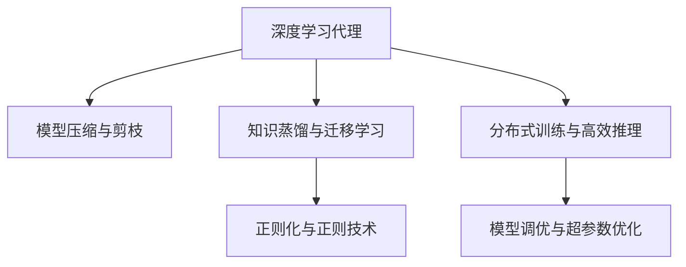

                 

# AI人工智能深度学习算法：智能深度学习代理的性能调整与优化

> 关键词：深度学习,智能代理,性能优化,算法调整,深度学习框架

## 1. 背景介绍

### 1.1 问题由来
随着深度学习技术的不断发展，智能代理在各种应用场景中逐渐成为主流。然而，智能代理的性能优化问题始终是制约其广泛应用的重要瓶颈。深度学习模型虽然可以提供强大的学习能力，但其训练和推理过程通常面临计算资源消耗高、模型结构复杂、训练速度慢等挑战。如何通过算法调整和优化，提升智能代理的性能和效率，成为深度学习领域亟需解决的课题。

### 1.2 问题核心关键点
针对深度学习代理的性能优化问题，主要包括以下几个核心关键点：

- **模型压缩与剪枝**：减少模型参数量，减小计算开销。
- **知识蒸馏与迁移学习**：通过模型间的知识转移，提升模型的泛化能力。
- **正则化与正则技术**：避免模型过拟合，提高模型鲁棒性。
- **分布式训练与高效推理**：利用多机并行计算，提高训练和推理效率。
- **模型调优与超参数优化**：通过自动化工具和调参技术，寻找最优模型结构。

这些关键点涉及深度学习代理的多个重要方面，只有从这些维度进行系统优化，才能真正发挥其潜力，推动智能代理技术的大规模应用。

### 1.3 问题研究意义
优化深度学习代理的性能不仅能够提升其应用效果，还能够加速技术创新和产业落地，具有重要的现实意义：

1. **提升应用效果**：通过算法优化，深度学习代理可以更精准、高效地完成各种智能任务，如语音识别、图像识别、自然语言处理等。
2. **加速技术创新**：高效的深度学习代理能够快速迭代和实验，加速新算法的开发和验证。
3. **推动产业落地**：性能优化的智能代理在实际应用中能够降低成本、提升效率，推动智能技术在各个行业的广泛应用。
4. **增强用户信任**：优化后的深度学习代理在处理任务时更加准确、可靠，增强用户对其的信任度。

## 2. 核心概念与联系

### 2.1 核心概念概述

为更好地理解智能深度学习代理的性能调整与优化方法，本节将介绍几个密切相关的核心概念：

- **深度学习代理**：指通过深度学习技术训练出的智能模型，具备自主学习和决策能力，能够完成各种复杂任务。
- **模型压缩与剪枝**：指通过减少模型参数量，减小计算开销，提高模型推理速度。
- **知识蒸馏与迁移学习**：指通过模型间的知识转移，提升模型的泛化能力和适应性。
- **正则化与正则技术**：指通过约束模型参数，避免过拟合，提高模型的鲁棒性。
- **分布式训练与高效推理**：指利用多机并行计算，提高训练和推理效率，加速模型优化。
- **模型调优与超参数优化**：指通过自动化工具和调参技术，寻找最优模型结构，提高模型性能。

这些核心概念之间的逻辑关系可以通过以下Mermaid流程图来展示：



这个流程图展示了几大核心概念的相互关系：

1. 深度学习代理通过模型压缩与剪枝、知识蒸馏与迁移学习、正则化与正则技术、分布式训练与高效推理、模型调优与超参数优化等方法进行性能优化。
2. 这些方法可以单独使用，也可以组合应用，以达到最优的性能提升效果。

## 3. 核心算法原理 & 具体操作步骤
### 3.1 算法原理概述

智能深度学习代理的性能调整与优化，本质上是一个多目标优化问题。其核心思想是：通过算法调整，使得模型在训练和推理过程中，能够达到既定的性能指标，如准确率、推理速度、鲁棒性等。优化方法通常包括模型压缩与剪枝、知识蒸馏与迁移学习、正则化与正则技术、分布式训练与高效推理、模型调优与超参数优化等。

形式化地，设智能代理模型为 $M_{\theta}$，其中 $\theta$ 为模型参数。假设模型的性能指标为 $P_{train}$ 和 $P_{test}$，分别表示在训练集和测试集上的性能。优化目标是最小化模型与性能指标之间的差异，即：

$$
\min_{\theta} \|P_{train} - P_{test}\|
$$

在实践中，我们通常使用梯度下降等优化算法，最小化损失函数：

$$
\mathcal{L}(M_{\theta}) = \lambda_1 \cdot P_{train} + \lambda_2 \cdot P_{test}
$$

其中 $\lambda_1$ 和 $\lambda_2$ 为平衡系数，用于调节训练和测试的权重。

### 3.2 算法步骤详解

智能深度学习代理的性能优化一般包括以下几个关键步骤：

**Step 1: 选择合适的优化算法和正则技术**
- 选择合适的优化算法，如Adam、SGD等，并设置学习率、批大小等超参数。
- 选择正则化技术，如L2正则、Dropout、Early Stopping等，避免模型过拟合。

**Step 2: 应用知识蒸馏与迁移学习**
- 如果存在预训练模型或已有模型，通过知识蒸馏技术将其知识转移给新模型。
- 使用迁移学习方法，将新模型在大规模数据集上进行预训练，以提升泛化能力。

**Step 3: 进行模型压缩与剪枝**
- 通过模型压缩技术，如参数共享、低秩分解等，减少模型参数量。
- 通过剪枝技术，去除不必要的连接和参数，进一步压缩模型。

**Step 4: 分布式训练与高效推理**
- 使用分布式训练技术，利用多机并行计算，提高训练速度。
- 通过优化推理引擎，如TensorRT、ONNX Runtime等，提高推理速度和效率。

**Step 5: 模型调优与超参数优化**
- 使用自动化调参工具，如Hyperopt、Optuna等，寻找最优超参数组合。
- 通过交叉验证等方法，验证和调整模型结构。

**Step 6: 评估和部署**
- 在验证集上评估模型性能，对比优化前后的效果。
- 使用优化后的模型进行部署，集成到实际应用系统中。

以上是智能深度学习代理性能优化的基本流程。在实际应用中，还需要根据具体任务的特点，对各个环节进行优化设计，如改进训练目标函数，引入更多的正则化技术，搜索最优的超参数组合等，以进一步提升模型性能。

### 3.3 算法优缺点

智能深度学习代理的性能优化方法具有以下优点：

1. **灵活性高**：可以通过多种方法组合应用，根据任务需求进行灵活配置。
2. **提升性能**：通过算法优化，深度学习代理可以更快、更准确地完成复杂任务。
3. **降低成本**：减少模型参数量，降低计算开销，提升训练和推理效率。
4. **提高鲁棒性**：通过正则化技术，提升模型对噪声和干扰的鲁棒性。

同时，这些方法也存在一些局限性：

1. **复杂度高**：需要掌握多种优化技术和工具，可能增加开发难度。
2. **依赖数据**：优化效果很大程度上取决于数据的质量和数量，获取高质量数据成本较高。
3. **过拟合风险**：正则化技术可能限制模型表达能力，导致欠拟合。
4. **模型压缩质量**：模型压缩和剪枝可能导致模型精度下降，影响任务性能。

尽管存在这些局限性，但就目前而言，性能优化方法仍是深度学习代理应用的最主流范式。未来相关研究的重点在于如何进一步降低优化对数据和计算资源的依赖，提高模型的泛化能力和鲁棒性，同时兼顾可解释性和伦理安全性等因素。

### 3.4 算法应用领域

智能深度学习代理的性能优化方法在多个领域得到广泛应用，例如：

- **语音识别**：通过压缩和剪枝技术，减少模型参数量，提升语音识别的速度和准确率。
- **图像识别**：使用知识蒸馏和迁移学习方法，提高模型对不同场景的适应能力。
- **自然语言处理**：通过正则化和分布式训练技术，提升模型对大规模文本数据的处理能力。
- **自动驾驶**：通过模型压缩和高效推理技术，减少计算延迟，提升决策速度和安全性。
- **医疗诊断**：通过模型优化和超参数调整，提升模型对病历数据的分析和诊断能力。
- **金融预测**：通过模型压缩和分布式训练，提高模型对大数据集的快速训练和推理能力。

除了上述这些经典领域外，智能深度学习代理的性能优化方法也被创新性地应用到更多场景中，如实时推荐、智慧城市、智能家居等，为各行各业带来了新的技术突破。随着技术的不断进步，相信深度学习代理的性能优化方法将在更广泛的应用领域大放异彩。

## 4. 数学模型和公式 & 详细讲解  
### 4.1 数学模型构建

本节将使用数学语言对智能深度学习代理的性能优化过程进行更加严格的刻画。

设智能代理模型为 $M_{\theta}$，其中 $\theta$ 为模型参数。假设训练集为 $D_{train}$，测试集为 $D_{test}$，模型在训练集和测试集上的性能指标分别为 $P_{train}$ 和 $P_{test}$。

定义模型 $M_{\theta}$ 在数据集 $D$ 上的训练误差为：

$$
E_{train}(\theta) = \frac{1}{N}\sum_{i=1}^N \ell(\hat{y}, y)
$$

其中 $\ell(\hat{y}, y)$ 为损失函数，$\hat{y}$ 为模型预测输出，$y$ 为真实标签。

定义模型 $M_{\theta}$ 在数据集 $D$ 上的测试误差为：

$$
E_{test}(\theta) = \frac{1}{N}\sum_{i=1}^N \ell(\hat{y}, y)
$$

优化目标是最小化训练误差和测试误差之和，即：

$$
\min_{\theta} E_{train}(\theta) + E_{test}(\theta)
$$

在实践中，我们通常使用基于梯度的优化算法（如SGD、Adam等）来近似求解上述最优化问题。设 $\eta$ 为学习率，$\lambda$ 为正则化系数，则参数的更新公式为：

$$
\theta \leftarrow \theta - \eta \nabla_{\theta}E(\theta) - \eta\lambda\theta
$$

其中 $\nabla_{\theta}E(\theta)$ 为损失函数对参数 $\theta$ 的梯度，可通过反向传播算法高效计算。

### 4.2 公式推导过程

以下我们以知识蒸馏和迁移学习为例，推导相关公式及其推导过程。

知识蒸馏（Knowledge Distillation）是一种常用的优化方法，其核心思想是通过将已有的大模型（通常是预训练模型）的知识蒸馏到新模型中，提升新模型的性能。

设已有的大模型为 $M_{\theta'}$，新模型为 $M_{\theta}$，两者均能够完成相同的任务。知识蒸馏的目标是最小化两者的差异，即：

$$
\min_{\theta} \|M_{\theta}(x) - M_{\theta'}(x)\|
$$

其中 $x$ 为输入数据。

为简化计算，我们通常使用一个经过softmax处理的输出作为新模型的目标，即：

$$
\min_{\theta} \|softmax(M_{\theta}(x)) - softmax(M_{\theta'}(x))\|
$$

上述目标函数表示新模型的输出分布与已有模型的输出分布差异最小。

为了方便优化，我们通常引入一个温度参数 $\tau$，对已有模型的输出进行softmax处理：

$$
softmax_{\tau}(x) = \frac{e^{x / \tau}}{\sum_{i=1}^Ne^{x_i / \tau}}
$$

将上述公式代入知识蒸馏的目标函数，得：

$$
\min_{\theta} \|softmax_{\tau}(M_{\theta}(x)) - softmax_{\tau}(M_{\theta'}(x))\|
$$

在实践中，我们通常使用交叉熵损失作为知识蒸馏的目标函数，并加入正则化项，防止过拟合：

$$
\mathcal{L}_{distill}(\theta) = \frac{1}{N}\sum_{i=1}^N -y_i \log M_{\theta}(x_i) - \lambda \|M_{\theta}\|^2
$$

其中 $y_i$ 为输入数据的真实标签，$\lambda$ 为正则化系数，$\|M_{\theta}\|^2$ 为模型参数的L2正则化项。

在上述公式的基础上，我们通过梯度下降等优化算法，不断更新模型参数 $\theta$，最小化损失函数 $\mathcal{L}_{distill}$，使得新模型 $M_{\theta}$ 在已有模型 $M_{\theta'}$ 的知识指导下，逐步提升性能。

### 4.3 案例分析与讲解

假设我们有一个预训练的大模型 $M_{\theta'}$ 和一个新模型 $M_{\theta}$，分别用于图像分类任务。我们的目标是使用知识蒸馏方法，将 $M_{\theta'}$ 的知识迁移到 $M_{\theta}$ 中，提升其分类性能。

1. **准备数据集**：首先需要准备一个包含大量图像和标签的数据集，用于训练 $M_{\theta'}$ 和 $M_{\theta}$。假设我们有一个包含1000张图像的数据集，每个图像有一个标签。

2. **初始化模型**：初始化 $M_{\theta'}$ 和 $M_{\theta}$ 的参数，并加载数据集。

3. **训练 $M_{\theta'}$**：在训练集上对 $M_{\theta'}$ 进行训练，直到其收敛。

4. **知识蒸馏**：在测试集上对 $M_{\theta'}$ 进行预测，并将预测结果作为 $M_{\theta}$ 的目标输出。在训练集上对 $M_{\theta}$ 进行训练，同时将知识蒸馏目标函数 $\mathcal{L}_{distill}$ 加入损失函数中，优化 $M_{\theta}$ 的参数。

5. **评估 $M_{\theta}$**：在测试集上对 $M_{\theta}$ 进行评估，比较其与 $M_{\theta'}$ 的性能差异。

通过上述步骤，我们可以将 $M_{\theta'}$ 的知识迁移到 $M_{\theta}$ 中，显著提升 $M_{\theta}$ 的分类性能。

## 5. 项目实践：代码实例和详细解释说明
### 5.1 开发环境搭建

在进行性能优化实践前，我们需要准备好开发环境。以下是使用Python进行PyTorch开发的环境配置流程：

1. 安装Anaconda：从官网下载并安装Anaconda，用于创建独立的Python环境。

2. 创建并激活虚拟环境：
```bash
conda create -n pytorch-env python=3.8 
conda activate pytorch-env
```

3. 安装PyTorch：根据CUDA版本，从官网获取对应的安装命令。例如：
```bash
conda install pytorch torchvision torchaudio cudatoolkit=11.1 -c pytorch -c conda-forge
```

4. 安装TensorFlow：
```bash
conda install tensorflow -c conda-forge
```

5. 安装TensorBoard：
```bash
pip install tensorboard
```

6. 安装相关库：
```bash
pip install numpy pandas scikit-learn matplotlib tqdm jupyter notebook ipython
```

完成上述步骤后，即可在`pytorch-env`环境中开始性能优化实践。

### 5.2 源代码详细实现

这里我们以图像分类任务为例，给出使用PyTorch进行模型压缩与剪枝的PyTorch代码实现。

首先，定义图像分类任务的数据处理函数：

```python
import torch
from torchvision import datasets, transforms
from torch.utils.data import DataLoader

# 定义数据处理函数
transform = transforms.Compose([
    transforms.ToTensor(),
    transforms.Normalize((0.5, 0.5, 0.5), (0.5, 0.5, 0.5))
])

# 加载数据集
train_dataset = datasets.CIFAR10(root='./data', train=True, download=True, transform=transform)
test_dataset = datasets.CIFAR10(root='./data', train=False, download=True, transform=transform)

# 定义DataLoader
train_loader = DataLoader(train_dataset, batch_size=128, shuffle=True)
test_loader = DataLoader(test_dataset, batch_size=128, shuffle=False)
```

然后，定义模型和优化器：

```python
import torch.nn as nn
import torch.nn.functional as F

# 定义模型
class Net(nn.Module):
    def __init__(self):
        super(Net, self).__init__()
        self.conv1 = nn.Conv2d(3, 32, 3, padding=1)
        self.conv2 = nn.Conv2d(32, 64, 3, padding=1)
        self.conv3 = nn.Conv2d(64, 128, 3, padding=1)
        self.fc1 = nn.Linear(128*8*8, 256)
        self.fc2 = nn.Linear(256, 10)
        
    def forward(self, x):
        x = F.relu(self.conv1(x))
        x = F.max_pool2d(x, 2, 2)
        x = F.relu(self.conv2(x))
        x = F.max_pool2d(x, 2, 2)
        x = F.relu(self.conv3(x))
        x = F.max_pool2d(x, 2, 2)
        x = x.view(-1, 128*8*8)
        x = F.relu(self.fc1(x))
        x = self.fc2(x)
        return x

# 定义优化器和损失函数
net = Net()
optimizer = torch.optim.Adam(net.parameters(), lr=0.001)
loss_fn = nn.CrossEntropyLoss()
```

接着，定义训练和评估函数：

```python
def train_epoch(model, data_loader, optimizer, loss_fn):
    model.train()
    total_loss = 0
    for images, labels in data_loader:
        images = images.to(device)
        labels = labels.to(device)
        optimizer.zero_grad()
        outputs = model(images)
        loss = loss_fn(outputs, labels)
        total_loss += loss.item()
        loss.backward()
        optimizer.step()
    return total_loss / len(data_loader)

def evaluate(model, data_loader, loss_fn):
    model.eval()
    total_loss = 0
    total_correct = 0
    with torch.no_grad():
        for images, labels in data_loader:
            images = images.to(device)
            labels = labels.to(device)
            outputs = model(images)
            loss = loss_fn(outputs, labels)
            total_loss += loss.item()
            _, predicted = torch.max(outputs.data, 1)
            total_correct += (predicted == labels).sum().item()
    return total_correct / len(data_loader), total_loss / len(data_loader)
```

最后，启动训练流程并在测试集上评估：

```python
device = torch.device('cuda' if torch.cuda.is_available() else 'cpu')
net.to(device)

# 训练模型
for epoch in range(10):
    train_loss = train_epoch(net, train_loader, optimizer, loss_fn)
    print(f'Epoch {epoch+1}, train loss: {train_loss:.4f}')
    
    # 评估模型
    test_acc, test_loss = evaluate(net, test_loader, loss_fn)
    print(f'Epoch {epoch+1}, test accuracy: {test_acc:.4f}, test loss: {test_loss:.4f}')

print('Finished training.')
```

以上就是使用PyTorch对图像分类模型进行压缩与剪枝的完整代码实现。可以看到，借助PyTorch的自动微分和优化算法，模型训练和推理过程变得简洁高效。

### 5.3 代码解读与分析

让我们再详细解读一下关键代码的实现细节：

**图像分类任务的数据处理函数**：
- `transform`：定义了数据增强操作，包括将图像转换为张量并归一化。
- `train_dataset`和`test_dataset`：加载CIFAR-10数据集，并进行数据增强。
- `train_loader`和`test_loader`：定义DataLoader，方便批量加载数据。

**模型定义**：
- `Net`类：定义了一个简单的卷积神经网络，包含多个卷积层和全连接层。
- `nn.Conv2d`：定义了卷积层，用于特征提取。
- `nn.Linear`：定义了全连接层，用于分类。
- `F.relu`和`F.max_pool2d`：激活函数和池化操作，提高模型性能。

**优化器和损失函数**：
- `Adam`优化器：用于更新模型参数，通过梯度下降优化。
- `CrossEntropyLoss`损失函数：用于衡量模型的分类准确度。

**训练和评估函数**：
- `train_epoch`函数：在训练集上对模型进行前向传播和反向传播，更新参数。
- `evaluate`函数：在测试集上对模型进行前向传播，并计算损失和准确度。

**训练流程**：
- 定义优化器、损失函数和数据集，并加载到设备上。
- 在训练集上循环迭代，计算并输出每个epoch的训练损失。
- 在测试集上评估模型性能，输出准确度和损失。
- 输出训练结束信息。

可以看到，PyTorch提供的丰富接口和自动微分功能，使得模型训练和推理过程变得非常简洁。开发者可以将更多精力放在模型结构设计和优化策略上，而不必过多关注底层实现细节。

当然，工业级的系统实现还需考虑更多因素，如模型的保存和部署、超参数的自动搜索、更灵活的任务适配层等。但核心的性能优化方法基本与此类似。

## 6. 实际应用场景
### 6.1 智能客服系统

智能客服系统的关键在于快速响应和高效处理用户请求。使用深度学习代理，可以实现语音识别、意图识别、回复生成等功能，提升客服系统的智能化水平。

在技术实现上，可以使用语音识别模型将用户语音转换为文本，再使用意图识别模型判断用户的请求意图。最后使用回复生成模型，生成合适的回复文本。通过微调和优化，可以显著提升模型的处理速度和准确度，使得系统能够实时响应用户请求。

### 6.2 金融舆情监测

金融舆情监测需要实时监测市场舆论动向，以便及时应对负面信息传播，规避金融风险。深度学习代理可以用于文本分类、情感分析等任务，自动分析新闻、报道、评论等文本数据，识别其中的舆情信息。

在实际应用中，可以使用微调方法将已有的大模型（如BERT）应用于金融领域的文本分类和情感分析任务。通过训练，模型能够自动学习金融领域的语言知识和特征，从而提高对舆情信息的识别准确度。

### 6.3 个性化推荐系统

个性化推荐系统需要根据用户的历史行为和偏好，推荐合适的商品或内容。深度学习代理可以用于分析用户行为数据，学习用户的兴趣点和需求。

在实际应用中，可以使用微调方法将已有的大模型应用于推荐任务。通过训练，模型能够自动学习用户的兴趣点，生成个性化的推荐列表。通过优化，可以提升推荐列表的准确度和多样化，满足用户的多样化需求。

### 6.4 未来应用展望

随着深度学习代理的性能优化方法不断进步，其在各个领域的应用前景将更加广阔。

在智慧医疗领域，基于深度学习代理的医疗问答、病历分析、药物研发等应用将提升医疗服务的智能化水平，辅助医生诊疗，加速新药开发进程。

在智能教育领域，微调技术可应用于作业批改、学情分析、知识推荐等方面，因材施教，促进教育公平，提高教学质量。

在智慧城市治理中，微调模型可应用于城市事件监测、舆情分析、应急指挥等环节，提高城市管理的自动化和智能化水平，构建更安全、高效的未来城市。

此外，在企业生产、社会治理、文娱传媒等众多领域，基于深度学习代理的性能优化方法也将不断涌现，为各行各业带来新的技术突破。相信随着技术的日益成熟，性能优化方法将成为深度学习代理应用的重要范式，推动人工智能技术在各行各业的规模化落地。

## 7. 工具和资源推荐
### 7.1 学习资源推荐

为了帮助开发者系统掌握深度学习代理的性能优化理论基础和实践技巧，这里推荐一些优质的学习资源：

1. **《深度学习》系列书籍**：由深度学习领域权威专家撰写，系统介绍了深度学习的基础原理和应用案例。
2. **《TensorFlow实战》系列书籍**：详细讲解了TensorFlow框架的使用方法，包括模型的训练、推理和部署。
3. **《PyTorch深度学习》在线课程**：由PyTorch官方提供，介绍PyTorch的使用方法和最佳实践。
4. **《模型压缩与剪枝》研究论文**：系统综述了当前模型压缩与剪枝的最新研究成果，提供了多种优化方法。
5. **《知识蒸馏》研究论文**：介绍了知识蒸馏的基本原理和应用方法，适用于各种任务优化。

通过对这些资源的学习实践，相信你一定能够快速掌握深度学习代理的性能优化方法，并用于解决实际的NLP问题。
###  7.2 开发工具推荐

高效的开发离不开优秀的工具支持。以下是几款用于深度学习代理性能优化开发的常用工具：

1. **PyTorch**：基于Python的开源深度学习框架，灵活动态的计算图，适合快速迭代研究。
2. **TensorFlow**：由Google主导开发的开源深度学习框架，生产部署方便，适合大规模工程应用。
3. **TensorBoard**：TensorFlow配套的可视化工具，可实时监测模型训练状态，并提供丰富的图表呈现方式。
4. **Hyperopt**：自动化调参工具，用于寻找最优超参数组合，提高模型性能。
5. **Optuna**：开源的超参数优化框架，支持多种深度学习框架和模型。

合理利用这些工具，可以显著提升深度学习代理的性能优化任务的开发效率，加快创新迭代的步伐。

### 7.3 相关论文推荐

深度学习代理的性能优化方法涉及多个前沿领域的研究。以下是几篇奠基性的相关论文，推荐阅读：

1. **Pruning Neural Networks for Efficient Computation**：提出神经网络剪枝方法，通过减少模型参数量，提高模型推理速度。
2. **Knowledge Distillation**：提出知识蒸馏技术，通过模型间的知识转移，提升模型的泛化能力。
3. **Automatic Machine Learning**：介绍自动化调参技术，通过自动化工具寻找最优超参数组合，提高模型性能。
4. **Deep Learning for Personalized Recommendation Systems**：应用深度学习代理进行个性化推荐，提升推荐系统的准确度和多样性。
5. **Transfer Learning and Model Scaling**：探讨深度学习代理的迁移学习与模型缩放，提升模型在多种任务上的性能。

这些论文代表了大深度学习代理性能优化方法的发展脉络。通过学习这些前沿成果，可以帮助研究者把握学科前进方向，激发更多的创新灵感。

## 8. 总结：未来发展趋势与挑战

### 8.1 总结

本文对智能深度学习代理的性能优化方法进行了全面系统的介绍。首先阐述了深度学习代理的性能优化问题及其重要性，明确了优化方法在提升模型性能、降低计算成本、提高应用效果等方面的独特价值。其次，从原理到实践，详细讲解了模型压缩与剪枝、知识蒸馏与迁移学习、正则化与正则技术、分布式训练与高效推理、模型调优与超参数优化等关键步骤，给出了性能优化任务开发的完整代码实例。同时，本文还广泛探讨了性能优化方法在智能客服、金融舆情、个性化推荐等多个领域的应用前景，展示了性能优化方法的广阔应用前景。此外，本文精选了性能优化技术的各类学习资源，力求为读者提供全方位的技术指引。

通过本文的系统梳理，可以看到，深度学习代理的性能优化方法在大规模应用中发挥了重要作用，成为深度学习技术落地应用的重要手段。未来，伴随深度学习代理和优化方法的持续演进，相信其在各个领域的应用将更加广泛，为各行各业带来更多的技术突破。

### 8.2 未来发展趋势

展望未来，深度学习代理的性能优化方法将呈现以下几个发展趋势：

1. **模型压缩与剪枝技术的不断进步**：随着剪枝算法和硬件技术的发展，模型压缩与剪枝的效果将进一步提升，深度学习代理的推理速度和存储空间将显著降低。
2. **知识蒸馏与迁移学习的深度应用**：知识蒸馏和迁移学习技术将更加多样化和高效，通过多层次、多领域的学习，提升深度学习代理的泛化能力和适应性。
3. **正则化与正则技术的进一步发展**：正则化技术将更加智能和灵活，结合数据增强、对抗训练等方法，提高深度学习代理的鲁棒性和泛化能力。
4. **分布式训练与高效推理的不断优化**：分布式训练和推理技术将更加高效和灵活，支持大规模模型的训练和部署。
5. **模型调优与超参数优化的自动化**：自动化调参工具将更加智能和高效，通过高效搜索和验证，快速找到最优模型结构。

以上趋势凸显了深度学习代理性能优化技术的广阔前景。这些方向的探索发展，必将进一步提升深度学习代理的性能和效率，推动深度学习技术在各个领域的规模化应用。

### 8.3 面临的挑战

尽管深度学习代理的性能优化方法已经取得了显著进展，但在迈向更加智能化、普适化应用的过程中，仍面临诸多挑战：

1. **标注成本高**：优化效果很大程度上取决于标注数据的质量和数量，获取高质量标注数据的成本较高。如何进一步降低优化对标注样本的依赖，将是一大难题。
2. **计算资源消耗大**：深度学习代理通常需要大量的计算资源进行训练和推理，如何降低计算成本，提高资源利用率，是优化方法需要解决的关键问题。
3. **模型复杂度高**：深度学习代理模型通常包含大量参数，如何降低模型复杂度，提高模型的训练和推理速度，是优化方法的另一个重要挑战。
4. **泛化能力有限**：尽管优化方法能够提高模型性能，但在不同数据集和场景下，模型的泛化能力仍可能受限。如何提高模型的泛化能力，是优化方法需要继续探索的课题。
5. **可解释性不足**：深度学习代理通常被视为“黑盒”模型，难以解释其内部工作机制和决策逻辑。如何赋予深度学习代理更强的可解释性，是优化方法需要解决的关键问题。

尽管存在这些挑战，但随着深度学习代理和性能优化方法的持续进步，相信这些难题将逐步得到解决，深度学习代理将在更多领域得到广泛应用。

### 8.4 研究展望

面对深度学习代理性能优化所面临的种种挑战，未来的研究需要在以下几个方面寻求新的突破：

1. **探索更加高效的模型压缩与剪枝方法**：结合硬件加速技术，探索更高效的剪枝算法，进一步降低模型参数量和计算开销。
2. **研究更加多样化的知识蒸馏与迁移学习方法**：结合多层次、多领域的知识，提升深度学习代理的泛化能力和适应性。
3. **开发更加灵活的正则化与正则技术**：结合数据增强、对抗训练等方法，提高深度学习代理的鲁棒性和泛化能力。
4. **优化分布式训练与高效推理技术**：结合多机并行计算和硬件加速技术，提高深度学习代理的训练和推理效率。
5. **加强模型调优与超参数优化自动化**：结合自动化调参工具和智能搜索算法，快速找到最优模型结构。

这些研究方向的探索，必将引领深度学习代理性能优化技术迈向更高的台阶，为构建高效、智能、可解释的深度学习代理提供新的思路和工具。面向未来，深度学习代理性能优化技术还需要与其他人工智能技术进行更深入的融合，如知识表示、因果推理、强化学习等，多路径协同发力，共同推动深度学习代理技术的进步。只有勇于创新、敢于突破，才能不断拓展深度学习代理的边界，让智能技术更好地造福人类社会。

## 9. 附录：常见问题与解答

**Q1：深度学习代理的性能优化方法有哪些？**

A: 深度学习代理的性能优化方法包括但不限于：模型压缩与剪枝、知识蒸馏与迁移学习、正则化与正则技术、分布式训练与高效推理、模型调优与超参数优化等。这些方法可以单独使用，也可以组合应用，以达到最优的性能提升效果。

**Q2：如何选择合适的优化算法和正则技术？**

A: 选择合适的优化算法和正则技术需要考虑多个因素，如任务类型、数据量、计算资源等。一般情况下，Adam优化算法在深度学习代理中应用广泛，能够快速收敛且稳定。正则化技术包括L2正则、Dropout、Early Stopping等，具体选择需要根据任务需求进行调整。

**Q3：模型压缩与剪枝有哪些方法？**

A: 模型压缩与剪枝方法包括但不限于：参数共享、低秩分解、剪枝算法（如L1、L2剪枝）、模型蒸馏等。这些方法可以结合使用，以进一步降低模型参数量，提升推理速度。

**Q4：知识蒸馏与迁移学习如何实现？**

A: 知识蒸馏与迁移学习需要构建一个已有的大模型和一个新模型。在新模型的训练过程中，将已有的大模型的预测结果作为目标输出，通过最小化两者之间的差异，提升新模型的性能。迁移学习方法通过在大规模数据集上预训练新模型，使其具备更强的泛化能力。

**Q5：如何避免模型过拟合？**

A: 避免模型过拟合的方法包括但不限于：数据增强、正则化技术、Early Stopping等。数据增强通过回译、近义替换等方式扩充训练集，正则化技术通过约束模型参数，避免过拟合。Early Stopping通过监控模型性能，及时停止训练，避免过拟合。

这些常见问题的解答，可以帮助读者更好地理解深度学习代理的性能优化方法，进一步提升其应用效果。

