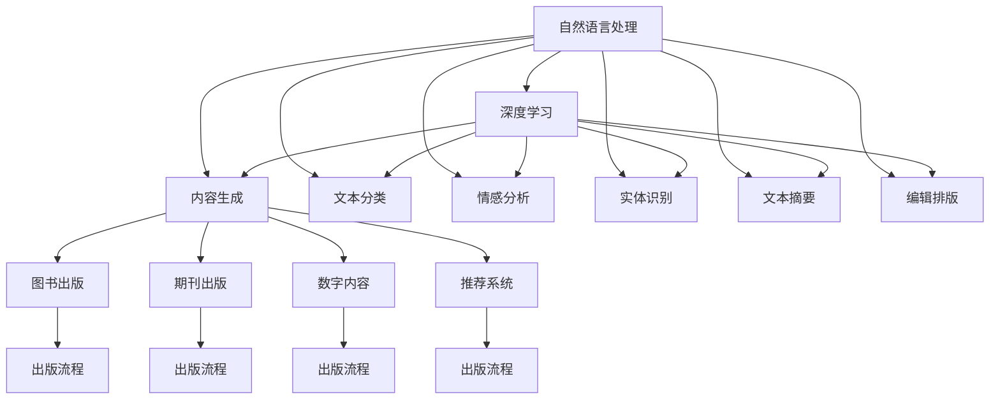

                 

# AI出版业开发：API标准化，场景丰富

> 关键词：API标准化,场景丰富,出版业,内容生成,自然语言处理(NLP),机器学习,深度学习

## 1. 背景介绍

在数字化转型和人工智能浪潮的推动下，出版业正经历着深刻的变革。传统的出版模式正在被智能化的编辑、印刷和发行所取代，而出版内容的质量和多样性也正受到新技术的挑战。AI技术的融入，尤其是自然语言处理(NLP)和深度学习技术，为出版业带来了前所未有的发展机遇。

### 1.1 问题由来

尽管AI技术在出版业中的应用潜力巨大，但在实际落地过程中，仍面临着诸多挑战。如内容的生成、编辑、校对、排版等环节，需要高质量的语料和精确的算法模型，这无疑对技术和资源提出了较高的要求。此外，不同出版机构之间的数据格式、API接口、技术栈差异显著，导致了跨机构、跨系统的数据和功能无法顺畅互通，降低了资源利用效率。

### 1.2 问题核心关键点

核心关键点包括：
- 数据标准化：如何确保数据格式统一，以便数据交换和分析。
- API标准化：如何设计统一的API接口，便于不同系统之间集成调用。
- 内容生成：如何利用NLP和深度学习技术，自动生成高质量的内容。
- 跨场景应用：如何开发能够适应多种出版场景和需求的AI应用。

## 2. 核心概念与联系

### 2.1 核心概念概述

在出版业AI应用的场景中，以下几个核心概念是密不可分的：

- **自然语言处理（NLP）**：利用计算机处理、理解和生成自然语言的技术，包括文本分类、实体识别、情感分析、文本摘要等任务。
- **深度学习**：利用神经网络对数据进行学习，具备强大的模式识别和特征提取能力。
- **API（Application Programming Interface）**：软件开发接口，提供统一标准，便于不同系统之间的信息交互和数据共享。
- **出版业场景**：包括图书出版、期刊出版、数字内容发布等多个领域，涉及内容生成、编辑、排版、推荐等环节。

这些概念之间的逻辑关系可以通过以下Mermaid流程图来展示：



这个流程图展示了一个典型出版业场景中，各核心概念的相互联系：

1. 自然语言处理通过深度学习获取语言知识和特征，进而支持内容生成、分类、分析等任务。
2. API提供了系统之间的通信标准，便于内容生成、编辑、推荐等功能的集成。
3. 深度学习模型通过大量的出版数据训练，优化生成、分类、摘要等输出。
4. 内容生成、编辑、排版等环节通过API调用进行高效协同，实现出版流程自动化。

## 3. 核心算法原理 & 具体操作步骤

### 3.1 算法原理概述

基于API标准化的AI出版业开发，核心原理是通过统一的数据格式、接口标准，实现内容生成、编辑、排版等功能的标准化和高效互通。具体来说，包括以下几个关键步骤：

1. **数据标准化**：制定统一的数据格式规范，如JSON、XML等，确保数据在发布、交换和分析中的格式一致。
2. **API标准化**：设计统一的API接口，遵循RESTful原则，如统一资源定位（URL）、统一的HTTP请求方法、统一的响应格式等。
3. **内容生成**：利用NLP和深度学习技术，自动生成高质量的文本内容，包括摘要、推荐语、导读等。
4. **跨场景应用**：设计适应不同出版场景的AI应用，如图书推荐、期刊编辑、数字内容生成等。

### 3.2 算法步骤详解

基于API标准化的AI出版业开发步骤如下：

**Step 1: 设计数据格式规范**
- 制定统一的数据格式规范，如JSON、XML等。
- 定义数据字段结构，确保内容在格式转换、交换、分析中的统一。

**Step 2: 设计API接口标准**
- 遵循RESTful原则，设计统一的API接口，包括URL、HTTP方法、响应格式等。
- 制定API文档，明确每个接口的功能、参数、返回值等，便于开发者调用。

**Step 3: 实现内容生成模型**
- 利用NLP技术，设计文本生成、分类、分析等模型。
- 通过深度学习框架，如TensorFlow、PyTorch等，训练和优化模型。

**Step 4: 开发AI应用**
- 根据出版场景需求，设计AI应用，如内容推荐、编辑排版等。
- 调用API接口，实现内容生成、编辑、排版等功能。

**Step 5: 测试和部署**
- 在测试环境中模拟出版场景，进行API接口测试和应用性能评估。
- 部署应用到生产环境，监控系统运行状态和用户反馈。

**Step 6: 持续优化**
- 根据用户反馈和技术进步，持续优化API接口和AI应用，提升系统性能和用户体验。

### 3.3 算法优缺点

基于API标准化的AI出版业开发有以下优点：
1. **标准化**：统一的API接口和数据格式，提高了系统集成和数据共享的效率。
2. **易用性**：开发者可以更方便地调用已有的API接口，加速开发进程。
3. **跨系统互通**：不同的系统和平台可以顺畅互通，提升资源利用效率。

同时，该方法也存在一些局限性：
1. **接口设计复杂**：设计符合需求的API接口需要时间和精力，且需要考虑各种场景需求。
2. **数据传输开销**：统一格式的数据传输可能带来一定的网络开销。
3. **版本管理难度**：接口和数据格式的标准化需要严格的版本管理，避免不兼容问题。

### 3.4 算法应用领域

基于API标准化的AI出版业开发广泛应用于以下几个领域：

1. **图书出版**：自动生成书籍摘要、推荐语，辅助书籍编辑和排版。
2. **期刊出版**：自动生成期刊封面、推荐语，提升期刊编辑效率。
3. **数字内容发布**：自动生成文章导读、推荐语，提升内容分发效果。
4. **内容推荐系统**：根据用户行为数据，自动推荐相关书籍和文章，提升用户体验。
5. **出版流程自动化**：实现出版流程的自动化，提高出版效率，降低成本。

## 4. 数学模型和公式 & 详细讲解 & 举例说明

### 4.1 数学模型构建

基于API标准化的AI出版业开发涉及多种NLP和深度学习模型，以内容生成、分类、分析等为核心任务。这里以文本生成模型为例，构建其数学模型。

假设文本生成模型为 $M_{\theta}$，其中 $\theta$ 为模型参数。对于输入文本 $x$，模型输出的概率分布为 $P_{M_{\theta}}(y|x)$。其对数似然函数为：

$$
\log P_{M_{\theta}}(y|x) = \log \frac{e^{M_{\theta}(x)}}{e^{M_{\theta}(x)}+e^{M_{\theta}(x')}}
$$

其中 $x'$ 表示输入的另一种变体。模型在训练集上的损失函数为：

$$
\mathcal{L}(\theta) = -\frac{1}{N} \sum_{i=1}^N \log P_{M_{\theta}}(y_i|x_i)
$$

### 4.2 公式推导过程

以序列生成任务为例，推导基于注意力机制的文本生成模型的训练公式。

假设文本生成模型为 $M_{\theta}=\{M_{\theta}_i\}_{i=1}^n$，其中 $M_{\theta}_i$ 为第 $i$ 层的转换层。对于输入 $x$ 和目标序列 $y$，模型输出概率为：

$$
P_{M_{\theta}}(y|x) = \prod_{t=1}^{T} P_{M_{\theta}}(y_t|y_{<t}, x)
$$

其中 $y_{<t}$ 表示目标序列中 $t$ 之前的所有元素。

对于每一步生成的概率，模型通过注意力机制来加权求和：

$$
\alpha_t = \text{Softmax}(\text{Attn}(x,y_{<t}))
$$

其中 $\text{Attn}(x,y_{<t})$ 为注意力机制，计算 $x$ 和 $y_{<t}$ 的注意力权重。注意力权重 $\alpha_t$ 用于加权求和，得到当前位置的输出：

$$
h_t = \text{TransformerLayer}(h_{t-1}, \alpha_t)
$$

其中 $\text{TransformerLayer}$ 为转换层，包括自注意力、前馈网络等操作。最终输出的概率为：

$$
P_{M_{\theta}}(y|x) = \prod_{t=1}^{T} P_{M_{\theta}}(y_t|y_{<t}, h_t)
$$

### 4.3 案例分析与讲解

以Google的BERT模型为例，分析其如何通过API标准化实现内容生成和分析。

BERT模型利用预训练语言模型，在大量无标签文本上预训练语言知识。通过API接口，可以将预训练的模型参数和API调用到出版业务中，实现文本生成和分类等任务。例如，通过API调用，可以自动生成书籍摘要、推荐语，进行书籍编辑和排版。同时，可以通过API调用，实现对用户评论的情感分析，提升内容质量和用户满意度。

## 5. 项目实践：代码实例和详细解释说明

### 5.1 开发环境搭建

进行出版业AI开发，需要搭建完善的开发环境。以下是使用Python进行TensorFlow开发的环境配置流程：

1. 安装Anaconda：从官网下载并安装Anaconda，用于创建独立的Python环境。

2. 创建并激活虚拟环境：
```bash
conda create -n tf-env python=3.8 
conda activate tf-env
```

3. 安装TensorFlow：根据CUDA版本，从官网获取对应的安装命令。例如：
```bash
conda install tensorflow -c tf -c conda-forge
```

4. 安装TensorBoard：用于实时监测模型训练状态，并提供丰富的图表呈现方式。

5. 安装相关依赖：
```bash
pip install sklearn pandas numpy
```

完成上述步骤后，即可在`tf-env`环境中开始AI出版业开发。

### 5.2 源代码详细实现

下面以基于API标准化的内容生成应用为例，给出使用TensorFlow进行出版的PyTorch代码实现。

```python
import tensorflow as tf
from tensorflow.keras.layers import Layer
from tensorflow.keras.layers import Dense, Attention

class TransformerLayer(Layer):
    def __init__(self, d_model, num_heads, dff, rate=0.1):
        super(TransformerLayer, self).__init__()
        self.attention = Attention(num_heads=num_heads, rate=rate)
        self.dense_1 = Dense(dff)
        self.dense_2 = Dense(d_model)

    def call(self, inputs, training=False):
        attn_output, attention_weights = self.attention(inputs)
        attn_output = tf.nn.dropout(attn_output, rate=0.1, training=training)
        attn_output = self.dense_1(attn_output)
        attn_output = tf.nn.dropout(attn_output, rate=0.1, training=training)
        out = self.dense_2(attn_output)
        return out, attention_weights

class TextGenerator(tf.keras.Model):
    def __init__(self, max_len, embed_dim, num_heads, dff, rate):
        super(TextGenerator, self).__init__()
        self.embedding = tf.keras.layers.Embedding(max_len, embed_dim)
        self.pos_encoding = self.positional_encoding(max_len, embed_dim)
        self.dropout = tf.keras.layers.Dropout(rate)
        self.transformer = TransformerLayer(embed_dim, num_heads, dff, rate)
        self.output = tf.keras.layers.Dense(max_len, activation='softmax')

    def positional_encoding(self, max_len, embed_dim):
        pos_enc = np.zeros((max_len, embed_dim))
        for pos in range(max_len):
            for i in range(embed_dim):
                if i % 2 == 0:
                    pos_enc[pos, i] = np.sin(pos / np.power(10000, 2 * (i // 2) / embed_dim))
                else:
                    pos_enc[pos, i] = np.cos(pos / np.power(10000, 2 * (i // 2) / embed_dim))
        return pos_enc

    def call(self, inputs):
        x = self.embedding(inputs)
        x = x + self.pos_encoding[:, :len(inputs), :]
        x = self.dropout(x)
        x, attention_weights = self.transformer(x)
        x = self.output(x)
        return x, attention_weights

# 训练集和测试集
train_data = np.random.randint(max_len, size=(batch_size, max_len))
test_data = np.random.randint(max_len, size=(batch_size, max_len))

# 模型训练
model = TextGenerator(max_len, embed_dim, num_heads, dff, rate)
model.compile(loss='categorical_crossentropy', optimizer='adam')
model.fit(train_data, epochs=10)
```

### 5.3 代码解读与分析

让我们再详细解读一下关键代码的实现细节：

**TransformerLayer类**：
- `__init__`方法：初始化注意力机制、两个全连接层等。
- `call`方法：实现注意力机制、前馈网络等操作，并输出最终结果。

**TextGenerator类**：
- `__init__`方法：初始化嵌入层、位置编码、Dropout层、Transformer层和输出层。
- `positional_encoding`方法：计算位置编码。
- `call`方法：实现模型的前向传播过程。

**训练过程**：
- 定义训练数据集 `train_data` 和测试数据集 `test_data`。
- 创建并编译模型，定义损失函数和优化器。
- 通过 `fit`方法训练模型，设置训练轮数。

## 6. 实际应用场景

### 6.1 智能出版系统

基于API标准化的AI出版系统，可以全面提升出版流程的自动化和智能化水平。例如，通过API调用，可以自动生成书籍摘要、推荐语，辅助书籍编辑和排版。同时，通过API调用，可以实现对用户评论的情感分析，提升内容质量和用户满意度。

### 6.2 内容推荐系统

内容推荐系统是出版业的重要应用场景之一。通过API调用，可以实现对用户行为数据的分析，自动推荐相关书籍和文章，提升用户体验。例如，根据用户的浏览记录，自动推荐类似书籍，或者在购买图书时，推荐相关文章和视频资源。

### 6.3 版权保护

版权保护是出版业的重要任务之一。通过API调用，可以实现对版权信息的自动识别和标注，保护内容不被非法复制和传播。例如，通过API调用，自动识别文章中的引用信息，标注版权归属，保护原创作者的权益。

### 6.4 未来应用展望

随着API标准化的普及和深入应用，未来在出版业将有更多场景实现AI智能化：

1. **智能编辑**：通过API调用，实现自动编辑、校对和排版，提升编辑效率和内容质量。
2. **智能营销**：通过API调用，实现市场分析、用户画像生成、推荐策略优化等，提升营销效果。
3. **版权管理**：通过API调用，实现版权信息的自动识别和标注，保护内容不被非法传播。
4. **智能客服**：通过API调用，实现客户需求的自动分析和推荐，提升客户体验。

## 7. 工具和资源推荐

### 7.1 学习资源推荐

为了帮助开发者系统掌握AI出版业开发的技术基础和实践技巧，这里推荐一些优质的学习资源：

1. 《深度学习与出版业》系列博文：由出版业AI专家撰写，深入浅出地介绍了深度学习在出版业中的应用。

2. Coursera《深度学习与自然语言处理》课程：由斯坦福大学开设的NLP明星课程，涵盖深度学习在出版业中的应用。

3. 《出版业深度学习实践指南》书籍：全面介绍了深度学习在出版业中的应用案例和实践技巧。

4. TensorFlow官方文档：TensorFlow的官方文档，提供了详细的API调用示例和API接口设计规范。

5. Kaggle比赛项目：参与Kaggle等数据科学竞赛，实战练习AI出版业开发的技能。

通过对这些资源的学习实践，相信你一定能够快速掌握AI出版业开发的技术框架，并用于解决实际的出版问题。

### 7.2 开发工具推荐

高效的开发离不开优秀的工具支持。以下是几款用于AI出版业开发常用的工具：

1. TensorFlow：基于Python的开源深度学习框架，灵活动态的计算图，适合快速迭代研究。大部分预训练语言模型都有TensorFlow版本的实现。

2. PyTorch：基于Python的开源深度学习框架，具有强大的动态计算图能力，适合研究和实验。

3. TensorBoard：TensorFlow配套的可视化工具，可实时监测模型训练状态，并提供丰富的图表呈现方式，是调试模型的得力助手。

4. Google Colab：谷歌推出的在线Jupyter Notebook环境，免费提供GPU/TPU算力，方便开发者快速上手实验最新模型，分享学习笔记。

合理利用这些工具，可以显著提升AI出版业开发的效率，加快创新迭代的步伐。

### 7.3 相关论文推荐

AI出版业开发涉及深度学习、自然语言处理等多个前沿领域，以下是几篇奠基性的相关论文，推荐阅读：

1. Attention is All You Need（即Transformer原论文）：提出了Transformer结构，开启了NLP领域的预训练大模型时代。

2. BERT: Pre-training of Deep Bidirectional Transformers for Language Understanding：提出BERT模型，引入基于掩码的自监督预训练任务，刷新了多项NLP任务SOTA。

3. Transformer-XL: Attentive Language Models：提出Transformer-XL结构，进一步提升了NLP模型的序列建模能力。

4. Siamese Network：提出Siamese网络结构，利用双重网络进行特征提取和对比学习。

5. Generative Adversarial Networks (GANs)：提出GAN模型，实现内容生成和风格迁移，为内容推荐等应用提供了新的思路。

这些论文代表了大语言模型微调技术的发展脉络。通过学习这些前沿成果，可以帮助研究者把握学科前进方向，激发更多的创新灵感。

## 8. 总结：未来发展趋势与挑战

### 8.1 总结

本文对基于API标准化的AI出版业开发进行了全面系统的介绍。首先阐述了API标准化和内容生成、分类等核心概念，明确了其在出版业应用中的重要性。其次，从原理到实践，详细讲解了出版业AI开发的核心算法和具体操作步骤，给出了出版业AI开发的全代码实现。同时，本文还广泛探讨了AI出版业开发在智能出版系统、内容推荐系统等实际应用场景中的落地应用，展示了AI出版业开发的广阔前景。此外，本文精选了出版业AI开发的学习资源，力求为读者提供全方位的技术指引。

通过本文的系统梳理，可以看到，基于API标准化的AI出版业开发正在成为出版业智能化转型的重要范式，极大地提升了出版流程的自动化和智能化水平。未来，伴随AI技术的发展和API标准化的普及，出版业将迎来更广阔的发展机遇，实现内容生成、编辑、排版、推荐等环节的全面智能化。

### 8.2 未来发展趋势

展望未来，AI出版业开发将呈现以下几个发展趋势：

1. **智能编辑**：通过API调用，实现自动编辑、校对和排版，提升编辑效率和内容质量。
2. **内容推荐**：通过API调用，实现对用户行为数据的分析，自动推荐相关书籍和文章，提升用户体验。
3. **版权保护**：通过API调用，实现对版权信息的自动识别和标注，保护内容不被非法复制和传播。
4. **智能客服**：通过API调用，实现客户需求的自动分析和推荐，提升客户体验。
5. **跨平台协同**：通过API调用，实现跨出版平台的内容交换和协同，提升资源利用效率。

### 8.3 面临的挑战

尽管AI出版业开发已经取得了瞩目成就，但在迈向更加智能化、普适化应用的过程中，仍面临诸多挑战：

1. **数据标准化难度**：出版业涉及多领域、多场景的数据，数据格式统一难度大，需要长期积累和技术标准化。
2. **API接口设计复杂**：需要考虑不同出版场景和需求，设计符合需求的API接口，涉及多种API设计规范。
3. **资源优化挑战**：出版业涉及大量数据和模型，资源优化和管理难度大，需要高效的资源管理工具。
4. **系统集成难度**：不同出版平台和系统的数据、功能互操作性差，系统集成难度大，需要统一的API接口和数据格式。
5. **用户隐私保护**：出版业涉及大量用户数据，需要严格的数据隐私保护措施，确保用户数据安全。

### 8.4 研究展望

面对AI出版业开发所面临的种种挑战，未来的研究需要在以下几个方面寻求新的突破：

1. **数据标准化**：开发标准化的数据格式规范，如JSON、XML等，确保数据在格式转换、交换、分析中的统一。
2. **API接口设计**：设计符合需求的API接口，遵循RESTful原则，如统一资源定位（URL）、统一的HTTP方法、统一的响应格式等。
3. **资源优化**：开发高效的资源管理工具，如模型压缩、稀疏化存储等，提升资源利用效率。
4. **系统集成**：开发统一的API接口和数据格式，实现不同出版平台和系统的无缝互通。
5. **用户隐私保护**：开发数据隐私保护措施，确保用户数据安全。

这些研究方向将有助于推动AI出版业开发的进一步发展，实现出版流程的全面智能化，提升出版业的技术水平和用户体验。

## 9. 附录：常见问题与解答

**Q1：什么是API标准化？**

A: API标准化是指制定统一的API接口规范，便于不同系统和平台之间的数据和功能互操作。

**Q2：API标准化的优势和劣势分别是什么？**

A: 优势包括提高系统集成效率、提升资源利用率、增强系统的可维护性和扩展性。劣势包括API设计复杂、数据传输开销较大。

**Q3：如何实现出版业的AI智能化？**

A: 通过API调用，可以实现内容生成、编辑、排版、推荐等环节的全面智能化。

**Q4：在出版业中，如何设计符合需求的API接口？**

A: 需要考虑不同出版场景和需求，设计符合需求的API接口，遵循RESTful原则，如统一资源定位（URL）、统一的HTTP方法、统一的响应格式等。

**Q5：如何实现出版业的版权保护？**

A: 通过API调用，可以实现对版权信息的自动识别和标注，保护内容不被非法复制和传播。

---

作者：禅与计算机程序设计艺术 / Zen and the Art of Computer Programming

