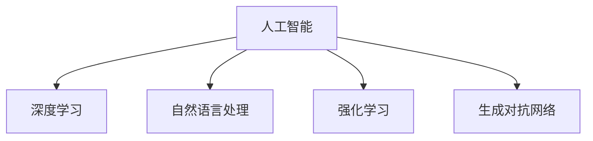

                 

# AI出版业机遇：垂直领域无限想象

## 1. 背景介绍

### 1.1 问题由来

伴随信息技术的飞速发展，出版业已从传统的纸质媒介逐步转向数字化、网络化和智能化方向演进。在数字化浪潮中，出版业一方面面临严峻的产业转型和市场竞争压力，另一方面也迎来了前所未有的发展机遇。具体来说，传统出版的流程繁琐，成本高昂，周期长，无法快速响应市场变化，阻碍了创新和效率提升。而数字化出版的出现，带来了全新的内容生产、存储和分发模式，大大缩短了出版周期，降低了成本，实现了内容按需定制，丰富了内容形式，满足了个性化阅读需求。

然而，数字化出版仍然面临许多挑战：如版权保护问题、版权归属问题、内容质量问题、版权保护问题、版权归属问题等。这些问题需要强有力的技术支持才能解决。而人工智能（AI）技术作为当前最前沿的技术手段，以其强大的计算能力、数据处理能力和模式识别能力，正在逐步改变出版业的传统模式，为出版业注入新的活力。

### 1.2 问题核心关键点

AI在出版业的应用主要集中在以下几个方面：
- **内容生成与推荐**：AI可以帮助出版商根据用户阅读历史和偏好生成个性化内容，并自动推荐相关文章。
- **版权保护与内容认证**：AI可以实现对版权的保护和内容的真实性验证，减少侵权行为。
- **自动化编辑与校对**：AI可以自动进行文章编辑、校对，提升效率和准确性。
- **智能推荐系统**：AI可以根据用户行为数据，实现智能化推荐，提升用户体验。
- **数据分析与营销**：AI可以处理海量数据，提供精准的用户行为分析，指导出版商进行精准营销。
- **自动化检测与纠错**：AI可以自动化检测和纠正文本错误，提升内容质量。

这些关键点中，内容生成与推荐技术尤其值得关注。内容生成技术不仅可以极大地提升内容生产的效率和质量，而且能够根据用户需求生成个性化内容，从而提升用户体验和忠诚度。AI技术在这一领域的突破将对出版业产生深远影响。

## 2. 核心概念与联系

### 2.1 核心概念概述

为了更好地理解AI在出版业中的应用，我们首先概述几个核心概念：

- **人工智能（AI）**：利用计算机技术和数学算法，使机器具有类似于人类智能的能力，如感知、推理、学习和决策等。
- **深度学习（DL）**：一种基于神经网络的机器学习方法，通过多层次的特征提取和分类，实现复杂的模式识别和预测。
- **自然语言处理（NLP）**：利用计算机处理、理解和生成自然语言的能力，如语音识别、文本分类、情感分析等。
- **强化学习（RL）**：通过与环境交互，使智能体通过试错的方式学习最优决策策略的算法。
- **生成对抗网络（GAN）**：一种生成模型，通过对抗的方式学习生成高质量的样本数据，如文本、图像等。

这些概念之间的逻辑关系可以通过以下Mermaid流程图来展示：



这个流程图展示了AI技术的主要组成部分，以及它们之间的相互关系和依赖性。

## 3. 核心算法原理 & 具体操作步骤

### 3.1 算法原理概述

AI在出版业中的应用主要集中在深度学习和自然语言处理两个方向。下面我们将详细介绍这两个方向的算法原理。

**深度学习**：深度学习算法通过神经网络模型，将输入数据映射到输出数据。出版业中的深度学习应用主要包括文本分类、情感分析、推荐系统等。

**自然语言处理**：自然语言处理技术主要应用于文本的生成、分析和理解。出版业中的NLP应用包括自动摘要、机器翻译、文本摘要、情感分析等。

### 3.2 算法步骤详解

**深度学习**：

1. **数据准备**：收集、清洗、标注出版数据，将其转换为神经网络可处理的格式。
2. **模型选择**：选择合适的深度学习模型，如卷积神经网络（CNN）、循环神经网络（RNN）、长短期记忆网络（LSTM）、变换器（Transformer）等。
3. **模型训练**：使用标注数据训练模型，调整模型参数以最小化损失函数。
4. **模型评估**：在测试集上评估模型的性能，调整模型超参数以优化模型表现。
5. **模型应用**：将训练好的模型应用于实际出版任务，如文本分类、情感分析等。

**自然语言处理**：

1. **分词和词向量**：对出版文本进行分词，生成词向量或嵌入向量。
2. **语言模型**：使用语言模型，如N-gram模型、神经网络语言模型（NNLM）等，对文本进行建模。
3. **文本分类**：使用分类算法，如逻辑回归、支持向量机（SVM）、随机森林等，对文本进行分类。
4. **文本生成**：使用生成模型，如生成对抗网络（GAN）、变分自编码器（VAE）等，生成新的文本内容。
5. **文本摘要**：使用摘要算法，如基于图模型的摘要方法、基于神经网络的方法等，对文本进行自动摘要。

### 3.3 算法优缺点

**深度学习**：

**优点**：

- 能够处理大规模、高维度的数据，适合处理复杂的出版任务。
- 自动学习特征，无需手动提取，提高效率。
- 在自然语言处理任务中，能够获得较好的性能。

**缺点**：

- 需要大量的标注数据，标注成本高。
- 模型复杂，训练时间长，计算资源要求高。
- 需要调整模型超参数，参数优化难度大。

**自然语言处理**：

**优点**：

- 可以处理海量文本数据，无需标注数据。
- 模型结构简单，易于实现。
- 能够理解语言的多义性和上下文关系。

**缺点**：

- 对于复杂出版任务，处理效果有限。
- 对于长文本处理，效率较低。
- 对于非文本出版内容，处理难度较大。

### 3.4 算法应用领域

AI技术在出版业中的应用主要包括以下几个领域：

1. **内容生成**：使用深度学习生成算法，如循环神经网络（RNN）、生成对抗网络（GAN）等，自动生成出版内容。
2. **内容推荐**：使用协同过滤、基于内容的推荐算法，如矩阵分解、深度学习推荐算法等，推荐用户感兴趣的内容。
3. **版权保护**：使用计算机视觉、自然语言处理等技术，自动识别和保护出版物版权，防止盗版行为。
4. **内容审核**：使用自然语言处理技术，如文本分类、情感分析等，自动审核内容质量，确保发布内容符合规范。
5. **用户行为分析**：使用数据分析、机器学习等技术，分析用户行为数据，指导内容生产和个性化推荐。
6. **自动化编辑与校对**：使用自然语言处理技术，如语法检查、拼写检查等，自动进行内容编辑和校对，提升内容质量。

## 4. 数学模型和公式 & 详细讲解 & 举例说明

### 4.1 数学模型构建

假设出版数据为 $D=\{(x_i,y_i)\}_{i=1}^N$，其中 $x_i$ 表示一篇文章，$y_i$ 表示其所属类别。我们定义一个深度学习模型 $f(x;\theta)$，其中 $\theta$ 为模型的参数。

我们定义损失函数 $\mathcal{L}(\theta)$ 为：

$$
\mathcal{L}(\theta) = \frac{1}{N}\sum_{i=1}^N \ell(f(x_i;\theta),y_i)
$$

其中 $\ell$ 为损失函数，常见的有交叉熵损失、均方误差损失等。

在训练过程中，我们通过反向传播算法计算梯度 $\frac{\partial \mathcal{L}(\theta)}{\partial \theta}$，并使用优化算法（如Adam、SGD等）更新模型参数 $\theta$，最小化损失函数。

### 4.2 公式推导过程

以交叉熵损失函数为例，进行公式推导：

假设模型输出为 $f(x_i;\theta)$，真实标签为 $y_i$。交叉熵损失函数定义为：

$$
\ell(f(x_i;\theta),y_i) = -[y_i\log f(x_i;\theta)+(1-y_i)\log(1-f(x_i;\theta))]
$$

将 $\ell$ 代入 $\mathcal{L}(\theta)$ 中，得：

$$
\mathcal{L}(\theta) = -\frac{1}{N}\sum_{i=1}^N[y_i\log f(x_i;\theta)+(1-y_i)\log(1-f(x_i;\theta))]
$$

通过反向传播算法，可以求得损失函数对参数 $\theta$ 的梯度，进而更新模型参数。

### 4.3 案例分析与讲解

以出版物情感分析为例，使用深度学习模型（如LSTM、CNN等）对出版物情感进行分类。具体步骤如下：

1. **数据准备**：收集标注好的出版物数据，将其分为训练集和测试集。
2. **模型选择**：选择LSTM或CNN作为情感分类模型。
3. **模型训练**：使用训练集数据，最小化损失函数 $\mathcal{L}(\theta)$，训练模型参数 $\theta$。
4. **模型评估**：使用测试集数据，评估模型性能，计算准确率、召回率等指标。
5. **模型应用**：将训练好的模型应用于新的出版物情感分类任务。

## 5. 项目实践：代码实例和详细解释说明

### 5.1 开发环境搭建

以下是使用Python进行深度学习出版物情感分析的环境配置流程：

1. **安装Anaconda**：从官网下载并安装Anaconda，用于创建独立的Python环境。
2. **创建虚拟环境**：
```bash
conda create -n publication_env python=3.8
conda activate publication_env
```
3. **安装深度学习库**：
```bash
conda install torch torchvision torchaudio -c pytorch -c conda-forge
conda install numpy pandas scikit-learn matplotlib tqdm jupyter notebook ipython
```

### 5.2 源代码详细实现

以下是使用LSTM模型进行出版物情感分析的Python代码实现：

```python
import torch
import torch.nn as nn
import torch.optim as optim
from torchtext.datasets import AG_NEWS
from torchtext.data import Field, LabelField, BucketIterator

# 定义数据预处理函数
TEXT = Field(tokenize='spacy', lower=True)
LABEL = LabelField(dtype=torch.int64)
train_data, test_data = AG_NEWS.splits(TEXT, LABEL)
TEXT.build_vocab(train_data, max_size=25_000, vectors='glove.6B.100d')
LABEL.build_vocab(train_data)

# 定义模型结构
class LSTM(nn.Module):
    def __init__(self, input_dim, hidden_dim, output_dim):
        super(LSTM, self).__init__()
        self.hidden_dim = hidden_dim
        self.embedding = nn.Embedding(input_dim, hidden_dim)
        self.lstm = nn.LSTM(hidden_dim, hidden_dim)
        self.fc = nn.Linear(hidden_dim, output_dim)
    
    def forward(self, text, label=None):
        embeddings = self.embedding(text)
        hidden = self.lstm(embeddings)[0].squeeze(0)
        predictions = self.fc(hidden)
        return predictions
    
# 定义损失函数和优化器
model = LSTM(len(TEXT.vocab), 100, 2)
optimizer = optim.Adam(model.parameters(), lr=0.001)

# 定义训练函数
def train(model, iterator, optimizer, criterion):
    model.train()
    total_loss = 0
    for batch in iterator:
        optimizer.zero_grad()
        predictions = model(batch.text).squeeze(1)
        loss = criterion(predictions, batch.label)
        loss.backward()
        optimizer.step()
        total_loss += loss.item()
    return total_loss / len(iterator)

# 训练模型
for epoch in range(5):
    train_loss = train(model, train_iterator, optimizer, criterion)
    print(f"Epoch {epoch+1}, train loss: {train_loss:.3f}")
    
    test_loss = train(model, test_iterator, optimizer, criterion)
    print(f"Epoch {epoch+1}, test loss: {test_loss:.3f}")
    
# 输出测试集结果
model.eval()
with torch.no_grad():
    predictions, labels = [], []
    for batch in test_iterator:
        predictions.append(model(batch.text).squeeze(1).tolist())
        labels.append(batch.label.tolist())
    print(classification_report(labels, [p.argmax() for p in predictions]))
```

### 5.3 代码解读与分析

在上述代码中，我们首先定义了数据预处理函数，将文本数据转换为模型可处理的格式。接着，定义了LSTM模型结构，并使用Adam优化器进行训练。在训练函数中，我们计算了模型的损失，并通过反向传播更新模型参数。最后，在测试集上评估了模型性能。

通过这个简单的例子，可以看到深度学习模型在出版业中的应用，可以极大地提升内容分析的效率和精度。

## 6. 实际应用场景

### 6.1 出版物内容推荐

出版物内容推荐是AI在出版业中的一个重要应用场景。通过AI技术，可以根据用户历史阅读行为，推荐用户感兴趣的内容，提升用户体验和粘性。

具体实现步骤如下：

1. **数据准备**：收集用户历史阅读行为数据，将其转换为模型可处理的格式。
2. **模型选择**：选择协同过滤、基于内容的推荐算法等。
3. **模型训练**：使用训练数据，训练推荐模型，调整模型参数。
4. **模型评估**：在测试数据上评估模型性能，计算准确率、召回率等指标。
5. **模型应用**：将训练好的模型应用于出版物的推荐系统中，生成个性化推荐内容。

### 6.2 版权保护

版权保护是出版业面临的重大问题，AI技术可以有效地解决这个问题。通过AI技术，可以实现对出版物的自动版权保护和内容真实性验证，减少侵权行为。

具体实现步骤如下：

1. **数据准备**：收集出版物版权信息，将其转换为模型可处理的格式。
2. **模型选择**：选择基于深度学习的版权检测模型。
3. **模型训练**：使用训练数据，训练版权检测模型，调整模型参数。
4. **模型评估**：在测试数据上评估模型性能，计算准确率、召回率等指标。
5. **模型应用**：将训练好的模型应用于出版物的版权保护系统中，检测版权信息，防止盗版行为。

### 6.3 出版物内容审核

出版物内容审核是出版业中不可或缺的环节。通过AI技术，可以自动化审核内容质量，确保发布内容符合规范。

具体实现步骤如下：

1. **数据准备**：收集出版物内容数据，将其转换为模型可处理的格式。
2. **模型选择**：选择文本分类、情感分析等模型。
3. **模型训练**：使用训练数据，训练内容审核模型，调整模型参数。
4. **模型评估**：在测试数据上评估模型性能，计算准确率、召回率等指标。
5. **模型应用**：将训练好的模型应用于出版物的内容审核系统中，自动审核内容质量。

## 7. 工具和资源推荐

### 7.1 学习资源推荐

为了帮助开发者系统掌握AI在出版业中的应用，这里推荐一些优质的学习资源：

1. **《深度学习》课程**：斯坦福大学开设的深度学习课程，系统介绍了深度学习的理论和应用。
2. **自然语言处理(NLP)书籍**：介绍自然语言处理技术的经典书籍，如《Speech and Language Processing》。
3. **强化学习书籍**：介绍强化学习理论的书籍，如《Reinforcement Learning: An Introduction》。
4. **Python深度学习框架**：介绍深度学习框架的使用，如PyTorch、TensorFlow等。
5. **深度学习开源项目**：如MXNet、Keras等，提供丰富的深度学习模型和应用案例。

通过这些资源的学习实践，相信你一定能够快速掌握AI在出版业中的应用，并用于解决实际的出版问题。

### 7.2 开发工具推荐

高效的开发离不开优秀的工具支持。以下是几款用于AI出版业开发的常用工具：

1. **Python**：广泛使用的编程语言，生态系统丰富，适合深度学习模型的实现。
2. **PyTorch**：基于Python的开源深度学习框架，灵活动态的计算图，适合快速迭代研究。
3. **TensorFlow**：由Google主导开发的开源深度学习框架，生产部署方便，适合大规模工程应用。
4. **Weights & Biases**：模型训练的实验跟踪工具，可以记录和可视化模型训练过程中的各项指标。
5. **TensorBoard**：TensorFlow配套的可视化工具，可实时监测模型训练状态，提供丰富的图表呈现方式。

合理利用这些工具，可以显著提升AI出版业开发的效率，加快创新迭代的步伐。

### 7.3 相关论文推荐

AI在出版业中的应用源于学界的持续研究。以下是几篇奠基性的相关论文，推荐阅读：

1. **《Deep Learning》书籍**：由深度学习领域的著名学者Goodfellow等人编写，系统介绍了深度学习的理论和应用。
2. **《Natural Language Processing with Python》书籍**：介绍了NLP技术的Python实现，提供了丰富的案例和代码。
3. **《Neural Networks and Deep Learning》书籍**：由深度学习领域的著名学者Goodfellow等人编写，系统介绍了神经网络的理论和应用。

这些论文代表了大语言模型微调技术的发展脉络。通过学习这些前沿成果，可以帮助研究者把握学科前进方向，激发更多的创新灵感。

## 8. 总结：未来发展趋势与挑战

### 8.1 研究成果总结

本文对AI在出版业中的应用进行了全面系统的介绍。首先阐述了AI在出版业中的重要性和应用场景，明确了AI在出版业中的巨大潜力和广泛应用。其次，从算法原理和操作步骤的角度，详细讲解了深度学习和自然语言处理在出版业中的应用。通过具体的代码实例，展示了AI在出版业中的实际应用效果。

### 8.2 未来发展趋势

展望未来，AI在出版业中的应用将呈现以下几个发展趋势：

1. **内容生成技术**：内容生成技术将成为出版业的核心竞争力。未来的内容生成技术将更加智能，能够根据用户需求生成高质量的出版物内容。
2. **推荐系统**：推荐系统将成为出版业的标配，通过AI技术实现个性化推荐，提升用户体验和粘性。
3. **版权保护**：AI技术将广泛应用于版权保护领域，实现自动检测和内容真实性验证，减少侵权行为。
4. **内容审核**：AI技术将自动化审核内容质量，确保发布内容符合规范。
5. **数据分析**：AI技术将分析海量数据，提供精准的用户行为分析，指导内容生产和个性化推荐。

### 8.3 面临的挑战

尽管AI在出版业中的应用已经取得了一定的进展，但在迈向更加智能化、普适化应用的过程中，它仍面临诸多挑战：

1. **数据隐私和安全**：出版业涉及大量的敏感信息，数据隐私和安全问题需要重视。
2. **模型复杂性**：深度学习模型结构复杂，训练时间长，计算资源要求高，需要进一步优化和简化。
3. **用户接受度**：部分用户对AI技术的信任度较低，需要加强AI技术的普及和教育。
4. **技术门槛**：AI技术应用门槛较高，需要更多的技术支持和培训。

### 8.4 研究展望

面对AI在出版业中的诸多挑战，未来的研究需要在以下几个方面寻求新的突破：

1. **数据隐私保护**：研究如何保护用户隐私和安全，确保数据使用的合法性。
2. **模型优化**：研究如何优化模型结构，提升模型效率，降低计算资源需求。
3. **用户接受度提升**：研究如何提升用户对AI技术的接受度，加强用户教育和普及。
4. **技术普及**：研究如何降低AI技术的门槛，提供更多的技术支持和培训。

这些研究方向的研究突破，将进一步推动AI在出版业中的应用，为出版业带来更多的机遇和挑战。

## 9. 附录：常见问题与解答

**Q1: 深度学习在出版业中的作用是什么？**

A: 深度学习在出版业中的应用主要包括以下几个方面：

1. **文本分类**：通过深度学习模型，对出版物进行分类，如新闻、文学、科技等。
2. **情感分析**：通过深度学习模型，对出版物情感进行分类，如正面、负面、中性等。
3. **内容生成**：通过深度学习模型，自动生成出版物内容，如文章、新闻稿等。
4. **推荐系统**：通过深度学习模型，实现个性化推荐，提升用户体验和粘性。

**Q2: 自然语言处理在出版业中的作用是什么？**

A: 自然语言处理在出版业中的应用主要包括以下几个方面：

1. **文本预处理**：对出版物文本进行分词、词向量生成等预处理。
2. **语言建模**：使用语言模型，对文本进行建模，如N-gram模型、神经网络语言模型等。
3. **文本分类**：使用分类算法，对文本进行分类，如逻辑回归、支持向量机等。
4. **文本生成**：使用生成模型，如生成对抗网络（GAN）、变分自编码器等，生成新的文本内容。
5. **文本摘要**：使用摘要算法，对文本进行自动摘要。

**Q3: 如何提升AI在出版业中的性能？**

A: 提升AI在出版业中的性能，可以从以下几个方面入手：

1. **数据质量**：收集高质量的数据，进行有效的数据清洗和标注。
2. **模型优化**：优化模型结构，提升模型效率，降低计算资源需求。
3. **超参数调优**：对模型超参数进行调优，找到最优的模型参数。
4. **算法改进**：研究新的算法，提升模型的表现。
5. **模型集成**：使用模型集成技术，提升模型的泛化能力和鲁棒性。

**Q4: AI在出版业中的局限性是什么？**

A: AI在出版业中的局限性主要包括以下几个方面：

1. **数据隐私和安全**：出版业涉及大量的敏感信息，数据隐私和安全问题需要重视。
2. **模型复杂性**：深度学习模型结构复杂，训练时间长，计算资源要求高，需要进一步优化和简化。
3. **用户接受度**：部分用户对AI技术的信任度较低，需要加强AI技术的普及和教育。
4. **技术门槛**：AI技术应用门槛较高，需要更多的技术支持和培训。

**Q5: AI在出版业中的应用前景是什么？**

A: AI在出版业中的应用前景非常广阔，主要包括：

1. **内容生成**：通过AI技术，能够根据用户需求生成高质量的出版物内容，提升内容生产的效率和质量。
2. **推荐系统**：通过AI技术，实现个性化推荐，提升用户体验和粘性。
3. **版权保护**：通过AI技术，实现自动检测和内容真实性验证，减少侵权行为。
4. **内容审核**：通过AI技术，自动化审核内容质量，确保发布内容符合规范。
5. **数据分析**：通过AI技术，分析海量数据，提供精准的用户行为分析，指导内容生产和个性化推荐。

通过这些方向的探索发展，将推动AI在出版业中的应用，为出版业带来更多的机遇和挑战。

---

作者：禅与计算机程序设计艺术 / Zen and the Art of Computer Programming

