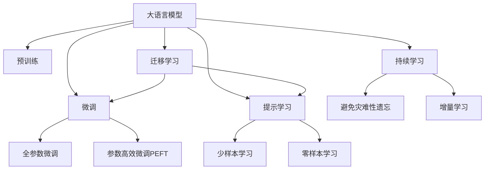

                 

# AI函数调用：LLM如何扩展自身能力

## 1. 背景介绍

近年来，人工智能(AI)技术发展迅猛，尤其是在自然语言处理(NLP)领域，大语言模型(LLM)展现出了惊人的能力。这些模型通过在大型无标签数据集上进行预训练，学习到了丰富的语言表示，具备了理解、生成自然语言的能力。然而，这些模型通常较为通用，无法直接处理特定领域的复杂任务。为了解决这一问题，AI函数调用的概念应运而生，使LLM能够通过调用特定领域的API函数来扩展自身能力，解决领域特定的问题。

### 1.1 问题由来

尽管大语言模型在大规模文本数据上展现了卓越的性能，但在特定领域的应用中，它们往往表现不佳。这主要是因为大语言模型通常过于通用，缺乏领域特定的知识。例如，在医学领域，即使是通用语言模型也难以正确理解病人的症状和疾病，提供准确的医疗建议。

为了克服这一问题，研究者们开始探索如何让LLM具备特定领域的能力。AI函数调用是一种有效的方式，通过调用特定领域的API函数，LLM能够快速获取领域知识，提升其在特定任务上的表现。

### 1.2 问题核心关键点

AI函数调用的核心在于如何让LLM能够动态调用特定领域的API函数，并根据返回结果进行后续处理。这一过程通常包括以下几个步骤：

1. **API函数选择**：根据任务需求，选择合适的API函数。
2. **输入生成**：将自然语言输入转换为API函数所需的格式。
3. **函数调用**：将输入传入API函数，获取返回结果。
4. **结果处理**：根据返回结果生成最终的输出。

AI函数调用能够使LLM灵活应对各种领域任务，提升模型在特定场景下的性能。同时，它也带来了新的挑战，如API函数选择、输入格式转换、结果处理等，需要研究者进行深入探索。

### 1.3 问题研究意义

研究AI函数调用的方法，对于拓展大语言模型的应用范围，提升其在特定领域的能力，具有重要意义：

1. **降低开发成本**：利用现有API函数，可以大幅减少从头开发所需的时间和成本。
2. **提升性能**：调用特定领域的API函数，使得LLM能够获取领域知识，提升其在特定任务上的表现。
3. **加速开发进度**：standing on the shoulders of giants，通过调用API函数可以快速构建应用系统，缩短开发周期。
4. **带来技术创新**：AI函数调用技术催生了提示学习、少样本学习等新的研究方向，推动了NLP技术的发展。
5. **赋能行业应用**：AI函数调用使得NLP技术更容易被各行各业所采用，为传统行业数字化转型升级提供新的技术路径。

## 2. 核心概念与联系

### 2.1 核心概念概述

为了更好地理解AI函数调用的原理和应用，本节将介绍几个关键概念：

- **大语言模型(LLM)**：以自回归(如GPT)或自编码(如BERT)模型为代表的大规模预训练语言模型。通过在大规模无标签文本数据上进行预训练，学习到了丰富的语言知识，具备强大的语言理解和生成能力。

- **API函数**：应用编程接口函数，提供特定领域的功能和服务。通过调用API函数，LLM能够获取领域知识，解决特定问题。

- **提示学习(Prompt Learning)**：通过在输入文本中添加提示模板(Prompt Template)，引导LLM进行特定任务的推理和生成。可以在不更新模型参数的情况下，实现零样本或少样本学习。

- **少样本学习(Few-shot Learning)**：指在只有少量标注样本的情况下，模型能够快速适应新任务的学习方法。在大语言模型中，通常通过在输入中提供少量示例来实现，无需更新模型参数。

- **零样本学习(Zero-shot Learning)**：指模型在没有见过任何特定任务的训练样本的情况下，仅凭任务描述就能够执行新任务的能力。大语言模型通过预训练获得的广泛知识，使其能够理解任务指令并生成相应输出。

- **迁移学习(Transfer Learning)**：指将一个领域学习到的知识，迁移应用到另一个不同但相关的领域的学习范式。大模型的预训练-微调过程即是一种典型的迁移学习方式。

- **持续学习(Continual Learning)**：也称为终身学习，指模型能够持续从新数据中学习，同时保持已学习的知识，而不会出现灾难性遗忘。这对于保持大语言模型的时效性和适应性至关重要。

这些概念之间的逻辑关系可以通过以下Mermaid流程图来展示：



这个流程图展示了大语言模型的核心概念及其之间的关系：

1. 大语言模型通过预训练获得基础能力。
2. 微调是对预训练模型进行任务特定的优化，可以分为全参数微调和参数高效微调（PEFT）。
3. 提示学习是一种不更新模型参数的方法，可以实现少样本学习和零样本学习。
4. 迁移学习是连接预训练模型与下游任务的桥梁，可以通过微调或提示学习来实现。
5. 持续学习旨在使模型能够不断学习新知识，同时避免遗忘旧知识。

这些概念共同构成了大语言模型的学习和应用框架，使其能够在各种场景下发挥强大的语言理解和生成能力。通过理解这些核心概念，我们可以更好地把握大语言模型的工作原理和优化方向。

## 3. 核心算法原理 & 具体操作步骤
### 3.1 算法原理概述

AI函数调用的核心思想是：将大语言模型作为输入输出处理器，通过调用特定领域的API函数，获取领域知识，解决特定问题。在API函数选择、输入格式转换、结果处理等环节，大语言模型都需要进行逻辑推理和处理。

具体而言，AI函数调用过程通常包括以下几个关键步骤：

1. **API函数选择**：根据任务需求，选择合适的API函数。
2. **输入生成**：将自然语言输入转换为API函数所需的格式。
3. **函数调用**：将输入传入API函数，获取返回结果。
4. **结果处理**：根据返回结果生成最终的输出。

### 3.2 算法步骤详解

以下是AI函数调用的详细步骤：

**Step 1: API函数选择**
- 根据任务需求，选择合适的API函数。例如，在医疗领域，可以选择OpenAPI-Medical提供的API函数，如疾病诊断、药物推荐等。

**Step 2: 输入生成**
- 将自然语言输入转换为API函数所需的格式。例如，将病人的症状和病史转换为API函数所需的数据结构。

**Step 3: 函数调用**
- 将转换后的输入传入API函数，获取返回结果。例如，调用疾病诊断API函数，获取病人的诊断结果。

**Step 4: 结果处理**
- 根据API函数的返回结果，生成最终的输出。例如，将诊断结果和相关建议整合为易于理解的文本回复。

### 3.3 算法优缺点

AI函数调用的优点：

1. **灵活性高**：通过调用不同领域的API函数，LLM能够应对各种特定领域的任务，提升模型在特定场景下的表现。
2. **易于集成**：API函数通常提供了标准化的接口和文档，便于开发者集成和使用。
3. **快速迭代**：通过调用API函数，可以快速构建和部署应用系统，缩短开发周期。
4. **减少标注成本**：许多API函数提供了预训练模型或训练数据，可以大幅降低标注成本。

AI函数调用的缺点：

1. **依赖外部资源**：依赖外部API函数，难以完全自主地解决特定领域的问题。
2. **效率问题**：API函数调用可能会增加系统的开销，影响系统的响应速度。
3. **结果依赖性**：API函数的结果依赖外部资源，存在数据不完整、质量不高等风险。
4. **安全风险**：API函数调用可能涉及敏感数据，存在数据泄露和滥用的风险。

### 3.4 算法应用领域

AI函数调用在NLP领域得到了广泛的应用，主要包括以下几个方面：

- **医疗问答**：利用API函数，LLM可以回答患者的医疗问题，提供初步的医疗建议。
- **法律咨询**：调用法律领域的API函数，LLM可以提供法律咨询服务，解答常见法律问题。
- **金融理财**：通过调用金融领域的API函数，LLM可以提供投资建议、风险评估等服务。
- **教育辅导**：利用API函数，LLM可以提供个性化学习资源推荐、答疑服务等。
- **智能客服**：调用客户服务领域的API函数，LLM可以提供自动化客服解决方案，提升客户满意度。

除了这些应用外，AI函数调用还可以用于多模态信息处理、自然语言生成等领域，为NLP技术带来更多创新和突破。

## 4. 数学模型和公式 & 详细讲解 & 举例说明

### 4.1 数学模型构建

本节将使用数学语言对AI函数调用的过程进行更加严格的刻画。

假设大语言模型为 $M_{\theta}$，API函数为 $F$，输入为 $x$，输出为 $y$，则AI函数调用的数学模型可以表示为：

$$
y = F(M_{\theta}(x))
$$

其中 $F$ 表示API函数，$M_{\theta}$ 表示大语言模型，$x$ 表示输入，$y$ 表示输出。API函数的输入输出格式和参数调用方式通常已经定义好，因此 $F$ 可以视为一个黑盒函数，其内部实现对大语言模型透明。

### 4.2 公式推导过程

以下我们以医疗问答为例，推导AI函数调用的数学过程。

假设API函数为疾病诊断，输入为病人的症状和病史 $x$，输出为诊断结果 $y$。则API调用的数学模型可以表示为：

$$
y = F(M_{\theta}(x))
$$

其中 $M_{\theta}$ 为大语言模型，$x$ 为病人的症状和病史，$y$ 为诊断结果。API函数 $F$ 的实现细节通常已经定义好，其输入输出格式和参数调用方式通常已经固定。

在API调用过程中，大语言模型 $M_{\theta}$ 的作用是生成API函数所需的输入。以医疗诊断为例，大语言模型需要根据病人的症状和病史，生成符合API函数输入格式的字符串或JSON格式的数据。假设API函数需要病人症状和病史的文本描述，则大语言模型的输出可以表示为：

$$
x' = M_{\theta}(x)
$$

其中 $x'$ 为API函数所需的输入格式，$x$ 为原始输入。例如，可以将病人的症状和病史转换为JSON格式的数据：

$$
x' = \{\text{症状描述: "头痛、呕吐"}, \text{病史描述: "有高血压病史"}\}
$$

得到 $x'$ 后，API函数 $F$ 根据 $x'$ 进行诊断，返回诊断结果 $y$：

$$
y = F(x')
$$

将 $y$ 作为最终输出，返回给用户。

### 4.3 案例分析与讲解

假设我们有一个医疗问答系统的API函数，该函数可以接收病人的症状和病史，返回初步的诊断结果。在API调用过程中，大语言模型可以生成符合API函数输入格式的字符串或JSON格式的数据。例如，输入为病人的症状和病史：

$$
x = \{\text{症状描述: "头痛、呕吐"}, \text{病史描述: "有高血压病史"}\}
$$

大语言模型可以将其转换为JSON格式的数据：

$$
x' = \{\text{症状描述: "头痛、呕吐"}, \text{病史描述: "有高血压病史"}\}
$$

然后调用API函数进行诊断，返回诊断结果：

$$
y = F(x')
$$

最终将诊断结果作为输出，返回给用户。

## 5. 项目实践：代码实例和详细解释说明
### 5.1 开发环境搭建

在进行AI函数调用的实践前，我们需要准备好开发环境。以下是使用Python进行PyTorch开发的环境配置流程：

1. 安装Anaconda：从官网下载并安装Anaconda，用于创建独立的Python环境。

2. 创建并激活虚拟环境：
```bash
conda create -n pytorch-env python=3.8 
conda activate pytorch-env
```

3. 安装PyTorch：根据CUDA版本，从官网获取对应的安装命令。例如：
```bash
conda install pytorch torchvision torchaudio cudatoolkit=11.1 -c pytorch -c conda-forge
```

4. 安装API函数库：
```bash
pip install requests
```

5. 安装各类工具包：
```bash
pip install numpy pandas scikit-learn matplotlib tqdm jupyter notebook ipython
```

完成上述步骤后，即可在`pytorch-env`环境中开始API函数调用的实践。

### 5.2 源代码详细实现

这里我们以调用OpenAPI-Medical提供的API函数为例，展示如何使用PyTorch进行AI函数调用。

首先，定义API函数调用函数：

```python
import requests

def call_api(api_url, input_data):
    headers = {'Content-Type': 'application/json'}
    response = requests.post(api_url, json=input_data, headers=headers)
    return response.json()
```

然后，定义医疗问答系统的API函数：

```python
def medical_consultation(question):
    api_url = 'https://api.openapi-medical.com/diagnosis'
    input_data = {
        'question': question
    }
    result = call_api(api_url, input_data)
    return result
```

最后，测试API函数调用的过程：

```python
print(medical_consultation("我有头痛和呕吐的症状，请帮我诊断一下"))
```

在这个示例中，我们首先定义了一个API函数调用函数 `call_api`，该函数通过requests库向指定的API URL发送POST请求，并将输入数据以JSON格式发送。API函数返回的JSON数据将被解析并返回。

然后，我们定义了一个医疗问答系统的API函数 `medical_consultation`，该函数接收病人的症状描述作为输入，调用API函数进行诊断，并返回诊断结果。

最后，我们测试了API函数调用的过程，将病人的症状描述作为输入，获取诊断结果。

### 5.3 代码解读与分析

让我们再详细解读一下关键代码的实现细节：

**call_api函数**：
- 该函数接收API URL和输入数据，使用requests库向API发送POST请求。
- 设置请求头为JSON格式，发送JSON格式的输入数据。
- 获取API函数的返回结果，并解析为Python字典。
- 返回解析后的JSON数据。

**medical_consultation函数**：
- 该函数接收病人的症状描述作为输入。
- 调用医疗问答系统的API函数，将症状描述作为输入，获取诊断结果。
- 返回诊断结果。

**测试部分**：
- 调用 `medical_consultation` 函数，输入病人的症状描述，获取诊断结果。

可以看到，通过简单的API函数调用，大语言模型能够灵活应对各种特定领域的任务，提升其在特定场景下的表现。

## 6. 实际应用场景
### 6.1 智能客服系统

基于AI函数调用的对话技术，可以广泛应用于智能客服系统的构建。传统客服往往需要配备大量人力，高峰期响应缓慢，且一致性和专业性难以保证。而使用AI函数调用的对话模型，可以7x24小时不间断服务，快速响应客户咨询，用自然流畅的语言解答各类常见问题。

在技术实现上，可以收集企业内部的历史客服对话记录，将问题和最佳答复构建成监督数据，在此基础上对预训练对话模型进行微调。微调后的对话模型能够自动理解用户意图，匹配最合适的答案模板进行回复。对于客户提出的新问题，还可以接入检索系统实时搜索相关内容，动态组织生成回答。如此构建的智能客服系统，能大幅提升客户咨询体验和问题解决效率。

### 6.2 金融舆情监测

金融机构需要实时监测市场舆论动向，以便及时应对负面信息传播，规避金融风险。传统的人工监测方式成本高、效率低，难以应对网络时代海量信息爆发的挑战。基于AI函数调用的文本分类和情感分析技术，为金融舆情监测提供了新的解决方案。

具体而言，可以收集金融领域相关的新闻、报道、评论等文本数据，并对其进行主题标注和情感标注。在此基础上对预训练语言模型进行微调，使其能够自动判断文本属于何种主题，情感倾向是正面、中性还是负面。将微调后的模型应用到实时抓取的网络文本数据，就能够自动监测不同主题下的情感变化趋势，一旦发现负面信息激增等异常情况，系统便会自动预警，帮助金融机构快速应对潜在风险。

### 6.3 个性化推荐系统

当前的推荐系统往往只依赖用户的历史行为数据进行物品推荐，无法深入理解用户的真实兴趣偏好。基于AI函数调用的个性化推荐系统可以更好地挖掘用户行为背后的语义信息，从而提供更精准、多样的推荐内容。

在实践中，可以收集用户浏览、点击、评论、分享等行为数据，提取和用户交互的物品标题、描述、标签等文本内容。将文本内容作为模型输入，用户的后续行为（如是否点击、购买等）作为监督信号，在此基础上微调预训练语言模型。微调后的模型能够从文本内容中准确把握用户的兴趣点。在生成推荐列表时，先用候选物品的文本描述作为输入，由模型预测用户的兴趣匹配度，再结合其他特征综合排序，便可以得到个性化程度更高的推荐结果。

### 6.4 未来应用展望

随着AI函数调用的不断发展，其在NLP领域的应用前景广阔。未来，AI函数调用将助力更多行业实现智能化转型，带来新的应用场景和商业模式。

在智慧医疗领域，基于AI函数调用的医疗问答、病历分析、药物研发等应用将提升医疗服务的智能化水平，辅助医生诊疗，加速新药开发进程。

在智能教育领域，AI函数调用的个性化推荐、学情分析、知识推荐等功能，将因材施教，促进教育公平，提高教学质量。

在智慧城市治理中，AI函数调用的事件监测、舆情分析、应急指挥等功能，将提高城市管理的自动化和智能化水平，构建更安全、高效的未来城市。

此外，在企业生产、社会治理、文娱传媒等众多领域，基于AI函数调用的AI应用也将不断涌现，为经济社会发展注入新的动力。相信随着技术的日益成熟，AI函数调用将逐渐成为NLP领域的重要范式，推动人工智能技术在垂直行业的规模化落地。

## 7. 工具和资源推荐
### 7.1 学习资源推荐

为了帮助开发者系统掌握AI函数调用的理论基础和实践技巧，这里推荐一些优质的学习资源：

1. 《AI函数调用的原理与实践》系列博文：由大模型技术专家撰写，深入浅出地介绍了AI函数调用的原理、应用和最佳实践。

2. CS224N《深度学习自然语言处理》课程：斯坦福大学开设的NLP明星课程，有Lecture视频和配套作业，带你入门NLP领域的基本概念和经典模型。

3. 《Natural Language Processing with Transformers》书籍：Transformers库的作者所著，全面介绍了如何使用Transformers库进行NLP任务开发，包括AI函数调用在内的诸多范式。

4. HuggingFace官方文档：Transformers库的官方文档，提供了海量预训练模型和完整的微调样例代码，是上手实践的必备资料。

5. CLUE开源项目：中文语言理解测评基准，涵盖大量不同类型的中文NLP数据集，并提供了基于AI函数调用的baseline模型，助力中文NLP技术发展。

通过对这些资源的学习实践，相信你一定能够快速掌握AI函数调用的精髓，并用于解决实际的NLP问题。
###  7.2 开发工具推荐

高效的开发离不开优秀的工具支持。以下是几款用于AI函数调用的开发工具：

1. PyTorch：基于Python的开源深度学习框架，灵活动态的计算图，适合快速迭代研究。大部分预训练语言模型都有PyTorch版本的实现。

2. TensorFlow：由Google主导开发的开源深度学习框架，生产部署方便，适合大规模工程应用。同样有丰富的预训练语言模型资源。

3. Transformers库：HuggingFace开发的NLP工具库，集成了众多SOTA语言模型，支持PyTorch和TensorFlow，是进行AI函数调用任务的开发利器。

4. Weights & Biases：模型训练的实验跟踪工具，可以记录和可视化模型训练过程中的各项指标，方便对比和调优。与主流深度学习框架无缝集成。

5. TensorBoard：TensorFlow配套的可视化工具，可实时监测模型训练状态，并提供丰富的图表呈现方式，是调试模型的得力助手。

6. Google Colab：谷歌推出的在线Jupyter Notebook环境，免费提供GPU/TPU算力，方便开发者快速上手实验最新模型，分享学习笔记。

合理利用这些工具，可以显著提升AI函数调用的开发效率，加快创新迭代的步伐。

### 7.3 相关论文推荐

AI函数调用的发展源于学界的持续研究。以下是几篇奠基性的相关论文，推荐阅读：

1. "Can Language Models be Trained Like Humans?"：探讨如何通过提示学习(Prompt-based Learning)，使语言模型具备类似人类的推理能力，从而提升AI函数调用的效果。

2. "Prompt Engineering for Multi-modal Tasks"：研究如何设计高效的提示模板，提升AI函数调用的多模态信息处理能力。

3. "Few-shot Learning in AI"：探讨如何在只有少量标注样本的情况下，通过AI函数调用，快速适应新任务的学习方法。

4. "Zero-shot Learning with Language Models"：研究AI函数调用在零样本学习中的表现，及其与预训练模型的结合方式。

5. "Continual Learning for AI"：研究如何在不断变化的数据分布下，保持AI函数调用的性能，避免灾难性遗忘。

这些论文代表了大语言模型AI函数调用的发展脉络。通过学习这些前沿成果，可以帮助研究者把握学科前进方向，激发更多的创新灵感。

## 8. 总结：未来发展趋势与挑战

### 8.1 总结

本文对AI函数调用的方法进行了全面系统的介绍。首先阐述了AI函数调用的背景和意义，明确了其在拓展大语言模型应用、提升特定任务性能方面的独特价值。其次，从原理到实践，详细讲解了AI函数调用的数学原理和关键步骤，给出了AI函数调用任务开发的完整代码实例。同时，本文还广泛探讨了AI函数调用在智能客服、金融舆情、个性化推荐等多个行业领域的应用前景，展示了其巨大的潜力。此外，本文精选了AI函数调用的各类学习资源，力求为读者提供全方位的技术指引。

通过本文的系统梳理，可以看到，AI函数调用的方法正在成为NLP领域的重要范式，极大地拓展了预训练语言模型的应用边界，催生了更多的落地场景。受益于大规模语料的预训练和API函数的强大能力，AI函数调用为NLP技术带来了新的突破，帮助大语言模型更好地解决特定领域的问题。未来，随着API函数的不断丰富和优化，AI函数调用技术将进一步提升NLP系统的性能和应用范围，为人类认知智能的进化带来深远影响。

### 8.2 未来发展趋势

展望未来，AI函数调用的发展趋势如下：

1. **API函数的丰富和优化**：API函数库将不断丰富和优化，涵盖更多特定领域的任务和功能。API函数的性能和稳定性也将不断提升，满足复杂应用的需求。

2. **多模态AI函数调用**：AI函数调用将不仅仅局限于文本处理，还将扩展到图像、视频、语音等多模态数据处理，实现视觉、语音等多模态信息与文本信息的协同建模。

3. **融合其他AI技术**：AI函数调用将与其他AI技术进行更深入的融合，如知识表示、因果推理、强化学习等，多路径协同发力，共同推动自然语言理解和智能交互系统的进步。

4. **增强可解释性**：AI函数调用的结果可解释性将成为研究重点，通过引入因果分析方法、博弈论工具等，增强模型决策的逻辑性和可理解性。

5. **加强数据保护**：API函数调用过程中涉及敏感数据的传输和处理，数据保护和安全将成为研究重点，确保数据安全性和隐私保护。

6. **增强跨领域适应性**：AI函数调用将增强对不同领域的适应性，提升模型在不同领域的表现，降低对特定领域数据和知识的依赖。

7. **提升计算效率**：API函数调用的计算效率将成为研究重点，通过优化计算图、减少计算量等方法，提升系统的响应速度和处理能力。

8. **增强自动化和智能化**：AI函数调用将增强自动化的程度，使模型能够自主选择API函数、处理输入输出，提升系统的智能化水平。

这些趋势凸显了AI函数调用的广阔前景。这些方向的探索发展，必将进一步提升大语言模型的性能和应用范围，为构建智能系统带来新的突破。

### 8.3 面临的挑战

尽管AI函数调用已经取得了显著进展，但在迈向更加智能化、普适化应用的过程中，它仍面临诸多挑战：

1. **依赖外部资源**：依赖外部API函数，难以完全自主地解决特定领域的问题，存在数据不完整、质量不高等风险。
2. **效率问题**：API函数调用可能会增加系统的开销，影响系统的响应速度和处理能力。
3. **结果依赖性**：API函数的结果依赖外部资源，存在数据不完整、质量不高等风险。
4. **安全风险**：API函数调用过程中涉及敏感数据的传输和处理，数据泄露和滥用的风险不容忽视。
5. **可解释性不足**：AI函数调用结果缺乏可解释性，难以理解模型决策的逻辑和依据。
6. **数据分布变化**：API函数调用过程中，数据分布的变化可能导致模型性能下降。

### 8.4 研究展望

面对AI函数调用所面临的挑战，未来的研究需要在以下几个方面寻求新的突破：

1. **开发更多领域API函数**：进一步丰富和优化API函数库，涵盖更多特定领域的任务和功能。
2. **优化API函数调用过程**：优化API函数的选择、输入输出格式转换、结果处理等环节，提高系统的响应速度和处理能力。
3. **增强可解释性**：通过引入因果分析方法、博弈论工具等，增强模型决策的逻辑性和可理解性。
4. **保护数据安全**：在API函数调用过程中，加强数据保护和安全措施，确保数据安全性和隐私保护。
5. **提升计算效率**：通过优化计算图、减少计算量等方法，提升系统的响应速度和处理能力。
6. **增强跨领域适应性**：增强AI函数调用的跨领域适应性，提升模型在不同领域的表现，降低对特定领域数据和知识的依赖。

这些研究方向的探索，必将引领AI函数调用技术迈向更高的台阶，为构建安全、可靠、可解释、可控的智能系统铺平道路。面向未来，AI函数调用技术还需要与其他人工智能技术进行更深入的融合，共同推动自然语言理解和智能交互系统的进步。只有勇于创新、敢于突破，才能不断拓展语言模型的边界，让智能技术更好地造福人类社会。

## 9. 附录：常见问题与解答

**Q1：AI函数调用是否适用于所有NLP任务？**

A: AI函数调用在大多数NLP任务上都能取得不错的效果，特别是对于数据量较小的任务。但对于一些特定领域的任务，如医学、法律等，仅仅依靠通用语料预训练的模型可能难以很好地适应。此时需要在特定领域语料上进一步预训练，再进行调用。此外，对于一些需要时效性、个性化很强的任务，如对话、推荐等，AI函数调用方法也需要针对性的改进优化。

**Q2：如何进行API函数选择？**

A: API函数的选择需要根据具体任务需求，选择合适的API函数。例如，在医疗领域，可以选择OpenAPI-Medical提供的API函数，如疾病诊断、药物推荐等。在金融领域，可以选择OpenAPI-Finance提供的API函数，如股市分析、投资建议等。在选择API函数时，需要考虑其功能的完备性、性能的稳定性、数据的可靠性等因素。

**Q3：如何优化API函数调用过程？**

A: 优化API函数调用过程，可以通过以下方法实现：
1. 数据预处理：将输入数据进行清洗和标准化处理，确保API函数能够正确处理。
2. 函数调参：通过调整API函数的参数，优化其性能和稳定性。
3. 缓存机制：使用缓存机制，避免重复调用API函数，减少系统开销。
4. 异步调用：采用异步调用的方式，提高系统的响应速度和吞吐量。
5. 结果后处理：对API函数的返回结果进行后处理，确保结果的准确性和可靠性。

**Q4：AI函数调用结果的可解释性如何提升？**

A: 提升AI函数调用结果的可解释性，可以通过以下方法实现：
1. 引入因果分析方法：通过因果分析方法，解释模型决策的因果逻辑，增强结果的可解释性。
2. 使用博弈论工具：通过博弈论工具，分析人机交互过程中的策略和行为，解释模型决策的依据。
3. 多模型融合：通过多模型融合，综合不同模型的决策结果，提供更全面、可靠的结果解释。
4. 引入专家知识：在模型训练过程中，引入专家知识，提升模型对特定领域的理解能力，增强结果的可解释性。

**Q5：如何确保API函数调用的安全性？**

A: 确保API函数调用的安全性，可以通过以下方法实现：
1. 数据加密：对输入数据和API函数返回结果进行加密处理，防止数据泄露。
2. 访问控制：通过访问控制机制，限制API函数的访问权限，防止未授权访问。
3. 异常检测：实时监测API函数调用过程中的异常行为，防止恶意攻击和滥用。
4. 安全审计：定期进行安全审计，检查API函数调用的安全性，及时发现和修复安全漏洞。

这些措施可以有效提升API函数调用的安全性，保障数据和系统的安全。

---

作者：禅与计算机程序设计艺术 / Zen and the Art of Computer Programming

