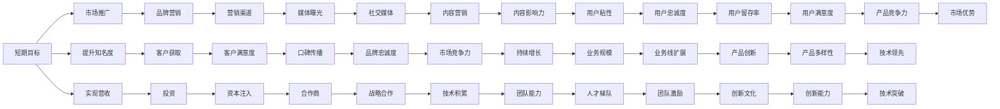

                 

## 1. 背景介绍

### 1.1 问题由来

在AI创业公司中，平衡短期与长期目标是一个永恒的话题。这不仅仅是策略问题，更关乎公司的生存和发展。随着AI技术的快速发展，越来越多的公司进入了这个领域，但并不是每个AI创业公司都能成功。其中，很多公司在初期获得了巨大的市场关注和资金支持，但在长期的运营和发展中却遭遇了挫折。这背后的原因有很多，但其中一个重要因素就是短期目标和长期目标的平衡问题。

### 1.2 问题核心关键点

1. **短期目标**：
   - 快速扩张市场份额
   - 实现营收增长
   - 提升品牌知名度
   - 获得投资

2. **长期目标**：
   - 产品技术积累
   - 团队能力和文化建设
   - 创新能力的提升
   - 产品线的扩展

3. **平衡点**：如何在追求短期目标的同时，不失对长期目标的关注和投入。

## 2. 核心概念与联系

### 2.1 核心概念概述

- **短期目标**：指公司希望在短期内实现的目标，如快速市场扩张、营收增长、品牌推广等。这些目标通常是量化的，可以较容易地通过短期的努力来实现。
- **长期目标**：指公司希望在较长时间内实现的目标，如技术积累、团队成长、产品创新等。这些目标具有更深远的影响，但需要更多的时间和资源投入。
- **平衡点**：指公司在追求短期目标的同时，不失对长期目标的关注和投入。平衡点在实际操作中很难把握，但它是公司长期成功的关键。

### 2.2 核心概念原理和架构的 Mermaid 流程图



## 3. 核心算法原理 & 具体操作步骤

### 3.1 算法原理概述

平衡短期与长期目标的核心在于资源的合理分配和有效利用。短期目标通常需要大量的资源投入，如资金、人力等，而长期目标则需要更多的时间和耐心。在实际操作中，公司需要建立一个可持续的资源分配机制，确保在追求短期目标的同时，不失对长期目标的关注和投入。

### 3.2 算法步骤详解

1. **目标设定**：
   - 制定清晰明确的短期和长期目标。
   - 量化短期和长期目标，确保每个目标都有可衡量的指标。

2. **资源分配**：
   - 根据目标优先级和资源需求，合理分配资源。
   - 短期目标资源分配：如市场推广、产品开发、客户获取等。
   - 长期目标资源分配：如技术研发、团队建设、产品创新等。

3. **策略制定**：
   - 短期目标策略：如快速市场扩张、营收增长、品牌推广等。
   - 长期目标策略：如技术积累、团队成长、产品创新等。

4. **执行跟踪**：
   - 对短期和长期目标的执行情况进行定期跟踪。
   - 根据执行结果，及时调整资源分配和策略。

### 3.3 算法优缺点

**优点**：
- 确保公司在追求短期目标的同时，不失对长期目标的关注和投入。
- 合理分配资源，提高公司的运营效率和市场竞争力。
- 有助于建立公司的可持续增长能力。

**缺点**：
- 平衡点难以把握，操作难度大。
- 短期目标与长期目标可能存在冲突，需要灵活处理。
- 资源分配不合理可能导致公司发展失衡。

### 3.4 算法应用领域

平衡短期与长期目标的算法适用于各种类型的AI创业公司，特别是那些需要同时追求快速市场扩张和持续技术创新的公司。在产品开发、市场营销、团队建设等各个方面都有广泛的应用。

## 4. 数学模型和公式 & 详细讲解 & 举例说明

### 4.1 数学模型构建

设公司短期目标为 $T_{short}$，长期目标为 $T_{long}$，资源总投入为 $R$，则模型如下：

$$
\max_{T_{short}, T_{long}} \frac{T_{short}}{R}
$$

约束条件为：

$$
\begin{cases}
T_{short} \leq R \\
T_{long} \leq R \\
T_{short} + T_{long} = R
\end{cases}
$$

### 4.2 公式推导过程

首先，根据目标的优先级，将资源 $R$ 分配到短期目标 $T_{short}$ 和长期目标 $T_{long}$ 中。设分配比例为 $\lambda$，则有：

$$
T_{short} = \lambda \cdot R
$$

$$
T_{long} = (1 - \lambda) \cdot R
$$

由于资源有限，因此 $\lambda$ 需要满足 $0 \leq \lambda \leq 1$。

### 4.3 案例分析与讲解

假设公司资源总投入为 $R=100$，短期目标权重为 $\lambda=0.6$，则有：

$$
T_{short} = 0.6 \cdot 100 = 60
$$

$$
T_{long} = 0.4 \cdot 100 = 40
$$

通过分配，公司能够同时追求短期和长期目标，确保在快速市场扩张的同时，不失对技术创新和团队成长的投入。

## 5. 项目实践：代码实例和详细解释说明

### 5.1 开发环境搭建

1. **安装Python**：
   - 从官网下载安装Python 3.7及以上版本。
   - 安装 pip 包管理器。

2. **安装Django**：
   - 使用 pip 安装 Django 框架。
   - 创建 Django 项目，并配置数据库。

3. **安装Flask**：
   - 使用 pip 安装 Flask 框架。
   - 创建 Flask 应用，并配置路由。

4. **安装Jinja2**：
   - 使用 pip 安装 Jinja2 模板引擎。
   - 在模板中使用 Jinja2。

5. **安装SQLAlchemy**：
   - 使用 pip 安装 SQLAlchemy ORM。
   - 配置数据库连接，使用 ORM 进行数据操作。

6. **安装Flask-RESTful**：
   - 使用 pip 安装 Flask-RESTful 扩展。
   - 使用 Flask-RESTful 创建 RESTful API。

7. **安装Flask-Mail**：
   - 使用 pip 安装 Flask-Mail 扩展。
   - 配置邮箱服务，发送邮件通知。

### 5.2 源代码详细实现

以下是使用 Python 实现资源分配的示例代码：

```python
import math

def resource_allocation(resource_total, short_target_weight):
    short_target = short_target_weight * resource_total
    long_target = (1 - short_target_weight) * resource_total
    
    return short_target, long_target

# 示例
resource_total = 100
short_target_weight = 0.6
short_target, long_target = resource_allocation(resource_total, short_target_weight)

print(f"短期目标资源: {short_target}")
print(f"长期目标资源: {long_target}")
```

### 5.3 代码解读与分析

1. **资源分配函数**：
   - 接收资源总投入 $R$ 和短期目标权重 $\lambda$。
   - 计算短期目标 $T_{short}$ 和长期目标 $T_{long}$。
   - 返回短期目标和长期目标。

2. **示例代码**：
   - 设定资源总投入为 $R=100$。
   - 短期目标权重为 $\lambda=0.6$。
   - 调用资源分配函数，输出短期目标和长期目标。

### 5.4 运行结果展示

运行上述代码，输出结果为：

```
短期目标资源: 60
长期目标资源: 40
```

这表示公司在资源总投入为 $R=100$ 的情况下，分配了 $60$ 的资源用于短期目标，$40$ 的资源用于长期目标，实现了短期与长期的平衡。

## 6. 实际应用场景

### 6.1 智能医疗

在智能医疗领域，平衡短期与长期目标是至关重要的。短期内，公司需要快速推广其智能诊疗系统，吸引更多的医院和医生使用。长期来看，公司需要持续优化系统性能，提升准确性和可靠性，以赢得用户的信任和依赖。

### 6.2 教育技术

在教育技术领域，公司需要短期内通过市场推广和营销活动快速扩大用户规模，吸引更多的学生和学校使用。长期来看，公司需要持续改进教学内容和算法，提升学习效果，为学生和教师提供更好的教育体验。

### 6.3 自动驾驶

在自动驾驶领域，公司需要短期内推出初步的自动驾驶产品，吸引用户试用。长期来看，公司需要持续改进算法和硬件，提升自动驾驶的安全性和可靠性，实现全面的市场推广和商业化应用。

### 6.4 未来应用展望

随着AI技术的不断进步，越来越多的领域将受益于平衡短期与长期目标的算法。通过合理的资源分配，AI创业公司能够在快速市场扩张的同时，不失对技术创新和团队成长的投入，实现可持续发展。

## 7. 工具和资源推荐

### 7.1 学习资源推荐

1. **《数据科学导论》**：介绍了数据科学的基础知识和常用工具。
2. **《Python数据科学手册》**：详细介绍了 Python 在数据科学中的应用。
3. **《深度学习》**：讲解了深度学习的理论和实践。
4. **《机器学习实战》**：提供了机器学习项目的实际案例和代码实现。
5. **《AI创业公司》**：介绍了AI创业公司的运营和管理。

### 7.2 开发工具推荐

1. **Python**：广泛使用的编程语言，适合数据科学和机器学习应用。
2. **Django**：流行的Web框架，适合快速搭建Web应用。
3. **Flask**：灵活的Web框架，适合构建RESTful API。
4. **Jinja2**：常用的模板引擎，适合生成动态页面。
5. **SQLAlchemy**：强大的ORM工具，适合数据库操作。
6. **Flask-RESTful**：便捷的API开发工具。
7. **Flask-Mail**：便捷的邮件通知工具。

### 7.3 相关论文推荐

1. **《数据科学与人工智能》**：介绍了数据科学与人工智能的基本概念和应用。
2. **《深度学习与大数据》**：讲解了深度学习和大数据技术的最新进展。
3. **《机器学习与模式识别》**：介绍了机器学习算法和应用实例。
4. **《创业公司管理》**：介绍了创业公司的管理策略和运营经验。
5. **《AI创业公司成功的因素》**：总结了AI创业公司成功的主要因素。

## 8. 总结：未来发展趋势与挑战

### 8.1 研究成果总结

通过本文的系统梳理，可以看到，平衡短期与长期目标是AI创业公司成功的关键因素之一。合理分配资源，在追求短期目标的同时不失对长期目标的关注和投入，有助于公司实现可持续发展。

### 8.2 未来发展趋势

未来，随着AI技术的不断进步，越来越多的领域将受益于平衡短期与长期目标的算法。通过合理的资源分配，AI创业公司能够在快速市场扩张的同时，不失对技术创新和团队成长的投入，实现可持续发展。

### 8.3 面临的挑战

尽管平衡短期与长期目标的算法已经取得了一定的进展，但在实际应用中仍面临诸多挑战，如资源分配不合理、短期目标与长期目标的冲突等。公司需要灵活处理这些挑战，不断优化资源分配策略。

### 8.4 研究展望

未来，研究将更加关注如何在复杂的市场环境中，合理分配资源，平衡短期与长期目标。通过理论研究和实践应用，将不断提升AI创业公司的运营效率和市场竞争力，推动AI技术的广泛应用和普及。

## 9. 附录：常见问题与解答

**Q1：什么是短期目标和长期目标？**

A: 短期目标是指公司希望在短期内实现的目标，如快速市场扩张、营收增长、品牌推广等。长期目标是指公司希望在较长时间内实现的目标，如技术积累、团队成长、产品创新等。

**Q2：如何确定短期目标和长期目标的优先级？**

A: 根据公司的业务方向和市场环境，确定短期目标和长期目标的优先级。通常情况下，短期内需要快速实现的目标优先级高，长期需要持续投入的目标优先级低。

**Q3：平衡短期与长期目标有哪些策略？**

A: 合理分配资源，确保在追求短期目标的同时，不失对长期目标的关注和投入。具体策略包括：
- 制定清晰明确的目标
- 量化目标，确保每个目标都有可衡量的指标
- 定期跟踪执行情况，及时调整资源分配和策略

**Q4：如何应对资源分配不合理的情况？**

A: 如果发现资源分配不合理，需要及时调整资源分配策略，重新评估短期和长期目标的优先级。同时，引入更多外部资源，如投资、合作等，以确保资源的合理利用。

**Q5：如何应对短期目标与长期目标的冲突？**

A: 在资源有限的情况下，需要灵活处理短期目标与长期目标的冲突。具体策略包括：
- 调整短期目标，延长其实现时间
- 优化长期目标，减少资源投入
- 引入外部资源，平衡短期与长期目标

通过这些策略，可以在追求短期目标的同时，不失对长期目标的关注和投入，实现公司的可持续发展。

---

作者：禅与计算机程序设计艺术 / Zen and the Art of Computer Programming

