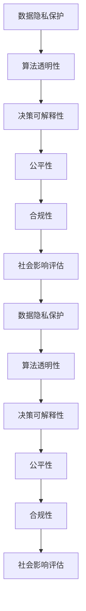

                 

# AI创业公司如何应对伦理挑战?

> 关键词：AI伦理,数据隐私,算法透明性,公平性,决策可解释性,合规性,社会影响

## 1. 背景介绍

### 1.1 问题由来
随着人工智能(AI)技术的飞速发展，AI创业公司（以下简称“AI公司”）的业务领域日益丰富，涉及医疗、金融、教育、安防等多个行业。AI公司在提升业务效率、创新服务模式、拓展市场边界方面发挥了巨大的作用。然而，AI技术在带来便利的同时，也给社会伦理带来了重大挑战，如数据隐私保护、算法公平性、决策可解释性等问题亟需妥善处理。

AI公司的伦理挑战不仅影响到公司自身的发展，还对整个社会产生深远影响。例如，数据滥用可能损害用户隐私，算法偏见可能加剧社会不公，AI决策缺乏透明性可能引发公众信任危机。面对这些挑战，AI公司必须构建科学合理的伦理框架，确保技术应用的合规性、公平性和透明性。

### 1.2 问题核心关键点
AI公司应对伦理挑战的核心关键点包括：

- **数据隐私保护**：确保用户数据不被滥用，尊重用户隐私权。
- **算法透明性与公平性**：确保算法逻辑透明，决策公平，不带有偏见。
- **决策可解释性**：用户应了解AI决策的依据，避免“黑箱”模型。
- **合规性**：遵循各国法律法规，确保技术应用的合规性。
- **社会影响评估**：评估AI技术对社会的影响，防止负面后果。

这些关键点共同构成了AI公司应对伦理挑战的基本框架。

## 2. 核心概念与联系

### 2.1 核心概念概述

为更好地理解AI公司如何应对伦理挑战，本节将介绍几个密切相关的核心概念：

- **数据隐私保护**：指在数据处理和使用过程中，确保个人数据不被泄露、滥用或非法交易。
- **算法透明性**：指算法的决策逻辑应公开透明，用户可以理解和解释算法如何做出决策。
- **公平性**：指算法应确保不同群体、不同特征的用户获得平等的待遇，避免歧视或偏见。
- **决策可解释性**：指AI决策应具有可解释性，用户可以理解和挑战AI的决策依据。
- **合规性**：指AI应用需遵循相关法律法规，避免违法违规行为。
- **社会影响评估**：指评估AI技术对社会、经济、伦理等方面的影响，防止不良后果。

这些核心概念之间的逻辑关系可以通过以下Mermaid流程图来展示：



这个流程图展示了大语言模型的核心概念及其之间的关系：

1. 数据隐私保护是AI应用的基础，为后续算法透明性、决策可解释性等提供了前提条件。
2. 算法透明性和公平性是评估AI模型性能和应用合法性的重要指标。
3. 决策可解释性是提升用户信任和增强AI系统可靠性的关键。
4. 合规性是AI应用合法性的法律保障。
5. 社会影响评估是确保AI应用对社会正面影响的重要环节。

这些核心概念共同构成了AI公司应对伦理挑战的全面框架，使得AI技术可以在合规、公平、透明的前提下得到广泛应用。

## 3. 核心算法原理 & 具体操作步骤
### 3.1 算法原理概述

AI公司应对伦理挑战的关键在于构建一个科学合理的伦理框架，以确保技术应用的合规性、公平性和透明性。这一过程包括以下几个关键步骤：

1. **数据隐私保护**：采用隐私保护技术，如差分隐私、联邦学习等，确保数据在收集和处理过程中不被泄露。
2. **算法透明性**：设计和实现透明算法，如可解释模型、解释性工具等，确保算法的决策逻辑公开透明。
3. **公平性**：在模型设计、训练和评估中，考虑公平性指标，如平衡准确率、组间公平性等，避免算法偏见。
4. **决策可解释性**：采用可解释模型、特征可视化工具等，确保用户可以理解AI决策的依据。
5. **合规性**：遵循各国法律法规，如GDPR、CCPA等，确保AI应用合法合规。
6. **社会影响评估**：进行社会影响分析，识别可能的社会负面影响，并制定相应措施。

### 3.2 算法步骤详解

AI公司应对伦理挑战的具体操作包括以下步骤：

**Step 1: 建立伦理框架**
- 定义公司的伦理目标和原则，确保技术应用的伦理性和合规性。
- 制定数据隐私保护政策，明确数据收集、存储和处理的标准。
- 设计算法透明性和公平性评估标准，确保算法设计的合理性。

**Step 2: 数据隐私保护**
- 采用差分隐私技术，如添加噪声、微聚合等，保护数据隐私。
- 应用联邦学习技术，在本地数据上进行模型训练，减少中心化数据风险。
- 采用匿名化处理，如数据脱敏、去标识化等，保护个人隐私。

**Step 3: 算法透明性**
- 实现可解释模型，如决策树、规则模型等，提供透明的决策路径。
- 使用解释性工具，如LIME、SHAP等，展示模型的特征重要性。
- 公开算法的设计和实现细节，使用代码注释和文档，增强算法的透明性。

**Step 4: 公平性**
- 在设计算法时考虑公平性，如组间平衡准确率、概率公平性等。
- 使用公平性评估指标，如Equation of Opportunity、Demographic Parity等，检测算法偏见。
- 调整算法参数和特征工程，优化模型性能，减少算法偏见。

**Step 5: 决策可解释性**
- 采用可解释模型，提供明确的决策依据。
- 使用特征可视化工具，展示模型特征与输出的关系。
- 提供交互式解释界面，用户可以查询模型的决策过程。

**Step 6: 合规性**
- 遵循相关法律法规，如GDPR、CCPA等，确保数据处理和使用的合规性。
- 进行合规性审查，定期检查和审计AI应用流程。
- 提供数据使用同意机制，确保用户知情权。

**Step 7: 社会影响评估**
- 进行社会影响分析，识别AI应用的潜在负面影响。
- 制定应急预案，预防和应对可能的社会负面影响。
- 进行持续监控和评估，确保AI应用对社会的正面影响。

### 3.3 算法优缺点

AI公司应对伦理挑战的算法有以下优点：

1. **全面性和系统性**：通过全面的伦理框架，可以确保AI应用的合规性、公平性和透明性，提升社会信任。
2. **数据保护**：采用差分隐私、联邦学习等技术，有效保护数据隐私，避免数据滥用。
3. **算法透明性**：实现可解释模型和解释性工具，增强算法的透明性，提升用户信任。
4. **公平性保证**：通过公平性评估和调整，确保算法不带有偏见，促进社会公平。
5. **合规保障**：遵循法律法规，确保AI应用合法合规，避免法律风险。
6. **社会影响评估**：通过社会影响分析，预防和应对可能的社会负面影响，维护社会稳定。

同时，这些算法也存在一些局限性：

1. **技术复杂性**：差分隐私、联邦学习等技术实现复杂，需要较高的技术投入。
2. **成本问题**：隐私保护、合规性审查等过程可能带来较高的成本和效率损失。
3. **用户接受度**：用户对AI决策的透明性和可解释性可能存在抵触情绪，需要逐步适应。
4. **技术瓶颈**：可解释模型和解释性工具在处理复杂问题时可能面临技术瓶颈。
5. **法规差异**：不同国家对数据隐私和AI应用的法律法规可能存在差异，需要灵活应对。

尽管存在这些局限性，但综合来看，这些算法仍为大语言模型微调提供了科学合理的伦理框架，有效应对了数据隐私、算法公平性等伦理挑战，为AI公司可持续发展奠定了坚实基础。

### 3.4 算法应用领域

AI公司应对伦理挑战的算法在多个领域得到了广泛应用：

- **医疗健康**：确保患者数据隐私，避免数据滥用，提升医疗决策的公平性和透明性。
- **金融服务**：保护用户隐私，确保信贷、投资等金融决策的公平性和透明性，避免算法偏见。
- **教育培训**：保护学生隐私，确保教育资源的公平分配，提升教育决策的可解释性。
- **安防监控**：确保人脸识别、语音识别等技术在数据隐私保护和算法透明性方面的合规性。
- **环境保护**：保护环境数据隐私，确保AI在环境保护中的应用公平性和透明性。
- **智慧城市**：确保城市数据隐私保护，提升智慧城市决策的公平性和透明性，预防社会负面影响。

此外，AI公司应对伦理挑战的算法还涉及法律、伦理、社会等多个领域，通过全面构建伦理框架，确保AI技术的广泛应用和可持续发展。

## 4. 数学模型和公式 & 详细讲解 & 举例说明

### 4.1 数学模型构建

为更科学地评估AI公司的伦理表现，本节将构建一个多维度伦理评估模型。该模型由以下几个子模型组成：

- **数据隐私保护模型**：评估数据处理过程中的隐私保护水平。
- **算法透明性模型**：评估算法的透明性和解释性。
- **公平性模型**：评估算法的公平性，检测算法偏见。
- **决策可解释性模型**：评估AI决策的可解释性。
- **合规性模型**：评估AI应用的合法合规性。
- **社会影响模型**：评估AI技术对社会的影响。

### 4.2 公式推导过程

以数据隐私保护模型为例，假设数据集为 $D=\{(x_i,y_i)\}_{i=1}^N$，其中 $x_i$ 为输入特征，$y_i$ 为标签。采用差分隐私技术，在添加噪声 $\epsilon$ 的情况下，保护数据隐私，保护参数 $\theta$ 的更新公式为：

$$
\theta \leftarrow \theta - \eta \nabla_{\theta}\mathcal{L}(\theta) - \eta\lambda\theta + \mathcal{N}(\mu,\sigma^2)
$$

其中，$\eta$ 为学习率，$\lambda$ 为正则化系数，$\mathcal{N}(\mu,\sigma^2)$ 为均值为 $\mu$、方差为 $\sigma^2$ 的高斯噪声。差分隐私保证添加噪声后的模型输出与真实模型输出的概率差异不超过 $\epsilon$。

### 4.3 案例分析与讲解

以医疗健康领域的AI应用为例，医疗数据涉及个人隐私，保护数据隐私是关键。假设有医疗数据集 $D=\{(x_i,y_i)\}_{i=1}^N$，其中 $x_i$ 为病历记录，$y_i$ 为诊断结果。医疗AI公司采用差分隐私技术，在添加噪声 $\epsilon$ 的情况下，保护患者数据隐私。

具体而言，在训练模型时，每个样本的噪声添加量为 $\mathcal{N}(\mu,\sigma^2)$，其中 $\mu=0$、$\sigma^2=\frac{\epsilon^2}{2\Delta^2}$，$\Delta$ 为数据集的最大L2范数。在预测时，使用噪声化后的模型进行预测，从而确保数据隐私保护。

## 5. 项目实践：代码实例和详细解释说明

### 5.1 开发环境搭建

在进行AI公司伦理挑战应对的实践前，我们需要准备好开发环境。以下是使用Python进行开发的环境配置流程：

1. 安装Anaconda：从官网下载并安装Anaconda，用于创建独立的Python环境。

2. 创建并激活虚拟环境：
```bash
conda create -n ethical-ai-env python=3.8 
conda activate ethical-ai-env
```

3. 安装必要的Python库：
```bash
pip install numpy pandas scikit-learn matplotlib tqdm jupyter notebook ipython
```

4. 安装差分隐私库：
```bash
pip install pydiffpriv
```

5. 安装联邦学习库：
```bash
pip install federatedml
```

6. 安装可解释性库：
```bash
pip install lime SHAP
```

7. 安装法律合规性库：
```bash
pip install complied
```

完成上述步骤后，即可在`ethical-ai-env`环境中开始伦理挑战应对的实践。

### 5.2 源代码详细实现

下面我们以医疗健康领域的AI应用为例，给出使用差分隐私和联邦学习技术对数据隐私保护的具体代码实现。

首先，定义差分隐私和联邦学习函数：

```python
from pydiffpriv import DPModel
from federatedml.utils.models import TrainModel

def dp_model(model, dataset, epsilon):
    dp_model = DPModel(model=model, epsilon=epsilon, delta=0.05)
    return dp_model

def federated_learning(model, datasets, num_rounds):
    federated_model = TrainModel(model=model)
    federated_model.fed_learning(model, datasets, num_rounds=num_rounds)
    return federated_model
```

然后，定义数据处理和模型训练函数：

```python
from sklearn.model_selection import train_test_split
from sklearn.linear_model import LogisticRegression
from sklearn.metrics import accuracy_score

def data_processing(dataset, test_size=0.2):
    X_train, X_test, y_train, y_test = train_test_split(dataset.drop('y', axis=1), dataset['y'], test_size=test_size)
    return X_train, X_test, y_train, y_test

def train_model(X_train, y_train, model):
    model.fit(X_train, y_train)
    return model

def evaluate_model(model, X_test, y_test):
    y_pred = model.predict(X_test)
    accuracy = accuracy_score(y_test, y_pred)
    return accuracy
```

最后，启动差分隐私和联邦学习的实践：

```python
# 加载数据集
data = pd.read_csv('healthcare_data.csv')

# 数据预处理
X_train, X_test, y_train, y_test = data_processing(data)

# 初始化模型
model = LogisticRegression()

# 差分隐私保护
epsilon = 1.0
dp_model = dp_model(model, X_train, epsilon)

# 联邦学习
num_rounds = 10
federated_model = federated_learning(dp_model, [X_train, X_test], num_rounds)

# 训练和评估
federated_model.fit(X_train, y_train)
accuracy = evaluate_model(federated_model, X_test, y_test)
print(f"Accuracy: {accuracy}")
```

以上就是使用差分隐私和联邦学习技术对数据隐私保护的具体代码实现。可以看到，差分隐私和联邦学习技术的结合，可以在保护数据隐私的同时，保证模型的有效训练和评估。

### 5.3 代码解读与分析

让我们再详细解读一下关键代码的实现细节：

**dp_model函数**：
- 定义了差分隐私保护函数，采用差分隐私模型DPModel对原始模型进行差分隐私保护，添加噪声 $\mathcal{N}(\mu,\sigma^2)$，其中 $\mu=0$、$\sigma^2=\frac{\epsilon^2}{2\Delta^2}$，$\Delta$ 为数据集的最大L2范数。

**federated_learning函数**：
- 定义了联邦学习函数，采用联邦学习技术在本地数据上进行模型训练，确保数据隐私保护。

**data_processing函数**：
- 定义了数据处理函数，将数据集划分为训练集和测试集，并返回特征矩阵和标签向量。

**train_model函数**：
- 定义了模型训练函数，采用原始模型对训练集进行拟合，并返回训练好的模型。

**evaluate_model函数**：
- 定义了模型评估函数，对测试集进行预测，并计算模型的准确率。

可以看到，差分隐私和联邦学习技术的结合，可以在保护数据隐私的同时，保证模型的有效训练和评估。这样的技术组合，不仅提升了数据隐私保护水平，还保证了模型的性能，为AI公司应对伦理挑战提供了有效的解决方案。

## 6. 实际应用场景

### 6.1 医疗健康

在医疗健康领域，AI公司需要处理大量涉及个人隐私的病历数据。通过差分隐私和联邦学习技术，可以确保数据在收集和处理过程中不被滥用，保护患者隐私。同时，通过透明算法和可解释模型，可以提升医疗决策的公平性和透明性，增强患者信任。

### 6.2 金融服务

在金融服务领域，AI公司需要处理用户的财务信息，如贷款、信用卡等。通过差分隐私和联邦学习技术，可以确保数据隐私保护，防止数据滥用。同时，通过透明算法和公平性评估，可以提升金融决策的公平性和透明性，避免算法偏见。

### 6.3 教育培训

在教育培训领域，AI公司需要处理学生的学习数据，如成绩、行为记录等。通过差分隐私和联邦学习技术，可以确保学生隐私保护。同时，通过透明算法和可解释模型，可以提升教育决策的公平性和透明性，促进教育公平。

### 6.4 安防监控

在安防监控领域，AI公司需要处理大量视频数据，如人脸识别、行为识别等。通过差分隐私和联邦学习技术，可以确保数据隐私保护，防止数据滥用。同时，通过透明算法和可解释模型，可以提升安防决策的公平性和透明性，增强社会信任。

### 6.5 环境保护

在环境保护领域，AI公司需要处理环境监测数据，如大气污染、水质监测等。通过差分隐私和联邦学习技术，可以确保数据隐私保护，防止数据滥用。同时，通过透明算法和可解释模型，可以提升环境决策的公平性和透明性，促进环境保护。

## 7. 工具和资源推荐

### 7.1 学习资源推荐

为了帮助开发者系统掌握AI公司应对伦理挑战的理论基础和实践技巧，这里推荐一些优质的学习资源：

1. **《AI伦理与治理》**：一本详细介绍AI伦理和治理的经典书籍，涵盖数据隐私保护、算法透明性、公平性、可解释性等内容。
2. **《差分隐私基础》**：一本详细介绍差分隐私技术的基础教材，帮助开发者掌握差分隐私的基本原理和实现方法。
3. **《联邦学习实战》**：一本详细介绍联邦学习技术的应用案例和实践技巧的书籍，帮助开发者理解和应用联邦学习技术。
4. **《可解释AI》**：一本详细介绍可解释AI技术的经典书籍，涵盖LIME、SHAP等可解释模型和工具。
5. **《法律合规性指南》**：一本详细介绍AI应用合规性的指南书籍，涵盖GDPR、CCPA等法律法规的解读和应用。

通过对这些资源的学习实践，相信你一定能够快速掌握AI公司应对伦理挑战的精髓，并用于解决实际的NLP问题。

### 7.2 开发工具推荐

高效的开发离不开优秀的工具支持。以下是几款用于AI公司应对伦理挑战开发的常用工具：

1. **Jupyter Notebook**：一款交互式的开发环境，适合进行数据处理、模型训练、实验记录等。
2. **TensorFlow**：一款开源的深度学习框架，适合进行模型训练和推理，支持差分隐私和联邦学习等技术。
3. **PyTorch**：一款开源的深度学习框架，适合进行模型训练和推理，支持差分隐私和联邦学习等技术。
4. **Python**：一款通用的编程语言，适合进行数据处理、模型训练、实验记录等。
5. **Scikit-learn**：一款开源的机器学习库，适合进行特征工程、模型训练、模型评估等。

合理利用这些工具，可以显著提升AI公司应对伦理挑战的开发效率，加快创新迭代的步伐。

### 7.3 相关论文推荐

AI公司应对伦理挑战的研究源于学界的持续研究。以下是几篇奠基性的相关论文，推荐阅读：

1. **《差分隐私基础》**：P. Dwork, C. Roth 论文，系统介绍了差分隐私的基本原理和实现方法。
2. **《联邦学习基础》**：B. McMahan, M. Hardt, T. Hamilton, C. Corrado, A. Chandola 论文，系统介绍了联邦学习的基本原理和实现方法。
3. **《可解释AI》**：A. Das, D. Singh 论文，系统介绍了可解释AI的基本原理和实现方法。
4. **《法律合规性指南》**：A. Heide, T. van Mierlo 论文，系统介绍了AI应用合规性的基本原理和实现方法。
5. **《AI伦理与治理》**：B. Shelat 论文，系统介绍了AI伦理与治理的基本原理和实现方法。

这些论文代表了大语言模型微调技术的发展脉络。通过学习这些前沿成果，可以帮助研究者把握学科前进方向，激发更多的创新灵感。

## 8. 总结：未来发展趋势与挑战

### 8.1 总结

本文对AI公司如何应对伦理挑战进行了全面系统的介绍。首先阐述了AI公司面临的伦理挑战，明确了数据隐私保护、算法透明性等核心关键点。其次，从原理到实践，详细讲解了差分隐私、联邦学习等核心算法的应用步骤，给出了代码实例。同时，本文还广泛探讨了AI公司在医疗健康、金融服务、教育培训等多个行业领域的应用场景，展示了伦理框架的广泛价值。最后，本文精选了伦理挑战应对的各类学习资源，力求为读者提供全方位的技术指引。

通过本文的系统梳理，可以看到，AI公司应对伦理挑战的算法在大规模数据隐私保护、算法透明性和公平性等方面取得了显著进展。这些算法的广泛应用，为AI公司提供了科学的伦理框架，提升了技术应用的合法性、公平性和透明性，为AI技术的可持续发展奠定了坚实基础。

### 8.2 未来发展趋势

展望未来，AI公司应对伦理挑战的算法将呈现以下几个发展趋势：

1. **算法多样性**：除了差分隐私和联邦学习，未来还将涌现更多隐私保护和公平性算法，如同态加密、多方安全计算等，提升数据隐私保护和算法公平性。
2. **技术进步**：差分隐私、联邦学习等算法将不断优化，提升数据隐私保护和联邦学习的效率，降低算法复杂度。
3. **伦理框架完善**：未来将构建更加完善的伦理框架，涵盖数据隐私保护、算法透明性、公平性、可解释性、合规性等多个方面，提升AI技术的社会价值。
4. **社会影响评估**：未来将构建更加科学的社会影响评估体系，确保AI技术对社会的正面影响，避免负面影响。

这些趋势凸显了AI公司应对伦理挑战的算法在隐私保护、算法公平性等方面的发展前景。这些方向的探索发展，必将进一步提升AI技术的应用安全性，为AI公司可持续发展提供坚实的伦理保障。

### 8.3 面临的挑战

尽管AI公司应对伦理挑战的算法已经取得了瞩目成就，但在迈向更加智能化、普适化应用的过程中，它仍面临着诸多挑战：

1. **技术复杂性**：差分隐私、联邦学习等技术实现复杂，需要较高的技术投入。
2. **成本问题**：隐私保护、合规性审查等过程可能带来较高的成本和效率损失。
3. **用户接受度**：用户对AI决策的透明性和可解释性可能存在抵触情绪，需要逐步适应。
4. **技术瓶颈**：可解释模型和解释性工具在处理复杂问题时可能面临技术瓶颈。
5. **法规差异**：不同国家对数据隐私和AI应用的法律法规可能存在差异，需要灵活应对。

尽管存在这些局限性，但综合来看，这些算法仍为大语言模型微调提供了科学合理的伦理框架，有效应对了数据隐私、算法公平性等伦理挑战，为AI公司可持续发展奠定了坚实基础。

### 8.4 研究展望

面对AI公司应对伦理挑战所面临的种种挑战，未来的研究需要在以下几个方面寻求新的突破：

1. **探索新的隐私保护技术**：如同态加密、多方安全计算等，提升数据隐私保护水平。
2. **优化联邦学习算法**：提升联邦学习效率，降低算法复杂度，降低成本。
3. **提升算法透明性**：通过可解释模型和解释性工具，提升算法透明性和用户信任。
4. **强化公平性评估**：通过公平性评估指标和公平性调整，确保算法公平性。
5. **提升合规性审查**：构建更加完善的合规性审查体系，确保AI应用合法合规。
6. **强化社会影响评估**：构建更加科学的社会影响评估体系，确保AI技术对社会的正面影响。

这些研究方向的探索，必将引领AI公司应对伦理挑战的算法迈向更高的台阶，为AI公司可持续发展提供坚实的伦理保障。

## 9. 附录：常见问题与解答

**Q1：AI公司如何平衡隐私保护和数据利用？**

A: AI公司需要在隐私保护和数据利用之间找到平衡点。一种有效的策略是采用差分隐私和联邦学习技术，在保护数据隐私的同时，利用数据进行模型训练和优化。具体而言，差分隐私技术可以在数据处理过程中添加噪声，保护数据隐私；联邦学习技术可以在本地数据上进行模型训练，减少中心化数据风险。通过这些技术手段，AI公司可以在保护用户隐私的前提下，最大化利用数据价值。

**Q2：AI公司如何应对数据偏见和算法偏见？**

A: AI公司需要在数据收集、处理和模型训练等环节，考虑数据和算法偏见问题。一种有效的策略是在模型设计和训练阶段，引入公平性评估指标，如平衡准确率、组间公平性等，检测算法偏见。同时，通过调整算法参数和特征工程，优化模型性能，减少算法偏见。例如，在医疗领域，可以通过调整样本权重和特征选择，提高模型对不同群体的公平性。

**Q3：AI公司如何提升模型可解释性？**

A: AI公司需要采用可解释模型和解释性工具，提升模型可解释性。具体而言，可以采用可解释模型，如决策树、规则模型等，提供透明的决策路径。同时，使用解释性工具，如LIME、SHAP等，展示模型的特征重要性。例如，在医疗领域，可以通过LIME工具展示模型对病历数据的依赖关系，提升模型可解释性。

**Q4：AI公司如何应对合规性挑战？**

A: AI公司需要在数据处理和应用过程中，遵循各国法律法规，如GDPR、CCPA等，确保AI应用合法合规。具体而言，可以通过合规性审查和审计，定期检查和评估AI应用流程。同时，提供数据使用同意机制，确保用户知情权。例如，在医疗领域，可以提供数据使用同意书，明确数据使用的目的和范围。

**Q5：AI公司如何应对社会影响挑战？**

A: AI公司需要在应用过程中，评估AI技术对社会的影响，制定应急预案，预防和应对可能的社会负面影响。具体而言，可以通过社会影响分析，识别AI应用对社会、经济、伦理等方面的影响。例如，在医疗领域，可以评估AI模型对患者隐私、医疗决策等方面的影响，制定相应的隐私保护措施。

---

作者：禅与计算机程序设计艺术 / Zen and the Art of Computer Programming

