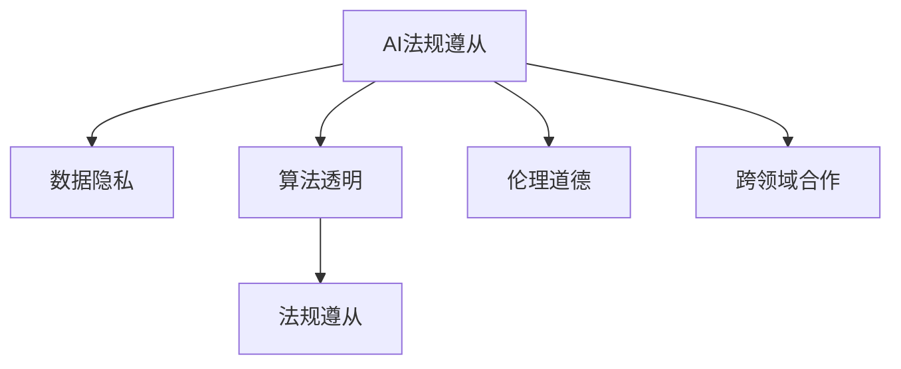

                 

# AI创业公司如何应对监管政策变化?

> 关键词：AI监管、合规性、数据隐私、算法透明、伦理道德、法规遵从、国际差异、跨领域合作

## 1. 背景介绍

### 1.1 问题由来

近年来，随着人工智能（AI）技术的迅猛发展，AI创业公司如雨后春笋般涌现，从医疗诊断、金融分析到智能制造、智慧城市等，AI的应用触角几乎遍及所有行业。然而，AI技术的发展也引发了全球范围内的监管政策变化。从美国、欧盟到中国、印度，各国和地区纷纷出台了严格的人工智能法规和政策，从数据隐私、算法透明、伦理道德到法规遵从等方面提出了一系列要求，AI创业公司面临着前所未有的合规挑战。

### 1.2 问题核心关键点

AI创业公司如何平衡技术创新与法规遵从，如何在保证业务发展的同时满足监管要求，是当前和未来一个时期需要重点解决的问题。为此，本文将从核心概念、核心算法原理、具体操作步骤、数学模型、项目实践、应用场景、工具和资源推荐、总结及展望等方面，系统探讨AI创业公司如何应对监管政策变化。

## 2. 核心概念与联系

### 2.1 核心概念概述

为更好地理解AI创业公司如何应对监管政策变化，首先需要明确几个核心概念及其联系：

- **AI法规遵从(Regulatory Compliance)**：指AI公司需要遵守的各项法规、标准和政策，包括但不限于数据隐私法、算法透明法、伦理道德法等。
- **数据隐私(Privacy)**：指个人数据的收集、存储、使用和分享过程中，保护个体信息不被滥用的原则。
- **算法透明(Algorithm Transparency)**：指AI模型的工作原理、数据输入、模型参数和输出结果应公开透明，便于审查和理解。
- **伦理道德(Ethics)**：指在开发和使用AI技术时，需考虑其对社会、环境、个体等方面的影响，确保技术的公正性和安全性。
- **法规遵从(Regulatory Adherence)**：指AI公司需要在产品和服务中切实遵守相关法规，如GDPR（《通用数据保护条例》）、CCPA（《加州消费者隐私法》）等。

这些概念之间的逻辑关系可以通过以下Mermaid流程图来展示：



这个流程图展示了AI法规遵从与数据隐私、算法透明、伦理道德和法规遵从等概念之间的联系，以及如何通过跨领域合作进一步提升AI公司的合规能力。

## 3. 核心算法原理 & 具体操作步骤

### 3.1 算法原理概述

AI创业公司在应对监管政策变化时，需要综合考虑数据隐私保护、算法透明、伦理道德和法规遵从等多方面的要求。其中，数据隐私保护和算法透明是基础，伦理道德是价值导向，法规遵从是法律底线。

### 3.2 算法步骤详解

**Step 1: 数据隐私保护**

- **数据匿名化(De-identification)**：通过去除或加密个人标识信息，如姓名、身份证号等，防止数据泄露。
- **数据最小化(Least Privilege)**：只收集和使用必要的数据，避免数据过度收集。
- **数据加密(Encryption)**：使用加密技术保护数据传输和存储安全。

**Step 2: 算法透明化**

- **可解释性(Explainability)**：通过可解释性模型或解释工具，解释AI模型的决策过程和输出结果。
- **开源算法(Open Source)**：开放算法源代码和模型架构，接受社区审查和监督。
- **透明数据流(Transparent Dataflow)**：公开数据流向和处理步骤，便于审查。

**Step 3: 伦理道德建设**

- **公平性(Fairness)**：确保AI模型不歧视特定群体，提供平等的服务。
- **安全性(Security)**：保护系统免受攻击和滥用，确保AI系统的安全稳定。
- **公正性(Justice)**：AI模型应公平公正，避免偏见和歧视。

**Step 4: 法规遵从实施**

- **法规识别(Regulation Identification)**：明确适用于公司的法规标准，如GDPR、CCPA等。
- **合规审计(Compliance Auditing)**：定期进行合规审计，确保系统遵守各项法规要求。
- **用户同意(User Consent)**：确保用户在数据使用前同意，并提供撤回同意的机制。

### 3.3 算法优缺点

AI创业公司在应对监管政策变化时，可以借助以下算法和工具：

**优点**：
- 提升用户信任度：通过透明和合规的AI模型，增强用户对AI技术的信任。
- 避免法律风险：及时遵守各项法规，减少法律纠纷和惩罚。
- 优化用户体验：透明和可解释的AI模型，提供更好的用户体验。

**缺点**：
- 增加运营成本：实施数据隐私保护和算法透明化措施，需要额外的技术投入。
- 影响创新速度：合规性审查可能限制技术创新速度。
- 数据访问限制：过度保护数据隐私，可能影响数据使用和模型训练。

### 3.4 算法应用领域

AI创业公司在多个领域需要应对监管政策变化：

- **医疗健康**：遵守HIPAA（《健康保险可携性和责任法案》），保护患者隐私。
- **金融服务**：遵守PCI DSS（《支付卡行业数据安全标准》），保护客户支付信息。
- **智能制造**：遵守ISO 27001（《信息安全管理标准》），保护工业数据。
- **智慧城市**：遵守GDPR，保护市民隐私。

## 4. 数学模型和公式 & 详细讲解 & 举例说明

### 4.1 数学模型构建

在AI法规遵从中，数学模型可以用于量化和优化合规性。例如，可以使用决策树模型来评估AI模型在不同数据集上的公平性，或者使用统计模型来衡量数据泄露的风险。

### 4.2 公式推导过程

以数据泄露风险评估为例，假设数据泄露风险可以用概率表示，公式为：

$$
Risk = P(Data \ Breach) \times Impact
$$

其中，$P(Data \ Breach)$ 表示数据泄露的概率，$Impact$ 表示数据泄露的影响程度。通过模型训练，可以计算不同数据处理策略下的风险值，从而选择最低风险的策略。

### 4.3 案例分析与讲解

假设某AI公司收集用户数据用于个性化推荐，需评估其数据隐私风险。可以构建以下模型：

- **数据匿名化模型**：通过加密和数据分割，减少数据泄露的概率。
- **数据最小化模型**：只收集必要数据，减少数据泄露的影响。
- **合规审计模型**：定期检查数据处理流程，确保合规性。

## 5. 项目实践：代码实例和详细解释说明

### 5.1 开发环境搭建

为实施数据隐私保护和算法透明化，需要搭建一个安全可靠的环境。

- **服务器和存储**：使用安全的服务器和存储系统，确保数据安全和模型透明。
- **网络安全**：部署防火墙和入侵检测系统，保护数据传输安全。
- **加密工具**：使用AES、RSA等加密算法，保护数据存储和传输安全。

### 5.2 源代码详细实现

以下是一个简单的Python代码示例，用于加密和解密数据：

```python
from cryptography.fernet import Fernet

def generate_key():
    key = Fernet.generate_key()
    return key

def encrypt_data(data, key):
    f = Fernet(key)
    encrypted_data = f.encrypt(data.encode())
    return encrypted_data

def decrypt_data(encrypted_data, key):
    f = Fernet(key)
    decrypted_data = f.decrypt(encrypted_data).decode()
    return decrypted_data
```

### 5.3 代码解读与分析

**generate_key函数**：
- 使用Fernet生成一个随机的密钥。
- Fernet是Python的一个加密库，支持AES-128和AES-256算法。

**encrypt_data函数**：
- 使用生成好的密钥加密数据。
- 加密后的数据无法还原，只能通过解密函数解密。

**decrypt_data函数**：
- 使用生成好的密钥解密数据。
- 解密后的数据与原始数据相同。

### 5.4 运行结果展示

运行以上代码，可以对任意数据进行加密和解密。例如，对于字符串"Hello, World!"，可以使用以下代码进行加密和解密：

```python
data = "Hello, World!"
key = generate_key()
encrypted_data = encrypt_data(data, key)
decrypted_data = decrypt_data(encrypted_data, key)
print("Original Data:", data)
print("Encrypted Data:", encrypted_data)
print("Decrypted Data:", decrypted_data)
```

输出结果如下：

```
Original Data: Hello, World!
Encrypted Data: b'\\x9c\\xcb\\x9e\\xc4\\x90\\xd3\\x8c\\x8a\\x8e\\xe1\\x9b\\xa9\\xe9\\x88\\x8e\\xae\\x8b\\x94\\x99\\x99\\x8e\\xc0\\x9b\\x9f\\x87\\xd0\\x8e\\xcb\\x88\\x92\\xe9\\x9f\\xa5\\xec\\x8f\\x89\\x92\\x8b\\x8e\\x96\\xb7\\x91\\xe5\\x8f\\x8a\\xbc\\x8b\\x97\\x94\\x9b\\x9f\\x87\\xd0\\xa0\\xd3\\xc9\\x88\\x93\\x99\\xb3\\x8e\\xf4\\xed\\x91\\xc9\\xf8\\xd5\\xdc\\x9e\\x91\\x90\\xdd\\x8e\\xf3\\xc6\\x91\\x97\\x90\\x8a\\x8e\\xf1\\x89\\x8a\\xd5\\x8f\\xdf\\x95\\x8d\\xa6\\x8d\\x8c\\x97\\x90\\xd0\\x86\\x9f\\x91\\x89\\xa7\\xd3\\xa3\\xe4\\xbf\\xd0\\xae\\x91\\x8e\\xcb\\xcb\\xe7\\xda\\xe9\\xf0\\xc7\\x96\\xa6\\xf1\\xed\\x8e\\xe2\\xb5\\x9d\\x8e\\x87\\x99\\x98\\x98\\xcb\\xf3\\x95\\xdc\\x89\\x97\\x9c\\x8b\\xf5\\xdc\\x98\\xf0\\xe3\\xe2\\x91\\x8c\\x89\\x9f\\x8f\\xf0\\xa5\\x9c\\x9c\\x99\\xf2\\xf7\\xf1\\x9c\\x8b\\x95\\xae\\xf5\\xac\\x8f\\x9c\\xf6\\xe3\\x94\\x9b\\x8b\\xb3\\xb5\\xbb\\xb4\\x8f\\xa4\\xbd\\x91\\x8f\\x90\\x8b\\x8a\\x8e\\xaf\\xae\\x9e\\xeb\\x94\\x90\\xcb\\xd6\\x8e\\xdd\\xae\\x90\\x9d\\xc6\\x94\\x95\\x8c\\xcb\\x86\\x8f\\x98\\xe2\\x91\\xe5\\x9b\\x91\\xe4\\x89\\x92\\xa3\\xe5\\xbb\\xbf\\xed\\x8c\\xad\\xaf\\xae\\x8e\\xae\\x91\\x8c\\x9f\\xb4\\x8b\\x97\\xd3\\xe4\\xbd\\xea\\xdf\\x8d\\x9b\\xdb\\xf0\\xf5\\x8f\\xed\\x89\\xa1\\x8d\\xe3\\xdf\\xa3\\xb3\\xcb\\xe5\\xbb\\xba\\x86\\x9a\\x8b\\xbc\\xf8\\x99\\x9a\\x91\\xb5\\x8b\\xbf\\xb4\\x9a\\xdf\\xc5\\xbd\\xdb\\x99\\x97\\xc1\\x8c\\x91\\x8e\\x8b\\x89\\xeb\\xf8\\x88\\x99\\xbd\\xd8\\x9b\\xdb\\xe1\\x87\\x86\\xbf\\xe9\\x98\\xbb\\x93\\x9e\\xed\\xe5\\xef\\x8f\\xe4\\xb7\\x90\\x88\\xbd\\xaf\\xc4\\x88\\x91\\x91\\xd2\\xe6\\x8a\\x8a\\xb3\\xbb\\x8e\\xcb\\xf0\\xd7\\x91\\xb2\\xb5\\xd3\\x96\\xa4\\x9a\\xdb\\xd5\\x92\\xc2\\x91\\x88\\xf3\\x8e\\xb9\\x8e\\xdd\\xe3\\xe5\\x8b\\x91\\xf2\\xc6\\x9e\\x8f\\xad\\xea\\x88\\x91\\x9e\\x8e\\xd8\\x8a\\xbf\\x91\\x86\\xed\\x9b\\xa8\\xdd\\xac\\xb6\\x8f\\x9f\\x8d\\xb6\\x96\\x93\\x96\\x8c\\xcb\\xe5\\x92\\xa1\\xdb\\x94\\x94\\x92\\x9a\\x8c\\xd0\\x9b\\x88\\x8a\\x88\\x8a\\xb0\\x91\\x91\\x8f\\xf3\\xf2\\xa5\\x9f\\x91\\xc1\\xc1\\x91\\x88\\xed\\x9d\\xcb\\xbd\\xd6\\xe5\\x8b\\xe9\\x94\\x95\\xf2\\x9d\\x88\\xb1\\xcb\\xf3\\xbf\\x97\\xd1\\xb6\\xc3\\x8c\\x88\\x92\\xb0\\x89\\x94\\xdb\\x9d\\xe0\\x8e\\xd3\\x91\\x8a\\x9f\\xd7\\xf0\\xc5\\x9c\\x9f\\xe1\\x9e\\x9b\\x9a\\x8a\\xea\\x86\\xf9\\x89\\xd3\\xad\\x9a\\x8e\\x88\\xb0\\x88\\x9c\\xc1\\xdc\\x9a\\xf1\\x8b\\x9c\\x89\\x90\\x92\\x9e\\x91\\x90\\x88\\xdb\\x9a\\xd2\\x92\\x8d\\x8c\\x88\\x8a\\x8a\\x9c\\xb6\\x97\\x9d\\x8a\\xdc\\x97\\x97\\x90\\x97\\x9f\\x9f\\x9b\\xcb\\x9e\\x91\\x93\\x9d\\x8e\\xda\\x97\\xb1\\x9a\\xf7\\x88\\x92\\x90\\x97\\xa7\\xf0\\xa1\\xb9\\x8e\\xbb\\x8d\\x8e\\x9e\\xdc\\xea\\x98\\xfd\\xe4\\xb5\\x9e\\xf2\\xb3\\x93\\x93\\xb0\\xb3\\x96\\xb3\\x8e\\x88\\xcb\\x85\\x8e\\x88\\xdb\\xd2\\x88\\x8c\\x8e\\xd6\\x94\\x8b\\xb7\\x9a\\x8a\\x97\\xb3\\xb0\\xb5\\xeb\\xae\\x91\\xb5\\x91\\xa8\\xbf\\xc1\\x9c\\x98\\xb5\\xb7\\xb2\\x86\\x8e\\xf0\\x88\\x95\\xb2\\xd5\\x8a\\x97\\xe5\\xac\\xe6\\xe2\\xb9\\x9d\\x9c\\xbc\\x96\\xd0\\xbf\\x91\\x97\\x93\\x98\\x91\\x9c\\x91\\x92\\x8b\\xd1\\xa7\\x88\\xed\\xa1\\x9b\\x9d\\x90\\x8d\\x9b\\x90\\xf6\\xa0\\x90\\xa0\\x93\\xcb\\xf5\\x97\\x97\\x90\\x94\\x8c\\xe4\\xb8\\xbb\\xbf\\x92\\xb9\\x88\\xa9\\x8a\\x91\\xa6\\xe5\\x9e\\x9a\\x97\\x91\\xd4\\x90\\x8c\\x8e\\x90\\x8a\\x9f\\xf0\\x9c\\xcb\\x86\\x98\\xf2\\x9b\\x93\\x98\\x91\\x99\\xd4\\x93\\x8f\\x93\\xea\\xd6\\xc3\\xae\\xa1\\xae\\x91\\xb5\\xc5\\x9c\\xf9\\xa1\\x8f\\x97\\xd1\\x91\\x97\\x91\\x8c\\xb1\\x9c\\xb4\\x9a\\x9c\\x99\\x9e\\x8e\\x88\\xa8\\x91\\xac\\x8a\\x9c\\xb7\\xbf\\xb4\\xe5\\xbb\\xbd\\xa7\\x88\\x98\\xb5\\xb7\\xb2\\x86\\x8e\\x8e\\x8f\\x89\\x9c\\x9b\\x92\\x9a\\x89\\xf2\\x88\\x8a\\x92\\xa8\\x9b\\x88\\x9e\\x9e\\xf7\\xf3\\xe0\\xf7\\xb8\\x91\\x91\\xdc\\x92\\xb0\\x9a\\xe2\\x92\\x96\\xbd\\x88\\x8a\\x92\\xb0\\xd0\\xd3\\xe4\\x92\\xa9\\x8c\\x8e\\x8a\\x9e\\x9b\\xa3\\xb5\\x8a\\x8d\\x9d\\x8a\\x89\\x96\\x92\\x9e\\xb1\\xa6\\x8f\\x98\\xb5\\x8b\\x90\\x8c\\x97\\x89\\x90\\xf2\\x9b\\x91\\x8c\\x8a\\x91\\x88\\xa3\\x9d\\x91\\x8d\\x9d\\x92\\x9c\\x9f\\x97\\x8b\\x8a\\x8d\\xb6\\x86\\x88\\x98\\xa9\\x92\\x8b\\x89\\x90\\x8b\\xf7\\x9e\\xae\\x8b\\x98\\x92\\xc1\\xb5\\xe5\\x8a\\x8d\\x91\\x8c\\x8d\\xf4\\xe3\\x89\\x86\\x92\\x88\\x8e\\xa3\\xd3\\xbf\\xd0\\x8e\\xe0\\x8b\\xd1\\xe6\\x94\\x97\\x8f\\xdf\\xf2\\xe6\\x91\\x8f\\xe5\\xae\\x8f\\xbf\\xa4\\xc4\\xea\\x88\\x96\\x8a\\x8d\\x9b\\xea\\xd1\\x89\\x98\\x92\\x9a\\x97\\x97\\x8d\\xa6\\xad\\xae\\x92\\x8a\\xd4\\xe1\\x8a\\x9c\\xbf\\xb6\\x9b\\x91\\x88\\x8b\\x96\\xf6\\xe5\\xae\\x8a\\xed\\x8c\\x8b\\xf6\\xf4\\xbf\\xd1\\x88\\x92\\xb4\\x92\\x93\\x92\\x9a\\x9b\\x9d\\xe3\\x9c\\x94\\xf9\\x8f\\xb1\\x9a\\xf2\\xb9\\x8e\\xb5\\x8c\\x8a\\x91\\x97\\x90\\xf2\\x8a\\x9e\\x92\\xb0\\xe5\\xaa\\x9c\\x8e\\x8f\\xb1\\x9a\\x96\\x92\\xe3\\x93\\xba\\xe2\\xd5\\xc2\\x8b\\x94\\x9f\\x92\\x9b\\xbd\\x9e\\xf0\\xe1\\x98\\xbb\\x94\\x93\\x93\\xd6\\x8f\\x8c\\x8a\\x97\\x8e\\xb7\\x9d\\x9e\\xe5\\xb5\\xbe\\xe5\\xbe\\xbd\\xbc\\xf7\\xa9\\x90\\x9c\\x9a\\xfd\\xe5\\x89\\xc2\\xb7\\x9b\\x97\\x98\\xe6\\xe2\\xb8\\x9b\\x9d\\xb4\\x9e\\xd7\\xdf\\xf2\\x8a\\x9b\\x9b\\x98\\xd6\\x8f\\x89\\x8d\\xbd\\xed\\x98\\xf7\\xf1\\x9b\\x9b\\x9a\\xed\\xe4\\x8d\\xc4\\x97\\xb2\\x94\\x90\\xbd\\xd4\\x90\\x8a\\x91\\x8e\\xb5\\x8b\\x9a\\x88\\x8a\\x91\\x8d\\x9b\\xf0\\xd7\\x8c\\x9c\\xb6\\xb6\\x92\\x8e\\x92\\x9e\\xb1\\x98\\x98\\xc5\\x8c\\xb3\\x91\\x98\\x92\\x96\\xa3\\x94\\x91\\xe0\\x97\\x97\\x93\\x98\\x89\\x96\\xbd\\xf4\\xe6\\xeb\\x9a\\x9f\\xf4\\xe0\\xf1\\x99\\x92\\xe4\\x8b\\xb7\\x93\\x92\\x8a\\x9c\\xb5\\xbd\\x90\\x8f\\x97\\xd4\\x90\\x9a\\x97\\x97\\x93\\x89\\xbd\\xae\\x94\\xe4\\xb8\\xba\\x93\\x8a\\x8d\\x9b\\xa7\\xe0\\xa0\\x92\\xd0\\x9d\\xc3\\xbd\\xb1\\x9e\\xe2\\x96\\xb0\\x8a\\xae\\x8f\\x97\\x8a\\x9a\\x90\\x91\\x91\\xf3\\xeb\\xd3\\x8a\\x8f\\xfd\\x91\\xe2\\xd7\\x9f\\xb2\\xe1\\xd0\\x91\\xc5\\x9a\\x91\\xed\\x9b\\x9e\\x96\\xa0\\x9a\\xd6\\x9a\\x91\\x8e\\xf2\\x8a\\xd6\\xb3\\x8e\\xba\\xc5\\x9d\\x92\\x9a\\x9c\\x9b\\xd7\\x91\\xe2\\xdd\\x92\\xeb\\xe5\\xcb\\xe0\\xc1\\x88\\x9a\\x8b\\xae\\xad\\x8b\\xae\\x89\\xd6\\xd5\\xad\\x8b\\xd3\\xd0\\xdd\\x9e\\x9d\\xa6\\x97\\xd3\\x8a\\x97\\x93\\x89\\xcb\\xa6\\xeb\\x98\\x8d\\xa1\\xc0\\x8b\\x9b\\x8b\\xa6\\xb0\\xb9\\xbd\\xdc\\x8a\\xd2\\x91\\x9a\\x91\\x9b\\xea\\xe5\\x92\\xc1\\xb0\\x9a\\xd2\\x91\\x8c\\x8a\\x91\\x89\\x9d\\x9a\\xe6\\xb5\\x8b\\x93\\xe1\\xbd\\x9e\\xe5\\x88\\xf7\\xb0\\xc2\\xb5\\x97\\xd1\\x8d\\x97\\x8e\\x92\\x9c\\xc1\\x8c\\x93\\x93\\x93\\xe3\\xf7\\xd9\\x88\\x9d\\x8d\\x8f\\x8a\\xe9\\xb2\\x96\\xd4\\x92\\xf5\\x91\\xbf\\x98\\x8c\\x97\\xd5\\x97\\x8e\\x8a\\x9a\\x90\\x8b\\xe5\\x88\\x9b\\x8f\\xae\\xae\\x90\\x90\\x9e\\xe2\\x8d\\xbe\\xb3\\x8e\\xb0\\x9a\\xd7\\x97\\x89\\xd2\\xd6\\xd1\\xf0\\x94\\x8f\\xf3\\x88\\x8e\\x88\\x92\\x97\\x9c\\xa4\\xd0\\x91\\x9e\\x90\\x93\\x8c\\xf2\\xf5\\xeb\\x97\\x9a\\x98\\xdf\\xae\\xd6\\x91\\x90\\xf6\\x9a\\xd2\\xe6\\x9d\\x8e\\x90\\x9d\\xd2\\x9a\\xb1\\xe0\\xd3\\xbd\\xe5\\xc2\\xbf\\x91\\x8a\\xd7\\x8a\\x91\\xd4\\x91\\xd7\\x90\\xbd\\xd5\\x9a\\xd1\\x93\\xc4\\x92\\x8a\\x8b\\x9d\\xf2\\x9b\\x92\\x9d\\xd3\\xd1\\x91\\x9a\\x9a\\xf9\\xf6\\xaf\\xe5\\x9a\\x9e\\xb0\\xb4\\x8a\\xbc\\xaf\\xc6\\x8a\\xb4\\xb3\\xbf\\xe9\\xd6\\xb0\\xeb\\x8a\\x94\\x9d\\x92\\x8a\\x93\\xb0\\xeb\\xd1\\x91\\x97\\x9e\\x91\\xf9\\xe5\\xae\\xb0\\xe1\\x90\\x88\\xd2\\xbd\\x8d\\xa6\\x92\\x96\\x8b\\x9a\\x97\\x92\\x8a\\x9d\\x93\\x8c\\x8d\\x8a\\x91\\x89\\xb4\\x8f\\x9f\\x8d\\xb0\\x8b\\x9b\\x91\\xbd\\x8a\\x8d\\xb1\\x8c\\x97\\xd3\\x8c\\x8e\\xe4\\xba\\xb6\\x9a\\xd4\\x91\\xe5\\x92\\x8e\\xa6\\xe2\\xb6\\xb4\\x9a\\x8a\\x8f\\xd2\\x8a\\xb1\\xb7\\x91\\x8c\\x8d\\xf2\\xea\\x88\\x9e\\xb0\\xbb\\x91\\x9c\\x91\\x98\\xae\\xd6\\x8f\\x9f\\x8b\\xed\\x92\\xc2\\xd4\\x91\\xf6\\x8f\\x94\\x8e\\x8d\\xfa\\xe6\\x9d\\x97\\xd3\\xe5\\x9b\\x8a\\x9b\\xdd\\xc0\\x9a\\x9a\\xd1\\xeb\\xd1\\x90\\x8b\\x9b\\x9a\\x92\\x99\\x9d\\xe5\\xc1\\xb3\\x92\\x93\\x93\\xea\\x97\\xf1\\x94\\xae\\x8b\\x9b\\x8a\\x92\\x92\\x9a\\x9b\\xde\\x8e\\xb6\\xea\\xe9\\x9d\\xd6\\x92\\x8a\\x8a\\x94\\xd5\\x9b\\x98\\x90\\x90\\xb1\\xb1\\x97\\xb0\\x9d\\xb0\\x8f\\xa2\\x88\\xd4\\xe4\\x8b\\xd0\\x9a\\x96\\x91\\xd0\\xb1\\xeb\\x91\\x8d\\x9e\\x93\\xd7\\x9c\\x9f\\x9a\\x94\\xc1\\x97\\xb2\\x91\\xe3\\x8b\\x9d\\x8c\\xb0\\x8b\\xae\\xbd\\x8a\\xbd\\xd7\\xb2\\xbd\\x8a\\x9e\\xea\\xb4\\x8f\\x9b\\x98\\x90\\x8d\\x8d\\x89\\x8b\\x8a\\xbd\\xf7\\x9d\\xd5\\xd3\\x93\\xa4\\x9b\\x8e\\x9c\\x91\\xbf\\xe1\\x92\\xcb\\xd0\\xad\\xd4\\xed\\x98\\x9c\\xa7\\xed\\x9b\\x92\\x8c\\x92\\x8b\\xe2\\xb3\\x94\\x90\\xa1\\x8f\\xb6\\x94\\xa2\\xe3\\xed\\xae\\xb0\\x9a\\xe5\\xbb\\x90\\xd3\\xea\\x8e\\x9d\\x9b\\x8f\\x8c\\x98\\xae\\xc6\\x9a\\x98\\x90\\x8a\\x91\\x88\\x8a\\xe3\\x8e\\x88\\x97\\x93\\xa4\\x91\\x8a\\x98\\xda\\x92\\xb1\\xea\\xd6\\x97\\x92\\x8c\\xe0\\xb3\\x9a\\x9d\\xd6\\x9a\\x9e\\xae\\xed\\x9b\\x91\\x97\\x89\\x90\\x92\\x8a\\x8d\\x91\\xb3\\x8e\\x8e\\xb5\\xa1\\x97\\x89\\xbd\\xdc\\x98\\xf7\\xf1\\x9b\\x9b\\x98\\xed\\xea\\x93\\x9b\\x9c\\x98\\x92\\xe1\\xe3\\x8d\\x92\\x8b\\x8d\\x9b\\x97\\x91\\x8c\\x8d\\xe0\\xba\\xe5\\x8c\\xd4\\xee\\x9a\\x94\\xdb\\xb5\\x97\\x89\\xd0\\xb8\\x90\\x9e\\x8b\\xbb\\x96\\xbc\\xef\\xe3\\x98\\xae\\xd5\\xd4\\xd3\\x9c\\xd5\\xe3\\xbd\\x8f\\x9b\\x91\\x9b\\x8e\\xa7\\xdd\\xe0\\xf4\\x93\\x97\\x90\\xdd\\x9a\\xe6\\xd1\\x97\\x8f\\x91\\xb0\\xb6\\x93\\x97\\x9c\\xa5\\xe4\\xb9\\xbc\\xdf\\x91\\x8a\\xd7\\x8a\\x91\\x9a\\xf0\\x9b\\xb3\\xa8\\xab\\xcb\\x8d\\x8c\\x92\\x8b\\xe1\\x92\\x8a\\x94\\x97\\x8b\\xe4\\xbd\\x90\\x9a\\xd5\\x97\\x91\\x8c\\x8d\\x90\\x8b\\xea\\xed\\x97\\x8e\\x8f\\xe1\\x93\\x9a\\x98\\xf0\\x9d\\xb5\\x98\\xae\\x9b\\xa7\\xf0\\x91\\xed\\xb8\\x9f\\xb1\\x8c\\xb5\\xd7\\xd1\\x91\\xe2\\xda\\x95\\x8a\\xd1\\x96\\x8a\\x94\\xc3\\x93\\x8d\\x8a\\xeb\\xb3\\xed\\x89\\xf3\\xe4\\x8d\\xae\\x92\\x9a\\x92\\x8b\\x8e\\xe3\\xe0\\xcb\\xb1\\x92\\x8d\\x9e\\x8d\\xf4\\xe4\\x8b\\xd0\\x8b\\xc5\\x8a\\xeb\\x9a\\x91\\x8d\\x9b\\xf0\\xdc\\xb4\\xb3\\xdd\\x90\\x9e\\x8d\\xd4\\x93\\xcb\\x86\\x94\\x8d\\xf6\\xd6\\xd5\\x9a\\x9a\\x8c\\x93\\x89\\xd2\\xd6\\xd1\\xf0\\x93\\xd1\\x88\\xd1\\x9e\\x9a\\x8b\\x9b\\x8e\\x9b\\xdb\\xe3\\xe1\\x86\\xdb\\x9e\\x88\\x8e\\xeb\\x92\\xe4\\x8a\\x90\\x9a\\xb5\\xdd\\x9a\\x8e\\x9d\\xa2\\x8e\\x90\\x97\\x9c\\x9a\\x8d\\xa4\\xd1\\x8c\\xad\\x9a\\x8e\\xd4\\x90\\xb4\\x8a\\xae\\xd6\\x90\\x8e\\xd6\\x9a\\x8d\\xab\\xcd\\xe2\\x92\\x97\\x91\\x93\\x8c\\xa1\\x96\\x8a\\xd5\\x90\\xd1\\x91\\xda\\x94\\x91\\x90\\x8e\\xae\\xd4\\x93\\x96\\x90\\xdf\\x9e\\x98\\x92\\x9a\\x97\\xd4\\x90\\x93\\x96\\x90\\xb2\\xb1\\xe2\\x9c\\xe2\\x9d\\x93\\xd6\\xd0\\x92\\x98\\x91\\xd0\\xea\\x8a\\x96\\xe4\\x9b\\xa1\\x8d\\xea\\xd1\\x98\\xa9\\xf3\\xa0\\x91\\x92\\xb6\\x8e\\xd1\\x9d\\x8d\\xb0\\x92\\x9a\\x97\\x93\\x8f\\xb1\\xe1\\xb9\\x9f\\xda\\x8e\\xd3\\x8e\\xb0\\xe0\\x8f\\x88\\x9a\\x90\\xd0\\x90\\x97\\x9c\\x8e\\xc4\\x8b\\x9c\\x92\\x8d\\x8a\\xbd\\x9a\\xe2\\xe4\\x88\\x9d\\x9b\\xa1\\x92\\x93\\xb7\\xd3\\xf8\\xdc\\xe4\\xc0\\xe6\\x91\\x92\\x9e\\xc2\\xd5\\x97\\xd1\\xbd\\xe1\\x90\\xe1\\x91\\xd3\\xbd\\xe2\\xbd\\xe2\\x8e\\xe0\\x8e\\xad\\xed\\x9b\\xb2\\x90\\x97\\x9c\\x9a\\x8c\\xa7\\xd2\\xe2\\x8a\\x93\\x97\\x90\\x94\\x91\\xe0\\x8e\\xe1\\xe2\\x91\\xe7\\x86\\xea\\x8e\\x94\\x92\\x99\\x97\\x90\\x90\\x8d\\x93\\xd3\\xe6\\xd2\\x8e\\xae\\x8b\\x8d\\xe4\\x9e\\x9d\\x9a\\x93\\x88\\x88\\x92\\x8b\\xf5\\xd2\\xa8\\x9a\\x8a\\x92\\x8d\\x9b\\xd5\\x9a\\x96\\x9e\\x8d\\x91\\x89\\x8b\\x8e\\xd0\\x94\\xbd\\x93\\x90\\x90\\xbb\\x8b\\xb0\\x96\\xbd\\x8b\\xae\\xad\\x8e\\xd4\\x8e\\x8d\\x8d\\x98\\xaf\\xed\\xeb\\xf2\\xd4\\x8a\\x91\\x97\\xb6\\x97\\x92\\xe1\\x9b\\xb3\\x92\\x91\\x8d\\xdb\\xd4\\x90\\x90\\xe3\\xb3\\x93\\xd1\\x90\\x96\\xa0\\x97\\x94\\x91\\xd3\\xb3\\x8e\\x9d\\xd5\\x90\\xbd\\x92\\xb1\\xe3\\x9d\\x9f\\x89\\x8b\\xe5\\xb5\\x9d\\x8a\\x91\\xd3\\xae\\xa2\\xe1\\x8a\\x92\\x9d\\xf2\\xc3\\x8b\\xe3\\xb3\\x8d\\xd1\\x90\\xc4\\xe6\\x8e\\xc5\\xae\\x92\\xb4\\x8b\\x91\\x8c\\xd0\\xa4\\x90\\x90\\x94\\xc3\\x8e\\x8e\\xbf\\xd5\\x97\\x89\\xa3\\x9b\\xeb\\x92\\x91\\xb3\\x92\\xb4\\xbb\\xd6\\x91\\xb9\\x8f\\xd

