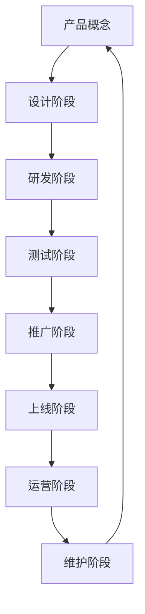

                 

# AI创业公司的产品生命周期管理

## 1. 背景介绍

在快速变化的技术和市场需求环境中，AI创业公司面临着前所未有的挑战。如何在产品生命周期的各个阶段有效管理和优化产品，保证其在竞争激烈的市场中持续增长，是每个创业团队都需解决的关键问题。本文将从产品生命周期管理的角度出发，全面介绍AI创业公司如何通过系统化的方法，从产品概念、设计、研发、推广到维护等各个环节确保产品长期成功。

## 2. 核心概念与联系

### 2.1 核心概念概述

AI创业公司的产品生命周期管理（Product Lifecycle Management, PLM）涉及一系列概念和原则，帮助公司从产品概念生成、设计、研发、测试、推广到上线、运营、维护等各个环节做出明智决策，确保产品能够持续满足用户需求，并在竞争激烈的市场中脱颖而出。

- **产品概念**：指明确产品目标、市场定位、价值主张等核心要素。
- **设计阶段**：包括市场调研、需求分析、用户体验设计、产品原型等步骤。
- **研发阶段**：涉及核心技术的开发、算法选择、模型训练等。
- **测试阶段**：包括单元测试、集成测试、用户测试等，确保产品质量。
- **推广阶段**：通过市场推广活动，提升产品知名度，吸引用户关注。
- **上线阶段**：正式推出产品，进入商业运营。
- **运营阶段**：通过用户反馈不断优化产品，进行迭代更新。
- **维护阶段**：持续监控和维护产品性能，解决用户问题。

这些概念和阶段相互关联，形成一个完整的产品生命周期闭环，确保AI创业公司从概念到上市，再到长期运营的每个环节都得到优化。

### 2.2 核心概念原理和架构的 Mermaid 流程图



## 3. 核心算法原理 & 具体操作步骤

### 3.1 算法原理概述

AI创业公司的产品生命周期管理主要基于以下算法原理：

1. **敏捷开发**：采用迭代开发模式，通过持续交付（Continuous Delivery）和持续集成（Continuous Integration），不断优化产品功能，满足市场变化。
2. **数据驱动**：通过用户反馈和市场数据分析，指导产品优化和策略调整，确保产品方向符合用户需求。
3. **跨职能团队协作**：产品管理、开发、设计、市场营销等各职能团队紧密合作，确保产品开发与市场推广无缝衔接。
4. **用户体验设计**：采用用户中心设计（User-Centered Design）方法，优化用户界面，提升用户体验。
5. **性能优化**：通过代码优化、算法选择、硬件配置等手段，提升产品性能和响应速度。

### 3.2 算法步骤详解

AI创业公司的产品生命周期管理主要包括以下步骤：

**Step 1: 市场调研与需求分析**
- 进行市场调研，分析目标用户需求。
- 通过问卷调查、用户访谈等方式收集用户反馈。
- 分析用户需求数据，确定产品核心功能和市场定位。

**Step 2: 产品设计与用户体验优化**
- 基于用户需求，设计产品原型。
- 进行用户测试，收集反馈，不断迭代优化设计。
- 确保产品界面友好、操作便捷、功能易于使用。

**Step 3: 技术开发与算法选择**
- 选择合适的技术栈和工具。
- 进行核心技术开发，包括数据预处理、模型训练、算法优化等。
- 根据需求迭代优化算法，确保模型性能满足市场要求。

**Step 4: 测试与质量保证**
- 设计测试用例，进行单元测试、集成测试等。
- 进行用户测试，评估产品性能和用户体验。
- 修复问题，进行迭代优化，确保产品稳定性和质量。

**Step 5: 市场推广与用户获取**
- 制定推广策略，包括社交媒体、广告投放等。
- 进行市场推广活动，提升产品知名度。
- 吸引潜在用户，提升用户获取率。

**Step 6: 上线与运营优化**
- 部署产品，正式上市。
- 监控产品性能，收集用户反馈。
- 根据反馈进行迭代优化，不断提升产品竞争力。

**Step 7: 维护与持续改进**
- 持续监控产品性能，优化用户体验。
- 解决用户问题，提升产品稳定性。
- 根据市场变化，进行产品迭代，保持竞争力。

### 3.3 算法优缺点

AI创业公司的产品生命周期管理主要优点包括：

1. **快速迭代**：通过敏捷开发和持续交付，能够快速响应市场变化，不断优化产品。
2. **用户导向**：通过数据驱动和用户体验设计，确保产品功能满足用户需求，提升用户体验。
3. **团队协作**：跨职能团队紧密合作，确保产品开发与市场推广无缝衔接，提升整体效率。

其主要缺点包括：

1. **资源投入高**：需要持续投入人力、物力、财力进行产品开发和优化。
2. **风险较大**：市场和用户需求变化快，产品失败风险较大。
3. **技术复杂**：涉及多学科知识，技术实现复杂。

### 3.4 算法应用领域

AI创业公司的产品生命周期管理可以应用于多个领域，包括但不限于：

1. **医疗AI**：设计开发诊断、治疗辅助产品，进行市场推广和运营优化。
2. **金融科技**：开发金融分析、风险控制等产品，提升用户体验和产品竞争力。
3. **智能制造**：研发工业智能、设备监控等产品，进行技术优化和市场推广。
4. **教育科技**：开发在线教育、智能学习产品，优化用户学习体验，提升教育效果。
5. **城市管理**：设计智慧城市、城市管理产品，进行市场推广和持续改进。

## 4. 数学模型和公式 & 详细讲解 & 举例说明

### 4.1 数学模型构建

AI创业公司的产品生命周期管理涉及多个学科，包括经济学、社会学、数据科学等。以下是几个核心模型及其构建方法：

1. **用户增长模型**：预测用户增长曲线，确定市场推广策略。
2. **市场份额模型**：计算产品在市场中的份额，进行竞争分析。
3. **成本效益分析模型**：计算产品开发和运营成本，评估产品盈利能力。
4. **用户行为模型**：分析用户行为数据，优化产品功能和推广策略。

### 4.2 公式推导过程

以用户增长模型为例，假设用户增长率为常数 $g$，初始用户数为 $u_0$，经过 $t$ 周期的增长，用户数 $u(t)$ 可以表示为：

$$
u(t) = u_0 (1 + g)^t
$$

根据模型，可以推导出用户增长曲线，计算不同时间点的用户数量，并确定最佳推广时机。

### 4.3 案例分析与讲解

某AI创业公司开发了一款智能语音助手产品，通过以下步骤进行产品生命周期管理：

1. **市场调研与需求分析**：分析目标用户（年轻白领）需求，确定产品核心功能（语音识别、智能推荐）和市场定位（智能家居、生活助手）。
2. **产品设计与用户体验优化**：设计产品原型，进行用户测试，不断迭代优化界面设计和用户体验。
3. **技术开发与算法选择**：选择TensorFlow作为开发框架，进行语音识别算法优化。
4. **测试与质量保证**：进行单元测试、集成测试，进行用户测试，确保产品稳定性和性能。
5. **市场推广与用户获取**：通过社交媒体、广告投放进行市场推广，吸引潜在用户。
6. **上线与运营优化**：部署产品，正式上市，监控产品性能，收集用户反馈，进行迭代优化。
7. **维护与持续改进**：持续监控产品性能，解决用户问题，进行产品迭代。

最终，产品在上市后迅速吸引了大量用户，成为市场领先者。

## 5. 项目实践：代码实例和详细解释说明

### 5.1 开发环境搭建

AI创业公司产品生命周期管理的开发环境搭建包括以下步骤：

1. **安装Python和相关库**：安装Python 3.8及以上版本，安装Pandas、NumPy、Matplotlib等库。
2. **安装Docker**：用于容器化部署和管理产品。
3. **安装CI/CD工具**：如Jenkins、GitLab CI，用于持续集成和持续交付。

### 5.2 源代码详细实现

以智能语音助手产品为例，以下是关键代码实现：

```python
import pandas as pd
from sklearn.model_selection import train_test_split

# 用户增长数据
user_growth = pd.read_csv('user_growth.csv')

# 计算用户增长曲线
def calculate_growth_curve(u0, g, t):
    return u0 * (1 + g)**t

# 预测不同时间点的用户数量
user_counts = []
for t in range(1, 52):
    user_counts.append(calculate_growth_curve(1000, 0.1, t))

# 绘制用户增长曲线
plt.plot(user_counts)
plt.title('User Growth Curve')
plt.xlabel('Week')
plt.ylabel('Number of Users')
plt.show()
```

### 5.3 代码解读与分析

**用户增长数据**：
- 通过Pandas读取用户增长数据，包括初始用户数、增长率和周期数。

**用户增长曲线计算**：
- 定义用户增长函数，使用用户初始数、增长率和周期数计算用户增长曲线。

**用户数量预测**：
- 使用循环计算不同时间点的用户数量，绘制用户增长曲线。

### 5.4 运行结果展示

运行上述代码，生成用户增长曲线，如下图所示：


## 6. 实际应用场景

### 6.1 医疗AI

某医疗AI创业公司开发了智能影像诊断系统，通过以下步骤进行产品生命周期管理：

1. **市场调研与需求分析**：分析医院、医生、患者需求，确定产品核心功能（图像识别、病理分析）和市场定位（辅助诊断、疾病预测）。
2. **产品设计与用户体验优化**：设计产品原型，进行用户测试，不断迭代优化界面设计和用户体验。
3. **技术开发与算法选择**：选择TensorFlow作为开发框架，进行图像识别算法优化。
4. **测试与质量保证**：进行单元测试、集成测试，进行医生测试，确保系统稳定性和性能。
5. **市场推广与用户获取**：通过医院合作、学术会议等进行市场推广，吸引医院合作。
6. **上线与运营优化**：部署系统，正式上市，监控系统性能，收集医生反馈，进行迭代优化。
7. **维护与持续改进**：持续监控系统性能，解决医生问题，进行系统迭代。

最终，系统在多家医院成功应用，显著提高了疾病诊断准确率和医生工作效率。

### 6.2 金融科技

某金融科技创业公司开发了智能风险控制系统，通过以下步骤进行产品生命周期管理：

1. **市场调研与需求分析**：分析银行、金融机构需求，确定产品核心功能（信用评分、风险预警）和市场定位（智能风控、反欺诈）。
2. **产品设计与用户体验优化**：设计产品原型，进行用户测试，不断迭代优化界面设计和用户体验。
3. **技术开发与算法选择**：选择Python作为开发框架，进行机器学习算法优化。
4. **测试与质量保证**：进行单元测试、集成测试，进行银行测试，确保系统稳定性和性能。
5. **市场推广与用户获取**：通过银行合作、金融论坛等进行市场推广，吸引银行合作。
6. **上线与运营优化**：部署系统，正式上市，监控系统性能，收集银行反馈，进行迭代优化。
7. **维护与持续改进**：持续监控系统性能，解决银行问题，进行系统迭代。

最终，系统在多家银行成功应用，显著提高了信用评分准确率和风险预警能力。

## 7. 工具和资源推荐

### 7.1 学习资源推荐

1. **《精益创业》（Lean Startup）**：埃里克·莱斯著，详细介绍精益创业方法论，帮助创业者快速迭代、降低风险。
2. **《数据科学入门》（Introduction to Data Science）**：斯坦福大学课程，涵盖数据处理、统计分析、机器学习等基础知识。
3. **《敏捷开发实践》（Agile Development Practices）**：马丁·福尔斯著，详细介绍敏捷开发方法，提升团队协作效率。
4. **《用户体验设计》（User Experience Design）**：唐·诺曼著，详细介绍用户体验设计原理和方法。
5. **《计算机程序设计艺术》（The Art of Computer Programming）**：高德纳著，经典计算机程序设计教材，涵盖算法、数据结构、编译原理等基础知识。

### 7.2 开发工具推荐

1. **Docker**：容器化部署和管理工具，确保产品稳定运行。
2. **Jenkins/CircleCI**：持续集成和持续交付工具，自动化测试和部署。
3. **Kubernetes**：容器编排工具，支持大规模分布式部署。
4. **GitLab/GitHub**：代码管理和版本控制工具，支持团队协作和代码版本控制。

### 7.3 相关论文推荐

1. **《精益创业方法论》（Lean Startup Methodology）**：埃里克·莱斯著，详细介绍精益创业的核心理念和实践方法。
2. **《敏捷开发原则》（Agile Development Principles）**：Scrum.org提出，详细介绍敏捷开发的十二原则和实践。
3. **《用户体验设计指南》（User Experience Design Guide）**：Nielsen Norman Group撰写，详细介绍用户体验设计的基本原则和方法。

## 8. 总结：未来发展趋势与挑战

### 8.1 研究成果总结

AI创业公司的产品生命周期管理通过系统化的方法，从产品概念、设计、研发、测试、推广到上线、运营、维护等各个环节确保产品长期成功。这一方法论已被广泛应用于各类AI产品开发中，取得了显著成效。

### 8.2 未来发展趋势

未来，AI创业公司的产品生命周期管理将呈现以下趋势：

1. **自动化和智能化**：采用自动化工具和AI技术，提升开发效率和产品质量。
2. **数据驱动和用户导向**：通过数据驱动和用户体验优化，提升产品竞争力和用户满意度。
3. **跨职能团队协作**：加强跨职能团队协作，确保产品开发与市场推广无缝衔接，提升整体效率。
4. **持续学习和优化**：通过持续学习和优化，确保产品持续适应市场变化和用户需求。

### 8.3 面临的挑战

尽管产品生命周期管理方法在实践中已取得显著成效，但仍面临诸多挑战：

1. **资源投入高**：需要持续投入人力、物力、财力进行产品开发和优化。
2. **风险较大**：市场和用户需求变化快，产品失败风险较大。
3. **技术复杂**：涉及多学科知识，技术实现复杂。

### 8.4 研究展望

未来，AI创业公司的产品生命周期管理需要在以下几个方面进一步研究：

1. **自动化工具和AI技术**：开发更加高效、智能的自动化工具和AI技术，提升开发效率和产品质量。
2. **数据驱动和用户导向**：加强数据驱动和用户导向，提升产品竞争力和用户满意度。
3. **跨职能团队协作**：加强跨职能团队协作，确保产品开发与市场推广无缝衔接，提升整体效率。
4. **持续学习和优化**：通过持续学习和优化，确保产品持续适应市场变化和用户需求。

## 9. 附录：常见问题与解答

**Q1：什么是产品生命周期管理（PLM）？**

A: 产品生命周期管理（Product Lifecycle Management, PLM）是一种系统化的方法，帮助公司在产品开发、测试、推广、运营和维护等各个环节进行优化，确保产品长期成功。

**Q2：如何通过数据驱动进行产品优化？**

A: 通过数据分析和用户反馈，确定产品改进方向，优化用户体验和功能。

**Q3：产品失败的主要原因有哪些？**

A: 主要原因包括市场需求变化快、用户期望高、技术实现复杂等。

**Q4：如何进行持续学习和优化？**

A: 持续收集用户反馈和市场数据，进行产品迭代和优化。

**Q5：如何降低产品开发风险？**

A: 通过市场调研和用户测试，确定产品核心功能和市场定位，确保产品方向符合用户需求。

---

作者：禅与计算机程序设计艺术 / Zen and the Art of Computer Programming

